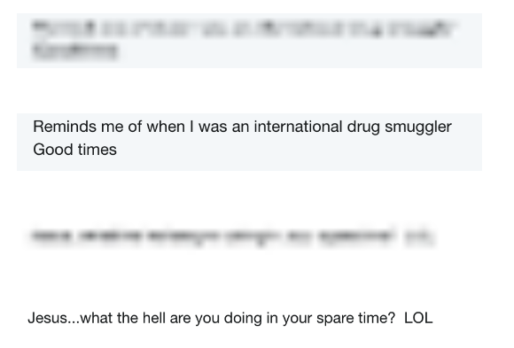

## PART 1: Genesis Block

Soona Amhaz discovered bitcoin while she was an engineering student at the University of Michigan. Today, she is a co-founder and partner at Volt Capital. You can follow her on Twitter @soonaorlater.

### On Value

How much is a life vest worth?\
It can be any size or hue\
Costs around 15 bucks\
Give or take a few.

Now picture yourself in a flood.\
The tag has a different price:\
Everything you’ve ever owned\
In your entire life.

The thing about value is\
It changes with each new dawn.\
Sometimes we see it coming;\
Sometimes it’s a black swan.

So, when we talk about market forces\
That’ll make bitcoin the norm,\
It’s truly no coincidence\
We call it The Perfect Storm.

---

### Introduction
**This a book by cypherpunks about bitcoin**

There are already so many amazing books about bitcoin, ranging from Jimmy Song’s Programming Bitcoin to Mastering Bitcoin by Andreas Antonopoulos, The Bitcoin Standard by Saifedean Ammous and The Little Bitcoin Book by the Bitcoin Collective (including Alena Vranova, who contributed to this anthology as well). These books explain bitcoin’s technical and economic properties so elegantly that we won’t attempt to rehash an introduction to bitcoin.

Instead, this collection aims to complement those narratives by adding more personal perspectives to the shared saga. This book is not a definitive word on any subject. It is about the stories we tell in private. It is a mosaic that explores what we imagine when we talk about bitcoin.

This book explores the notion that bitcoin has become much more than software itself. It grapples with this central question: “Does a bitcoin culture exist?”

Since this is a book about people, it is inherently also about culture. We are all bitcoiners. Almost every woman who contributed to this collection uses bitcoin, helps others learn about bitcoin, owns bitcoin, or contributes directly to the open source projects that make up the bitcoin ecosystem. Sometimes we do it under our own names. Sometimes we don’t. A few women in this collection are involved with cryptocurrency projects beyond bitcoin. Yet they also contribute to underlying research and software development indirectly related to bitcoin.

Throughout three years of reporting on “the space,” I’ve observed and participated in a variety of bitcoin cultures. There’s no single culture related to this software or the habits associated with it. Some bitcoiners, like Nigerian lawyer Faith Obafemi, don’t consider themselves anarchists even if they are cypherpunks. Other contributors to the anthology are more heavily influenced by punk ideologies.

Many women who contributed to this collection have wildly different political, religious, and professional backgrounds. We can’t even agree on whether to capitalize the word “Bitcoin.”

While this book does not attempt to define “bitcoin culture,” it offers accounts from a variety of different user groups. This collection offers a peek at a few voices across the ecosystem that might not be loud on Twitter or on stage at a conference. Plus, bitcoin often reveals its true value in our most private moments.

As such, this book is meant to be shared with people who might not frequent industry spaces. For them, we’ve included brief histories related to the technology called bitcoin.

At the same time, this book is also for any crypto veterans who are curious to hear about fellow bitcoiners beyond their known circles. Many of the anthology’s contributors have shared their personal experiences and perspectives on the technology’s evolution. Rather than fitting any particular stereotype, it’s clear that bitcoiners come in all shapes and sizes.

Many of the contributors to this anthology have a high level of technical skill. However, we wrote this book in a style simplified enough for almost any age and level of digital literacy. Whether it is a short poem or the ancient history of cryptography and timestamps, we hope everyone can find a piece here that clarifies a few little truths and terms related to bitcoin.

**Where I fit in**

Beyond the intention of this anthology, some readers might be curious about its lead editor, myself. (Shout out to Michael McSweeney and the mysterious BitcoinStripper, both of which also contributed editing to this collection.)

I’m a journalist who first learned about bitcoin in 2015 while working with a team of darknet experts trained in elite Israeli military units. They taught me a little about how to use Tor to investigate illicit activities. My manager assigned me a quick story about people buying drugs with this digital currency called bitcoin.

The idea of digital money intrigued me. Not because of the criminal activity, but because of all the other ways I could play with this idea of programmable value in my head, some sci-fi geek version of SimCity behind my eyelids.

After five years working in the Middle East, I initially moved to New York to work as a sex writer. I covered the porn industry, sexual health, gender issues and pop culture. Fast forward to 2017: I’m still living in New York but now working as a tech reporter at Newsweek Media Group. The editor asked if I could help spearhead a new beat focused on fintech startups and blockchain technology.

I still had no idea what bitcoin really was or how it worked. But I was willing to research it until we could make some sense of how to report on it. Several years and a hard tumble down the rabbit hole later, I’ve come to see bitcoin as a tool that could be used to encourage social change. Like any tool, the way its potential manifests in the real world depends entirely on how we wield it.

Personally, I think bitcoin could be useful for journalists who work with teams across borders. We confront all sorts of challenges, whether working as editors in charge of distributed teams or freelancers receiving payments. Reducing friction for such payments subverts the power dynamics between groups involved in international coverage, such as reporters and marginalized subjects like refugees.

Journalists can switch from selling stories about disenfranchised groups to creating stories with them that they can also earn income from, through skilled work. This improves the ethical constructs of production and the quality of the content itself.

That’s just one example. There could be many ways to use bitcoin today as a tool for social change beyond the media industry. In this anthology, we’ll attempt to answer the underlying question: How do we use bitcoin as a tool for social change?

The answer is simple: However the hell we want.

---

_Allie Eve Knox is an erotic performer who has been accepting bitcoin for work in the adult industry since 2014. She moved most of her assets into self-custodied bitcoin solutions in 2017 and joined the crypto startup SpankChain, a payments and camming platform that has introduced hundreds of performers to cryptocurrency._

## Why I Use Bitcoin

Bitcoin, for me, hasn't been about shit posting on Twitter and flexing my maximalist muscles. It hasn't been about shitting on other coins and projects in the space either. It has strictly been about getting paid in a safe and quick manner.

That’s what bitcoin is to me. It is the money I use to put food on the table, not to stroke my “hard money” ego.

When I finished graduate school in 2014, drowning in student loan debt, I entered the sex industry as a cam model. I started performing in porn later on and eventually became a fetish content producer. I’m good at my job and people want to pay me well for it.

But I kept getting shut out of the economy. My PayPal, Cash App, bank accounts, and almost every other peer-to-peer processing account got frozen and banned. I used these accounts to sell panties, custom videos, and accept tributes. So I tried Coinbase. It took very little time to hold the QR code up to my webcam so members could send me payments. This quickly became my primary payment solution.

Then in 2015, the producers for a Showtime show called “DarkNet” interviewed me about using crypto for sex work. I explained bitcoin payments mean no chargebacks, and the member can stay completely anonymous if they choose.

When the show aired in 2016, Coinbase saw me flashing the QR code on TV and talking about how I was violating their “no sex work payments rule.” Then they shut my ass down, too.

So I started using a variety of different wallets and exchanges. When the market went fucking nuts in the winter of 2017, I cashed out about a third of my bitcoin and built my dream house. I was able to pay off all of my debts as well. Bitcoin changed my life and I'm looking forward to the next wave. Someday, I’ll sell my remaining holdings and retire on a beach somewhere.

Until then, the plebs send me bitcoin then beg for more of my craft. I use bitcoin because it is mine to control, and I’ve always been a bit of a goddess who masters her own universe.

---

_Linda Xie is the co-founder of Scalar Capital and was previously a product manager at Coinbase. She came across Bitcoin in 2011, joined Coinbase in 2014, and has educated many newcomers on bitcoin over the years._

### Bitcoin 101 Explainer

I’ve used bitcoin for online purchases, as a store of value, and also as gifts people really appreciate.

Personally, I really like the idea of using bitcoin as a store of value. The idea that there's a percentage of your wealth that can’t be tampered with, inflated or confiscated, is a nice type of security to have.

My family came from China and I always heard stories about why they immigrated to the US. I remember when it came to show-and-tell in school, I asked for a family heirloom to show my class and my parents had to explain we didn’t have any because the government in China confiscated everything from them.

It’s important to know not only the power that governments have over people, but also that governments change and you don’t know what will happen down the road. This is why bitcoin is valuable to me.

**How has being involved with the cryptocurrency industry changed your life?**

Because bitcoin is so global, I’m constantly talking to people all over the world on Twitter and Telegram. So that’s changed my perspective on things to be more global.

In some countries there is high inflation, so people look at bitcoin from an anti-inflation perspective. In other countries, people with unreliable banking services might see bitcoin as a way to access investment opportunities. Some people are even just okay with it being “magical internet money” like a research project or a hobby.

The more I’m in the space, the more I think we shouldn’t just be pushing the narrative of bitcoin as internet gold. It can be a lot of things to a lot of people.

**The different uses of bitcoin**

Bitcoin is a decentralized digital currency. I think part of what makes it difficult for people to understand bitcoin is that it can serve a variety of purposes and mean different things to different people. It can sound like a panacea, which leaves newcomers skeptical. People are often attracted to bitcoin due to a combination of the following properties, some of which overlap.

- Decentralized: Bitcoin is a global peer-to-peer network. There is no centralized entity controlling it, which means that there is no central operator that can be shut down, censored, or that can charge fees. - Permissionless: Anyone can own bitcoin. There is no requirement in the protocol that you must live in a certain location or belong to a certain group. This is in contrast to the fiat financial system where there are many people without bank accounts or who are excluded from both capital markets and basic services, like decent loan options.
- Censorship resistant: No one can limit what you do with your bitcoin. If you want to conduct a transaction, the network will process it. If a government wants to take away all of your money, they can’t just seize it, unlike with bank accounts. Laws differ based on jurisdiction so what is legal in one country can be considered a crime in another. This is becoming more relevant as we see stricter capital controls in some countries.
- Transparent: There is a known supply of 21 million bitcoin that can ever exist in the world and that no one can manipulate. This is extremely appealing to those who do not want any government to have the ability to arbitrarily print more money. Citizens in countries experiencing hyperinflation are often brought up as beneficiaries of this characteristic.
- Global: No one country owns bitcoin, and bitcoin isn’t limited by the physical borders of any country. As more companies start hiring remote workers from around the world, this form of money ensures that it can be sent to anyone in the world.
- Efficient: The technology powering bitcoin is a lot more efficient than much of the financial infrastructure that exists today, at least in terms of time and how many middlemen need approval or fees along the way. Wall Street sees the potential and has begun to both push the “blockchain not bitcoin” narrative and work on permissioned ledgers. In capital markets, settlement costs eat into margins, so there has been talk about security tokens improving efficiency.
- Fast: Right now, it can take several days for your money to transfer. Banks are only open during standard business hours so, if you need money to arrive during off-hours, you could be out of luck. Bitcoin allows someone to send and receive payment quickly.
- Cheap: It’s relatively cheap to send bitcoin to anyone in the world compared to the fees that you’ll have to pay through other services. Remittances is an often-cited example of where there can be major fee savings. The Lightning Network (layer built on top of bitcoin) can enable micropayments so you can envision tipping someone a small amount for valuable content like a blog post or paying for mechanical turk-type tasks.
- Digital: Everything is moving online so it makes sense that our money does too. As virtual reality starts becoming more popular, the current generation of kids is growing up more familiar with interacting and transacting digitally.
- Immutable: This is the idea that the ledger is not subject to change or manipulation. This is critical for transfer of value, whether it’s a payment or a gift, since you don’t want someone to just be able to arbitrarily revert their transaction. Immutability can also be important in the context of tracing goods through a supply chain.
- Hedge: Bitcoin is becoming increasingly viewed as a digital gold and a hedge against global uncertainty as the asset starts becoming less correlated to traditional assets. Even institutional investors might find this appealing as a hedge for their portfolio.


Note this is not a comprehensive list and alternative terms are sometimes used instead. One person’s ranking of what is important to them can be entirely different from another person’s ranking. This has led to heated debates, but I think the different ways bitcoin impacts people is what makes it so powerful. There is no single target user for bitcoin.

Bitcoin has many attributes that serve a variety of purposes. When you talk to people about bitcoin, you’ll often hear different stories, so for newcomers it’s hard to grasp what it should be used for. For example, many early bitcoin adopters were attracted to bitcoin because it is decentralized, permissionless, and censorship resistant. An institutional investor may like the idea that it provides a hedge against uncertainty for their portfolio while someone sending a remittance might just care about it being global, fast, and cheap.

In the end, bitcoin is valuable as long as it is useful to people and it is clear that there are many groups all over the world that could benefit from these attributes.

---

_Lisa Neigut is a hacker, plus alumna of the Recurse Center and the Etsy Android team. She’s currently the newest core contributor to Blockstream’s open source Lightning implementation, c-lightning. You can find all of her musings on topics like debt, software, and bitcoin at basicbitch.software._

## A Technical History of Bitcoin

There’s a bit of an inside joke about bitcoin, a deep nerd signal, one that I happened across early in my bitcoin journey.

The joke is bitcoin isn’t a blockchain; It’s a timechain.

### Origin story

The bitcoin whitepaper, Bitcoin: A Peer-to-Peer Electronic Cash System, lists eight references. One of them is Blockstream CEO Adam Back’s 2002 paper on HashCash, another is a link to the incredibly short b-money proposal. Then there’s this reference that on the face of it doesn’t really seem to fit in — S. Haber and W. S. Stornetta’s 1991 paper, How to Time-Stamp a Digital Document.

Haber and Stornetta were cryptographers working at Bell’s Communications Research group in the late 80’s and early 90’s. They put out a number of paper collaborations on timestamping and eventually built a company together, Surety, based on their research ideas. Surety was the first public timestamping service, which means it offered digital proof a specific version of a document or transaction happened at a specific time.[1]

How to Time-Stamp a Digital Document is an attempt to solve a major conundrum in the Digital Age: Is there a way to prove the existence of a particular version of a document at a specific point in time? As more and more documents have been created and manipulated digitally, the ability to timestamp a digital document has become crucial to legal investigations such as the Kleiman v Wright case.

In a world of deepfakes and remixes, how do you prove the authenticity of a digital document? The solution, Haber and Stornetta proposed, was to publicly publish a hash, or a unique identifier for each document that you want to timestamp.

These hashes would be chained together, forming a timechain.

### What's a hash?

One way to think about a hash is as a short description of a larger document. Oftentimes, you’ll see this as a jumble of letters and numbers. A hash is produced by taking a document, or really any digital information, and running it through a bit-tumbling function, like a trash compactor for software. The output of this trash compactor is a set of bytes of a specified size. For example, the SHA-256 hashing function always creates a hash with a size of 256-bits.

Hashing allows computers to identify specific versions of digital documents using just a small series of letters and numbers. For example, if you take the Satoshi whitepaper PDF and you run it through the trash compactor known as SHA-256 (each trash compacting function has its own name and gives different outputs), you get the output: b1674191a88ec5cdd733e4240a81803105dc412d6c6708d53ab94fc248f4f553.

(You can confirm this for yourself at home if you’ve got a Terminal app. Download the whitepaper pdf, and then run `shasum -a 256 /path/to/whitepaper` on a Mac.)

The trash compacted, or hashed, version of the document is typically much smaller than the original. It also has a very high likelihood of being unique. The only way you could get the same hash would be by hashing the exact same document again.

If you were to go back in time and try it again with the original document, send the document through the trash compactor again, you should get the same hash result every time. But if you modify that document in any way and then send it through the trash compactor, you’d get a wildly different hash as a result.

Keep in mind that you should only compare outputs from the same hash function (or trash-compacting machine, to stick with the metaphor). Bitcoin tends to use the SHA-256 quite a bit.

This building of secure and useful hash functions is one of the problems that cryptographers are currently working. And this is a non-trivial project. There’s a number of properties that only a good, certified, cryptographic hash function will have. One, a good hash function gives wildly different results if the input changes, no matter how small the change. Because it’s so difficult to get these properties right, most software programmers are discouraged from building their own hash functions. It is safer to use a tested and vetted hash function, often one that has been built by a cryptographer themself.

Another property of a cryptographically secure hash is that the hash itself reveals nothing about the document used to create it. In other words, if I give you a hash of a document, it would be impossible for you to reconstruct the document that it came from. If you have the document, you can create the hash for it. You can reach this answer. But if you have the hash, you really have no way of knowing what document created it. You can’t reverse engineer it for the original question. This is a nice property, because you can publish a hash of a document without needing to reveal any of the information in the actual document.

In fact, this is the key insight of the timechain.

A timechain seeks to make hashes public and to label those hashes with a timestamp. Together, the hash plus the timestamp serve as proof of a document existing at a certain time, without needing to make the document itself public.

You can use Twitter as a timestamping service, for example. As an example, let’s say that I hash every email that I write to my friend Lacy. Before sending the email, I tweet the hash out. Later, let’s say that Josh decides to sue me and Lacy about a patent idea. I need to prove that I had emailed Lacy my idea before Josh’s patent application was submitted. Because of the timestamps on the tweets, I can prove the existence of an email that will verify my claim of having had the same idea months before Josh did. Putting the same information through the hash compactor will still result in the same record from before, without needing to keep the contents of that tweet or email. Timestamping hashes of documents is very useful!

But a tweet is not a great place to publicly put hashes of documents. Twitter, the company, could delete my tweets. Or a malicious insider at Twitter could alter the database, changing the hash that I had originally posted. Haber and Stornetta’s timechain was a way to solve this problem.

**Before Bitcoin**

Haber and Stornetta proposed two ways to protect public hashes from alterations. One of which you’re probably already familiar with, as it looks exactly like the bitcoin’s block creation and chaining mechanism. In fact, it is the bitcoin block chaining mechanism. Haber and Stornetta proposed a “blockchain” as a way to prevent anyone from altering past hash entries to the timechain.

How does this work?

The core idea of the timestamping service is to take a bunch of hashes, e.g. from documents that a law firm or a corporation needs to prove existed at a certain time, then bundle them up and publish the hashes in batches.

Instead of publishing each hash for every new version of a document as it’s created, these bundles are only published once a week. With this, you can prove that any version of any document in that bundle existed before the bundle’s publication date.

This works well enough if you trust the person publishing the timestamps. But what prevents, say, a particularly motivated defendant from bribing someone with access to the central server to change the publication date on the document batch? Or, more generally, how can we trust the stamped time on the original batch, without having to rely on the integrity of the central timestamping service? This is where Haber and Stornetta's chaining comes in. If you chain all of the bundles together, then you at least can guarantee that the chain link was created at least before the next one. By publishing all of the links in the chain, you have a definite, provable order for the creation date of those batches of documents.

Haber and Stornetta proposed to chain these batches together in the following way.

First, create a single hash that describes all of the document hashes in the bundle. Say I’ve got five emails that I want to timestamp. I run each of them through a hash function and get a hash for each of them. Then, I take all of those hashes, put them in order alphabetically, and run them through the hash function again. After this, I have a single hash that was created from the hashes of the original documents. You could recreate this ‘bundle hash’ by repeating the previous steps.

Ok, so now we have a hash that describes the bundle. How do we link multiple bundles together?Simple: the next time you create a document bundle, you include the hash of the previous bundle in it as well. This way, it’s impossible to create a new bundle without knowing the hash of the previous one. This technique of “include the hash of the last bundle in the next bundle” is what we call “chaining”.

In some ways, it’s a bit like creating paint colors. You can’t make orange without red. You can’t make that bright orangesicle color without orange. So if I have something that’s painted in that orangesicle, you know that, at some point, the painter started with red paint. (Which then got mixed into yellow to make orange, which was then mixed with -sicle to make the orangesicle color). Chaining document bundles together follows the same logic -- you make one document bundle and run it through a hash function. The resulting hash then gets included in the next bundle, which in turn gets included in the next. When you look at the most recent bundle, you’ll know that it couldn’t have made without the previous bundles included in it.

**Meet Alice**

Cryptographers (and, by extension, bitcoiners) have lots of inside jokes, like just referring to blockchains as “timechains.” They all carry equally strong nerd signals. For example, blog posts, lectures, and papers about bitcoin or crypto -- all of them talk about a hypothetical transaction with someone named Alice.[2]

So let’s offer our own math problem with Alice falling down the timechain rabbit hole.

Imagine Alice’s timestamping service started on January 1, 2010. Alice is working an important court case about Satoshi’s identity, and she wants to prove the date an email was sent. She discovers that the hash of the email is included in the document bundle number #1000, for example, that was published on the timechain. What is the earliest provable time that Alice’s email existed?

To find the answer, we take the number of the document bundle (1,000) and multiply it by how often a new document bundle is produced -- let’s say that Alice’s timestamping service publishes a new bundle every 10 minutes. We multiply the number of the document bundle by the number of minutes between bundles: 1,000 bundles times 10 minutes is 10,000 minutes. Translating this, that is 6 days, 22 hours and 40 minutes. Thus, this is proof that the document existed for 6 days, 22 hours and 40 minutes after January 1, 2010, or January 6th at 10:40 pm.

**Timechains to blockchains**

First, Alice’s ‘bundle of documents’ is what blockchainers call a “block”. The “chain” is the exact same as in a timechain -- it refers to how each new bundle includes the hash of the previous bundle.

In fact, a timechain is made using a blockchain. Anyone can make a blockchain without making a timestamping service. The difference is that a timestamping service adds a number of guarantees that a blockchain alone can’t provide, such as the proof that a specific document existed at a specific time. It does this by publishing on a schedule.

So is bitcoin just a blockchain or is it also a timechain? Let’s walk through the facts.

**The world’s most valuable timechain**

The bitcoin network uses a type of algorithm known as a ‘proof of work’ algorithm, which aims to guarantee that a new document bundle is published every 10 minutes.

Every bitcoin block is a bundle of transactions. Each new block must include the hash of the previous block in the chain.

First, though, let me explain what a bitcoin transaction is. In any payment system, a transaction is a written record of a transfer. For bitcoin, what you transfer is the right to spend bitcoin; a bitcoin transaction records that right being reassigned to someone else. In other words, the person spending the bitcoin gives their right to spend that bitcoin, which then passes it to someone else. As part of the transaction, however, the person ‘spending’ or transferring their right to spend, must prove that they had the right to spend that bitcoin in the first place. This is done by including a list of previous transactions (that were included in earlier blocks) that they own together with proof that they own them, which we call a signature.

To recap, the bitcoin blockchain is a set of interlocking bundles of documents that are published on a schedule. In fact, all that the bitcoin blockchain is a timestamping service for the transfer of bitcoin values from one locking script to the next. A locking script is a Bitcoin Script program that controls who can spend the bitcoin.

Every bitcoin in the bitcoin ledger is associated with (locked to) a Script program; by providing the correct inputs to the program you can move the bitcoin to a new Script program (locking script). This is what spending bitcoin is.

One common critique of people outside the bitcoin ecosystem is that they don’t think that bitcoin provides any value, i.e.that it’s not worth anything. Although I don’t feel qualified to opine on bitcoin’s value from a currency perspective, I do believe that a globally accessible and verifiable timestamping service is incredibly valuable.

Today, bitcoin is the digital world’s most widely available timestamping service. In fact, one of the core bitcoin developers, Peter Todd, created the Open Timestamps project which is built on this very premise; his project dates records by using bitcoin transactions. Beyond money, bitcoin is also the world’s most widely available timestamping service.

**Not your keys, not your bitcoin**

Now that we’ve got a pretty good understanding of what a ‘blockchain’ and ‘timechain’ are, I’d like to revisit these transactions that make up bitcoin’s document bundles and see what we can uncover about the real nature of a bitcoin transaction signature. To help us on our journey, let’s check in with Alice again.

Alice is a proud bitcoin holder; Alice keeps her bitcoin in a digital wallet, which in reality looks a lot like a piece of software on her laptop, or a little plastic dongle that she plugs in over USB.

Leather wallets in the real world contain pieces of paper. These pieces of paper have numbers and pictures written on them. Other people can see how much they’re worth by looking at what’s written on the paper.

Bitcoin wallets don’t contain paper. Instead they contain numbers that act like passwords or keys. These numbers are meant to be kept secret. Whoever knows the key can spend whatever bitcoin is associated with these specific numbers on the bitcoin blockchain. That’s all that a bitcoin wallet contains -- long numbers that are hopefully 1) randomly generated (so someone trying to guess them won’t have any clues) and 2) secret. The technical term for these numbers is “private keys”.

## Mapping private keys

Every private key has a unique, partner number[3]. This is called the public key. Public keys are what bitcoin gets locked to in a transaction.

When Alice uses her wallet to send funds to her friend Bob’s bitcoin address, her wallet software is creating a new document (a transaction). This document will re-assign the bitcoin from the public key Alice controls (which has the private key for in her wallet) to a public key that Bob controls (tied to the private key for in his wallet).

This bitcoin transaction is placing Alice’s funds under a new lock, one that only Bob’s private key can open. After this transaction is published and then included in a block, Bob, as the owner of the private key and the associated the public key that bitcoin was locked to, now has the ability to create a new bitcoin transaction to lock the value of this bitcoin to a new owner (i.e. to transfer this bitcoin to a new person).

To fully appreciate the power of private-public keys, let’s take a short trip back in time. In ancient times, before paper linen or gold coins were invented, humans had a different way of moving value around: they used to trade debts to each other.

In these times, Alice’s wallet wouldn’t be full of paper or long numbers. Instead, it’d be filled with notes saying that someone owes you something.

Let’s say that Alice grew five bushels of wheat. She gave them to her neighbor, Bob (fancy finding you here!), who in return is going to pay her 3 kitties. There’s a small problem though. Bob can’t pay Alice her kittens today -- the kitties haven’t been born yet. Since he’s got five pregnant cats, Alice trusts his ability to pay up eventually. In the meantime, she needs a record of this transaction. Something that Alice can use, perhaps, to trade for something else.

We need a way of recording this debt, some type of token that is redeemable for kitties in the future. Let’s say that they write it down on a piece of paper. Alice can redeem this paper for kitties once they’re born. This works fine as long as Alice holds onto the paper, but gets a little more complicated if Alice decides to trade her kitty paper for a new leather wallet. What’s to stop Alice from making a copy of the paper and handing it to the shoemaker as well? We want something that isn’t easy to forge and can easily prove Bob’s debt to Alice.

Alice and Bob need the ancient equivalent of a public-private key pair. Fancy math hasn’t been invented yet. Instead, they turn to the world around them.

**In exitus**

Bitcoin transactions are documents.

Those documents are secured by locks that correspond to a private-public key pair, much like how ancient barterers used broken tablets to ensure the unforgeability of their transactions. Instead of storing tablets in a storehouse, bitcoin transactions get submitted to the world’s pre-eminent document timestamping service, which publicly records the transaction at a verifiable time and date.

Bitcoin is a completely new invention, but it also borrows many old ideas, in some cases ones that humans have been using for millennia to trade with each other.

So time and bitcoin move on, one chain link at a time.


Image caption: Haber and Stornetta’s startup Surety used to publish the blockhash weekly in the New York Times’ “Notices & Lost and Found” classifieds.

> [1] ‘Publication’ of the weekly hash result was done via the New York Times’ Notices & Lost and Found classifieds section. https://www.vice.com/en_us/article/j5nzx4/what-was-the-first-blockchain

> [2]: Alice, and her buddy Bob, were first introduced in a 1978 paper by cryptographers Ron Rivest, Adi Shamir, and Leonard Adleman. This paper introduced what is now known as the RSA algorithm. You can read more about Alice, Bob and RSA on Wikipedia: https://en.wikipedia.org/wiki/Alice_and_Bob#History

> [3] It’s not actually a number. It’s a point, like in algebra. Under the hood, when you tell someone a public key, you’re giving them an x-coordinate and a y-coordinate. You can concatenate (or link) these together and get a long number. So calling it a number isn’t wrong, it’s just not actually exactly what’s going on.

_Jordan Kong is a VP at Atomic, a startup studio based in San Francisco, and a Polychain Capital alum. She has participated as a hackathon judge and mentor at ETH Denver and has given talks on the importance of product thinking in crypto. You can find her on Twitter at @ImNotJK._

### 3 Quick Facts about Bitcoin

**I know his much is true about bitcoin**

I first learned of bitcoin at a tech startup job fair.

“Oh, you’re an economics major!” he said, “What do you think of bitcoin?”

Over time, bitcoin came to mean many different things to me.

First and foremost, it seemed like a natural extension of the internet —especially for those of us who recognize how archaic the financial infrastructure in the US has become. It was clear that national sovereignty and state lines meant less and less as the world progressed further with free trade agreements. Internet giants were (and continue) providing services to consumers in nearly every continent. If Facebook was borderless, why shouldn’t money be as well?

For me, it took a long time to grok the 21 million cap on the amount of bitcoins in existence. It went against everything I was taught about currencies and economic growth. For better or worse, the deflationary nature of bitcoin has driven bitcoin enthusiasts to hold on to it and not spend it. So-called hodlers trade off between consumption today and consumption in the future, creating the underlying drivers of Bitcoin as a “store of value.”

In today’s world of peak consumption, what’s the purpose of a currency designed for delayed consumption? Modern currencies have all followed an inflationary model — as the economy grows, the money supply also increases in order to support the growth of economic activity. (On the other hand, modern currencies have also always been administered by a central authority, but that’s a topic for another essay.)

Here’s the rub: Bitcoin is a new kind of asset, unlike any other we’ve had before.

It is not a security, currency, or even a commodity (even if laws define them as such). Attempts to apply existing frameworks to Bitcoin has proven to be a fool’s errand. There is a plethora of metrics put together to evaluate cryptocurrencies, almost all of which are unreliable or just plain misleading. Bitcoin’s history is littered with those who have valiantly attempted to “value” the currency and issue price targets (usually without a timeframe, either).

So where does that leave us? Here’s what I know needs to be true for Bitcoin to thrive:

1) Mining Hash Rate

Miners’ hash rate represents the sunk cost in the Bitcoin network leading up to this point and also the miner’s belief in the Bitcoin network looking forward. The Bitcoin hashrate, the amount of power fueling the global network, has continued growing tremendously since 2010.


2) Fiat On-Ramps

Let’s face it: the vast majority of economic activity is done in fiat currency. What’s relevant here is the ease and accessibility of fiat-bitcoin exchanges, a key factor in increasing liquidity. On-ramps, the ways people get bitcoin with fiat, can take many forms such as:

• cryptocurrency exchanges (e.g. Coinbase, Bittrex, etc. This includes, but isn’t limited to, the use of “stablecoins” like PAX and Tether, etc.)
• consumer applications (e.g. Lolli, Earn.com, etc.)
• earning bitcoin (e.g. direct wallet transactions or marketplaces like OpenBazaar)

3) Regulatory Limitations

Bitcoin is as much a technological innovation as it is a societal one. Regulators may not have the tools to fully control Bitcoin, but they can certainly significantly hamper it. The direction that law-makers and enforcers take could make the difference between a world where bitcoin is widely utilized and one where bitcoin remains a niche means of exchange on the black market.

---

_Anita Posch is a bitcoin enthusiast and educator. She is the host of the Bitcoin & Co. podcast and a board member at the educational nonprofit Bitcoin Austria, established in 2011. She translated both volumes of "The Internet of Money" by Andreas M. Antonopoulos into German. She started her tech career in 1999 as an entrepreneur working with clients like the Vienna University of Economics. She holds a degree in urban planning from the Technical University of Vienna. The following excerpt was translated into English from her German-language book for bitcoin beginners, Bitcoin & Co.: How to safely buy, manage and keep cryptocurrencies._

### How Do I Get Bitcoin?

Basically, there are different methods for acquiring bitcoin. Most of us will purchase bitcoin, or any other cryptocurrency like monero, at an online exchange. However, one can also earn bitcoin, just like any other currency, through work like selling a service or a product.

The current price of one bitcoin is calculated from an average price of multiple exchanges. There's no such thing as a single, true, official bitcoin exchange rate. This is why you will see different rates at each exchange. If more transactions are made, such volatility decreases. If more people buy bitcoin (in other words, if bitcoin is in demand), but the amount of bitcoin in existence (supply) is limited, the price goes up. This is how the laws of "supply and demand" impact bitcoin’s price volatility.

One question I’m often asked is: Who gets the euros when you buy a cryptocurrency?

The trader or the exchange where you swap the money earns a proportion as a brokerage fee. Ultimately, though, it's the "manufacturers" of the coins (i.e.the miners who sell their minted bitcoins for euros) that earn fiat for them, i.e..

Some years ago, it was possible for the average user to mine bitcoin with just a home computer. Now, however, the required computing power and electricity costs are so high that mining is only profitable on a large scale, with special high-performing machines and low electricity costs. There are some products that still allow users to mine small amounts at home.

As such, some mining pools tell cloud options to individuals, letting users pay for the right to some of the freshly mined bitcoin. This is like a timeshare, where you pay for digital real estate but instead of a vacation home it’s a bitcoin mining rig earning you straight profits. You don’t have to shoulder the costs of the machines or upkeep. If you choose to mine this way, the profits from mining will then be paid out proportionately.

**How can I buy bitcoin with cash?**

There are thousands of bitcoin ATMs around the world. Austria, in particular, has a high density of bitcoin ATMs compared to other countries. In Germany, you will find less ATMs because laws related to bitcoin are less clear and well-known. You can purchase bitcoin or other cryptocurrencies like ether, litecoin, and dash at some of these cryptocurrency ATMs as well.

Before you can exchange euros to bitcoin at an ATM, though, you need to install a wallet on your phone. For the machine to know where to send your money, you hold the QR code of your bitcoin address up to the camera of the machine.

Depending on the country, you can sometimes use an ATM to purchase several hundred euros worth of cryptocurrency, even if you don’t have an ID.

There are also two-way machines, where you can exchange cryptocurrency for fiat currencies, like a regular ATM where you can withdraw euros from your account.

Beyond bitcoin ATMs, there are also bitcoin-style vending machines that accept but don’t dispense bitcoin. For example, in Switzerland, you can even use bitcoin to buy tickets for the Swiss federal railways at a regular ticket-vending machine.

---

_Karima Williams is a bitcoiner who has helped orchestrate community events for groups like Planned Parenthood, Women in Blockchain DC, and ConsenSys. She co-founded one of the biggest cryptocurrency meetups in Washington D.C., the DC Crypto Club._

### Interview with a Black Cypherpunk Woman

**When did you first discover bitcoin?**

I first heard about it in 2015 because my friend was trying to buy stuff on the Silk Road spinoff. But I didn’t do any research about that and I tapped out. Then, in 2017, I heard about it again on Twitter. My friend was into it, so I bought some. Once I started, there was no going back. I started to invest. It was my first investment. It was exciting.

My family has real estate investments, but not any other investments. My mom would flip houses, but no stocks or anything like that. There were a lot of predatory loans given in the black neighborhood where I lived. After reading the bitcoin whitepaper, it kind of felt like a remedy to the broken system I knew. I thought the transparency was really cool.

Within a month, I owned 15 different coins. That was counterproductive, and I learned that eventually. Then I got involved with the Ethereum community. Having someone explain to me in person how blockchain technology works, at these Ethereum meetups, was really imperative to my learning. So I started hosting my own meetups. There’s a lot of people interested in building on Ethereum. Developers and traders would come to my meetups, so I’d learn from them.

**Lots of people see Crypto Twitter as a domain of white male trolls. What’s been your experience participating in Crypto Twitter for the past two years?**

I’m not completely against the libertarian guys and how they feel. But as a black woman, my body is still being policed and I want the right to my own body. For me, this isn’t a bitcoin problem. This is a deeper social problem. I want to be in control of my own life, but there are a lot of factors playing into that.

This is a people problem. Not a money problem. The money will help. I feel like I’m so behind when it comes to learning about cryptocurrency. I wasn’t exposed to anything financial until adulthood. Of course some black people know about it, but it becomes an internal class struggle. Crypto Twitter was a way to break through all that.

There was a group of black friends that met through Crypto Twitter then created a group chat from 2017. We still talk almost every single day. We know that this is important for the future. We all started somewhere, and they know that their progression is also my progression. It was inspiring to see how much we can learn. It was like having a family who didn’t want to see you make bad investments. They would tell you “that was dumb,” so you didn’t do it again. We know we have each other’s back. It helped me stay confident in crypto, keep learning and growing.

There’s always been a place for me in the bitcoin community. I never questioned that.

**What was it like joining a crypto company for the first time, while pregnant no less?**

It made me think: who do I want to invest my money in? People with a lot of money invest in people more than ideas. I feel like a lot of times people don’t bet on black people. They don’t think we can do it. This has been a really great experience, to show myself that I can do it.

It was a hard transition, but I can do it. I want to work with cryptocurrency and educate people about cryptocurrency for the rest of my career.

**What will you teach your first son about bitcoin?**

We’re going to teach my son about bitcoin from the beginning. I didn’t ever know where the money came from before bitcoin, the Federal Reserve, all that shit. We’re going to teach him where money comes from and how power structures impact us.

Look, when I think of a cypherpunk, I imagine someone who knows cryptography and is more technically inclined. Someone who probably doesn’t look like me. But if the definition of a cypherpunk is someone who uses technology to try to impact social change, then I’m definitely a cypherpunk.

**What did you learn about economic independence and freedom while studying bitcoin?**

People start to gain their sovereignty when they get bitcoin. They start to think about what empowerment means in the context of upward mobility. When I saw bitcoin, and I knew it would change everything, I decided to go do what people weren’t doing.

There’s so much opportunity when it comes to bitcoin, even with the steak dinner bros. With bitcoin, no one can stop you from getting it. Once you get into it, it’s really up to you. I love this about bitcoin. I want to make sure people know about this opportunity.

---

_Amber Scott is a bitcoin maximalist. She also happens to be a Certified Anti-Money Laundering Specialist (CAMS), Certified Information and Privacy Professional (CIPP), plus a Certified Bitcoin Professional (CBP) who has an MBA. She has been an active contributor to bitcoin community events and programs for over five years, in addition to the work she’s done helping exchanges and brokerage firms serving bitcoiners._

### Why Bitcoin? A Compliance Geek’s Love Story

**Genesis block**

When I first heard about Bitcoin/bitcoin, I thought that it would quickly become worthless.

As a compliance geek, I was primed to assume that it was a risky experiment that governments would inevitably shut down. I also had doubts that much social good could come out of a pseudonymous person or group. I was primed to see the risk, but not the potential.

Fortunately, I had also studied enough science and math to question everything. The truth isn’t always obvious.

One day in 2013, I got a call from someone running a payment processing company offering services to a bitcoin exchange, which had become a significant portion of his clientele. He wanted me to update their anti-money laundering (AML) risk assessment, which is the document some companies must have in order to show that they understand how their business could be used to launder money or to finance terrorism. This assessment must also detail steps they’ve taken to prevent such misuse.

Even though I trusted this client, I hesitated, because I didn’t have in-depth knowledge about the Bitcoin network. I’m the type of person who really needs to get my hands dirty in order to understand something well. So I asked him to pay my retainer in bitcoin. He agreed.

The far-reaching impact this single question had on my life seems surreal in retrospect.

He said I would need to provide a wallet address and learn how to secure the wallet before he could make the transfer. This was a Thursday. He would call me again on Monday. How hard could it be?

**Falling in love**

So, I started reading. By the time I went to bed early the next morning, my mind was still racing. That Friday, I cancelled meetings and dodged calls. I cancelled all my weekend plans. My hair was a greasy mess. My brain was twisted into even more complex knots that usual, overwhelmed with possibilities that surround bitcoin.

By Monday, I didn’t (and still don’t) grasp Bitcoin in its entirety, neither the currency nor the network. Yet learning about it was a lot like falling in love, if there’s a kind of love that also makes you learn about economics, operational security, politics, history, and yourself in very quick succession.

When the client called, I knew I wasn’t ready to “secure” my bitcoin, but I was ready to try.

At the time, bitcoin was trading at about $100 CAD, so I promptly transacted and bought myself a treat (rather than hold an asset I couldn’t secure).

In the meantime, I used exchanges to learn more about how bitcoin works. I needed to keep getting my hands dirty. I have no regrets about any or the things that I needed to do to learn.

Soon, I reached a point where learning on my own wasn’t enough to help me fully understand how other people were thinking about and using bitcoin.

It wasn’t long before I started going to bitcoin meetups at the old Decentral on Spadina Avenue in Toronto. At first, I just wanted to listen and absorb everything. However, I also ended up working with a few bitcoin exchanges and brokerages in the process. Plus, I met some incredible humans that I am lucky to call good friends.

In my experience, bitcoiners are the most welcoming and generous community that I have ever been fortunate enough to work with. People have been so patient with me, willing to answer my questions and help me learn.

Was it the Spider-Man comics that repeated the idea that ‘with great power comes great responsibility’? Interacting with the Bitcoin network taught me so much about that concept. I wish I could say that I got it right away, but that would be a lie. I’m often convinced that even now, I only see the tip of the iceberg. Nonetheless, I like what I see.

**Mistakes are inevitable**

Like most bitcoiners, I made (and continue to make) plenty of faux pas along the way. In the spirit of not taking myself too seriously, here are some of my favorites to date:

• In 2014, I told an acquaintance that litecoin had a ‘better’ price than bitcoin.
• I was once so miffed at the idea that there would only ever be 21 million bitcoins that I blurted out: “That’s just code - it can change.”
• I’ve dabbled in day trading cryptocurrencies. Some people have fun and make money at this, or so I hear, because I am not one of those people.
• I completely failed to understand the importance of recovery seeds until I bricked a device.
• I’ve politely kept my mouth shut and listened to many blockchain “use cases” and “utility token” pitches that didn’t make any sense. (Don’t worry, I’ve since become far more vocal.)

When it comes to mistakes related to bitcoin, I’m sure some of you have been there too. Maybe some of you are there now, and you know what? That’s ok.

Part of the reason that Bitcoin is brilliantly fun and equally terrifying is that there is always more to learn. Whenever I think that I have a solid grasp on a core concept, I’ll have a conversation that turns my understanding on its head. Or I’ll see a tweet that sends me on yet another research mission. I’ve since become leery of certainty and experts.

**Building on bitcoin**

These days, my research goes far beyond how bitcoin works and how to help businesses use it in a compliant way. I’m also fascinated by all the tools and services and structures that can be built on top of Bitcoin.

Back in 1997, there’s no way I could have predicted that today I could cheaply use the internet to connect to a wide world of humans, a repository of knowledge, a spectacular array of entertainment, and so much advertising. In a similar fashion, I can’t predict what will be built on Bitcoin. But I expect it to be epic.

I consider myself a Bitcoin maximalist. I don’t mean that I think all other cryptocurrency projects are malevolent (though some are) or that all blockchain projects are scams (though some are). I consider myself a Bitcoin maximalist because I believe Bitcoin (and its native token bitcoin, aka BTC) is the most secure, valuable, and useful project that I’ve seen in a long time.

Generally speaking, there are very few finite resources. Chief among these are time and BTC. So, if my time is limited, I want to spend it in a way that adds the most value to Bitcoin by working on Bitcoin/bitcoin-related projects, which have proven to be some of the most rewarding work in my career.

**Self-custody**

To understand how much bitcoin means to me, we need to get personal for a moment.

I had a tough childhood. It included one of my parents robbing me repeatedly. She stole the wages I earned in my first jobs—babysitting, then waitressing. My bank account was repeatedly drained without my knowledge or consent. When my bank told me that I didn’t have rights, I went to a new bank, and that history repeated itself.

So I started cashing my checks instead. Then that parent became abusive. I was beaten for my money instead of having it withdrawn from the bank; this at least seemed more honest.

And I’m not the only one to be told by a bank that I don’t have rights. Some of my friends and family are former refugees who fled their homes, leaving everything to avoid genocide and persecution. They were also told that they don’t have rights to what they left behind: homes, possessions, and bank accounts.

In some cases, even before they fled, it was illegal for my friends to hold bank accounts in their home countries. The right to self-custody was not honored for people of their gender, race, or religion.

Now imagine a form of value that carries rights in the core of its code. That’s bitcoin. It’s the power of complete financial sovereignty. This idea is so immensely hopeful. Sometimes, I’m still in awe of the very idea that humans were tenacious enough to dream it and bring it into being.

I’m in awe of the immense will that it must have taken bitcoin’s inventor Satoshi Nakamoto to remain pseudonymous and calm, to hand this creation over to the users.

The creation of bitcoin strikes me as an act of brilliance without ego. From the need to constantly learn to the need to separate social acceptance from money, participating in Bitcoin is itself an act of humility.

**Compliance and bitcoin**

Yes, I’m both a bitcoin maximalist and a compliance geek. Those two loves are not mutually exclusive.

People who argue that bitcoin can be used for illegal activity are merely trapped in circular arguments.

That risk is an absurdist trap they’ve chosen to apply selectively. From cars to shovels to belts to banks and cell phones—just about every object can be used to do something illegal, or even dangerous.

BTC is just a tool. And just like cell phones, illegal or dangerous activity is not what most of us do with our tools. There is a balancing act to working with Bitcion. The trick is being smart about how the business mitigates risk. We also need to consider Bitcoin’s potential for good.

So far, we haven’t done a great job of considering the social good bitcoin could promote in the world. Modern societies are scarred by decades of well-intentioned laws that have mostly deepened class divides and silenced dissidents. More than anything else that I’ve experienced in my adult life, Bitcoin is a chance to do better.

We as bitcoiners can imagine ways to do better, from lofty goals (financial sovereignty) to the mundane use cases (settling international payments quickly without fretting about a bank). I’m ready to take that chance.

---

_Josie Bellini is an artist and designer who has been creating cryptoart since 2017. She creates art that tells the story of the crypto ecosystem: a story she is uniquely positioned to tell with her background in finance and her passion for technology. Not only does Josie utilize canvas and paint in her work, but she also releases digital art and augmented reality scenes to fully immerse her viewers. She now exhibits artwork at conferences across the country such as Consensus, NFT NYC, and Satoshi Roundtable. You can learn more about her work by following her on Twitter at @josiebellini and visiting her website https://josie.io/._

### A Bitcoin Art Manifesto

Before starting my bitcoin journey, I worked in private wealth management serving high net-worth individuals.

I was helping rich people get richer by managing assets that were not available to ‘non-accredited’ investors, a.k.a people like myself who aren’t millionaires. These definitions don’t take into account an individual's qualifications, knowledge, or freedom of choice.

I witnessed and participated in a system designed to help people with means and bar those with none from gaining the same wealth. I was ready to see change.

In 2008, the year of the financial crisis, a pseudonymous figure named Satoshi Nakamoto created a new form of money: bitcoin. It would come to be one of the most impactful forms of protest in the history of our modern, monopolistic monetary system.

Discovering my freedom to purchase an asset like bitcoin that is fair, transparent, and not connected to any single entity, changed everything for me. Not only in my personal life, but in my professional life. I began investing small amounts into the market and was soon able to make returns that helped me pay off my student loans. After paying off all of my student debt, I was able to start a savings account for the first time in my life. I knew I had to educate the people around me. I decided to create an entire brand and business to promote the broader adoption of crypto assets.

**The first step, as with any movement, is awareness.**

Today, I paint to earn my financial freedom and tell the story of our revolution. My paintings tell the tales of the people, technology, and history behind crypto through various art mediums like physical, augmented, and even virtual experiences. I have created a series of artworks that focus specifically on visualizing the history of the bitcoin ecosystem. They include pieces on cypherpunks, Hal Finney, Satoshi, Mt. Gox, Satoshidice, the Silk Road, bitcoin super clubs, and more.

By launching my artwork on Twitter, I stay independent of gallery representation that often pockets between 40-60 percent commission. Twitter has also enabled me to reach an international audience that I otherwise might not have been able to access.

With an increase in international collectors, bitcoin payments have become very important for my business, allowing me to easily transact internationally 24/7 with minimal fees and increase my sales. Through my artwork, I now have the means to donate to charities I care about, including Free Ross, an organization seeking to end the unjust imprisonment of Ross Ulbricht, and various aid groups that help vulnerable populations in Venezuela.

My journey to promote the adoption of crypto assets has not only empowered me to reach new heights both creatively and professionally, but has also given me a newfound appreciation for the bitcoin industry and the unstoppable people within it.

You do not have to be an artist or technologist to contribute to the growth of Bitcoin: you can simply read, research, and reach out to others. We are still in the early days of this revolution and have yet to see the full potential for change that bitcoin can have in our society.

---

_Audrey Chaing is a blockchain analyst and cryptocurrency trader who runs blockchaing.org. She represents the State of California as part of the Blockchain Working Group, is a member of the Oakland Blockchain Developers and SF Ethereum Developers, and created the MIT Applied Blockchain Series. She has a computer science degree from MIT and an MBA from the Wharton School of the University of Pennsylvania, and is a frequent speaker at events like Google International Women’s Day and OneWorld Blockchain at Davos._

### How to Make Art with Bitcoin

While I’ve seen bitcoin art out there, I’ve mostly seen pieces where the literal bitcoin symbol or coin is represented in a traditional medium like painting or sculpture. Here are some examples:

!(bitcoin)[/image31.jpg]

So I thought it would be interesting to create art from actual data or from a process used in the Bitcoin protocol. This piece goes through my journey as I examine how I might make a visually compelling work that utilizes a component of the Bitcoin protocol. As with all experiments, this one might fail. Here we go—

I start by considering a few areas where interesting art could be created.

**Elliptic curve cryptography**

If you have studied the underlying methods by which Bitcoin is built, you might have come across elliptic curve cryptography.

Public key cryptography is built upon elliptic curve cryptography (ECC). An elliptic curve is a plane curve defined by an equation of the form:

`y^2 = x^3 +ax + b`

As Wikipedia explains:

You might be familiar with the graphs of other equations such as linear, quadratic, and cubic. Bitcoin in particular uses the elliptic curve named secp256k1. According to Bitcoin Wiki, secp256k1 was almost never used before Bitcoin became popular. Because it was constructed in a special way, it often allows for 30 percent faster computation than other curves used in elliptic curve cryptography.

Here are graphs of several equations, including secp256k1:

!(Source 2: Jimmy Song)[/image38.png]

If you want to learn more about how elliptic curves are used in public key cryptography and how it is all built up starting with simple points, check out my post about the beginning of Jimmy Song’s Programming Blockchain Course.

Since graphs are inherently – graphical!, there could be some interesting art to be made with elliptic curves, and specifically with secp256k1 as the base. However, I ultimately decided to explore a different direction for this particular experiment: creating art with hashing algorithms.

**Hashing algorithms**

A hash function can be thought of like a black box. The same input will always produce the same output. If you change just one character of a string input, for example, the resulting hash will be completely different.

The Bitcoin protocol uses hashing to ensure that no block content has been tampered with, and to link the history of blocks together – to produce an immutable blockchain. Hashes are considered one-way functions in that it is easy to compute the output if you know the input but practically impossible to go backwards and find the input if you only know the output.

!(Source 3: Grokking Bitcoin by Kalle Rosenbaum)[/image37.png]

Bitcoin uses the famous SHA-256 algorithm. It also uses the RIPEMD160 algorithm although not everyone knows that. One interesting characteristic of hash functions is that given an input of any length, it will always return an output of a fixed length. Fixed length outputs could potentially be put together in lines to create a square or rectangle visual shape, perhaps highlighting certain characters with different colors to create a unique text. I think this sounds fun so I’ll explore this road.

I need a SHA-256 Hash Generator and this is my first search hit.

**Thirteenth century meets twenty-first century**


Now for the fun part – what to send through SHA-256?

My favorite poet is a thirteenth-century Persian poet known as Rumi or Jalāl ad-Dīn Muhammad Rūmī (Persian: جلال‌الدین محمد رومی‎), also known as Jalāl ad-Dīn Muhammad Balkhī (جلال‌الدین محمد بلخى), Mevlânâ/Mawlānā (مولانا, "our master"), Mevlevî/Mawlawī (مولوی, "my master"). This one Rumi poem about impermanence resonated with me, especially the idea that experiences – light as well as dark ones – should be welcomed graciously as teachers.

The Guest House\
This being human is a guest house.\
Every morning a new arrival.\
A joy, a depression, a meanness,\
some momentary awareness comes\
as an unexpected visitor.\
Welcome and entertain them all!\
Even if they are a crowd of sorrows,\
who violently sweep your house\
empty of its furniture,\
still, treat each guest honorably.\
He may be clearing you out\
for some new delight.\
The dark thought, the shame, the malice.\
meet them at the door laughing and invite them in.\
Be grateful for whatever comes.\
because each has been sent\
as a guide from beyond.

Let’s throw this line by line as above into the SHA-256 hash generator:

```
961DA26E274AB4B9CFE1F2A9CF03B372BE58EDE08AC0446E9922B225671FA248
A40AAD4D18C670884A139B3D53CE04786832BBFF278F3EDB5902A923A7498674
9BF5FA69766CF4A2B5C8A70734BFDF0F712E9CBE8CB544871FB48116EF8D21B3
59A66322B23A340CA12D1CF67FA4604766021BF258232FA448C9518FF6947F95
CAB5E1D908A6248CAEDD3B8B7ECFAE5014C768B6F1F1E6CDED6C89F47EB55518
027D2DFCC810F2F0895D15910B5B51491C6FAE54CAA5AB8A59500609992A3458
E02B36C6130CC081A364E10F7400DC73C14B2AF0ACCEE78B7FB3A5487FE710F8
A4AAE98092B2AF402A7E4E67D1F7101A2A363F87976228CF045C36CAEE20907C
1FDA1E5CC053988AAD26971AF1DCB3A11CA8537BAFA245F841ADF02257C7449D
78B9B67CF2625EBCA6A87680412D6B99A2613D2C52A1E21D60F9004C44EF073D
AA01946CC7BA607C4C61DFF3DED431C0FB962BA27D841B3BA99FCCD730658E02
38C519D8ABAEA0E943C92EB3AEAC78241FD14BF4A8E0EE957FCDDDE00DCA2C82
FD75262720E8F4C2F3A859B8EA81BE15429418C01354AD31D1049C1CF455BA3B
6141FFCC4D2942B36C2FF3A8DB2F0A2E24F11B0A8185CDB9A8851C642516F9CB
63FBB4770AD00B0C4EB1FD948289785539EAF840CB497D1C006C70C6F823B433
406B4DC25D1EFBB0D620CF224DF09BE13817C835314B604404A4D4C6D6534493
74520182241CB78FEF6995C889B9DCD256FC3EA2D30A9FA6D11C0CAF479B0A86
F075DBE2C1A0362D93752D9690A5313243FEFC29C12DD9F836E3405B5879F13F
```

Ok, that doesn’t look that visually appealing – let’s justify the text so it’s evenly spaced:

```
961DA26E274AB4B9CFE1F2A9CF03B372BE58EDE08AC0446E9922B225671FA248
A40AAD4D18C670884A139B3D53CE04786832BBFF278F3EDB5902A923A7498674
9BF5FA69766CF4A2B5C8A70734BFDF0F712E9CBE8CB544871FB48116EF8D21B3
59A66322B23A340CA12D1CF67FA4604766021BF258232FA448C9518FF6947F95
CAB5E1D908A6248CAEDD3B8B7ECFAE5014C768B6F1F1E6CDED6C89F47EB55518
027D2DFCC810F2F0895D15910B5B51491C6FAE54CAA5AB8A59500609992A3458
E02B36C6130CC081A364E10F7400DC73C14B2AF0ACCEE78B7FB3A5487FE710F8
A4AAE98092B2AF402A7E4E67D1F7101A2A363F87976228CF045C36CAEE20907C
1FDA1E5CC053988AAD26971AF1DCB3A11CA8537BAFA245F841ADF02257C7449D
78B9B67CF2625EBCA6A87680412D6B99A2613D2C52A1E21D60F9004C44EF073D
AA01946CC7BA607C4C61DFF3DED431C0FB962BA27D841B3BA99FCCD730658E02
38C519D8ABAEA0E943C92EB3AEAC78241FD14BF4A8E0EE957FCDDDE00DCA2C82
FD75262720E8F4C2F3A859B8EA81BE15429418C01354AD31D1049C1CF455BA3B
6141FFCC4D2942B36C2FF3A8DB2F0A2E24F11B0A8185CDB9A8851C642516F9CB
63FBB4770AD00B0C4EB1FD948289785539EAF840CB497D1C006C70C6F823B433
406B4DC25D1EFBB0D620CF224DF09BE13817C835314B604404A4D4C6D6534493
74520182241CB78FEF6995C889B9DCD256FC3EA2D30A9FA6D11C0CAF479B0A86
F075DBE2C1A0362D93752D9690A5313243FEFC29C12DD9F836E3405B5879F13F
```

This is starting to look like a better base for art. Now I’m looking at this output and it seems I could probably color them in groups of six as hex color codes. Let’s try:

```
961DA26E274AB4B9CFE1F2A9CF03B372BE58EDE08AC0446E9922B225671FA248
A40AAD4D18C670884A139B3D53CE04786832BBFF278F3EDB5902A923A7498674
9BF5FA69766CF4A2B5C8A70734BFDF0F712E9CBE8CB544871FB48116EF8D21B3
59A66322B23A340CA12D1CF67FA4604766021BF258232FA448C9518FF6947F95
CAB5E1D908A6248CAEDD3B8B7ECFAE5014C768B6F1F1E6CDED6C89F47EB55518
027D2DFCC810F2F0895D15910B5B51491C6FAE54CAA5AB8A59500609992A3458
E02B36C6130CC081A364E10F7400DC73C14B2AF0ACCEE78B7FB3A5487FE710F8
A4AAE98092B2AF402A7E4E67D1F7101A2A363F87976228CF045C36CAEE20907C
1FDA1E5CC053988AAD26971AF1DCB3A11CA8537BAFA245F841ADF02257C7449D
78B9B67CF2625EBCA6A87680412D6B99A2613D2C52A1E21D60F9004C44EF073D
AA01946CC7BA607C4C61DFF3DED431C0FB962BA27D841B3BA99FCCD730658E02
38C519D8ABAEA0E943C92EB3AEAC78241FD14BF4A8E0EE957FCDDDE00DCA2C82
FD75262720E8F4C2F3A859B8EA81BE15429418C01354AD31D1049C1CF455BA3B
6141FFCC4D2942B36C2FF3A8DB2F0A2E24F11B0A8185CDB9A8851C642516F9CB
63FBB4770AD00B0C4EB1FD948289785539EAF840CB497D1C006C70C6F823B433
406B4DC25D1EFBB0D620CF224DF09BE13817C835314B604404A4D4C6D6534493
74520182241CB78FEF6995C889B9DCD256FC3EA2D30A9FA6D11C0CAF479B0A86
F075DBE2C1A0362D93752D9690A5313243FEFC29C12DD9F836E3405B5879F13F
```

Even after bolding the text, this does not seem that interesting. Abort mission! Time for more online search. A search for “free word cloud generator” brings me to this website.

If I input the result from the SHA-256 hash, here’s what I now get. More colorful!

!(color)[image43.png]

After playing around with the built-in formatting options, there are at least a few options for artistic shapes. In the grayscale piece below, I picked the “$” sign as the “Shape” option. It doesn’t look much like a dollar sign to me but I like the form.

!(color)[image41.png]

And in the next one I picked the shape of a bank as the “Shape” option, since Satoshi’s whitepaper was released just after the financial crisis of 2008. Note that in this purple one, I decided to leave two lines off as it made a more visually interesting shape. “Every morning a new arrival” and departure, right Rumi?

The following lines were not drawn:

• 9BF5FA69766CF4A2B5C8A70734BFDF0F712E9CBE8CB544871FB48116EF8D21B3 (1)
• A4AAE98092B2AF402A7E4E67D1F7101A2A363F87976228CF045C36CAEE20907C (1)

!(color)[image48.png]

Thanks for joining me in making some simple nerdy art. There’s certainly no shortage of data and processes to play around with in the world of Bitcoin.

---

_GlitchesBrew is a writer, alt-psych dabbler, lover of defiance and new ideas, and child of the old internet at heart. While democracy-sites fell and e-culture was balkanized, cryptocurrency has prevailed beyond her wildest teenage dreams._

### Currency

A bit of shiny metal. Intrinsically pretty. Rare, but more could be found, especially by the hard-working and those of keen perception. Anyone can find value in it, and a given chunk of gold could come from anyone. Finding and using it adds beauty to the human world. And there is no consensus required to make it worth looking at — but it is easily stolen, less easily faked, and there may not be enough of this metal to go around.

Regardless, this is the age in which we come to think of currency as Currency.

A bit of shiny metal. Less pretty, but still very rare — the Consensus reaches far enough to know exactly how rare, and where the deposits are. The hard-working and earth-digging are enslaved. There is minimal hope of finding enough to properly stir the economy.

Retrieving it from the earth is no longer an act of unconditionally adding beauty to the world. Fakes are difficult. Every bit may be minted identically, but each has a story and an experience, its own scratches and dents.

A bit of fancy paper. Good for one bit of shiny metal. Concern over counterfeits grows, but the government has a vested interest and only so much shiny metal to hand out. The hard-working and earth-digging denizens of the world are thrown into wars to capture resources to trade for more shiny metal. Yet there is still only so much purchasing power one can achieve by taking without giving.

A bit of fancier paper. Good for preventing the government from shooting you (for reasons codified but, for all intents and purposes, left to discretion), or for one variable amount of shiny metal, which the Consensus evaluates and nations manipulate freely. Coins exist, but with little intrinsic value, they're just metal bills.

Numbers on a server. Free of counterfeiting by the poor, but easily tampered with by the powerful, who are busy with using deficit-inflation to weaken all coffers but their own. No intrinsic beauty. No meaning. No privacy.

Then the fancier paper starts attracting suspicion. It is also prone to arbitrary theft by governmental agents. No fairness. No reliability. No chance of a new influx going anywhere but where the powerful want it go. Points in a game we're required to play at gunpoint, and nothing more. Nothing we wanted out of Currency is present anymore.

So we’ve crafted a new form through which to take power, using metal pockets and hidden fragments of paper.

Numbers on different servers. Intrinsically beautiful, a crystal slowly growing, a geode in countless GPUs. Rare, but more are found - new numbers unearthed by the day, the rich better able to afford deeper mines but anyone able to pick up a pan and sift. Finding it adds beauty to the world—more data to document the soul of mankind, every transaction and every desire thereof, so a sufficient AI may finally understand us (if it's not already here).

Currency can be beautiful again.

Governments would have to cripple their civilian tech, and their economies with it, to control where it goes like they did for their own numbers. There is little to stop a critical mass of the populace from simply walking away from Omelas.

Anyone capable of causing undue inflation would have to seriously advance the technological cause of mankind to do so. Theft is, while not impossible, usually much more complicated than taking someone's shiny metal; fakes are a non-issue, and the slow trickle-feed of "outside" money is guaranteed.

A bit of mystical software with smooth edges. Intrinsically pretty.

Does this sound more like Currency to you?

---

## Part 2

---

_Hannah Rosenberg is an e-commerce developer, economist, educator, and entrepreneur who teaches at both the University of Illinois at Chicago and the Blockchain Institute, where she serves as the managing director. She is the founder of Velas Commerce, a cryptocurrency business consultancy, and the organizer of Chicago’s largest bitcoin community, the Chicago Bitcoin and Open Blockchain Meetup._

### Bitcoin Doesn't Care about Your Gender Philosophy

In many ways, I’m a bitcoin maximalist. I see bitcoin as very likely to be the biggest winner in the burgeoning currency wars. Most other cryptos are truly “shitcoins.” But I cannot call myself a maximalist with a clear conscience; the word is tainted. It’s been twisted and abused by those obsessed with biology.

Do you ever get annoyed when people lump two entirely unrelated viewpoints together into one “philosophy”? Why do fiscal responsibility and homophobia wind up under the same “Republican” label? Why do “civil liberties” and policing every other aspect of your life wind up in the same “progressive” camp? Libertarians might share my frustration with this.

It’s especially frustrating when this craziness, these convoluted narratives, invade your little corner of the world. For me, that corner is Bitcoin Twitter.

I fell in love with bitcoin back in 2012 and developed a strong emotional attachment to the project. Bitcoin is mine. Bitcoiners are my tribe. When you see the technology twisted, misunderstood and misused, it hurts. And when a segment of your tribe stops being able to see and connect with you, it really hurts.

I’m not sure exactly when or how it happened. Perhaps it’s a reaction to the call-out culture of the “social justice warriors” (SJWs), which itself can be problematic, and sometimes appears to disregard biology. Even so, many bitcoin “maximalists” have gone to the opposite extreme with sometimes shockingly bigoted results. Whatever the cause, there is a culture of maximalists, mostly male, where people obsess over the differences between men and women. Sometimes this obsession manifests as an inability to see beyond biological gender, sometimes it manifests as random Twitter rants about women. Many people want to lecture me, at my own events, about what it is like to be a woman bitcoiner and about the nature of maximalism.

It can be sad, and jarring, to realize your peers have a narrow view of humanity. They fail to see beyond gender. I am no longer Hannah. I’m the walking uterus. I’m the bag of estrogen in the corner. These maximalists love to lecture me about women. Evidently, we are naturally less decisive and so not equal to men in our business acumen. Women are innately less skilled in math, they say, and not as good at software development. Instead, they inform me, women love having babies and being mothers. I must want more children, they inform me. This is my secret desire, they are certain, which I’ve failed to realize because I was brainwashed by evil feminists. Women, of course, love decisive, commanding men. At least, that’s what some bitcoiners say as they also inform me of how much I must want them. They lean in, tell me to kiss them and quench this hidden longing, seemingly incapable of understanding my objections. How thoughtful.

And when I stand in front of them as living proof that their theories are completely inaccurate, they deem me a freak exception to the rule. Of course, biological distinctions between genders are a thing. Trust me on this one, I’ve birthed two children. I’m painfully aware that my uterus and vagina exist. Biology, and in particular my biology, is a force to be reckoned with. That’s how I know you don’t reduce sexism by fighting biology, you manage it.

Biology is real, but it is not our master.

This divide between the other maximalists and myself comes down to our understanding of what we are as human beings. If you’re religious, you might call it a soul. If you’re the kind of person who has a crystal dangling from a string around your neck, you might call it energy. An atheist might call it the ability to choose. A libertarian might call it individuality. Whatever your terminology, this is the spark that makes us interesting. This is the essence of our being. When you fail to see it, you have failed to see our humanity.

And yet so many do fail at seeing me beyond my gender. They have such a banal, sad understanding of humanity that one has to wonder where it came from. This is nowhere near as simple as “sexism.” This is a crutch, a cheap way to understand and like yourself. This crutch can be particularly appealing to someone with a high level of emotional insecurity, especially if they’re enduring the financial insecurity of a bear market. People lash out on Bitcoin Twitter.

While I’m no Ayn Rand fan, one line from “The Virtue of Selfishness” dug a hole in my head and has echoed there for 20 years now. Paraphrasing: Those who are genuinely racist usually are so because they don’t have a better reason to like themselves. I’d argue that this not only applies to those who cling strongly to racial identity, it also applies to those who cling to gender identity. What comfort and simplicity there is in knowing what you are supposed to do, what role you need to play. It absolves you from the weight of making your own choices. One need only do X or Y to fulfill their purpose as a man or woman. I have to admit, there is an appeal to it. But this view of the world is a vapid embarrassment that doesn’t help the bitcoin community, which is otherwise full of the most interesting and insightful, mold-breaking humans I’ve ever known.

I’m a biologically normal woman. I’m a heterosexual mother. I have an abundance of empathy. I love babies. Anything with lace is pretty. I have way too many shoes. But I’m also a tech nerd, a developer, a libertarian, a business owner, a workaholic, an investor, a risk-taker, a decision-maker, a boss, and a provider. I am not the freak exception to the rule. I am simply an individual. I am a bitcoiner.

Gender matters, but it’s one variable among thousands. The world is so much more interesting and complex than the banal gender philosophy of far too many maximalists. How sad is it for all these “libertarians” to have forgotten about individuality? Bitcoin breaks the model. It is all about human evolution and individual empowerment. Trying to shove your peers into restrictive gender roles simply doesn’t jive with the philosophy of choice and empowerment. These philosophies do not belong together. Such a limited understanding of humanity has no place in the bitcoin ethos. The point here is that us walking uteruses will continue on, despite the maximalists who fail to see my individuality (and by proxy, fail to see their own complexity). In case you didn’t get the memo: bitcoin doesn’t care about your gender philosophy.

---

_Chelsea Palmer is a queer cypherpunk who went to the dark side of Ethereum and came back a stronger bitcoiner. A vagabond programmer and educator, she is currently working with Justin Moon on training the next generation of bitcoin contributors. Plus, she founded a crypto events startup, Carpe Lunam Events Association. You can follow her on Twitter at @IMmsGNU._

### Permissionless

in a dankest-timeline world

{{ Late Stage Global Capitalism -- where we Can’t Stop Yelling at One Another OnLine!!!11! }} great scandals are laid bare:

economic value is often just sheer faith

identity can performatively transmogrify and no, we never again have to ask explicit permission from Gods, Fathers, (Final) Bosses.

{{ tucked deeper than skin level,
taught sometimes forcefully,
shaping how we’re supposed to “want” things. }}
“money” and “gender roles” -- both ancient memes. We’ve outgrown them now.

These are disruptive quilting points in our representation of reality;

Finding Out: the USD is anything but neutral, it in fact bleeds oil & sounds like muffled screams

Finding Out: femininity doesn’t have to be soft.

Manliness doesn’t mean shutting off your feelings.

These lies are made up

chump’s game statist rules and tools forced on us for control.

such a vast distance between Satoshi and Stonewall but both:

dismantling decrepit systems which were coasting by mostly on yesteryear’s inertial Fear Of What’s New.

shining floodlights on nude kings who prefer to remain unseen.

{{ and no, folks don’t have to agree, or even understand what I mean. that’s the beauty of the damn thing. bitcoiners & queens both

voluntaryist undulating communities, voice & exit, drama AF. }}

In our messy co-trolling let’s truly test the

resilience of permissionless cultures.

And to all the “there’s no monoculture” loudmouth bitcoiners who cringe when I put my queer shoulder to the wheel moaning

“Ginsberg Wept,” you can lift me to

burn like a witch, like a forest struck by lightning,

like a steak on the BBQ,

Honey Badger don’t care.

---

_Mir Liponi has always been a tech enthusiast, ever since she was a child. She discovered Bitcoin in 2012, as a university student, and quickly became an active supporter because she loved the disruptive potential. She co-founded the BHB Network initiative, to connect bitcoin experts with financial incumbents, and organizes the largest monthly bitcoin meetup in Europe, the Bitcoin Milan Meetup._

### Bitcoin and Motherhood

Dear Amanda,

It’s 2019 and I’m 34 years old as I write you this letter. By the time you finally read it in 2052, you’ll be the age I am now.

The twelfth halving, which reduced the bitcoin block subsidy once again and brings us closer to the ultimate supply cap, probably just happened a bit earlier than expected because of the strong growth of the hashing power. The block subsidy should be 1220703 sats. Nobody will talk about using a whole bitcoin unit anymore, because the value will be so high.

I wish I could write you a more romantic letter, like other moms surely could. But instead, I’m going to talk to you about technology, about freedom, about changing the world. I’ll focus on these because I love you and I hope you will learn about the important things in life.

From where I sit today as I write you this letter, bitcoin is still considered a crazy hobby or cult for weirdos. And yes, your parents are those kinds of weirdos. We dream of a different future for you.

Luckily, we are not alone.

Many smart, honest, and competent people are working to change the status quo. Some are maintaining the Bitcoin protocol, or creating new ways to make it more usable, secure, and private.

Some are working on spreading the word: writing articles and books, organizing meetups and conferences, sharing their opinions on social media, creating art, campaigning, translating content to help spread the wisdom of bitcoin as a contrast to the lies.

We all have our parts to play.

Some are working on making bitcoin accepted among merchants and services. Some are financing projects in order to help. Some are using bitcoin because it’s fun, while others use it to survive a crisis, like many bitcoiners in Venezuela.

Some are using bitcoins because they don’t have access to normal bank accounts. (Do you even know what a bank account is? Well, you can Google it. Wait, do you even know what Google is?)

As of today, Bitcoin can still be quite painful and difficult to use, at least for most people. I hope that by the time you read this, such a sentence will sound ludicrous to you. I hope the world we will build for you will be one in which bitcoin is accessible and useful for millions of people all over the world. In that world, anyone can choose to have total possession of their own money.

Before bitcoin, people could only dream of using a form of sound money that is completely trustless, decentralized, and censorship resistant. Bitcoin is going to make this dream possible (even with all of its flaws), perhaps for the first time in history.

If by the time you read this you can use bitcoin in a very easy, perhaps even trivial way, know that you will owe this privilege to a giant effort made by many. Know that the bitcoiner legacy is your legacy too. It is your heritage to continue the ongoing road of decentralization.

Even now as I write to you, there are thousands of people contributing their skills to this movement all over the world. Many are offering their time and resources. Some are even in jail or risking their lives.

We urge people to secure and protect their bitcoin from malicious parties and from themselves: Education is extremely difficult but very important!

We face continuous attempts to corrupt bitcoin, or to replace it with corporate or government alternatives, to draw attention away from bitcoin or substitute it with infinite flavors of snake oil (“buy my new, better bitcoin”…yeah, sure!).

There are fraudsters pretending to be Satoshi Nakamoto, whose real identity I hope will still be unknown when you read this.

Like in every project, community or quest, some people only aim to profit from confusion and distraction. They often put their egos before everything else.

There are also internal wars within these groups—discussions, disagreements and broken relationships. We debate mostly online but conferences also play a huge role in this culture and sometimes your father and I found true friendships at these events. Some friends even go to the conferences as a family!

Bitcoin isn’t as useful today as it will be when you read this, but it is already tons of fun. There are funny memes, animated gifs, and online jokes. Bitcoiners have our own jargon full of terms like “hodl” or “stack sats.” We have hats with lightning symbols and shirts with a giant “B” emblazoned on the chest. These days, I even force you to wear bitcoin-themed onesies all the time. Sorry for that.

We learn all the time and share knowledge, your father and our bitcoiner friends. These debates and research projects range to very diverse and distant fields… like health or nutrition, for example.

As part of our bitcoin lifestyle, we’re constantly re-discussing everything we thought we knew. We’re doing our best to raise you to never stop asking questions. And we don’t take anything for granted. I hope there will be more clarity on so many topics by the time you read this.

For now, this is a little tiny piece of bitcoin history from me to you. I don’t know if it will make any sense to you in the decades to come. But I hope with all my heart that, whatever you will be doing, it will be with the same intensity, passion, and sense of direction that your father and I are trying to put into our lives today as we raise you.

Love,

Mamma

---

_Bitcoiner3 started studying cryptocurrency adoption for a research paper in grad school. She created a meetup group for blockchain enthusiasts focused on emerging markets that is still active with roughly 150 members._

### Working from Home


I work from home and I don’t like it.

Working in crypto, it’s common to have “worked remotely” at one point or another. It’s a clever way for startups to save on operational expenses like desk space and office supplies. It also makes it easier to gaslight your employees, if you’re into that sort of thing.

To be clear, it’s not working from home that sucks. What sucks is being invisible and expendable in an industry that I’m irrationally obsessed with.

Working from home is the physical embodiment of that reality. Working from home is isolating, it’s lonely. It feels distant and detached. It’s easy to forget the point of a project, the value I bring to the team, and the direction of my career. Some days I’m just trying not to throw my laptop against the wall, because what else am I going to do each time people in four different time zones try to agree on the perfect time to schedule the quarterly all-hands meeting.

I got started in this industry like so many others: a reasonably qualified 30-something trying to justify her existence in countless interviews with unimpressed ex-consultants at ConsenSys (I’m not bitter). Hard work (and knowing the right people) paid off when I landed a job at a promising company right before its big sexy initial coin offering (ICO).

After a year at that startup, I got laid off. It wasn’t because of my performance. No one in blockchain is ever held accountable for something as inconsequential as that. The company was “pivoting” in a different direction.

The day I got laid off was the fourth time I’d ever met my boss in person for a one-on-one meeting, which came after working there for a full year. We met at a coffee shop. I paid for my own coffee. There was an awkward hug after she told me that I had two weeks to find another job.

For an industry built on the promise of redistributing power, there were a lot of gatekeepers arbitrarily blocking me from participating in this space.

But that’s the thing. You can love crypto. Crypto doesn’t always love you back. Professionally, bitcoin is that guy you want to marry but who doesn’t give you the time of day and is probably sleeping with your roommate.

(You might be asking yourself: “Are we still talking about working from home?” Yes, we are. It’s a metaphor for professional ennui. Roll with it!)

I may not like working from home, but I fucking love this industry. And working in this space is about sticking with it. It’s about asserting your value, reaching across Slack channels with a clenched fist to sucker punch anyone who doesn’t think you have something to contribute.

It’s about working the side-hustles, the freelance gigs, the work hours at home. It’s about working in coffee shops, on the sidelines of random conferences, working anywhere and everywhere until this thing takes off.

I’m in a better place now and you will be too. Just remember to take care of yourself in the process and not to lose yourself in the ride.

---

_Kokab “Setareh” Shabanipour is the self-made entrepreneur behind the travel startup IranbyBit. She’s worked with travelers from around the world and created local jobs by using bitcoin as the key payment tool for her business._

### Interview with a Cypherpunk Businesswoman

**When did you first discover bitcoin?**

I discovered how bitcoin actually works in late 2017, when its price was spiking. I was attending conferences and business events at the time, talking with people about tourism startups. Most major booking platforms for hotels, hostels, and tours don’t cover Iran. Plus, I was aware of the payment problems in our country. So, when I heard about what bitcoin offers and about the ways some businesses were using it, I thought: “that's it!” This is the solution for travelers’ payment issues when they visit Iran. They can pay with bitcoin for everything, including hotels, hostels, and tours.

Then I started to get more involved with bitcoin and the blockchain ecosystem in Tehran. I worked with Ziya Sadr and Nima Behkar, two local bitcoin veterans, to launch IranbyBit. Our early product was a website listing some hostel and lodges bookable with bitcoin payments. We started with hostels because many travelers in Iran come for solo trips and are very conscious of their budget. So, we thought adventurers and youth travelers would be more tech-savvy. Now our startup offers all kinds of accommodations, from 5-star hotels to family-owned lodges.

None of the global financial institutions offer services in Iran. So, travelers face significant hurdles, for example, trying to use their credit cards. The few businesses that provide workarounds for credit cards charge high transaction fees. This problem is even trickier for solo travelers visiting rural areas. They need to be more flexible while on their adventure. Now, with bitcoin, their transactions can be quick and easy, with almost zero fees (by comparison to standard rates).

**How does economic independence factor into your concept of freedom?**

Any Iranian citizen who wants to do business in international markets needs to find a creative solution. This is why we believe bitcoin offers a very interesting opportunity. Now we can do our business without barriers. Bitcoin gave us Iranian entrepreneurs the opportunity of being equal with other world citizens, despite our nationality.

Barriers have no place in the new digital world. Any system that removes barriers will win. If not bitcoin, another system will serve the same need. However, remember that transacting without barriers, gaining more independence and freedom, requires more responsibility. When you are free, you are responsible for your choices.

**What is your advice for businesses that want to use bitcoin?**

Use it. This technology works.

---

_Bitcoiner8472 works in the engineering department of one of the world’s leading technology companies, specializing in cloud computing and network architecture. By night, she’s also a cypherpunk bitcoiner and podcaster. She discovered bitcoin in the summer of 2017. She now regularly attends community events like the Baltic Honeybadger bitcoin conference in Latvia._

### Regenesis

Hope. If I can sum up my journey into bitcoin, this is the one word that conveys what I found and what keeps me here.

I grew up in the generation engulfed in the ashes of the broken systems our grandparents once counted upon. As long as I can remember, there were always cracks in this reality. I grew up at the edges of the Cold War, where nuclear annihilation felt like a real possibility. Back then, it seemed as if hard work was the driving force in society and the dawn of a new age of financial maelstrom was just beginning.

I was a latchkey participant in the MTV generation. We learned about society by reading 1984, a future of possibility through time travelling, talking cars, video games, and the computer lab. We explored our neighborhoods on bikes and wore original Nikes. We had hopes and dreams of independence and fame, of being millionaires and living the life of gilded excess that our screens offered. We were blissfully unaware of the possibility that “the cake” could be a lie.

Shortly after the hedonistic excesses of the 80s, a nihilistic, angst-ridden scene formed in Seattle:; heroin chic. Raves and electronic music became more popular than ever—a pleasure-driven battle cry responding to the nothingness of the early 90s. We connected en masse and in person first, then through virtual worlds. We limped through the neutered online experience of "You've Got Mail," the shrill sounds of data connecting over a landline. The world around us ran at full speed up to the peak of the dot-com era. Everything was better online, from pets to shopping, music, friends, and dating. Boom. Connection.

But even as we were licking our wounds and plugged in through our wires at the dawn of the twenty-first century, something still felt off.

Maybe it was yet another hangover; a reset as we moved toward an even higher peak of excess. Hopes and dreams still burned in our silence. We knew the sugar-coated promises from pop stars and mortgage brokers were too good to be true. At a fundamental level in our society, something was already broken and had been so for many years.

After the financial collapse in 2008, bitcoin offered my generation hope, born of ancient ways and values formed anew. Surrounded by bailouts and corporate greed, devoid of consequence, merit, or honor, this new form of money quietly rebuilt the foundation upon which our hopes could be tried and tested. I felt like the future had meaning again, like I could contribute value to something.

Few noticed bitcoin at first, and this was good. A new renaissance was forming in the shadows. Bitcoin forged through immaculate conception, made by the pseudonymous Satoshi Nakamoto.

No one notices a silent revolution. Some in my generation listened to the warning signs shouted by musician and activist Zack de la Rocha—“Rage Against the Machine” rang the death knell of the old guard. We were the broken generation, not fooled by the bitter aftertaste of teen spirit, or by the dull glimmer of participation medals some of you grew up knowing. We could see the light trickling in through our worn blinders—just enough of a jolt to remind us that something better was out there.

In comes bitcoin. Immutable, shining with the luminous light of reason. No rulers, just rules, as it is in nature where only the strong and adaptable survive. Persisted by a crew of self-sovereign wild things, majestic independent alpha wolves, no one entity in charge. That’s the bitcoin I love.

Out here, in the wild, scarcity conveys value and hope is born knowing the enduring strength of a rock-solid foundation built on computational power. No more houses of cards, no longer paper tigers. The world is once again what you make of it.

Your actions now have full consequences and value.

---

_Beth McCarthy discovered bitcoin in 2013 and was immediately drawn to the idea of social norms and processes being embedded in protocols. This designer with a Doctor of Jurisprudence (JD), plus a degree in cognitive behavior from UC Berkeley, is fascinated by efforts to create decentralized autonomous organizations (DAOs) and sometimes earns income in cryptocurrency._

### Interview with a Crypto Witch

**What does it mean to you that you identify as a crypto witch?**

I think I’m kind of like a cypherpunk or someone interested in decentralized finance, but I came up with the term “crypto witch” because I’m not a coder.

When I really got into the space, I was working with the people who started ETHSan Francisco, so my exposure came from the community gathered around the Starfish collective space there. At the same time, there are times I’ve interacted with the bitcoin community, such as during a blockchain summit in Malta. There were less people from diverse backgrounds. I’ve had a hard time with some aspects of the “bitcoin maximalist” narrative. For example, I don’t think all of the trappings of the state are necessarily bad.

Yet what I think is cool about the intersection between the bitcoin community, the cypherpunk community overall, and the Ethereum community, is the focus on building things together.

The term “crypto witch” is a little bit tongue-in-cheek. But as a person who takes an interdisciplinary role in the industry, I really like observing patterns and broader systems. There’s this culture of witchcraft where people use tarot or astrology or chaos magick to understand self-interest or individual will as a directing force. All of these things have useful analogies for thinking about crypto, including creating rituals for people around these archetypal structures.

In both crypto and witchcraft, there’s a culture of rigorous methodology for understanding human behavior.

My main awareness of bitcoin politics comes from observing Bitcoin Twitter, but some of the things that we see characterized in the Ethereum community also apply. This collective repeating of mantras that bring manifestations into being...when enough people consider something to be money, it becomes that. There are also ritualistic habits in bitcoin, such as hodling or posting “to the moon,” hoping that through collective rituals the mantra becomes true.

**Especially in light of contemporary manifestos like “Traditional Witches’ History of the Occult Banking System: How Witches and Occultists Can Use Bitcoin and Altcoins for Privacy and Anti-discrimination” by Sophia diGregorio, how do you see witchcraft in relation to the cypherpunk movement?**

In both cultures there's an emphasis on sovereignty of the individual and recreating functions of the state outside of the state, such as organizing collectively in a way that allows you to draw on the community for resources. Just the act of self-defining a framework that is fair to you and establishing your agency within that system, being able to act autonomously with a complex understanding of your environment, is common to both witchcraft and cypherpunk values.

There are also functional operators that people can call on. For example, implementing code can be compared to a summoning spell.

**Do you think crypto communities offer potential for new feminist collectives based on pseudonymous/anonymous participation, rather than defined gender roles?**

I’m against excluding men or token diversity for various genders. I personally identify as nonbinary. Plus, there are ways to have governance intentionally constructed to account for different types of people who focus on different types of roles or labor. We’re trying to figure out how to do that in a way that isn’t too deterministic.

It’s much more feminist to find ways to also acknowledge contributions that are harder to quantify. To design behavioral systems accurately, you need to think about power dynamics and things like emotional labor, even if we call it something else. That’s exciting. Instead of women trying to act like men in order to gain power and respect, individually, we can optimize effective systems built for collaborative and cooperative flows.

Incentive design generally ends up being geared toward organizing and disseminating information in ways that play to established narratives. However, it’s become increasingly clear that we need to build systems in sustainable ways, whether it’s a community of token holders or developers, beyond those inherited measurements. One of the things that’s really compelling about DAOs is that there are efforts to go beyond the infrastructure of the software. There’s a space between corporations and cooperatives, like unions (or covens).

Not to be too starry-eyed about it, but the cypherpunk movement is comparable to the feminist movement in some ways. There’s similar questioning of whether people in systems are rational actors or whether there are protocols that define how things are happening. There’s a similar focus on how we can be more autonomous, even while living within systems. There are a lot of parallels between both movements in the ways that people band together to impact change. In short, there needs to be diversity of talent and perspectives in order to make antifragile systems.

---

_Saga Arvidsdotter discovered bitcoin in 2014, while studying computer science and engineering at KTH Royal Institute of Technology in Sweden. Since then she’s spoken at and contributed to conferences like SXSW and Foo Camp. She’s built crypto prototypes for artists such as Imogen Heap and Mycelia, plus coded winning projects at both ETH Denver and ETH New York hackathons. Her heart beats for bitcoin with its (almost) perfectly controlled supply, and she strives to improve it by helping the ecosystem mature._

### Craving P2P

The hash rate of my heart is 21.000001 million.\
It rests within a system of\
no middlemen.\
A section of land where you can\
walk directly to me from across the world\
without losing your lungs.\
Insured to work as expected\
even when the unexpected happens.\
A system where you see\
what you get and adjust accordingly.\
Hack yourself rewardingly.

I don’t want no more fake transactions\
of prejudice, bureaucracy and anti-democracy.\
I want direct transactions of you and me. Honesty.\

I want me in direct contact with myself.\
Help. No more fucking marketing, I want to see myself.

Product of a system or system of a product?\
What will happen to me if I have the freedom to transact?\
Will I act or watch the world burn? Will I learn?\
Become more of a peer? Responsible\
together for everything we hold dear.\
I fear, but I don’t want short comfort,\
I want real growth.\
Maybe into a woman without the middle,\
detoxed everything since I was little.

The hash rate of my heart is beating outside of me.\
One bit too big, but I push to make it fit.\
The idea of bitcoin wakes me.\
Beeping.\
Implanted to keep myself alive.\
It’s about survival, desire, and now it’s time\
for my arrival.

Leah Wald is a contributing writer for Forbes and co-founder of both Veterati, a mentorship platform connecting US Veterans for career advancement, and Lucid Investment Strategies, an asset management firm specialized in bitcoin investments. These days, she’s a recovering economist turned hardcore bitcoiner.

### Interview with a Recovering Economist

**When did you first discover bitcoin?**

Too late. I was deal sourcing for a venture capital firm in 2014, originally focused on fintech startups and then became enamored with blockchain companies. Most were complete rubbish at first glance. However, some seemed (extremely!) promising and fascinating. At the time, I had absolutely no idea what I was looking at, but their financials looked amazing throughout the due diligence process. Plus, they were all going to solve all the world’s problems!

When things seem too good to be true, they usually are. My skepticism led me down the rabbit hole of trying to decipher the differences between bitcoin and ICOs (initial coin offerings). That’s when I began to understand that the space was full of scammy companies or ill-informed founders misguided by inadequate, and sometimes malevolent, advisors. In many ways, the contrast between bitcoin and the ICOs helped me understand the brilliance, power, and beauty of bitcoin itself.

The power of bitcoin made sense to me because I started my career at the World Bank when I was 19. At the time, M-Pesa had just launched in Kenya, which provided the first mobile payment system that allowed people to transfer cash easily with their phones. Similar to what I had seen with M-PESA, I became extremely excited about bitcoin’s potential for peer-to-peer money transfers in rural areas. This could have a widespread impact, especially in the developing world.

**How does economic independence factor into your concept of freedom?**

“Economic considerations are merely those by which we reconcile and adjust our different purposes, none of which, in the last resort, are economic.”– Freidrich Hayek

Everyone has a claim to financial freedom. However, it is only through the power of economic independence, which leads to freedom of action, that we can experience and take advantage of the benefits of this freedom.

Coming from an international development economics background, for me there is clear evidence of injustices manifesting as a lack of freedom and economic independence.

I believe that poverty shouldn’t just be seen through the lens of income disparity, but also as opportunity disparity. Around the world, many people are forced into poverty by dictatorial strongmen who hinder individuals’ economic independence from the state. Such independence is the cornerstone of liberty.

As wealth circulates to the authoritarian leaders, through neo-patrimonial structures no less, a strong and predatory state enriches the elites and impoverishes the greater society.

Bitcoin disrupts this system by giving everyone the ability to powerfully and equally join the global economy through a decentralized, fair, and transparent system enforced by a cooperative community. It’s much harder to confiscate bitcoin than a bank account or property. Bitcoin was created as a reaction and counteroffensive against financial institutions and corrupt governments.

Economic independence is deemed so subversive by the state precisely because it allows people to sustainably change their lives and their communities, including their own families’ socioeconomic status. And this scares the heck out of many nefarious heads of state around the world whose power is reliant on hoarding the country’s wealth! Under bitcoin’s promise, governments are no longer able to confiscate your wealth.

We must seize the opportunity provided by bitcoin to exercise permissionless value transfers. With ever improving fungibility and decentralization, it is our right to seize our own financial freedom.

**What is your advice for businesses that want to use bitcoin?**

For financial services companies, it’s simple: do your due diligence. And prepare for a wild ride.

Back in 2017, my business partner was the recently deceased D. Tyler Jenks. We took advantage of the bull run in 2017 by helping our clients enhance their retirement accounts with bitcoin. My partner and I held workshops and webinars to teach people how to successfully invest in bitcoin; we also allowed customers to pay in bitcoin.

The SEC (U.S. Securities and Exchange Commission) blessed the Bitcoin Investment Trust (GBTC), and so this is when we started incorporating crypto investing and consulting into our business model and were able to provide our fiduciary clients with exposure to bitcoin.

We quickly learned all that glitters isn’t gold, or bitcoin orange, yet. There will be a time when bitcoin can be more easily implemented by numerous industries. In the meantime, many businesses aren’t ready to implement bitcoin as a payment system or build on the bitcoin blockchain within their company.

You need to have a real use case to justify this decision to use bitcoin.

If you decide to work with bitcoin, then I’d recommend surrounding yourself with the right mentors and advisors who can guide you through the process. Select them with care.

You must be careful as you’re in a precarious legal situation when you build your business in a space with emerging technology and few clear regulations. To be clear, bitcoin is not illegal. But many companies in the crypto space are operating illegally. Whenever the authorities clearly define regulations for the industry, you don’t want to be on the wrong side of the law.

Despite the stringent diligence required, it’s a powerful strategic move to make bitcoin a part of your company’s roadmap. If a company believes that bitcoin will become the de facto open standard in unregulated markets, then it may be prescient and prudent to incorporate the technology now in regulated markets. This provides the company with first-mover advantage.

**How do you see bitcoin in relation to economic history?**

We may see an established bitcoin standard in the future, similar to the establishment of the gold standard at Bretton Woods in 1944.

Looking back on how the internet developed, users never believed it would become what we know it as today. As such, it’s impossible to predict what the Bitcoin ecosystem might become.

In the 90s, it made little sense for a company to use the internet internally for a closed, controlled, localized, and permissioned network. Instead, you used a mainframe, which was created exactly for this purpose. But today in 2019, it’s almost hard to imagine a company that doesn’t use the internet. If you want to create a local, private network today, you create it on top of the internet technology instead of building your own alternative. There are public standards for interoperability, stability, and convergence.

How does this relate to crypto? If you’re running a regulated stock exchange and want to manage the shares on the exchange, you can do this on SQL. However, if you believe that bitcoin will gain mass adoption in the future, then even though it’s more complex to maintain compliance, you can strategically incorporate the technology rather than strictly rely on private resources.

As a company, you would prioritize bitcoin because you believe it will be the future technological standard guided by the open market. A sharp businesswoman always wants to get ahead of the curve.

**How do you think bitcoin inspires professional innovation beyond monetary transactions?**

You may not need to use bitcoin specifically, or cryptocurrency in general, but perhaps an underlying technology from the blockchain space can provide a different type of value to your company.

For example, if you want to start an insurance company, you can use zero-knowledge proofs (ZKPs) to improve the privacy of your data. You do not need crypto, as a currency, but you may want to use crypto, as in advanced cryptography. Zero-knowledge proofs were developed to make Confidential Transactions (CTs) using a bitcoin tool called Liquid. In essence, you have the ability to prove correctness with ZKPs and then with a blockchain, without revealing the information itself.

On the other hand, if you’re building a centralized system within the insurance industry, then you may not need to use bitcoin at all. Only use blockchain technologies when it makes sense. In some cases, cryptocurrencies can be used to incentivize the development of or contributions to a cryptographic system or tool.

Another example use case might apply to the notary business. Notarizing documents with bitcoin—using bitcoin for timestamping, is relatively cheap and efficient.

However bitcoin may be useful for your business, it’s important to understand this emerging technology’s trade-offs. As the ecosystem matures, routinely assess whether applications of this software align with your company’s mission, vision, values…and budget.

**What is bitcoin mining and what role does it play in the bitcoin “ecosystem”?**

The role of mining is to secure the bitcoin blockchain so that the transaction history is irreversible.

Bitcoin mining is the process of building blocks of transactions and appending these blocks to the blockchain. It requires performing a significant computation effort to find a solution to the “proof-of-work” (PoW) puzzle, which secures the integrity of the network.

PoW is achieved by hardware devices expending huge amounts of computing (hashing) power as they participate in the global 'block finding' race. Mining makes an organized history of transactions in blocks, in a way tha

t makes it computationally impractical to modify by any one entity.
In short, the PoW system is alchemy. It turns electricity into money.

Miners add a block of the newly processed transactions to the blockchain and collect fees from the newly minted bitcoin with ledgers inside, also known as “block rewards.”

It’s possible to divide the ecosystem into three general social groups, all of which need each other and thus have a symbiotic relationship. This incentivizes cooperation, discouraging people from acting in their own self-interest, by supporting an equilibrium within the system.

These three categories are:

1. Users: people and businesses using the system for its unique features and functionality.
2. Full-node operators: people supporting infrastructure. Often they also get the API (application programming interface) access via full-nodes verifying the blockchain. These full Bitcoin nodes are able to reach consensus about the ordering of events in bitcoin. Node operators continually tally and broadcast Bitcoin records. If you use bitcoin a lot, it is probably wise to also run your own full-node.
3. Miners: companies and people that run the machines securing the blockchain. The way mining verifies the history of transactions backs it immutable because the ledger cannot be modified by any one entity. There’s safety in numbers.

**What do you think is the most important thing to remember about mining?**

Capitalism. Mining is as capitalist as it gets.

Mining represents a much closer implementation of a free-market capitalist system than our current financial markets. There’s free and open access because anyone can mine bitcoin or otherwise participate in the network. The only barrier to entry is high costs in terms of machinery, electricity, education, or legal fees, depending on the specific context.

I think it’s interesting to note that, even though many people demonize bitcoin mining’s energy consumption, that high cost actually incentivizes companies to devise better renewable energy systems. Bitcoin could, and already is, leading to experiments in the hunt for more efficient electricity usage.

**What are the risks associated with a proof-of-work mining system?**

There are some risks associated with PoW, but they’re worth it. These risks affect bitcoin’s competitors and altcoins significantly more than they affect bitcoin.

As an example, if your currency cannot sufficiently appreciate in value with a PoW system, then you will hit a mining “death spiral”, whereby bitcoin miners would stop mining because it is no longer profitable. In theory, this would create a complete lack of faith in the Bitcoin network, whereby prices would continue to fall and even more miners would leave the network, continuing in a vicious cycle spiraling down to 0.

One example cryptocurrency that illustrates this danger is called Litecoin, invented by former Coinbase engineer Charlie Lee. The amount of people participating in the Litecoin mining ecosystem has decreased since it’s halving, which has reduced rewards for miners. This illustrates how, when the value of your cryptocurrency significantly declines, it is no longer cost-effective to mine it. Miners move on to contribute power to a cryptocurrency with more lucrative rewards. This is what creates the death spiral. This is also why most altcoins that utilize PoW cannot succeed against bitcoin.

At the same time, bitcoin will need to continue being useful, partly by expanding its user base, over the next four decades, as the Bitcoin mining reward is halved. These halvings are built into the software. In order to survive, and keep miners interested, the value of the asset has to rise as the fraction of rewards decreases. Thus far, bitcoin has more than doubled its price every four years, which is why mining continues to increase.

Aside from death spirals, the prospect of centralization is another danger with the PoW system, like through dominance over the global system by a particular mining company or regional market, for example. So far, although some countries have more robust mining industries than others, no single group has ever come close to achieving such dominance.

**What do you see as the future of bitcoin, both as a tool and as a cultural phenomenon?**

My mind is always whirling and it’s often difficult to fall asleep. Can a bitcoin standard help solve our current sovereign debt issue? Can bitcoin assist with remittances and true asset accumulation for the ultra-poor, improving their standard of living? Can I finally say goodbye to the 15 percent fees from Western Union?

On the other hand, how can we ensure that we don’t lose any of the core tenets of bitcoin that we love as the stakes rise and even more institutions join the game?

I feel inspired and excited about bitcoin every day, yet I also oftentimes feel as if I may never fully understand bitcoin… which makes me want to learn even more about it. I want to be a part of bitcoin’s legacy as it unfolds.

---

_Leigh Cuen is a poet from California who first learned about bitcoin in 2015 and has been writing daily coverage of the technology since 2017. She’s not confident this crazy idea will work, or of what it even means for a revolutionary, decentralized technology to “work.” But, ever the dreamer, she’s written about the future of money for Newsweek Japan, Vox [Racked], and CoinDesk, just to name a few._

### In Defense of Spending Bitcoin

**Why use bitcoin?**

To hodl or not to hodl – it’s a complex question.

Keeping bitcoin long-term as a store of value is a prudent use case for the technology. But in selective circumstances, I like spending bitcoin on goods and services. I’m especially keen on the idea if that means paying a woman outside of the crypto industry.

Don’t get me wrong: I’m against all varieties of shilling, but growing and strengthening the Bitcoin network inherently means diversifying participation. As Saifedean Ammous argued in The Bitcoin Standard: “The larger the size of the economy, the larger the opportunity for gains from exchange and specialization, and perhaps more significantly, the longer and more sophisticated the structure of production can become.”

**When is it worthwhile to transact with valuable assets such as bitcoin?**

The answer for me is: “when you must.” Avoid it unless you can afford to either invest in or contribute to economic flows that counteract systemic inequality (meaning institutional or constructed lack of freedom, not inherent difference or capability).

Everything has an opportunity cost—and it better be a damn good opportunity.

On the other hand, the Austrian economic perspective of bitcoin’s value includes the idea that money aspires to be the most marketable commodity, plus the most salable asset. For bitcoin to become an asset whose holders can sell with ease, in favorable conditions, we’re going to need a lot more people using it.

Money is an evangelical phenomenon and one of the best ways to evangelize is to spend. Bitcoin’s economic heritage is too vast a topic to address all aspects in a single essay. But Ammous, in his pivotal book about bitcoin and economic history, calls Greece “the birthplace of modern civilization,” as King Croesus was the first to mint gold coins for trade. So we’ll start there.

In short, history shows we’ve never actually seen a free market with consensual participation among people of all genders. Today, bitcoin’s technical properties give it many advantages for rectifying that injustice through peer-to-peer transactions. Transacting with bitcoin can be a way to help enact social change precisely because Bitcoin permits cheap and secure self-custody.

To illustrate the degree to which gender impacts economic access, we’ll explore how a single silk garment, hand-crafted by an expert woman entrepreneur and paid for in bitcoin, could play into the broader legacy of money.

**Ancient Greece**

The economic systems prevalent in ancient Greece, including King Croesus’s gold coins, didn’t develop in isolation. Nor did any single form of value mutually exclude other forms of money.

By the third millennium BCE, silver was already playing a privileged role as both a medium of exchange and a store of value in Egypt and Mesopotamia. Archaeological evidence suggests Levant states were using silver money as early as the first millennium BCE. Greek city-states established a system of money-printing circa 650 BCE.

The far-reaching Persian Empire linked coinage and economic ledgers to the government itself in the fifth century BCE with the Persepolis Treasury Archive, an accounting system for silver.

In ancient Greece in particular, textile manufacturing was one of the most robust commodities markets, where historian Alain Bresson chronicled “most of the production operations were performed by women.”

In his book, The Making of the Ancient Greek Economy: Institutions, Markets, and Growth in the City-States, Bresson continued: “Every young girl or adult woman, of whatever status, was typically supposed to be trained in this [weaving] activity.”

Women’s labor was intrinsically tied to her legal personhood. These ancient ideas still live on in our modern economy. After all, the “father of capitalism” Adam Smith was also a fierce advocate for gendered division of labor. (We’ll get to him later. Back to Greece.)

In the infamous scene from Xenophon’s Memorabilia, Socrates advises someone to “put the women of his household to work so they can provide revenue.” Archeological records show a series of trials between 330-322 BCE concerning women “wool-spinners” and slaves, which were found “guilty” of working for another man. Note that, in the trial, the woman’s labor belongs to her male guardian.

Yet women have been able to invest through fashion industry ventures since long before the emergence of Greek city-states. Women could own fine silks, even if they couldn’t own other forms of property. Beauty is itself a currency. Luxury textiles aided the tangible manifestation of beauty, which often played into marriage transactions.

A woman could collaborate with others in embroidery and weaving businesses without threatening the social order that economized her labor, as long as silver and gold profits went to the men.

Women’s economic history is defined by innovative usage of capital in forms not strictly controlled or defined by government bodies, the way coinage is often controlled.

By the Classical period (fifth and fourth centuries BCE), the Greek textile industry included more laborers than any other sector in the region, with innovative silk production processes diversifying luxury markets. There are a variety of ways the ancient textiles industry bore no resemblance to a “free” market.

In Politics, Aristotle argues “there must be a magistracy entrusted with supervising commercial contracts” in the agora (i.e. public marketplace).

Athenian trade regulations were no joke! Athenians were forbidden, on penalty of death, to loan money for the shipment of staple goods. Such regulations still frame most market activities today, even online purchases.

**Market myths**

The fact is, there’s never been a widespread “free market.” Even the ancient Greek economy was strictly regulated.

In Laws, Plato argues authorities should ban imported purple dyes as a forbidden luxury, theoretically because local textile workers “should” be producing alternatives themselves. Note how women, as dominant producers and consumers of such goods, were subject to moral codes that defined acceptable economic participation.

“The predominance of women can be explained only by the presence of a well-developed textile industry,” Bresson wrote of the Classical period in Corinth. “Embroidery could be done by the cities’ expert women workers.”

These textile market norms stretched from the Mediterranean to China, across the Silk Road economy.

**Global silk exchange**

Pearl-clutching bitcoin skeptics who argue decentralized currency can’t exist within functioning governments haven’t read much history.

Many civilizations have multiple currencies and forms of money at the same time. According to The Silk Road by Peter Frankopan, under the Han dynasty “silk was used alongside coins and grain to pay troops...silk became an international currency as well as a luxury product.”

In ancient China, the word bi, which meant “offerings” and later became “money,” could include pearls, jade, hemp, and silk cloth, just to name a few such valuables.

As historian Richard von Glahn wrote in Foundations of Fortune, in pre-modern China paper currency was not the ideal money for “wealthy individuals,” who instead preferred to “hold precious metals and commodities such as grain or silk.”

The importance of silk in cross-border trades, such as between Japanese and Chinese merchants, also included regions lacking government currencies. One of the oldest recorded fiat currencies is a paper currency issued by the Song dynasty in tenth-century China called jiaozi.

When governments around the world mismanage their economies, this often forces people to use commodities like textiles as currency.

Allahverdi Khan, the Persian governor of Fars during the Safavid dynasty (1501-1736), paid his troops with rolls of cloth during a coin shortage. Some estimates say that, by 1790, roughly 90 percent of the merchandise imported to Iran from India was purchased with other commodities.

We’ve seen assets that shift between being used as commodities, stores of value, and mediums of exchange before. However, throughout all this time, most forms of money were subject to asymmetrical access.

**Productivity**

Bitcoin has not emerged as an economic force without inheriting some of the limited mindsets of its monetary heritage. Bias trickles down through academia, financial institutions, and tech industry norms. To counteract this, we must correct misconceived notions about market participants.

Around the time the Safavid dynasty ruled the Persian empire, over in Europe, the economist Adam Smith was pontificating about labor being restricted to “material production,” as if the women literally cooking his food and making his clothes, caring for his children, and cleaning up after him weren’t contributing to his access to free time and opportunities.

In particular, cooks, nannies, housekeepers, and other domestic workers were deemed by Smith to be “unproductive.” Women’s time is essentially imagined as an asset that can only be morally and logically used to benefit men’s “productivity.”

Even American forefather Alexander Hamilton put in his “Report on Manufactures” in 1791 that a husband’s source of profit can come from “the increased industry of his wife and daughters.” Enforcing this historic notion of men owning women’s time, sometimes their assets as well, relies on the fallacy that “free markets” are driven by emotion-less logic and “rational” self-interest.

It also promotes the veneration of technical contributions over soft skills. As London School of Economics professor Judy Wajcman wrote in TechnoFeminism:

> "The association between technology, masculinity, and the very notion of what constitutes skilled work is still fundamental to the way in which the gender division of labour is being reproduced today... As the   proportion of women engineers grows, for example, the strong relationship between the culture of engineering and hegemonic masculinity will eventually be dismantled."

Luckily, software and research contributions by women bitcoiners—which is easier to quantify—are also increasing over time. For example, Amiti Uttarwar contributed to Bitcoin Core while Carla Kirk-Cohen, Valentine Wallace, and Lisa Neigut contributed to the Lightning Network scaling solution for bitcoin.

To be clear, every time a male bitcoiner’s female partner keeps their household running while he contributes to bitcoin projects, her labor is contributing to Bitcoin as well. Second-wave feminists have already raised this point. For example, Italian autonomist feminist Sylvia Federici fiercely debated the definitions of labor in her manifesto “Wages against Housework,” writing: “We want to call work what is work so that eventually we might rediscover what is love and create what will be our sexuality, which we have never known.”

Even today, women are still expected to perform emotional and domestic labor to facilitate a productive society, yet are rarely given tangible rewards for their valuable contributions.

**On mining**

Gender dynamics have long been a part of almost every community’s economic value flows, in one way or another. So far, bitcoin is no exception.

Investing in bitcoin requires computer skills, free time, expendable capital, and financial literacy, all of which women historically have less of than their male counterparts.

This isn’t meant to shame men who benefit from bitcoin, but rather to highlight distribution discrepancies and create strong arguments for paying women in bitcoin, even if holding the asset is more personally advantageous to the payer in the short-term. Diversity makes the bitcoin ecosystem more robust.

Yet women’s self-interest, such as turning sexual capital into access to material wealth, is often painted as immoral behavior requiring social regulation. The term “gold digger” implies that a woman doesn’t have a right to access patriarchal wealth. Instead, she is herself a “trophy wife” to be possessed.

People laugh at women gaining social clout on Crypto Twitter through sexy selfies or bitcoin through sex work, as if this were not skillful alchemy for turning market demand for her body into long-term financial security. This is because women are not seen as the true owners of their bodies and time.

As such, several sex workers felt inspired to contribute pieces to this anthology to illustrate their perspectives on autonomy and monetary value. Like silk, time is also a currency. And money is power.

(This anthology explores the relationship between time and tangible value in Lisa Neigut’s contribution as well, an essay about the technical history of bitcoin.)

**Hypocritical self-interest**

Taking a step back to the origins of our modern economy, the authorities who built it were mostly people who saw male self-interest as a virtue and female self-interest as a sin.

By 1859, according to American economist Nancy Folbre, women accounted for one-third of the industrial labor force in both France and England. Worker demographics in the New England region of the United States were similar at the time.

French economist and “free trade” shill Jean-Baptiste Say also argued in his Treatise of Political Economy that it was “unnatural” for women to “push ahead of men” in learning or earnings and the only occupations natural to women were dressmaking, beauticians, and cooking. His “virtues of competition” theory didn’t align with how he actually viewed people.

Thanks to the French Civil Code of 1804, a man could lawfully use violence to compel obedience from wives and children to control their earnings. He could also force a woman who conceived his child to marry him, and as such acquire her inheritance. And let’s not pretend—some people think women are property still today.

Markets have never been free because huge swaths of the population involved with production and economic systems, even by Smith’s hypocritical standards, lacked the freedom to choose their roles or currencies.

The England and Wales Census in 1871 tallied roughly a third of the workforce as “economically active” women in the “high-tech” garment manufacturing industry, according to economist Ha-Joon Chang. As such, legal and political autonomy became the focus of this early part of the self-sovereignty movement.

**Economic liberation**

We have historical examples—from long before bitcoin—of economic tools that may be used in a variety of ways, regardless of formal hierarchical structures.

Since it is this feature—self-sovereign custody and transaction options—that makes bitcoin unique among global currencies in a digital world, any self-identified feminist may also be inherently bullish on bitcoin.

In the words of Judy Wajcman, feminist research focused on emerging technologies helps “deconstruct the designer/user divide” that hinders bitcoin adoption, as well as the imaginary barriers “between the production and consumption of artifacts.” This illuminates power dynamics on both sides of technological innovation, increasing utility by reducing illusions of consumers’ passiveness.

Such a shift won’t come quickly or organically. As long as women have attempted to reclaim their economic sovereignty, authorities have been sounding the alarm against them.

**Home of the free?**

President (Theodore Roosevelt)[https://www.jstor.org/stable/23768567?seq=1] was so afraid of women’s economic emancipation that he published a piece in the Ladies’ Home Journal in 1906, warning against “this new freedom.”

Previous generations of feminists brought us the notion of “working hours,” as opposed to free time, and human rights in the workplace, formalizing the acknowledgment that productivity requires social and physical health. The Uprising of the 20,000—a labor strike led by the International Ladies’ Garment Workers’ Union in 1909—was just one of many political movements by women workers to inspire labor laws that touch every sector across the economy.

Perhaps one of the lessons from the history of silk is that sometimes the world’s most powerful market forces are hidden in plain sight.

Acknowledging self-sovereignty across the spectrum of actors in a given market vastly improves productivity and ethical norms. Underappreciated labor skews the balance of supply and demand. As historian Kathi Weeks wrote, “freedom as the time and space for invention” decreases artificial market constraints. In short, everyone benefits from the ability to independently own one’s own assets and time.

In the case of many bitcoiners enamored with Austrian economics, some argue private enterprise is more virtuous and sensible than public, collective ventures. Luckily, this oversight isn’t inherent to all male economists.

“Woman's struggle to preserve her personality in marriage is part of that struggle for personal integrity which characterizes the rationalist society of the economic order based on private ownership of the means of production,” wrote Austrian economics icon Ludwig von Mises. “All mankind would suffer if woman should fail to develop her ego and be unable to unite with man as equal, freeborn companions and comrades.”

Even today, inheritance norms present a myriad of unfair and unnecessary hurdles to accessing wealth.

This anthology addresses that long-standing context through a work of creative prose, inspired by a true but anonymous bitcoiner’s story, told by entrepreneur Jenny Q. Ta. This tale shows how a mother denied access to the household’s assets could still use bitcoin as a tool for her children’s inheritance.

**Pirates**

These are all reasons to be bullish! We might get a little closer to a proverbial “free market,” if we work at it.

Mutualism, as a complement to individualism, is actually one of the core principles of bitcoin. University of Virginia professor Lana Swartz described cryptocurrency development as “the ability to mutually build and support a collaborative platform upon which to transact, free from the prying eyes and interference of corporate intermediaries.”

Spending bitcoin can be one way to do this, by propagating a much freer (although not perfectly free) market. This lends bitcoin a social, and not strictly self-serving, economic function.

Looking back across history, there are already legacy models of collaborative governance where female peers managed self-sovereign assets, rebelled against the surrounding government apparatus, and still got to live happily ever after.

One such example is Ching Shih, a sex-worker-turned-pirate-queen who ruled the China Seas during the Jiaqing Emperor period of the Qing dynasty. Under her leadership, the pirate fleet grew to seventy thousand men. No other pirate has ever commanded so many ships. Plus, the fleet offered a case of effective yet collaborative governance.

She was also able to negotiate the largest pardon and peace treaty, directly with a government, of any pirate or rebel in history. Her crew retired in comfort. Thanks to independent wealth, plunder like precious metals and silks, Ching Shih was able to accrue economic power without first dismantling the entire socioeconomic system around her. This independent wealth, not controlled by the state, gave her leverage.

If we take bitcoin’s comparable property, self-sovereignty, and consider the barely century-old context where most (but not all) women have legal independence within the family, it’s clear to see bitcoin’s cypherpunk potential as well.

In many circumstances around the world today, whether a woman is saving bitcoin for a divorce lawyer or fundraising despite sexist venture capital norms, this self-sovereign asset gives her more leverage than other monetary tools.

Bitcoin isn’t a comprehensive solution for sexism. But, so far, it is a promising software tool for impacting social change.

**Cypherpunk feminism**

Bitcoin might have been invented at a fortuitous time to improve economic systems, when the self-sovereignty movement has finally gained mass appeal.

Recall that “feminism” means viewing human beings as self-sovereign regardless of gender (which is the literal definition, no matter how much that word triggers the crypto Lam-bros).

According to Finn Brunton, author of Digital Cash, the person who invented the term “cypherpunk” was Jude “St. Jude” Milhon, cofounder of the Community Memory network and author of the short story “The Cypherpunk Movement.” She was one of the most prominent hackers to promote women in the burgeoning tech industry in the 1980s and 1990s.

I’d argue that we are still seeing waves of this same cypherpunk movement. Like feminism, the cypherpunk movement evolves with each generation. Unlike schools of economic thought, which provide static lenses through which to critique monetary systems, movements like feminism and cypherpunk can shift without splintering completely. They can even come to encompass conflicting perspectives.

A cypherpunk is a person interested in using privacy-enhancing technologies as a route to social and political change. We’re now equipped with software tools that allow the application of this ethos in a variety of contexts and activities. Bitcoin, in particular, is a tool that makes the cypherpunk ethos accessible to people with a wider range of skills, needs, and values.

Edith Clarke was the first woman to become an electrical engineer in the United States by graduating from the Massachusetts Institute of Technology (MIT) in 1919. Today, MIT helps train some of the most active bitcoiners in the world, from investors and bitcoin advocates such as Audrey Chaing (who helps focus on state-level policy developments through the Blockchain Working Group), Meltem Demirors (who contributed an essay about privacy tech to this anthology), and Neha Narula (director of MIT’s Digital Currency Initiative).

When one of the leading “fathers” of the internet, Vint Cerf, was asked if women played a leadership role in the internet’s early creation, he responded: “The first internet router was built by a woman, Virginia “Ginny” Strazisar, in 1975. There are women who have been part of this story for the past 40 years. And they deserve much more visibility than they have had so far.”

Technically and socially, we are now better equipped to build marketplaces defined by greater freedoms. Speaking of freedom, bitcoin is not compulsory. The underlying principle of a bitcoin transaction is consent and self-ownership.

In the same way that economist Ludwig von Mises argued sound money requires the absence of government control because too many succumb to the temptation to debase currency, so this same argument applies to patriarchal custody within the household.

**Pre-coiners**

Today, there are millions of potential bitcoin users still underserved by traditional financial products and services.

Women are disproportionately represented among many such user groups, including undocumented domestic workers, victims of cyberstalking and financial abuse, sex workers, and underbanked entrepreneurs, just to name a few.

This anthology addresses the concept of abuse, in particular, through a short memoir piece by the self-professed compliance geek Amber Scott. In Scott’s case, it was parental abuse that taught her the value of censorship-resistant money.

For context, studies generally suggest the vast majority of domestic abuse survivors were also subject to financial abuse, where one person controls the other’s access to economic resources, including job opportunities and bank accounts. This forces the victim to depend on the perpetrator financially. The U.S. Department of Justice estimated in 2014 that one out of every four women will experience some type of gendered violence in her lifetime.

One such survivor of abuse from an intimate partner also contributed a poem to this anthology about how she used bitcoin to help herself and others afford to get away from their abusers. It might be tempting to think of these stories as isolated cases of extreme outliers. They are not. The National Organization for Women estimated in 2005 that three women are murdered by their intimate partners every day in the United States alone.

If you grew up whispering about these dangers in secret, as several contributors to this anthology did, it’s obvious the mainstream economic system was designed to reproduce women’s obedience to property-owning men. It was built for a world where self-sovereignty passed from father to son, often skipping over daughters entirely. Bitcoin doesn’t fix this, but it highlights the way patriarchy is actually anti-cypherpunk.

Cypherpunk legend Timothy C. May once described “crypto-anarchy” as “transcending national boundaries and freeing individuals to make the economic arrangements they wish to make consensually.” Likewise, collectives and events like the TransHackFeminist conferences in Spain and Mexico, in 2014 and 2015 respectively, and the subsequent GynePunk collective show a robust discourse among feminists about privacy tech and biohacking.

Unlike most Austrian economics buffs, this sector of the cypherpunk movement is fiercely anti-capitalist. There are also some cypherpunks, such as privacy tech researcher Sarah Jamie Lewis (who contributed a satirical Twitter thread to this anthology), that see significant overlap between the bitcoin ethos and contemporary witchcraft.

As punk activist Nadezhda Tolokonnikova argued: “There were times when women were totally dependent economically on men. Those who were not were branded outcasts and witches, and had to be burned.”

The symbol of a witch, a woman demonized by society for claiming her own power through do-it-yourself rituals, carries an even deeper significance for some women looking to live out these cypherpunk values beyond their screens.

Luckily, events like the Crypto Springs conference, organized by the above-mentioned Demirors and Lightning Labs CEO Elizabeth Stark, show bitcoin community spaces can easily recognize women’s contributions while remaining highly technical. The choice was never between soft skills and rigor, but between acknowledging the diversity that is already present and restricting insights to heterogeneous metrics.

None of this is to say there is a single feminine perspective on the bitcoin economy. To the contrary: the cypherpunk movement incorporates innumerable political viewpoints and values.

What makes Bitcoin distinct from the traditional system is it might become the first network that is less gendered, with greater power bestowed on individuals regardless of social roles.

The bottom line is bitcoin’s fundamental principle is freedom of choice. There is no “right” way to use bitcoin. So we return to the initial question: To hodl or not to hodl?

Well, that depends on how much you own, what you’re buying, and from whom. As for myself, if I have the resources to spend bitcoin on a woman’s handmade silk garment, especially if she is a pre-coiner, I might take those odds. The metaphorical middle finger to historic precedent is just too delicious to ignore.

Perhaps some see bitcoin as a new gold standard. I see it as a silk standard, an asset produced through a collaborative system of labor that can be used in a wide variety of contexts. Much like other ideological movements that came before it, the cypherpunk ideology can evolve through diversification rather than sparking a revolution that yields global “hyperbitcoinization” or goes bust.

We don’t have to get hilariously rich to change the world.

If you want to use bitcoin as a tool to impact social change, regardless of your taste in fashion, perhaps there are other types of transactions that make sense for you.

As for me, the answer is “mostly hodl”— but still look fly while on our way to the moon.

**Reading list:**

Tolokonnikova, Nadya. Read & Riot: A Pussy Riot Guide to Activism. San Francisco: HarperOne, 2018.

Finn, Brunton. Digital Cash: The Unknown History of the Anarchists, Utopians, and Technologists Who Created Cryptocurrency. Princeton: Princeton University Press, 2019.

Matthee, Rudolf P., Willem M. Floor, and Patrick Clawson. The Monetary History of Iran: From the Safavids To the Qajars. London: I.B.Tauris, 2013.

Glahn, Richard von. Fountain of Fortune: Money and Monetary Policy in China, 1000-1700. Berkeley: University of California Press, 1996.

Weeks, Kathi. The Problem with Work: Feminism, Marxism, Antiwork Politics, and Postwork Imaginaries. Durham: Duke University Press, 2011.

Chang, Ha-Joon. Bad Samaritans: The Myth of Free Trade and the Secret History of Capitalism. New York: Bloomsbury Press, 2009.

Folbre, Nancy. Greed, Lust & Gender: A History of Economic Ideas. Oxford: Oxford University Press, 2009.

Duncombe, Laura Sook. Pirate Women: The Princesses, Prostitutes, and Privateers Who Ruled the Seven Seas. Chicago: Chicago Review Press, 2019.

Ajiboye, Timi, Luis Buenaventura, Alex Gladstein, Lily Liu, Alexander Lloyd, Alejandro Machado, Jimmy Song, and Alena Vranova. The Little Bitcoin Book: Why Bitcoin Matters for Your Freedom, Finances, and Future. Redwood City: 21 Million Books, 2019.

Bresson, Alain. The Making of the Ancient Greek Economy: Institutions, Markets, and Growth in the City-States. Princeton: Princeton University Press, 2019.

Ammous, Saifedean. The Bitcoin Standard: The Decentralized Alternative to Central Banking. Hoboken: John Wiley & Sons, 2018.

Leeson, Peter T. The Invisible Hook: The Hidden Economics of Pirates. Princeton: Princeton University Press, 2009.

Frankopan, Peter. The Silk Roads: A New History of the World. New York: Random House, 2017.

---

_Tina is a developer in Tehran who discovered bitcoin in April 2017, and has been a hodler ever since. She trades altcoins as a side hustle, earning enough to pay her whole university tuition in 2017._

### Interview with a Shopper

**Why do you think bitcoin is useful or interesting?**

Bitcoin is interesting because there are lots of mysteries involved in bitcoin history. It’s also useful, specifically for Iranians. Otherwise, it’s hard for us to shop online because we can’t access Visa or PayPal.

It is true that only a few shops online accept crypto these days. But merchants who do can accept payments from anywhere in the world, including Iran. Buying something nice from overseas makes me so happy. Sometimes, it’s only possible because of bitcoin.

**What do you think makes your local bitcoin community unique compared to other hubs?**

Here in Tehran, I’ve made a lot of friends in this community. Most of us work at jobs that are unrelated to our university field, like computer science and technology. We work hard to help each other, even if we are competitors.

**How does economic independence factor into your concept of freedom?**

The first time I felt economic freedom was when I finally grasped Bitcoin’s concept of a private key. Before that, I didn't think this freedom could actually exist anywhere. It’s both amazing and scary at the same time to know you're the sole guardian responsible for keeping your money. I know newbie investors who lost money by making mistakes.

**What is your advice for people who want to use bitcoin?**

There’s no need to believe in Satoshi Nakamoto like a prophet. Don't be tempted to sell your bitcoin at a loss when the price dips.

**What do you see as the future of bitcoin, both as a tool and as a cultural phenomenon?**

I don't think bitcoin will become the dominant global money, or useful for everyone. I think bitcoin is a luxury. The infrastructure is still being built and will only be completed in the future. Until then, people who believe in this space can spend bitcoin easily, anywhere. You can’t do that with fiat money. And that’s it.

---

_Joyce Yang is the CEO of Global Coin Research and the author of The Small Handbook to Asia Crypto: On Local Ecosystems, Trends and Regulations. She first discovered bitcoin in 2015 and was fascinated by how our global infrastructure could be transformed by digital money and digital assets. She’s also a Harvard alumn, an advisor to the startup Starkware and investor in the company Near Protocol._

### Bitcoin Girl in China: A Movie Review

Back in 2018, I saw a documentary series on iQiyi, China’s Netflix equivalent, about a woman and Chinese bitcoin enthusiast who lived for 21 days spending only 0.21 bitcoin (or $1,300 at the time), without any fiat, help, or donations.

The story of this bitcoiner’s journey quickly became so popular on Chinese social media that people called her the “Bitcoin Girl.”

The girl called herself He You Bing, which is something of a nom de guerre—a nickname that translates to “having a disease.” She caught the virus. Even her name alluded to the girl’s over-enthusiasm for bitcoin.

He You Bing traveled, carrying nothing with her, and managed to obtain food, housing, and basic necessities all through her mobile phone via bitcoin transactions. During her challenge, she journeyed across some of China’s largest cities, including Beijing and Shenzhen.

Meanwhile, there were numerous reports of China’s crypto bans— including public speeches in Beijing and Shenzhen reported on by the Wall Street Journal. WeChat media accounts that once promoted cryptocurrencies had been permanently blocked in 2018. Even the internet access to over 120 offshore exchanges were blocked in some places in the mainland. Chinese payment platforms like Alipay and WeChat banned transactions related to cryptocurrency.

Against this backdrop, He You Bing’s bitcoin challenge revealed how widespread awareness in China had already become. She was able to live off her bitcoin without relying on many of those banned services. And in China, where a cheap meal costs just $1, her $1,300 budget went a long way during those 21 days of travel.

Her challenge put the real question haunting bitcoiners to the test: Will other people accept bitcoin?

**Acceptance meets utility**

Bing’s documentary is full of scenes during which she is filmed running around asking vendors whether they would accept bitcoin. At first, she didn’t find any takers. So she slept in a McDonald’s and foraged for wild fruits from trees to survive.

Bing continuously encountered people who suspected that she was selling a scam. Since crypto prices peaked at $20,000 in late 2017, there have been numerous scam coins coming out everywhere. In fact, one of the purposes of Beijing’s ban on commercial venues hosting cryptocurrency events was to prevent coin sellers from scamming the public.

Eventually, Bing found people to exchange bitcoin with her in order to purchase her train tickets, hotel rooms and meals. She was triumphant in the end, using bitcoin as her sole money for 21 days. It was, in part, thanks to local people who believed in her and asked businesses, on her behalf, to accept bitcoin. This is the lesson we can all learn from the tale of China’s heroic Bitcoin Girl. We all face a greater challenge in our own cities and communities: continually improving this technology for broader adoption.

Since Bing’s story aired in China, the American narrative around bitcoin has gradually shifted to bitcoin becoming a “store of value” due to increasing transaction costs. Then, during the crypto bear market of late 2018 and early 2019, bitcoin was also heralded as a “safe haven” for individuals to go to.

But some of us are still striving to one day live on BTC, just like Bing. We, too, have caught the virus.

## PART 3: Confirmations

---

_Mahsa is an Iranian living in the United Kingdom with years of professional experience related to global networks, including but not limited to the internet. She sometimes participates in bitcoin events around the world._

### Saving a Life with Bitcoin

**Confessions of a Bitcoin Hypocrite**

I’ve never been one for the taste of hypocrisy\
But these days I find friends look at me in disbelief.\
You were on a bitcoin podcast? You have a wallet?

I spent a handful of conversations worth laughing\
At the new antidote du jour:\
“Have you thought about putting it on the blockchain?”

Wasn’t that guy calling himself an Internet governance expert two years ago?\

It was easy to laugh,\
Identifying the ego and machismo of those coin and blockchain zealots;\
Believing they could save the world\
Despite the environmental costs of their new game, the lust for power\
Sometimes the laughter was bitter.

But then the problems come to your home.\
Someone close struggling for their life.\
Suddenly you’re bearing witness\
As the weight and colour escapes someone you love, the only conduit left\
Is a long-distance text message.\
And the solution is more money to get over the hurdles:\
Black market drugs, expensive hospital stays.

Hearing stories from my beloveds of suffocating sanctions Suffering\
Flows of desperately needed medicines are choked out.\
You listen over the phone as they struggle to breathe.

Meanwhile, the countries abroad are telling the world they care about freedom\
While showing they couldn’t care less about foreigners.\
I’ve always hated the taste of such hypocrisy.

And the drugs that made a hypocrite out of me?\
You find them through whisper networks\
That lead to a back-alley hustler\
Who sells them smuggled cancer medication in a hidden storage room.\
The drug that could save a life\
Is sold as if were no different than the drugs\
That ruin lives and families.

The prices;\
Laughable against the salaries\
The smuggler hustling you for higher\
Knowing your family has no other choice\
Between death and their price.\
Even hypocrisy has a price.

And so, the wallets are set up;\
It’s either this coin on the blockchain\
Or another underground network of money changers, that exchange our pound or dollars\
For that devalued rial under the radar of those sanctions\
That want to ensure no money goes in or out.

So the pounds and dollars are converted into coin Into rial\
The overpriced black-market drugs are bought.

You plan to transfer more money through your cross-border wallets So that your family can survive.\

Within the comfort of unsanctioned terrains\
Your friends, the bitcoin critics, are judging you.\
I still snigger at those coin bros\
Even though they sometimes invite me to speak about my coin.\
But what would you do if life left you with no other choice?\
I bet you’re like me and you’d briefly grasp at faith.\
You believe, just for a moment, and become that hypocrite, too.

---

_Kiara Bickers is an independent writer and systems administrator at Blockstream. Her gateway drug to bitcoin was the Austrian economics, but she stayed for the fun of grappling complex systems. The following excerpt was taken from her book, Bitcoin Clarity: A Guide to Understanding._

### Governance

**What makes bitcoin valuable to you?**

I think there’s something really compelling about a system that can’t be stopped by a central entity. Governments have a massive amount of control over currency. Time will tell, but from my estimation it has done more harm than good. No group of people should have the power to create infinite money—it goes against the foundation of capitalism. Bitcoin was the first successful attempt at creating a decentralized currency without that central control. The appeal of bitcoin is: having a form of value that’s real again. That being said, it’s impossible to know what the “perfect” price of bitcoin is, because all of the currencies you’re pricing it in are inflated and centrally controlled. The value of bitcoin is clear, but the price is relative.

**What’s it been like for you working at Blockstream, one of the first bitcoin companies?**

One of my first days at Blocksteam as an intern, the Chief Security Officer Jonathan Wilkins was my boss, and he just had me picking locks all day… It was more of a mindset than anything. Adversarial Thinking 101: what does it mean to secure something, how quickly can it be broken, and how do we know that it’s been broken? It was this way of thinking that was completely different than the way most people think about security.

Adversarial thinking is something that is rarely taught at all, so I was grateful to have that experience. When I was working under Wilkins, one of the books he assigned me to read was, A Burglar’s Guide to the City by Geoff Manaugh. It was about breaking into buildings; it covered all the ways a building was potentially vulnerable. How secure is your door? And does the strength of the door really matter if I can cut through the wall next to it? You can look at a building as a system just like code is a system, and there are a lot of vulnerabilities out there in software that people just don’t think about.

I’m reluctant to call myself a cypherpunk because I rarely code anymore. Talking doesn’t build things. Talking can sell things, but to me, the cypherpunk brand is very much about coding and building. I’ve done some coding but I’m not a wizard coder. I was a Muay Thai fighter for a few years, but when I realized I wasn’t going to go pro, I moved on too. It’s a similar thing with coding. You want to be the best at what you’re going to do. Something I am very good at is translating and communicating complex systems like Bitcoin into something the average person can understand, so I’ll continue to double down on that.

**What do you think the future of bitcoin looks like?**

There are a lot of futures I can imagine with bitcoin that are actually pretty terrifying. In a world where bitcoin is very valuable, it might be because the country (US) isn’t stable anymore. I wouldn’t want that. Which is why I’m very skeptical.

The dollar is broken, but bitcoin has its own problems. It’s hard for me to be optimistic when I know how many things are broken about it (bitcoin) and how few people can actually fix it.

What I hate about the industry now is all the hype on social media. All this ra-ra-to the moon. It’s all just tribal signaling. When an industry seeks to impress the people who are already convinced, you’re not actually innovating. There’s little usability for the tools that they build... I’d like to see bitcoin return to a builder community instead of a signaling community.

Right now, we’re kind of at a wall...the space needs another dose of creativity...for example, I would love to see a full-node that also operates as its own block explorer. But the reason those tools won’t be built is because customers won’t pay for it in mass. Everyone wants free software, and you can’t really rely on that. Do people really want trustlessness, if we are using bitcoin in ways that rely on trust?

I’m bullish on bitcoin, but that bullishness comes despite my realist caution. The best thing that can happen for bitcoin is for the Federal Reserve to continue to destroy the trust people have in it. It’s not something I want, but it seems inevitable, so it’s crucial that bitcoin exists as an alternative.

**Governance**

The global economy is constantly changing. Each generation looks at the broken state of affairs it’s inherited and forms its own opinions. The invention of bitcoin is just one new technological solution attempting to solve old economic problems, the oldest of which is greed. The problem with centralized governments and their associated private arms like the Federal Reserve in the United States is that they have complete control over the monetary supply in the country.

Historically, central banks have been known to take advantage of their ability to inflate currency. The Western world first saw this when the Roman Empire inflated its currency and triggered its ultimate decline. And again when the Weimar Republic (now Germany) attempted to print its way to financing the First World War. Inflating currency has always been a way for governments to overreach, to overspend, and to pretend to pay back their debts. When China does this, we rightly label them a currency manipulator. Very conveniently, the centralized state education systems neglect to teach this history of how our own government schemes to keep the average person struggling to stay in the shrinking middle class.

Henry Ford said that if the average person understood our banking and monetary system, there would be a revolution. But they don’t understand it. Which is why when the Federal Reserve pumped over $4 trillion into the US economy, bailed out all the bankers, and debased the currency, no one revolted. In the Occupy Wall Street protests that followed, people took to the streets to suggest that they should be included in bailouts, instead of protesting the fact that the bailouts happened at all.

What makes bitcoin revolutionary is that it’s the world’s first digital currency with public infrastructure but no government, no corporation, no single person in control of it.

Cypherpunks build systems that cannot be subverted or controlled. But Bitcoin was created not just as the world’s first decentralized currency that can’t be controlled, but also as the first successful attempt in leveraging cryptography to digitally create the same physical scarcity that exists with gold. To libertarian audiences, bitcoin was initially marketed as a hedge against the dollar, euro, yen, and any government-issued fiat that failed to learn from a thousand years of cumulative mistakes in history.

The mere existence of bitcoin seems to be antagonistic to the world of traditional finance and government.

It’s important to stress that most crypto is not used for peer-to-peer transactions. Instead, it’s mostly used for speculative trading. But when the hype settles into its appropriate place, and the noise of speculation fades away (if it ever does), it’s obvious that cryptocurrency comes with its own set of greed-related problems. However, it’s also important that we don’t put bitcoin, altcoins, and ICOs (initial coin offerings) all in the same category, or we will fail to gain an accurate understanding of this new evolution in currency.

Cryptocurrencies are experiments with different economic ideologies. And thus, not all cryptocurrencies are created equal; most are dramatically different from one another and from what we’re used to in the form of paper money and credit cards.

**Potential dangers**

The creator of bitcoin, Satoshi Nakamoto, is one of the richest people in the world and a billionaire in his own right. But because his entire wealth is on the Bitcoin blockchain, where funds are meticulously tracked, and because bitcoin is viewed as highly antagonistic to governments, it’s unlikely that he’ll ever move those funds or “cash out” his billions. Traditional finance has created over a hundred billionaires, while bitcoin has thus far created only a handful, many of whom are unknown and pseudonymous. This makes the bitcoin market seem somewhat cute in comparison. The message from entrepreneurs and bankers outside of the industry is a series of snide remarks about the opaqueness of Bitcoin, what it is, and what it does.

The reality that bitcoin was created as a competitor to Wall Street may have something to do with why banks and bankers are seemingly unable to comprehend its value.

Vocal disapproval of bitcoin from the mainstream finance world is not all that surprising given that we’re all biased toward believing that the systems that exist today are unlikely to change. Compare the outsider’s view of bitcoin to the insider’s perspective: Technologists have a tendency to go all-in and believe their disruption will change everything. Many major holders of bitcoin are seriously fearful that any public presence on social media or online at all could put them at risk in the event of global financial disruption that might funnel the majority of wealth away from gold and fiat into cryptocurrency. Rather than entertain that idea, banks take the “blockchain, not bitcoin” approach. Banks, corporations, governments want to retain control so many of them will say that they support the technology but not bitcoin.

This position makes perfect sense when you realize that blockchains do not represent any concrete economic policy or belief, unlike bitcoin. Blockchains are just a technology, and how they’re used entirely depends on who’s building them. Governments and banks could easily create an entirely centralized blockchain with the same properties of centralized control that exist in fiat today.

As this new economy around blockchains evolves, the portion of the public that’s paying attention is learning that not every altcoin puts the same premium on security or scarcity as bitcoin does. Most altcoins are a sandwich of buzzwords: a “revolutionary approach” or “the next generation of” smart contracts, mining, faster transactions, or lower fees. All of them claim to be created by a “true visionary” and early adopter. Although I’m skeptical that faster transactions or lower fees are truly revolutionary compared to what’s available with bitcoin, none of these claims is dangerous.

Aside from the norm of users losing access to funds or private keys without any hope of recovery, exchanges running away with users’ money, or people simply buying into scams, the greatest danger lies with the blockchain’s property of immutability. For the first time in human history, it’s possible to store data permanently.

Combine this reality with artificial intelligence, and you get Elon Musk, the co-founder of SpaceX and product architect of Tesla, who famously said that if you assume any rate of advancement on AI, human intelligence will fall behind the development of computers by quite a lot. The choice to become physically symbiotic with AI may be a decision my grandkids or great-grandkids will have to make.

We need to see further into the potential future of the technology we are dealing with, before the adversarially minded do. Today, AI is still mostly a marketing gimmick; much like smart contracts (software that performs tasks automatically), the average person isn’t sure what it means. But unlike smart contracts—which we now know aren’t really that smart—artificial intelligence will actually be smart. Assuming the underlying crypto in cryptocurrencies isn’t broken from advancements in quantum computing, if blockchains are used in AI as a tool to store identities or personal information forever, they could be used as an unpluggable kill switch for AI.

Just like fire, blockchain is a tool, and some people are compelled to make weapons out of any tool at their command. The ethics of any technology is entirely dependent on how you choose to use it. Bitcoin developers are quick to dismiss this scenario because coding secure blockchains, and managing a system’s incentive models, is so difficult.

Furthermore, authoritarian governments tend to prefer highly centralized structures to keep maximum control over their infrastructure, so it’s unlikely that they would choose to build something this dystopian on a decentralized blockchain. But anything is possible, and it’s important to be aware of all eventualities. I have no doubt that if anything this dystopian is ever created, it’s going to come branded as ethical family-friendly artificial intelligence on a new environmentally-conscious blockchain.

In only ten years of blockchain technology, the vision for the blockchain has gone from the conservative possibility of providing an alternative to central banks all the way to include the utopian future of decentralizing legal contracts, the world’s first decentralized computer, and the banking of the unbanked. Which is not realistic. The value proposition for the majority of altcoins and tokens has now exceeded any reasonable possibility and has divorced itself completely from reality. And it’s exactly this utopian branding that is concerning.

Although the public agrees that cryptocurrencies are revolutionary, they still don’t know what exactly the product of this revolution will be.

In an arena as flush with cash as the cryptocurrency space, the limiting resource for progress isn’t so much money as it is good developers who are properly incentivized. Smart people are hard to manage. It’s not just that they already have money; they are literally working to build the evolution of money by working on Bitcoin. What could be more fun than that? The result in the cryptocurrency space is that most of the best developers are extremely difficult to hire. I’ve heard stories of a developer out of Russia who could financially support his entire village after launching his altcoin.

I’d like to think there are other potential use cases for the blockchain to do good. Everyone wants to put everything on a blockchain. The trending censorship by the Silicon Valley has some users thinking that a blockchain might be the ideal environment for a censorship-resistant social media platform. But when it comes to the tech, how do you create a decentralized blockchain with millions of users running full nodes storing massive amounts of data on their personal computers? Twitter processes around 6,000 tweets per second, 300 hours of video are uploaded to YouTube every minute, and nearly 100 million photos and videos are shared on Instagram every day. How is any of that going to be processed in a decentralized environment? You’re better off rearchitecting the entire internet than trying to delicately balance a decentralized network on top of the existing centralized one.

Decentralized file storage is a challenging issue and, to my knowledge, the problem hasn’t been solved yet. Projects like IPFS (InterPlanetary File System) with Filecoin are probably the ones to follow if you’re hoping to see any progress with it. Most social media platforms that are branded as “censorship-resistant blockchains” have nothing to do with blockchains at all.

Even if it were conceivable to create a decentralized social media platform, do users really want an immutable environment for social media? How do you moderate, delete accounts, or edit content in an immutable blockchain? As it turns out, most people don’t really like platforms that are entirely uncensored, because some amount of moderation is actually useful. Still, there’s a growing number of blockchain-based alternatives to the most popular social media platforms that people fully believe have something to do with blockchains when they don’t.

**Bitcoin’s political structure**

The first part of this chapter focused on what we tend to think of when we hear the word governance, what regulators should be aware of, and which blockchain-related threats people don’t seem to be all too concerned with yet. The second half of this chapter will cover how the Bitcoin blockchain is governed, how changes are proposed, and how they are implemented in the system.

Because the entire system of Bitcoin is decentralized, developers don’t work for one single company, and anyone can mine or run a full node, changes and improvements in Bitcoin are slow. Updates in the software don’t occur like pushed updates to our phones; they have to be opted into and accepted by the vast majority of nodes that make up the network. This is a clear disadvantage when compared to any centralized system.

**Bitcoin Improvement Proposals (BIPs)**

Because we live under the rules and regulations of the country we’re citizens of, the “checks and balances of state power” is a mental model we are all familiar with. In the United States, we have the legislative branch that writes the laws, the executive branch that approves or vetoes them, and the judicial branch to ensure that everyone is obeying the rules of the constitution.


Every social system needs an ordered way to evolve, and in theory, that’s what the creation of new laws allows us to do. The process of drafting new law proposals in Congress and getting approval from the executive branch is the formal structure by which our government comes to a rough political consensus.

**Bitcoin has its own interpretation of the balance of powers:**


Developers update code and then full nodes choose whether to update or not. Full nodes validate transactions and blocks while miners confirm transactions in blocks. People often say that, on the blockchain, code is law. Though law may be a strong word, the Bitcoin blockchain does have its own rules and methods of coming to consensus and enforcing the approved rules on-chain. There are some similarities between self-regulating systems used in state governments and the self-regulating systems used in tech.

A BIP is a document that provides the Bitcoin community with a change proposal and describes the proposed new rules for Bitcoin. When a draft BIP is proposed, its author is required to provide details on what layer of the cake it affects, the motivation for proposing it, the rationale for why design decisions are made, and also address backward compatibility. One step in proposing and creating new BIPs that differs from the creation of laws is that all proposals have to be translated into code, implemented into the core software, and be backward compatible.


Consensus rules are something like Bitcoin’s version of a constitution. But because this layer defines the cryptographic contracts that create transactions and blocks, it determines which blockchain is valid, and is therefore the hardest layer to change. Changes at the consensus layer change the validation performed by all full nodes that run that new software. Any disagreement among full nodes as to what constitutes a legitimate block may result in a chain split.

**Chain splits divide the network**

In centralized systems, updates are pushed out without users having to do anything. Because bitcoin is decentralized, we can’t expect that people will automatically know to upgrade their full node software to the next version. To address this, new versions of the software have to be backward compatible with old versions. Legacy nodes and updated nodes always have to agree on the state of the network. A disagreement on the chain causes a chain split.


**Soft and hard forks**

A soft fork is an upgrade that is backward compatible. Soft forks restrict the current rules or add new rules, making previously valid blocks invalid. A hard fork is an upgrade that is not backward compatible. Hard forks loosen current rules or eliminate the current rules entirely, making previously invalid blocks.


Soft forks keep consensus among the network of full nodes to one chain, whereas hard forks always result in a fork in the chain because the new rule is a fundamental disagreement with the current rules.

The following image for this was adapted from images provided in John Light’s Medium post: “The Differences between a Hard Fork, a Soft Fork, and a Chain Split, and what they mean for the future of bitcoin,” on September 25, 2017.

The legacy rules are compatible with updated rules and both conform to the same chain. In hard forks, with anything less than 100 percent of nodes upgraded, the chain always splits and results in the creation of a new altcoin. Soft forks, however, rely on some social coordination between the people running full nodes and miners to ensure a majority of the network updates, and disagreements in history are avoided. The process of transitioning over to the new rule set is called activation.

The goal is to get some majority of nodes to update in sync with each other. Before there were BIPs, the first upgrade came from Satoshi, according to a blog post by Bitcoin Core developer Eric Lombrozo . Its goal was to limit the block size and have a fixed block height. Because this was early on in the network’s history, at a time when full nodes performed full validation and mining, triggering activation cleanly at a fixed time was possible and straightforward. Once that block height had been passed, blocks that did not conform to the new rules were simply rejected by those nodes.

As the network grew, coordination between full nodes and miners was needed. For BIP 34, a miner-activated soft fork (MASF) was created. This rule requires that changes in updated full nodes lie dormant until 75 percent of the last 1,000 miner-verified blocks have signaled for the new version in the block header. What was meant to help coordinate full nodes and miners in the network actually ended up driving a political wedge between them, because miner activation ended up giving the miners power in the form of an unintentional vote.

Here is Bitcoin developer Mark Friedenbach’s take on the idea of voting in Bitcoin:

> “[I]t is the truth that most of the current developers are interested in Bitcoin as a decentralized consensus system existing outside and above the realm of human affairs. Lose that property, and it ceases to be an interesting system. I’m passionate about Bitcoin. I have zero passion for majority-vote to change the rules [of the] system. We have one of those already—it’s called fiat.”

**Governance evolution**

Most developers are not interested in a cryptographic system that is governed just like the off-chain world. The belief is that if Bitcoin is going to be worthwhile, it has to be substantially different.

Mining requires far more resources than simply running a full node, and it is much more centralized than full nodes because of that. In Bitcoin, miners are incentivized and expected to behave selfishly. If their self-interest is at odds with users, we should expect them to side with their self-interest. Setting up a system where a centralized group of selfish people govern Bitcoin would be less than ideal, and it’s what we already have in politics. In addition to political issues, there were technical issues involved in miner-activated forks as well. Because version numbers in block headers were being incremented by 1 for new BIPs, upgrades could happen only one at a time, and if one wasn’t activated it delayed the next one indefinitely. The standstill that resulted from the increment of version numbers led to the development of BIP 9, which allowed miners to signal for multi-upgrades in parallel by recognizing a wider range of inputs in the version field.

When SegWit was first proposed, it was blocked by miners using these new inputs. SegWit was a bitcoin scaling proposal that lowered fees on transactions, which, in the short term, diluted miners’ income. Although this proposal eventually went through in a user-activated soft fork (UASF), it was a less-than-ideal way to do the upgrade, and more than any other proposal SegWit was the most politicized.

As I watch the development of Bitcoin, I see a lot of its most valuable contributors taking an informal leave of absence. Whether that means not formally contributing to development in the mailing list or just leaving the rooms where the most development-oriented conversations tend to happen, it’s pretty sad. The Pareto principle states that roughly 80 percent of the effects come from 20 percent of the causes. In Bitcoin, it seems like 99 percent of the effects come from 1 percent of its best contributors. If Bitcoin loses its best contributors to politics, we may be in for some hard lessons on what’s most important.

---

_Norika Kizawa learned about bitcoin as a university student in Tokyo, while interning at Digital Garage and working with Bitcoin Core contributors. She’s now working on the BitPrism Project, which explores the prospect of decentralized finance applications by using a cryptographic protocol via the Lightning network._

### Interview with a Bitcoin Researcher

**When did you first discover bitcoin?**

When I entered university in September 2016, a friend of an engineer who was in the same class taught me about bitcoin. At that time, he said “if you buy it, you can become an Okuribito.” Oku is a unit of 100 million and Okuribito refers to a person whose assets have exceeded 100 million yen due to investment and speculation. To be honest, I wasn’t interested in speculation at all. But when I looked into bitcoin, I found that the technology itself was very interesting.

I am very interested in ciphertexts and algorithms, and I had already studied them a lot. So I began studying global finance and economics too. If I hadn’t heard about bitcoin, I wouldn’t have had the chance to study. I was fascinated by the opportunity to create a payment ecosystem with underlying cryptography.

**How have you used bitcoin?**

To be honest, I rarely use bitcoin for everyday payment. I was born and grew up in Japan. I can use Japanese yen without any problem in Japan, so there is no inconvenience in life. Rather, the average Japanese bitcoiner is better represented by the term “Okuribito”—most people here use bitcoin as a speculation tool. I’ve only once received a payment in bitcoin, for writing a research article. I think there are very few examples of that.

I believe the best bitcoin use cases are in developing countries, and between individuals across countries, not within developed countries like Japan. It’s true that paying salaries with bitcoin is faster than traditional payments between banks. But if the bitcoin payee needs to later pay a final tax or capital gains tax, it’s a pain.

**What did you learn while studying bitcoin about economic independence and freedom?**

I share many ​​cypherpunk ideas, and consider myself one. Before learning about bitcoin, when I studied so-called AI such as with big data analysis, I realized the world is becoming more frightening than convenient. Such tools can help identify almost any person with just a little personal data. I am also interested in journalism. Once, a journalist reporting on the Syrian civil war told me that drones now recognize faces. Yet again, I realized that convenience and privacy often come with trade-offs. However, it is possible to pursue both by using cryptographic technology.

Although I disagree with the current capitalist system and the way fiat currency is used to control people, I am not an anarchist. I enjoy benefiting from government services like national security and social security. I just believe there should be other options too.

**What role do you think bitcoin could play in the global economy with regards to decentralized finance, beyond corporations?**

I recognized bitcoin as a peer-to-peer (P2P) payment system for individuals, yet it is also an interpersonal financial system that goes beyond payments. Of course, it can also be used for payments between companies.

In addition to remittances, I believe that bitcoin can be a platform for various financial contracts such as loans, derivatives, insurance, and security issuance. These products and services can operate without intermediaries, open to anyone, while remaining cryptographically secure. So far, bitcoin developers have been achieving this nearly impossible feat and bolstering a real, secure network.

Regulations will continue to exist only for companies with bitcoin-related businesses. This is because investor protection is the basic philosophy of financial laws managed by the government. (On the other hand, the use of bitcoin between individuals cannot be regulated and will not be done.) In the current financial industry, elites appear to utilize complex mechanisms to maintain crucial systems. But the reality isn’t as good as it looks from the outside.

Some investment banks like Goldman Sachs make a lot of money by working on multiple conflict-of-interest businesses. As a result of the increase in scandals related to such incidents, many people are starting to question the wisdom of using financial service providers as intermediaries. In the future, thanks to Bitcoin, perhaps only players in the industry that earn users’ trust will survive.

In contrast to fiat currencies, bitcoin is recognized as a stateless currency and a stateless asset. It is not tethered to a single economy. Yet the nationalist politics of just one country can impact the bitcoin market. For example, during the Cyprus shock of 2013, when the government seized some civilian savings and assets to pay its debts, many more people turned to learning about bitcoin. Due to strict monetary policy, civilian bank accounts were closed. Meanwhile, tax haven funds stashed in Cyprus, which didn’t belong to the local people that now had restricted banking access, also flowed into bitcoin. This led to a sharp rise in the price of bitcoin.

When it comes to politics impacting bitcoin, and vice versa, Japan is no exception. Japan’s national budget deficit is huge. To make matters worse, we are also home to an aging population and a birth-rate too low to support these aging generations. This means our local currency is in trouble. Pressures to store one’s financial assets outside of Japanese yen will become even more pronounced in the coming years.

Bitcoin can be one of those options. This will also be available to a wider range of users, beyond institutional investors, more so than the popular options used today.

There are still many challenges to overcome in order for bitcoin to sustainably achieve this functionality. At present, there are difficulties related to secret key management and security risks among crypto exchanges. But Bitcoin technology is developing rapidly and I would also like to contribute to its development.

**How has the bitcoin community changed your life? And, beyond your own research, how else are you contributing to the bitcoin community?**

I’ve loved mathematics and philosophy since I was little. When I entered university, I knew that scientific research was better for me than engineering research. However, the distance between pure scientific research and problem-solving social applications was so vast that I didn’t know where to apply my passion for applied mathematical sciences. I couldn't see my own future. Then, luckily, I happened to meet a bitcoin developer.

The people in the global bitcoin community were so intelligent and friendly. It felt very warm. Contributing to Bitcoin projects has been very meaningful for me. It was such a pleasure to work in a friendly yet competitive society, surrounded by friends. I’m grateful for the opportunity to work with them and gain various skills. It was humans that invented money. It is also humans who are now developing bitcoin. This is why, as a human and nothing more or less, I’d also like to contribute to it.

Then, while studying cryptography and cryptographic protocols associated with bitcoin, I realized how few Japanese contributions there are. If you look at the papers from international conferences, there are few Japanese researchers even though Japanese researchers are strong in the field of cryptographic mathematics. Instead, most contributors are from Israel and the United States.

Therefore, I’d like to contribute translation, in addition to technical applications and research, to the bitcoin community. I’m translating financial cryptography textbooks. If you are sympathetic to this goal, please contact me!

---

_Meltem Demirors is a bitcoin veteran who co-founded startups like CoinShares and Athena Capital while investing in bitcoin startups like Casa and Flexa. She managed investments for the Digital Currency Group through the 2017 token boom, then went on to defend bitcoin as a decentralized, public good during the 2019 Facebook congressional hearings. She also co-founded the annual Crypto Springs conference and often leads educational programs about bitcoin through the Massachusetts Institute of Technology and Oxford University. This essay was previously published on [her blog](https://medium.com/@Melt_Dem/im-not-an-international-drug-dealer-3e8e3c75c57c)._

### I Am Not an International Drug Dealer

The panopticon was a prison design conceived by the rationalist Jeremy Bentham, and detailed in his 1798 writings of the same name. As a feat of architecture, the panopticon served to create two illusions—for the prisoner, that there was no escape from surveillance at any time, and no ability to determine if one was being watched, and for the prison guard, the ability to surveil at her leisure, without detection, and disempower the individual. For the panopticon to function, at its core, Bentham realized he needed to create a fundamental imbalance of power and enforce this power dynamic in every aspect of design. According to Bentham, the panopticon could be used for prison reform, hospitals, the insane asylum, and, most importantly, for schools, as they could be powerful tools of social and psychological conditioning.

The idea of power through control has guided much of human history—waxing and waning from the rise of totalitarian regimes to their ultimate defeat at the hands of revolutionaries or mass exodus.

**A brief foray into dystopian fiction**

Ah, doesn’t attending crypto conferences make you believe our future will be a beautiful utopia, filled with tokens that only go up in value, and “decentralized finance” (DeFi) products that make getting a loan as simple as posting your millions of ETH as collateral?

Let’s explore a darker future. A dystopia, perhaps. In my view, one of the best ways to understand the present is to imagine the future and what better way to time travel through different versions of reality than by reading science fiction?

In 1932, Aldous Huxley penned Brave New World, in which the miracle of science and technology has been embraced to keep everyone happy and complacent, buzzing on soma, a pharmaceutical drug dispensed like Pez by the state. At the time Huxley wrote the book, much of the conversation in intellectual circles was around how humanity would solve economic and social issues, and usher in the so-called “Age of Utopia.” Recall that at this time in history, Ford had just popularized industrial production (Ford is a Demi god in the book), and consumer credit was becoming popular with the rise of high value, mass-produced goods. Huxley’s book was in many ways a protest against this idea of utopia, and the dark places it would lead us as a society.

Ten years later, after the horrors of World War II, George Orwell published 1984, which described a dystopian future far less comforting than Huxley’s, and was positively terrifying in many ways. Having witnessed the rise of Hitler’s Third Reich and the brutality of the industrial war machine (fueled by new technology), Orwell no doubt drew from a different set of inspirations than Huxley: The Allied powers were busy divvying the world into “spheres of influence” and setting up new political, military, and economic alliances in Africa, the Middle East, and Asia in a new form of global colonialism fueled by debt and credit.

Since then, countless novels have been written with similar themes, and you’ve likely read them at some point in your life. What I want to point out here is that the idea of control in these two books is very different. Both rely on mass psychological control and conditioning, but in very different ways.

Huxley’s world is one of apathy. Orwell’s world is one of fear. Huxley’s world is one of pleasure, derived from the sweet, sweet soma and the pursuit of hedonistic, basic desires. Orwell’s world is one of pain, or “a boot stomping forever on the face of humanity.” Most critically, Huxley’s world is one drowning in useless information, where no one cares for facts, especially not unpleasant ones. Orwell’s world is one where information is limited and controlled.

Both apathy and fear are tools of oppression. And understanding how they are used is important to understanding where we might go next. One notable theme among all of these novels is that a lack of willingness to subject to surveillance or subject to social norms somehow makes a person guilty of hiding something. This idea is becoming more prevalent today, as the world divides into those who value privacy and those who believe it has no value other than crime or illicit activity.

**The politics of privacy**

I’ve been thinking more about privacy generally, and here are some of the responses I’ve been getting when I talk about privacy on Twitter:



Whenever there’s a conversation about privacy, the inevitable question becomes “why do you need privacy?” Let’s talk briefly about why we must have privacy as the default setting for all things in our lives. Here is a simple example. There are three options for a specific function, say, how privacy policies are served to you by an application you use. People are using different approaches, and it’s very exploratory. Over time, there seems to be clustering around A, B, and C.

A — you are given a simple, click through interface which highlights the most significant points of the policy in simple language, and for each type of term requiring consent, the options to choose “I CONSENT” or “I DO NOT CONSENT”

B — you are given a hyperlink that links to the privacy policy and one button that says “I AGREE”

C — you are given no privacy policy information in a visible way, but it is linked at the bottom of a website page Now over time, B seems to be used more and more, so B is what is talked about, taught, regulated, standardized, designed around, accustomed to, and therefore becomes a self-reinforcing “standard.” This goes on and on, and while there may be new approaches now and again, B is for all intents and purposes “the standard.”


Yes, this is a grossly simplistic view. Let’s say that by time n, the world has changed drastically and a growing group of people recognize the standard B is actually harmful to their interests, and devises an alternative, D, that is better for this group’s interests. There will be a tremendous amount of energy required to (1) demonstrate B is in fact inferior in some way, and (2) prove D is superior and install it as the standard.

This “energy” may include marketing, PR, regulation, legal action, and other types of economic, political, or social activity, including acceptable and less acceptable practices like bribery, collusion, or say, outright revolution.

Social and economic systems are inevitably far more complex than what is described here. The point here is that larger systems that develop over time will be built on systems and knowledge gleaned from the past. So, in some respects, the potential paths for the future are constrained and defined by the paths open today, and by the logic of the initial decisions made today.

So, imagine this. Today, at t = 0, you don’t think about your privacy often, if at all, and it really has no material impact on your life. So option B feels fine. Perhaps you even justify or support option B, by tweeting things like (yes, someone said this and yes, it makes me really sad because they probably believe it):


Tomorrow, you might that find the circumstances of your reality have changed, and you realize option B is in fact very much sub-optimal, and possibly even harmful to you, because of things like:


All of a sudden, if you attempt to protect your privacy, you have something to hide, and you must be doing something evil. You were complicit in creating the status quo, either through your consent or your apathy, so now you live with its consequences, unless there are other people with sufficient power, force, and energy to redraw the boundaries of what is possible.

If we do not value our privacy today, and do not put into place mechanisms to protect, preserve, and enhance our privacy using technology, then we create the conditions for a future where our privacy has no value, and cannot be protected, preserved, or enhanced.

#### A quick detour to cypherpunks

We can’t talk about privacy without talking about the cypherpunk movement. A cypherpunk is any activist advocating widespread use of strong cryptography and privacy-enhancing technologies as a route to social and political change. When the internet was beginning to become more commercialized, and as the world was converging on standards, a group of activists became concerned about the direction things were heading. The US government considered cryptography software to be a “weapon,” and would not allow it to be commercialized or sold.

In response, this group convened more formally on a mailing list, and one of the founders of the list circulated the Cypherpunk Manifesto, a short statement describing the purpose of the list.

We must defend our own privacy if we expect to have any. We must come together and create systems which allow anonymous transactions to take place. People have been defending their own privacy for centuries with whispers, darkness, envelopes, closed doors, secret handshakes, and couriers. The technologies of the past did not allow for strong privacy, but electronic technologies do.

We the Cypherpunks are dedicated to building anonymous systems. We are defending our privacy with cryptography, with anonymous mail forwarding systems, with digital signatures, and with electronic money.

The ideas expressed by the cypherpunks were by no means new. After all, countless revolutions in history have been inspired by anonymous or pseudonymous authors, artists, philosophers, and more. Cypherpunks formalized the relationship between technology and privacy, and effectively used advocacy (see the Electronic Frontier Foundation and the Open Privacy project), education, media, literature, art, legal code (many sued the US government, and several won), subversion (hacks, leaks), political dissent, code, and a variety of other tools to further their goals.

The ethos started as “cypherpunks write code,” but it has evolved to mean something far greater than just writing and deploying software. Cypherpunks take action as individuals. They take personal responsibility for empowering themselves against threats to privacy, in whatever way they are capable.

We, as users of cryptocurrencies and other forms of applied cryptography in communications and computing, are doing something decidedly cypherpunk. We are participating in proving that these early prototypes have merit, and we are directly participating in their evolution to be usable at scale and en masse. These are important and essential experiments in the future of privacy-preserving technology that can reach beyond just the privileged few.

In the future, as it was in the past, privacy may define the line between life and death for individuals, their families, and their social groups.

**Privacy today is an illusion**

In 2013, the world got a very bitter taste of an Orwellian future, when Edward Snowden, a private government contractor who was working for the National Security Agency (NSA), copied and leaked thousands of highly classified documents about government-run global surveillance programs involving payments to private corporations for access to emails, records, logs, and other private information about citizens. The breadth and depth of the surveillance state—spanning not only the US, but also Europe—was not fully appreciated by the public until it was revealed by Snowden’s act of defiance,, which was decidedly very cypherpunk btw.

So what do we mean when we use the phrase “surveillance capitalism?” (sidebar: listen to my podcast with Jill Carlson on this topic). Effectively, we are describing a new form of capitalism focused on commodifying behavioral and experiential data. It was pioneered by Google, and later Facebook, and is now used by nearly every technology company.

The rise of the internet and the movement of social life, commerce, communication, and human experience from physical space into the digital space has made it challenging for nation-states to monitor a new and nearly limitless frontier (that Wild West of the World Wide Web) and for corporations to implement existing business models. As a result, many companies now make money by providing a free or low-cost product or service to consumers to gather data, and then selling that data to advertisers, governments, and other buyers. Girls just wanna have privacy

Privacy, like anything else, is a topic that must be learned. If it feels overwhelming, it’s because it can be. Today, obtaining privacy is a Herculean feat that requires all sorts of trade-offs between usability and privacy. Tomorrow, I believe privacy should be easily accessible to anyone who desires it.

There are three types of privacy I believe must be preserved—

1. Privacy in Economic Interactions, meaning that who we send money to, how, when, in what amount, and why is something we have a right to keep private between ourselves and the recipient

2. Privacy in Movement, meaning we should be able to move about physical, digital, and virtual space with anonymity, and we should be able to enter and leave spaces, whether in real life or online, without giving out identifying information

3. Privacy in Communications, meaning we should be able to conduct conversations with the certainty that they will remain private, and that we should be able to abstract our identity from our communications both in the physical world and online

Today, your degree of freedom in any of these is determined by a number of factors including where you live, what platforms and applications you use, your understanding of how to increase or decrease your privacy via use of additional tools like VPNs, and the level of surveillance an unknown third party may want to exercise on you — just to name some. There are factors that are largely within your control, and factors that are outside of your control. Tomorrow, freedom and privacy need to be a default setting. We must take it upon ourselves to educate, advocate, build, and promote tools that preserve them.

**Cryptocurrencies and privacy**

So how does this relate to the world of crypto?

By now, hopefully we all know this one fact: Bitcoin is not anonymous. It is pseudonymous. The blockchain is a public ledger, meaning anyone can download it. Since the earliest days of the bitcoin community, people have built tools to de-anonymize bitcoin users and link the blockchain pseudonyms (i.e. the wallet address) to real people and places.

There are of course tools you can use—mixers, tumblers, and other programs—to obfuscate the flow of funds, but the ability for cryptocurrency users to stay private is complicated by the way companies to build business models violating this privacy so they can sell data to exchanges, regulators, and enforcement agencies. The future belongs to those who build it. And we have a big fight ahead.

#### Crypto is about freedom.
It’s not about creating a new revenue stream for Wall Street or delivering big IPO returns to investors. Those might be nice second-order effects, but I reject the notion that this is the primary goal.

#### Crypto is about privacy.
It’s not about creating a dystopian corporate digital currency on a private blockchain so you can guzzle Starbucks on piles of debt while you mainline Facebook and Instagram like a human click farm. It’s not going to be easy, but it’s going to be worth it. And, as one does, I’ll end with a quote, this one from a Russian dystopian sci-fi novel entitled We, published by Yevgeny Zamyatin in 1924:

“There is no final one; revolutions are infinite.”

The battle for privacy won’t be fought in one medium, at one time, or in some grandiose, defining way. The battle for privacy begins with the choices we make every moment—both small and large—and the manner in which we hold ourselves and others accountable. So what will you choose?

Choose yourself.

Choose privacy.

Some starting resources:

- How to Be Invisible [(Book)](https://www.amazon.com/How-Be-Invisible-Protect-Children/dp/1250010454/) by J.J. Luna
- Smart Girl’s Guide to Privacy [(Book)](https://www.amazon.com/Smart-Girls-Guide-Privacy-Practical/dp/1593276486/ref=sr_1_1?keywords=violet%20blue%20privacy&qid=1555366390&s=books&sr=1-1-catcorr) by Violet Blue
- EFF — [Choosing a VPN That’s Right for You](https://ssd.eff.org/en/module/choosing-vpn-thats-right-you)
- Tripwire — [Why OPSEC is for Everyone](https://www.tripwire.com/state-of-security/security-data-protection/opsec-everyone-not-just-people-something-hide/)
- Kaspersky Lab — [10 Tips to Improve Your Internet Privacy](https://www.kaspersky.com/blog/privacy-ten-tips-2018/23022/)
- Berkeley — [Top 10 Secure Computing Tips](https://security.berkeley.edu/resources/best-practices-how-to-articles/top-10-secure-computing-tips)
- Jameson Lopp — [A Modest Privacy Protection Proposal](https://medium.com/@lopp/a-modest-privacy-protection-proposal-5b47631d7f4c)
- NIAIA — [Individual OPSEC & Personal Security — A How To Guide](https://www.tripwire.com/state-of-security/security-data-protection/opsec-everyone-not-just-people-something-hide/)
