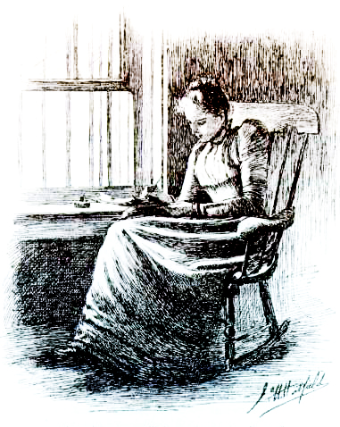

<h1>El tapiz amarillo </h1>
    <h2>Charlotte Perkins Gilman</h2>

  </section>
  <ul class="toc">
    <li><a href="#foreword">Introducci&oacute;n de Catherine J. Golden</a></li>
    <li><a href="#book">Empezar "El tapiz amarillo"</a></li>
  </ul>
  <h2>
  El tapiz amarillo - Charlotte Perkins Gilman
  </h2>
  <section id="foreword">
    <h3> Introducci&oacute;n</h3>
    
&quot;El tapiz amarillo&quot; (1892) de Charlotte Perkins Gilman ocupa un lugar importante entre las obras redescubiertas de escritoras estadounidenses de fin de siglo por su audaz cr&iacute;tica de la pol&iacute;tica de g&eacute;nero en una sociedad patriarcal. La narradora sin nombre, sometida a la infame cura del reposo&mdash;lo que los m&eacute;dicos diagnostican ahora como depresi&oacute;n posparto&mdash;experimenta efectos psicol&oacute;gicos debilitantes. Al principio le repugna el tapiz pintado de la habitaci&oacute;n en la que est&aacute; secuestrada en una finca de campo, pero a la narradora llega a gustarle cuando se propone descifrar su patr&oacute;n: imagina a muchas mujeres arrastr&aacute;ndose tras las rejas y se identifica con una mujer atrapada, posiblemente un reflejo de su dolorosa posici&oacute;n como mujer en la Am&eacute;rica victoriana. Muchos de los primeros lectores del relato lo consideraron un cuento de terror psicol&oacute;gico al estilo de Poe. Gilman tuvo dificultades para publicar este relato en un mercado literario dominado por los hombres, pero de su notable producci&oacute;n de novelas, relatos, poes&iacute;a y obras te&oacute;ricas que desaf&iacute;an la subyugaci&oacute;n femenina y defienden la igualdad de derechos, es mejor conocida hoy por <i>Herland</i> (1915), una novela ut&oacute;pica feminista, y &quot;El tapiz amarillo&quot;. Aclamado como un texto feminista en la d&eacute;cada de 1970, &quot;El tapiz amarillo&quot; es ahora una obra can&oacute;nica incluida en antolog&iacute;as de literatura estadounidense y de mujeres escritoras.

   
 Quiz&aacute; lo m&aacute;s provocativo sea la ambigua conclusi&oacute;n del relato. &iquest;C&oacute;mo interpretamos el estado final de la narradora: es una liberaci&oacute;n, una derrota o una victoria cualificada? Al liberar a la mujer atrapada y encerrar a John en su habitaci&oacute;n, &iquest;la narradora desciende a la locura o se libera a s&iacute; misma? &iquest;Podr&iacute;a el arrastramiento de la narradora significar un renacimiento en lugar de una regresi&oacute;n? A pesar de sus acciones descabelladas, &iquest;podr&iacute;a la narradora estar ganando su propia voz, lo que le lleva a declarar en la entrada final &quot;&mdash;Al final he salido&mdash;he dicho&mdash;, aunque no quisieras ni t&uacute; ni Jane.&quot;? &iquest;Y qui&eacute;n es Jane? &iquest;Es Jennie (su cu&ntilde;ada) o su propia yo reprimida?

   
Cita Press ha reproducido la versi&oacute;n original de 1892 de la revista <i>New England Magazine</i> con tres ilustraciones de la ilustradora Jo. H. Hatfield para permitir que lectores experimenten este emblem&aacute;tico relato como lo hicieron quienes inicialmente leyeron a las primeras lectoras de Gilman. La primera ilustraci&oacute;n de Hatfield muestra a una mujer victoriana de aspecto respetable escribiendo su relato, pero la tercera representa a una loca que se arrastra a cuatro patas, lo que probablemente influy&oacute; en algunas de las lecturas originales del relato como cuento de terror. Cita tambi&eacute;n conserva la notoriamente inconsistente ortograf&iacute;a de Gilman (en la versi&oacute;n en ingl&eacute;s) de &quot;wallpaper&quot; (tapiz), escrito varias veces como &quot;wall-paper&quot; (papel de pared) y &quot;wall paper&quot; (papel de colgadura) y simplemente &quot;paper&quot; (papel), una variaci&oacute;n que sugiere que la narradora, negada a cualquier forma de papel, est&aacute; leyendo el papel de colgadura como si fuera un texto.  

   
Este fascinante relato tiene sus ra&iacute;ces en la vida de Gilman y en la Am&eacute;rica victoriana patriarcal, pero tambi&eacute;n es relevante para nuestro tiempo. Las cuestiones que Gilman plantea sobre el coste de los roles tradicionales de la mujer como esposa y madre siguen cautivando, desconcertando y desafiando a las y los lectores de hoy. 

   

El feminismo teresiano es estrat&eacute;gico y de supervivencia. Teresa conoc&iacute;a bien los castigos que reservaba la Inquisici&oacute;n para las mujeres que intentaban fungir como autoridades espirituales. Por lo mismo, Teresa negocia su deseo de expresar una espiritualidad &iacute;ntima y muy personal mediante la elaboraci&oacute;n de una cuidadosa ret&oacute;rica de la humildad y la obediencia, que invitamos a los lectores a que desentra&ntilde;en del texto que presentamos. 

    
Catherine J. Golden, Profesora de inglés y de la Cátedra Tisch de Artes y Letras, Skidmore College. Traducción de Lina Rosas.

  

 No es nada habitual que gente corriente como John y yo alquile casas solariegas para el verano. 
 

 

 Una mansi&oacute;n colonial, una heredad&hellip; Dir&iacute;a que una casa encantada, y llegar&iacute;a a la c&uacute;spide de la felicidad rom&aacute;ntica. &iexcl;Pero eso ser&iacute;a pedir demasiado al destino!

 

  De todos modos, dir&eacute; con orgullo que hay algo extra&ntilde;o en ella. 

  

  Si no, &iquest;por qu&eacute; iba ser tan barato el alquiler? &iquest;Y por qu&eacute; iba a llevar tanto tiempo desocupada? 

  

  John se r&iacute;e de m&iacute;, claro, pero es lo que se espera del matrimonio.

  

   John es sumamente pr&aacute;ctico. No tiene paciencia con la fe, la superstici&oacute;n le produce un horror intenso, y se burla abiertamente en cuanto oye hablar de cualquier cosa que no se pueda tocar, ver y reducir a cifras. 

   

   John es m&eacute;dico, y es posible (claro que no se lo dir&iacute;a a nadie, pero esto lo escribo s&oacute;lo para m&iacute;, y con gran alivio por mi parte), es posible, digo, que &eacute;se sea el motivo de que no me cure m&aacute;s deprisa. 

   

   &iexcl;Es que no se cree que est&eacute; enferma! &iquest;Y qu&eacute; se le va a hacer? 

   

    Si un m&eacute;dico de prestigio, que adem&aacute;s es tu marido, asegura a los amigos y a los parientes que lo que le pasa a su mujer no es nada grave, s&oacute;lo una depresi&oacute;n nerviosa transitoria (una ligera propensi&oacute;n a la histeria), &iquest;qu&eacute; se le va a hacer? 

    

        Mi hermano, que tambi&eacute;n es un m&eacute;dico de prestigio, dice lo mismo. 

        

        O sea, que tomo no s&eacute; si fosfatos o fosfitos, y t&oacute;nicos, y viajo, y respiro aire fresco, y hago ejercicio, y tengo terminantemente prohibido &laquo;trabajar&raquo; hasta que vuelva a encontrarme bien. Personalmente disiento de sus ideas. Personalmente creo que un trabajo agradable, interesante y variado, me sentar&iacute;a bien. 

        

        Pero &iquest;qu&eacute; se le va a hacer? 

        
 
        Durante una temporada s&iacute; que escrib&iacute;, a pesar de lo que dijeran; pero es verdad que me agota bastante. Tener que llevarlo con tanto disimulo, a riesgo de topar con una oposici&oacute;n firme&hellip; 

        

         A veces me parece que en mi estado, con algo menos de oposici&oacute;n y m&aacute;s trato con la gente, m&aacute;s est&iacute;mulos&hellip; Pero John dice que lo peor que puedo hacer es pensar en mi estado, y confieso que hacerlo me produce siempre malestar. 

         

         As&iacute; que cambiar&eacute; de tema y hablar&eacute; de la casa. &iexcl;Qu&eacute; maravilla de finca! Es bastante solitaria, apartada de la carretera, a sus buenos cinco kil&oacute;metros del pueblo. Me recuerda esas casas inglesas que salen en los libros, porque tiene setos, muros y verjas que se cierran con candado, y muchas casitas desperdigadas para los jardineros y la gente. 

         

         &iexcl;Adem&aacute;s tiene un jard&iacute;n que es una preciosidad! No lo he visto igual en mi vida: grande, con mucha sombra, cruzado por caminitos con boj en los bordes, y en todas partes hay p&eacute;rgolas largas, con parras y asientos debajo.

         

          Tambi&eacute;n hab&iacute;a invernaderos, pero est&aacute;n todos rotos. 

          
 
          Tengo entendido que hubo problemas legales, una cuesti&oacute;n de herederos y coherederos; el caso es que lleva a&ntilde;os vac&iacute;a. 

          

          Me temo que eso da al traste con lo del fantasma, pero me da igual: en esta casa hay algo raro. Lo noto.

          

           Hasta se lo dije a John una noche de luna, pero me contest&oacute; que lo que notaba era corriente de aire, y cerr&oacute; la ventana. &iexcl;Corriente de aire! 

           

            A veces me enfado con John sin motivo. Estoy m&aacute;s sensible que antes, eso seguro. Yo creo que es por mi problema de nervios. 

            

            Pero John dice que si pienso eso me olvidar&eacute; de controlarme como es debido; as&iacute; que hago esfuerzos por controlarme, al menos en su presencia, cosa que me cansa mucho. 

            

            No me gusta nada el dormitorio. Yo quer&iacute;a uno de la planta baja que daba a la galer&iacute;a, con rosas enmarcando la ventana y unas colgaduras de chintz anticuadas que eran una preciosidad; pero John se neg&oacute; en redondo

            

             Dijo que s&oacute;lo hab&iacute;a una ventana, que el espacio no daba para dos camas y que tampoco hab&iacute;a ning&uacute;n otro dormitorio cerca para que se instalara &eacute;l. 

             

             Es muy atento, muy cari&ntilde;oso, y casi no me deja dar un paso sin intervenir. 

             

             Me ha preparado un horario con indicaciones para cada hora del d&iacute;a. John se ocupa de todo, y claro, yo me siento una mezquina y una desagradecida por no valorarlo m&aacute;s.

             
 
              Dijo que si hab&iacute;amos venido a esta casa era exclusivamente por m&iacute;, que aqu&iacute; tendr&iacute;a reposo absoluto y todo el aire que se puede respirar. &laquo;El ejercicio que hagas depende de tu fuerza, cari&ntilde;o &mdash;dijo&mdash;, y lo que comas, en cierto modo, de tu apetito, pero el aire lo puedes absorber en todo momento&raquo;. En definitiva, que nos instalamos en el cuarto de los ni&ntilde;os, el m&aacute;s alto de la casa. 

              

              Es una habitaci&oacute;n grande y aireada, que ocupa casi toda la planta, con ventanas orientadas a todos los flancos, y aire y sol a raudales. Por lo que se ve empez&oacute; siendo cuarto de los ni&ntilde;os, luego sala de juegos y al final gimnasio, porque en las ventanas hay barrotes para ni&ntilde;os peque&ntilde;os, y en las paredes anillas y otras cosas.

              

               Es como si la pintura y el papel de pared estuvieran gastados por todo un colegio. Est&aacute; arrancado (el papel) a trozos grandes alrededor del cabezal de mi cama, m&aacute;s o menos hasta donde llego con el brazo, y en una zona grande de la pared de enfrente, cerca del suelo. En mi vida he visto un papel m&aacute;s feo. 

               

               Uno de esos dise&ntilde;os vistosos y exagerados que cometen todos los pecados art&iacute;sticos habidos y por haber. 

               

                Es lo bastante soso para confundir al ojo que lo sigue, lo bastante pronunciado para irritar constantemente e incitar a su examen, y cuando sigues un rato las l&iacute;neas, pobres y confusas, de repente se suicidan: se tuercen en &aacute;ngulos exagerados y se destruyen a s&iacute; mismas en contradicciones inconcebibles. 

                

                El color es repelente, casi repugnante: un amarillo chill&oacute;n y sucio, deste&ntilde;ido de manera rara por la luz del sol, que se desplaza lentamente.

                

                 En algunas partes se convierte en un naranja paliducho y desagradable, y en otras coge un tono verdoso repelente. &iexcl;No me extra&ntilde;a que no les gustara a los ni&ntilde;os! Yo, si tuviera que vivir mucho tiempo en esta habitaci&oacute;n, tambi&eacute;n lo odiar&iacute;a. Viene John. Tengo que esconder esto. Le irrita que escriba. 
             

          

                                    
 \*\** 

                                

                                    
 En un dibujo de esta clase, a la luz del sol, hay una falta de secuencia, un desaf&iacute;o a las leyes, que produce irritaci&oacute;n constante en un cerebro normal.

                                    

                                     El color de por s&iacute; ya es bastante repulsivo, bastante inestable y bastante exasperante, pero el dibujo es una tortura. 

                                     

                                        Te parece que lo tienes dominado, pero justo cuando lo sigues sin perderte da una voltereta hacia atr&aacute;s y se acab&oacute; lo que se daba. Te pega un bofet&oacute;n, te tira al suelo y te pisotea. Es como una pesadilla. 

                                        

El dibujo principal es un arabesco recargado, que recuerda a un hongo. Hay que imaginarse una seta con articulaciones, una ristra interminable de setas, brotando en circunvoluciones que no se acaban nunca.

Es algo así. ¡Pero sólo a veces! Este papel tiene una peculiaridad muy marcada, algo que por lo visto sólo noto yo: que cambia con la luz. Cuando entra el sol de lleno por la ventana del este (yo siempre vigilo la aparición del primer rayo), cambia tan deprisa que nunca acabo de creérmelo. Por eso siempre lo observo. A la luz de la luna (cuando hay luna entra luz toda la noche) no me parece el mismo papel. ¡De noche, sea cual sea la fuente de luz (el crepúsculo, una vela, la lámpara o la luz de la luna, que es la peor), se convierte en barrotes! Me refiero al dibujo principal, y la mujer de detrás se ve con absoluta claridad.

Tardé bastante en reconocer lo que se ve detrás, ese dibujo secundario tan impreciso, pero ahora estoy segura de que es una mujer.

A la luz del día está borrosa, inmóvil. Yo creo que no se mueve por el dibujo principal. ¡Es tan desconcertante…! Yo, mirándolo, me quedo horas sin moverme.

Últimamente paso mucho tiempo estirada. John dice que me conviene, y que tengo que dormir todo lo que pueda. Lo cierto es que empecé por culpa suya, porque me obligaba a estirarme una hora después de cada comida. Estoy convencida de que es mala costumbre, porque el caso es que no duermo. Y eso fomenta el engaño, porque no le digo a nadie que estoy despierta. ¡Ni hablar!

El caso es que le estoy tomando un poco de miedo a John. Hay veces en que lo veo muy raro, y hasta Jennie tiene una mirada inexplicable.

De vez en cuando, como mera hipótesis científica, pienso… ¡que quizá sea el papel!

En más de una ocasión he observado a John sin que se diera cuenta, uno de esos días en que entraba en el dormitorio sin avisar con cualquier excusa inocente, y lo he sorprendido varias veces mirando el papel. A Jennie también. Una vez sorprendí a Jennie tocándolo.

Ella no sabía que yo estuviera en la habitación, y cuando le pregunté con voz tranquila, muy tranquila, controlándome al máximo, qué hacía con el papel… ¡Dio media vuelta como si la hubieran sorprendido robando, y me miró con cara de enfadada! ¡Me preguntó que por qué la asustaba!

Luego dijo que el papel lo manchaba todo, que había encontrado manchas amarillas en toda mi ropa y en la de John, y que a ver si teníamos más cuidado. Qué inocente, ¿verdad? ¡Pues yo sé que está estudiando el dibujo, y estoy decidida a ser la única que descubra la solución!

\\*\\**

Mi vida se ha vuelto mucho más interesante. Es porque tengo algo más que esperar, que vigilar. La verdad es que como mejor y estoy más tranquila que antes.

¡Qué contento está John de que mejore! El otro día se rio un poco y dijo que se me veía más sana, a pesar del papel de pared.

Yo, para no hablar del tema, me reí. No tenía la menor intención de decirle que la causa era justamente el papel de pared. Se habría burlado. Hasta puede que hubiera querido sacarme de esta casa.

Ahora no quiero irme hasta que haya descubierto la solución. Queda una semana, y creo que será suficiente.

\\*\\**

¡Me encuentro cada vez mejor! De noche no duermo mucho, por lo interesante que es observar los acontecimientos; de día, en cambio, duermo bastante.

De día cansa y desconcierta. Siempre hay nuevos brotes en el hongo, y nuevos matices de amarillo por todo el dibujo. Ni siquiera puedo llevar la cuenta, y eso que lo he intentado concienzudamente.

¡Qué amarillo más raro, el del papel! Me recuerda todo lo amarillo que he visto en mi vida; no cosas bonitas, como los ranúnculos, sino cosas amarillas podridas y maléficas.

Todavía hay otra cosa en el papel: ¡el olor! Lo noté en cuanto entramos en la habitación, pero con tanto aire y tanto sol no molestaba. Ahora llevamos una semana de niebla y lluvia y da igual que estén cerradas o abiertas las ventanas, porque el olor no se marcha.

Se infiltra por toda la casa.

Lo encuentro flotando por el comedor, agazapado en el salón, escondido en el vestíbulo, acechándome en la escalera.

Se me mete en el pelo.

Hasta cuando salgo a montar a caballo. De repente giró la cabeza y lo sorprendo: ¡ahí está el olor!

¡Y qué raro es! Me he pasado horas intentando analizarlo, para saber a qué olía.

Malo no es, al menos al principio. Es muy suave. Nunca había olido nada tan sutil y a la vez tan persistente.

Con esta humedad resulta asqueroso. De noche me despierto y lo descubro flotando sobre mí.

Al principio me molestaba. Llegué a pensar seriamente en quemar la casa, sólo para matar el olor.

Ahora, en cambio, me he acostumbrado. ¡Lo único que se me ocurre es que se parece al color del papel! Un olor amarillo.

Hay una marca muy rara en la pared, por la parte de abajo, cerca del zócalo: una raya que recorre toda la habitación. Pasa por detrás de todos los muebles menos de la cama. Es una mancha larga, recta y uniforme, como de haber frotado algo muchas veces. Me gustaría saber cómo y quién la hizo, y para qué. Vueltas, vueltas y vueltas. Vueltas, vueltas y vueltas. ¡Me marea!

\\*\\**

Por fin he hecho un verdadero hallazgo. A fuerza de mirarlo cada noche, cuando cambia tanto, he acabado por descubrir la solución.

El dibujo principal se mueve, efectivamente, ¡y no me extraña!

¡Lo sacude la mujer de detrás! A veces pienso que detrás hay varias mujeres: otras veces que sólo hay una, que se arrastra a toda velocidad y que el hecho de arrastrarse lo sacude todo. En las partes muy iluminadas se queda quieta, mientras que en las más oscuras coge las barras y las sacude con fuerza.

Siempre quiere salir, pero ese dibujo no hay quien lo atraviese. ¡Es tan asfixiante! Yo creo que es la explicación de que tenga tantas cabezas.

Lo atraviesan, y luego el dibujo las estrangula, las deja boca abajo y les pone los ojos en blanco.

Si estuvieran tapadas las cabezas, o arrancadas, no sería ni la mitad de desagradable.

\\*\\**

¡Me parece que la mujer sale de día!

Voy a decir por qué, pero que no se entere nadie: ¡la he visto!

¡La veo por todas mis ventanas!

Estoy segura de que es la misma mujer, porque siempre se arrastra, y hay pocas mujeres que se arrastren a la luz del día. La veo por el camino largo que pasa debajo de los árboles.

Se arrastra, y cuando pasa un coche de caballos se esconde debajo de las zarzamoras. La entiendo perfectamente. ¡Debe de ser muy humillante que te sorprendan arrastrándote en pleno día!

Yo, cuando me arrastro de día, siempre cierro con llave. De noche no puedo, porque sé que John enseguida sospecharía algo.

Y últimamente está tan raro que prefiero no irritarlo. ¡Ojalá se cambiara de habitación!

Además, no quiero que a esa mujer la saque nadie de noche como no sea yo.

A menudo me pregunto si podría verla por todas las ventanas a la vez. Pero por muy deprisa que dé vueltas, sólo consigo mirar por una. ¡Y aunque siempre la vea, cabe la posibilidad de que la velocidad con que anda a gatas sea mayor que la de mis vueltas!

Alguna vez la he visto lejos, en campo abierto, arrastrándose con la misma rapidez que la sombra de una nube en un día de viento.

\\*\\**

¡Ojalá el dibujo principal pudiera separarse del de debajo!

Me propongo intentarlo poco a poco. ¡He descubierto otra cosa extraña, pero esta vez no pienso decirla!

No conviene fiarse demasiado de la gente. Sólo quedan dos días para quitar el papel, y me parece que John empieza a notar algo. No me gusta cómo me mira.

Además, le he oído hacer a Jennie muchas preguntas profesionales sobre mí. El informe de Jennie era muy bueno.

Dice que de día duermo mucho.

¡John sabe que de noche no duermo demasiado bien, y eso que casi no me muevo! También me hizo toda clase de preguntas a mí fingiéndose muy tierno y atento.

¡Como si no se le notara! De todos modos no me extraña nada su comportamiento, después de tres meses durmiendo debajo de este papel. Lo mío sólo es interés, pero estoy segura de que a John y a Jennie, en secreto, les afecta.

\\*\\**

¡Hurra! Es el último día, pero no me hace falta ninguno más. John se queda a dormir en la ciudad, y no volverá hasta tarde.

Jennie quería dormir conmigo, la muy pilla, pero le he dicho que descansaría mucho mejor quedándome sola una noche.

¡Una respuesta muy astuta, porque la verdad es que no he estado sola en absoluto! En cuanto salió la luna y la pobre mujer empezó a arrastrarse y sacudir el dibujo, me levanté y corrí a ayudarla.

Yo estiraba, y ella sacudía; luego sacudía yo y estiraba ella, y antes del amanecer habíamos arrancado varios metros de papel. Una franja como yo de alta, y de ancha como la mitad de la habitación. ¡Después, cuando ha salido el sol y el dibujo ha empezado a burlarse de mí, he jurado acabar con él hoy mismo!

Nos vamos mañana. Están trasladando todos mis muebles a la planta baja para dejarlo todo como al llegar.

Jennie ha mirado la pared con cara de sorpresa, pero le he dicho que ha sido pura rabia, por lo horrible que era el papel.

Se ha puesto a reír y me ha dicho que no le habría importado hacerlo ella misma, pero que no está bien que me canse. ¡Qué manera de quedar en evidencia!

Pero estoy aquí, y este papel no lo toca nadie más que yo. ¡Antes muerta!

Jennie ha intentado sacarme de la habitación. ¡Cómo se le notaba! Pero yo le he dicho que ahora está tan vacía y tan limpia que me entraban ganas de estirarme otra vez y dormir todo lo que pudiera; que no me despertara ni para cenar, y que ya la avisaría yo cuando estuviera despierta.

 Vaya, que se ha marchado, y los criados no est&aacute;n. Los muebles tampoco. S&oacute;lo queda la cama clavada al suelo, con el colch&oacute;n de lona que encontramos encima. Esta noche dormiremos abajo, y ma&ntilde;ana tomaremos el barco a casa. Me gusta bastante esta habitaci&oacute;n, ahora que vuelve a estar vac&iacute;a. &iexcl;Qu&eacute; destrozos hicieron los ni&ntilde;os! &iexcl;La cama est&aacute; como si la hubieran mordido! Pero tengo que poner manos a la obra. He cerrado la puerta y he tirado la llave al camino de delante. No quiero salir, ni quiero que entre nadie hasta que llegue John. Quiero darle una buena sorpresa. Tengo una cuerda que no ha encontrado ni Jennie. &iexcl;As&iacute;, si sale la mujer y quiere escaparse, podr&eacute; atarla! 
&iexcl;Pero se me ha olvidado que no puedo llegar muy arriba si no tengo nada a que subirme! &iexcl;Esta cama no hay quien la mueva! He intentado levantarla y empujarla hasta quedarme lisiada. 
Entonces me he enfadado tanto que le he arrancado un trozo de un mordisco, en una esquina; pero me he hecho da&ntilde;o en los dientes.
 Despu&eacute;s he arrancado todo el papel hasta donde alcanzaba de pie en el suelo. &iexcl;Est&aacute; pegad&iacute;simo, y el dibujo se lo pasa en grande! &iexcl;Todas las cabezas estranguladas, y los ojos saltones, y la proliferaci&oacute;n de hongos, todos se mofan de m&iacute; a gritos! 
Me estoy enfadando tanto que acabar&eacute; haciendo algo desesperado. Saltar por la ventana ser&iacute;a un ejercicio admirable, pero las barras son demasiado fuertes para intentarlo. Adem&aacute;s, tampoco lo har&iacute;a. Desde luego que no. S&eacute; perfectamente que ser&iacute;a un acto indecoroso, y que podr&iacute;a interpretarse mal. 
Ni siquiera me gusta mirar por las ventanas. &iexcl;Hay tantas mujeres arrastr&aacute;ndose, y corren tanto&hellip;! Me gustar&iacute;a saber si salen todas del papel, como yo. 
Pero ahora estoy bien sujeta con mi cuerda, la que no encontr&oacute; nadie. &iexcl;A m&iacute; s&iacute; que no me sacan a la carretera! Supongo que cuando se haga de noche tendr&eacute; que ponerme otra vez detr&aacute;s del dibujo. &iexcl;Con lo que cuesta! &iexcl;Es tan agradable estar en esta habitaci&oacute;n tan grande, y andar a gatas siempre que quiera&hellip;! 
No quiero salir. No quiero, ni que me lo pida Jennie. 
Porque fuera hay que arrastrarse por el suelo, y en vez de amarillo es todo verde. Aqu&iacute;, en cambio, puedo andar a gatas por el suelo liso, y mi hombro se ajusta perfectamente a la marca larga de la pared, con la ventaja de que as&iacute; no me pierdo. 
&iexcl;Anda, si est&aacute; John al otro lado de la puerta! &iexcl;Es in&uacute;til, jovencito, no podr&aacute;s abrirla! &iexcl;Qu&eacute; berridos, y qu&eacute; golpes! Ahora pide un hacha a gritos. &iexcl;Ser&iacute;a una l&aacute;stima destrozar una puerta tan bonita! &mdash;&iexcl;John, querido! &mdash;he dicho con la m&aacute;xima amabilidad&mdash;. &iexcl;La llave est&aacute; al lado de la escalera de entrada, debajo de una hoja! Con eso se ha callado un rato. Luego ha dicho (con mucha serenidad): &mdash;&iexcl;Abre la puerta, cari&ntilde;o! 
&mdash;No puedo &mdash;he contestado yo&mdash;. &iexcl;La llave est&aacute; al lado de la puerta principal, debajo de una hoja! Lo he repetido varias veces, muy poco a poco y con mucha dulzura; lo he dicho tantas veces que ha tenido que bajar a comprobarlo. La ha encontrado, como era de esperar, y ha entrado. Se ha quedado a un paso del umbral. 
&mdash;&iquest;Qu&eacute; pasa? &mdash;ha gritado&mdash;. &iquest;Pero qu&eacute; haces, por Dios? Yo he seguido andando a gatas como si nada, pero le he mirado por encima del hombro. 
&mdash;Al final he salido &mdash;he dicho&mdash;, aunque no quisieras ni t&uacute; ni Jane. &iexcl;Y he arrancado casi todo el papel, para que no puedan volver a meterme! 
&iquest;Por qu&eacute; se habr&aacute; desmayado? El caso es que lo ha hecho, y justo al lado de la pared, en mitad de mi camino. &iexcl;O sea que he tenido que pasar por encima de &eacute;l a cada vuelta!

\    
