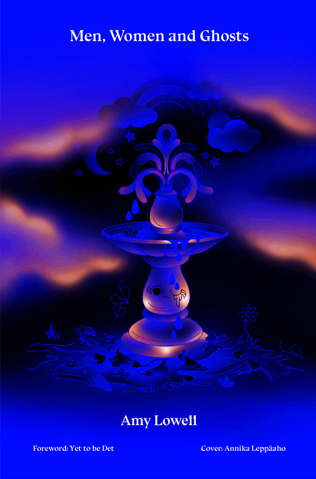

\    <title>
      Men, Women and Ghosts, by Amy Lowell
    </title>
  </head>
  <body>
<pre xml:space="preserve">
</pre>
    <h2>
     Men, Women and Ghosts
    </h2>
    <h2>
   Amy Lowell
    </h2>    
    <blockquote>
  <ul class="toc">
 <li><a href="#link2H_PREF"> Preface by the Author</a></li>
<li>  <a href="#link2H_4_0003"> <b>Start Men, Women, and Ghosts</b> </a></li>
<li><a href="#link2H_4_0004"> <b>FIGURINES IN OLD SAXE</b> </a></li>
<li> <a href="#link2H_4_0005"> Patterns </a></li>
<li><a href="#link2H_4_0006"> Pickthorn Manor </a></li>
<li> <a href="#link2H_4_0007"> The Cremona Violin </a></li>
<li><a href="#link2H_4_0008"> The Cross-Roads </a></li>
<li> <a href="#link2H_4_0009"> A Roxbury Garden </a></li>
<li><a href="#link2H_4_0010"> 1777 </a> </li>
<li><a href="#link2H_4_0011"> <b>BRONZE TABLETS</b> </a></li>
<li> <a href="#link2H_4_0012"> The Fruit Shop </a></li>
<li><a href="#link2H_4_0013"> Malmaison </a></li>
<li><a href="#link2H_4_0014"> The Hammers </a></li>
<li> <a href="#link2H_4_0015"> Two Travellers in the Place Vendome </a></li>
<li><a href="#link2H_4_0016"> <b>WAR PICTURES</b> </a></li>
<li><a href="#link2H_4_0017"> The Allies </a></li>
<li> <a href="#link2H_4_0018"> The Bombardment </a></li>
<li> <a href="#link2H_4_0019"> Lead Soldiers </a></li>
<li> <a href="#link2H_4_0020"> The Painter on Silk </a></li>
<li> <a href="#link2H_4_0021"> A Ballad of Footmen </a></li>
<li><a href="#link2H_4_0022"> <b>THE OVERGROWN PASTURE</b> </a></li>
<li><a href="#link2H_4_0023"> Reaping </a></li>
<li><a href="#link2H_4_0024"> Off the Turnpike </a></li>
<li><a href="#link2H_4_0025"> The Grocery </a></li>
<li><a href="#link2H_4_0026"> Number 3 on the Docket </a></li>
<li><a href="#link2H_4_0027"> <b>CLOCKS TICK A CENTURY</b> </a></li>
<li><a href="#link2H_4_0028"> Nightmare: A Tale for an Autumn Evening </a></li>
<li><a href="#link2H_4_0029"> The Paper Windmill </a></li>
<li><a href="#link2H_4_0030"> The Red Lacquer Music-Stand </a></li>
<li><a href="#link2H_4_0031"> Spring Day </a></li>
<li><a href="#link2H_4_0032"> The Dinner-Party </a></li>
<li><a href="#link2H_4_0033"> Stravinsky's Three Pieces "Grotesques", for
        String Quartet </a></li>
<li><a href="#link2H_4_0034"> Towns in Colour </a></li>
</ul>
    </blockquote>

```

```

<pre xml:space="preserve">
  "'... See small portions of the Eternal World that ever groweth':...
  So sang a Fairy, mocking, as he sat on a streak'd tulip,
  Thinking none saw him:  when he ceas'd I started from the trees,
  And caught him in my hat, as boys knock down a butterfly."
                                 William Blake.  "Europe.  A Prophecy."

            'Thou hast a lap full of seed,
            And this is a fine country.'
                                     William Blake.
</pre>

```

```

<a name="link2H_4_0004" id="link2H_4_0004">
    <h2>
      FIGURINES IN OLD SAXE
    </h2>
    <h2>
      Patterns
    </h2>

```

```

<p>
   I walk down the garden paths,<br>
   And all the daffodils<br>
   Are blowing, and the bright blue squills.<br>
   I walk down the patterned garden-paths<br>
   In my stiff, brocaded gown.<br>
   With my powdered hair and jewelled fan,<br>
   I too am a rare<br>
   Pattern.  As I wander down<br>
   The garden paths.</p>
<p>
   My dress is richly figured,<br>
   And the train<br>
   Makes a pink and silver stain<br>
   On the gravel, and the thrift<br>
   Of the borders.<br>
   Just a plate of current fashion,<br>
   Tripping by in high-heeled, ribboned shoes.<br>
   Not a softness anywhere about me,<br>
   Only whalebone and brocade.<br>
   And I sink on a seat in the shade<br>
   Of a lime tree.  For my passion<br>
   Wars against the stiff brocade.<br>
   The daffodils and squills<br>
   Flutter in the breeze<br>
   As they please.<br>
   And I weep;<br>
   For the lime-tree is in blossom<br>
   And one small flower has dropped upon my bosom.</p>
<p>
   And the plashing of waterdrops<br>
   In the marble fountain<br>
   Comes down the garden-paths.<br>
   The dripping never stops.<br>
   Underneath my stiffened gown<br>
   Is the softness of a woman bathing in a marble basin,<br>
   A basin in the midst of hedges grown<br>
   So thick, she cannot see her lover hiding,<br>
   But she guesses he is near,<br>
   And the sliding of the water<br>
   Seems the stroking of a dear<br>
   Hand upon her.<br>
   What is Summer in a fine brocaded gown!<br>
   I should like to see it lying in a heap upon the ground.<br>
   All the pink and silver crumpled up on the ground.</p>
<p>
   I would be the pink and silver as I ran along the paths,<br>
   And he would stumble after,<br>
   Bewildered by my laughter.<br>
   I should see the sun flashing from his sword-hilt and the buckles<br>
    &nbsp;&nbsp; on his shoes.<br>
   I would choose<br>
   To lead him in a maze along the patterned paths,<br>
   A bright and laughing maze for my heavy-booted lover,<br>
   Till he caught me in the shade,<br>
   And the buttons of his waistcoat bruised my body as he clasped me,<br>
   Aching, melting, unafraid.<br>
   With the shadows of the leaves and the sundrops,<br>
   And the plopping of the waterdrops,<br>
   All about us in the open afternoon&mdash;<br>
   I am very like to swoon<br>
   With the weight of this brocade,<br>
   For the sun sifts through the shade.</p>
<p>
   Underneath the fallen blossom<br>
   In my bosom,<br>
   Is a letter I have hid.<br>
   It was brought to me this morning by a rider from the Duke.<br>
   "Madam, we regret to inform you that Lord Hartwell<br>
   Died in action Thursday se'nnight."<br>
   As I read it in the white, morning sunlight,<br>
   The letters squirmed like snakes.<br>
   "Any answer, Madam," said my footman.<br>
   "No," I told him.<br>
   "See that the messenger takes some refreshment.<br>
   No, no answer."<br>
   And I walked into the garden,<br>
   Up and down the patterned paths,<br>
   In my stiff, correct brocade.<br>
   The blue and yellow flowers stood up proudly in the sun,<br>
   Each one.<br>
   I stood upright too,<br>
   Held rigid to the pattern<br>
   By the stiffness of my gown.<br>
   Up and down I walked,<br>
   Up and down.</p>
<p>
   In a month he would have been my husband.<br>
   In a month, here, underneath this lime,<br>
   We would have broke the pattern;<br>
   He for me, and I for him,<br>
   He as Colonel, I as Lady,<br>
   On this shady seat.<br>
   He had a whim<br>
   That sunlight carried blessing.<br>
   And I answered, "It shall be as you have said."<br>
   Now he is dead.</p>
<p>
   In Summer and in Winter I shall walk<br>
   Up and down<br>
   The patterned garden-paths<br>
   In my stiff, brocaded gown.<br>
   The squills and daffodils<br>
   Will give place to pillared roses, and to asters, and to snow.<br>
   I shall go<br>
   Up and down,<br>
   In my gown.<br>
   Gorgeously arrayed,<br>
   Boned and stayed.<br>
   And the softness of my body will be guarded from embrace<br>
   By each button, hook, and lace.<br>
   For the man who should loose me is dead,<br>
   Fighting with the Duke in Flanders,<br>
   In a pattern called a war.<br>
   Christ!  What are patterns for?<br>
</p>
    <p>
      <a name="link2H_4_0006" id="link2H_4_0006">
      <!--  H2 anchor --> </a>
    </p>
    <div style="height: 4em;">
      <br /><br /><br /><br />
    </div>
    <h2>
      Pickthorn Manor
    </h2>
<p>
       I</p>
<p>

   How fresh the Dartle's little waves that day!<br>
   &nbsp A steely silver, underlined with blue,<br>
   And flashing where the round clouds, blown away,<br>
   &nbsp Let drop the yellow sunshine to gleam through<br>
   And tip the edges of the waves with shifts<br>
    &nbspAnd spots of whitest fire, hard like gems<br>
    &nbsp &nbsp &nbsp Cut from the midnight moon they were, and sharp<br>
   &nbsp As wind through leafless stems.<br>
   The Lady Eunice walked between the drifts<br>
   Of blooming cherry-trees, and watched the rifts<br>
    &nbsp &nbsp &nbsp Of clouds drawn through the river's azure warp.</p>

<p>
       II</p>
<p>

   Her little feet tapped softly down the path.<br>
   &nbsp Her soul was listless; even the morning breeze<br>
   Fluttering the trees and strewing a light swath<br>
   &nbsp Of fallen petals on the grass, could please<br>
   Her not at all.  She brushed a hair aside<br>
   &nbsp With a swift move, and a half-angry frown.<br>
   &nbsp &nbsp &nbsp  She stopped to pull a daffodil or two,<br>
    And held them to her gown<br>
   To test the colours; put them at her side,<br>
   Then at her breast, then loosened them and tried<br>
  &nbsp&nbsp  &nbsp Some new arrangement, but it would not do.<br>
     </p>

<p>
       III</p>
<p>

   A lady in a Manor-house, alone,<br>
   &nbsp Whose husband is in Flanders with the Duke<br>
   Of Marlborough and Prince Eugene, she's grown<br>
   &nbsp Too apathetic even to rebuke<br>
   Her idleness.  What is she on this Earth?<br>
    No woman surely, since she neither can<br>
    &nbsp &nbsp &nbsp Be wed nor single, must not let her mind<br>
   &nbsp Build thoughts upon a man<br>
   Except for hers.  Indeed that were no dearth<br>
   Were her Lord here, for well she knew his worth,<br>
    &nbsp &nbsp  And when she thought of him her eyes were kind.<br>

<p>
       IV</p>
<p>

   Too lately wed to have forgot the wooing.<br>
    &nbspToo unaccustomed as a bride to feel<br>
   Other than strange delight at her wife's doing.<br>
   &nbsp Even at the thought a gentle blush would steal<br>
   Over her face, and then her lips would frame<br>
   &nbsp Some little word of loving, and her eyes<br>
    &nbsp&nbsp&nbsp Would brim and spill their tears, when all they saw<br>
   &nbsp Was the bright sun, slantwise<br>
   Through burgeoning trees, and all the morning's flame<br>
   Burning and quivering round her.  With quick shame<br>
    &nbsp&nbsp&nbsp She shut her heart and bent before the law.<br>

</p>
<p>
       V</p>
<p>

   He was a soldier, she was proud of that.<br>
    &nbspThis was his house and she would keep it well.<br>
   His honour was in fighting, hers in what<br>
   &nbsp He'd left her here in charge of.  Then a spell<br>
   Of conscience sent her through the orchard spying<br>
    &nbspUpon the gardeners.  Were their tools about?<br>
      &nbsp&nbsp&nbsp Were any branches broken?  Had the weeds<br>
    &nbspBeen duly taken out<br>
   Under the 'spaliered pears, and were these lying<br>
   Nailed snug against the sunny bricks and drying<br>
      &nbsp&nbsp&nbsp Their leaves and satisfying all their needs?<br>

</p>
<p>
       VI</p>
<p>

   She picked a stone up with a little pout,<br>
   &nbsp Stones looked so ill in well-kept flower-borders.<br>
   Where should she put it?  All the paths about<br>
   &nbsp Were strewn with fair, red gravel by her orders.<br>
   No stone could mar their sifted smoothness.  So<br>
    &nbspShe hurried to the river.  At the edge<br>
     &nbsp&nbsp&nbsp  She stood a moment charmed by the swift blue<br>
   &nbsp Beyond the river sedge.<br>
   She watched it curdling, crinkling, and the snow<br>
   Purfled upon its wave-tops.  Then, "Hullo,<br>
     &nbsp&nbsp&nbsp  My Beauty, gently, or you'll wriggle through."<br>

</p>
<p>
       VII</p>
<p>
   The Lady Eunice caught a willow spray<br>
   &nbsp To save herself from tumbling in the shallows<br>
   Which rippled to her feet.  Then straight away<br>
   &nbsp She peered down stream among the budding sallows.<br>
   A youth in leather breeches and a shirt<br>
   &nbsp Of finest broidered lawn lay out upon<br>
       &nbsp&nbsp&nbspAn overhanging bole and deftly swayed<br>
    &nbspA well-hooked fish which shone<br>
   In the pale lemon sunshine like a spurt<br>
   Of silver, bowed and damascened, and girt<br>
     &nbsp&nbsp&nbsp  With crimson spots and moons which waned and played.<br>
</p>
<p>
       VIII</p>
<p>

   The fish hung circled for a moment, ringed<br>
   &nbsp And bright; then flung itself out, a thin blade<br>
   Of spotted lightning, and its tail was winged<br>
   &nbsp With chipped and sparkled sunshine.  And the shade<br>
   Broke up and splintered into shafts of light<br>
    &nbspWheeling about the fish, who churned the air<br>
     &nbsp&nbsp&nbsp  And made the fish-line hum, and bent the rod<br>
   &nbsp Almost to snapping.  Care<br>
   The young man took against the twigs, with slight,<br>
   Deft movements he kept fish and line in tight<br>
     &nbsp&nbsp&nbsp  Obedience to his will with every prod.<br>

</p>
<p>
       IX</p>
<p>

   He lay there, and the fish hung just beyond.<br>
   &nbsp He seemed uncertain what more he should do.<br>
   He drew back, pulled the rod to correspond,<br>
   &nbsp Tossed it and caught it; every time he threw,<br>
   He caught it nearer to the point.  At last<br>
   &nbsp The fish was near enough to touch.  He paused.<br>
    &nbsp&nbsp&nbsp   Eunice knew well the craft&mdash;"What's got the thing!"<br>
   &nbsp She cried.  "What can have caused&mdash;<br>
   Where is his net?  The moment will be past.<br>
   The fish will wriggle free."  She stopped aghast.<br>
     &nbsp&nbsp&nbsp  He turned and bowed.  One arm was in a sling.<br>

</p>
<p>
       X</p>
<p>

   The broad, black ribbon she had thought his basket<br>
   &nbsp Must hang from, held instead a useless arm.<br>
   "I do not wonder, Madam, that you ask it."<br>
    &nbspHe smiled, for she had spoke aloud.  "The charm<br>
   Of trout fishing is in my eyes enhanced<br>
   &nbsp When you must play your fish on land as well."<br>
    &nbsp&nbsp&nbsp   "How will you take him?" Eunice asked.  "In truth<br>
   &nbsp I really cannot tell.<br>
   'Twas stupid of me, but it simply chanced<br>
   I never thought of that until he glanced<br>
    &nbsp&nbsp&nbspInto the branches.  'Tis a bit uncouth."<br>

</p>
<p>
       XI</p>
<p>

   He watched the fish against the blowing sky,<br>
   &nbsp Writhing and glittering, pulling at the line.<br>
   "The hook is fast, I might just let him die,"<br>
   &nbsp He mused.  "But that would jar against your fine<br>
   Sense of true sportsmanship, I know it would,"<br>
   &nbsp Cried Eunice.  "Let me do it."  Swift and light<br>
     &nbsp&nbsp&nbsp  She ran towards him.  "It is so long now<br>
   &nbsp Since I have felt a bite,<br>
   I lost all heart for everything."  She stood,<br>
   Supple and strong, beside him, and her blood<br>
     &nbsp&nbsp&nbsp  Tingled her lissom body to a glow.<br>

</p>
<p>
       XII</p>
<p>

   She quickly seized the fish and with a stone<br>
   &nbsp Ended its flurry, then removed the hook,<br>
   Untied the fly with well-poised fingers.  Done,<br>
   &nbsp She asked him where he kept his fishing-book.<br>
   He pointed to a coat flung on the ground.<br>
   &nbsp She searched the pockets, found a shagreen case,<br>
   &nbsp&nbsp&nbsp    Replaced the fly, noticed a golden stamp<br>
   &nbsp Filling the middle space.<br>
   Two letters half rubbed out were there, and round<br>
   About them gay rococo flowers wound<br>
     &nbsp&nbsp&nbsp  And tossed a spray of roses to the clamp.<br>

</p>
<p>
       XIII</p>
<p>

   The Lady Eunice puzzled over these.<br>
   &nbsp "G. D." the young man gravely said.  "My name<br>
   Is Gervase Deane.  Your servant, if you please."<br>
   &nbsp "Oh, Sir, indeed I know you, for your fame<br>
   For exploits in the field has reached my ears.<br>
    &nbspI did not know you wounded and returned."<br>
     &nbsp&nbsp&nbsp  "But just come back, Madam.  A silly prick<br>
   &nbsp To gain me such unearned<br>
   Holiday making.  And you, it appears,<br>
   Must be Sir Everard's lady.  And my fears<br>
     &nbsp&nbsp&nbsp  At being caught a-trespassing were quick."<br>

</p>
<p>
       XIV</p>
<p>

   He looked so rueful that she laughed out loud.<br>
   &nbsp "You are forgiven, Mr. Deane.  Even more,<br>
   I offer you the fishing, and am proud<br>
    &nbspThat you should find it pleasant from this shore.<br>
   Nobody fishes now, my husband used<br>
   &nbsp To angle daily, and I too with him.<br>
    &nbsp&nbsp&nbsp   He loved the spotted trout, and pike, and dace.v
   &nbsp He even had a whim<br>
   That flies my fingers tied swiftly confused<br>
   The greater fish.  And he must be excused, <br>
     &nbsp&nbsp&nbsp  Love weaves odd fancies in a lonely place."<br>

</p>
<p>
       XV</p>
<p>

   She sighed because it seemed so long ago,<br>
   &nbsp Those days with Everard; unthinking took<br>
   The path back to the orchard.  Strolling so<br>
   &nbsp She walked, and he beside her.  In a nook<br>
   Where a stone seat withdrew beneath low boughs,<br>
   &nbsp Full-blossomed, hummed with bees, they sat them down.<br>
    &nbsp&nbsp&nbsp   She questioned him about the war, the share<br>
   &nbsp Her husband had, and grown<br>
   Eager by his clear answers, straight allows<br>
   Her hidden hopes and fears to speak, and rouse<br>
    &nbsp&nbsp&nbsp   Her numbed love, which had slumbered unaware.<br>

</p>
<p>
       XVI</p>
<p>

   Under the orchard trees daffodils danced<br>
  &nbsp  And jostled, turning sideways to the wind.<br>
   A dropping cherry petal softly glanced<br>
   &nbsp Over her hair, and slid away behind.<br>
   At the far end through twisted cherry-trees<br>
    &nbspThe old house glowed, geranium-hued, with bricks<br>
    &nbsp&nbsp&nbsp   Bloomed in the sun like roses, low and long,<br>
   &nbsp Gabled, and with quaint tricks<br>
   Of chimneys carved and fretted.  Out of these<br>
   Grey smoke was shaken, which the faint Spring breeze<br>
    &nbsp&nbsp&nbsp   Tossed into nothing.  Then a thrush's song<br>

</p>
<p>
       XVII</p>
<p>

   Needled its way through sound of bees and river.<br>
   &nbsp The notes fell, round and starred, between young leaves,<br>
   Trilled to a spiral lilt, stopped on a quiver.<br>
   &nbsp The Lady Eunice listens and believes.<br>
   Gervase has many tales of her dear Lord,<br>
   &nbsp His bravery, his knowledge, his charmed life.<br>
    &nbsp&nbsp&nbsp   She quite forgets who's speaking in the gladness<br>
   &nbsp Of being this man's wife.<br>
   Gervase is wounded, grave indeed, the word<br>
   Is kindly said, but to a softer chord<br>
    &nbsp&nbsp&nbsp   She strings her voice to ask with wistful sadness,<br>

</p>
<p>
       XVIII</p>
<p>

   "And is Sir Everard still unscathed?  I fain<br>
   &nbsp Would know the truth."  "Quite well, dear Lady, quite."<br>
   She smiled in her content.  "So many slain,<br>
   &nbsp You must forgive me for a little fright."<br>
   And he forgave her, not alone for that,<br>
   &nbsp But because she was fingering his heart,<br>
     &nbsp&nbsp&nbsp  Pressing and squeezing it, and thinking so<br>
   &nbsp Only to ease her smart<br>
   Of painful, apprehensive longing.  At<br>
   Their feet the river swirled and chucked.  They sat<br>
     &nbsp&nbsp&nbsp  An hour there.  The thrush flew to and fro.<br>

</p>
<p>
       XIX</p>
<p>

   The Lady Eunice supped alone that day,<br>
   &nbsp As always since Sir Everard had gone,<br>
   In the oak-panelled parlour, whose array<br>
   &nbsp Of faded portraits in carved mouldings shone.<br>
   Warriors and ladies, armoured, ruffed, peruked.<br>
   &nbsp Van Dykes with long, slim fingers; Holbeins, stout<br>
    &nbsp&nbsp&nbsp   And heavy-featured; and one Rubens dame,<br>
    &nbspA peony just burst out,<br>
   With flaunting, crimson flesh.  Eunice rebuked<br>
   Her thoughts of gentler blood, when these had duked<br>
     &nbsp&nbsp&nbsp  It with the best, and scorned to change their name.<br>

</p>
<p>
       XX</p>
<p>

   A sturdy family, and old besides,<br>
   &nbsp Much older than her own, the Earls of Crowe.<br>
   Since Saxon days, these men had sought their brides<br>
   &nbsp Among the highest born, but always so,<br>
   Taking them to themselves, their wealth, their lands,<br>
   &nbsp But never their titles.  Stern perhaps, but strong,<br>
    &nbsp&nbsp&nbsp   The Framptons fed their blood from richest streams,<br>
   &nbsp Scorning the common throng.<br>
   Gazing upon these men, she understands<br>
   The toughness of the web wrought from such strands<br>
    &nbsp&nbsp&nbsp   And pride of Everard colours all her dreams.<br>

</p>
<p>
       XXI</p>
<p>

   Eunice forgets to eat, watching their faces<br>
   &nbsp Flickering in the wind-blown candle's shine.<br>
   Blue-coated lackeys tiptoe to their places,<br>
   &nbsp And set out plates of fruit and jugs of wine.<br>
   The table glitters black like Winter ice.<br>
   &nbsp The Dartle's rushing, and the gentle clash<br>
    &nbsp&nbsp&nbsp   Of blossomed branches, drifts into her ears.<br>
   &nbsp And through the casement sash<br>
   She sees each cherry stem a pointed slice<br>
   Of splintered moonlight, topped with all the spice<br>
    &nbsp&nbsp&nbsp   And shimmer of the blossoms it uprears.<br>

</p>
<p>
       XXII</p>
<p>

   "In such a night&mdash;" she laid the book aside,<br>
  &nbsp  She could outnight the poet by thinking back.<br>
   In such a night she came here as a bride.<br>
  &nbsp  The date was graven in the almanack<br>
   Of her clasped memory.  In this very room<br>
  &nbsp  Had Everard uncloaked her.  On this seat<br>
   &nbsp&nbsp&nbsp    Had drawn her to him, bade her note the trees,<br>
   &nbsp How white they were and sweet<br>
   And later, coming to her, her dear groom,<br>
   Her Lord, had lain beside her in the gloom<br>
   &nbsp&nbsp&nbsp    Of moon and shade, and whispered her to ease.<br>

</p>
<p>
       XXIII</p>
<p>

   Her little taper made the room seem vast,<br>
   &nbsp Caverned and empty.  And her beating heart<br>
   Rapped through the silence all about her cast<br>
   &nbsp Like some loud, dreadful death-watch taking part<br>
   In this sad vigil.  Slowly she undrest,<br>
  &nbsp  Put out the light and crept into her bed.<br>
      &nbsp&nbsp&nbsp  The linen sheets were fragrant, but so cold.<br>
  &nbsp  And brimming tears she shed,<br>
   Sobbing and quivering in her barren nest,<br>
   Her weeping lips into the pillow prest,<br>
     &nbsp&nbsp&nbsp  Her eyes sealed fast within its smothering fold.<br>

</p>
<p>
       XXIV</p>
<p>

   The morning brought her a more stoic mind,<br>
   &nbsp And sunshine struck across the polished floor.<br>
   She wondered whether this day she should find<br>
    &nbspGervase a-fishing, and so listen more,<br>
   Much more again, to all he had to tell.<br>
   &nbsp And he was there, but waiting to begin<br>
     &nbsp&nbsp&nbsp  Until she came.  They fished awhile, then went<br>
   &nbsp To the old seat within<br>
   The cherry's shade.  He pleased her very well<br>
   By his discourse.  But ever he must dwell<br>
    &nbsp&nbsp&nbsp   Upon Sir Everard.  Each incident<br>

</p>
<p>
       XXV</p>
<p>

   Must be related and each term explained.<br>
    &nbspHow troops were set in battle, how a siege<br>
   Was ordered and conducted.  She complained<br>
   &nbsp Because he bungled at the fall of Liege.<br>
   The curious names of parts of forts she knew,<br>
   &nbsp And aired with conscious pride her ravelins,<br>
    &nbsp&nbsp&nbsp   And counterscarps, and lunes.  The day drew on,<br>
   &nbsp And his dead fish's fins<br>
   In the hot sunshine turned a mauve-green hue.<br>
   At last Gervase, guessing the hour, withdrew.<br>
     &nbsp&nbsp&nbsp  But she sat long in still oblivion.<br>

</p>
<p>
       XXVI</p>
<p>

   Then he would bring her books, and read to her<br>
   &nbsp The poems of Dr. Donne, and the blue river<br>
   Would murmur through the reading, and a stir<br>
   &nbsp Of birds and bees make the white petals shiver,<br>
   And one or two would flutter prone and lie<br>
   &nbsp Spotting the smooth-clipped grass.  The days went by<br>
    &nbsp&nbsp&nbsp   Threaded with talk and verses.  Green leaves pushed<br>
   &nbsp Through blossoms stubbornly.<br>
   Gervase, unconscious of dishonesty,<br>
   Fell into strong and watchful loving, free<br>
    &nbsp&nbsp&nbsp   He thought, since always would his lips be hushed.<br>

</p>
<p>
       XXVII</p>
<p>

   But lips do not stay silent at command,<br>
   &nbsp And Gervase strove in vain to order his.<br>
   Luckily Eunice did not understand<br>
   &nbsp That he but read himself aloud, for this<br>
   Their friendship would have snapped.  She treated him<br>
   &nbsp And spoilt him like a brother.  It was now<br>
   &nbsp&nbsp&nbsp    "Gervase" and "Eunice" with them, and he dined<br>
   &nbsp Whenever she'd allow,<br>
   In the oak parlour, underneath the dim<br>
   Old pictured Framptons, opposite her slim<br>
   &nbsp&nbsp&nbsp    Figure, so bright against the chair behind.<br>

</p>
<p>
       XXVIII</p>
<p>

   Eunice was happier than she had been<br>
   &nbsp For many days, and yet the hours were long.<br>
   All Gervase told to her but made her lean<br>
   &nbsp More heavily upon the past.  Among<br>
   Her hopes she lived, even when she was giving<br>
   &nbsp Her morning orders, even when she twined<br>
   &nbsp&nbsp&nbsp    Nosegays to deck her parlours.  With the thought<br>
   &nbsp Of Everard, her mind<br>
   Solaced its solitude, and in her striving<br>
   To do as he would wish was all her living.<br>
    &nbsp&nbsp&nbsp   She welcomed Gervase for the news he brought.<br>

</p>
<p>
       XXIX</p>
<p>

   Black-hearts and white-hearts, bubbled with the sun,<br>
   &nbsp Hid in their leaves and knocked against each other.<br>
   Eunice was standing, panting with her run<br>
   &nbsp Up to the tool-house just to get another<br>
   Basket.  All those which she had brought were filled,<br>
   &nbsp And still Gervase pelted her from above.<br>
   &nbsp&nbsp&nbsp    The buckles of his shoes flashed higher and higher<br>
    &nbspUntil his shoulders strove<br>
   Quite through the top.  "Eunice, your spirit's filled<br>
   This tree.  White-hearts!"  He shook, and cherries spilled<br>
     &nbsp&nbsp&nbsp  And spat out from the leaves like falling fire.<br>

</p>
<p>
       XXX</p>
<p>

   The wide, sun-winged June morning spread itself<br>
   &nbsp Over the quiet garden.  And they packed<br>
   Full twenty baskets with the fruit.  "My shelf<br>
   &nbsp Of cordials will be stored with what it lacked.<br>
   In future, none of us will drink strong ale,<br>
   &nbsp But cherry-brandy."  "Vastly good, I vow,"<br>
    &nbsp&nbsp&nbsp   And Gervase gave the tree another shake.<br>
    &nbspThe cherries seemed to flow<br>
   Out of the sky in cloudfuls, like blown hail.<br>
   Swift Lady Eunice ran, her farthingale,<br>
     &nbsp&nbsp&nbsp  Unnoticed, tangling in a fallen rake.<br>

</p>
<p>
       XXXI</p>
<p>

   She gave a little cry and fell quite prone<br>
   &nbsp In the long grass, and lay there very still.<br>
   Gervase leapt from the tree at her soft moan,<br>
   &nbsp And kneeling over her, with clumsy skill<br>
   Unloosed her bodice, fanned her with his hat,<br>
   &nbsp And his unguarded lips pronounced his heart.<br>
   &nbsp&nbsp&nbsp    "Eunice, my Dearest Girl, where are you hurt?"<br>
   &nbsp His trembling fingers dart<br>
   Over her limbs seeking some wound.  She strove<br>
   To answer, opened wide her eyes, above<br>
    &nbsp&nbsp&nbsp   Her knelt Sir Everard, with face alert.<br>

</p>
<p>
       XXXII</p>
<p>

   Her eyelids fell again at that sweet sight,<br>
   &nbsp "My Love!" she murmured, "Dearest!  Oh, my Dear!"<br>
   He took her in his arms and bore her right<br>
   &nbsp And tenderly to the old seat, and "Here<br>
   I have you mine at last," she said, and swooned<br>
    &nbspUnder his kisses.  When she came once more<br>
   &nbsp&nbsp&nbsp    To sight of him, she smiled in comfort knowing<br>
    &nbspHerself laid as before<br>
   Close covered on his breast.  And all her glowing<br>
   Youth answered him, and ever nearer growing<br>
    &nbsp&nbsp&nbsp   She twined him in her arms and soft festooned<br>

</p>
<p>
       XXXIII</p>
<p>

   Herself about him like a flowering vine,<br>
   &nbsp Drawing his lips to cling upon her own.<br>
   A ray of sunlight pierced the leaves to shine<br>
   &nbsp Where her half-opened bodice let be shown<br>
   Her white throat fluttering to his soft caress,<br>
   &nbsp Half-gasping with her gladness.  And her pledge<br>
   &nbsp&nbsp&nbsp    She whispers, melting with delight.  A twig<br>
   &nbsp Snaps in the hornbeam hedge.<br>
   A cackling laugh tears through the quietness.<br>
   Eunice starts up in terrible distress.<br>
    &nbsp&nbsp&nbsp   "My God!  What's that?"  Her staring eyes are big.<br>

</p>
<p>
       XXXIV</p>
<p>

   Revulsed emotion set her body shaking<br>
   &nbsp As though she had an ague.  Gervase swore,<br>
   Jumped to his feet in such a dreadful taking<br>
   &nbsp His face was ghastly with the look it wore.<br>
   Crouching and slipping through the trees, a man<br>
    &nbspIn worn, blue livery, a humpbacked thing,<br>
    &nbsp&nbsp&nbsp   Made off.  But turned every few steps to gaze<br>
   &nbsp At Eunice, and to fling<br>
   Vile looks and gestures back.  "The ruffian!<br>
   By Christ's Death!  I will split him to a span<br>
     &nbsp&nbsp&nbsp  Of hog's thongs."  She grasped at his sleeve, "Gervase!<br>

</p>
<p>
       XXXV</p>
<p>

   What are you doing here?  Put down that sword,<br>
  &nbsp  That's only poor old Tony, crazed and lame.<br>
   We never notice him.  With my dear Lord<br>
   &nbsp I ought not to have minded that he came.<br>
   But, Gervase, it surprises me that you<br>
  &nbsp  Should so lack grace to stay here."  With one hand<br>
  &nbsp&nbsp&nbsp     She held her gaping bodice to conceal<br>
   &nbsp Her breast.  "I must demand<br>
   Your instant absence.  Everard, but new<br>
   Returned, will hardly care for guests.  Adieu."<br>
     &nbsp&nbsp&nbsp  "Eunice, you're mad."  His brain began to reel.<br>

</p>
<p>
       XXXVI</p>
<p>

   He tried again to take her, tried to twist<br>
  &nbsp  Her arms about him.  Truly, she had said<br>
   Nothing should ever part them.  In a mist<br>
  &nbsp  She pushed him from her, clasped her aching head<br>
   In both her hands, and rocked and sobbed aloud.<br>
  &nbsp  "Oh!  Where is Everard?  What does this mean?<br>
   &nbsp&nbsp&nbsp    So lately come to leave me thus alone!"<br>
   &nbsp But Gervase had not seen<br>
   Sir Everard.  Then, gently, to her bowed<br>
   And sickening spirit, he told of her proud<br>
   &nbsp&nbsp&nbsp    Surrender to him.  He could hear her moan.<br>

</p>
<p>
       XXXVII </p>
<p>

   Then shame swept over her and held her numb,<br>
  &nbsp  Hiding her anguished face against the seat.<br>
   At last she rose, a woman stricken&mdash;dumb&mdash;<br>
 &nbsp   And trailed away with slowly-dragging feet.<br>
   Gervase looked after her, but feared to pass<br>
  &nbsp  The barrier set between them.  All his rare<br>
  &nbsp&nbsp&nbsp     Joy broke to fragments&mdash;worse than that, unreal.<br>
  &nbsp  And standing lonely there,<br>
   His swollen heart burst out, and on the grass<br>
   He flung himself and wept.  He knew, alas!<br>
   &nbsp &nbsp&nbsp   The loss so great his life could never heal.<br>

</p>
<p>
       XXXVIII</p>
<p>

   For days thereafter Eunice lived retired,<br>
  &nbsp  Waited upon by one old serving-maid.<br>
   She would not leave her chamber, and desired<br>
  &nbsp  Only to hide herself.  She was afraid<br>
   Of what her eyes might trick her into seeing,<br>
  &nbsp  Of what her longing urge her then to do.<br>
   &nbsp&nbsp    What was this dreadful illness solitude<br>
   &nbsp Had tortured her into?<br>
   Her hours went by in a long constant fleeing<br>
   The thought of that one morning.  And her being<br>
    &nbsp&nbsp   Bruised itself on a happening so rude.<br>

</p>
<p>
       XXXIX</p>
<p>

   It grew ripe Summer, when one morning came<br>
 &nbsp   Her tirewoman with a letter, printed<br>
   Upon the seal were the Deane crest and name.<br>
 &nbsp   With utmost gentleness, the letter hinted<br>
   His understanding and his deep regret.<br>
  &nbsp  But would she not permit him once again<br>
  &nbsp&nbsp&nbsp     To pay her his profound respects?  No word<br>
  &nbsp  Of what had passed should pain<br>
   Her resolution.  Only let them get<br>
   Back the old comradeship.  Her eyes were wet<br>
   &nbsp&nbsp&nbsp    With starting tears, now truly she deplored<br>

</p>
<p>
       XL</p>
<p>

   His misery.  Yes, she was wrong to keep<br>
  &nbsp  Away from him.  He hardly was to blame.<br>
   'Twas she&mdash;she shuddered and began to weep.<br>
   &nbsp 'Twas her fault!  Hers!  Her everlasting shame<br>
   Was that she suffered him, whom not at all<br>
   &nbsp She loved.  Poor Boy!  Yes, they must still be friends.<br>
   &nbsp&nbsp&nbsp    She owed him that to keep the balance straight.<br>
   &nbsp It was such poor amends<br>
   Which she could make for rousing hopes to gall<br>
   Him with their unfulfilment.  Tragical<br>
   &nbsp&nbsp&nbsp    It was, and she must leave him desolate.<br>

</p>
<p>
       XLI</p>
<p>

   Hard silence he had forced upon his lips<br>
  &nbsp  For long and long, and would have done so still<br>
   Had not she&mdash;here she pressed her finger tips<br>
   &nbsp Against her heavy eyes.  Then with forced will<br>
   She wrote that he might come, sealed with the arms<br>
   &nbsp Of Crowe and Frampton twined.  Her heart felt lighter<br>
    &nbsp&nbsp&nbsp   When this was done.  It seemed her constant care<br>
   &nbsp Might some day cease to fright her.<br>
   Illness could be no crime, and dreadful harms<br>
   Did come from too much sunshine.  Her alarms<br>
   &nbsp&nbsp&nbsp    Would lessen when she saw him standing there,<br>

</p>
<p>
       XLII</p>
<p>

   Simple and kind, a brother just returned<br>
  &nbsp  From journeying, and he would treat her so.<br>
   She knew his honest heart, and if there burned<br>
   &nbsp A spark in it he would not let it show.<br>
   But when he really came, and stood beside<br>
   &nbsp Her underneath the fruitless cherry boughs,<br>
   &nbsp&nbsp&nbsp    He seemed a tired man, gaunt, leaden-eyed.<br>
   &nbsp He made her no more vows,<br>
   Nor did he mention one thing he had tried<br>
   To put into his letter.  War supplied<br>
   &nbsp&nbsp&nbsp    Him topics.  And his mind seemed occupied.<br>

</p>
<p>
       XLIII</p>
<p>

   Daily they met.  And gravely walked and talked.<br>
 &nbsp   He read her no more verses, and he stayed<br>
   Only until their conversation, balked<br>
  &nbsp  Of every natural channel, fled dismayed.<br>
   Again the next day she would meet him, trying<br>
   &nbsp To give her tone some healthy sprightliness,<br>
   &nbsp&nbsp&nbsp    But his uneager dignity soon chilled<br>
   &nbsp Her well-prepared address.<br>
   Thus Summer waned, and in the mornings, crying<br>
   Of wild geese startled Eunice, and their flying<br>
   &nbsp&nbsp&nbsp    Whirred overhead for days and never stilled.<br>

</p>
<p>
       XLIV</p>
<p>

   One afternoon of grey clouds and white wind,<br>
    &nbspEunice awaited Gervase by the river.<br>
   The Dartle splashed among the reeds and whined<br>
    &nbspOver the willow-roots, and a long sliver<br>
   Of caked and slobbered foam crept up the bank.<br>
    &nbspAll through the garden, drifts of skirling leaves<br>
     &nbsp&nbsp&nbsp  Blew up, and settled down, and blew again.<br>
    &nbspThe cherry-trees were weaves<br>
   Of empty, knotted branches, and a dank<br>
   Mist hid the house, mouldy it smelt and rank<br>
      &nbsp&nbsp&nbsp With sodden wood, and still unfalling rain.<br>

</p>
<p>
       XLV</p>
<p>

   Eunice paced up and down.  No joy she took<br>
   &nbsp At meeting Gervase, but the custom grown<br>
   Still held her.  He was late.  She sudden shook,<br>
   &nbsp And caught at her stopped heart.  Her eyes had shown<br>
   Sir Everard emerging from the mist.<br>
   &nbsp His uniform was travel-stained and torn,<br>
    &nbsp&nbsp&nbsp   His jackboots muddy, and his eager stride<br>
    &nbspJangled his spurs.  A thorn<br>
   Entangled, trailed behind him.  To the tryst<br>
   He hastened.  Eunice shuddered, ran&mdash;a twist<br>
    &nbsp&nbsp&nbsp   Round a sharp turning and she fled to hide.<br>

</p>
<p>
       XLVI</p>
<p>

   But he had seen her as she swiftly ran,<br>
    &nbspA flash of white against the river's grey.<br>
   "Eunice," he called.  "My Darling.  Eunice.  Can<br>
    &nbspYou hear me?  It is Everard.  All day<br>
   I have been riding like the very devil<br>
   &nbsp To reach you sooner.  Are you startled, Dear?"<br>
   &nbsp&nbsp&nbsp    He broke into a run and followed her,<br>
   &nbsp And caught her, faint with fear,<br>
   Cowering and trembling as though she some evil<br>
   Spirit were seeing.  "What means this uncivil<br>
    &nbsp&nbsp&nbsp   Greeting, Dear Heart?"  He saw her senses blur.<br>

</p>
<p>
       XLVII</p>
<p>

   Swaying and catching at the seat, she tried<br>
   &nbsp To speak, but only gurgled in her throat.<br>
   At last, straining to hold herself, she cried<br>
   &nbsp To him for pity, and her strange words smote<br>
   A coldness through him, for she begged Gervase<br>
   &nbsp To leave her, 'twas too much a second time.<br>
    &nbsp&nbsp&nbsp   Gervase must go, always Gervase, her mind<br>
   &nbsp Repeated like a rhyme<br>
   This name he did not know.  In sad amaze<br>
   He watched her, and that hunted, fearful gaze,<br>
    &nbsp&nbsp&nbsp   So unremembering and so unkind.<br>

</p>
<p>
       XLVIII</p>
<p>

   Softly he spoke to her, patiently dealt<br>
   &nbsp With what he feared her madness.  By and by<br>
   He pierced her understanding.  Then he knelt<br>
   &nbsp Upon the seat, and took her hands:  "Now try<br>
   To think a minute I am come, my Dear,<br>
   &nbsp Unharmed and back on furlough.  Are you glad<br>
    &nbsp&nbsp&nbsp   To have your lover home again?  To me,<br>
   &nbsp Pickthorn has never had<br>
   A greater pleasantness.  Could you not bear<br>
   To come and sit awhile beside me here?<br>
    &nbsp&nbsp&nbsp   A stone between us surely should not be."<br>

</p>
<p>
       XLIX</p>
<p>

   She smiled a little wan and ravelled smile,<br>
   &nbsp Then came to him and on his shoulder laid<br>
   Her head, and they two rested there awhile,<br>
   &nbsp Each taking comfort.  Not a word was said.<br>
   But when he put his hand upon her breast<br>
   &nbsp And felt her beating heart, and with his lips<br>
   &nbsp&nbsp&nbsp    Sought solace for her and himself.  She started<br>
    &nbspAs one sharp lashed with whips,<br>
   And pushed him from her, moaning, his dumb quest<br>
   Denied and shuddered from.  And he, distrest,<br>
    &nbsp&nbsp&nbsp   Loosened his wife, and long they sat there, parted.<br>

</p>
<p>
       L</p>
<p>

   Eunice was very quiet all that day,<br>
   &nbsp A little dazed, and yet she seemed content.<br>
   At candle-time, he asked if she would play<br>
   &nbsp Upon her harpsichord, at once she went<br>
   And tinkled airs from Lully's 'Carnival'<br>
   &nbsp And 'Bacchus', newly brought away from France.<br>
    &nbsp&nbsp&nbsp   Then jaunted through a lively rigadoon<br>
   &nbsp To please him with a dance<br>
   By Purcell, for he said that surely all<br>
   Good Englishmen had pride in national<br>
   &nbsp&nbsp&nbsp    Accomplishment.  But tiring of it soon<br>

</p>
<p>
       LI</p>
<p>

   He whispered her that if she had forgiven<br>
   &nbsp His startling her that afternoon, the clock<br>
   Marked early bed-time.  Surely it was Heaven<br>
   &nbsp He entered when she opened to his knock.<br>
   The hours rustled in the trailing wind<br>
   &nbsp Over the chimney.  Close they lay and knew<br>
   &nbsp&nbsp&nbsp    Only that they were wedded.  At his touch<br>
   &nbsp Anxiety she threw<br>
   Away like a shed garment, and inclined<br>
   Herself to cherish him, her happy mind<br>
    &nbsp&nbsp&nbsp   Quivering, unthinking, loving overmuch.<br>

</p>
<p>
       LII</p>
<p>

   Eunice lay long awake in the cool night<br>
  &nbsp  After her husband slept.  She gazed with joy<br>
   Into the shadows, painting them with bright<br>
   &nbsp Pictures of all her future life's employ.<br>
   Twin gems they were, set to a single jewel,<br>
   &nbsp Each shining with the other.  Soft she turned<br>
    &nbsp&nbsp&nbsp   And felt his breath upon her hair, and prayed<br>
  &nbsp  Her happiness was earned.<br>
   Past Earls of Crowe should give their blood for fuel<br>
   To light this Frampton's hearth-fire.  By no cruel<br>
    &nbsp&nbsp&nbsp   Affrightings would she ever be dismayed.<br>

</p>
<p>
       LIII</p>
<p>

   When Everard, next day, asked her in joke<br>
   &nbsp What name it was that she had called him by,<br>
   She told him of Gervase, and as she spoke<br>
   &nbsp She hardly realized it was a lie.<br>
   Her vision she related, but she hid<br>
  &nbsp  The fondness into which she had been led.<br>
   &nbsp&nbsp&nbsp    Sir Everard just laughed and pinched her ear,<br>
  &nbsp  And quite out of her head<br>
   The matter drifted.  Then Sir Everard chid<br>
   Himself for laziness, and off he rid<br>
    &nbsp&nbsp&nbsp   To see his men and count his farming-gear.<br>

</p>
<p>
       LIV</p>
<p>

   At supper he seemed overspread with gloom,<br>
   &nbsp But gave no reason why, he only asked<br>
   More questions of Gervase, and round the room<br>
   &nbsp He walked with restless strides.  At last he tasked<br>
   Her with a greater feeling for this man<br>
   &nbsp Than she had given.  Eunice quick denied<br>
   &nbsp&nbsp&nbsp    The slightest interest other than a friend<br>
   &nbsp Might claim.  But he replied<br>
   He thought she underrated.  Then a ban<br>
   He put on talk and music.  He'd a plan<br>
    &nbsp&nbsp&nbsp    To work at, draining swamps at Pickthorn End.<br>

</p>
<p>
       LV</p>
<p>

   Next morning Eunice found her Lord still changed,<br>
   &nbsp Hard and unkind, with bursts of anger.  Pride<br>
   Kept him from speaking out.  His probings ranged<br>
   &nbsp All round his torment.  Lady Eunice tried<br>
   To sooth him.  So a week went by, and then<br>
    &nbspHis anguish flooded over; with clenched hands<br>
    &nbsp&nbsp&nbsp   Striving to stem his words, he told her plain<br>
   &nbsp Tony had seen them, "brands<br>
   Burning in Hell," the man had said.  Again<br>
   Eunice described her vision, and how when<br>
   &nbsp&nbsp&nbsp    Awoke at last she had known dreadful pain.<br>

</p>
<p>
       LVI</p>
<p>

   He could not credit it, and misery fed<br>
  &nbsp  Upon his spirit, day by day it grew.<br>
   To Gervase he forbade the house, and led<br>
   &nbsp The Lady Eunice such a life she flew<br>
   At his approaching footsteps.  Winter came<br>
  &nbsp  Snowing and blustering through the Manor trees.<br>
  &nbsp&nbsp&nbsp     All the roof-edges spiked with icicles<br>
  &nbsp  In fluted companies.<br>
   The Lady Eunice with her tambour-frame<br>
   Kept herself sighing company.  The flame<br>
   &nbsp&nbsp&nbsp    Of the birch fire glittered on the walls.<br>

</p>
<p>
       LVII</p>
<p>

   A letter was brought to her as she sat,<br>
   &nbsp Unsealed, unsigned.  It told her that his wound,<br>
   The writer's, had so well recovered that<br>
   &nbsp To join his regiment he felt him bound.<br>
   But would she not wish him one short "Godspeed",<br>
   &nbsp He asked no more.  Her greeting would suffice.<br>
   &nbsp&nbsp&nbsp    He had resolved he never should return.<br>
   &nbsp Would she this sacrifice<br>
   Make for a dying man?  How could she read<br>
   The rest!  But forcing her eyes to the deed,<br>
    &nbsp&nbsp&nbsp   She read.  Then dropped it in the fire to burn.<br>

</p>
<p>
       LVIII</p>
<p>

   Gervase had set the river for their meeting<br>
   &nbsp As farthest from the farms where Everard<br>
   Spent all his days.  How should he know such cheating<br>
   &nbsp Was quite expected, at least no dullard<br>
   Was Everard Frampton.  Hours by hours he hid<br>
    &nbspAmong the willows watching.  Dusk had come,<br>
   &nbsp&nbsp&nbsp    And from the Manor he had long been gone.<br>
   &nbsp Eunice her burdensome<br>
   Task set about.  Hooded and cloaked, she slid<br>
   Over the slippery paths, and soon amid<br>
    &nbsp&nbsp   The sallows saw a boat tied to a stone.<br>

</p>
<p>
       LIX</p>
<p>

   Gervase arose, and kissed her hand, then pointed<br>
   &nbsp Into the boat.  She shook her head, but he<br>
   Begged her to realize why, and with disjointed<br>
   &nbsp Words told her of what peril there might be<br>
   From listeners along the river bank.<br>
   &nbsp A push would take them out of earshot.  Ten<br>
    &nbsp&nbsp&nbsp   Minutes was all he asked, then she should land,<br>
   &nbsp He go away again,<br>
   Forever this time.  Yet how could he thank<br>
   Her for so much compassion.  Here she sank<br>
    &nbsp&nbsp&nbsp   Upon a thwart, and bid him quick unstrand<br>

</p>
<p>
       LX</p>
<p>

   His boat.  He cast the rope, and shoved the keel<br>
   &nbsp Free of the gravel; jumped, and dropped beside<br>
   Her; took the oars, and they began to steal<br>
   &nbsp Under the overhanging trees.  A wide<br>
   Gash of red lantern-light cleft like a blade<br>
   &nbsp Into the gloom, and struck on Eunice sitting<br>
   &nbsp&nbsp&nbsp    Rigid and stark upon the after thwart.<br>
   &nbsp It blazed upon their flitting<br>
   In merciless light.  A moment so it stayed,<br>
   Then was extinguished, and Sir Everard made<br>
    &nbsp&nbsp&nbsp   One leap, and landed just a fraction short.<br>

</p>
<p>
       LXI</p>
<p>

   His weight upon the gunwale tipped the boat<br>
  &nbsp  To straining balance.  Everard lurched and seized<br>
   His wife and held her smothered to his coat.<br>
  &nbsp  "Everard, loose me, we shall drown&mdash;" and squeezed<br>
   Against him, she beat with her hands.  He gasped<br>
   &nbsp "Never, by God!"  The slidden boat gave way<br>
   &nbsp&nbsp&nbsp    And the black foamy water split&mdash;and met.<br>
    &nbspBubbled up through the spray<br>
   A wailing rose and in the branches rasped,<br>
   And creaked, and stilled.  Over the treetops, clasped<br>
     &nbsp&nbsp&nbsp  In the blue evening, a clear moon was set.<br>

</p>
<p>
       LXII</p>
<p>

   They lie entangled in the twisting roots,<br>
  &nbsp  Embraced forever.  Their cold marriage bed<br>
   Close-canopied and curtained by the shoots<br>
 &nbsp   Of willows and pale birches.  At the head,<br>
   White lilies, like still swans, placidly float<br>
  &nbsp  And sway above the pebbles.  Here are waves<br>
  &nbsp&nbsp&nbsp     Sun-smitten for a threaded counterpane<br>
  &nbsp  Gold-woven on their graves.<br>
   In perfect quietness they sleep, remote<br>
   In the green, rippled twilight.  Death has smote<br>
   &nbsp&nbsp&nbsp    Them to perpetual oneness who were twain.<br>

</p>
    <p>
      <a name="link2H_4_0007" id="link2H_4_0007">
      <!--  H2 anchor --> </a>
    </p>
    <div style="height: 4em;">
      <br /><br /><br /><br />
    </div>
    <h2>
      The Cremona Violin
    </h2>
<p>
       Part First</p>
<p>

   Frau Concert-Meister Altgelt shut the door.<br>
   A storm was rising, heavy gusts of wind<br>
   Swirled through the trees, and scattered leaves before<br>
   Her on the clean, flagged path.  The sky behind<br>
   The distant town was black, and sharp defined<br>
   Against it shone the lines of roofs and towers,<br>
   Superimposed and flat like cardboard flowers.</p>

<p>

   A pasted city on a purple ground,<br>
   Picked out with luminous paint, it seemed.  The cloud<br>
   Split on an edge of lightning, and a sound<br>
   Of rivers full and rushing boomed through bowed,<br>
   Tossed, hissing branches.  Thunder rumbled loud<br>
   Beyond the town fast swallowing into gloom.<br>
   Frau Altgelt closed the windows of each room.</p>

<p>

   She bustled round to shake by constant moving<br>
   The strange, weird atmosphere.  She stirred the fire,<br>
   She twitched the supper-cloth as though improving<br>
   Its careful setting, then her own attire<br>
   Came in for notice, tiptoeing higher and higher<br>
   She peered into the wall-glass, now adjusting<br>
   A straying lock, or else a ribbon thrusting</p>

<p>

   This way or that to suit her.  At last sitting,<br>
   Or rather plumping down upon a chair,<br>
   She took her work, the stocking she was knitting,<br>
   And watched the rain upon the window glare<br>
   In white, bright drops.  Through the black glass a flare<br>
   Of lightning squirmed about her needles.  "Oh!"<br>
   She cried.  "What can be keeping Theodore so!"</p>

<p>

   A roll of thunder set the casements clapping.<br>
   Frau Altgelt flung her work aside and ran,<br>
   Pulled open the house door, with kerchief flapping<br>
   She stood and gazed along the street.  A man<br>
   Flung back the garden-gate and nearly ran<br>
   Her down as she stood in the door.  "Why, Dear,<br>
   What in the name of patience brings you here?</p>

<p>

   Quick, Lotta, shut the door, my violin<br>
   I fear is wetted.  Now, Dear, bring a light.<br>
   This clasp is very much too worn and thin.<br>
   I'll take the other fiddle out to-night<br>
   If it still rains.  Tut! Tut! my child, you're quite<br>
   Clumsy.  Here, help me, hold the case while I&mdash;<br>
   Give me the candle.  No, the inside's dry.</p>

<p>

   Thank God for that!  Well, Lotta, how are you?<br>
   A bad storm, but the house still stands, I see.<br>
   Is my pipe filled, my Dear?  I'll have a few<br>
   Puffs and a snooze before I eat my tea.<br>
   What do you say?  That you were feared for me?<br>
   Nonsense, my child.  Yes, kiss me, now don't talk.<br>
   I need a rest, the theatre's a long walk."</p>

<p>

   Her needles still, her hands upon her lap<br>
   Patiently laid, Charlotta Altgelt sat<br>
   And watched the rain-run window.  In his nap<br>
   Her husband stirred and muttered.  Seeing that,<br>
   Charlotta rose and softly, pit-a-pat,<br>
   Climbed up the stairs, and in her little room<br>
   Found sighing comfort with a moon in bloom.</p>

<p>

   But even rainy windows, silver-lit<br>
   By a new-burst, storm-whetted moon, may give<br>
   But poor content to loneliness, and it<br>
   Was hard for young Charlotta so to strive<br>
   And down her eagerness and learn to live<br>
   In placid quiet.  While her husband slept,<br>
   Charlotta in her upper chamber wept.</p>

<p>

   Herr Concert-Meister Altgelt was a man<br>
   Gentle and unambitious, that alone<br>
   Had kept him back.  He played as few men can,<br>
   Drawing out of his instrument a tone<br>
   So shimmering-sweet and palpitant, it shone<br>
   Like a bright thread of sound hung in the air,<br>
   Afloat and swinging upward, slim and fair.</p>

<p>

   Above all things, above Charlotta his wife,<br>
   Herr Altgelt loved his violin, a fine<br>
   Cremona pattern, Stradivari's life<br>
   Was flowering out of early discipline<br>
   When this was fashioned.  Of soft-cutting pine<br>
   The belly was.  The back of broadly curled<br>
   Maple, the head made thick and sharply whirled.</p>

<p>

```

```

<p>

```

```

<p>

   Seven o'clock, the Concert-Meister gone<br>
   With his best violin, the rain being stopped,<br>
   Frau Lotta in the kitchen sat alone<br>
   Watching the embers which the fire dropped.<br>
   The china shone upon the dresser, topped<br>
   By polished copper vessels which her skill<br>
   Kept brightly burnished.  It was very still.</p>

<p>

   An air from 'Orfeo' hummed in her head.<br>
   Herr Altgelt had been practising before<br>
   The night's performance.  Charlotta had plead<br>
   With him to stay with her.  Even at the door<br>
   She'd begged him not to go.  "I do implore<br>
   You for this evening, Theodore," she had said.<br>
   "Leave them to-night, and stay with me instead."</p>

<p>

   "A silly poppet!"  Theodore pinched her ear.<br>
   "You'd like to have our good Elector turn<br>
   Me out I think."  "But, Theodore, something queer<br>
   Ails me.  Oh, do but notice how they burn,<br>
   My cheeks!  The thunder worried me.  You're stern,<br>
   And cold, and only love your work, I know.<br>
   But Theodore, for this evening, do not go."</p>

<p>

   But he had gone, hurriedly at the end,<br>
   For she had kept him talking.  Now she sat<br>
   Alone again, always alone, the trend<br>
   Of all her thinking brought her back to that<br>
   She wished to banish.  What would life be?  What?<br>
   For she was young, and loved, while he was moved<br>
   Only by music.  Each day that was proved.</p>

<p>

   Each day he rose and practised.  While he played,<br>
   She stopped her work and listened, and her heart<br>
   Swelled painfully beneath her bodice.  Swayed<br>
   And longing, she would hide from him her smart.<br>
   "Well, Lottchen, will that do?"  Then what a start<br>
   She gave, and she would run to him and cry,<br>
   And he would gently chide her, "Fie, Dear, fie.</p>

<p>

   I'm glad I played it well.  But such a taking!<br>
   You'll hear the thing enough before I've done."<br>
   And she would draw away from him, still shaking.<br>
   Had he but guessed she was another one,<br>
   Another violin.  Her strings were aching,<br>
   Stretched to the touch of his bow hand, again<br>
   He played and she almost broke at the strain.</p>

<p>

   Where was the use of thinking of it now,<br>
   Sitting alone and listening to the clock!<br>
   She'd best make haste and knit another row.<br>
   Three hours at least must pass before his knock<br>
   Would startle her.  It always was a shock.<br>
   She listened&mdash;listened&mdash;for so long before,<br>
   That when it came her hearing almost tore.</p>

<p>

   She caught herself just starting in to listen.<br>
   What nerves she had:  rattling like brittle sticks!<br>
   She wandered to the window, for the glisten<br>
   Of a bright moon was tempting.  Snuffed the wicks<br>
   Of her two candles.  Still she could not fix<br>
   To anything.  The moon in a broad swath<br>
   Beckoned her out and down the garden-path.</p>

<p>

   Against the house, her hollyhocks stood high<br>
   And black, their shadows doubling them.  The night<br>
   Was white and still with moonlight, and a sigh<br>
   Of blowing leaves was there, and the dim flight<br>
   Of insects, and the smell of aconite,<br>
   And stocks, and Marvel of Peru.  She flitted<br>
   Along the path, where blocks of shadow pitted</p>

<p>

   The even flags.  She let herself go dreaming<br>
   Of Theodore her husband, and the tune<br>
   From 'Orfeo' swam through her mind, but seeming<br>
   Changed&mdash;shriller.  Of a sudden, the clear moon<br>
   Showed her a passer-by, inopportune<br>
   Indeed, but here he was, whistling and striding.<br>
   Lotta squeezed in between the currants, hiding.</p>

<p>

   "The best laid plans of mice and men," alas!<br>
   The stranger came indeed, but did not pass.<br>
   Instead, he leant upon the garden-gate,<br>
   Folding his arms and whistling.  Lotta's state,<br>
   Crouched in the prickly currants, on wet grass,<br>
   Was far from pleasant.  Still the stranger stayed,<br>
   And Lotta in her currants watched, dismayed.</p>

<p>

   He seemed a proper fellow standing there<br>
   In the bright moonshine.  His cocked hat was laced<br>
   With silver, and he wore his own brown hair<br>
   Tied, but unpowdered.  His whole bearing graced<br>
   A fine cloth coat, and ruffled shirt, and chased<br>
   Sword-hilt.  Charlotta looked, but her position<br>
   Was hardly easy.  When would his volition</p>

<p>

   Suggest his walking on?  And then that tune!<br>
   A half-a-dozen bars from 'Orfeo'<br>
   Gone over and over, and murdered.  What Fortune<br>
   Had brought him there to stare about him so?<br>
   "Ach, Gott im Himmel!  Why will he not go!"<br>
   Thought Lotta, but the young man whistled on,<br>
   And seemed in no great hurry to be gone.</p>

<p>

   Charlotta, crouched among the currant bushes,<br>
   Watched the moon slowly dip from twig to twig.<br>
   If Theodore should chance to come, and blushes<br>
   Streamed over her.  He would not care a fig,<br>
   He'd only laugh.  She pushed aside a sprig<br>
   Of sharp-edged leaves and peered, then she uprose<br>
   Amid her bushes.  "Sir," said she, "pray whose</p>

<p>

   Garden do you suppose you're watching?  Why<br>
   Do you stand there?  I really must insist<br>
   Upon your leaving.  'Tis unmannerly<br>
   To stay so long."  The young man gave a twist<br>
   And turned about, and in the amethyst<br>
   Moonlight he saw her like a nymph half-risen<br>
   From the green bushes which had been her prison.</p>

<p>

   He swept his hat off in a hurried bow.<br>
   "Your pardon, Madam, I had no idea<br>
   I was not quite alone, and that is how<br>
   I came to stay.  My trespass was not sheer<br>
   Impertinence.  I thought no one was here,<br>
   And really gardens cry to be admired.<br>
   To-night especially it seemed required.</p>

<p>

   And may I beg to introduce myself?<br>
   Heinrich Marohl of Munich.  And your name?"<br>
   Charlotta told him.  And the artful elf<br>
   Promptly exclaimed about her husband's fame.<br>
   So Lotta, half-unwilling, slowly came<br>
   To conversation with him.  When she went<br>
   Into the house, she found the evening spent.</p>

<p>

   Theodore arrived quite wearied out and teased,<br>
   With all excitement in him burned away.<br>
   It had gone well, he said, the audience pleased,<br>
   And he had played his very best to-day,<br>
   But afterwards he had been forced to stay<br>
   And practise with the stupid ones.  His head<br>
   Ached furiously, and he must get to bed.</p>

<p>
</p>
<p>
       Part Second</p>
<p>

```

```

<p>

```

```

<p>

   "Well, Lottachen, my Dear, what do you say?<br>
   I think I'm in good trim.  Now let's have dinner.<br>
   What's this, my Love, you're very sweet to-day.<br>
   I wonder how it happens I'm the winner<br>
   Of so much sweetness.  But I think you're thinner;<br>
   You're like a bag of feathers on my knee.<br>
   Why, Lotta child, you're almost strangling me.</p>

<p>

   I'm glad you're going out this afternoon.<br>
   The days are getting short, and I'm so tied<br>
   At the Court Theatre my poor little bride<br>
   Has not much junketing I fear, but soon<br>
   I'll ask our manager to grant a boon.<br>
   To-night, perhaps, I'll get a pass for you,<br>
   And when I go, why Lotta can come too.</p>

<p>

   Now dinner, Love.  I want some onion soup<br>
   To whip me up till that rehearsal's over.<br>
   You know it's odd how some women can stoop!<br>
   Fraeulein Gebnitz has taken on a lover,<br>
   A Jew named Goldstein.  No one can discover<br>
   If it's his money.  But she lives alone<br>
   Practically.  Gebnitz is a stone,</p>

<p>

   Pores over books all day, and has no ear<br>
   For his wife's singing.  Artists must have men;<br>
   They need appreciation.  But it's queer<br>
   What messes people make of their lives, when<br>
   They should know more.  If Gebnitz finds out, then<br>
   His wife will pack.  Yes, shut the door at once.<br>
   I did not feel it cold, I am a dunce."</p>

<p>

   Frau Altgelt tied her bonnet on and went<br>
   Into the streets.  A bright, crisp Autumn wind<br>
   Flirted her skirts and hair.  A turbulent,<br>
   Audacious wind it was, now close behind,<br>
   Pushing her bonnet forward till it twined<br>
   The strings across her face, then from in front<br>
   Slantingly swinging at her with a shunt,</p>

<p>

   Until she lay against it, struggling, pushing,<br>
   Dismayed to find her clothing tightly bound<br>
   Around her, every fold and wrinkle crushing<br>
   Itself upon her, so that she was wound<br>
   In draperies as clinging as those found<br>
   Sucking about a sea nymph on the frieze<br>
   Of some old Grecian temple.  In the breeze</p>

<p>

   The shops and houses had a quality<br>
   Of hard and dazzling colour; something sharp<br>
   And buoyant, like white, puffing sails at sea.<br>
   The city streets were twanging like a harp.<br>
   Charlotta caught the movement, skippingly<br>
   She blew along the pavement, hardly knowing<br>
   Toward what destination she was going.</p>

<p>

   She fetched up opposite a jeweller's shop,<br>
   Where filigreed tiaras shone like crowns,<br>
   And necklaces of emeralds seemed to drop<br>
   And then float up again with lightness.  Browns<br>
   Of striped agates struck her like cold frowns<br>
   Amid the gaiety of topaz seals,<br>
   Carved though they were with heads, and arms, and wheels.</p>

<p>

   A row of pencils knobbed with quartz or sard<br>
   Delighted her.  And rings of every size<br>
   Turned smartly round like hoops before her eyes,<br>
   Amethyst-flamed or ruby-girdled, jarred<br>
   To spokes and flashing triangles, and starred<br>
   Like rockets bursting on a festal day.<br>
   Charlotta could not tear herself away.</p>

<p>

   With eyes glued tightly on a golden box,<br>
   Whose rare enamel piqued her with its hue,<br>
   Changeable, iridescent, shuttlecocks<br>
   Of shades and lustres always darting through<br>
   Its level, superimposing sheet of blue,<br>
   Charlotta did not hear footsteps approaching.<br>
   She started at the words:  "Am I encroaching?"</p>

<p>

   "Oh, Heinrich, how you frightened me!  I thought<br>
   We were to meet at three, is it quite that?"<br>
   "No, it is not," he answered, "but I've caught<br>
   The trick of missing you.  One thing is flat,<br>
   I cannot go on this way.  Life is what<br>
   Might best be conjured up by the word:  'Hell'.<br>
   Dearest, when will you come?"  Lotta, to quell</p>

<p>

   His effervescence, pointed to the gems<br>
   Within the window, asked him to admire<br>
   A bracelet or a buckle.  But one stems<br>
   Uneasily the burning of a fire.<br>
   Heinrich was chafing, pricked by his desire.<br>
   Little by little she wooed him to her mood<br>
   Until at last he promised to be good.</p>

<p>

   But here he started on another tack;<br>
   To buy a jewel, which one would Lotta choose.<br>
   She vainly urged against him all her lack<br>
   Of other trinkets.  Should she dare to use<br>
   A ring or brooch her husband might accuse<br>
   Her of extravagance, and ask to see<br>
   A strict accounting, or still worse might be.</p>

<p>

   But Heinrich would not be persuaded.  Why<br>
   Should he not give her what he liked?  And in<br>
   He went, determined certainly to buy<br>
   A thing so beautiful that it would win<br>
   Her wavering fancy.  Altgelt's violin<br>
   He would outscore by such a handsome jewel<br>
   That Lotta could no longer be so cruel!</p>

<p>

   Pity Charlotta, torn in diverse ways.<br>
   If she went in with him, the shopman might<br>
   Recognize her, give her her name; in days<br>
   To come he could denounce her.  In her fright<br>
   She almost fled.  But Heinrich would be quite<br>
   Capable of pursuing.  By and by<br>
   She pushed the door and entered hurriedly.</p>

<p>

   It took some pains to keep him from bestowing<br>
   A pair of ruby earrings, carved like roses,<br>
   The setting twined to represent the growing<br>
   Tendrils and leaves, upon her.  "Who supposes<br>
   I could obtain such things!  It simply closes<br>
   All comfort for me."  So he changed his mind<br>
   And bought as slight a gift as he could find.</p>

<p>

   A locket, frosted over with seed pearls,<br>
   Oblong and slim, for wearing at the neck,<br>
   Or hidden in the bosom; their joined curls<br>
   Should lie in it.  And further to bedeck<br>
   His love, Heinrich had picked a whiff, a fleck,<br>
   The merest puff of a thin, linked chain<br>
   To hang it from.  Lotta could not refrain</p>

<p>

   From weeping as they sauntered down the street.<br>
   She did not want the locket, yet she did.<br>
   To have him love her she found very sweet,<br>
   But it is hard to keep love always hid.<br>
   Then there was something in her heart which chid<br>
   Her, told her she loved Theodore in him,<br>
   That all these meetings were a foolish whim.</p>

<p>

   She thought of Theodore and the life they led,<br>
   So near together, but so little mingled.<br>
   The great clouds bulged and bellied overhead,<br>
   And the fresh wind about her body tingled;<br>
   The crane of a large warehouse creaked and jingled;<br>
   Charlotta held her breath for very fear,<br>
   About her in the street she seemed to hear:<br>
    &nbsp&nbsp   "They call me Hanging Johnny,<br>
    &nbsp&nbsp&nbsp&nbsp      Away-i-oh;<br>
    &nbsp&nbsp   They call me Hanging Johnny,<br>
    &nbsp&nbsp&nbsp&nbsp      So hang, boys, hang."</p>

<p>

   And it was Theodore, under the racing skies,<br>
   Who held her and who whispered in her ear.<br>
   She knew her heart was telling her no lies,<br>
   Beating and hammering.  He was so dear,<br>
   The touch of him would send her in a queer<br>
   Swoon that was half an ecstasy.  And yearning<br>
   For Theodore, she wandered, slowly turning</p>

<p>

   Street after street as Heinrich wished it so.<br>
   He had some aim, she had forgotten what.<br>
   Their progress was confused and very slow,<br>
   But at the last they reached a lonely spot,<br>
   A garden far above the highest shot<br>
   Of soaring steeple.  At their feet, the town<br>
   Spread open like a chequer-board laid down.</p>

<p>

   Lotta was dimly conscious of the rest,<br>
   Vaguely remembered how he clasped the chain<br>
   About her neck.  She treated it in jest,<br>
   And saw his face cloud over with sharp pain.<br>
   Then suddenly she felt as though a strain<br>
   Were put upon her, collared like a slave,<br>
   Leashed in the meshes of this thing he gave.</p>

<p>

   She seized the flimsy rings with both her hands<br>
   To snap it, but they held with odd persistence.<br>
   Her eyes were blinded by two wind-blown strands<br>
   Of hair which had been loosened.  Her resistance<br>
   Melted within her, from remotest distance,<br>
   Misty, unreal, his face grew warm and near,<br>
   And giving way she knew him very dear.</p>

<p>

   For long he held her, and they both gazed down<br>
   At the wide city, and its blue, bridged river.<br>
   From wooing he jested with her, snipped the blown<br>
   Strands of her hair, and tied them with a sliver<br>
   Cut from his own head.  But she gave a shiver<br>
   When, opening the locket, they were placed<br>
   Under the glass, commingled and enlaced.</p>

<p>

   "When will you have it so with us?"  He sighed.<br>
   She shook her head.  He pressed her further.  "No,<br>
   No, Heinrich, Theodore loves me," and she tried<br>
   To free herself and rise.  He held her so,<br>
   Clipped by his arms, she could not move nor go.<br>
   "But you love me," he whispered, with his face<br>
   Burning against her through her kerchief's lace.</p>

<p>

   Frau Altgelt knew she toyed with fire, knew<br>
   That what her husband lit this other man<br>
   Fanned to hot flame.  She told herself that few<br>
   Women were so discreet as she, who ran<br>
   No danger since she knew what things to ban.<br>
   She opened her house door at five o'clock,<br>
   A short half-hour before her husband's knock.<br>

</p>
<p>
       Part Third</p>
<p>

   The 'Residenz-Theater' sparked and hummed<br>
   With lights and people.  Gebnitz was to sing,<br>
   That rare soprano.  All the fiddles strummed<br>
   With tuning up; the wood-winds made a ring<br>
   Of reedy bubbling noises, and the sting<br>
   Of sharp, red brass pierced every ear-drum; patting<br>
   From muffled tympani made a dark slatting</p>

<p>

   Across the silver shimmering of flutes;<br>
   A bassoon grunted, and an oboe wailed;<br>
   The 'celli pizzicato-ed like great lutes,<br>
   And mutterings of double basses trailed<br>
   Away to silence, while loud harp-strings hailed<br>
   Their thin, bright colours down in such a scatter<br>
   They lost themselves amid the general clatter.</p>

<p>

   Frau Altgelt in the gallery, alone,<br>
   Felt lifted up into another world.<br>
   Before her eyes a thousand candles shone<br>
   In the great chandeliers.  A maze of curled<br>
   And powdered periwigs past her eyes swirled.<br>
   She smelt the smoke of candles guttering,<br>
   And caught the glint of jewelled fans fluttering</p>

<p>

   All round her in the boxes.  Red and gold,<br>
   The house, like rubies set in filigree,<br>
   Filliped the candlelight about, and bold<br>
   Young sparks with eye-glasses, unblushingly<br>
   Ogled fair beauties in the balcony.<br>
   An officer went by, his steel spurs jangling.<br>
   Behind Charlotta an old man was wrangling</p>

<p>

   About a play-bill he had bought and lost.<br>
   Three drunken soldiers had to be ejected.<br>
   Frau Altgelt's eyes stared at the vacant post<br>
   Of Concert-Meister, she at once detected<br>
   The stir which brought him.  But she felt neglected<br>
   When with no glance about him or her way,<br>
   He lifted up his violin to play.</p>

<p>

```

```

<p>

   The evening passed like this, in a half faint,<br>
   Delirium with waking intervals<br>
   Which were the entr'acts.  Under the restraint<br>
   Of a large company, the constant calls<br>
   For oranges or syrops from the stalls<br>
   Outside, the talk, the passing to and fro,<br>
   Lotta sat ill at ease, incognito.</p>

<p>

   She heard the Gebnitz praised, the tenor lauded,<br>
   The music vaunted as most excellent.<br>
   The scenery and the costumes were applauded,<br>
   The latter it was whispered had been sent<br>
   From Italy.  The Herr Direktor spent<br>
   A fortune on them, so the gossips said.<br>
   Charlotta felt a lightness in her head.</p>

<p>

   When the next act began, her eyes were swimming,<br>
   Her prodded ears were aching and confused.<br>
   The first notes from the orchestra sent skimming<br>
   Her outward consciousness.  Her brain was fused<br>
   Into the music, Theodore's music!  Used<br>
   To hear him play, she caught his single tone.<br>
   For all she noticed they two were alone.<br>

</p>
<p>
       Part Fourth</p>
<p>

   Frau Altgelt waited in the chilly street,<br>
   Hustled by lackeys who ran up and down<br>
   Shouting their coachmen's names; forced to retreat<br>
   A pace or two by lurching chairmen; thrown<br>
   Rudely aside by linkboys; boldly shown<br>
   The ogling rapture in two bleary eyes<br>
   Thrust close to hers in most unpleasant wise.</p>

<p>

   Escaping these, she hit a liveried arm,<br>
   Was sworn at by this glittering gentleman<br>
   And ordered off.  However, no great harm<br>
   Came to her.  But she looked a trifle wan<br>
   When Theodore, her belated guardian,<br>
   Emerged.  She snuggled up against him, trembling,<br>
   Half out of fear, half out of the assembling</p>

<p>

   Of all the thoughts and needs his playing had given.<br>
   Had she enjoyed herself, he wished to know.<br>
   "Oh! Theodore, can't you feel that it was Heaven!"<br>
   "Heaven!  My Lottachen, and was it so?<br>
   Gebnitz was in good voice, but all the flow<br>
   Of her last aria was spoiled by Klops,<br>
   A wretched flutist, she was mad as hops."</p>

<p>

   He was so simple, so matter-of-fact,<br>
   Charlotta Altgelt knew not what to say<br>
   To bring him to her dream.  His lack of tact<br>
   Kept him explaining all the homeward way<br>
   How this thing had gone well, that badly.  "Stay,<br>
   Theodore!" she cried at last.  "You know to me<br>
   Nothing was real, it was an ecstasy."</p>

<p>

   And he was heartily glad she had enjoyed<br>
   Herself so much, and said so.  "But it's good<br>
   To be got home again."  He was employed<br>
   In looking at his violin, the wood<br>
   Was old, and evening air did it no good.<br>
   But when he drew up to the table for tea<br>
   Something about his wife's vivacity</p>

<p>

   Struck him as hectic, worried him in short.<br>
   He talked of this and that but watched her close.<br>
   Tea over, he endeavoured to extort<br>
   The cause of her excitement.  She arose<br>
   And stood beside him, trying to compose<br>
   Herself, all whipt to quivering, curdled life,<br>
   And he, poor fool, misunderstood his wife.</p>

<p>

   Suddenly, broken through her anxious grasp,<br>
   Her music-kindled love crashed on him there.<br>
   Amazed, he felt her fling against him, clasp<br>
   Her arms about him, weighing down his chair,<br>
   Sobbing out all her hours of despair.<br>
   "Theodore, a woman needs to hear things proved.<br>
   Unless you tell me, I feel I'm not loved."</p>

<p>

   Theodore went under in this tearing wave,<br>
   He yielded to it, and its headlong flow<br>
   Filled him with all the energy she gave.<br>
   He was a youth again, and this bright glow,<br>
   This living, vivid joy he had to show<br>
   Her what she was to him.  Laughing and crying,<br>
   She asked assurances there's no denying.</p>

<p>

   Over and over again her questions, till<br>
   He quite convinced her, every now and then<br>
   She kissed him, shivering as though doubting still.<br>
   But later when they were composed and when<br>
   She dared relax her probings, "Lottachen,"<br>
   He asked, "how is it your love has withstood<br>
   My inadvertence?  I was made of wood."</p>

<p>

   She told him, and no doubt she meant it truly,<br>
   That he was sun, and grass, and wind, and sky<br>
   To her.  And even if conscience were unruly<br>
   She salved it by neat sophistries, but why<br>
   Suppose her insincere, it was no lie<br>
   She said, for Heinrich was as much forgot<br>
   As though he'd never been within earshot.</p>

<p>

   But Theodore's hands in straying and caressing<br>
   Fumbled against the locket where it lay<br>
   Upon her neck.  "What is this thing I'm pressing?"<br>
   He asked.  "Let's bring it to the light of day."<br>
   He lifted up the locket.  "It should stay<br>
   Outside, my Dear.  Your mother has good taste.<br>
   To keep it hidden surely is a waste."</p>

<p>

   Pity again Charlotta, straight aroused<br>
   Out of her happiness.  The locket brought<br>
   A chilly jet of truth upon her, soused<br>
   Under its icy spurting she was caught,<br>
   And choked, and frozen.  Suddenly she sought<br>
   The clasp, but with such art was this contrived<br>
   Her fumbling fingers never once arrived</p>

<p>

   Upon it.  Feeling, twisting, round and round,<br>
   She pulled the chain quite through the locket's ring<br>
   And still it held.  Her neck, encompassed, bound,<br>
   Chafed at the sliding meshes.  Such a thing<br>
   To hurl her out of joy!  A gilded string<br>
   Binding her folly to her, and those curls<br>
   Which lay entwined beneath the clustered pearls!</p>

<p>

   Again she tried to break the cord.  It stood.<br>
   "Unclasp it, Theodore," she begged.  But he<br>
   Refused, and being in a happy mood,<br>
   Twitted her with her inefficiency,<br>
   Then looking at her very seriously:<br>
   "I think, Charlotta, it is well to have<br>
   Always about one what a mother gave.</p>

<p>

   As she has taken the great pains to send<br>
   This jewel to you from Dresden, it will be<br>
   Ingratitude if you do not intend<br>
   To carry it about you constantly.<br>
   With her fine taste you cannot disagree,<br>
   The locket is most beautifully designed."<br>
   He opened it and there the curls were, twined.</p>

<p>

   Charlotta's heart dropped beats like knitting-stitches.<br>
   She burned a moment, flaming; then she froze.<br>
   Her face was jerked by little, nervous twitches,<br>
   She heard her husband asking:  "What are those?"<br>
   Put out her hand quickly to interpose,<br>
   But stopped, the gesture half-complete, astounded<br>
   At the calm way the question was propounded.</p>

<p>

   "A pretty fancy, Dear, I do declare.<br>
   Indeed I will not let you put it off.<br>
   A lovely thought:  yours and your mother's hair!"<br>
   Charlotta hid a gasp under a cough.<br>
   "Never with my connivance shall you doff<br>
   This charming gift."  He kissed her on the cheek,<br>
   And Lotta suffered him, quite crushed and meek.</p>

<p>

   When later in their room she lay awake,<br>
   Watching the moonlight slip along the floor,<br>
   She felt the chain and wept for Theodore's sake.<br>
   She had loved Heinrich also, and the core<br>
   Of truth, unlovely, startled her.  Wherefore<br>
   She vowed from now to break this double life<br>
   And see herself only as Theodore's wife.</p>

<p>
</p>
<p>
       Part Fifth</p>
<p>

   It was no easy matter to convince<br>
   Heinrich that it was finished.  Hard to say<br>
   That though they could not meet (he saw her wince)<br>
   She still must keep the locket to allay<br>
   Suspicion in her husband.  She would pay<br>
   Him from her savings bit by bit&mdash;the oath<br>
   He swore at that was startling to them both.</p>

<p>

   Her resolution taken, Frau Altgelt<br>
   Adhered to it, and suffered no regret.<br>
   She found her husband all that she had felt<br>
   His music to contain.  Her days were set<br>
   In his as though she were an amulet<br>
   Cased in bright gold.  She joyed in her confining;<br>
   Her eyes put out her looking-glass with shining.</p>

<p>

   Charlotta was so gay that old, dull tasks<br>
   Were furbished up to seem like rituals.<br>
   She baked and brewed as one who only asks<br>
   The right to serve.  Her daily manuals<br>
   Of prayer were duties, and her festivals<br>
   When Theodore praised some dish, or frankly said<br>
   She had a knack in making up a bed.</p>

<p>

   So Autumn went, and all the mountains round<br>
   The city glittered white with fallen snow,<br>
   For it was Winter.  Over the hard ground<br>
   Herr Altgelt's footsteps came, each one a blow.<br>
   On the swept flags behind the currant row<br>
   Charlotta stood to greet him.  But his lip<br>
   Only flicked hers.  His Concert-Meistership</p>

<p>

   Was first again.  This evening he had got<br>
   Important news.  The opera ordered from<br>
   Young Mozart was arrived.  That old despot,<br>
   The Bishop of Salzburg, had let him come<br>
   Himself to lead it, and the parts, still hot<br>
   From copying, had been tried over.  Never<br>
   Had any music started such a fever.</p>

<p>

   The orchestra had cheered till they were hoarse,<br>
   The singers clapped and clapped.  The town was made,<br>
   With such a great attraction through the course<br>
   Of Carnival time.  In what utter shade<br>
   All other cities would be left!  The trade<br>
   In music would all drift here naturally.<br>
   In his excitement he forgot his tea.</p>

<p>

   Lotta was forced to take his cup and put<br>
   It in his hand.  But still he rattled on,<br>
   Sipping at intervals.  The new catgut<br>
   Strings he was using gave out such a tone<br>
   The "Maestro" had remarked it, and had gone<br>
   Out of his way to praise him.  Lotta smiled,<br>
   He was as happy as a little child.</p>

<p>

   From that day on, Herr Altgelt, more and more,<br>
   Absorbed himself in work.  Lotta at first<br>
   Was patient and well-wishing.  But it wore<br>
   Upon her when two weeks had brought no burst<br>
   Of loving from him.  Then she feared the worst;<br>
   That his short interest in her was a light<br>
   Flared up an instant only in the night.</p>

<p>

   'Idomeneo' was the opera's name,<br>
   A name that poor Charlotta learnt to hate.<br>
   Herr Altgelt worked so hard he seldom came<br>
   Home for his tea, and it was very late,<br>
   Past midnight sometimes, when he knocked.  His state<br>
   Was like a flabby orange whose crushed skin<br>
   Is thin with pulling, and all dented in.</p>

<p>

   He practised every morning and her heart<br>
   Followed his bow.  But often she would sit,<br>
   While he was playing, quite withdrawn apart,<br>
   Absently fingering and touching it,<br>
   The locket, which now seemed to her a bit<br>
   Of some gone youth.  His music drew her tears,<br>
   And through the notes he played, her dreading ears</p>

<p>

   Heard Heinrich's voice, saying he had not changed;<br>
   Beer merchants had no ecstasies to take<br>
   Their minds off love.  So far her thoughts had ranged<br>
   Away from her stern vow, she chanced to take<br>
   Her way, one morning, quite by a mistake,<br>
   Along the street where Heinrich had his shop.<br>
   What harm to pass it since she should not stop!</p>

<p>

   It matters nothing how one day she met<br>
   Him on a bridge, and blushed, and hurried by.<br>
   Nor how the following week he stood to let<br>
   Her pass, the pavement narrowing suddenly.<br>
   How once he took her basket, and once he<br>
   Pulled back a rearing horse who might have struck<br>
   Her with his hoofs.  It seemed the oddest luck</p>

<p>

   How many times their business took them each<br>
   Right to the other.  Then at last he spoke,<br>
   But she would only nod, he got no speech<br>
   From her.  Next time he treated it in joke,<br>
   And that so lightly that her vow she broke<br>
   And answered.  So they drifted into seeing<br>
   Each other as before.  There was no fleeing.</p>

<p>

   Christmas was over and the Carnival<br>
   Was very near, and tripping from each tongue<br>
   Was talk of the new opera.  Each book-stall<br>
   Flaunted it out in bills, what airs were sung,<br>
   What singers hired.  Pictures of the young<br>
   "Maestro" were for sale.  The town was mad.<br>
   Only Charlotta felt depressed and sad.</p>

<p>

   Each day now brought a struggle 'twixt her will<br>
   And Heinrich's.  'Twixt her love for Theodore<br>
   And him.  Sometimes she wished to kill<br>
   Herself to solve her problem.  For a score<br>
   Of reasons Heinrich tempted her.  He bore<br>
   Her moods with patience, and so surely urged<br>
   Himself upon her, she was slowly merged</p>

<p>

   Into his way of thinking, and to fly<br>
   With him seemed easy.  But next morning would<br>
   The Stradivarius undo her mood.<br>
   Then she would realize that she must cleave<br>
   Always to Theodore.  And she would try<br>
   To convince Heinrich she should never leave,<br>
   And afterwards she would go home and grieve.</p>

<p>

   All thought in Munich centered on the part<br>
   Of January when there would be given<br>
   'Idomeneo' by Wolfgang Mozart.<br>
   The twenty-ninth was fixed.  And all seats, even<br>
   Those almost at the ceiling, which were driven<br>
   Behind the highest gallery, were sold.<br>
   The inches of the theatre went for gold.</p>

<p>

   Herr Altgelt was a shadow worn so thin<br>
   With work, he hardly printed black behind<br>
   The candle.  He and his old violin<br>
   Made up one person.  He was not unkind,<br>
   But dazed outside his playing, and the rind,<br>
   The pine and maple of his fiddle, guarded<br>
   A part of him which he had quite discarded.</p>

<p>

   &nbsp&nbsp   It woke in the silence of frost-bright nights,<br>
   &nbsp&nbsp   In little lights,<br>
   &nbsp&nbsp   Like will-o'-the-wisps flickering, fluttering,<br>
   &nbsp&nbsp   Here&mdash;there&mdash;<br>
   &nbsp&nbsp   Spurting, sputtering,<br>
   &nbsp&nbsp   Fading and lighting,<br>
   &nbsp&nbsp   Together, asunder&mdash;<br>
   &nbsp&nbsp   Till Lotta sat up in bed with wonder,<br>
   &nbsp&nbsp   And the faint grey patch of the window shone<br>
   &nbsp&nbsp   Upon her sitting there, alone.<br>
   &nbsp&nbsp   For Theodore slept.</p>

<p>

   The twenty-eighth was last rehearsal day,<br>
   'Twas called for noon, so early morning meant<br>
   Herr Altgelt's only time in which to play<br>
   His part alone.  Drawn like a monk who's spent<br>
   Himself in prayer and fasting, Theodore went<br>
   Into the kitchen, with a weary word<br>
   Of cheer to Lotta, careless if she heard.</p>

<p>

```

```

<p>

   The suds were dried upon Charlotta's hands,<br>
   She leant against the table for support,<br>
   Wholly forgotten.  Theodore's eyes were brands<br>
   Burning upon his music.  He stopped short.<br>
   Charlotta almost heard the sound of bands<br>
   Snapping.  She put one hand up to her heart,<br>
   Her fingers touched the locket with a start.</p>

<p>

   Herr Altgelt put his violin away<br>
   Listlessly.  "Lotta, I must have some rest.<br>
   The strain will be a hideous one to-day.<br>
   Don't speak to me at all.  It will be best<br>
   If I am quiet her lovertill I go."  And lest<br>
   She disobey, he left her.  On the stairs<br>
   She heard his mounting steps.  What use were prayers!</p>

<p>

   He could not hear, he was not there, for she<br>
   Was married to a mummy, a machine.<br>
   Her hand closed on the locket bitterly.<br>
   Before her, on a chair, lay the shagreen<br>
   Case of his violin.  She saw the clean<br>
   Sun flash the open clasp.  The locket's edge<br>
   Cut at her fingers like a pushing wedge.</p>

<p>

   A heavy cart went by, a distant bell<br>
   Chimed ten, the fire flickered in the grate.<br>
   She was alone.  Her throat began to swell<br>
   With sobs.  What kept her here, why should she wait?<br>
   The violin she had begun to hate<br>
   Lay in its case before her.  Here she flung<br>
   The cover open.  With the fiddle swung</p>

<p>

   Over her head, the hanging clock's loud ticking<br>
   Caught on her ear.  'Twas slow, and as she paused<br>
   The little door in it came open, flicking<br>
   A wooden cuckoo out:  "Cuckoo!"  It caused<br>
   The forest dream to come again.  "Cuckoo!"<br>
   Smashed on the grate, the violin broke in two.</p>

<p>

   "Cuckoo!  Cuckoo!" the clock kept striking on;<br>
   But no one listened.  Frau Altgelt had gone.<br>

</p>
    <p>
      <a name="link2H_4_0008" id="link2H_4_0008">
      <!--  H2 anchor --> </a>
    </p>
    <div style="height: 4em;">
      <br /><br /><br /><br />
    </div>
    <h2>
      The Cross-Roads
    </h2>
    <p>
      A bullet through his heart at dawn. On the table a letter signed with a
      woman's name. A wind that goes howling round the house, and weeping as in
      shame. Cold November dawn peeping through the windows, cold dawn creeping
      over the floor, creeping up his cold legs, creeping over his cold body,
      creeping across his cold face. A glaze of thin yellow sunlight on the
      staring eyes. Wind howling through bent branches. A wind which never dies
      down. Howling, wailing. The gazing eyes glitter in the sunlight. The lids
      are frozen open and the eyes glitter.
    </p>
    <p>
      The thudding of a pick on hard earth. A spade grinding and crunching.
      Overhead, branches writhing, winding, interlacing, unwinding, scattering;
      tortured twinings, tossings, creakings. Wind flinging branches apart,
      drawing them together, whispering and whining among them. A waning,
      lopsided moon cutting through black clouds. A stream of pebbles and earth
      and the empty spade gleams clear in the moonlight, then is rammed again
      into the black earth. Tramping of feet. Men and horses. Squeaking of
      wheels.
    </p>
    <p>
      "Whoa! Ready, Jim?"
    </p>
    <p>
      "All ready."
    </p>
    <p>
      Something falls, settles, is still. Suicides have no coffin.
    </p>
    <p>
      "Give us the stake, Jim. Now."
    </p>
    <p>
      Pound! Pound!
    </p>
    <p>
      "He'll never walk. Nailed to the ground."
    </p>
    <p>
      An ash stick pierces his heart, if it buds the roots will hold him. He is
      a part of the earth now, clay to clay. Overhead the branches sway, and
      writhe, and twist in the wind. He'll never walk with a bullet in his
      heart, and an ash stick nailing him to the cold, black ground.
    </p>
    <p>
      Six months he lay still. Six months. And the water welled up in his body,
      and soft blue spots chequered it. He lay still, for the ash stick held him
      in place. Six months! Then her face came out of a mist of green. Pink and
      white and frail like Dresden china, lilies-of-the-valley at her breast,
      puce-coloured silk sheening about her. Under the young green leaves, the
      horse at a foot-pace, the high yellow wheels of the chaise scarcely
      turning, her face, rippling like grain a-blowing, under her puce-coloured
      bonnet; and burning beside her, flaming within his correct blue coat and
      brass buttons, is someone. What has dimmed the sun? The horse steps on a
      rolling stone; a wind in the branches makes a moan. The little leaves
      tremble and shake, turn and quake, over and over, tearing their stems.
      There is a shower of young leaves, and a sudden-sprung gale wails in the
      trees.
    </p>
    <p>
      The yellow-wheeled chaise is rocking&mdash;rocking, and all the branches
      are knocking&mdash;knocking. The sun in the sky is a flat, red plate, the
      branches creak and grate. She screams and cowers, for the green foliage is
      a lowering wave surging to smother her. But she sees nothing. The stake
      holds firm. The body writhes, the body squirms. The blue spots widen, the
      flesh tears, but the stake wears well in the deep, black ground. It holds
      the body in the still, black ground.
    </p>
    <p>
      Two years! The body has been in the ground two years. It is worn away; it
      is clay to clay. Where the heart moulders, a greenish dust, the stake is
      thrust. Late August it is, and night; a night flauntingly jewelled with
      stars, a night of shooting stars and loud insect noises. Down the road to
      Tilbury, silence&mdash;and the slow flapping of large leaves. Down the
      road to Sutton, silence&mdash;and the darkness of heavy-foliaged trees.
      Down the road to Wayfleet, silence&mdash;and the whirring scrape of
      insects in the branches. Down the road to Edgarstown, silence&mdash;and
      stars like stepping-stones in a pathway overhead. It is very quiet at the
      cross-roads, and the sign-board points the way down the four roads,
      endlessly points the way where nobody wishes to go.
    </p>
    <p>
      A horse is galloping, galloping up from Sutton. Shaking the wide, still
      leaves as he goes under them. Striking sparks with his iron shoes;
      silencing the katydids. Dr. Morgan riding to a child-birth over Tilbury
      way; riding to deliver a woman of her first-born son. One o'clock from
      Wayfleet bell tower, what a shower of shooting stars! And a breeze all of
      a sudden, jarring the big leaves and making them jerk up and down. Dr.
      Morgan's hat is blown from his head, the horse swerves, and curves away
      from the sign-post. An oath&mdash;spurs&mdash;a blurring of grey mist. A
      quick left twist, and the gelding is snorting and racing down the Tilbury
      road with the wind dropping away behind him.
    </p>
    <p>
      The stake has wrenched, the stake has started, the body, flesh from flesh,
      has parted. But the bones hold tight, socket and ball, and clamping them
      down in the hard, black ground is the stake, wedged through ribs and
      spine. The bones may twist, and heave, and twine, but the stake holds them
      still in line. The breeze goes down, and the round stars shine, for the
      stake holds the fleshless bones in line.
    </p>
    <p>
      Twenty years now! Twenty long years! The body has powdered itself away; it
      is clay to clay. It is brown earth mingled with brown earth. Only flaky
      bones remain, lain together so long they fit, although not one bone is
      knit to another. The stake is there too, rotted through, but upright
      still, and still piercing down between ribs and spine in a straight line.
    </p>
    <p>
      Yellow stillness is on the cross-roads, yellow stillness is on the trees.
      The leaves hang drooping, wan. The four roads point four yellow ways,
      saffron and gamboge ribbons to the gaze. A little swirl of dust blows up
      Tilbury road, the wind which fans it has not strength to do more; it
      ceases, and the dust settles down. A little whirl of wind comes up Tilbury
      road. It brings a sound of wheels and feet. The wind reels a moment and
      faints to nothing under the sign-post. Wind again, wheels and feet louder.
      Wind again&mdash;again&mdash;again. A drop of rain, flat into the dust.
      Drop!&mdash;Drop! Thick heavy raindrops, and a shrieking wind bending the
      great trees and wrenching off their leaves.
    </p>
    <p>
      Under the black sky, bowed and dripping with rain, up Tilbury road, comes
      the procession. A funeral procession, bound for the graveyard at Wayfleet.
      Feet and wheels&mdash;feet and wheels. And among them one who is carried.
    </p>
    <p>
      The bones in the deep, still earth shiver and pull. There is a quiver
      through the rotted stake. Then stake and bones fall together in a little
      puffing of dust.
    </p>
    <p>
      Like meshes of linked steel the rain shuts down behind the procession, now
      well along the Wayfleet road.
    </p>
    <p>
      He wavers like smoke in the buffeting wind. His fingers blow out like
      smoke, his head ripples in the gale. Under the sign-post, in the pouring
      rain, he stands, and watches another quavering figure drifting down the
      Wayfleet road. Then swiftly he streams after it. It flickers among the
      trees. He licks out and winds about them. Over, under, blown, contorted.
      Spindrift after spindrift; smoke following smoke. There is a wailing
      through the trees, a wailing of fear, and after it laughter&mdash;laughter&mdash;laughter,
      skirling up to the black sky. Lightning jags over the funeral procession.
      A heavy clap of thunder. Then darkness and rain, and the sound of feet and
      wheels.
    </p>
    <p>
      <a name="link2H_4_0009" id="link2H_4_0009">
      <!--  H2 anchor --> </a>
    </p>
    <div style="height: 4em;">
      <br /><br /><br /><br />
    </div>
    <h2>
      A Roxbury Garden
    </h2>
<p>
       I</p>
<p>

```

```

<p>

   Blue and pink sashes,<br>
   Criss-cross shoes,<br>
   Minna and Stella run out into the garden<br>
   To play at hoop.</p>

<p>

   Up and down the garden-paths they race,<br>
   In the yellow sunshine,<br>
   Each with a big round hoop<br>
   White as a stripped willow-wand.</p>

<p>

   Round and round turn the hoops,<br>
   Their diamond whiteness cleaving the yellow sunshine.<br>
   The gravel crunches and squeaks beneath them,<br>
   And a large pebble springs them into the air<br>
   To go whirling for a foot or two<br>
   Before they touch the earth again<br>
   In a series of little jumps.</p>

<p>

   Spring, Hoops!<br>
   Spit out a shower of blue and white brightness.<br>
   The little criss-cross shoes twinkle behind you,<br>
   The pink and blue sashes flutter like flags,<br>
   The hoop-sticks are ready to beat you.<br>
   Turn, turn, Hoops!  In the yellow sunshine.<br>
   Turn your stripped willow whiteness<br>
   Along the smooth paths.</p>

<p>

   Stella sings:<br>
    &nbsp&nbsp  "Round and round, rolls my hoop,<br>
    &nbsp&nbsp  Scarcely touching the ground,<br>
    &nbsp&nbsp  With a swoop,<br>
    &nbsp&nbsp  And a bound,<br>
    &nbsp&nbsp  Round and round.<br>
    &nbsp&nbsp  With a bumpety, crunching, scattering sound,<br>
    &nbsp&nbsp  Down the garden it flies;<br>
    &nbsp&nbsp  In our eyes<br>
    &nbsp&nbsp  The sun lies.<br>
    &nbsp&nbsp  See it spin<br>
    &nbsp&nbsp  Out and in;<br>
    &nbsp&nbsp  Through the paths it goes whirling,<br>
    &nbsp&nbsp  About the beds curling.<br>
    &nbsp&nbsp  Sway now to the loop,<br>
    &nbsp&nbsp  Faster, faster, my hoop.<br>
    &nbsp&nbsp  Round you come,<br>
    &nbsp&nbsp  Up you come,<br>
    &nbsp&nbsp  Quick and straight as before.<br>
    &nbsp&nbsp  Run, run, my hoop, run,<br>
    &nbsp&nbsp  Away from the sun."</p>

<p>

   And the great hoop bounds along the path,<br>
   Leaping into the wind-bright air.</p>

<p>

   Minna sings:<br>
    &nbsp&nbsp  "Turn, hoop,<br>
    &nbsp&nbsp  Burn hoop,<br>
    &nbsp&nbsp  Twist and twine<br>
    &nbsp&nbsp Hoop of mine.<br>
    &nbsp&nbsp  Flash along,<br>
    &nbsp&nbsp  Leap along,<br>
    &nbsp&nbsp  Right at the sun.<br>
    &nbsp&nbsp  Run, hoop, run.<br>
    &nbsp&nbsp  Faster and faster,<br>
    &nbsp&nbsp  Whirl, twirl.<br>
    &nbsp&nbsp  Wheel like fire,<br>
    &nbsp&nbsp  And spin like glass;<br>
    &nbsp&nbsp  Fire's no whiter<br>
    &nbsp&nbsp  Glass is no brighter.<br>
    &nbsp&nbsp  Dance,<br>
    &nbsp&nbsp  Prance,<br>
    &nbsp&nbsp  Over and over,<br>
    &nbsp&nbsp About and about,<br>
    &nbsp&nbsp  With the top of you under,<br>
    &nbsp&nbsp  And the bottom at top,<br>
    &nbsp&nbsp  But never a stop.<br>
    &nbsp&nbsp  Turn about, hoop, to the tap of my stick,<br>
    &nbsp&nbsp   I follow behind you<br>
    &nbsp&nbsp  To touch and remind you.<br>
    &nbsp&nbsp  Burn and glitter, so white and quick,<br>
    &nbsp&nbsp  Round and round, to the tap of a stick."</p>

<p>

   The hoop flies along between the flower-beds,<br>
   Swaying the flowers with the wind of its passing.</p>

<p>

   Beside the foxglove-border roll the hoops,<br>
   And the little pink and white bells shake and jingle<br>
   Up and down their tall spires;<br>
   They roll under the snow-ball bush,<br>
   And the ground behind them is strewn with white petals;<br>
   They swirl round a corner,<br>
   And jar a bee out of a Canterbury bell;<br>
   They cast their shadows for an instant<br>
   Over a bed of pansies,<br>
   Catch against the spurs of a columbine,<br>
   Jostle the quietness from a cluster of monk's-hood.<br>
   Pat! Pat! behind them come the little criss-cross shoes,<br>
   And the blue and pink sashes stream out in flappings of colour.</p>

<p>

   Stella sings:<br>
    &nbsp&nbsp  "Hoop, hoop,<br>
    &nbsp&nbsp Roll along,<br>
    &nbsp&nbsp  Faster bowl along,<br>
    &nbsp&nbsp  Hoop.<br>
    &nbsp&nbsp Slow, to the turning,<br>
    &nbsp&nbsp  Now go!&mdash;Go!<br>
    &nbsp&nbsp  Quick!<br>
    &nbsp&nbsp  Here's the stick.<br>
    &nbsp&nbsp  Rat-a-tap-tap it,<br>
    &nbsp&nbsp  Pat it, flap it.<br>
    &nbsp&nbsp  Fly like a bird or a yellow-backed bee,<br>
    &nbsp&nbsp  See how soon you can reach that tree.<br>
    &nbsp&nbsp  Here is a path that is perfectly straight.<br>
    &nbsp&nbsp  Roll along, hoop, or we shall be late."</p>

<p>

   Minna sings:<br>
    &nbsp&nbsp  "Trip about, slip about, whip about<br>
    &nbsp&nbsp  Hoop.<br>
    &nbsp&nbsp  Wheel like a top at its quickest spin,<br>
    &nbsp&nbsp  Then, dear hoop, we shall surely win.<br>
    &nbsp&nbsp  First to the greenhouse and then to the wall<br>
    &nbsp&nbsp  Circle and circle,<br>
    &nbsp&nbsp  And let the wind push you,<br>
    &nbsp&nbsp  Poke you,<br>
    &nbsp&nbsp  Brush you,<br>
    &nbsp&nbsp  And not let you fall.<br>
    &nbsp&nbsp  Whirring you round like a wreath of mist.<br>
    &nbsp&nbsp  Hoopety hoop,<br>
    &nbsp&nbsp  Twist,<br>
    &nbsp&nbsp  Twist."</p>

<p>

   Tap! Tap! go the hoop-sticks,<br>
   And the hoops bowl along under a grape arbour.<br>
   For an instant their willow whiteness is green,<br>
   Pale white-green.<br>
   Then they are out in the sunshine,<br>
   Leaving the half-formed grape clusters<br>
   A-tremble under their big leaves.</p>

<p>

   "I will beat you, Minna," cries Stella,<br>
   Hitting her hoop smartly with her stick.<br>
   "Stella, Stella, we are winning," calls Minna,<br>
   As her hoop curves round a bed of clove-pinks.<br>
   A humming-bird whizzes past Stella's ear,<br>
   And two or three yellow-and-black butterflies<br>
   Flutter, startled, out of a pillar rose.<br>
   Round and round race the little girls<br>
   After their great white hoops.</p>

<p>

   Suddenly Minna stops.<br>
   Her hoop wavers an instant,<br>
   But she catches it up on her stick.<br>
   "Listen, Stella!"<br>
   Both the little girls are listening;<br>
   And the scents of the garden rise up quietly about them.<br>
   "It's the chaise!  It's Father!<br>
   Perhaps he's brought us a book from Boston."<br>
   Twinkle, twinkle, the little criss-cross shoes<br>
   Up the garden path.<br>
   Blue&mdash;pink&mdash;an instant, against the syringa hedge.<br>
   But the hoops, white as stripped willow-wands,<br>
   Lie in the grass,<br>
   And the grasshoppers jump back and forth<br>
   Over them.

</p>
<p>
       II</p>
<p>

```

```

<p>

   The shuttlecock soars upward<br>
   In a parabola of whiteness,<br>
   Turns,<br>
   And sinks to a perfect arc.<br>
   Plat! the battledore strikes it,<br>
   And it rises again,<br>
   Without haste,<br>
   Winged and curving,<br>
   Tracing its white flight<br>
   Against the clipped hemlock-trees.<br>
   Plat!<br>
   Up again,<br>
   Orange and sparkling with sun,<br>
   Rounding under the blue sky,<br>
   Dropping,<br>
   Fading to grey-green<br>
   In the shadow of the coned hemlocks.<br>
   "Ninety-one."  "Ninety-two."  "Ninety-three."<br>
   The arms of the little girls<br>
   Come up&mdash;and up&mdash;<br>
   Precisely,<br>
   Like mechanical toys.<br>
   The battledores beat at nothing,<br>
   And toss the dazzle of snow<br>
   Off their parchment drums.<br>
   "Ninety-four."  Plat!<br>
   "Ninety-five."  Plat!<br>
   Back and forth<br>
   Goes the shuttlecock,<br>
   Icicle-white,<br>
   Leaping at the sharp-edged clouds,<br>
   Overturning,<br>
   Falling,<br>
   Down,<br>
   And down,
   Tinctured with pink<br>
   From the upthrusting shine<br>
   Of Oriental poppies.</p>

<p>

   The little girls sway to the counting rhythm;<br>
   Left foot,<br>
   Right foot.<br>
   Plat!  Plat!<br>
   Yellow heat twines round the handles of the battledores,<br>
   The parchment cracks with dryness;<br>
   But the shuttlecock<br>
   Swings slowly into the ice-blue sky,<br>
   Heaving up on the warm air<br>
   Like a foam-bubble on a wave,<br>
   With feathers slanted and sustaining.<br>
   Higher,<br>
   Until the earth turns beneath it;<br>
   Poised and swinging,<br>
   With all the garden flowing beneath it,<br>
   Scarlet, and blue, and purple, and white&mdash;<br>
   Blurred colour reflections in rippled water&mdash;<br>
   Changing&mdash;streaming&mdash;<br>
   For the moment that Stella takes to lift her arm.<br>
   Then the shuttlecock relinquishes,<br>
   Bows,<br>
   Descends;<br>
   And the sharp blue spears of the air<br>
   Thrust it to earth.</p>

<p>

   Again it mounts,<br>
   Stepping up on the rising scents of flowers,<br>
   Buoyed up and under by the shining heat.<br>
   Above the foxgloves,<br>
   Above the guelder-roses,<br>
   Above the greenhouse glitter,<br>
   Till the shafts of cooler air<br>
   Meet it,<br>
   Deflect it,<br>
   Reject it,<br>
   Then down,<br>
   Down,<br>
   Past the greenhouse,<br>
   Past the guelder-rose bush,<br>
   Past the foxgloves.</p>

<p>

   "Ninety-nine," Stella's battledore springs to the impact.<br>
   Plunk!  Like the snap of a taut string.<br>
   "Oh!  Minna!"<br>
   The shuttlecock drops zigzagedly,<br>
   Out of orbit,<br>
   Hits the path,<br>
   And rolls over quite still.<br>
   Dead white feathers,<br>
   With a weight at the end.<br>

</p>
<p>
       III</p>
<p>

```

```

<p>

   The tall clock is striking twelve;<br>
   And the little girls stop in the hall to watch it,<br>
   And the big ships rocking in a half-circle<br>
   Above the dial.<br>
   Twelve o'clock!<br>
   Down the side steps<br>
   Go the little girls,<br>
   Under their big round straw hats.<br>
   Minna's has a pink ribbon,<br>
   Stella's a blue,<br>
   That is the way they know which is which.<br>
   Twelve o'clock!<br>
   An hour yet before dinner.<br>
   Mother is busy in the still-room,<br>
   And Hannah is making gingerbread.</p>

<p>

   Slowly, with lagging steps,<br>
   They follow the garden-path,<br>
   Crushing a leaf of box for its acrid smell,<br>
   Discussing what they shall do,<br>
   And doing nothing.</p>

<p>

   "Stella, see that grasshopper<br>
   Climbing up the bank!<br>
   What a jump!<br>
   Almost as long as my arm."<br>
   Run, children, run.<br>
   For the grasshopper is leaping away,<br>
   In half-circle curves,<br>
   Shuttlecock curves,<br>
   Over the grasses.<br>
   Hand in hand, the little girls call to him:<br>
      "Grandfather, grandfather gray,<br>
      Give me molasses, or I'll throw you away."</p>

<p>

   The grasshopper leaps into the sunlight,<br>
   Golden-green,<br>
   And is gone.</p>

<p>

   "Let's catch a bee."<br>
   Round whirl the little girls,<br>
   And up the garden.<br>
   Two heads are thrust among the Canterbury bells,<br>
   Listening,<br>
   And fingers clasp and unclasp behind backs<br>
   In a strain of silence.</p>

<p>

   White bells,<br>
   Blue bells,<br>
   Hollow and reflexed.<br>
   Deep tunnels of blue and white dimness,<br>
   Cool wine-tunnels for bees.<br>
   There is a floundering and buzzing over Minna's head.</p>

<p>

   "Bend it down, Stella.  Quick!  Quick!"<br>
   The wide mouth of a blossom<br>
   Is pressed together in Minna's fingers.<br>
   The stem flies up, jiggling its flower-bells,<br>
   And Minna holds the dark blue cup in her hand,<br>
   With the bee<br>
   Imprisoned in it.<br>
   Whirr! Buzz! Bump!<br>
   Bump! Whiz! Bang!<br>
   BANG!!<br>
   The blue flower tears across like paper,<br>
   And a gold-black bee darts away in the sunshine.</p>

<p>

   "If we could fly, we could catch him."<br>
   The sunshine is hot on Stella's upturned face,<br>
   As she stares after the bee.<br>
   "We'll follow him in a dove chariot.<br>
   Come on, Stella."<br>
   Run, children,<br>
   Along the red gravel paths,<br>
   For a bee is hard to catch,<br>
   Even with a chariot of doves.</p>

<p>

   Tall, still, and cowled,<br>
   Stand the monk's-hoods;<br>
   Taller than the heads of the little girls.<br>
   A blossom for Minna.<br>
   A blossom for Stella.v
   Off comes the cowl,<br>
   And there is a purple-painted chariot;<br>
   Off comes the forward petal,<br>
   And there are two little green doves,<br>
   With green traces tying them to the chariot.<br>
   "Now we will get in, and fly right up to the clouds.<br>
    &nbsp&nbsp  Fly, Doves, up in the sky,<br>
    &nbsp&nbsp  With Minna and me,<br>
    &nbsp&nbsp  After the bee."</p>

<p>

   Up one path,<br>
   Down another,<br>
   Run the little girls,<br>
   Holding their dove chariots in front of them;<br>
   But the bee is hidden in the trumpet of a honeysuckle,<br>
   With his wings folded along his back.</p>

<p>

   The dove chariots are thrown away,<br>
   And the little girls wander slowly through the garden,<br>
   Sucking the salvia tips,<br>
   And squeezing the snapdragons<br>
   To make them gape.<br>
   "I'm so hot,<br>
   Let's pick a pansyv
   And see the little man in his bath,<br>
   And play we're he."<br>
   A royal bath-tub,<br>
   Hung with purple stuffs and yellow.<br>
   The great purple-yellow wings<br>
   Rise up behind the little red and green man;<br>
   The purple-yellow wings fan him,<br>
   He dabbles his feet in cool green.<br>
   Off with the green sheath,<br>
   And there are two spindly legs.<br>
   "Heigho!" sighs Minna.<br>
   "Heigho!" sighs Stella.<br>
   There is not a flutter of wind,<br>
   And the sun is directly overhead.</p>

<p>

   Along the edge of the garden<br>
   Walk the little girls.<br>
   Their hats, round and yellow like cheeses,<br>
   Are dangling by the ribbons.<br>
   The grass is a tumult of buttercups and daisies;<br>
   Buttercups and daisies streaming away<br>
   Up the hill.<br>
   The garden is purple, and pink, and orange, and scarlet;<br>
   The garden is hot with colours.<br>
   But the meadow is only yellow, and white, and green,v
   Cool, and long, and quiet.<br>
   The little girls pick buttercups<br>
   And hold them under each other's chins.<br>
   "You're as gold as Grandfather's snuff-box.<br>
   You're going to be very rich, Minna."<br>
   "Oh-o-o!  Then I'll ask my husband to give me a pair of garnet earrings<br>
   Just like Aunt Nancy's.<br>
   I wonder if he will.<br>
   I know.  We'll tell fortunes.<br>
   That's what we'll do."<br>
   Plump down in the meadow grass,<br>
   Stella and Minna,<br>
   With their round yellow hats,<br>
   Like cheeses,<br>
   Beside them.<br>
   Drop,<br>
   Drop,<br>
   Daisy petals.<br>
    &nbsp&nbsp  "One I love,<br>
    &nbsp&nbsp  Two I love,<br>
    &nbsp&nbsp  Three I love I say..."<br>
   The ground is peppered with daisy petals,<br>
   And the little girls nibble the golden centres,<br>
   And play it is cake.</p>

<p>

   A bell rings.<br>
   Dinner-time;<br>
   And after dinner there are lessons.</p>

<p>
</p>
    <p>
      <a name="link2H_4_0010" id="link2H_4_0010">
      <!--  H2 anchor --> </a>
    </p>
    <div style="height: 4em;">
      <br /><br /><br /><br />
    </div>
    <h2>
      1777
    </h2>
<p>
       I</p>
<p>

```

```

<p>

   The throats of the little red trumpet-flowers are wide open,<br>
   And the clangour of brass beats against the hot sunlight.<br>
   They bray and blare at the burning sky.<br>
   Red!  Red!  Coarse notes of red,<br>
   Trumpeted at the blue sky.<br>
   In long streaks of sound, molten metal,<br>
   The vine declares itself.<br>
   Clang!&mdash;from its red and yellow trumpets.<br>
   Clang!&mdash;from its long, nasal trumpets,<br>
   Splitting the sunlight into ribbons, tattered and shot with noise.</p>

<p>

   I sit in the cool arbour, in a green-and-gold twilight.<br>
   It is very still, for I cannot hear the trumpets,<br>
   I only know that they are red and open,<br>
   And that the sun above the arbour shakes with heat.<br>
   My quill is newly mended,<br>
   And makes fine-drawn lines with its point.<br>
   Down the long, white paper it makes little lines,<br>
   Just lines&mdash;up&mdash;down&mdash;criss-cross.<br>
   My heart is strained out at the pin-point of my quill;<br>
   It is thin and writhing like the marks of the pen.<br>
   My hand marches to a squeaky tune,<br>
   It marches down the paper to a squealing of fifes.<br>
   My pen and the trumpet-flowers,<br>
   And Washington's armies away over the smoke-tree to the Southwest.<br>
   "Yankee Doodle," my Darling!  It is you against the British,<br>
   Marching in your ragged shoes to batter down King George.<br>
   What have you got in your hat?  Not a feather, I wager.<br>
   Just a hay-straw, for it is the harvest you are fighting for.<br>
   Hay in your hat, and the whites of their eyes for a target!<br>
   Like Bunker Hill, two years ago, when I watched all day from the house-top<br>
   Through Father's spy-glass.<br>
   The red city, and the blue, bright water,<br>
   And puffs of smoke which you made.<br>
   Twenty miles away,<br>
   Round by Cambridge, or over the Neck,<br>
   But the smoke was white&mdash;white!<br>
   To-day the trumpet-flowers are red&mdash;red&mdash;<br>
   And I cannot see you fighting,<br>
   But old Mr. Dimond has fled to Canada,<br>
   And Myra sings "Yankee Doodle" at her milking.<br>
   The red throats of the trumpets bray and clang in the sunshine,<br>
   And the smoke-tree puffs dun blossoms into the blue air.<br>

</p>
<p>
       II</p>
<p>

```

```

<p>

   Leaves fall,<br>
   Brown leaves,<br>
   Yellow leaves streaked with brown.<br>
   They fall,<br>
   Flutter,<br>
   Fall again.<br>
   The brown leaves,<br>
   And the streaked yellow leaves,<br>
   Loosen on their branches<br>
   And drift slowly downwards.<br>
   One,<br>
   One, two, three,<br>
   One, two, five.<br>
   All Venice is a falling of Autumn leaves&mdash;<br>
   Brown,<br>
   And yellow streaked with brown.</p>

<p>

   "That sonnet, Abate,<br>
   Beautiful,<br>
   I am quite exhausted by it.<br>
   Your phrases turn about my heart<br>
   And stifle me to swooning.<br>
   Open the window, I beg.<br>
   Lord!  What a strumming of fiddles and mandolins!<br>
   'Tis really a shame to stop indoors.<br>
   Call my maid, or I will make you lace me yourself.<br>
   Fie, how hot it is, not a breath of air!<br>
   See how straight the leaves are falling.<br>
   Marianna, I will have the yellow satin caught up with silver fringe,<br>
   It peeps out delightfully from under a mantle.<br>
   Am I well painted to-day, 'caro Abate mio'?<br>
   You will be proud of me at the 'Ridotto', hey?<br>
   Proud of being 'Cavalier Servente' to such a lady?"<br>
   "Can you doubt it, 'Bellissima Contessa'?<br>
   A pinch more rouge on the right cheek,<br>
   And Venus herself shines less..."<br>
   "You bore me, Abate,<br>
   I vow I must change you!<br>
   A letter, Achmet?<br>
   Run and look out of the window, Abate.<br>
   I will read my letter in peace."<br>
   The little black slave with the yellow satin turban<br>
   Gazes at his mistress with strained eyes.<br>
   His yellow turban and black skin<br>
   Are gorgeous&mdash;barbaric.<br>
   The yellow satin dress with its silver flashings<br>
   Lies on a chair<br>
   Beside a black mantle and a black mask.<br>
   Yellow and black,<br>
   Gorgeous&mdash;barbaric.<br>
   The lady reads her letter,<br>
   And the leaves drift slowly<br>
   Past the long windows.<br>
   "How silly you look, my dear Abate,<br>
   With that great brown leaf in your wig.<br>
   Pluck it off, I beg you,<br>
   Or I shall die of laughing."</p>

<p>

   A yellow wall<br>
   Aflare in the sunlight,<br>
   Chequered with shadows,<br>
   Shadows of vine leaves,<br>
   Shadows of masks.<br>
   Masks coming, printing themselves for an instant,<br>
   Then passing on,<br>
   More masks always replacing them.<br>
   Masks with tricorns and rapiers sticking out behind<br>
   Pursuing masks with plumes and high heels,<br>
   The sunlight shining under their insteps.<br>
   One,<br>
   One, two,<br>
   One, two, three,<br>
   There is a thronging of shadows on the hot wall,<br>
   Filigreed at the top with moving leaves.<br>
   Yellow sunlight and black shadows,<br>
   Yellow and black,<br>
   Gorgeous&mdash;barbaric.<br>
   Two masks stand together,<br>
   And the shadow of a leaf falls through them,<br>
   Marking the wall where they are not.<br>
   From hat-tip to shoulder-tip,<br>
   From elbow to sword-hilt,<br>
   The leaf falls.<br>
   The shadows mingle,<br>
   Blur together,<br>
   Slide along the wall and disappear.<br>
   Gold of mosaics and candles,<br>
   And night blackness lurking in the ceiling beams.<br>
   Saint Mark's glitters with flames and reflections.<br>
   A cloak brushes aside,<br>
   And the yellow of satin<br>
   Licks out over the coloured inlays of the pavement.<br>
   Under the gold crucifixes<br>
   There is a meeting of hands<br>
   Reaching from black mantles.<br>
   Sighing embraces, bold investigations,<br>
   Hide in confessionals,<br>
   Sheltered by the shuffling of feet.<br>
   Gorgeous&mdash;barbaric<br>
   In its mail of jewels and gold,<br>
   Saint Mark's looks down at the swarm of black masks;<br>
   And outside in the palace gardens brown leaves fall,<br>
   Flutter,<br>
   Fall.<br>
   Brown,<br>
   And yellow streaked with brown.</p>

<p>

   Blue-black, the sky over Venice,<br>
   With a pricking of yellow stars.<br>
   There is no moon,<br>
   And the waves push darkly against the prow<br>
   Of the gondola,<br>
   Coming from Malamocco<br>
   And streaming toward Venice.<br>
   It is black under the gondola hood,<br>
   But the yellow of a satin dress<br>
   Glares out like the eye of a watching tiger.<br>
   Yellow compassed about with darkness,<br>
   Yellow and black,<br>
   Gorgeous&mdash;barbaric.<br>
   The boatman sings,<br>
   It is Tasso that he sings;<br>
   The lovers seek each other beneath their mantles,<br>
   And the gondola drifts over the lagoon, aslant to the coming dawn.<br>
   But at Malamocco in front,<br>
   In Venice behind,<br>
   Fall the leaves,<br>
   Brown,<br>
   And yellow streaked with brown.<br>
   They fall,<br>
   Flutter,<br>
   Fall.

</p>
    <p>
      <a name="link2H_4_0011" id="link2H_4_0011">
      <!--  H2 anchor --> </a>
    </p>
    <div style="height: 4em;">
      <br /><br /><br /><br />
    </div>
    <h2>
      BRONZE TABLETS
    </h2>
    <p>
      <a name="link2H_4_0012" id="link2H_4_0012">
      <!--  H2 anchor --> </a>
    </p>
    <div style="height: 4em;">
      <br /><br /><br /><br />
    </div>
    <h2>
      The Fruit Shop
    </h2>
<p>
   Cross-ribboned shoes; a muslin gown,<br>
   High-waisted, girdled with bright blue;<br>
   A straw poke bonnet which hid the frown<br>
   She pluckered her little brows into<br>
   As she picked her dainty passage through<br>
   The dusty street.  "Ah, Mademoiselle,<br>
   A dirty pathway, we need rain,<br>
   My poor fruits suffer, and the shell<br>
   Of this nut's too big for its kernel, lain<br>
   Here in the sun it has shrunk again.<br>
   The baker down at the corner says<br>
   We need a battle to shake the clouds;<br>
   But I am a man of peace, my ways<br>
   Don't look to the killing of men in crowds.<br>
   Poor fellows with guns and bayonets for shrouds!<br>
   Pray, Mademoiselle, come out of the sun.<br>
   Let me dust off that wicker chair.  It's cool<br>
   In here, for the green leaves I have run<br>
   In a curtain over the door, make a pool<br>
   Of shade.  You see the pears on that stool&mdash;<br>
   The shadow keeps them plump and fair."<br>
   Over the fruiterer's door, the leaves<br>
   Held back the sun, a greenish flare<br>
   Quivered and sparked the shop, the sheaves<br>
   Of sunbeams, glanced from the sign on the eaves,<br>
   Shot from the golden letters, broke<br>
   And splintered to little scattered lights.<br>
   Jeanne Tourmont entered the shop, her poke<br>
   Bonnet tilted itself to rights,<br>
   And her face looked out like the moon on nights<br>
   Of flickering clouds.  "Monsieur Popain, I<br>
   Want gooseberries, an apple or two,<br>
   Or excellent plums, but not if they're high;<br>
   Haven't you some which a strong wind blew?<br>
   I've only a couple of francs for you."<br>
   Monsieur Popain shrugged and rubbed his hands.<br>
   What could he do, the times were sad.<br>
   A couple of francs and such demands!<br>
   And asking for fruits a little bad.<br>
   Wind-blown indeed!  He never had<br>
   Anything else than the very best.<br>
   He pointed to baskets of blunted pears<br>
   With the thin skin tight like a bursting vest,<br>
   All yellow, and red, and brown, in smears.<br>
   Monsieur Popain's voice denoted tears.<br>
   He took up a pear with tender care,<br>
   And pressed it with his hardened thumb.<br>
   "Smell it, Mademoiselle, the perfume there<br>
   Is like lavender, and sweet thoughts come<br>
   Only from having a dish at home.<br>
   And those grapes!  They melt in the mouth like wine,<br>
   Just a click of the tongue, and they burst to honey.<br>
   They're only this morning off the vine,<br>
   And I paid for them down in silver money.<br>
   The Corporal's widow is witness, her pony<br>
   Brought them in at sunrise to-day.<br>
   Those oranges&mdash;Gold!  They're almost red.<br>
   They seem little chips just broken away<br>
   From the sun itself.  Or perhaps instead<br>
   You'd like a pomegranate, they're rarely gay,<br>
   When you split them the seeds are like crimson spray.<br>
   Yes, they're high, they're high, and those Turkey figs,<br>
   They all come from the South, and Nelson's ships<br>
   Make it a little hard for our rigs.<br>
   They must be forever giving the slips<br>
   To the cursed English, and when men clips<br>
   Through powder to bring them, why dainties mounts<br>
   A bit in price.  Those almonds now,<br>
   I'll strip off that husk, when one discounts<br>
   A life or two in a nigger row<br>
   With the man who grew them, it does seem how<br>
   They would come dear; and then the fight<br>
   At sea perhaps, our boats have heels<br>
   And mostly they sail along at night,<br>
   But once in a way they're caught; one feels<br>
   Ivory's not better nor finer&mdash;why peels<br>
   From an almond kernel are worth two sous.<br>
   It's hard to sell them now," he sighed.<br>
   "Purses are tight, but I shall not lose.<br>
   There's plenty of cheaper things to choose."<br>
   He picked some currants out of a wide<br>
   Earthen bowl.  "They make the tongue<br>
   Almost fly out to suck them, bride<br>
   Currants they are, they were planted long<br>
   Ago for some new Marquise, among<br>
   Other great beauties, before the Chateau<br>
   Was left to rot.  Now the Gardener's wife,<br>
   He that marched off to his death at Marengo,<br>
   Sells them to me; she keeps her life<br>
   From snuffing out, with her pruning knife.<br>
   She's a poor old thing, but she learnt the trade<br>
   When her man was young, and the young Marquis<br>
   Couldn't have enough garden.  The flowers he made<br>
   All new!  And the fruits!  But 'twas said that he<br>
   Was no friend to the people, and so they laid<br>
   Some charge against him, a cavalcade<br>
   Of citizens took him away; they meant<br>
   Well, but I think there was some mistake.<br>
   He just pottered round in his garden, bent<br>
   On growing things; we were so awake<br>
   In those days for the New Republic's sake.<br>
   He's gone, and the garden is all that's left<br>
   Not in ruin, but the currants and apricots,<br>
   And peaches, furred and sweet, with a cleft<br>
   Full of morning dew, in those green-glazed pots,<br>
   Why, Mademoiselle, there is never an eft<br>
   Or worm among them, and as for theft,<br>
   How the old woman keeps them I cannot say,<br>
   But they're finer than any grown this way."<br>
   Jeanne Tourmont drew back the filigree ring<br>
   Of her striped silk purse, tipped it upside down<br>
   And shook it, two coins fell with a ding<br>
   Of striking silver, beneath her gown<br>
   One rolled, the other lay, a thing<br>
   Sparked white and sharply glistening,<br>
   In a drop of sunlight between two shades.<br>
   She jerked the purse, took its empty ends<br>
   And crumpled them toward the centre braids.<br>
   The whole collapsed to a mass of blends<br>
   Of colours and stripes.  "Monsieur Popain, friends<br>
   We have always been.  In the days before<br>
   The Great Revolution my aunt was kind<br>
   When you needed help.  You need no more;<br>
   'Tis we now who must beg at your door,<br>
   And will you refuse?"  The little man<br>
   Bustled, denied, his heart was good,<br>
   But times were hard.  He went to a pan<br>
   And poured upon the counter a flood<br>
   Of pungent raspberries, tanged like wood.<br>
   He took a melon with rough green rind<br>
   And rubbed it well with his apron tip.<br>
   Then he hunted over the shop to find<br>
   Some walnuts cracking at the lip,<br>
   And added to these a barberry slip<br>
   Whose acrid, oval berries hung<br>
   Like fringe and trembled.  He reached a round<br>
   Basket, with handles, from where it swung<br>
   Against the wall, laid it on the ground<br>
   And filled it, then he searched and found<br>
   The francs Jeanne Tourmont had let fall.<br>
   "You'll return the basket, Mademoiselle?"<br>
   She smiled, "The next time that I call,<br>
   Monsieur.  You know that very well."<br>
   'Twas lightly said, but meant to tell.<br>
   Monsieur Popain bowed, somewhat abashed.<br>
   She took her basket and stepped out.<br>
   The sunlight was so bright it flashed<br>
   Her eyes to blindness, and the rout<br>
   Of the little street was all about.<br>
   Through glare and noise she stumbled, dazed.<br>
   The heavy basket was a care.<br>
   She heard a shout and almost grazed<br>
   The panels of a chaise and pair.<br>
   The postboy yelled, and an amazed<br>
   Face from the carriage window gazed.<br>
   She jumped back just in time, her heart<br>
   Beating with fear.  Through whirling light<br>
   The chaise departed, but her smart<br>
   Was keen and bitter.  In the white<br>
   Dust of the street she saw a bright<br>
   Streak of colours, wet and gay,<br>
   Red like blood.  Crushed but fair,<br>
   Her fruit stained the cobbles of the way.<br>
   Monsieur Popain joined her there.<br>
   "Tiens, Mademoiselle,<br>
    &nbsp&nbsp&nbsp&nbsp     c'est le General Bonaparte, partant pour la Guerre!"<br>
</p>
    <p>
      <a name="link2H_4_0013" id="link2H_4_0013">
      <!--  H2 anchor --> </a>
    </p>
    <div style="height: 4em;">
      <br /><br /><br /><br />
    </div>
    <h2>
      Malmaison
    </h2>
    <p>
      I
    </p>
    <p>
      How the slates of the roof sparkle in the sun, over there, over there,
      beyond the high wall! How quietly the Seine runs in loops and windings,
      over there, over there, sliding through the green countryside! Like ships
      of the line, stately with canvas, the tall clouds pass along the sky, over
      the glittering roof, over the trees, over the looped and curving river. A
      breeze quivers through the linden-trees. Roses bloom at Malmaison. Roses!
      Roses! But the road is dusty. Already the Citoyenne Beauharnais wearies of
      her walk. Her skin is chalked and powdered with dust, she smells dust, and
      behind the wall are roses! Roses with smooth open petals, poised above
      rippling leaves... Roses ... They have told her so. The Citoyenne
      Beauharnais shrugs her shoulders and makes a little face. She must mend
      her pace if she would be back in time for dinner. Roses indeed! The
      guillotine more likely.
    </p>
    <p>
      The tiered clouds float over Malmaison, and the slate roof sparkles in the
      sun.
    </p>
    <p>
      II
    </p>
    <p>
      Gallop! Gallop! The General brooks no delay. Make way, good people, and
      scatter out of his path, you, and your hens, and your dogs, and your
      children. The General is returned from Egypt, and is come in a 'caleche'
      and four to visit his new property. Throw open the gates, you, Porter of
      Malmaison. Pull off your cap, my man, this is your master, the husband of
      Madame. Faster! Faster! A jerk and a jingle and they are arrived, he and
      she. Madame has red eyes. Fie! It is for joy at her husband's return.
      Learn your place, Porter. A gentleman here for two months? Fie! Fie, then!
      Since when have you taken to gossiping. Madame may have a brother, I
      suppose. That&mdash;all green, and red, and glitter, with flesh as dark as
      ebony&mdash;that is a slave; a bloodthirsty, stabbing, slashing heathen,
      come from the hot countries to cure your tongue of idle whispering.
    </p>
    <p>
      A fine afternoon it is, with tall bright clouds sailing over the trees.
    </p>
    <p>
      "Bonaparte, mon ami, the trees are golden like my star, the star I pinned
      to your destiny when I married you. The gypsy, you remember her prophecy!
      My dear friend, not here, the servants are watching; send them away, and
      that flashing splendour, Roustan. Superb&mdash;Imperial, but.. . My dear,
      your arm is trembling; I faint to feel it touching me! No, no, Bonaparte,
      not that&mdash;spare me that&mdash;did we not bury that last night! You
      hurt me, my friend, you are so hot and strong. Not long, Dear, no, thank
      God, not long."
    </p>
    <p>
      The looped river runs saffron, for the sun is setting. It is getting dark.
      Dark. Darker. In the moonlight, the slate roof shines palely milkily
      white.
    </p>
    <p>
      The roses have faded at Malmaison, nipped by the frost. What need for
      roses? Smooth, open petals&mdash;her arms. Fragrant, outcurved petals&mdash;her
      breasts. He rises like a sun above her, stooping to touch the petals,
      press them wider. Eagles. Bees. What are they to open roses! A little
      shivering breeze runs through the linden-trees, and the tiered clouds blow
      across the sky like ships of the line, stately with canvas.
    </p>
    <p>
      III
    </p>
    <p>
      The gates stand wide at Malmaison, stand wide all day. The gravel of the
      avenue glints under the continual rolling of wheels. An officer gallops up
      with his sabre clicking; a mameluke gallops down with his charger kicking.
      'Valets de pied' run about in ones, and twos, and groups, like swirled
      blown leaves. Tramp! Tramp! The guard is changing, and the grenadiers off
      duty lounge out of sight, ranging along the roads toward Paris.
    </p>
    <p>
      The slate roof sparkles in the sun, but it sparkles milkily, vaguely, the
      great glass-houses put out its shining. Glass, stone, and onyx now for the
      sun's mirror. Much has come to pass at Malmaison. New rocks and fountains,
      blocks of carven marble, fluted pillars uprearing antique temples, vases
      and urns in unexpected places, bridges of stone, bridges of wood, arbours
      and statues, and a flood of flowers everywhere, new flowers, rare flowers,
      parterre after parterre of flowers. Indeed, the roses bloom at Malmaison.
      It is youth, youth untrammeled and advancing, trundling a country ahead of
      it as though it were a hoop. Laughter, and spur janglings in tessellated
      vestibules. Tripping of clocked and embroidered stockings in little
      low-heeled shoes over smooth grass-plots. India muslins spangled with
      silver patterns slide through trees&mdash;mingle&mdash;separate&mdash;white
      day fireflies flashing moon-brilliance in the shade of foliage.
    </p>
    <p>
      "The kangaroos! I vow, Captain, I must see the kangaroos."
    </p>
    <p>
      "As you please, dear Lady, but I recommend the shady linden alley and
      feeding the cockatoos."
    </p>
    <p>
      "They say that Madame Bonaparte's breed of sheep is the best in all
      France."
    </p>
    <p>
      "And, oh, have you seen the enchanting little cedar she planted when the
      First Consul sent home the news of the victory of Marengo?"
    </p>
    <p>
      Picking, choosing, the chattering company flits to and fro. Over the trees
      the great clouds go, tiered, stately, like ships of the line bright with
      canvas.
    </p>
    <p>
      Prisoners'-base, and its swooping, veering, racing, giggling, bumping. The
      First Consul runs plump into M. de Beauharnais and falls. But he picks
      himself up smartly, and starts after M. Isabey. Too late, M. Le Premier
      Consul, Mademoiselle Hortense is out after you. Quickly, my dear Sir! Stir
      your short legs, she is swift and eager, and as graceful as her mother.
      She is there, that other, playing too, but lightly, warily, bearing
      herself with care, rather floating out upon the air than running, never
      far from goal. She is there, borne up above her guests as something
      indefinably fair, a rose above periwinkles. A blown rose, smooth as satin,
      reflexed, one loosened petal hanging back and down. A rose that undulates
      languorously as the breeze takes it, resting upon its leaves in a
      faintness of perfume.
    </p>
    <p>
      There are rumours about the First Consul. Malmaison is full of women, and
      Paris is only two leagues distant. Madame Bonaparte stands on the wooden
      bridge at sunset, and watches a black swan pushing the pink and silver
      water in front of him as he swims, crinkling its smoothness into pleats of
      changing colour with his breast. Madame Bonaparte presses against the
      parapet of the bridge, and the crushed roses at her belt melt, petal by
      petal, into the pink water.
    </p>
    <p>
      IV
    </p>
    <p>
      A vile day, Porter. But keep your wits about you. The Empress will soon be
      here. Queer, without the Emperor! It is indeed, but best not consider
      that. Scratch your head and prick up your ears. Divorce is not for you to
      debate about. She is late? Ah, well, the roads are muddy. The rain spears
      are as sharp as whetted knives. They dart down and down, edged and
      shining. Clop-trop! Clop-trop! A carriage grows out of the mist. Hist,
      Porter. You can keep on your hat. It is only Her Majesty's dogs and her
      parrot. Clop-trop! The Ladies in Waiting, Porter. Clop-trop! It is Her
      Majesty. At least, I suppose it is, but the blinds are drawn.
    </p>
    <p>
      "In all the years I have served Her Majesty she never before passed the
      gate without giving me a smile!"
    </p>
    <p>
      You're a droll fellow, to expect the Empress to put out her head in the
      pouring rain and salute you. She has affairs of her own to think about.
    </p>
    <p>
      Clang the gate, no need for further waiting, nobody else will be coming to
      Malmaison to-night.
    </p>
    <p>
      White under her veil, drained and shaking, the woman crosses the
      antechamber. Empress! Empress! Foolish splendour, perished to dust. Ashes
      of roses, ashes of youth. Empress forsooth!
    </p>
    <p>
      Over the glass domes of the hot-houses drenches the rain. Behind her a
      clock ticks&mdash;ticks again. The sound knocks upon her thought with the
      echoing shudder of hollow vases. She places her hands on her ears, but the
      minutes pass, knocking. Tears in Malmaison. And years to come each
      knocking by, minute after minute. Years, many years, and tears, and cold
      pouring rain.
    </p>
    <p>
      "I feel as though I had died, and the only sensation I have is that I am
      no more."
    </p>
    <p>
      Rain! Heavy, thudding rain!
    </p>
    <p>
      V
    </p>
    <p>
      The roses bloom at Malmaison. And not only roses. Tulips, myrtles,
      geraniums, camelias, rhododendrons, dahlias, double hyacinths. All the
      year through, under glass, under the sky, flowers bud, expand, die, and
      give way to others, always others. From distant countries they have been
      brought, and taught to live in the cool temperateness of France. There is
      the 'Bonapartea' from Peru; the 'Napoleone Imperiale'; the 'Josephinia
      Imperatrix', a pearl-white flower, purple-shadowed, the calix pricked out
      with crimson points. Malmaison wears its flowers as a lady wears her gems,
      flauntingly, assertively. Malmaison decks herself to hide the hollow
      within.
    </p>
    <p>
      The glass-houses grow and grow, and every year fling up hotter reflections
      to the sailing sun.
    </p>
    <p>
      The cost runs into millions, but a woman must have something to console
      herself for a broken heart. One can play backgammon and patience, and then
      patience and backgammon, and stake gold napoleons on each game won. Sport
      truly! It is an unruly spirit which could ask better. With her jewels, her
      laces, her shawls; her two hundred and twenty dresses, her fichus, her
      veils; her pictures, her busts, her birds. It is absurd that she cannot be
      happy. The Emperor smarts under the thought of her ingratitude. What could
      he do more? And yet she spends, spends as never before. It is ridiculous.
      Can she not enjoy life at a smaller figure? Was ever monarch plagued with
      so extravagant an ex-wife. She owes her chocolate-merchant, her
      candle-merchant, her sweetmeat purveyor; her grocer, her butcher, her
      poulterer; her architect, and the shopkeeper who sells her rouge; her
      perfumer, her dressmaker, her merchant of shoes. She owes for fans,
      plants, engravings, and chairs. She owes masons and carpenters, vintners,
      lingeres. The lady's affairs are in sad confusion.
    </p>
    <p>
      And why? Why?
    </p>
    <p>
      Can a river flow when the spring is dry?
    </p>
    <p>
      Night. The Empress sits alone, and the clock ticks, one after one. The
      clock nicks off the edges of her life. She is chipped like an old bit of
      china; she is frayed like a garment of last year's wearing. She is soft,
      crinkled, like a fading rose. And each minute flows by brushing against
      her, shearing off another and another petal. The Empress crushes her
      breasts with her hands and weeps. And the tall clouds sail over Malmaison
      like a procession of stately ships bound for the moon.
    </p>
    <p>
      Scarlet, clear-blue, purple epauletted with gold. It is a parade of
      soldiers sweeping up the avenue. Eight horses, eight Imperial harnesses,
      four caparisoned postilions, a carriage with the Emperor's arms on the
      panels. Ho, Porter, pop out your eyes, and no wonder. Where else under the
      Heavens could you see such splendour!
    </p>
    <p>
      They sit on a stone seat. The little man in the green coat of a Colonel of
      Chasseurs, and the lady, beautiful as a satin seed-pod, and as pale. The
      house has memories. The satin seed-pod holds his germs of Empire. We will
      stay here, under the blue sky and the turreted white clouds. She draws
      him; he feels her faded loveliness urge him to replenish it. Her soft
      transparent texture woos his nervous fingering. He speaks to her of debts,
      of resignation; of her children, and his; he promises that she shall see
      the King of Rome; he says some harsh things and some pleasant. But she is
      there, close to him, rose toned to amber, white shot with violet, pungent
      to his nostrils as embalmed rose-leaves in a twilit room.
    </p>
    <p>
      Suddenly the Emperor calls his carriage and rolls away across the looping
      Seine.
    </p>
    <p>
      VI
    </p>
    <p>
      Crystal-blue brightness over the glass-houses. Crystal-blue streaks and
      ripples over the lake. A macaw on a gilded perch screams; they have
      forgotten to take out his dinner. The windows shake. Boom! Boom! It is the
      rumbling of Prussian cannon beyond Pecq. Roses bloom at Malmaison. Roses!
      Roses! Swimming above their leaves, rotting beneath them. Fallen flowers
      strew the unraked walks. Fallen flowers for a fallen Emperor! The General
      in charge of him draws back and watches. Snatches of music&mdash;snarling,
      sneering music of bagpipes. They say a Scotch regiment is besieging
      Saint-Denis. The Emperor wipes his face, or is it his eyes. His tired eyes
      which see nowhere the grace they long for. Josephine! Somebody asks him a
      question, he does not answer, somebody else does that. There are voices,
      but one voice he does not hear, and yet he hears it all the time.
      Josephine! The Emperor puts up his hand to screen his face. The white
      light of a bright cloud spears sharply through the linden-trees. 'Vive
      l'Empereur!' There are troops passing beyond the wall, troops which sing
      and call. Boom! A pink rose is jarred off its stem and falls at the
      Emperor's feet.
    </p>
    <p>
      "Very well. I go." Where! Does it matter? There is no sword to clatter.
      Nothing but soft brushing gravel and a gate which shuts with a click.
    </p>
    <p>
      "Quick, fellow, don't spare your horses."
    </p>
    <p>
      A whip cracks, wheels turn, why burn one's eyes following a fleck of dust.
    </p>
    <p>
      VII
    </p>
    <p>
      Over the slate roof tall clouds, like ships of the line, pass along the
      sky. The glass-houses glitter splotchily, for many of their lights are
      broken. Roses bloom, fiery cinders quenching under damp weeds. Wreckage
      and misery, and a trailing of petty deeds smearing over old recollections.
    </p>
    <p>
      The musty rooms are empty and their shutters are closed, only in the
      gallery there is a stuffed black swan, covered with dust. When you touch
      it, the feathers come off and float softly to the ground. Through a chink
      in the shutters, one can see the stately clouds crossing the sky toward
      the Roman arches of the Marly Aqueduct.
    </p>
    <p>
      <a name="link2H_4_0014" id="link2H_4_0014">
      <!--  H2 anchor --> </a>
    </p>
    <div style="height: 4em;">
      <br /><br /><br /><br />
    </div>
    <h2>
      The Hammers
    </h2>
<p>
       I</p>
<p>

```

```

<p>

   Bang!<br>
   Bang!<br>
   Tap!<br>
   Tap-a-tap!  Rap!<br>
   All through the lead and silver Winter days,<br>
   All through the copper of Autumn hazes.<br>
   Tap to the red rising sun,<br>
   Tap to the purple setting sun.<br>
   Four years pass before the job is done.<br>
   Two thousand oak trees grown and felled,<br>
   Two thousand oaks from the hedgerows of the Weald,<br>
   Sussex had yielded two thousand oaks<br>
   With huge boles<br>
   Round which the tape rolls<br>
   Thirty mortal feet, say the village folks.<br>
   Two hundred loads of elm and Scottish fir;<br>
   Planking from Dantzig.<br>
   My!  What timber goes into a ship!<br>
   Tap!  Tap!<br>
   Two years they have seasoned her ribs on the ways,<br>
   Tapping, tapping.<br>
   You can hear, though there's nothing where you gaze.<br>
   Through the fog down the reaches of the river,<br>
   The tapping goes on like heart-beats in a fever.<br>
   The church-bells chime<br>
   Hours and hours,<br>
   Dropping days in showers.<br>
   Bang!  Rap!  Tap!<br>
   Go the hammers all the time.<br>
   They have planked up her timbers<br>
   And the nails are driven to the head;<br>
   They have decked her over,<br>
   And again, and again.<br>
   The shoring-up beams shudder at the strain.<br>
   Black and blue breeches,<br>
   Pigtails bound and shining:<br>
   Like ants crawling about,<br>
   The hull swarms with carpenters, running in and out.<br>
   Joiners, calkers,<br>
   And they are all terrible talkers.<br>
   Jem Wilson has been to sea and he tells some wonderful tales<br>
   Of whales, and spice islands,<br>
   And pirates off the Barbary coast.<br>
   He boasts magnificently, with his mouth full of nails.<br>
   Stephen Pibold has a tenor voice,<br>
   He shifts his quid of tobacco and sings:<br>
    &nbsp&nbsp   "The second in command was blear-eyed Ned:<br>
    &nbsp&nbsp&nbsp&nbsp      While the surgeon his limb was a-lopping,<br>
    &nbsp&nbsp   A nine-pounder came and smack went his head,<br>
    &nbsp&nbsp&nbsp&nbsp      Pull away, pull away, pull away!  I say;<br>
    &nbsp&nbsp      Rare news for my Meg of Wapping!"<br>
   Every Sunday<br>
   People come in crowds<br>
   (After church-time, of course)<br>
   In curricles, and gigs, and wagons,<br>
   And some have brought cold chicken and flagons<br>
   Of wine,<br>
   And beer in stoppered jugs.<br>
   "Dear!  Dear!  But I tell 'ee 'twill be a fine ship.<br>
   There's none finer in any of the slips at Chatham."</p>

<p>

   The third Summer's roses have started in to blow,<br>
   When the fine stern carving is begun.<br>
   Flutings, and twinings, and long slow swirls,<br>
   Bits of deal shaved away to thin spiral curls.<br>
   Tap!  Tap!  A cornucopia is nailed into place.<br>
   Rap-a-tap!  They are putting up a railing filigreed like Irish lace.<br>
   The Three Town's people never saw such grace.<br>
   And the paint on it!  The richest gold leaf!<br>
   Why, the glitter when the sun is shining passes belief.<br>
   And that row of glass windows tipped toward the sky<br>
   Are rubies and carbuncles when the day is dry.<br>
   Oh, my!  Oh, my!<br>
   They have coppered up the bottom,<br>
   And the copper nails<br>
   Stand about and sparkle in big wooden pails.<br>
   Bang!  Clash!  Bang!<br>
    &nbsp&nbsp   "And he swigg'd, and Nick swigg'd,<br>
    &nbsp&nbsp&nbsp&nbsp      And Ben swigg'd, and Dick swigg'd,<br>
    &nbsp&nbsp   And I swigg'd, and all of us swigg'd it,<br>
    &nbsp&nbsp&nbsp&nbsp      And swore there was nothing like grog."<br>
   It seems they sing,<br>
   Even though coppering is not an easy thing.<br>
   What a splendid specimen of humanity is a true British workman,<br>
   Say the people of the Three Towns,<br>
   As they walk about the dockyard<br>
   To the sound of the evening church-bells.<br>
   And so artistic, too, each one tells his neighbour.<br>
   What immense taste and labour!<br>
   Miss Jessie Prime, in a pink silk bonnet,<br>
   Titters with delight as her eyes fall upon it,<br>
   When she steps lightly down from Lawyer Green's whisky;<br>
   Such amazing beauty makes one feel frisky,<br>
   She explains.<br>
   Mr. Nichols says he is delighted<br>
   (He is the firm);<br>
   His work is all requited<br>
   If Miss Jessie can approve.<br>
   Miss Jessie answers that the ship is "a love".<br>
   The sides are yellow as marigold,<br>
   The port-lids are red when the ports are up:<br>
   Blood-red squares like an even chequer<br>
   Of yellow asters and portulaca.<br>
   There is a wide "black strake" at the waterline<br>
   And above is a blue like the sky when the weather is fine.<br>
   The inner bulwarks are painted red.<br>
   "Why?" asks Miss Jessie.  "'Tis a horrid note."<br>
   Mr. Nichols clears his throat,<br>
   And tells her the launching day is set.<br>
   He says, "Be careful, the paint is wet."<br>
   But Miss Jessie has touched it, her sprigged muslin gown<br>
   Has a blood-red streak from the shoulder down.<br>
   "It looks like blood," says Miss Jessie with a frown.</p>

<p>

   Tap!  Tap!  Rap!<br>
   An October day, with waves running in blue-white lines and a capful of wind.<br>
   Three broad flags ripple out behind<br>
   Where the masts will be:<br>
   Royal Standard at the main,<br>
   Admiralty flag at the fore,<br>
   Union Jack at the mizzen.<br>
   The hammers tap harder, faster,<br>
   They must finish by noon.<br>
   The last nail is driven.<br>
   But the wind has increased to half a gale,<br>
   And the ship shakes and quivers upon the ways.<br>
   The Commissioner of Chatham Dockyard is coming<br>
   In his ten-oared barge from the King's Stairs;<br>
   The Marine's band will play "God Save Great George Our King";<br>
   And there is to be a dinner afterwards at the Crown, with speeches.<br>
   The wind screeches, and flaps the flags till they pound like hammers.<br>
   The wind hums over the ship,<br>
   And slips round the dog-shores,<br>
   Jostling them almost to falling.<br>
   There is no time now to wait for Commissioners and marine bands.<br>
   Mr. Nichols has a bottle of port in his hands.<br>
   He leans over, holding his hat, and shouts to the men below:<br>
   "Let her go!"<br>
   Bang!  Bang!  Pound!<br>
   The dog-shores fall to the ground,<br>
   And the ship slides down the greased planking.<br>
   A splintering of glass,<br>
   And port wine running all over the white and copper stem timbers.<br>
   "Success to his Majesty's ship, the Bellerophon!"<br>
   And the red wine washes away in the waters of the Medway.

</p>
<p>
       II</p>
<p>

```

```

<p>

   Fine yellow sunlight down the rue du Mont Thabor.<br>
   Ten o'clock striking from all the clock-towers of Paris.<br>
   Over the door of a shop, in gilt letters:<br>
   "Martin&mdash;Parfumeur", and something more.<br>
   A large gilded wooden something.<br>
   Listen!  What a ringing of hammers!<br>
   Tap!<br>
   Tap!<br>
   Squeak!<br>
   Tap!  Squeak!  Tap-a-tap!<br>
   "Blaise."<br>
   "Oui, M'sieu."<br>
   "Don't touch the letters.  My name stays."<br>
   "Bien, M'sieu."<br>
   "Just take down the eagle, and the shield with the bees."<br>
   "As M'sieu pleases."<br>
   Tap!  Squeak!  Tap!<br>
   The man on the ladder hammers steadily for a minute or two,<br>
   Then stops.<br>
   "He!  Patron!<br>
   They are fastened well, Nom d'un Chien!<br>
   What if I break them?"<br>
   "Break away,<br>
   You and Paul must have them down to-day."<br>
   "Bien."<br>
   And the hammers start again,<br>
   Drum-beating at the something of gilded wood.<br>
   Sunshine in a golden flood<br>
   Lighting up the yellow fronts of houses,<br>
   Glittering each window to a flash.<br>
   Squeak!  Squeak!  Tap!<br>
   The hammers beat and rap.<br>
   A Prussian hussar on a grey horse goes by at a dash.<br>
   From other shops, the noise of striking blows:<br>
   Pounds, thumps, and whacks;<br>
   Wooden sounds:  splinters&mdash;cracks.<br>
   Paris is full of the galloping of horses and the knocking of hammers.<br>
   "Hullo! Friend Martin, is business slack<br>
   That you are in the street this morning?  Don't turn your back<br>
   And scuttle into your shop like a rabbit to its hole.<br>
   I've just been taking a stroll.<br>
   The stinking Cossacks are bivouacked all up and down the Champs Elysees.<br>
   I can't get the smell of them out of my nostrils.<br>
   Dirty fellows, who don't believe in frills<br>
   Like washing.  Ah, mon vieux, you'd have to go<br>
   Out of business if you lived in Russia.  So!<br>
   We've given up being perfumers to the Emperor, have we?<br>
   Blaise,<br>
   Be careful of the hen,<br>
   Maybe I can find a use for her one of these days.<br>
   That eagle's rather well cut, Martin.<br>
   But I'm sick of smelling Cossack,<br>
   Take me inside and let me put my head into a stack<br>
   Of orris-root and musk."<br>
   Within the shop, the light is dimmed to a pearl-and-green dusk<br>
   Out of which dreamily sparkle counters and shelves of glass,<br>
   Containing phials, and bowls, and jars, and dishes; a mass<br>
   Of aqueous transparence made solid by threads of gold.<br>
   Gold and glass,<br>
   And scents which whiff across the green twilight and pass.<br>
   The perfumer sits down and shakes his head:<br>
   "Always the same, Monsieur Antoine,<br>
   You artists are wonderful folk indeed."<br>
   But Antoine Vernet does not heed.<br>
   He is reading the names on the bottles and bowls,<br>
   Done in fine gilt letters with wonderful scrolls.<br>
   "What have we here?  'Eau Imperial Odontalgique.'<br>
   I must say, mon cher, your names are chic.<br>
   But it won't do, positively it will not do.<br>
   Elba doesn't count.  Ah, here is another:<br>
   'Baume du Commandeur'.  That's better.  He needs something to smother<br>
   Regrets.  A little lubricant, too,<br>
   Might be useful.  I have it,<br>
   'Sage Oil', perhaps he'll be good now; with it we'll submit<br>
   This fine German rouge.  I fear he is pale."<br>
   "Monsieur Antoine, don't rail<br>
   At misfortune.  He treated me well and fairly."<br>
   "And you prefer him to Bourbons, admit it squarely."<br>
   "Heaven forbid!"  Bang!  Whack!<br>
   Squeak!  Squeak!  Crack!<br>
   CRASH!<br>
   "Oh, Lord, Martin!  That shield is hash.<br>
   The whole street is covered with golden bees.<br>
   They look like so many yellow peas,<br>
   Lying there in the mud.  I'd like to paint it.<br>
   'Plum pudding of Empire'.  That's rather quaint, it<br>
   Might take with the Kings.  Shall I try?"  "Oh, Sir,<br>
   You distress me, you do."  "Poor old Martin's purr!<br>
   But he hasn't a scratch in him, I know.<br>
   Now let us get back to the powders and patches.<br>
   Foolish man,<br>
   The Kings are here now.  We must hit on a plan<br>
   To change all these titles as fast as we can.<br>
   'Bouquet Imperatrice'.  Tut!  Tut!  Give me some ink&mdash;<br>
   'Bouquet de la Reine', what do you think?<br>
   Not the same receipt?<br>
   Now, Martin, put away your conceit.<br>
   Who will ever know?<br>
   'Extract of Nobility'&mdash;excellent, since most of them are killed."<br>
   "But, Monsieur Antoine&mdash;"<br>
   "You are self-willed,<br>
   Martin.  You need a salve<br>
   For your conscience, do you?<br>
   Very well, we'll halve<br>
   The compliments, also the pastes and dentifrices;<br>
   Send some to the Kings, and some to the Empresses.<br>
   'Oil of Bitter Almonds'&mdash;the Empress Josephine can have that.<br>
   'Oil of Parma Violets' fits the other one pat."<br>
   Rap!  Rap!  Bang!<br>
   "What a hideous clatter!<br>
   Blaise seems determined to batter<br>
   That poor old turkey into bits,<br>
   And pound to jelly my excellent wits.<br>
   Come, come, Martin, you mustn't shirk.<br>
   'The night cometh soon'&mdash;etc.  Don't jerk<br>
   Me up like that.  'Essence de la Valliere'&mdash;<br>
   That has a charmingly Bourbon air.<br>
   And, oh! Magnificent!  Listen to this!&mdash;<br>
   'Vinaigre des Quatre Voleurs'.  Nothing amiss<br>
   With that&mdash;England, Austria, Russia and Prussia!<br>
   Martin, you're a wonder,<br>
   Upheavals of continents can't keep you under."<br>
   "Monsieur Antoine, I am grieved indeed<br>
   At such levity.  What France has gone through&mdash;"<br>
   "Very true, Martin, very true,<br>
   But never forget that a man must feed."<br>
   Pound!  Pound!  Thump!<br>
   Pound!<br>
   "Look here, in another minute Blaise will drop that bird on the ground."<br>
   Martin shrugs his shoulders.  "Ah, well, what then?&mdash;"<br>
   Antoine, with a laugh:  "I'll give you two sous for that antiquated hen."<br>
   The Imperial Eagle sells for two sous,<br>
   And the lilies go up.<br>
    &nbsp&nbsp&nbsp&nbsp     A man must choose!

</p>
<p>
       III</p>
<p>

```

```

<p>

   Cold, impassive, the marble arch of the Place du Carrousel.<br>
   Haughty, contemptuous, the marble arch of the Place du Carrousel.<br>
   Like a woman raped by force, rising above her fate,<br>
   Borne up by the cold rigidity of hate,<br>
   Stands the marble arch of the Place du Carrousel.<br>
   Tap!  Clink-a-tink!<br>
   Tap!  Rap!  Chink!<br>
   What falls to the ground like a streak of flame?<br>
   Hush!  It is only a bit of bronze flashing in the sun.<br>
   What are all those soldiers?  Those are not the uniforms of France.<br>
   Alas!  No!  The uniforms of France, Great Imperial France, are done.<br>
   They will rot away in chests and hang to dusty tatters in barn lofts.<br>
   These are other armies.  And their name?<br>
   Hush, be still for shame;<br>
   Be still and imperturbable like the marble arch.<br>
   Another bright spark falls through the blue air.<br>
   Over the Place du Carrousel a wailing of despair.<br>
   Crowd your horses back upon the people, Uhlans and Hungarian Lancers,<br>
   They see too much.<br>
   Unfortunately, Gentlemen of the Invading Armies, what they do not see,<br>
   &nbsp&nbsp  they hear.<br>
   Tap!  Clink-a-tink!<br>
   Tap!<br>
   Another sharp spear<br>
   Of brightness,<br>
   And a ringing of quick metal lightness<br>
   On hard stones.<br>
   Workmen are chipping off the names of Napoleon's victories<br>
   From the triumphal arch of the Place du Carrousel.</p>

<p>

   Do they need so much force to quell the crowd?<br>
   An old Grenadier of the line groans aloud,<br>
   And each hammer tap points the sob of a woman.<br>
   Russia, Prussia, Austria, and the faded-white-lily Bourbon king<br>
   Think it well<br>
   To guard against tumult,<br>
   A mob is an undependable thing.<br>
   Ding!  Ding!<br>
   Vienna is scattered all over the Place du Carrousel<br>
   In glittering, bent, and twisted letters.<br>
   Your betters have clattered over Vienna before,<br>
   Officer of his Imperial Majesty our Father-in-Law!<br>
   Tink!  Tink!<br>
   A workman's chisel can strew you to the winds,<br>
   Munich.<br>
   Do they think<br>
   To pleasure Paris, used to the fall of cities,<br>
   By giving her a fall of letters!</p>

<p>

   It is a month too late.<br>
   One month, and our lily-white Bourbon king<br>
   Has done a colossal thing;<br>
   He has curdled love,<br>
   And soured the desires of a people.<br>
   Still the letters fall,<br>
   The workmen creep up and down their ladders like lizards on a wall.<br>
   Tap!  Tap!  Tink!<br>
   Clink!  Clink!<br>
   "Oh, merciful God, they will not touch Austerlitz!<br>
   Strike me blind, my God, my eyes can never look on that.<br>
   I would give the other leg to save it, it took one.<br>
   Curse them!  Curse them!  Aim at his hat.<br>
   Give me the stone.  Why didn't you give it to me?<br>
   I would not have missed.  Curse him!<br>
   Curse all of them!  They have got the 'A'!"<br>
   Ding!  Ding!<br>
   "I saw the Terror, but I never saw so horrible a thing as this.<br>
   'Vive l'Empereur!  Vive l'Empereur!'"<br>
   "Don't strike him, Fritz.<br>
   The mob will rise if you do.<br>
   Just run him out to the 'quai',<br>
   That will get him out of the way.<br>
   They are almost through."<br>
   Clink!  Tink!  Ding!<br>
   Clear as the sudden ring<br>
   Of a bell<br>
   "Z" strikes the pavement.<br>
   Farewell, Austerlitz, Tilsit, Presbourg;<br>
   Farewell, greatness departed.<br>
   Farewell, Imperial honours, knocked broadcast by the beating hammers<br>
   &nbsp&nbsp  of ignorant workmen.<br>
   Straight, in the Spring moonlight,<br>
   Rises the deflowered arch.<br>
   In the silence, shining bright,<br>
   She stands naked and unsubdued.<br>
   Her marble coldness will endure the march<br>
   Of decades.<br>
   Rend her bronzes, hammers;<br>
   Cast down her inscriptions.<br>
   She is unconquerable, austere,<br>
   Cold as the moon that swims above her<br>
   When the nights are clear.

</p>
<p>
       IV</p>
<p>

```

```

<p>

   "Whoa!  Victorine.<br>
   Devil take the mare!  I've never seen so vicious a beast.<br>
   She kicked Jules the last time she was here,<br>
   He's been lame ever since, poor chap."<br>
   Rap!  Tap!<br>
   Tap-a-tap-a-tap!  Tap!  Tap!<br>
   "I'd rather be lame than dead at Waterloo, M'sieu Charles."<br>
   "Sacre Bleu!  Don't mention Waterloo, and the damned grinning British.<br>
   We didn't run in the old days.<br>
   There wasn't any running at Jena.<br>
   Those were decent days,<br>
   And decent men, who stood up and fought.<br>
   We never got beaten, because we wouldn't be.<br>
   See!"<br>
   "You would have taught them, wouldn't you, Sergeant Boignet?<br>
   But to-day it's everyone for himself,<br>
   And the Emperor isn't what he was."<br>
   "How the Devil do you know that?<br>
   If he was beaten, the cause<br>
   Is the green geese in his army, led by traitors.<br>
   Oh, I say no names, Monsieur Charles,<br>
   You needn't hammer so loud.<br>
   If there are any spies lurking behind the bellows,<br>
   I beg they come out.  Dirty fellows!"<br>
   The old Sergeant seizes a red-hot poker<br>
   And advances, brandishing it, into the shadows.<br>
   The rows of horses flick<br>
   Placid tails.<br>
   Victorine gives a savage kick<br>
   As the nails<br>
   Go in.  Tap!  Tap!<br>
   Jules draws a horseshoe from the fire<br>
   And beats it from red to peacock-blue and black,<br>
   Purpling darker at each whack.<br>
   Ding!  Dang!  Dong!<br>
   Ding-a-ding-dong!<br>
   It is a long time since any one spoke.<br>
   Then the blacksmith brushes his hand over his eyes,<br>
   "Well," he sighs,<br>
   "He's broke."<br>
   The Sergeant charges out from behind the bellows.<br>
   "It's the green geese, I tell you,<br>
   Their hearts are all whites and yellows,<br>
   There's no red in them.  Red!<br>
   That's what we want.  Fouche should be fed<br>
   To the guillotine, and all Paris dance the carmagnole.<br>
   That would breed jolly fine lick-bloods<br>
   To lead his armies to victory."<br>
   "Ancient history, Sergeant.<br>
   He's done."<br>
   "Say that again, Monsieur Charles, and I'll stun<br>
   You where you stand for a dung-eating Royalist."<br>
   The Sergeant gives the poker a savage twist;<br>
   He is as purple as the cooling horseshoes.<br>
   The air from the bellows creaks through the flues.<br>
   Tap!  Tap!  The blacksmith shoes Victorine,<br>
   And through the doorway a fine sheen<br>
   Of leaves flutters, with the sun between.<br>
   By a spurt of fire from the forge<br>
   You can see the Sergeant, with swollen gorge,<br>
   Puffing, and gurgling, and choking;<br>
   The bellows keep on croaking.<br>
   They wheeze,<br>
   And sneeze,<br>
   Creak!  Bang!  Squeeze!<br>
   And the hammer strokes fall like buzzing bees<br>
   Or pattering rain,<br>
   Or faster than these,<br>
   Like the hum of a waterfall struck by a breeze.<br>
   Clank! from the bellows-chain pulled up and down.<br>
   Clank!<br>
   And sunshine twinkles on Victorine's flank,<br>
   Starting it to blue,<br>
   Dropping it to black.<br>
   Clack!  Clack!<br>
   Tap-a-tap!  Tap!<br>
   Lord!  What galloping!  Some mishap<br>
   Is making that man ride so furiously.<br>
   "Francois, you!<br>
   Victorine won't be through<br>
   For another quarter of an hour."  "As you hope to die,<br>
   Work faster, man, the order has come."<br>
   "What order?  Speak out.  Are you dumb?"<br>
   "A chaise, without arms on the panels, at the gate<br>
   In the far side-wall, and just to wait.<br>
   We must be there in half an hour with swift cattle.<br>
   You're a stupid fool if you don't hear that rattle.<br>
   Those are German guns.  Can't you guess the rest?<br>
   Nantes, Rochefort, possibly Brest."<br>
   Tap!  Tap! as though the hammers were mad.<br>
   Dang!  Ding!  Creak!  The farrier's lad<br>
   Jerks the bellows till he cracks their bones,<br>
   And the stifled air hiccoughs and groans.<br>
   The Sergeant is lying on the floor<br>
   Stone dead, and his hat with the tricolore<br>
   Cockade has rolled off into the cinders.  Victorine snorts and lays back<br>
   &nbsp&nbsp  her ears.<br>
   What glistens on the anvil?  Sweat or tears?

</p>
<p>
       V</p>
<p>

```

```

<p>

   Tap!  Tap!  Tap!<br>
   Through the white tropic night.<br>
   Tap!  Tap!<br>
   Beat the hammers,<br>
   Unwearied, indefatigable.<br>
   They are hanging dull black cloth about the dead.<br>
   Lustreless black clothv
   Which chokes the radiance of the moonlight<br>
   And puts out the little moving shadows of leaves.<br>
   Tap!  Tap!<br>
   The knocking makes the candles quaver,<br>
   And the long black hangings waver<br>
   Tap!  Tap!  Tap!<br>
   Tap!  Tap!<br>
   In the ears which do not heed.<br>
   Tap!  Tap!<br>
   Above the eyelids which do not flicker.<br>
   Tap!  Tap!<br>
   Over the hands which do not stir.<br>
   Chiselled like a cameo of white agate against the hangings,<br>
   Struck to brilliance by the falling moonlight,<br>
   A face!<br>
   Sharp as a frozen flame,<br>
   Beautiful as an altar lamp of silver,<br>
   And still.  Perfectly still.<br>
   In the next room, the men chatter<br>
   As they eat their midnight lunches.<br>
   A knife hits against a platter.<br>
   But the figure on the bed<br>
   Between the stifling black hangings<br>
   Is cold and motionless,<br>
   Played over by the moonlight from the windows<br>
   And the indistinct shadows of leaves.</p>

<p>

   Tap!  Tap!<br>
   Upholsterer Darling has a fine shop in Jamestown.<br>
   Tap!  Tap!<br>
   Andrew Darling has ridden hard from Longwood to see to the work in his shop<br>
   &nbsp&nbsp  in Jamestown.<br>
   He has a corps of men in it, toiling and swearing,<br>
   Knocking, and measuring, and planing, and squaring,<br>
   Working from a chart with figures,<br>
   Comparing with their rules,<br>
   Setting this and that part together with their tools.<br>
   Tap!  Tap!  Tap!<br>
   Haste indeed!<br>
   So great is the need<br>
   That carpenters have been taken from the new church,<br>
   Joiners have been called from shaping pews and lecterns<br>
   To work of greater urgency.<br>
   Coffins!<br>
   Coffins is what they are making this bright Summer morning.<br>
   Coffins&mdash;and all to measurement.<br>
   There is a tin coffin,<br>
   A deal coffin,<br>
   A lead coffin,<br>
   And Captain Bennett's best mahogany dining-table<br>
   Has been sawed up for the grand outer coffin.<br>
   Tap!  Tap!  Tap!<br>
   Sunshine outside in the square,<br>
   But inside, only hollow coffins and the tapping upon them.<br>
   The men whistle,<br>
   And the coffins grow under their hammers<br>
   In the darkness of the shop.<br>
   Tap!  Tap!  Tap!</p>

<p>
   Tramp of men.<br>
   Steady tramp of men.<br>
   Slit-eyed Chinese with long pigtails<br>
   Bearing oblong things upon their shoulders<br>
   March slowly along the road to Longwood.<br>
   Their feet fall softly in the dust of the road;<br>
   Sometimes they call gutturally to each other and stop to shift shoulders.<br>
   Four coffins for the little dead man,<br>
   Four fine coffins,<br>
   And one of them Captain Bennett's dining-table!<br>
   And sixteen splendid Chinamen, all strong and able<br>
   And of assured neutrality.<br>
   Ah!  George of England, Lord Bathhurst &amp; Co.<br>
   Your princely munificence makes one's heart glow.<br>
   Huzza!  Huzza!  For the Lion of England!</p>
<p>

   Tap!  Tap!  Tap!<br>
   Marble likeness of an Emperor,<br>
   Dead man, who burst your heart against a world too narrow,<br>
   The hammers drum you to your last throne<br>
   Which always you shall hold alone.<br>
   Tap!  Tap!<br>
   The glory of your past is faded as a sunset fire,<br>
   Your day lingers only like the tones of a wind-lyre<br>
   In a twilit room.<br>
   Here is the emptiness of your dream<br>
   Scattered about you.<br>
   Coins of yesterday,<br>
   Double napoleons stamped with Consul or Emperor,<br>
   Strange as those of Herculaneum&mdash;<br>
   And you just dead!<br>
   Not one spool of thread<br>
   Will these buy in any market-place.<br>
   Lay them over him,<br>
   They are the baubles of a crown of mist<br>
   Worn in a vision and melted away at waking.<br>
   Tap!  Tap!<br>
   His heart strained at kingdoms<br>
   And now it is content with a silver dish.<br>
   Strange World!  Strange Wayfarer!<br>
   Strange Destiny!<br>
   Lower it gently beside him and let it lie.<br>
   Tap!  Tap!  Tap!

</p>
    <p>
      <a name="link2H_4_0015" id="link2H_4_0015">
      <!--  H2 anchor --> </a>
    </p>
    <div style="height: 4em;">
      <br /><br /><br /><br />
    </div>
    <h2>
      Two Travellers in the Place Vendome
    </h2>
<p>
   Reign of Louis Philippe
</p>
<p>
   A great tall column spearing at the sky<br>
   With a little man on top.  Goodness!  Tell me why?<br>
   He looks a silly thing enough to stand up there so high.</p>
<p>

   What a strange fellow, like a soldier in a play,<br>
   Tight-fitting coat with the tails cut away,<br>
   High-crowned hat which the brims overlay.</p>

<p>

   Two-horned hat makes an outline like a bow.<br>
   Must have a sword, I can see the light glow<br>
   Between a dark line and his leg.  Vertigo</p>

<p>

   I get gazing up at him, a pygmy flashed with sun.<br>
   A weathercock or scarecrow or both things in one?<br>
   As bright as a jewelled crown hung above a throne.</p>

<p>

   Say, what is the use of him if he doesn't turn?<br>
   Just put up to glitter there, like a torch to burn,<br>
   A sort of sacrificial show in a lofty urn?</p>

<p>

   But why a little soldier in an obsolete dress?<br>
   I'd rather see a Goddess with a spear, I confess.<br>
   Something allegorical and fine.  Why, yes&mdash;</p>

<p>

   I cannot take my eyes from him.  I don't know why at all.<br>
   I've looked so long the whole thing swims.  I feel he ought to fall.<br>
   Foreshortened there among the clouds he's pitifully small.</p>

<p>

   What do you say?  There used to be an Emperor standing there,<br>
   With flowing robes and laurel crown.  Really?  Yet I declare<br>
   Those spiral battles round the shaft don't seem just his affair.</p>

<p>

   A togaed, laurelled man's I mean.  Now this chap seems to feel<br>
   As though he owned those soldiers.  Whew!  How he makes one reel,<br>
   Swinging round above his circling armies in a wheel.</p>

<p>

   Sweeping round the sky in an orbit like the sun's,<br>
   Flashing sparks like cannon-balls from his own long guns.<br>
   Perhaps my sight is tired, but that figure simply stuns.</p>

<p>

   How low the houses seem, and all the people are mere flies.<br>
   That fellow pokes his hat up till it scratches on the skies.<br>
   Impudent!  Audacious!  But, by Jove, he blinds the eyes!<br>

</p>
    <p>
      <a name="link2H_4_0016" id="link2H_4_0016">
      <!--  H2 anchor --> </a>
    </p>
    <div style="height: 4em;">
      <br /><br /><br /><br />
    </div>
    <h2>
      WAR PICTURES
    </h2>
    <p>
      <a name="link2H_4_0017" id="link2H_4_0017">
      <!--  H2 anchor --> </a>
    </p>
    <div style="height: 4em;">
      <br /><br /><br /><br />
    </div>
    <h2>
      The Allies
    </h2>
    <h3>
      August 14th, 1914
    </h3>
    <p>
      Into the brazen, burnished sky, the cry hurls itself. The zigzagging cry
      of hoarse throats, it floats against the hard winds, and binds the head of
      the serpent to its tail, the long snail-slow serpent of marching men. Men
      weighed down with rifles and knapsacks, and parching with war. The cry
      jars and splits against the brazen, burnished sky.
    </p>
    <p>
      This is the war of wars, and the cause? Has this writhing worm of men a
      cause?
    </p>
    <p>
      Crackling against the polished sky is an eagle with a sword. The eagle is
      red and its head is flame.
    </p>
    <p>
      In the shoulder of the worm is a teacher.
    </p>
    <p>
      His tongue laps the war-sucked air in drought, but he yells defiance at
      the red-eyed eagle, and in his ears are the bells of new philosophies, and
      their tinkling drowns the sputter of the burning sword. He shrieks, "God
      damn you! When you are broken, the word will strike out new shoots."
    </p>
    <p>
      His boots are tight, the sun is hot, and he may be shot, but he is in the
      shoulder of the worm.
    </p>
    <p>
      A dust speck in the worm's belly is a poet.
    </p>
    <p>
      He laughs at the flaring eagle and makes a long nose with his fingers. He
      will fight for smooth, white sheets of paper, and uncurdled ink. The
      sputtering sword cannot make him blink, and his thoughts are wet and
      rippling. They cool his heart.
    </p>
    <p>
      He will tear the eagle out of the sky and give the earth tranquillity, and
      loveliness printed on white paper.
    </p>
    <p>
      The eye of the serpent is an owner of mills.
    </p>
    <p>
      He looks at the glaring sword which has snapped his machinery and struck
      away his men.
    </p>
    <p>
      But it will all come again, when the sword is broken to a million dying
      stars, and there are no more wars.
    </p>
    <p>
      Bankers, butchers, shop-keepers, painters, farmers&mdash;men, sway and
      sweat. They will fight for the earth, for the increase of the slow, sure
      roots of peace, for the release of hidden forces. They jibe at the eagle
      and his scorching sword.
    </p>
    <p>
      One! Two!&mdash;One! Two!&mdash;clump the heavy boots. The cry hurtles
      against the sky.
    </p>
    <p>
      Each man pulls his belt a little tighter, and shifts his gun to make it
      lighter. Each man thinks of a woman, and slaps out a curse at the eagle.
      The sword jumps in the hot sky, and the worm crawls on to the battle,
      stubbornly.
    </p>
    <p>
      This is the war of wars, from eye to tail the serpent has one cause:
      PEACE!
    </p>
    <p>
      <a name="link2H_4_0018" id="link2H_4_0018">
      <!--  H2 anchor --> </a>
    </p>
    <div style="height: 4em;">
      <br /><br /><br /><br />
    </div>
    <h2>
      The Bombardment
    </h2>
    <p>
      Slowly, without force, the rain drops into the city. It stops a moment on
      the carved head of Saint John, then slides on again, slipping and
      trickling over his stone cloak. It splashes from the lead conduit of a
      gargoyle, and falls from it in turmoil on the stones in the Cathedral
      square. Where are the people, and why does the fretted steeple sweep about
      in the sky? Boom! The sound swings against the rain. Boom, again! After
      it, only water rushing in the gutters, and the turmoil from the spout of
      the gargoyle. Silence. Ripples and mutters. Boom!
    </p>
    <p>
      The room is damp, but warm. Little flashes swarm about from the firelight.
      The lustres of the chandelier are bright, and clusters of rubies leap in
      the bohemian glasses on the 'etagere'. Her hands are restless, but the
      white masses of her hair are quite still. Boom! Will it never cease to
      torture, this iteration! Boom! The vibration shatters a glass on the
      'etagere'. It lies there, formless and glowing, with all its crimson
      gleams shot out of pattern, spilled, flowing red, blood-red. A thin
      bell-note pricks through the silence. A door creaks. The old lady speaks:
      "Victor, clear away that broken glass." "Alas! Madame, the bohemian
      glass!" "Yes, Victor, one hundred years ago my father brought it&mdash;"
      Boom! The room shakes, the servitor quakes. Another goblet shivers and
      breaks. Boom!
    </p>
    <p>
      It rustles at the window-pane, the smooth, streaming rain, and he is shut
      within its clash and murmur. Inside is his candle, his table, his ink, his
      pen, and his dreams. He is thinking, and the walls are pierced with beams
      of sunshine, slipping through young green. A fountain tosses itself up at
      the blue sky, and through the spattered water in the basin he can see
      copper carp, lazily floating among cold leaves. A wind-harp in a
      cedar-tree grieves and whispers, and words blow into his brain, bubbled,
      iridescent, shooting up like flowers of fire, higher and higher. Boom! The
      flame-flowers snap on their slender stems. The fountain rears up in long
      broken spears of dishevelled water and flattens into the earth. Boom! And
      there is only the room, the table, the candle, and the sliding rain.
      Again, Boom!&mdash;Boom!&mdash;Boom! He stuffs his fingers into his ears.
      He sees corpses, and cries out in fright. Boom! It is night, and they are
      shelling the city! Boom! Boom!
    </p>
    <p>
      A child wakes and is afraid, and weeps in the darkness. What has made the
      bed shake? "Mother, where are you? I am awake." "Hush, my Darling, I am
      here." "But, Mother, something so queer happened, the room shook." Boom!
      "Oh! What is it? What is the matter?" Boom! "Where is Father? I am so
      afraid." Boom! The child sobs and shrieks. The house trembles and creaks.
      Boom!
    </p>
    <p>
      Retorts, globes, tubes, and phials lie shattered. All his trials oozing
      across the floor. The life that was his choosing, lonely, urgent, goaded
      by a hope, all gone. A weary man in a ruined laboratory, that is his
      story. Boom! Gloom and ignorance, and the jig of drunken brutes. Diseases
      like snakes crawling over the earth, leaving trails of slime. Wails from
      people burying their dead. Through the window, he can see the rocking
      steeple. A ball of fire falls on the lead of the roof, and the sky tears
      apart on a spike of flame. Up the spire, behind the lacings of stone,
      zigzagging in and out of the carved tracings, squirms the fire. It spouts
      like yellow wheat from the gargoyles, coils round the head of Saint John,
      and aureoles him in light. It leaps into the night and hisses against the
      rain. The Cathedral is a burning stain on the white, wet night.
    </p>
    <p>
      Boom! The Cathedral is a torch, and the houses next to it begin to scorch.
      Boom! The bohemian glass on the 'etagere' is no longer there. Boom! A
      stalk of flame sways against the red damask curtains. The old lady cannot
      walk. She watches the creeping stalk and counts. Boom!&mdash;Boom!&mdash;Boom!
    </p>
    <p>
      The poet rushes into the street, and the rain wraps him in a sheet of
      silver. But it is threaded with gold and powdered with scarlet beads. The
      city burns. Quivering, spearing, thrusting, lapping, streaming, run the
      flames. Over roofs, and walls, and shops, and stalls. Smearing its gold on
      the sky, the fire dances, lances itself through the doors, and lisps and
      chuckles along the floors.
    </p>
    <p>
      The child wakes again and screams at the yellow petalled flower flickering
      at the window. The little red lips of flame creep along the ceiling beams.
    </p>
    <p>
      The old man sits among his broken experiments and looks at the burning
      Cathedral. Now the streets are swarming with people. They seek shelter and
      crowd into the cellars. They shout and call, and over all, slowly and
      without force, the rain drops into the city. Boom! And the steeple crashes
      down among the people. Boom! Boom, again! The water rushes along the
      gutters. The fire roars and mutters. Boom!
    </p>
    <p>
      <a name="link2H_4_0019" id="link2H_4_0019">
      <!--  H2 anchor --> </a>
    </p>
    <div style="height: 4em;">
      <br /><br /><br /><br />
    </div>
    <h2>
      Lead Soldiers
    </h2>
    <p>
      The nursery fire burns brightly, crackling in cheerful little explosions
      and trails of sparks up the back of the chimney. Miniature rockets
      peppering the black bricks with golden stars, as though a gala flamed a
      night of victorious wars.
    </p>
    <p>
      The nodding mandarin on the bookcase moves his head forward and back,
      slowly, and looks into the air with his blue-green eyes. He stares into
      the air and nods&mdash;forward and back. The red rose in his hand is a
      crimson splash on his yellow coat. Forward and back, and his blue-green
      eyes stare into the air, and he nods&mdash;nods.
    </p>
<p>
    Tommy's soldiers march to battle,<br>
    Trumpets flare and snare-drums rattle.<br>
    Bayonets flash, and sabres glance&mdash;<br>
    How the horses snort and prance!<br>
    Cannon drawn up in a line<br>
    Glitter in the dizzy shine<br>
    Of the morning sunlight.  Flags<br>
    Ripple colours in great jags.<br>
    Red blows out, then blue, then green,<br>
    Then all three&mdash;a weaving sheen<br>
    Of prismed patriotism.  March<br>
    Tommy's soldiers, stiff and starch,<br>
    Boldly stepping to the rattle<br>
    Of the drums, they go to battle.<br>
</p>
    <p>
      Tommy lies on his stomach on the floor and directs his columns. He puts
      his infantry in front, and before them ambles a mounted band. Their
      instruments make a strand of gold before the scarlet-tunicked soldiers,
      and they take very long steps on their little green platforms, and from
      the ranks bursts the song of Tommy's soldiers marching to battle. The song
      jolts a little as the green platforms stick on the thick carpet. Tommy
      wheels his guns round the edge of a box of blocks, and places a squad of
      cavalry on the commanding eminence of a footstool.
    </p>
    <p>
      The fire snaps pleasantly, and the old Chinaman nods&mdash;nods. The fire
      makes the red rose in his hand glow and twist. Hist! That is a bold song
      Tommy's soldiers sing as they march along to battle.
    </p>
    <p>
      Crack! Rattle! The sparks fly up the chimney.
    </p>
<p>
    Tommy's army's off to war&mdash;<br>
    Not a soldier knows what for.<br>
    But he knows about his rifle,<br>
    How to shoot it, and a trifle<br>
    Of the proper thing to do<br>
    When it's he who is shot through.<br>
    Like a cleverly trained flea,<br>
    He can follow instantly<br>
    Orders, and some quick commands<br>
    Really make severe demands<br>
    On a mind that's none too rapid,<br>
    Leaden brains tend to the vapid.<br>
    But how beautifully dressed<br>
    Is this army!  How impressed<br>
    Tommy is when at his heel<br>
    All his baggage wagons wheel<br>
    About the patterned carpet, and<br>
    Moving up his heavy guns<br>
    He sees them glow with diamond suns<br>
    Flashing all along each barrel.<br>
    And the gold and blue apparel<br>
    Of his gunners is a joy.<br>
    Tommy is a lucky boy.<br>
        Boom!  Boom!  Ta-ra!<br>
</p>
    <p>
      The old mandarin nods under his purple umbrella. The rose in his hand
      shoots its petals up in thin quills of crimson. Then they collapse and
      shrivel like red embers. The fire sizzles.
    </p>
    <p>
      Tommy is galloping his cavalry, two by two, over the floor. They must pass
      the open terror of the door and gain the enemy encamped under the
      wash-stand. The mounted band is very grand, playing allegro and leading
      the infantry on at the double quick. The tassel of the hearth-rug has
      flung down the bass-drum, and he and his dapple-grey horse lie
      overtripped, slipped out of line, with the little lead drumsticks
      glistening to the fire's shine.
    </p>
    <p>
      The fire burns and crackles, and tickles the tripped bass-drum with its
      sparkles.
    </p>
    <p>
      The marching army hitches its little green platforms valiantly, and
      steadily approaches the door. The overturned bass-drummer, lying on the
      hearth-rug, melting in the heat, softens and sheds tears. The song jeers
      at his impotence, and flaunts the glory of the martial and still
      upstanding, vaunting the deeds it will do. For are not Tommy's soldiers
      all bright and new?
    </p>
<p>
    Tommy's leaden soldiers we,<br>
    Glittering with efficiency.<br>
    Not a button's out of place,<br>
    Tons and tons of golden lace<br>
    Wind about our officers.<br>
    Every manly bosom stirs<br>
    At the thought of killing&mdash;killing!<br>
    Tommy's dearest wish fulfilling.<br>
    We are gaudy, savage, strong,<br>
    And our loins so ripe we long<br>
    First to kill, then procreate,<br>
    Doubling so the laws of Fate.<br>
    On their women we have sworn<br>
    To graft our sons.  And overborne<br>
    They'll rear us younger soldiers, so<br>
    Shall our race endure and grow,<br>
    Waxing greater in the wombs<br>
    Borrowed of them, while damp tombs<br>
    Rot their men.  O Glorious War!<br>
    Goad us with your points, Great Star!<br>
</p>
    <p>
      The china mandarin on the bookcase nods slowly, forward and back&mdash;forward
      and back&mdash;and the red rose writhes and wriggles, thrusting its
      flaming petals under and over one another like tortured snakes.
    </p>
    <p>
      The fire strokes them with its dartles, and purrs at them, and the old man
      nods.
    </p>
    <p>
      Tommy does not hear the song. He only sees the beautiful, new,
      gaily-coloured lead soldiers. They belong to him, and he is very proud and
      happy. He shouts his orders aloud, and gallops his cavalry past the door
      to the wash-stand. He creeps over the floor on his hands and knees to one
      battalion and another, but he sees only the bright colours of his soldiers
      and the beautiful precision of their gestures. He is a lucky boy to have
      such fine lead soldiers to enjoy.
    </p>
    <p>
      Tommy catches his toe in the leg of the wash-stand, and jars the pitcher.
      He snatches at it with his hands, but it is too late. The pitcher falls,
      and as it goes, he sees the white water flow over its lip. It slips
      between his fingers and crashes to the floor. But it is not water which
      oozes to the door. The stain is glutinous and dark, a spark from the
      firelight heads it to red. In and out, between the fine, new soldiers,
      licking over the carpet, squirms the stream of blood, lapping at the
      little green platforms, and flapping itself against the painted uniforms.
    </p>
    <p>
      The nodding mandarin moves his head slowly, forward and back. The rose is
      broken, and where it fell is black blood. The old mandarin leers under his
      purple umbrella, and nods&mdash;forward and back, staring into the air
      with blue-green eyes. Every time his head comes forward a rosebud pushes
      between his lips, rushes into full bloom, and drips to the ground with a
      splashing sound. The pool of black blood grows and grows, with each
      dropped rose, and spreads out to join the stream from the wash-stand. The
      beautiful army of lead soldiers steps boldly forward, but the little green
      platforms are covered in the rising stream of blood.
    </p>
    <p>
      The nursery fire burns brightly and flings fan-bursts of stars up the
      chimney, as though a gala flamed a night of victorious wars.
    </p>
    <p>
      <a name="link2H_4_0020" id="link2H_4_0020">
      <!--  H2 anchor --> </a>
    </p>
    <div style="height: 4em;">
      <br /><br /><br /><br />
    </div>
    <h2>
      The Painter on Silk
    </h2>
<p>
   There was a man<br>
   Who made his living<br>
   By painting roses<br>
   Upon silk.</p>
<p>

   He sat in an upper chamber<br>
   And painted,<br>
   And the noises of the street<br>
   Meant nothing to him.</p>

<p>

   When he heard bugles, and fifes, and drums,<br>
   He thought of red, and yellow, and white roses<br>
   Bursting in the sunshine,<br>
   And smiled as he worked.</p>

<p>

   He thought only of roses,<br>
   And silk.<br>
   When he could get no more silk<br>
   He stopped painting<br>
   And only thought<br>
   Of roses.</p>

<p>

   The day the conquerors<br>
   Entered the city,<br>
   The old man<br>
   Lay dying.<br>
   He heard the bugles and drums,<br>
   And wished he could paint the roses<br>
   Bursting into sound.

</p>
    <p>
      <a name="link2H_4_0021" id="link2H_4_0021">
      <!--  H2 anchor --> </a>
    </p>
    <div style="height: 4em;">
      <br /><br /><br /><br />
    </div>
    <h2>
      A Ballad of Footmen
    </h2>
<p>
   Now what in the name of the sun and the stars<br>
   Is the meaning of this most unholy of wars?</p>
<p>

   Do men find life so full of humour and joy<br>
   That for want of excitement they smash up the toy?</p>

<p>

   Fifteen millions of soldiers with popguns and horses<br>
   All bent upon killing, because their "of courses"</p>

<p>

   Are not quite the same.  All these men by the ears,<br>
   And nine nations of women choking with tears.</p>

<p>

   It is folly to think that the will of a king<br>
   Can force men to make ducks and drakes of a thing</p>

<p>

   They value, and life is, at least one supposes,<br>
   Of some little interest, even if roses</p>

<p>

   Have not grown up between one foot and the other.<br>
   What a marvel bureaucracy is, which can smother</p>

<p>

   Such quite elementary feelings, and tag<br>
   A man with a number, and set him to wag</p>

<p>

   His legs and his arms at the word of command<br>
   Or the blow of a whistle!  He's certainly damned,</p>

<p>

   Fit only for mince-meat, if a little gold lace<br>
   And an upturned moustache can set him to face</p>

<p>

   Bullets, and bayonets, and death, and diseases,<br>
   Because some one he calls his Emperor, pleases.</p>

<p>

   If each man were to lay down his weapon, and say,<br>
   With a click of his heels, "I wish you Good-day,"</p>

<p>

   Now what, may I ask, could the Emperor do?<br>
   A king and his minions are really so few.</p>

<p>

   Angry?  Oh, of course, a most furious Emperor!<br>
   But the men are so many they need not mind his temper, or</p>

<p>

   The dire results which could not be inflicted.<br>
   With no one to execute sentence, convicted</p>

<p>

   Is just the weak wind from an old, broken bellows.<br>
   What lackeys men are, who might be such fine fellows!</p>

<p>

   To be killing each other, unmercifully,<br>
   At an order, as though one said, "Bring up the tea."</p>

<p>

   Or is it that tasting the blood on their jaws<br>
   They lap at it, drunk with its ferment, and laws</p>

<p>

   So patiently builded, are nothing to drinking<br>
   More blood, any blood.  They don't notice its stinking.</p>

<p>

   I don't suppose tigers do, fighting cocks, sparrows,<br>
   And, as to men&mdash;what are men, when their marrows</p>

<p>

   Are running with blood they have gulped; it is plain<br>
   Such excellent sport does not recollect pain.</p>

<p>

   Toll the bells in the steeples left standing.  Half-mast<br>
   The flags which meant order, for order is past.</p>

<p>

   Take the dust of the streets and sprinkle your head,<br>
   The civilization we've worked for is dead.</p>

<p>

   Squeeze into this archway, the head of the line<br>
   Has just swung round the corner to 'Die Wacht am Rhein'.

</p>
    <p>
      <a name="link2H_4_0022" id="link2H_4_0022">
      <!--  H2 anchor --> </a>
    </p>
    <div style="height: 4em;">
      <br /><br /><br /><br />
    </div>
    <h2>
      THE OVERGROWN PASTURE
    </h2>
    <p>
      <a name="link2H_4_0023" id="link2H_4_0023">
      <!--  H2 anchor --> </a>
    </p>
    <div style="height: 4em;">
      <br /><br /><br /><br />
    </div>
    <h2>
      Reaping
    </h2>
<p>
   You want to know what's the matter with me, do yer?<br>
   My! ain't men blinder'n moles?<br>
   It ain't nothin' new, be sure o' that.<br>
   Why, ef you'd had eyes you'd ha' seed<br>
   Me changin' under your very nose,<br>
   Each day a little diff'rent.<br>
   But you never see nothin', you don't.<br>
   Don't touch me, Jake,<br>
   Don't you dars't to touch me,<br>
   I ain't in no humour.<br>
   That's what's come over me;<br>
   Jest a change clear through.<br>
   You lay still, an' I'll tell yer,<br>
   I've had it on my mind to tell yer<br>
   Fer some time.<br>
   It's a strain livin' a lie from mornin' till night,<br>
   An' I'm goin' to put an end to it right now.<br>
   An' don't make any mistake about one thing,<br>
   When I married yer I loved yer.<br>
   Why, your voice 'ud make<br>
   Me go hot and cold all over,<br>
   An' your kisses most stopped my heart from beatin'.<br>
   Lord!  I was a silly fool.<br>
   But that's the way 'twas.<br>
   Well, I married yer<br>
   An' thought Heav'n was comin'<br>
   To set on the door-step.<br>
   Heav'n didn't do no settin',<br>
   Though the first year warn't so bad.<br>
   The baby's fever threw you off some, I guess,<br>
   An' then I took her death real hard,<br>
   An' a mopey wife kind o' disgusts a man.<br>
   I ain't blamin' yer exactly.<br>
   But that's how 'twas.<br>
   Do lay quiet,<br>
   I know I'm slow, but it's harder to say 'n I thought.<br>
   There come a time when I got to be<br>
   More wife agin than mother.<br>
   The mother part was sort of a waste<br>
   When we didn't have no other child.<br>
   But you'd got used ter lots o' things,<br>
   An' you was all took up with the farm.<br>
   Many's the time I've laid awake<br>
   Watchin' the moon go clear through the elm-tree,<br>
   Out o' sight.<br>
   I'd foller yer around like a dog,<br>
   An' set in the chair you'd be'n settin' in,<br>
   Jest to feel its arms around me,<br>
   So long's I didn't have yours.<br>
   It preyed on me, I guess,<br>
   Longin' and longin'<br>
   While you was busy all day, and snorin' all night.<br>
   Yes, I know you're wide awake now,<br>
   But now ain't then,<br>
   An' I guess you'll think diff'rent<br>
   When I'm done.<br>
   Do you mind the day you went to Hadrock?<br>
   I didn't want to stay home for reasons,<br>
   But you said someone 'd have to be here<br>
   'Cause Elmer was comin' to see t' th' telephone.<br>
   An' you never see why I was so set on goin' with yer,<br>
   Our married life hadn't be'n any great shakes,<br>
   Still marriage is marriage, an' I was raised God-fearin'.<br>
   But, Lord, you didn't notice nothin',<br>
   An' Elmer hangin' around all Winter!<br>
   'Twas a lovely mornin'.<br>
   The apple-trees was jest elegant<br>
   With their blossoms all flared out,<br>
   An' there warn't a cloud in the sky.<br>
   You went, you wouldn't pay no 'tention to what I said,<br>
   An' I heard the Ford chuggin' for most a mile,<br>
   The air was so still.<br>
   Then Elmer come.<br>
   It's no use your frettin', Jake,<br>
   I'll tell you all about it.<br>
   I know what I'm doin',<br>
   An' what's worse, I know what I done.<br>
   Elmer fixed th' telephone in about two minits,<br>
   An' he didn't seem in no hurry to go,<br>
   An' I don't know as I wanted him to go either,<br>
   I was awful mad at your not takin' me with yer,<br>
   An' I was tired o' wishin' and wishin'<br>
   An' gittin' no comfort.<br>
   I guess it ain't necessary to tell yer all the things.<br>
   He stayed to dinner,<br>
   An' he helped me do the dishes,<br>
   An' he said a home was a fine thing,<br>
   An' I said dishes warn't a home<br>
   Nor yet the room they're in.<br>
   He said a lot o' things,<br>
   An' I fended him off at first,<br>
   But he got talkin' all around me,<br>
   Clost up to the things I'd be'n thinkin',<br>
   What's the use o' me goin' on, Jake,<br>
   You know.<br>
   He got all he wanted,<br>
   An' I give it to him,<br>
   An' what's more, I'm glad!<br>
   I ain't dead, anyway,<br>
   An' somebody thinks I'm somethin'.<br>
   Keep away, Jake,<br>
   You can kill me to-morrer if you want to,<br>
   But I'm goin' to have my say.<br>
   Funny thing!  Guess I ain't made to hold a man.<br>
   Elmer ain't be'n here for mor'n two months.<br>
   I don't want to pretend nothin',<br>
   Mebbe if he'd be'n lately<br>
   I shouldn't have told yer.<br>
   I'll go away in the mornin', o' course.<br>
   What you want the light fer?<br>
   I don't look no diff'rent.<br>
   Ain't the moon bright enough<br>
   To look at a woman that's deceived yer by?<br>
   Don't, Jake, don't, you can't love me now!<br>
   It ain't a question of forgiveness.<br>
   Why!  I'd be thinkin' o' Elmer ev'ry minute;<br>
   It ain't decent.<br>
   Oh, my God!  It ain't decent any more either way!<br>
</p>
    <p>
      <a name="link2H_4_0024" id="link2H_4_0024">
      <!--  H2 anchor --> </a>
    </p>
    <div style="height: 4em;">
      <br /><br /><br /><br />
    </div>
    <h2>
      Off the Turnpike
    </h2>
<p>
   Good ev'nin', Mis' Priest.<br>
   I jest stepped in to tell you Good-bye.<br>
   Yes, it's all over.<br>
   All my things is packed<br>
   An' every last one o' them boxes<br>
   Is on Bradley's team<br>
   Bein' hauled over to th' depot.<br>
   No, I ain't goin' back agin.<br>
   I'm stoppin' over to French's fer to-night,<br>
   And goin' down first train in th' mornin'.<br>
   Yes, it do seem kinder queer<br>
   Not to be goin' to see Cherry's Orchard no more,<br>
   But Land Sakes!  When a change's comin',<br>
   Why, I al'ays say it can't come too quick.<br>
   Now, that's real kind o' you,<br>
   Your doughnuts is always so tasty.<br>
   Yes, I'm goin' to Chicago,<br>
   To my niece,<br>
   She's married to a fine man, hardware business,<br>
   An' doin' real well, she tells me.<br>
   Lizzie's be'n at me to go out ther for the longest while.<br>
   She ain't got no kith nor kin to Chicago, you know<br>
   She's rented me a real nice little flat,<br>
   Same house as hers,<br>
   An' I'm goin' to try that city livin' folks say's so pleasant.<br>
   Oh, yes, he was real generous,<br>
   Paid me a sight o' money fer the Orchard;<br>
   I told him 'twouldn't yield nothin' but stones,<br>
   But he ain't farmin' it.<br>
   Lor', no, Mis' Priest,<br>
   He's jest took it to set and look at the view.<br>
   Mebbe he wouldn't be so stuck on the view<br>
   Ef he'd seed it every mornin' and night for forty year<br>
   Same's as I have.<br>
   I dessay it's pretty enough,<br>
   But it's so pressed into me<br>
   I c'n see't with my eyes shut.<br>
   No.  I ain't cold, Mis' Priest,<br>
   Don't shut th' door.<br>
   I'll be all right in a minit.<br>
   But I ain't a mite sorry to leave that view.<br>
   Well, mebbe 'tis queer to feel so,<br>
   An' mebbe 'taint.<br>
   My!  But that tea's revivin'.<br>
   Old things ain't always pleasant things, Mis' Priest.<br>
   No, no, I don't cal'late on comin' back,<br>
   That's why I'd ruther be to Chicago,<br>
   Boston's too near.<br>
   It ain't cold, Mis' Priest,<br>
   It's jest my thoughts.<br>
   I ain't sick, only&mdash;<br>
   Mis' Priest, ef you've nothin' ter take yer time,<br>
   An' have a mind to listen,<br>
   Ther's somethin' I'd like ter speak about<br>
   I ain't never mentioned it,<br>
   But I'd like to tell yer 'fore I go.<br>
   Would you mind lowerin' them shades,<br>
   Fall twilight's awful grey,<br>
   An' that fire's real cosy with the shades drawed.<br>
   Well, I guess folks about here think I've be'n dret'ful onsociable.<br>
   You needn't say 'taint so, 'cause I know diff'rent.<br>
   An' what's more, it's true.<br>
   Well, the reason is I've be'n scared out o' my life.<br>
   Scared ev'ry minit o' th' time, fer eight year.<br>
   Eight mortal year 'tis, come next June.<br>
   'Twas on the eighteenth o' June,<br>
   Six months after I'd buried my husband,<br>
   That somethin' happened ter me.<br>
   Mebbe you'll mind that afore that<br>
   I was a cheery body.<br>
   Hiram was too,<br>
   Al'ays liked to ask a neighbor in,<br>
   An' ev'n when he died,<br>
   Barrin' low sperrits, I warn't averse to seein' nobody.<br>
   But that eighteenth o' June changed ev'rythin'.<br>
   I was doin' most o' th' farmwork myself,<br>
   With jest a hired boy, Clarence King, 'twas,<br>
   Comin' in fer an hour or two.<br>
   Well, that eighteenth o' June<br>
   I was goin' round,<br>
   Lockin' up and seein' to things 'fore I went to bed.<br>
   I was jest steppin' out t' th' barn,<br>
   Goin' round outside 'stead o' through the shed,<br>
   'Cause there was such a sight o' moonlight<br>
   Somehow or another I thought 'twould be pretty outdoors.<br>
   I got settled for pretty things that night, I guess.<br>
   I ain't stuck on 'em no more.<br>
   Well, them laylock bushes side o' th' house<br>
   Was real lovely.<br>
   Glitt'rin' and shakin' in the moonlight,<br>
   An' the smell o' them rose right up<br>
   An' most took my breath away.<br>
   The colour o' the spikes was all faded out,<br>
   They never keep their colour when the moon's on 'em,<br>
   But the smell fair 'toxicated me.<br>
   I was al'ays partial to a sweet scent,<br>
   An' I went close up t' th' bushes<br>
   So's to put my face right into a flower.<br>
   Mis' Priest, jest's I got breathin' in that laylock bloom<br>
   I saw, layin' right at my feet,<br>
   A man's hand!<br>
   It was as white's the side o' th' house,<br>
   And sparklin' like that lum'nous paint they put on gate-posts.<br>
   I screamed right out,<br>
   I couldn't help it,<br>
   An' I could hear my scream<br>
   Goin' over an' over<br>
   In that echo be'ind th' barn.<br>
   Hearin' it agin an' agin like that<br>
   Scared me so, I dar'sn't scream any more.<br>
   I jest stood ther,<br>
   And looked at that hand.<br>
   I thought the echo'd begin to hammer like my heart,<br>
   But it didn't.<br>
   There was only th' wind,<br>
   Sighin' through the laylock leaves,<br>
   An' slappin' 'em up agin the house.<br>
   Well, I guess I looked at that hand<br>
   Most ten minits,<br>
   An' it never moved,<br>
   Jest lay there white as white.<br>
   After a while I got to thinkin' that o' course<br>
   'Twas some drunken tramp over from Redfield.<br>
   That calmed me some,<br>
   An' I commenced to think I'd better git him out<br>
   From under them laylocks.<br>
   I planned to drag him in t' th' barn<br>
   An' lock him in ther till Clarence come in th' mornin'.<br>
   I got so mad thinkin' o' that all-fired brazen tramp<br>
   Asleep in my laylocks,<br>
   I jest stooped down and grabbed th' hand and give it an awful pull.<br>
   Then I bumped right down settin' on the ground.<br>
   Mis' Priest, ther warn't no body come with the hand.<br>
   No, it ain't cold, it's jest that I can't abear thinkin' of it,<br>
   Ev'n now.<br>
   I'll take a sip o' tea.<br>
   Thank you, Mis' Priest, that's better.<br>
   I'd ruther finish now I've begun.<br>
   Thank you, jest the same.<br>
   I dropped the hand's ef it'd be'n red hot<br>
   'Stead o' ice cold.<br>
   Fer a minit or two I jest laid on that grass<br>
   Pantin'.<br>
   Then I up and run to them laylocks<br>
   An' pulled 'em every which way.<br>
   True es I'm settin' here, Mis' Priest,<br>
   Ther warn't nothin' ther.<br>
   I peeked an' pryed all about 'em,<br>
   But ther warn't no man ther<br>
   Neither livin' nor dead.<br>
   But the hand was ther all right,<br>
   Upside down, the way I'd dropped it,<br>
   And glist'nin' fit to dazzle yer.<br>
   I don't know how I done it,<br>
   An' I don't know why I done it,<br>
   But I wanted to git that dret'ful hand out o' sight<br>
   I got in t' th' barn, somehow,<br>
   An' felt roun' till I got a spade.<br>
   I couldn't stop fer a lantern,<br>
   Besides, the moonlight was bright enough in all conscience.<br>
   Then I scooped that awful thing up in th' spade.<br>
   I had a sight o' trouble doin' it.<br>
   It slid off, and tipped over, and I couldn't bear<br>
   Ev'n to touch it with my foot to prop it,<br>
   But I done it somehow.<br>
   Then I carried it off be'ind the barn,<br>
   Clost to an old apple-tree<br>
   Where you couldn't see from the house,<br>
   An' I buried it,<br>
   Good an' deep.</p>
<p>

   I don't rec'lect nothin' more o' that night.<br>
   Clarence woke me up in th' mornin',<br>
   Hollerin' fer me to come down and set th' milk.<br>
   When he'd gone,<br>
   I stole roun' to the apple-tree<br>
   And seed the earth all new turned<br>
   Where I left it in my hurry.<br>
   I did a heap o' gardenin'<br>
   That mornin'.<br>
   I couldn't cut no big sods<br>
   Fear Clarence would notice and ask me what I wanted 'em fer,<br>
   So I got teeny bits o' turf here and ther,<br>
   And no one couldn't tell ther'd be'n any diggin'<br>
   When I got through.<br>
   They was awful days after that, Mis' Priest,<br>
   I used ter go every mornin' and poke about them bushes,<br>
   An' up and down the fence,<br>
   Ter find the body that hand come off of.<br>
   But I couldn't never find nothin'.<br>
   I'd lay awake nights<br>
   Hearin' them laylocks blowin' and whiskin'.<br>
   At last I had Clarence cut 'em down<br>
   An' make a big bonfire of 'em.<br>
   I told him the smell made me sick,<br>
   An' that warn't no lie,<br>
   I can't abear the smell on 'em now;<br>
   An' no wonder, es you say.<br>
   I fretted somethin' awful 'bout that hand<br>
   I wondered, could it be Hiram's,<br>
   But folks don't rob graveyards hereabouts.<br>
   Besides, Hiram's hands warn't that awful, starin' white.<br>
   I give up seein' people,<br>
   I was afeared I'd say somethin'.<br>
   You know what folks thought o' me<br>
   Better'n I do, I dessay,<br>
   But mebbe now you'll see I couldn't do nothin' diff'rent.<br>
   But I stuck it out,<br>
   I warn't goin' to be downed<br>
   By no loose hand, no matter how it come ther<br>
   But that ain't the worst, Mis' Priest,<br>
   Not by a long ways.<br>
   Two year ago, Mr. Densmore made me an offer for Cherry's Orchard.<br>
   Well, I'd got used to th' thought o' bein' sort o' blighted,<br>
   An' I warn't scared no more.<br>
   Lived down my fear, I guess.<br>
   I'd kinder got used to th' thought o' that awful night,<br>
   And I didn't mope much about it.<br>
   Only I never went out o' doors by moonlight;<br>
   That stuck.<br>
   Well, when Mr. Densmore's offer come,<br>
   I started thinkin' 'bout the place<br>
   An' all the things that had gone on ther.<br>
   Thinks I, I guess I'll go and see where I put the hand.<br>
   I was foolhardy with the long time that had gone by.<br>
   I know'd the place real well,<br>
   Fer I'd put it right in between two o' the apple roots.<br>
   I don't know what possessed me, Mis' Priest,<br>
   But I kinder wanted to know<br>
   That the hand had been flesh and bone, anyway.<br>
   It had sorter bothered me, thinkin' I might ha' imagined it.<br>
   I took a mornin' when the sun was real pleasant and warm;<br>
   I guessed I wouldn't jump for a few old bones.<br>
   But I did jump, somethin' wicked.<br>
   Ther warn't no bones!<br>
   Ther warn't nothin'!<br>
   Not ev'n the gold ring I'd minded bein' on the little finger.<br>
   I don't know ef ther ever was anythin'.<br>
   I've worried myself sick over it.<br>
   I be'n diggin' and diggin' day in and day out<br>
   Till Clarence ketched me at it.<br>
   Oh, I know'd real well what you all thought,<br>
   An' I ain't sayin' you're not right,<br>
   But I ain't goin' to end in no county 'sylum<br>
   If I c'n help it.<br>
   The shiv'rin' fits come on me sudden like.<br>
   I know 'em, don't you trouble.<br>
   I've fretted considerable about the 'sylum,<br>
   I guess I be'n frettin' all the time I ain't be'n diggin'.<br>
   But anyhow I can't dig to Chicago, can I?<br>
   Thank you, Mis' Priest,<br>
   I'm better now.  I only dropped in in passin'.<br>
   I'll jest be steppin' along down to French's.<br>
   No, I won't be seein' nobody in the mornin',<br>
   It's a pretty early start.<br>
   Don't you stand ther, Mis' Priest,<br>
   The wind'll blow yer lamp out,<br>
   An' I c'n see easy, I got aholt o' the gate now.<br>
   I ain't a mite tired, thank you.<br>
   Good-night.

</p>
    <p>
      <a name="link2H_4_0025" id="link2H_4_0025">
      <!--  H2 anchor --> </a>
    </p>
    <div style="height: 4em;">
      <br /><br /><br /><br />
    </div>
    <h2>
      The Grocery
    </h2>
<p>
   "Hullo, Alice!"<br>
   "Hullo, Leon!"<br>
   "Say, Alice, gi' me a couple<br>
   O' them two for five cigars,<br>
   Will yer?"<br>
   "Where's your nickel?"<br>
   "My!  Ain't you close!<br>
   Can't trust a feller, can yer."<br>
   "Trust you!  Why<br>
   What you owe this store<br>
   Would set you up in business.<br>
   I can't think why Father 'lows it."<br>
   "Yer Father's a sight more neighbourly<br>
   Than you be.  That's a fact.<br>
   Besides, he knows I got a vote."<br>
   "A vote!  Oh, yes, you got a vote!<br>
   A lot o' good the Senate'll be to Father<br>
   When all his bank account<br>
   Has run away in credits.<br>
   There's your cigars,<br>
   If you can relish smokin'<br>
   With all you owe us standin'."<br>
   "I dunno as that makes 'em taste any diff'rent.<br>
   You ain't fair to me, Alice, 'deed you ain't.<br>
   I work when anythin's doin'.<br>
   I'll get a carpenterin' job next Summer sure.<br>
   Cleve was tellin' me to-day he'd take me on come Spring."<br>
   "Come Spring, and this December!<br>
   I've no patience with you, Leon,<br>
   Shilly-shallyin' the way you do.<br>
   Here, lift over them crates o' oranges<br>
   I wanter fix 'em in the winder."<br>
   "It riles yer, don't it, me not havin' work.<br>
   You pepper up about it somethin' good.<br>
   You pick an' pick, and that don't help a mite.<br>
   Say, Alice, do come in out o' that winder.<br>
   Th' oranges c'n wait,<br>
   An' I don't like talkin' to yer back."<br>
   "Don't you!  Well, you'd better make the best o' what you can git.<br>
   Maybe you won't have my back to talk to soon.<br>
   They look good in pyramids with the 'lectric light on 'em,<br>
   Don't they?<br>
   Now hand me them bananas<br>
   An' I'll string 'em right acrost."<br>
   "What do yer mean<br>
   'Bout me not havin' you to talk to?<br>
   Are yer springin' somethin' on me?"<br>
   "I don't know 'bout springin'<br>
   When I'm tellin' you right out.<br>
   I'm goin' away, that's all."<br>
   "Where?  Why?<br>
   What yer mean&mdash;goin' away?"<br>
   "I've took a place<br>
   Down to Boston, in a candy store<br>
   For the holidays."<br>
   "Good Land, Alice,<br>
   What in the Heavens fer!"<br>
   "To earn some money,<br>
   And to git away from here, I guess."<br>
   "Ain't yer Father got enough?<br>
   Don't he give yer proper pocket-money?"<br>
   "He'd have a plenty, if you folks paid him."<br>
   "He's rich I tell yer.<br>
   I never figured he'd be close with you."<br>
   "Oh, he ain't.  Not close.<br>
   That ain't why.<br>
   But I must git away from here.<br>
   I must!  I must!"<br>
   "You got a lot o' reason in yer<br>
   To-night.<br>
   How long d' you cal'late<br>
   You'll be gone?"<br>
   "Maybe for always."<br>
   "What ails yer, Alice?<br>
   Talkin' wild like that.<br>
   Ain't you an' me goin' to be married<br>
   Some day."<br>
   "Some day!  Some day!<br>
   I guess the sun'll never rise on some day."<br>
   "So that's the trouble.<br>
   Same old story.<br>
   'Cause I ain't got the cash to settle right now.<br>
   You know I love yer,<br>
   An' I'll marry yer as soon<br>
   As I c'n raise the money."<br>
   "You've said that any time these five year,<br>
   But you don't do nothin'."<br>
   "Wot could I do?<br>
   Ther ain't no work here Winters.<br>
   Not fer a carpenter, ther ain't."<br>
   "I guess you warn't born a carpenter.<br>
   Ther's ice-cuttin' a plenty."<br>
   "I got a dret'ful tender throat;<br>
   Dr. Smiles he told me<br>
   I mustn't resk ice-cuttin'."<br>
   "Why haven't you gone to Boston,<br>
   And hunted up a job?"<br>
   "Have yer forgot the time I went expressin'<br>
   In the American office, down ther?"<br>
   "And come back two weeks later!<br>
   No, I ain't."<br>
   "You didn't want I should git hurted,<br>
   Did yer?<br>
   I'm a sight too light fer all that liftin' work.<br>
   My back was commencin' to strain, as 'twas.<br>
   Ef I was like yer brother now,<br>
   I'd ha' be'n down to the city long ago.<br>
   But I'm too clumsy fer a dancer.<br>
   I ain't got Arthur's luck."<br>
   "Do you call it luck to be a disgrace to your folks,<br>
   And git locked up in jail!"<br>
   "Oh, come now, Alice,<br>
   'Disgrace' is a mite strong.<br>
   Why, the jail was a joke.<br>
   Art's all right."<br>
   "All right!<br>
   All right to dance, and smirk, and lie<br>
   For a livin',<br>
   And then in the end<br>
   Lead a silly girl to give you<br>
   What warn't hers to give<br>
   By pretendin' you'd marry her&mdash;<br>
   And she a pupil."<br>
   "He'd ha' married her right enough,<br>
   Her folks was millionaires."<br>
   "Yes, he'd ha' married her!<br>
   Thank God, they saved her that."<br>
   "Art's a fine feller.<br>
   I wish I had his luck.<br>
   Swellin' round in Hart, Schaffner &amp; Marx fancy suits,<br>
   And eatin' in rest'rants.<br>
   But somebody's got to stick to the old place,<br>
   Else Foxfield'd have to shut up shop,<br>
   Hey, Alice?"<br>
   "You admire him!<br>
   You admire Arthur!<br>
   You'd be like him only you can't dance.<br>
   Oh, Shame!  Shame!<br>
   And I've been like that silly girl.<br>
   Fooled with your promises,<br>
   And I give you all I had.<br>
   I knew it, oh, I knew it,<br>
   But I wanted to git away 'fore I proved it.<br>
   You've shamed me through and through.<br>
   Why couldn't you hold your tongue,<br>
   And spared me seein' you<br>
   As you really are."<br>
   "What the Devil's the row?<br>
   I only said Art was lucky.<br>
   What you spitfirin' at me fer?<br>
   Ferget it, Alice.<br>
   We've had good times, ain't we?<br>
   I'll see Cleve 'bout that job agin to-morrer,<br>
   And we'll be married 'fore hayin' time."<br>
   "It's like you to remind me o' hayin' time.<br>
   I've good cause to love it, ain't I?<br>
   Many's the night I've hid my face in the dark<br>
   To shut out thinkin'!"<br>
   "Why, that ain't nothin'.<br>
   You ain't be'n half so kind to me<br>
   As lots o' fellers' girls.<br>
   Gi' me a kiss, Dear,<br>
   And let's make up."<br>
   "Make up!<br>
   You poor fool.<br>
   Do you suppose I care a ten cent piece<br>
   For you now.<br>
   You've killed yourself for me.<br>
   Done it out o' your own mouth.<br>
   You've took away my home,<br>
   I hate the sight o' the place.<br>
   You're all over it,<br>
   Every stick an' stone means you,<br>
   An' I hate 'em all."<br>
   "Alice, I say,<br>
   Don't go on like that.<br>
   I can't marry yer<br>
   Boardin' in one room,<br>
   But I'll see Cleve to-morrer,<br>
   I'll make him&mdash;&mdash;"<br>
   "Oh, you fool!<br>
   You terrible fool!"<br>
   "Alice, don't go yit,<br>
   Wait a minit,<br>
   I'll see Cleve&mdash;&mdash;"<br>
   "You terrible fool!"<br>
   "Alice, don't go.<br>
   Alice&mdash;&mdash;"  (Door slams)
</p>
    <p>
      <a name="link2H_4_0026" id="link2H_4_0026">
      <!--  H2 anchor --> </a>
    </p>
    <div style="height: 4em;">
      <br /><br /><br /><br />
    </div>
    <h2>
      Number 3 on the Docket
    </h2>
<p>
   The lawyer, are you?<br>
   Well!  I ain't got nothin' to say.<br>
   Nothin'!<br>
   I told the perlice I hadn't nothin'.<br>
   They know'd real well 'twas me.<br>
   Ther warn't no supposin',<br>
   Ketchin' me in the woods as they did,<br>
   An' me in my house dress.<br>
   Folks don't walk miles an' miles<br>
   In the drifted snow,<br>
   With no hat nor wrap on 'em<br>
   Ef everythin's all right, I guess.<br>
   All right?  Ha!  Ha!  Ha!<br>
   Nothin' warn't right with me.<br>
   Never was.<br>
   Oh, Lord!  Why did I do it?<br>
   Why ain't it yesterday, and Ed here agin?<br>
   Many's the time I've set up with him nights<br>
   When he had cramps, or rheumatizm, or somethin'.<br>
   I used ter nurse him same's ef he was a baby.<br>
   I wouldn't hurt him, I love him!<br>
   Don't you dare to say I killed him.  'Twarn't me!<br>
   Somethin' got aholt o' me.  I couldn't help it.<br>
   Oh, what shall I do!  What shall I do!<br>
   Yes, Sir.<br>
   No, Sir.<br>
   I beg your pardon, I&mdash;I&mdash;<br>
   Oh, I'm a wicked woman!<br>
   An' I'm desolate, desolate!<br>
   Why warn't I struck dead or paralyzed<br>
   Afore my hands done it.<br>
   Oh, my God, what shall I do!<br>
   No, Sir, ther ain't no extenuatin' circumstances,<br>
   An' I don't want none.<br>
   I want a bolt o' lightnin'<br>
   To strike me dead right now!<br>
   Oh, I'll tell yer.<br>
   But it won't make no diff'rence.<br>
   Nothin' will.<br>
   Yes, I killed him.<br>
   Why do yer make me say it?<br>
   It's cruel!  Cruel!<br>
   I killed him because o' th' silence.<br>
   The long, long silence,<br>
   That watched all around me,<br>
   And he wouldn't break it.<br>
   I tried to make him,<br>
   Time an' agin,<br>
   But he was terrible taciturn, Ed was.<br>
   He never spoke 'cept when he had to,<br>
   An' then he'd only say "yes" and "no".<br>
   You can't even guess what that silence was.<br>
   I'd hear it whisperin' in my ears,<br>
   An' I got frightened, 'twas so thick,<br>
   An' al'ays comin' back.<br>
   Ef Ed would ha' talked sometimes<br>
   It would ha' driven it away;<br>
   But he never would.<br>
   He didn't hear it same as I did.<br>
   You see, Sir,<br>
   Our farm was off'n the main road,<br>
   And set away back under the mountain;<br>
   And the village was seven mile off,<br>
   Measurin' after you'd got out o' our lane.<br>
   We didn't have no hired man,<br>
   'Cept in hayin' time;<br>
   An' Dane's place,<br>
   That was the nearest,<br>
   Was clear way 'tother side the mountain.<br>
   They used Marley post-office<br>
   An' ours was Benton.<br>
   Ther was a cart-track took yer to Dane's in Summer,<br>
   An' it warn't above two mile that way,<br>
   But it warn't never broke out Winters.<br>
   I used to dread the Winters.<br>
   Seem's ef I couldn't abear to see the golden-rod bloomin';<br>
   Winter'd come so quick after that.<br>
   You don't know what snow's like when yer with it<br>
   Day in an' day out.<br>
   Ed would be out all day loggin',<br>
   An' I set at home and look at the snow<br>
   Layin' over everythin';<br>
   It 'ud dazzle me blind,<br>
   Till it warn't white any more, but black as ink.<br>
   Then the quiet 'ud commence rushin' past my ears<br>
   Till I most went mad listenin' to it.<br>
   Many's the time I've dropped a pan on the floor<br>
   Jest to hear it clatter.<br>
   I was most frantic when dinner-time come<br>
   An' Ed was back from the woods.<br>
   I'd ha' give my soul to hear him speak.<br>
   But he'd never say a word till I asked him<br>
   Did he like the raised biscuits or whatever,<br>
   An' then sometimes he'd jest nod his answer.<br>
   Then he'd go out agin,<br>
   An' I'd watch him from the kitchin winder.<br>
   It seemed the woods come marchin' out to meet him<br>
   An' the trees 'ud press round him an' hustle him.<br>
   I got so I was scared o' th' trees.<br>
   I thought they come nearer,<br>
   Every day a little nearer,<br>
   Closin' up round the house.<br>
   I never went in t' th' woods Winters,<br>
   Though in Summer I liked 'em well enough.<br>
   It warn't so bad when my little boy was with us.<br>
   He used to go sleddin' and skatin',<br>
   An' every day his father fetched him to school in the pung<br>
   An' brought him back agin.<br>
   We scraped an' scraped fer Neddy,<br>
   We wanted him to have a education.<br>
   We sent him to High School,<br>
   An' then he went up to Boston to Technology.<br>
   He was a minin' engineer,<br>
   An' doin' real well,<br>
   A credit to his bringin' up.<br>
   But his very first position ther was an explosion in the mine.<br>
   And I'm glad!  I'm glad!<br>
   He ain't here to see me now.<br>
   Neddy!  Neddy!<br>
   I'm your mother still, Neddy.<br>
   Don't turn from me like that.<br>
   I can't abear it.  I can't!  I can't!<br>
   What did you say?<br>
   Oh, yes, Sir.<br>
   I'm here.<br>
   I'm very sorry,<br>
   I don't know what I'm sayin'.<br>
   No, Sir,<br>
   Not till after Neddy died.<br>
   'Twas the next Winter the silence come,<br>
   I don't remember noticin' it afore.<br>
   That was five year ago,<br>
   An' it's been gittin' worse an' worse.<br>
   I asked Ed to put in a telephone.<br>
   I thought ef I felt the whisperin' comin' on<br>
   I could ring up some o' th' folks.<br>
   But Ed wouldn't hear of it.<br>
   He said we'd paid so much for Neddy<br>
   We couldn't hardly git along as 'twas.<br>
   An' he never understood me wantin' to talk.<br>
   Well, this year was worse'n all the others;<br>
   We had a terrible spell o' stormy weather,<br>
   An' the snow lay so thick<br>
   You couldn't see the fences even.<br>
   Out o' doors was as flat as the palm o' my hand,<br>
   Ther warn't a hump or a holler<br>
   Fer as you could see.<br>
   It was so quiet<br>
   The snappin' o' the branches back in the wood-lot<br>
   Sounded like pistol shots.<br>
   Ed was out all day<br>
   Same as usual.<br>
   An' it seemed he talked less'n ever.<br>
   He didn't even say 'Good-mornin'', once or twice,<br>
   An' jest nodded or shook his head when I asked him things.<br>
   On Monday he said he'd got to go over to Benton<br>
   Fer some oats.<br>
   I'd oughter ha' gone with him,<br>
   But 'twas washin' day<br>
   An' I was afeared the fine weather'd break,<br>
   An' I couldn't do my dryin'.<br>
   All my life I'd done my work punctual,<br>
   An' I couldn't fix my conscience<br>
   To go junketin' on a washin'-day.<br>
   I can't tell you what that day was to me.<br>
   It dragged an' dragged,<br>
   Fer ther warn't no Ed ter break it in the middle<br>
   Fer dinner.<br>
   Every time I stopped stirrin' the water<br>
   I heerd the whisperin' all about me.<br>
   I stopped oftener'n I should<br>
   To see ef 'twas still ther,<br>
   An' it al'ays was.<br>
   An' gittin' louder<br>
   It seemed ter me.<br>
   Once I threw up the winder to feel the wind.<br>
   That seemed most alive somehow.<br>
   But the woods looked so kind of menacin'<br>
   I closed it quick<br>
   An' started to mangle's hard's I could,<br>
   The squeakin' was comfortin'.<br>
   Well, Ed come home 'bout four.<br>
   I seen him down the road,<br>
   An' I run out through the shed inter th' barn<br>
   To meet him quicker.<br>
   I hollered out, 'Hullo!'<br>
   But he didn't say nothin',<br>
   He jest drove right in<br>
   An' climbed out o' th' sleigh<br>
   An' commenced unharnessin'.<br>
   I asked him a heap o' questions;<br>
   Who he'd seed<br>
   An' what he'd done.<br>
   Once in a while he'd nod or shake,<br>
   But most o' th' time he didn't do nothin'.<br>
   'Twas gittin' dark then,<br>
   An' I was in a state,<br>
   With the loneliness<br>
   An' Ed payin' no attention<br>
   Like somethin' warn't livin'.<br>
   All of a sudden it come,<br>
   I don't know what,<br>
   But I jest couldn't stand no more.<br>
   It didn't seem 's though that was Ed,<br>
   An' it didn't seem as though I was me.<br>
   I had to break a way out somehow,<br>
   Somethin' was closin' in<br>
   An' I was stiflin'.<br>
   Ed's loggin' axe was ther,<br>
   An' I took it.<br>
   Oh, my God!<br>
   I can't see nothin' else afore me all the time.<br>
   I run out inter th' woods,<br>
   Seemed as ef they was pullin' me;<br>
   An' all the time I was wadin' through the snow<br>
   I seed Ed in front of me<br>
   Where I'd laid him.<br>
   An' I see him now.<br>
   There!  There!<br>
   What you holdin' me fer?<br>
   I want ter go to Ed,<br>
   He's bleedin'.<br>
   Stop holdin' me.<br>
   I got to go.<br>
   I'm comin', Ed.<br>
   I'll be ther in a minit.<br>
   Oh, I'm so tired!<br>
    &nbsp&nbsp&nbsp&nbsp     (Faints)
</p>
    <p>
      <a name="link2H_4_0027" id="link2H_4_0027">
      <!--  H2 anchor --> </a>
    </p>
    <div style="height: 4em;">
      <br /><br /><br /><br />
    </div>
    <h2>
      CLOCKS TICK A CENTURY
    </h2>
    <p>
      <a name="link2H_4_0028" id="link2H_4_0028">
      <!--  H2 anchor --> </a>
    </p>
    <div style="height: 4em;">
      <br /><br /><br /><br />
    </div>
    <h2>
      Nightmare: A Tale for an Autumn Evening
    </h2>
<p>
       After a Print by George Cruikshank
</p>
<p>
   It was a gusty night,<br>
   With the wind booming, and swooping,<br>
   Looping round corners,<br>
   Sliding over the cobble-stones,<br>
   Whipping and veering,<br>
   And careering over the roofs<br>
   Like a thousand clattering horses.<br>
   Mr. Spruggins had been dining in the city,<br>
   Mr. Spruggins was none too steady in his gait,<br>
   And the wind played ball with Mr. Spruggins<br>
   And laughed as it whistled past him.<br>
   It rolled him along the street,<br>
   With his little feet pit-a-patting on the flags of the sidewalk,<br>
   And his muffler and his coat-tails blown straight out behind him.<br>
   It bumped him against area railings,<br>
   And chuckled in his ear when he said "Ouch!"<br>
   Sometimes it lifted him clear off his little patting feet<br>
   And bore him in triumph over three grey flagstones and a quarter.<br>
   The moon dodged in and out of clouds, winking.<br>
   It was all very unpleasant for Mr. Spruggins,<br>
   And when the wind flung him hard against his own front door<br>
   It was a relief,<br>
   Although the breath was quite knocked out of him.<br>
   The gas-lamp in front of the house flared up,<br>
   And the keyhole was as big as a barn door;<br>
   The gas-lamp flickered away to a sputtering blue star,<br>
   And the keyhole went out with it.<br>
   Such a stabbing, and jabbing,<br>
   And sticking, and picking,<br>
   And poking, and pushing, and prying<br>
   With that key;<br>
   And there is no denying that Mr. Spruggins rapped out an oath or two,<br>
   Rub-a-dub-dubbing them out to a real snare-drum roll.<br>
   But the door opened at last,<br>
   And Mr. Spruggins blew through it into his own hall<br>
   And slammed the door to so hard<br>
   That the knocker banged five times before it stopped.<br>
   Mr. Spruggins struck a light and lit a candle,<br>
   And all the time the moon winked at him through the window.<br>
   "Why couldn't you find the keyhole, Spruggins?"<br>
   Taunted the wind.<br>
   "I can find the keyhole."<br>
   And the wind, thin as a wire,<br>
   Darted in and seized the candle flame<br>
   And knocked it over to one side<br>
   And pummelled it down&mdash;down&mdash;down&mdash;!<br>
   But Mr. Spruggins held the candle so close that it singed his chin,<br>
   And ran and stumbled up the stairs in a surprisingly agile manner,<br>
   For the wind through the keyhole kept saying, "Spruggins!  Spruggins!"<br>
   &nbsp&nbsp  behind him.<br>
   The fire in his bedroom burned brightly.<br>
   The room with its crimson bed and window curtains<br>
   Was as red and glowing as a carbuncle.<br>
   It was still and warm.<br>
   There was no wind here, for the windows were fastened;<br>
   And no moon,<br>
   For the curtains were drawn.<br>
   The candle flame stood up like a pointed pear<br>
   In a wide brass dish.<br>
   Mr. Spruggins sighed with content;<br>
   He was safe at home.<br>
   The fire glowed&mdash;red and yellow roses<br>
   In the black basket of the grate&mdash;<br>
   And the bed with its crimson hangings<br>
   Seemed a great peony,<br>
   Wide open and placid.<br>
   Mr. Spruggins slipped off his top-coat and his muffler.<br>
   He slipped off his bottle-green coat<br>
   And his flowered waistcoat.<br>
   He put on a flannel dressing-gown,<br>
   And tied a peaked night-cap under his chin.<br>
   He wound his large gold watch<br>
   And placed it under his pillow.<br>
   Then he tiptoed over to the window and pulled back the curtain.<br>
   There was the moon dodging in and out of the clouds;<br>
   But behind him was his quiet candle.<br>
   There was the wind whisking along the street.<br>
   The window rattled, but it was fastened.<br>
   Did the wind say, "Spruggins"?<br>
   All Mr. Spruggins heard was "S-s-s-s-s&mdash;"<br>
   Dying away down the street.<br>
   He dropped the curtain and got into bed.<br>
   Martha had been in the last thing with the warming-pan;<br>
   The bed was warm,<br>
   And Mr. Spruggins sank into feathers,<br>
   With the familiar ticking of his watch just under his head.<br>
   Mr. Spruggins dozed.<br>
   He had forgotten to put out the candle,<br>
   But it did not make much difference as the fire was so bright...<br>
   Too bright!<br>
   The red and yellow roses pricked his eyelids,<br>
   They scorched him back to consciousness.<br>
   He tried to shift his position;<br>
   He could not move.<br>
   Something weighed him down,<br>
   He could not breathe.<br>
   He was gasping,<br>
   Pinned down and suffocating.<br>
   He opened his eyes.<br>
   The curtains of the window were flung back,<br>
   The fire and the candle were out,<br>
   And the room was filled with green moonlight.<br>
   And pressed against the window-pane<br>
   Was a wide, round face,<br>
   Winking&mdash;winking&mdash;<br>
   Solemnly dropping one eyelid after the other.<br>
   Tick&mdash;tock&mdash;went the watch under his pillow,<br>
   Wink&mdash;wink&mdash;went the face at the window.<br>
   It was not the fire roses which had pricked him,<br>
   It was the winking eyes.<br>
   Mr. Spruggins tried to bounce up;<br>
   He could not, because&mdash;<br>
   His heart flapped up into his mouth<br>
   And fell back dead.<br>
   On his chest was a fat pink pig,<br>
   On the pig a blackamoor<br>
   With a ten pound weight for a cap.<br>
   His mustachios kept curling up and down like angry snakes,<br>
   And his eyes rolled round and round,<br>
   With the pupils coming into sight, and disappearing,<br>
   And appearing again on the other side.<br>
   The holsters at his saddle-bow were two port bottles,<br>
   And a curved table-knife hung at his belt for a scimitar,<br>
   While a fork and a keg of spirits were strapped to the saddle behind.<br>
   He dug his spurs into the pig,<br>
   Which trampled and snorted,<br>
   And stamped its cloven feet deeper into Mr. Spruggins.<br>
   Then the green light on the floor began to undulate.<br>
   It heaved and hollowed,<br>
   It rose like a tide,<br>
   Sea-green,<br>
   Full of claws and scales<br>
   And wriggles.<br>
   The air above his bed began to move;<br>
   It weighed over him<br>
   In a mass of draggled feathers.<br>
   Not one lifted to stir the air.<br>
   They drooped and dripped<br>
   With a smell of port wine and brandy,<br>
   Closing down, slowly,<br>
   Trickling drops on the bed-quilt.<br>
   Suddenly the window fell in with a great scatter of glass,<br>
   And the moon burst into the room,<br>
   Sizzling&mdash;"S-s-s-s-s&mdash;Spruggins!  Spruggins!"<br>
   It rolled toward him,<br>
   A green ball of flame,<br>
   With two eyes in the center,<br>
   A red eye and a yellow eye,<br>
   Dropping their lids slowly,<br>
   One after the other.<br>
   Mr. Spruggins tried to scream,<br>
   But the blackamoor<br>
   Leapt off his pig<br>
   With a cry,<br>
   Drew his scimitar,<br>
   And plunged it into Mr. Spruggins's mouth.</p>
<p>

   Mr. Spruggins got up in the cold dawn<br>
   And remade the fire.<br>
   Then he crept back to bed<br>
   By the light which seeped in under the window curtains,<br>
   And lay there, shivering,<br>
   While the bells of St. George the Martyr chimed the quarter after seven.<br>

</p>
    <p>
      <a name="link2H_4_0029" id="link2H_4_0029">
      <!--  H2 anchor --> </a>
    </p>
    <div style="height: 4em;">
      <br /><br /><br /><br />
    </div>
    <h2>
      The Paper Windmill
    </h2>
    <p>
      The little boy pressed his face against the window-pane and looked out at
      the bright sunshiny morning. The cobble-stones of the square glistened
      like mica. In the trees, a breeze danced and pranced, and shook drops of
      sunlight like falling golden coins into the brown water of the canal. Down
      stream slowly drifted a long string of galliots piled with crimson
      cheeses. The little boy thought they looked as if they were roc's eggs,
      blocks of big ruby eggs. He said, "Oh!" with delight, and pressed against
      the window with all his might.
    </p>
    <p>
      The golden cock on the top of the 'Stadhuis' gleamed. His beak was open
      like a pair of scissors and a narrow piece of blue sky was wedged in it.
      "Cock-a-doodle-do," cried the little boy. "Can't you hear me through the
      window, Gold Cocky? Cock-a-doodle-do! You should crow when you see the
      eggs of your cousin, the great roc." But the golden cock stood stock
      still, with his fine tail blowing in the wind. He could not understand the
      little boy, for he said "Cocorico" when he said anything. But he was hung
      in the air to swing, not to sing. His eyes glittered to the bright West
      wind, and the crimson cheeses drifted away down the canal.
    </p>
    <p>
      It was very dull there in the big room. Outside in the square, the wind
      was playing tag with some fallen leaves. A man passed, with a dogcart
      beside him full of smart, new milkcans. They rattled out a gay tune:
      "Tiddity-tum-ti-ti. Have some milk for your tea. Cream for your coffee to
      drink to-night, thick, and smooth, and sweet, and white," and the man's
      sabots beat an accompaniment: "Plop! trop! milk for your tea. Plop! trop!
      drink it to-night." It was very pleasant out there, but it was lonely here
      in the big room. The little boy gulped at a tear.
    </p>
    <p>
      It was queer how dull all his toys were. They were so still. Nothing was
      still in the square. If he took his eyes away a moment it had changed. The
      milkman had disappeared round the corner, there was only an old woman with
      a basket of green stuff on her head, picking her way over the shiny
      stones. But the wind pulled the leaves in the basket this way and that,
      and displayed them to beautiful advantage. The sun patted them
      condescendingly on their flat surfaces, and they seemed sprinkled with
      silver. The little boy sighed as he looked at his disordered toys on the
      floor. They were motionless, and their colours were dull. The dark
      wainscoting absorbed the sun. There was none left for toys.
    </p>
    <p>
      The square was quite empty now. Only the wind ran round and round it,
      spinning. Away over in the corner where a street opened into the square,
      the wind had stopped. Stopped running, that is, for it never stopped
      spinning. It whirred, and whirled, and gyrated, and turned. It burned like
      a great coloured sun. It hummed, and buzzed, and sparked, and darted.
      There were flashes of blue, and long smearing lines of saffron, and quick
      jabs of green. And over it all was a sheen like a myriad cut diamonds.
      Round and round it went, the huge wind-wheel, and the little boy's head
      reeled with watching it. The whole square was filled with its rays,
      blazing and leaping round after one another, faster and faster. The little
      boy could not speak, he could only gaze, staring in amaze.
    </p>
    <p>
      The wind-wheel was coming down the square. Nearer and nearer it came, a
      great disk of spinning flame. It was opposite the window now, and the
      little boy could see it plainly, but it was something more than the wind
      which he saw. A man was carrying a huge fan-shaped frame on his shoulder,
      and stuck in it were many little painted paper windmills, each one
      scurrying round in the breeze. They were bright and beautiful, and the
      sight was one to please anybody, and how much more a little boy who had
      only stupid, motionless toys to enjoy.
    </p>
    <p>
      The little boy clapped his hands, and his eyes danced and whizzed, for the
      circling windmills made him dizzy. Closer and closer came the windmill
      man, and held up his big fan to the little boy in the window of the
      Ambassador's house. Only a pane of glass between the boy and the
      windmills. They slid round before his eyes in rapidly revolving splendour.
      There were wheels and wheels of colours&mdash;big, little, thick, thin&mdash;all
      one clear, perfect spin. The windmill vendor dipped and raised them again,
      and the little boy's face was glued to the window-pane. Oh! What a
      glorious, wonderful plaything! Rings and rings of windy colour always
      moving! How had any one ever preferred those other toys which never
      stirred. "Nursie, come quickly. Look! I want a windmill. See! It is never
      still. You will buy me one, won't you? I want that silver one, with the
      big ring of blue."
    </p>
    <p>
      So a servant was sent to buy that one: silver, ringed with blue, and
      smartly it twirled about in the servant's hands as he stood a moment to
      pay the vendor. Then he entered the house, and in another minute he was
      standing in the nursery door, with some crumpled paper on the end of a
      stick which he held out to the little boy. "But I wanted a windmill which
      went round," cried the little boy. "That is the one you asked for, Master
      Charles," Nursie was a bit impatient, she had mending to do. "See, it is
      silver, and here is the blue." "But it is only a blue streak," sobbed the
      little boy. "I wanted a blue ring, and this silver doesn't sparkle."
      "Well, Master Charles, that is what you wanted, now run away and play with
      it, for I am very busy."
    </p>
    <p>
      The little boy hid his tears against the friendly window-pane. On the
      floor lay the motionless, crumpled bit of paper on the end of its stick.
      But far away across the square was the windmill vendor, with his big wheel
      of whirring splendour. It spun round in a blaze like a whirling rainbow,
      and the sun gleamed upon it, and the wind whipped it, until it seemed a
      maze of spattering diamonds. "Cocorico!" crowed the golden cock on the top
      of the 'Stadhuis'. "That is something worth crowing for." But the little
      boy did not hear him, he was sobbing over the crumpled bit of paper on the
      floor.
    </p>
    <p>
      <a name="link2H_4_0030" id="link2H_4_0030">
      <!--  H2 anchor --> </a>
    </p>
    <div style="height: 4em;">
      <br /><br /><br /><br />
    </div>
    <h2>
      The Red Lacquer Music-Stand
    </h2>
<p>
  A music-stand of crimson lacquer, long since brought<br>
  In some fast clipper-ship from China, quaintly wrought<br>
  With bossed and carven flowers and fruits in blackening gold,<br>
  The slender shaft all twined about and thickly scrolled<br>
  With vine leaves and young twisted tendrils, whirling, curling,<br>
  Flinging their new shoots over the four wings, and swirling<br>
  Out on the three wide feet in golden lumps and streams;<br>
  Petals and apples in high relief, and where the seams<br>
  Are worn with handling, through the polished crimson sheen,<br>
  Long streaks of black, the under lacquer, shine out clean.<br>
  Four desks, adjustable, to suit the heights of players<br>
  Sitting to viols or standing up to sing, four layers<br>
  Of music to serve every instrument, are there,<br>
  And on the apex a large flat-topped golden pear.<br>
  It burns in red and yellow, dusty, smouldering lights,<br>
  When the sun flares the old barn-chamber with its flights<br>
  And skips upon the crystal knobs of dim sideboards,<br>
  Legless and mouldy, and hops, glint to glint, on hoards<br>
  Of scythes, and spades, and dinner-horns, so the old tools<br>
  Are little candles throwing brightness round in pools.<br>
  With Oriental splendour, red and gold, the dust<br>
  Covering its flames like smoke and thinning as a gust<br>
  Of brighter sunshine makes the colours leap and range,<br>
  The strange old music-stand seems to strike out and change;<br>
  To stroke and tear the darkness with sharp golden claws;<br>
  To dart a forked, vermilion tongue from open jaws;<br>
  To puff out bitter smoke which chokes the sun; and fade<br>
  Back to a still, faint outline obliterate in shade.<br>
  Creeping up the ladder into the loft, the Boy<br>
  Stands watching, very still, prickly and hot with joy.<br>
  He sees the dusty sun-mote slit by streaks of red,<br>
  He sees it split and stream, and all about his head<br>
  Spikes and spears of gold are licking, pricking, flicking,<br>
  Scratching against the walls and furniture, and nicking<br>
  The darkness into sparks, chipping away the gloom.<br>
  The Boy's nose smarts with the pungence in the room.<br>
  The wind pushes an elm branch from before the door<br>
  And the sun widens out all along the floor,<br>
  Filling the barn-chamber with white, straightforward light,<br>
  So not one blurred outline can tease the mind to fright.</p>
<p>

  &nbsp&nbsp  "O All ye Works of the Lord, Bless ye the Lord; Praise Him, and Magnify Him
      for ever.<br>
  &nbsp&nbsp  O let the Earth Bless the Lord; Yea, let it Praise Him, and Magnify Him
      for ever.<br>
  &nbsp&nbsp  O ye Mountains and Hills, Bless ye the Lord; Praise Him, and Magnify Him
      for ever.<br>
   &nbsp&nbsp O All ye Green Things upon the Earth, Bless ye the Lord; Praise Him,
      and Magnify Him for ever."</p>

<p>

  The Boy will praise his God on an altar builded fair,<br>
  Will heap it with the Works of the Lord.  In the morning air,<br>
  Spices shall burn on it, and by their pale smoke curled,<br>
  Like shoots of all the Green Things, the God of this bright World<br>
  Shall see the Boy's desire to pay his debt of praise.<br>
  The Boy turns round about, seeking with careful gaze<br>
  An altar meet and worthy, but each table and chair<br>
  Has some defect, each piece is needing some repair<br>
  To perfect it; the chairs have broken legs and backs,<br>
  The tables are uneven, and every highboy lacks<br>
  A handle or a drawer, the desks are bruised and worn,<br>
  And even a wide sofa has its cane seat torn.<br>
  Only in the gloom far in the corner there<br>
  The lacquer music-stand is elegant and rare,<br>
  Clear and slim of line, with its four wings outspread,<br>
  The sound of old quartets, a tenuous, faint thread,<br>
  Hanging and floating over it, it stands supreme&mdash;<br>
  Black, and gold, and crimson, in one twisted scheme!</p>

<p>

  A candle on the bookcase feels a draught and wavers,<br>
  Stippling the white-washed walls with dancing shades and quavers.<br>
  A bed-post, grown colossal, jigs about the ceiling,<br>
  And shadows, strangely altered, stain the walls, revealing<br>
  Eagles, and rabbits, and weird faces pulled awry,<br>
  And hands which fetch and carry things incessantly.<br>
  Under the Eastern window, where the morning sun<br>
  Must touch it, stands the music-stand, and on each one<br>
  Of its broad platforms is a pyramid of stones,<br>
  And metals, and dried flowers, and pine and hemlock cones,<br>
  An oriole's nest with the four eggs neatly blown,<br>
  The rattle of a rattlesnake, and three large brown<br>
  Butternuts uncracked, six butterflies impaled<br>
  With a green luna moth, a snake-skin freshly scaled,<br>
  Some sunflower seeds, wampum, and a bloody-tooth shell,<br>
  A blue jay feather, all together piled pell-mell<br>
  The stand will hold no more.  The Boy with humming head<br>
  Looks once again, blows out the light, and creeps to bed.</p>

<p>

  The Boy keeps solemn vigil, while outside the wind<br>
  Blows gustily and clear, and slaps against the blind.<br>
  He hardly tries to sleep, so sharp his ecstasy<br>
  It burns his soul to emptiness, and sets it free<br>
  For adoration only, for worship.  Dedicate,<br>
  His unsheathed soul is naked in its novitiate.<br>
  The hours strike below from the clock on the stair.<br>
  The Boy is a white flame suspiring in prayer.<br>
  Morning will bring the sun, the Golden Eye of Him<br>
  Whose splendour must be veiled by starry cherubim,<br>
  Whose Feet shimmer like crystal in the streets of Heaven.<br>
  Like an open rose the sun will stand up even,<br>
  Fronting the window-sill, and when the casement glows<br>
  Rose-red with the new-blown morning, then the fire which flows<br>
  From the sun will fall upon the altar and ignite<br>
  The spices, and his sacrifice will burn in perfumed light.<br>
  Over the music-stand the ghosts of sounds will swim,<br>
  'Viols d'amore' and 'hautbois' accorded to a hymn.<br>
  The Boy will see the faintest breath of angels' wings<br>
  Fanning the smoke, and voices will flower through the strings.<br>
  He dares no farther vision, and with scalding eyes<br>
  Waits upon the daylight and his great emprise.</p>

<p>

  The cold, grey light of dawn was whitening the wall<br>
  When the Boy, fine-drawn by sleeplessness, started his ritual.<br>
  He washed, all shivering and pointed like a flame.<br>
  He threw the shutters open, and in the window-frame<br>
  The morning glimmered like a tarnished Venice glass.<br>
  He took his Chinese pastilles and put them in a mass<br>
  Upon the mantelpiece till he could seek a plate<br>
  Worthy to hold them burning.  Alas!  He had been late<br>
  In thinking of this need, and now he could not find<br>
  Platter or saucer rare enough to ease his mind.<br>
  The house was not astir, and he dared not go down<br>
  Into the barn-chamber, lest some door should be blown<br>
  And slam before the draught he made as he went out.<br>
  The light was growing yellower, and still he looked about.<br>
  A flash of almost crimson from the gilded pear<br>
  Upon the music-stand, startled him waiting there.<br>
  The sun would rise and he would meet it unprepared,<br>
  Labelled a fool in having missed what he had dared.<br>
  He ran across the room, took his pastilles and laid<br>
  Them on the flat-topped pear, most carefully displayed<br>
  To light with ease, then stood a little to one side,<br>
  Focussed a burning-glass and painstakingly tried<br>
  To hold it angled so the bunched and prismed rays<br>
  Should leap upon each other and spring into a blaze.<br>
  Sharp as a wheeling edge of disked, carnation flame,<br>
  Gem-hard and cutting upward, slowly the round sun came.<br>
  The arrowed fire caught the burning-glass and glanced,<br>
  Split to a multitude of pointed spears, and lanced,<br>
  A deeper, hotter flame, it took the incense pile<br>
  Which welcomed it and broke into a little smile<br>
  Of yellow flamelets, creeping, crackling, thrusting up,<br>
  A golden, red-slashed lily in a lacquer cup.</p>

<p>

  &nbsp&nbsp  "O ye Fire and Heat, Bless ye the Lord; Praise Him, and Magnify Him
      for ever.<br>
  &nbsp&nbsp  O ye Winter and Summer, Bless ye the Lord; Praise Him, and Magnify Him
      for ever.<br>
  &nbsp&nbsp  O ye Nights and Days, Bless ye the Lord; Praise Him, and Magnify Him
      for ever.<br>
  &nbsp&nbsp  O ye Lightnings and Clouds, Bless ye the Lord; Praise Him, and Magnify Him
      for ever."</p>

<p>

  A moment so it hung, wide-curved, bright-petalled, seeming<br>
  A chalice foamed with sunrise.  The Boy woke from his dreaming.<br>
  A spike of flame had caught the card of butterflies,<br>
  The oriole's nest took fire, soon all four galleries<br>
  Where he had spread his treasures were become one tongue<br>
  Of gleaming, brutal fire.  The Boy instantly swung<br>
  His pitcher off the wash-stand and turned it upside down.<br>
  The flames drooped back and sizzled, and all his senses grown<br>
  Acute by fear, the Boy grabbed the quilt from his bed<br>
  And flung it over all, and then with aching head<br>
  He watched the early sunshine glint on the remains<br>
  Of his holy offering.  The lacquer stand had stains<br>
  Ugly and charred all over, and where the golden pear<br>
  Had been, a deep, black hole gaped miserably.  His dear<br>
  Treasures were puffs of ashes; only the stones were there,<br>
  Winking in the brightness.</p>

<p>
                              The clock upon the stair<br>
  Struck five, and in the kitchen someone shook a grate.<br>
  The Boy began to dress, for it was getting late.
</p>
    <p>
      <a name="link2H_4_0031" id="link2H_4_0031">
      <!--  H2 anchor --> </a>
    </p>
    <div style="height: 4em;">
      <br /><br /><br /><br />
    </div>
    <h2>
      Spring Day
    </h2>
    <p>
      Bath
    </p>
    <p>
      The day is fresh-washed and fair, and there is a smell of tulips and
      narcissus in the air.
    </p>
    <p>
      The sunshine pours in at the bath-room window and bores through the water
      in the bath-tub in lathes and planes of greenish-white. It cleaves the
      water into flaws like a jewel, and cracks it to bright light.
    </p>
    <p>
      Little spots of sunshine lie on the surface of the water and dance, dance,
      and their reflections wobble deliciously over the ceiling; a stir of my
      finger sets them whirring, reeling. I move a foot, and the planes of light
      in the water jar. I lie back and laugh, and let the green-white water, the
      sun-flawed beryl water, flow over me. The day is almost too bright to
      bear, the green water covers me from the too bright day. I will lie here
      awhile and play with the water and the sun spots.
    </p>
    <p>
      The sky is blue and high. A crow flaps by the window, and there is a whiff
      of tulips and narcissus in the air.
    </p>
    <p>
      Breakfast Table
    </p>
    <p>
      In the fresh-washed sunlight, the breakfast table is decked and white. It
      offers itself in flat surrender, tendering tastes, and smells, and
      colours, and metals, and grains, and the white cloth falls over its side,
      draped and wide. Wheels of white glitter in the silver coffee-pot, hot and
      spinning like catherine-wheels, they whirl, and twirl&mdash;and my eyes
      begin to smart, the little white, dazzling wheels prick them like darts.
      Placid and peaceful, the rolls of bread spread themselves in the sun to
      bask. A stack of butter-pats, pyramidal, shout orange through the white,
      scream, flutter, call: "Yellow! Yellow! Yellow!" Coffee steam rises in a
      stream, clouds the silver tea-service with mist, and twists up into the
      sunlight, revolved, involuted, suspiring higher and higher, fluting in a
      thin spiral up the high blue sky. A crow flies by and croaks at the coffee
      steam. The day is new and fair with good smells in the air.
    </p>
    <p>
      Walk
    </p>
    <p>
      Over the street the white clouds meet, and sheer away without touching.
    </p>
    <p>
      On the sidewalks, boys are playing marbles. Glass marbles, with amber and
      blue hearts, roll together and part with a sweet clashing noise. The boys
      strike them with black and red striped agates. The glass marbles spit
      crimson when they are hit, and slip into the gutters under rushing brown
      water. I smell tulips and narcissus in the air, but there are no flowers
      anywhere, only white dust whipping up the street, and a girl with a gay
      Spring hat and blowing skirts. The dust and the wind flirt at her ankles
      and her neat, high-heeled patent leather shoes. Tap, tap, the little heels
      pat the pavement, and the wind rustles among the flowers on her hat.
    </p>
    <p>
      A water-cart crawls slowly on the other side of the way. It is green and
      gay with new paint, and rumbles contentedly, sprinkling clear water over
      the white dust. Clear zigzagging water, which smells of tulips and
      narcissus.
    </p>
    <p>
      The thickening branches make a pink 'grisaille' against the blue sky.
    </p>
    <p>
      Whoop! The clouds go dashing at each other and sheer away just in time.
      Whoop! And a man's hat careers down the street in front of the white dust,
      leaps into the branches of a tree, veers away and trundles ahead of the
      wind, jarring the sunlight into spokes of rose-colour and green.
    </p>
    <p>
      A motor-car cuts a swathe through the bright air, sharp-beaked,
      irresistible, shouting to the wind to make way. A glare of dust and
      sunshine tosses together behind it, and settles down. The sky is quiet and
      high, and the morning is fair with fresh-washed air.
    </p>
    <p>
      Midday and Afternoon
    </p>
    <p>
      Swirl of crowded streets. Shock and recoil of traffic. The stock-still
      brick facade of an old church, against which the waves of people lurch and
      withdraw. Flare of sunshine down side-streets. Eddies of light in the
      windows of chemists' shops, with their blue, gold, purple jars, darting
      colours far into the crowd. Loud bangs and tremors, murmurings out of high
      windows, whirring of machine belts, blurring of horses and motors. A quick
      spin and shudder of brakes on an electric car, and the jar of a
      church-bell knocking against the metal blue of the sky. I am a piece of
      the town, a bit of blown dust, thrust along with the crowd. Proud to feel
      the pavement under me, reeling with feet. Feet tripping, skipping,
      lagging, dragging, plodding doggedly, or springing up and advancing on
      firm elastic insteps. A boy is selling papers, I smell them clean and new
      from the press. They are fresh like the air, and pungent as tulips and
      narcissus.
    </p>
    <p>
      The blue sky pales to lemon, and great tongues of gold blind the
      shop-windows, putting out their contents in a flood of flame.
    </p>
    <p>
      Night and Sleep
    </p>
    <p>
      The day takes her ease in slippered yellow. Electric signs gleam out along
      the shop fronts, following each other. They grow, and grow, and blow into
      patterns of fire-flowers as the sky fades. Trades scream in spots of light
      at the unruffled night. Twinkle, jab, snap, that means a new play; and
      over the way: plop, drop, quiver, is the sidelong sliver of a watchmaker's
      sign with its length on another street. A gigantic mug of beer effervesces
      to the atmosphere over a tall building, but the sky is high and has her
      own stars, why should she heed ours?
    </p>
    <p>
      I leave the city with speed. Wheels whirl to take me back to my trees and
      my quietness. The breeze which blows with me is fresh-washed and clean, it
      has come but recently from the high sky. There are no flowers in bloom
      yet, but the earth of my garden smells of tulips and narcissus.
    </p>
    <p>
      My room is tranquil and friendly. Out of the window I can see the distant
      city, a band of twinkling gems, little flower-heads with no stems. I
      cannot see the beer-glass, nor the letters of the restaurants and shops I
      passed, now the signs blur and all together make the city, glowing on a
      night of fine weather, like a garden stirring and blowing for the Spring.
    </p>
    <p>
      The night is fresh-washed and fair and there is a whiff of flowers in the
      air.
    </p>
    <p>
      Wrap me close, sheets of lavender. Pour your blue and purple dreams into
      my ears. The breeze whispers at the shutters and mutters queer tales of
      old days, and cobbled streets, and youths leaping their horses down marble
      stairways. Pale blue lavender, you are the colour of the sky when it is
      fresh-washed and fair... I smell the stars... they are like tulips and
      narcissus... I smell them in the air.
    </p>
    <p>
      <a name="link2H_4_0032" id="link2H_4_0032">
      <!--  H2 anchor --> </a>
    </p>
    <div style="height: 4em;">
      <br /><br /><br /><br />
    </div>
    <h2>
      The Dinner-Party
    </h2>
<p>
       Fish

   "So..." they said,<br>
   With their wine-glasses delicately poised,<br>
   Mocking at the thing they cannot understand.<br>
   "So..." they said again,<br>
   Amused and insolent.<br>
   The silver on the table glittered,<br>
   And the red wine in the glasses<br>
   Seemed the blood I had wasted<br>
   In a foolish cause.<br>

</p>
<p>
       Game

   The gentleman with the grey-and-black whiskers<br>
   Sneered languidly over his quail.<br>
   Then my heart flew up and laboured,<br>
   And I burst from my own holding<br>
   And hurled myself forward.<br>
   With straight blows I beat upon him,<br>
   Furiously, with red-hot anger, I thrust against him.<br>
   But my weapon slithered over his polished surface,<br>
   And I recoiled upon myself,<br>
   Panting.

</p>
<p>
       Drawing-Room</p>
<p>

   In a dress all softness and half-tones,<br>
   Indolent and half-reclined,<br>
   She lay upon a couch,<br>
   With the firelight reflected in her jewels.<br>
   But her eyes had no reflection,<br>
   They swam in a grey smoke,<br>
   The smoke of smouldering ashes,<br>
   The smoke of her cindered heart.

</p>
<p>
       Coffee</p>
<p>

   They sat in a circle with their coffee-cups.<br>
   One dropped in a lump of sugar,<br>
   One stirred with a spoon.<br>
   I saw them as a circle of ghosts<br>
   Sipping blackness out of beautiful china,<br>
   And mildly protesting against my coarseness<br>
   In being alive.

</p>
<p>
       Talk</p>
<p>

   They took dead men's souls<br>
   And pinned them on their breasts for ornament;<br>
   Their cuff-links and tiaras<br>
   Were gems dug from a grave;<br>
   They were ghouls battening on exhumed thoughts;<br>
   And I took a green liqueur from a servant<br>
   So that he might come near me<br>
   And give me the comfort of a living thing.

</p>
<p>
       Eleven O'Clock</p>
<p>

   The front door was hard and heavy,<br>
   It shut behind me on the house of ghosts.<br>
   I flattened my feet on the pavement<br>
   To feel it solid under me;<br>
   I ran my hand along the railings<br>
   And shook them,<br>
   And pressed their pointed bars<br>
   Into my palms.<br>
   The hurt of it reassured me,<br>
   And I did it again and again<br>
   Until they were bruised.<br>
   When I woke in the night<br>
   I laughed to find them aching,<br>
   For only living flesh can suffer.

</p>
    <p>
      <a name="link2H_4_0033" id="link2H_4_0033">
      <!--  H2 anchor --> </a>
    </p>
    <div style="height: 4em;">
      <br /><br /><br /><br />
    </div>
    <h2>
      Stravinsky's Three Pieces "Grotesques", for String Quartet
    </h2>
<p>
       First Movement</p>
<p>

   Thin-voiced, nasal pipes<br>
   Drawing sound out and out<br>
   Until it is a screeching thread,<br>
   Sharp and cutting, sharp and cutting,<br>
   It hurts.<br>
   Whee-e-e!<br>
   Bump!  Bump!  Tong-ti-bump!<br>
   There are drums here,<br>
   Banging,<br>
   And wooden shoes beating the round, grey stones<br>
   Of the market-place.<br>
   Whee-e-e!<br>
   Sabots slapping the worn, old stones,<br>
   And a shaking and cracking of dancing bones;<br>
   Clumsy and hard they are,<br>
   And uneven,<br>
   Losing half a beat<br>
   Because the stones are slippery.<br>
   Bump-e-ty-tong!  Whee-e-e!  Tong!<br>
   The thin Spring leaves<br>
   Shake to the banging of shoes.<br>
   Shoes beat, slap,<br>
   Shuffle, rap,<br>
   And the nasal pipes squeal with their pigs' voices,<br>
   Little pigs' voices<br>
   Weaving among the dancers,<br>
   A fine white thread<br>
   Linking up the dancers.<br>
   Bang!  Bump!  Tong!<br>
   Petticoats,<br>
   Stockings,<br>
   Sabots,<br>
   Delirium flapping its thigh-bones;<br>
   Red, blue, yellow,<br>
   Drunkenness steaming in colours;<br>
   Red, yellow, blue,<br>
   Colours and flesh weaving together,<br>
   In and out, with the dance,<br>
   Coarse stuffs and hot flesh weaving together.<br>
   Pigs' cries white and tenuous,<br>
   White and painful,<br>
   White and&mdash;<br>
   Bump!<br>
   Tong!

</p>
<p>
       Second Movement</p>
<p>

   Pale violin music whiffs across the moon,<br>
   A pale smoke of violin music blows over the moon,<br>
   Cherry petals fall and flutter,<br>
   And the white Pierrot,<br>
   Wreathed in the smoke of the violins,<br>
   Splashed with cherry petals falling, falling,<br>
   Claws a grave for himself in the fresh earth<br>
   With his finger-nails.

</p>
<p>
       Third Movement</p>
<p>

   An organ growls in the heavy roof-groins of a church,<br>
   It wheezes and coughs.<br>
   The nave is blue with incense,<br>
   Writhing, twisting,<br>
   Snaking over the heads of the chanting priests.<br>
   &nbsp&nbsp&nbsp&nbsp   'Requiem aeternam dona ei, Domine';<br>
   The priests whine their bastard Latin<br>
   And the censers swing and click.<br>
   The priests walk endlessly<br>
   Round and round,<br>
   Droning their Latin<br>
   Off the key.<br>
   The organ crashes out in a flaring chord,<br>
   And the priests hitch their chant up half a tone.<br>
   &nbsp&nbsp&nbsp&nbsp   'Dies illa, dies irae,<br>
   &nbsp&nbsp&nbsp&nbsp   Calamitatis et miseriae,<br>
   &nbsp&nbsp&nbsp&nbsp   Dies magna et amara valde.'<br>
   A wind rattles the leaded windows.<br>
   The little pear-shaped candle flames leap and flutter,<br>
   &nbsp&nbsp&nbsp&nbsp   'Dies illa, dies irae;'<br>
   The swaying smoke drifts over the altar,<br>
   &nbsp&nbsp&nbsp&nbsp   'Calamitatis et miseriae;'<br>
   The shuffling priests sprinkle holy water,<br>
    &nbsp&nbsp&nbsp&nbsp  'Dies magna et amara valde;'<br>
   And there is a stark stillness in the midst of them<br>
   Stretched upon a bier.<br>
   His ears are stone to the organ,<br>
   His eyes are flint to the candles,<br>
   His body is ice to the water.<br>
   Chant, priests,<br>
   Whine, shuffle, genuflect,<br>
   He will always be as rigid as he is now<br>
   Until he crumbles away in a dust heap.<br>
   &nbsp&nbsp&nbsp&nbsp   'Lacrymosa dies illa,<br>
   &nbsp&nbsp&nbsp&nbsp   Qua resurget ex favilla<br>
   &nbsp&nbsp&nbsp&nbsp   Judicandus homo reus.'<br>
   Above the grey pillars the roof is in darkness.

</p>
    <p>
      <a name="link2H_4_0034" id="link2H_4_0034">
      <!--  H2 anchor --> </a>
    </p>
    <div style="height: 4em;">
      <br /><br /><br /><br />
    </div>
    <h2>
      Towns in Colour
    </h2>
<p>
    I</p>
<p>

 Red Slippers

</p>
    <p>
      Red slippers in a shop-window, and outside in the street, flaws of grey,
      windy sleet!
    </p>
    <p>
      Behind the polished glass, the slippers hang in long threads of red,
      festooning from the ceiling like stalactites of blood, flooding the eyes
      of passers-by with dripping colour, jamming their crimson reflections
      against the windows of cabs and tram-cars, screaming their claret and
      salmon into the teeth of the sleet, plopping their little round maroon
      lights upon the tops of umbrellas.
    </p>
    <p>
      The row of white, sparkling shop fronts is gashed and bleeding, it bleeds
      red slippers. They spout under the electric light, fluid and fluctuating,
      a hot rain&mdash;and freeze again to red slippers, myriadly multiplied in
      the mirror side of the window.
    </p>
    <p>
      They balance upon arched insteps like springing bridges of crimson
      lacquer; they swing up over curved heels like whirling tanagers sucked in
      a wind-pocket; they flatten out, heelless, like July ponds, flared and
      burnished by red rockets.
    </p>
    <p>
      Snap, snap, they are cracker-sparks of scarlet in the white, monotonous
      block of shops.
    </p>
    <p>
      They plunge the clangour of billions of vermilion trumpets into the crowd
      outside, and echo in faint rose over the pavement.
    </p>
    <p>
      People hurry by, for these are only shoes, and in a window, farther down,
      is a big lotus bud of cardboard whose petals open every few minutes and
      reveal a wax doll, with staring bead eyes and flaxen hair, lolling
      awkwardly in its flower chair.
    </p>
    <p>
      One has often seen shoes, but whoever saw a cardboard lotus bud before?
    </p>
    <p>
      The flaws of grey, windy sleet beat on the shop-window where there are
      only red slippers.
    </p>
<p>
    II</p>
<p>

 Thompson's Lunch Room&mdash;Grand Central Station

```

```

</p>
<p>
   Wax-white&mdash;<br>
   Floor, ceiling, walls.<br>
   Ivory shadows<br>
   Over the pavement<br>
   Polished to cream surfaces<br>
   By constant sweeping.<br>
   The big room is coloured like the petals<br>
   Of a great magnolia,<br>
   And has a patina<br>
   Of flower bloom<br>
   Which makes it shine dimly<br>
   Under the electric lamps.<br>
   Chairs are ranged in rows<br>
   Like sepia seeds<br>
   Waiting fulfilment.<br>
   The chalk-white spot of a cook's cap<br>
   Moves unglossily against the vaguely bright wall&mdash;<br>
   Dull chalk-white striking the retina like a blow<br>
   Through the wavering uncertainty of steam.<br>
   Vitreous-white of glasses with green reflections,<br>
   Ice-green carboys, shifting&mdash;greener, bluer&mdash;with the jar of moving water.<br>
   Jagged green-white bowls of pressed glass<br>
   Rearing snow-peaks of chipped sugar<br>
   Above the lighthouse-shaped castors<br>
   Of grey pepper and grey-white salt.<br>
   Grey-white placards:  "Oyster Stew, Cornbeef Hash, Frankfurters":<br>
   Marble slabs veined with words in meandering lines.<br>
   Dropping on the white counter like horn notes<br>
   Through a web of violins,<br>
   The flat yellow lights of oranges,<br>
   The cube-red splashes of apples,<br>
   In high plated 'epergnes'.<br>
   The electric clock jerks every half-minute:<br>
   "Coming!&mdash;Past!"<br>
   "Three beef-steaks and a chicken-pie,"<br>
   Bawled through a slide while the clock jerks heavily.<br>
   A man carries a china mug of coffee to a distant chair.<br>
   Two rice puddings and a salmon salad<br>
   Are pushed over the counter;<br>
   The unfulfilled chairs open to receive them.<br>
   A spoon falls upon the floor with the impact of metal striking stone,<br>
   And the sound throws across the room<br>
   Sharp, invisible zigzags<br>
   Of silver.
</p>
<p>
       III</p>

   <p> An Opera House
</p>
<p>
   Within the gold square of the proscenium arch,<br>
   A curtain of orange velvet hangs in stiff folds,<br>
   Its tassels jarring slightly when someone crosses the stage behind.<br>
   Gold carving edges the balconies,<br>
   Rims the boxes,<br>
   Runs up and down fluted pillars.<br>
   Little knife-stabs of gold<br>
   Shine out whenever a box door is opened.<br>
   Gold clusters<br>
   Flash in soft explosions<br>
   On the blue darkness,<br>
   Suck back to a point,<br>
   And disappear.<br>
   Hoops of gold<br>
   Circle necks, wrists, fingers,<br>
   Pierce ears,<br>
   Poise on heads<br>
   And fly up above them in coloured sparkles.<br>
   Gold!<br>
   Gold!<br>
   The opera house is a treasure-box of gold.<br>
   Gold in a broad smear across the orchestra pit:<br>
   Gold of horns, trumpets, tubas;<br>
   Gold&mdash;spun-gold, twittering-gold, snapping-gold<br>
   Of harps.<br>
   The conductor raises his baton,<br>
   The brass blares out<br>
   Crass, crude,<br>
   Parvenu, fat, powerful,<br>
   Golden.<br>
   Rich as the fat, clapping hands in the boxes.<br>
   Cymbals, gigantic, coin-shaped,<br>
   Crash.<br>
   The orange curtain parts<br>
   And the prima-donna steps forward.<br>
   One note,<br>
   A drop:  transparent, iridescent,<br>
   A gold bubble,<br>
   It floats... floats...<br>
   And bursts against the lips of a bank president<br>
   In the grand tier.
</p>
<p>
       IV</p>
<p>

```

```

</p>
<p>
   Cross-hatchings of rain against grey walls,<br>
   Slant lines of black rain<br>
   In front of the up and down, wet stone sides of buildings.<br>
   Below,<br>
   Greasy, shiny, black, horizontal,<br>
   The street.<br>
   And over it, umbrellas,<br>
   Black polished dots<br>
   Struck to white<br>
   An instant,<br>
   Stream in two flat lines<br>
   Slipping past each other with the smoothness of oil.<br>
   Like a four-sided wedge<br>
   The Custom House Tower<br>
   Pokes at the low, flat sky,<br>
   Pushing it farther and farther up,<br>
   Lifting it away from the house-tops,<br>
   Lifting it in one piece as though it were a sheet of tin,<br>
   With the lever of its apex.<br>
   The cross-hatchings of rain cut the Tower obliquely,<br>
   Scratching lines of black wire across it,<br>
   Mutilating its perpendicular grey surface<br>
   With the sharp precision of tools.<br>
   The city is rigid with straight lines and angles,<br>
   A chequered table of blacks and greys.<br>
   Oblong blocks of flatness<br>
   Crawl by with low-geared engines,<br>
   And pass to short upright squares<br>
   Shrinking with distance.<br>
   A steamer in the basin blows its whistle,<br>
   And the sound shoots across the rain hatchings,<br>
   A narrow, level bar of steel.<br>
   Hard cubes of lemon<br>
   Superimpose themselves upon the fronts of buildings<br>
   As the windows light up.<br>
   But the lemon cubes are edged with angles<br>
   Upon which they cannot impinge.<br>
   Up, straight, down, straight&mdash;square.<br>
   Crumpled grey-white papers<br>
   Blow along the side-walks,<br>
   Contorted, horrible,<br>
   Without curves.<br>
   A horse steps in a puddle,<br>
   And white, glaring water spurts up<br>
   In stiff, outflaring lines,<br>
   Like the rattling stems of reeds.<br>
   The city is heraldic with angles,<br>
   A sombre escutcheon of argent and sable<br>
   And countercoloured bends of rain<br>
   Hung over a four-square civilization.<br>
   When a street lamp comes out,<br>
   I gaze at it for fully thirty seconds<br>
   To rest my brain with the suffusing, round brilliance of its globe.
</p>
<p>
       V</p>
<p>

```

```

</p>
<p>
   Streaks of green and yellow iridescence,<br>
   Silver shiftings,<br>
   Rings veering out of rings,<br>
   Silver&mdash;gold&mdash;<br>
   Grey-green opaqueness sliding down,<br>
   With sharp white bubbles<br>
   Shooting and dancing,<br>
   Flinging quickly outward.<br>
   Nosing the bubbles,<br>
   Swallowing them,<br>
   Fish.<br>
   Blue shadows against silver-saffron water,<br>
   The light rippling over them<br>
   In steel-bright tremors.<br>
   Outspread translucent fins<br>
   Flute, fold, and relapse;<br>
   The threaded light prints through them on the pebbles<br>
   In scarcely tarnished twinklings.<br>
   Curving of spotted spines,<br>
   Slow up-shifts,<br>
   Lazy convolutions:<br>
   Then a sudden swift straightening<br>
   And darting below:<br>
   Oblique grey shadows<br>
   Athwart a pale casement.<br>
   Roped and curled,<br>
   Green man-eating eels<br>
   Slumber in undulate rhythms,<br>
   With crests laid horizontal on their backs.<br>
   Barred fish,<br>
   Striped fish,<br>
   Uneven disks of fish,<br>
   Slip, slide, whirl, turn,<br>
   And never touch.<br>
   Metallic blue fish,<br>
   With fins wide and yellow and swaying<br>
   Like Oriental fans,<br>
   Hold the sun in their bellies<br>
   And glow with light:<br>
   Blue brilliance cut by black bars.<br>
   An oblong pane of straw-coloured shimmer,<br>
   Across it, in a tangent,<br>
   A smear of rose, black, silver.<br>
   Short twists and upstartings,<br>
   Rose-black, in a setting of bubbles:<br>
   Sunshine playing between red and black flowers<br>
   On a blue and gold lawn.<br>
   Shadows and polished surfaces,<br>
   Facets of mauve and purple,<br>
   A constant modulation of values.<br>
   Shaft-shaped,<br>
   With green bead eyes;<br>
   Thick-nosed,<br>
   Heliotrope-coloured;<br>
   Swift spots of chrysolite and coral;<br>
   In the midst of green, pearl, amethyst irradiations.</p>
<p>

   Outside,<br>
   A willow-tree flickers<br>
   With little white jerks,<br>
   And long blue waves<br>
   Rise steadily beyond the outer islands.

</p>
    <p>
      <a name="link2H_4_0035" id="link2H_4_0035">
      <!--  H2 anchor --> </a>