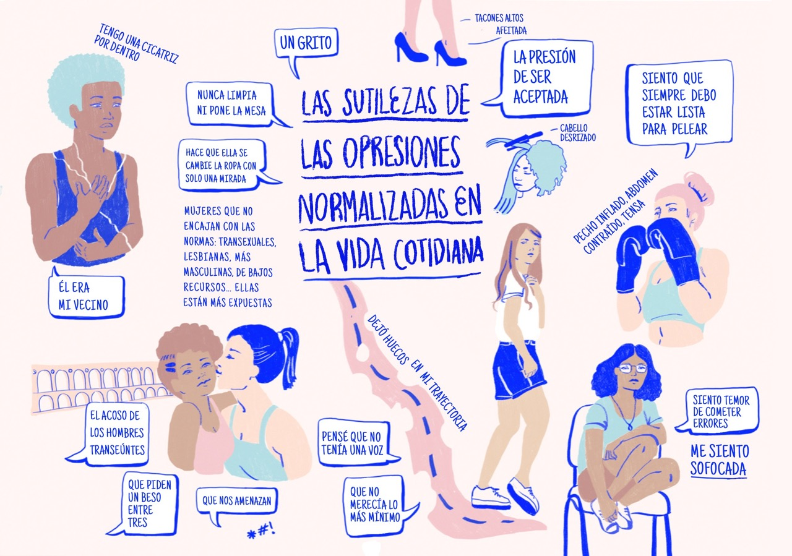
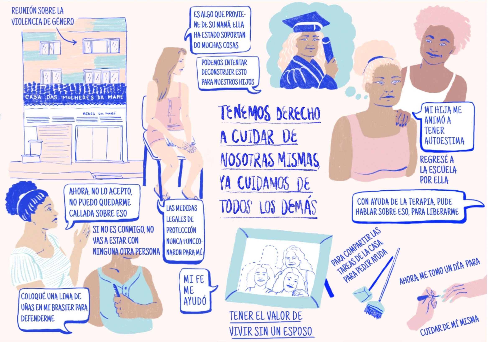
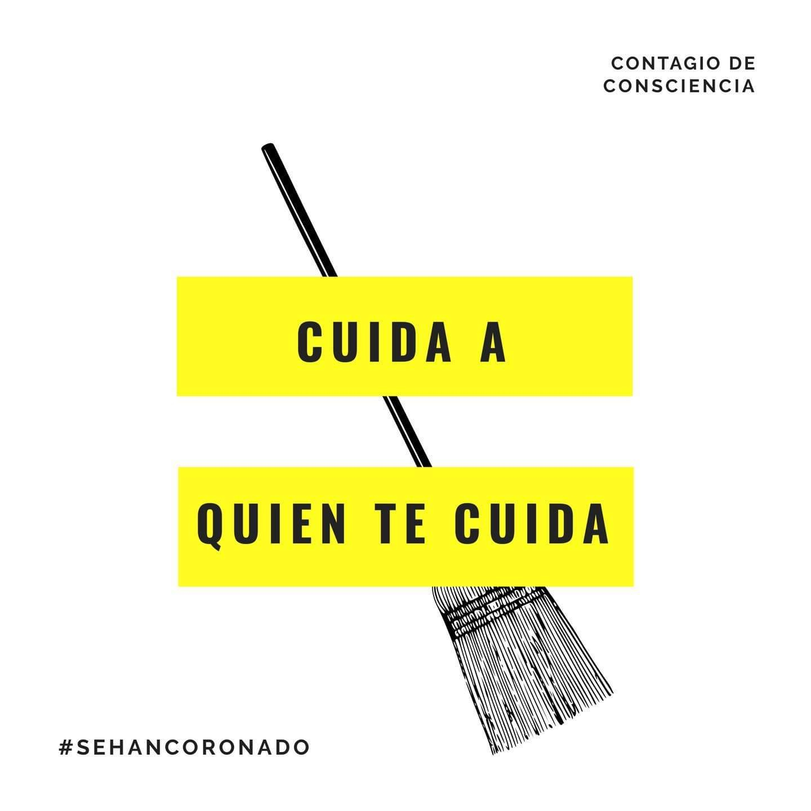
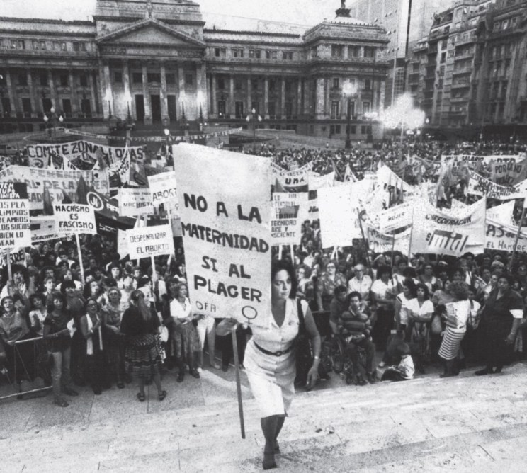
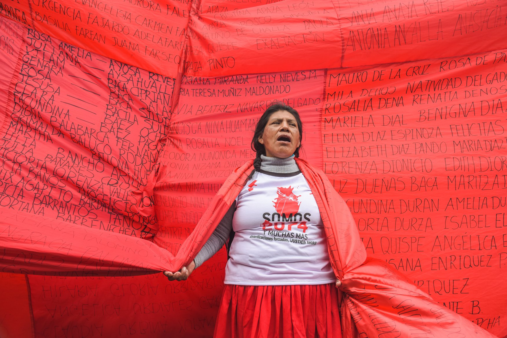
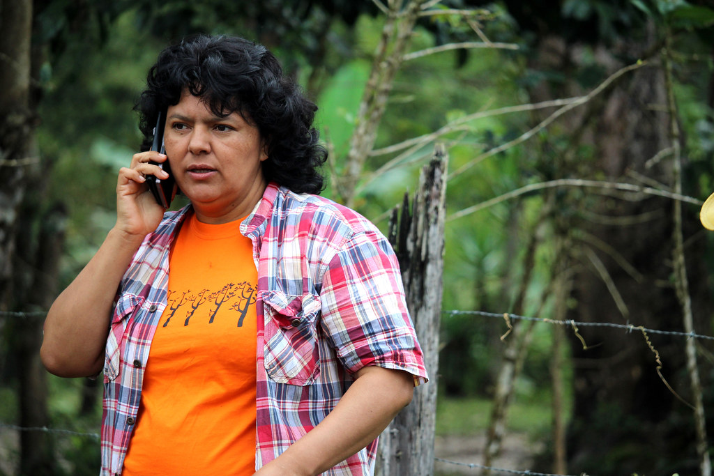
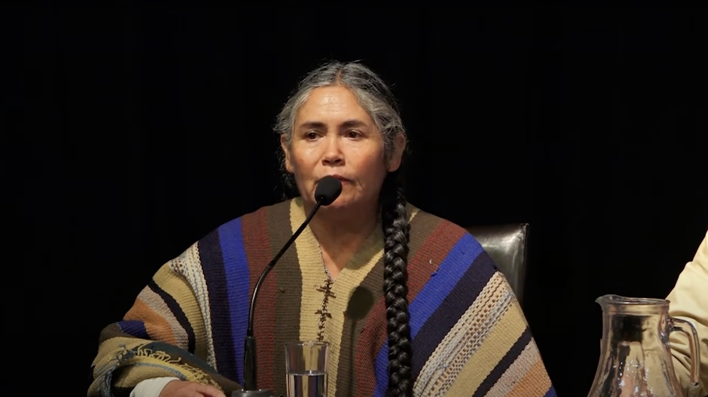
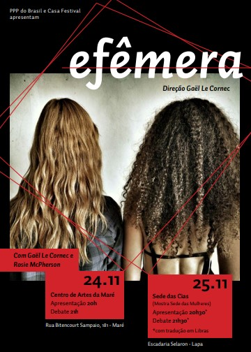
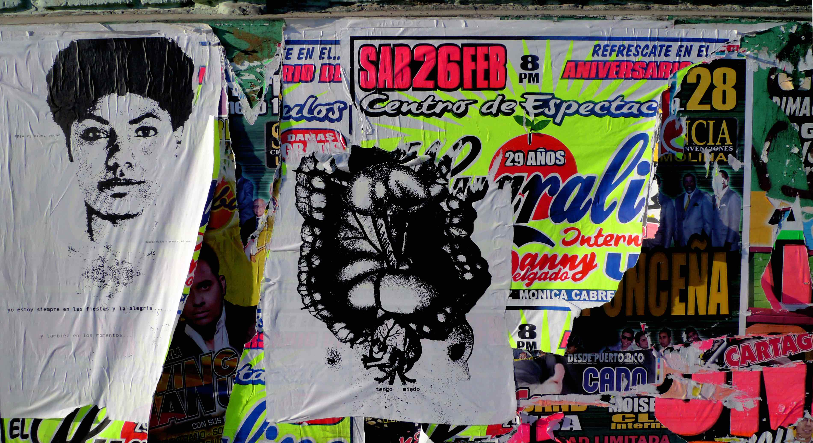

- - -

## Reconocimiento

Los alarmantes índices de violencia contra las mujeres en América Latina pueden ser abrumadores y desesperanzadores. No obstante, al resaltar estrategias y acciones concretas y eficaces –lideradas por quienes son las más afectadas por esta violencia–, el libro _Mujeres resistiendo la violencia_ desempeña un papel fundamental en la búsqueda de soluciones. Este es un valioso recurso para activistas, periodistas e investigadoras, y un poderoso registro de resistencia popular.

<I><small>Silvia Viñas, productora ejecutiva y copresentadora del podcast</i> El hilo <i>de Radio Ambulante Estudios y VICE News</i></small>

 
 

Latinoamérica es el continente con mayores índices de violencia contra las mujeres y las niñas, pero, a su vez, con una tremenda potencia para resistencias múltiples. Este libro demuestra una vez más la importancia de los lazos de sororidad entre feministas de la academia e indígenas feministas que proponen creativas formas de resistencia y teorización desde el sur. Como dice la canción: <i>nos sembraron miedo, nos crecieron alas…

<small>Rocío Silva Santisteban, poeta peruana, activista feminista, académica y excongresista</i></small>

 
 

«El Estado no me cuida, me cuidan mis amigas». Este libro muestra de forma muy completa cómo se lleva a la práctica esta consigna coreada por las mujeres latinoamericanas en las protestas de todo el continente. Desde las zonas rurales a las ciudades, en sus hogares o espacios íntimos e incluso por medio de sus propios cuerpos, vemos cómo las mujeres desatendidas por el Estado se unen para protegerse mutuamente de distintos tipos de violencias interseccionales de género.

Sus acciones incluyen movilizaciones masivas a favor del aborto y contra el feminicidio, la protección de las tierras indígenas y la naturaleza, el uso del arte para luchar por el cambio social, la creación de albergues para mujeres, aplicaciones móviles para hacer las ciudades más seguras y campañas a favor de las migrantes y las trabajadoras domésticas. Son actos de resistencia con los que las mujeres se enfrentan a la violencia sistémica y crean un mundo mejor y más seguro para todas, algo especialmente importante debido al aumento de las desigualdades provocadas por el covid-19.

Todas deberíamos leer este libro para recordar lo fuerte que es el enemigo y unirnos a la lucha desde nuestra propia posición y posibilidades (estemos donde estemos y en la medida de nuestras habilidades). Como leemos aquí, todo cuenta, incluso esperar a recibir un mensaje de que tu amiga llegó con bien a casa.

<i><small>Catalina May,</i> Las Raras<i> podcast</i></small>

 
 

Este libro altamente accesible se ocupa de uno de los problemas más importantes de América Latina en la actualidad y el futuro: la violencia contra las mujeres y las niñas. Su singularidad radica en poner en el centro la resistencia de las mujeres a la violencia, en lugar de las mujeres como víctimas de esta, en un contexto en el que la diversidad es clave, haciendo hincapié en las dimensiones interseccionales de las experiencias de las mujeres. El texto va acompañado de recuadros, ilustraciones y enlaces que enriquecen la lectura. <i>Mujeres resistiendo la violencia </i>es un texto fundamental tanto para tomadores de decisiones políticas, como para investigadores y estudiantes.

<i><small>Caroline Moser, profesora emérita de la Universidad de Manchester y profesora honoraria de la University College de Londres</i></small>

 
 

<i>Mujeres resistiendo la violencia</i> es una exploración única de las diferentes formas en que las mujeres se enfrentan a la violencia de género. El libro revisa una poderosa combinación de diferentes estrategias de resistencia en diversos contextos. Proporciona una excelente mirada del género y la interseccionalidad, incluyendo un análisis del impacto de la violencia contra las mujeres y las niñas en todas sus diversidades e impresionantes ejemplos en los que las diferentes formas de esta violencia tienen un impacto desproporcional sobre las mujeres indígenas, afrodescendientes, provenientes de zonas rurales o urbanas, migrantes y personas de la comunidad LGTBIQ+.

 <I><small>Erika McAslan Fraser, directora técnica del Ending Violence against Women and Children Helpdesk</i></small>

 
 

La lucha de las organizaciones latinoamericanas para combatir la violencia de género es una historia heroica. Este libro es un magnífico resumen de los esfuerzos de base y es clave para entender cómo convertir los ideales de igualdad en políticas y acción. Una excelente lectura que permite conocer las dificultades, pasiones y experiencias de miles de activistas en América Latina. Sin importar donde vivas, estudies o ejerzas tu profesión, muchos de estos retos también resonarán con los tuyos.

<I><small>Pamela Zaballa, directora general de NO MORE</i></small>

- - -

## Agradecimientos

El proyecto fue financiado por la Impact Acceleration Account (IAA) \[Cuenta de Aceleración de Impacto] del Economic and Social Research Council (ESRC) \[Consejo de Investigación Económica y Social] del King’s College de Londres. Este se tituló «Mujeres resistiendo las violencias de género interseccionales: desarrollo de una serie de podcast para compartir mejores prácticas e influir en la formulación de políticas públicas» como parte de una beca de políticas y prácticas otorgada en colaboración entre el King’s College (Cathy McIlwaine y Jelke Boesten) y el consejo del Latin America Bureau (LAB), con quienes estamos muy agradecidas. Además, recibimos apoyo del National Lottery Community Fund \[Fondo Comunitario de la Lotería Nacional]. Agradecemos al consejo del LAB, especialmente a Mike Gatehouse, así como a Niall Sreenan del Instituto de Políticas del King’s College por facilitar este financiamiento.

Además de agradecer a las integrantes del Colectivo WRV, agradecemos a las siguientes colaboradoras, entrevistadas y voluntarias, cuyos aportes han sido esenciales para la creación del libro: a las entrevistadas Ana Laura Aquino, Marcelina Bautista, Mary Goldsmith (capítulo 2); Verónica Gago (capítulo 3); Jessica Acuña, Clara Merino (capítulo 4); Melissa Munz (capítulo 5) y Natalia Iguiñiz (capítulo 6).

Estamos agradecidas con quienes contribuyeron a la creación de la serie de artículos para el blog del sitio web del Colectivo Women Resisting Violence: Eva Alterman Blay, Fernanda Alvarez Piñeiro, Max Drabwell McIlwaine, Claudia Hasanbegovic, Elizabeth Jiménez-Yáñez, Tallulah Lines, Rosie Thornton, Natasha Tinsley, Stephanie Wallace y Alice Wright.

Por otra parte, damos gracias a las personas que participaron en el podcast: Jennifer Alexander, Claudia Alves, Stef Arreaga, Ella Barnes, Theodora Bradford, Carolina Cal Angrisani, Serena Assumpção, Alma Carballo, Vianney Claret Hernández Mejía, Ameno Cordóva, Eliane Correa, Cecilia Cruz, Morgan Fairless Brown, Michele Gandra, Gil García, Mayra Jiménez, Elizabeth Jiménez-Yáñez, Najlla Kay, Rebeca Lane, Julia Leal, Quimy de León, Esmeralda Lobos, Luciana Lopes, Gilberto Martins, Larisa Muñoz, Giselle Nirenberg, Jonathan Panta, Renata Peppl, Juliana Postico, Hebe Powell, Noelle Resende, Mariana Reyes, Cristina Reynoso López, Moniza Rizzini Ansari, Rafael Rocha, Ana Lucía Rojas, Eliana Sousa Silva, Natasha Tinsley, Uppbeat y Wara [ver el <a class="c11" href="#h.3w19e94">apéndice</a> para más detalles].

La investigación analizada en el capítulo 5 sobre migración fue financiada por el ESRC (ES/N013247/1), la IAA del ESRC del King’s College, y por el Latin American Women’s Rights Service (LAWRS) \[Servicio por los Derechos de las Mujeres Latinoamericanas] y la Lloyd’s Foundation. La investigación en la que se basó el capítulo 1 sobre la violencia urbana de género fue financiada por el ESRC (ES/N013247/1) y la British Academy y el Global Challenges Research Fund \[Fondo de Investigación sobre Desafíos Globales](HDV190030). Estos proyectos se llevaron a cabo con diversos socios, como el Departamento de Geografía del King’s College, LAWRS, People’s Palace Projects, Queen Mary University of London, Redes da Maré, la Universidad Federal de Río de Janeiro, Migrants in Action, Museu da Pessoa y CASA Latin American Theatre Festival.

Gracias a los amigos del LAB por su apoyo.

Finalmente, gracias al Publication Subvention Fund de la Facultad de Ciencias Sociales y Políticas Públicas del King’s College por el apoyo económico para la traducción de este libro. Gracias a las traductoras Camila Vergara Ruiz, Elísabeth Frías, Javiera Menchaca Pardow, Mailén García, Mercy Sandoval, Patricia Muñoz Cabrera, Rocío Suárez López y a la editora, de esta edición en español, Alejandra Montes Escobar.

- - -

## Introducción

<i>Marilyn Thomson y Patricia Muñoz Cabrera Traducido por Camila Vergara Ruiz</i>

<small>{Estamos} tejiendo saberes, construyendo saberes colectivos para transformar políticas y prácticas injustas.  
Clara Merino (Fundación Luna Creciente, Ecuador)
</small>

América Latina tiene una de las tasas más altas de violencia de género y feminicidios del mundo, cifras que aumentaron y se intensificaron drásticamente durante la pandemia provocada por el covid-19. Aunque hay una vasta investigación sobre la naturaleza y las causas de este tipo de violencia contra las mujeres y las niñas (VCMN), poco se ha explorado sobre los atrevidos proyectos que se han diseñado para abordarla. Poner en primer plano las voces de las que han sido afectadas por este tipo de violencia y que están transformando sus comunidades es el objetivo central de nuestro Colectivo Women Resisting Violence (WRV), que busca aprender de estas acciones innovadoras.

El libro <i>Mujeres resistiendo la violencia </i>está estructurado en seis capítulos. El capítulo 1 trata sobre la manera como las mujeres en los márgenes de las ciudades interactúan a diario con la violencia urbana, cómo esta las afecta y las estrategias de resistencia a corto y largo plazo que desarrollan para enfrentarla. El capítulo 2 aborda la violencia y la discriminación que padecen las trabajadoras del hogar, como también los logros de las organizaciones que las mismas han creado y su transformación en activistas que defienden sus derechos y se convierten en actoras en el ámbito político internacional. El capítulo 3 muestra los derechos sexuales y reproductivos de las mujeres, dando cuenta de las luchas y las conquistas del movimiento feminista para que las mujeres decidan sobre sus propias vidas, a pesar de las reacciones de los movimientos conservadores y los retos que aún se deben afrontar en la región.

El capítulo 4 presenta a las lideresas y activistas por la defensa de la tierra y los territorios, sus procesos de resistencia frente a las empresas del agronegocio y de la industria extractiva, los impactos del acaparamiento de tierras y los monocultivos, y también la manera como la sostenibilidad medioambiental y el cuidado de la naturaleza forman parte de las ideas del <i>sumak kawsay o buen vivir</i>. El capítulo 5 analiza cómo las mujeres migrantes latinoamericanas afrontan la violencia y la exclusión; por medio de iniciativas coordinadas por organizaciones de migrantes y de derechos de las mujeres, vemos cómo exigen un mayor reconocimiento de sus necesidades para influir en la formulación de políticas que las protejan. Por último, el capítulo 6 se centra en los actos de memorialización, resiliencia y conmemoración de las mujeres por medio del artivismo, cómo resisten y protestan frente a la impunidad y las violencias institucional, militar o de género a las que han sido históricamente sometidas.

Debido a la complejidad de los problemas que engloba la VCMN, se requiere de una amplia gama de respuestas y acciones políticas para poder proteger a las mujeres y las niñas de las diferentes formas de abuso y violencia contra ellas. Por eso en este libro resaltamos la importancia de presentar algunas de las estrategias, las campañas y las actividades inspiradoras e innovadoras que las mujeres han emprendido para resistir los tipos de violencia en diferentes países latinoamericanos y dentro de la diáspora en el Reino Unido. También examinamos las acciones exitosas de organizaciones de mujeres que abordan la VCMN en el ámbito político.

Los estudios de caso presentados en este libro ponen en evidencia finalmente no solo la magnitud de la VCMN en la región, sino también cómo en casos de violencia militarizada, institucional o corporativa, frente al poder violento del Estado, la violencia machista dentro del hogar o en los espacios públicos las mujeres se movilizan de manera colectiva para exigir justicia. Estas acciones y estrategias merecen ser difundidas hasta que haya una transformación política suficiente que erradique la VCMN. Es por esto que al final del libro presentamos algunas recomendaciones de políticas públicas que los responsables políticos podrían adoptar para ayudar con este propósito.

Esta introducción propone, además, una contextualización teórica más amplia sobre el panorama de la violencia de género y las violencias interseccionales que enfrentan las mujeres y las niñas de América Latina.

<h3 class="c14" id="h.17dp8vu">Contexto de este libro </h3>

Este libro, escrito de forma colaborativa por las integrantes del Colectivo WRV, se basa en los hallazgos principales de dos proyectos que se han llevado a cabo desde el 2006. El primero consistió en un proyecto conjunto entre el Central American Women’s Network (CAWN) \[Red de Mujeres de Centroamérica\]<a href="#ftnt1" id="ftnt_ref1"> \[1\]</a> con el Centro de Estudios de la Mujer en Honduras (CEMH), en el cual se abordaron la violencia de género y la pobreza en las comunidades más marginadas de Honduras a lo largo de cinco años, de 2006 a 2011. El segundo, «Women resisting gendered and intersectional violence» (2021-2022) \[«Mujeres resistiendo la violencia interseccional y de género»\], es el resultado de una colaboración entre el King’s College de Londres y el Latin American Bureau (LAB), el cual documenta algunas de las estrategias innovadoras que han utilizado las latinoamericanas para mitigar la VCMN. 

Estas estrategias se difundieron por medio de un sitio web y blog, un podcast narrativo,<a href="#ftnt2" id="ftnt_ref2"> \[2\]</a> eventos públicos y este libro, escrito originalmente en inglés. Uno de nuestros objetivos principales fue poner en primer plano las voces de quienes se han visto afectadas por la VCMN, tanto en América Latina como en su diáspora fuera del continente, con un enfoque particular en el Reino Unido. También destacamos el poder de las colaboraciones entre las organizaciones de la sociedad civil y los proyectos de investigación académica.

Algunos de los hallazgos principales del proyecto tienen que ver con la manera como las mujeres han surgido como protagonistas en la lucha contra la violencia de género, con el desarrollo de formas innovadoras de resistencia y resiliencia y de propuestas de transformación, ya sean campañas, respuestas políticas de base, protestas públicas, abordajes desde el arte o proyectos de subsistencia comunitarios. También, que la VCMN sigue siendo profundamente interseccional, pues afecta de manera desproporcionada a las mujeres de escasos recursos económicos y más aún cuando pertenecen a otras categorías sociales oprimidas (ya sean mujeres afrodescendientes, indígenas, de zonas urbanas y rurales, pertenecientes a la comunidad LGTBIQ+ o migrantes). Y, por último, que la VCMN está profundamente arraigada en violencias estructurales más amplias, y en particular las que comete el Estado.

La versión original en inglés de <i>Mujeres resistiendo la violencia</i> fue publicada por el Latin America Bureau y Practical Action Publishing en 2022. En agosto-septiembre de 2023, el Colectivo WRV recibió financiamiento del Publication Subvention Fund \[Fondo de Subvención para Publicaciones] de la Facultad de Ciencias Sociales y Políticas Públicas del King’s College de Londres para traducir el libro al español y al portugués. Esto permite que las colaboradoras de habla española y portuguesa puedan leer su testimonio publicado junto con el de otras activistas de derechos de las mujeres de diferentes territorios. También, les permite compartir el libro con personas amigas, familiares y colegas y, lo más importante, llevar su testimonio a una audiencia más amplia en América Latina. Las traducciones fueron realizadas por 14 mujeres latinoamericanas comprometidas con los temas abordados en el libro. Esto se convirtió en otra fuerza más para la solidaridad internacional y la construcción de comunidad. La versión en portugués será publicada próximamente por la Editora Jandaíra en Brasil.

Dos de las coautoras de este libro escribieron, respectivamente, un informe pionero sobre violencias interseccionales (Muñoz Cabrera, 2010) y una caja de herramientas (Thomson, 2011), con ejemplos prácticos de cómo las organizaciones de mujeres, las oenegés y los grupos comunitarios de América Latina usaban enfoques interseccionales. Las coautoras consideran que las innovaciones y los resultados de este proyecto aún son relevantes para las organizaciones de mujeres de hoy en día en su lucha por la erradicación de la VCMN.

El marco conceptual y los hallazgos del proyecto CAWN/CEMH son pertinentes para esta colección de estudios de caso de varias actividades que han logrado reducir la violencia. El proyecto de Honduras demostró que cuando buscamos empoderar a las mujeres y volverlas más capaces de combatir la violencia y mejorar sus medios de subsistencia, un enfoque multifacético puede ser muy eficaz, por ejemplo, combinando: el fomento de la igualdad de género por medio de la sensibilización de los hombres y la promoción de masculinidades no violentas; el mejoramiento de los servicios del Estado para las mujeres afectadas por la violencia, y el uso de la incidencia política para influir sobre las decisiones de responsables políticos y otros agentes en Honduras e internacionalmente por medio de la investigación y la abogacía. 

El proyecto reconoció la situación inicial de las mujeres como víctimas cuando se unieron a las actividades, pero luego, al propiciar la sensibilización y el apoyo mutuos, celebró su papel de sobrevivientes de la violencia y agentes de cambio transformador en sus propios contextos. Sobre todo, el proyecto destacó que las experiencias de violencia de las mujeres deben abordarse mediante una lente interseccional para poder desarrollar respuestas adecuadas. Este enfoque interseccional hizo posible que las mujeres de escasos recursos económicos, semiurbanas y rurales pudieran amplificar sus voces, hacerle frente a la violencia y participar en soluciones concretas a los problemas que padecen. Un logro clave fue que las mujeres pudieron informarse acerca de sus derechos y desarrollar una mejor autoestima, muchas de ellas pudieron compartir sus necesidades y, de esta manera, empezar a ejercer más control sobre sus vidas y su bienestar.

<h3 class="c14" id="h.lnxbz9">La violencia: un obstáculo para la equidad</h3>

La VCMN es la manifestación más extrema del sexismo que permea todas las sociedades y los países, y atraviesa todas las demás formas de discriminación, ya sea por la clase social, la raza o la etnia. Aunque la pobreza, el conflicto y las crisis sociales pueden agravar muchos tipos de violencia, no son sus únicas causas: las relaciones desiguales de poder, la distribución injusta de la riqueza y el acceso desigual a la tierra, la propiedad y los recursos productivos también intensifican la VCMN en diferentes contextos. También se debe tener en cuenta la violencia del Estado, especialmente en el caso de los países con gobiernos autoritarios.

La violencia afecta a las mujeres y las niñas tanto en el espacio privado como en el público: en sus relaciones personales, en su vida laboral y sus actividades económicas, y en cómo se desenvuelven en sus comunidades. En el ámbito doméstico, la VCMN puede ser devastadora para las familias y las comunidades, ya que perpetúa una violencia continua que afecta todos los aspectos de la vida. La VCMN puede excluirlas de una participación significativa en la vida política y comunitaria, además de afectar directamente sus vidas, sus medios de subsistencia y sus derechos humanos.

<h3 class="c14" id="h.35nkun2">Abordar la VCMN de manera transformadora</h3>

<h4 class="c106 c66"><i>Mujeres tejiendo poderes sobre el terreno</i></h4>

Un aspecto exitoso del proyecto CAWN/CEMH fue el método holístico y colectivo que se utilizó para abordar la VCMN, bajo el cual las mujeres ocuparon un lugar central como agentes poderosas capaces de transformar su realidad, en vez de un modelo más individualista y centralizado. Estas mujeres se convirtieron en guías y gestoras de procesos de autoempoderamiento dentro de sus mismas comunidades, enfrentando la violencia que afecta sus vidas cotidianamente. Otro elemento importante fue compartir narrativas y propuestas feministas e informar a las mujeres de las organizaciones participantes sobre las causas subyacentes de la violencia y la discriminación que sufren. Esto condujo a la investigación y publicación de un estudio pionero sobre las violencias interseccionales (Muñoz Cabrera, 2010) y una caja de herramientas (Thomson, 2011), con ejemplos prácticos de cómo las organizaciones de mujeres, las oenegés y los grupos comunitarios de varios países latinoamericanos estaban abordando la diferencia, la exclusión y la discriminación. En ese entonces, la interseccionalidad como concepto no había sido acogida del todo en el contexto latinoamericano, y había mucho interés por desarrollar este tipo de análisis en el caso del activismo de mujeres. Para las organizaciones de mujeres involucradas en esta investigación, el proyecto les ayudó a fortalecer sus acciones y activismo para transformar su situación en Honduras y condenar la impunidad social e institucional que rodea a la VCMN.

El enfoque transformador del proyecto en Honduras resultó sostenible, comprobado por el empoderamiento de las mujeres indígenas (lenca)<a href="#ftnt3" id="ftnt_ref3"> \[3]</a> y afrodescendientes (garífuna)<a href="#ftnt4" id="ftnt_ref4"> \[4]</a> que viven en situación de pobreza en zonas remotas, así como mujeres lesbianas y trans que viven en comunidades urbanas marginadas. Algunos aspectos de este abordaje transformador se adoptaron como punto de partida del siguiente proyecto de King’s College/LAB, y de su enfoque en la resistencia, la resiliencia y las nuevas propuestas que también deben examinarse desde la interseccionalidad.

<h4 class="c106 c66"><i>Un enfoque interseccional</i></h4>

El análisis interseccional pone de manifiesto las múltiples maneras en que a las mujeres se les margina por el hecho de ser mujeres. Por ejemplo, por tener cierta edad; por ser de cierta región geográfica; por pertenecer a una minoría étnica, religiosa o lingüística; por su identidad de género u orientación sexual, entre otras. Y también expone la complejidad de la violencia y la discriminación que sufren.<a href="#ftnt5" id="ftnt_ref5"> \[5]</a> La definición original de la interseccionalidad aparece en 1975 por parte del Combahee River Collective \[Colectivo del Río Combahee] (Taylor, 2017), una organización feminista socialista de lesbianas negras de Boston. Kimberlé Williams Crenshaw (1991) y, posteriormente, otras feministas negras de los Estados Unidos, como Patricia Hill Collins (2009), siguieron teorizando sobre este concepto para comprender cómo el racismo –en intersección con la discriminación de género y de clase– desempoderaba a las mujeres afroamericanas de formas muy particulares. El concepto de la interseccionalidad también ha sido desarrollado por feministas latinoamericanas como Sueli Carneiro (2003; 2017), Beatriz Nascimento (2021) y otras, en especial las que trabajan dentro de un marco feminista decolonial, como María Lugones (2010) y Ochy Curiel (2015). 

Una perspectiva interseccional logra identificar cómo se expresan los múltiples tipos de opresión entrelazados en diferentes contextos y de formas complejas, privando a las mujeres de sus derechos humanos fundamentales, limitando sus opciones y perpetuando la desigualdad en términos de acceso a recursos y de oportunidades para participar plenamente en la vida social, económica y política. Las mujeres pertenecientes a grupos indígenas son especialmente vulnerables a las violencias interseccionales debido a su clase socioeconómica y etnia, y sufren por estereotipos arraigados en el legado del colonialismo. Incluso las mujeres indígenas y negras que participan en sistemas de autoridad locales o que han sido elegidas para puestos políticos enfrentan violencia y prejuicios. 

Las mujeres que viven con algún tipo de discapacidad pueden tener necesidades diferentes y son posiblemente más vulnerables a la violencia que otras mujeres, mientras que el tipo de discapacidad y su grado de dependencia de otras personas para recibir apoyo también pueden determinar cuánto acceso tienen a servicios o a la justicia cuando se cometen delitos en contra de ellas. Es importante comprender cómo se entrecruzan distintos mecanismos de discriminación para excluir aún más a las mujeres y las niñas que no se ajustan a los estándares normativos de la feminidad dentro de sociedades patriarcales y capitalistas poscoloniales estructuradas alrededor de la raza, la clase y el género. Por lo tanto, se debe integrar este análisis con cualquier respuesta que le haga frente a los diferentes tipos de violencia. Las normas sociales y de género, así como la desigualdad económica y política y el legado del colonialismo que refuerza el Estado, son factores clave de la VCMN en América Latina. Por ello, las organizaciones de mujeres exigen narrativas, políticas y legislaciones que ayuden a reducir o al menos mitigar las distintas formas de VCMN y a proteger los derechos y la integridad física de las mujeres.

<h4 class="c106 c66"><i>Enfrentar el poder</h4></i>

Como demuestran los estudios de caso de este libro, una de las causas principales de la VCMN es la desigualdad en las relaciones de poder entre mujeres y hombres.<a href="#ftnt6" id="ftnt_ref6">\[6]</a> El patriarcado, el racismo, el capitalismo consumista y el colonialismo –sistemas que refuerzan el poder político, económico, social y cultural de los hombres sobre las mujeres– empeoran y perpetúan esta desigualdad, y también forman la base de las masculinidades dominantes (y tóxicas) que agravan la desigualdad en cuanto a control de recursos y toma de decisiones en el hogar, el mercado o las instituciones públicas.

En algunos países de América Latina, los hombres han formado una red regional conocida como MenEngage América Latina,<a href="#ftnt7" id="ftnt_ref7">\[7]</a> donde se cuestionan los ideales dominantes de la masculinidad y se rechazan los comportamientos masculinos estereotípicos que permiten la violencia. Algunas organizaciones, como el Instituto Promundo Brasil,<a href="#ftnt8" id="ftnt_ref8">\[8]</a> reconocen lo importante que es trabajar con los niños desde una edad temprana para cuestionar y cambiar las relaciones desiguales y la violencia. También trabajan con jóvenes de todos los géneros para encontrar nuevos modelos de relaciones equitativas para las generaciones futuras. Sin embargo, esto no es suficiente. El cambio de mentalidad y la transformación de las desigualdades estructurales necesarios para acabar con la VCMN también se deben ver en el ámbito político. En la actualidad, los políticos, que muchas veces representan a las élites sociales y económicas, diseñan y aplican políticas muy alejadas de la realidad cotidiana de las mujeres y que no les permite que gocen de sus derechos fundamentales al igual que los hombres. 

Las políticas económicas que provienen del modelo neoliberal de desarrollo económico también han contribuido al complejo panorama de la VCMN y han intensificado la marginación estructural de las mujeres. Este modelo ha desencadenado un nuevo proceso de desposesión para las mujeres de escasos recursos económicos, indígenas y negras, negándoles el derecho a la tierra, la propiedad, el trabajo digno y los servicios sociales. Los legados tan profundamente arraigados del colonialismo que permean los sistemas políticos, socioeconómicos y culturales en toda América Latina han exacerbado estos procesos, subyugando a las mujeres y en especial a las de color. Los estudios de caso de este libro muestran que un enfoque interseccional nos puede ayudar a comprender las luchas de las mujeres en contra de las diferentes formas de violencia que están profundamente enraizadas en los sistemas patriarcales, neoliberales, coloniales y racistas de poder y opresión, incluyendo la violencia económica y la explotación laboral.

<h3 class="c14" id="h.44sinio">La naturaleza y la extensión de la VCMN</h3>

Las formas múltiples e interrelacionadas de la VCMN no han disminuido durante la última década, más bien se han vuelto aún más visibles. Ha habido un aumento alarmante de feminicidios en toda América Latina, los organismos públicos estatales ejercen cada vez más control sobre los derechos reproductivos, han incrementado los crímenes de odio contra las personas LGTBIQ+, hay más hostilidad hacia las mujeres migrantes, incluyendo más trata con fines de explotación sexual, y una mayor incidencia y visibilidad del acoso y el abuso sexual en el trabajo y en los espacios públicos.

La Organización Mundial de la Salud (OMS, 2018) estima que, en América Latina, el 25 % de las mujeres (entre 55 y 66 millones) sufrirán violencia de pareja a lo largo de su vida y el 12 % (se estima que entre 25 y 30 millones) de las mujeres serán víctimas de violencia de personas diferentes a sus parejas.<a href="#ftnt9" id="ftnt_ref9">\[9\]</a> La tabla 1.1 presenta las estadísticas oficiales sobre la VCMN en la región; sin embargo, no muestra una imagen completa, ya que estos datos no incluyen a las niñas más jóvenes y a las mujeres mayores que no son de edad reproductiva, pero que también han sido víctimas de diferentes formas de violencia. Hay una escasez de datos desglosados, ya que estas estadísticas se basan en las declaraciones de las propias mujeres. La OMS y la ONU Mujeres han reconocido este problema y diseñado un programa mundial de cinco años (2018-2022) para desarrollar las metodologías que miden la VCMN y mejorar la recopilación de datos en los ámbitos nacional y regional. Se han identificado varios obstáculos para las mujeres al momento de hacer una denuncia, como la normalización de la violencia de pareja en ciertas comunidades, o el miedo a que hacer una denuncia con la policía en contra de su pareja vuelva aún más difícil su situación.

 

<b>Tabla 1.1</b>

<i>Proporción de mujeres adultas víctimas de violencia física y/o sexual por parte de su pareja (a lo largo de la vida y en los últimos 12 meses) en países seleccionados de América Latina</i>

| País               | Violencia de pareja física y/o sexual a lo largo de la vida | Violencia física y/o sexual de pareja en los últimos 12 meses |
| ------------------------------------ | -------------------------- | ------------------------------|
| Argentina (2015)   | 27 %                                                        | 3 %                                                           |
| Bolivia (2016)     | 58.5 %                                                      | 27 %                                                          |
| Brasil (2018)      | 17 %                                                        | 3 %                                                           |
| Colombia (2015)    | 33 %                                                        | 18 %                                                          |
| Ecuador (2014)     | 40 %                                                        | 11 %                                                          |
| El Salvador (2017) | 14 %                                                        | 6 %                                                           |
| México (2016))     | 25 %                                                        | 9.5 %                                                         |
| Perú (2017)        | 31 %                                                        | 11 %                                                          |
| Uruguay (2013)     | 17 %                                                        | 3 %                                                           |

<small>
Fuente: Recopilado del Global database on violence against women \[Base de datos mundial sobre la violencia contra las mujeres] (UN Women, 2022).
</small>

Durante la pandemia de covid-19, se registró un aumento de la frecuencia y la intensidad de la violencia doméstica e intrafamiliar en toda América Latina. Las mujeres de barrios urbanos periféricos sufrieron niveles especialmente altos de violencia doméstica. Por ejemplo, en el estado de Río de Janeiro, a pesar de que no se denunciaron todos los casos de violencia, los datos disponibles muestran que cada día durante el confinamiento, más de 250 mujeres fueron víctimas de violencia, sumando a 73.000 mujeres solo entre marzo y diciembre de 2020, y el 61 % de estos casos ocurrieron dentro del hogar (ISP, 2021). También se registraron grandes diferencias dentro de países específicos. Por ejemplo, en Brasil más de la mitad de las 3089 niñas menores de 14 años que fueron víctimas de una violación durante el 2019 eran negras (Wright, 2021). Sin embargo, en general hay una falta de información y de datos desagregados sobre los crecientes niveles de VCMN, que afectan sobre todo a las mujeres indígenas y afrodescendientes, migrantes y desplazadas internas, así como a las mujeres que viven con algún tipo de discapacidad, las que han sido víctimas de la trata de personas, las que pertenecen a la comunidad LGTBIQ+, entre otras. Por esta razón, los datos empíricos recogidos sobre el terreno son esenciales para comprender mejor el grado de violencia que afecta a los distintos grupos de mujeres.

La pandemia también provocó un aumento precipitoso del ciberacoso, el hostigamiento en línea, el acecho cibernético y la incitación al odio hacia las mujeres y las niñas en todo el continente. Aunque hay pocos datos al respecto, un estudio de Plan International (2020) descubrió que el 52 % de las niñas y las mujeres jóvenes de entre 15 y 25 años que participaron en una encuesta en los países latinoamericanos seleccionados habían experimentado algún tipo de acoso en línea en plataformas de medios sociales. El acoso en las redes sociales comienza desde que son jóvenes, ya que la mayoría de las niñas contestaron que su primera experiencia ocurrió entre los 14 y 16 años (Smit &amp; Fraser, 2022). Además de las adolescentes y las mujeres jóvenes, las defensoras de los derechos humanos, las mujeres políticas, las periodistas, las blogueras, las pertenecientes a minorías étnicas, las mujeres lesbianas, las bisexuales, las transgénero y las mujeres con discapacidades también corren mayor riesgo de sufrir violencia en línea (UN Women, 2020). Una investigación realizada en siete países de América Latina descubrió que las mujeres periodistas experimentan altos niveles de abuso en las redes sociales, lo que ha llevado a más de dos tercios (68 %) de ellas a autocensurarse y retirarse de debates y discusiones en línea (Cuellar &amp; Chaher, 2020).

El feminicidio no es un fenómeno nuevo en América Latina, pero ha habido un aumento drástico en la última década, y en particular desde el 2020 a raíz de la pandemia de covid-19.<a href="#ftnt10" id="ftnt_ref10">\[10]</a> Por ejemplo, según un informe de Amnistía Internacional, en 2020 se registraron 3723 asesinatos de mujeres en México, aunque solo 940 se investigaron como feminicidios (Amnesty International, 2021). El feminicidio es común en todo el continente y estos asesinatos muchas veces se llevan a cabo deliberadamente y con extrema crueldad, frecuentemente por parejas o familiares de la víctima. Sin embargo, en otros casos, mujeres jóvenes han sido asesinadas por hombres involucrados en bandas criminales y en el tráfico de drogas o de personas. Tan solo hay que leer las descripciones de las organizaciones de mujeres sobre la tortura y la extremada crueldad hacia las víctimas en los casos de feminicidios para determinar que estos crímenes son actos de odio hacia las mujeres, como se ha señalado en el caso de Guatemala (Wallace, 2021). Desde una perspectiva interseccional, también cabe señalar que las personas pertenecientes a la comunidad LGTBIQ+ suelen ser las más propensas a ser asesinadas. Por ejemplo, el colectivo brasileño Grupo Gay da Bahía \[Grupo Gay de Bahía\] señala que, cada hora, una persona LGTBIQ+ muere en Brasil (citado en De Souza y Rodrigues Selis, 2022). También se ha visto que, en Brasil, las tasas de lesbocidio han incrementado de manera drástica en los últimos años, aumentando un 237 % entre 2016 y 2017 (Davidson, 2019). 

Un informe reciente destaca una serie de problemas que afectan a las niñas y las jóvenes en América Latina, como el acoso sexual frecuente en los espacios y en el transporte públicos; una tendencia creciente de violencia en línea facilitada por las TIC; la violencia de género relacionada con la escuela, mientras que los matrimonios y las uniones forzadas infantiles y tempranas no se reconocen como un problema importante en varios países donde se practica. Con el aumento de los flujos migratorios como consecuencia de la pobreza, la violencia urbana y las catástrofes medioambientales, las mujeres y las niñas también corren un riesgo cada vez mayor de ser víctimas de la trata con fines de explotación sexual o laboral (Smit &amp; Fraser, 2022).

    

 

<b>Recuadro 0.1: Feminicidios en países seleccionados (2021)</b>

| País      | Número de feminicidio | Taza de feminicidios por cada 100.000 mujeres |
| ---------      | ---------------------           | --------------------------------------------        |
| Argentina | 210                   | .92                                           |
| Chile     | 52                    | .52                                           |
| Colombia  | 622                   | 2.40                                          |
| Ecuador   | 195                   | 2.21                                          |
| Uruguay   | 30                    | 1.67                                          |

La edad promedia de las víctimas fue 34 años. En la mayoría de los casos los delitos fueron perpetrados por una pareja o expareja, otro familiar hombre o alguien conocido de la víctima. Solo en tres casos el agresor era desconocido. La mayoría fueron asesinadas con un arma de fuego o con cuchillos, pero se utilizaron otros métodos como la quema, la asfixia, la tortura y el envenenamiento.

<small>
 Fuente: Mapa Latinoamericano de Feminicidios (Mundosur, 2021).
</small>

Aunque la violencia racial y cultural contra las mujeres indígenas y afrodescendientes no es nueva, hoy en día hay mucha más conciencia de ella, y las organizaciones de mujeres y académicas feministas están identificando y exponiendo estas diferentes formas de VCMN por medio de la investigación y la incidencia. Pero, aun así, hace falta más atención de parte de los políticos, por lo cual es esencial que se apoye cada vez más al movimiento de mujeres y a las iniciativas desarrolladas por las mujeres sobre el terreno en particular. Esto es especialmente importante en América Latina, donde esta violencia es muy frecuente, pero donde a la vez hay mucho potencial para generar cambio gracias a la fuerza del movimiento de mujeres en esta región. 

<h3 class="c14" id="h.4i7ojhp">Formas de violencia interseccionales y las consecuencias de la pandemia para los derechos de las mujeres</h3>

En los estudios de caso de este libro, destacamos problemas específicos que afectan a mujeres de diversos orígenes y entornos sociales y económicos a la hora de considerar la prevalencia de la VCMN. La violencia económica afecta a las mujeres con trabajos precarios y la pandemia de covid-19 hizo más evidente esta forma de violencia, además de agravar la violencia de pareja y las desigualdades y la discriminación de género que ya eran comunes en América Latina. Las mujeres indígenas son económicamente vulnerables, especialmente en las zonas urbanas, donde suelen trabajar en el sector informal, por ejemplo, como vendedoras ambulantes o como trabajadoras de hogar, y el encierro les impidió que muchas pudieran seguir generando ingresos de esta manera. Las mujeres que viven en situación de pobreza fueron especialmente vulnerables a enfermarse del virus porque sus condiciones de vida no les permitía seguir los consejos de salud pública, como permanecer en casa o mantener la distancia. Esto se destaca en el capítulo 1 que demuestra cómo muchas de las mujeres en zonas urbanas viven en hogares hacinados y en comunidades donde no hay agua corriente o hay escasez de agua, por lo que no les fue posible lavarse las manos constantemente. La oficina regional de la ONU Mujeres en Panamá también destaca la vulnerabilidad de las trabajadoras domésticas en toda América Latina debido a la crisis causada por el covid-19, de la que se informa en el capítulo 2. La pandemia afectó de manera desproporcionada a las mujeres, pero no ha acallado sus demandas por un acceso igualitario a la justicia y un cambio hacia políticas no discriminatorias.

Durante la pandemia, las organizaciones de mujeres han encontrado juntas plataformas y peticiones comunes mediante redes regionales, como el Comité de América Latina y el Caribe para la Defensa de los Derechos de las Mujeres (CLADEM, 2020), que adoptó una postura muy clara en contra de la VCMN durante la pandemia,<a href="#ftnt11" id="ftnt_ref11">\[11\]</a> y la Red Latinoamericana contra la Violencia de Género (2020) que difundió un manifiesto contra el aumento de esta.<a href="#ftnt12" id="ftnt_ref12">\[12\]</a>

La falta de derechos reproductivos y de salud sexual ha provocado numerosas protestas y campañas de feministas y organizaciones de mujeres en los últimos años. Por un lado, gracias a la presión ejercida por las campañas feministas sobre los gobiernos, se ha expandido el derecho al aborto en varios países, como Argentina, Colombia y México. Por otro lado, los movimientos y los gobiernos conservadores también han formado una oposición exitosa a estos avances, convirtiendo los derechos reproductivos en un campo de batalla por la autonomía corporal de las mujeres en todo el continente. El capítulo 3 presenta cómo las políticas del aborto represivas y la falta de acceso a métodos anticonceptivos y educación sexual exponen a muchas mujeres y niñas a intensas formas de violencia contra su integridad corporal. Las respuestas a la pandemia de covid-19 solo han reducido aún más el acceso a estos servicios. El aumento del número de embarazos de adolescentes e incluso preadolescentes durante la pandemia y la cuarentena demuestra los altos niveles de violencia sexual contra las niñas dentro de sus propios hogares y comunidades.

La VCMN es multidimensional y puede manifestarse de muchas formas. Por ejemplo, se ha demostrado que la violencia estatal, institucional, y policial afecta de manera desproporcionada a las mujeres negras en toda América Latina. Como se muestra en el capítulo 5, las mujeres latinoamericanas migrantes a menudo se ven afectadas por el racismo, la discriminación y diferentes formas de violencia cuando residen en países del norte global. Es importante seguir reflexionando sobre los factores estructurales para comprender la VCMN, un concepto desarrollado por primera vez por la profesora británica Liz Kelly (1988) para mostrar cómo las múltiples formas de violencia de género, desde la explotación y la discriminación hasta la violación y el asesinato, existen dentro de un continuo, interrelacionándose y reforzándose mutuamente, en lugar de existir en una jerarquía. Por ello, se necesita una amplia gama de acciones variadas si queremos cuestionar las relaciones sociales desiguales, transformar actitudes y prácticas y cambiar las instituciones y los valores sociales. 

En sus intentos por hacerle frente a la violencia estatal como un vestigio del legado colonial, algunas mujeres indígenas han desarrollado un marco conceptual para distinguir las formas específicas de violencia que les afectan ya sea debido a su etnia, raza, clase social o al legado del colonialismo. Este marco también incluye la conexión entre sus derechos humanos como mujeres y como pertenecientes a comunidades indígenas. Critican la violencia espiritual, simbólica, territorial y medioambiental que va en contra de sus creencias culturales y sus interacciones con la madre tierra como se ve en el capítulo 4. En muchas de las zonas donde se encuentran comunidades indígenas y campesinas en varios países latinoamericanos se han cometido actos de violencia extrema por parte de policías y guardias de seguridad privados que protegen los intereses de las grandes empresas y no los de las comunidades. Las mujeres luchan junto con los hombres de sus comunidades contra la minería, la deforestación y los modelos económicos que están destruyendo sus territorios nativos y privándolas del acceso al control de la tierra, el territorio y la propiedad.

<h3 class="c14" id="h.3whwml4">Armar una respuesta en contra del poder: estrategias de resistencia y marcos conceptuales</h3>

Ante la falta de acción por parte de las autoridades, además de la criminalización y la estigmatización de las mujeres por protestar y reivindicar sus derechos, muchas organizaciones de mujeres dentro del continente y fuera de él se han resistido de diversas maneras, incluyendo estrategias y marcos conceptuales basados en sus propias experiencias de violencia de género e interseccional. En general, estas estrategias de resistencia destacan la capacidad de las mujeres para empoderarse propia y colectivamente y la agencia transformadora que tiene cada una. Los diferentes marcos de resistencia son tan diversos como las mujeres que los llevan a cabo sobre el terreno, y es importante destacar que muchos de ellos han sido documentados por académicas y activistas feministas con visiones afines, y otros se han basado en el pensamiento teórico feminista. En un contexto donde la resistencia tiene todo que ver con las relaciones de poder interseccionales (Hooks, 1990), muchas feministas latinoamericanas han influido las luchas en contra de la violencia masculina hacia la mujer en todo el continente. Los argumentos de Rita Segato (2016), que caracterizan a la violencia de género en América Latina como una guerra contra los cuerpos de las mujeres arraigada en la combinación del Estado colonial, el capitalismo neoliberal y el patriarcado han impulsado muchos ejemplos públicos de resistencia, como el <i>performance</i> de protesta «Un violador en tu camino» creado por Las Tesis en Chile que tanto se ha difundido. Verónica Gago (2019) se basa en las ideas de Segato para argumentar que la violencia de género es multidimensional y que tal reconocimiento permite que se cuestionen las estructuras de esta violencia, generando resistencia \[ver también De Souza &amp; Rodrigues, 2022]. 

Las estrategias y los marcos de resistencia de las organizaciones y los movimientos de mujeres en América Latina pueden resumirse de la siguiente manera:

<h3 class="c106 c66">La creación de observatorios y mapas de feminicidios</h3>

Las organizaciones de mujeres están llevando a cabo investigaciones y monitoreando el fenómeno de los feminicidios: recopilando datos para visibilizar los delitos, creando conciencia pública, y abogando para que el Estado también actúe para prevenir y castigar los delitos violentos contra las mujeres en espacios privados y públicos. Sus estrategias de resistencia incluyen demandar la rendición de cuentas del Estado y exigir que los políticos y legislativos asuman una mayor responsabilidad en la protección de las mujeres y las niñas y en la prevención de la VCMN.

Entre las activistas feministas latinoamericanas que han cartografiado la violencia de género y los feminicidios en específico, se encuentran María Salguero en México, Ivonne Ramírez en Ciudad Juárez, México, donde las tasas de feminicidio son especialmente elevadas, y Helena Suárez Val en Uruguay, así como el Colectivo de Geografía Crítica en Ecuador.<a href="#ftnt13" id="ftnt_ref13">\[13\]</a>

<h3 class="c106 c66">Movilizaciones para denunciar, prevenir y castigar la VCMN interseccional de género</h3>

**Divulgación:** el nivel de explotación y discriminación de las mujeres en los espacios públicos y privados es ahora más conocido gracias a los denodados esfuerzos de las organizaciones feministas y de mujeres, que han documentado, divulgado y generado conciencia acerca de las formas de violencia cotidianas que sufren en sus hogares, comunidades y en la sociedad en general. Su lucha también ha sacado a la luz las formas económicas de la VCMN que a menudo se pasan por alto en los documentos políticos oficiales. Esto incluye el no poder decidir sobre el uso de los ingresos que generan y aportan las propias mujeres y, a un nivel más amplio, el ser desposeídas del derecho a sus cuerpos, a sus territorios y a sus medios de vida por la violencia estructural que genera el acaparamiento de tierras.

**Prevención y castigo:** los actos de resistencia y las campañas para transformar las estructuras de poder y eliminar los estereotipos de género incluyen: trabajar con los jóvenes y los responsables políticos con capacidades decisorias (incluyendo los agentes estatales) para cambiar actitudes y comportamientos; actividades de sensibilización con hombres y mujeres que responden a su diversidad; reforzar la aplicación de políticas sensibles al género y la interseccionalidad y la aplicación de la ley; impulsar una política rigurosa de prevención de la VCMN y de castigo a sus culpables, con fin de que haya una cero tolerancia hacia esta.

<h3 class="c106 c66">Campañas de protección contra la VCMN y la impartición de justicia a las sobrevivientes</h3>

**Protección:** las acciones para apoyar a las mujeres sobrevivientes de la violencia incluyen la educación e información sobre derechos (alfabetización jurídica); la formación (profesionalización/educación) de la policía, la judicatura, las autoridades locales y los profesionales de los servicios de salud; y asesoramiento jurídico y apoyo a las víctimas de delitos violentos cuando pasan por procesos judiciales. Las estrategias para garantizar la protección de las víctimas de la VCMN incluyen actividades que promueven la aplicación de políticas y el cumplimiento de la legislación ya vigente.

**Prestación:** las estrategias de resistencia incluyen la creación de refugios y de actividades generadoras de ingresos, así como organizar acciones para exigirles a los gobiernos y a las autoridades locales y regionales que proporcionen servicios dignos y adaptados a las mujeres para empoderarlas y ayudarlas a que sobrevivan y a que se defiendan, además de mejorar la provisión y entrega de estos servicios.

<h3 class="c66 c106">La resiliencia y estrategias de afrontamiento</h3>
Una dimensión importante de la resiliencia es que, en circunstancias críticas, la habilidad de las mujeres para resistir proviene de sus experiencias vividas de la violencia y muchas veces se forja colectivamente. Las mujeres de base han estado tejiendo conocimiento empírico y acciones colectivas para superar la criminalización, la estigmatización, las amenazas, la desesperación y otros desafíos –a menudo en situaciones muy peligrosas–. Cuando ha habido asesinatos de defensoras de derechos humanos, como en los casos de Berta Cáceres y Marielle Franco [ver el <a class="c11" href="#h.2koq656">capítulo 4</a> y el <a class="c11" href="https://www.google.com/url?q=http://intentaron%23_CAP%25C3%258DTULO_1_&amp;sa=D&amp;source=editors&amp;ust=1718062666778178&amp;usg=AOvVaw3S9ee9dNe75_tW1k8YvE-a">capítulo 1</a>\], otras mujeres han seguido forjando los caminos de sabiduría emancipadora que no terminaron sus compañeras.

Las mujeres han creado propuestas colectivas para contrarrestar las limitaciones, las amenazas y los retos a los que se enfrentan diariamente, por ejemplo, por medio de grupos fde autoayuda, cursos de autodefensa y consejería psicológica. Los grupos de WhatsApp sirven para informar a sus compañeras de posibles peligros y facilitar la ayuda para mujeres que no pueden garantizar su propia seguridad alimentaria o la de sus familias, además de que ayudan a que las mujeres no se sientan solas con sus problemas. Las estrategias de afrontamiento también incluyen la autocuración y la curación colectiva (mental o física), así como mantener una actitud positiva y motivar a las demás para que sigan adelante, organizadas y enfocadas cuando las cosas salen mal. Para las mujeres indígenas, afrodescendientes y quilombolas<a href="#ftnt14" id="ftnt_ref14">\[14]</a> que luchan desde abajo, es fundamental recuperar conocimientos y epistemologías históricamente descartados. Otras crean comunidades político-emocionales para poder soportar la violencia íntima, estatal e institucional, compartiendo testimonios personales y generando vínculos emocionales que luego pueden reconfigurarse y convertirse en acción política (Jimeno, 2010; MacLeod y De Marini, 2019). 

Es importante destacar que los paradigmas de resistencia desarrollados por las mujeres que pertenecen a comunidades de base también se han basado en el trabajo de aliados afines (organizaciones de la sociedad civil, académicas feministas y activistas) o han recibido su apoyo, como en las acciones creativas de memorialización presentadas en el capítulo 6.

Las organizaciones de mujeres siempre han emprendido y siguen emprendiendo diversas acciones para denunciar y mitigar los efectos desempoderadores de la violencia de género e interseccional, acciones que presentamos en los estudios de caso. La manifestación de #NiUnaMenos que comenzó en Argentina en 2015 y se extendió rápidamente por toda América Latina, continúa hoy en día como un movimiento social potente, que demuestra que las mujeres no tienen miedo de enfrentarse a la violencia y exigir el cambio social. A pesar de las restricciones al movimiento impuestas por los gobiernos durante la pandemia de covid-19, miles de mujeres de todo el continente salieron a las calles en los últimos dos años para protestar contra la violencia, y en varios casos las manifestantes fueron detenidas violentamente por la policía y algunas fueron arrestadas.

<h3 class="c14" id="h.2bn6wsx">Garantizar la igualdad de acceso a la justicia: la aplicación de políticas y el cumplimiento de la ley</h3>

En muchos países de América Latina, se han ratificado convenciones internacionales de derechos humanos como la «Convención sobre la eliminación de todas las formas de discriminación contra la mujer» del Comité para la Eliminación de la Discriminación contra la Mujer (CEDAW) de la ONU, y están en vigor instrumentos jurídicos nacionales para prevenir y castigar la VCMN, en gran parte gracias a la investigación, la movilización y las campañas feministas. Sin embargo, estos delitos continúan y, de hecho, por lo general, aumentaron de manera preocupante durante la pandemia. 

En 1995 entró en vigor la Convención Interamericana para Prevenir, Sancionar y Erradicar la Violencia contra la Mujer –más conocida como la Convención de Belém do Pará– que desde entonces ha sido ratificada por 32 países de la región. Este es un tratado internacional de naturaleza jurídicamente vinculante que penaliza todo tipo de violencia y actos de odio hacia la mujer, y en especial la violencia sexual. En 2004, la OEA estableció un mecanismo para garantizar el cumplimiento de la convención por parte de los partidos de los Estados. Sin embargo, a pesar de los numerosos marcos jurídicos, estas leyes se aplican de manera inadecuada y persisten altos niveles de impunidad en toda la región, además de que solo se destinan escasos fondos públicos para mejorar la estructura de los tribunales y capacitar los funcionarios de justicia en cuestiones de género, lo cual agrava este problema.

Los Tribunales de Conciencia se han utilizado en las últimas décadas para denunciar la violencia sexual como arma de guerra y poner de manifiesto el impacto de las agresiones sexuales y las demás múltiples vulneraciones que sufren las mujeres, especialmente en América Central y en Colombia. En Chile, la Asociación Nacional de Mujeres Rurales e Indígenas (Anamuri) también ha organizado tribunales éticos para denunciar las violaciones a los derechos humanos de las mujeres por parte de empresas. Aunque estos tribunales son principalmente éticos y no tienen ningún poder judicial, han generado espacios para el empoderamiento individual y colectivo de las trabajadoras, y han tenido repercusiones importantes en el ámbito político al hacer más visible la violencia hacia las mujeres. También les han dado voz a las mujeres que participan de comunidades de base, predominantemente mujeres indígenas y rurales, para que denuncien de manera pública los actos de violencia que se han cometido en su contra.<a href="#ftnt15" id="ftnt_ref15">\[15\]</a> 

El reconocimiento legal es, sin duda, un avance importante en las esferas judiciales y políticas, ya que proporciona un marco para la incidencia por parte de los grupos de mujeres y para que las mujeres planteen sus exigencias por una vida libre de violencia. Sin embargo, es cuestionable que pueda garantizarse la justicia de género sin una reforma radical de los sistemas de poder que reproducen la violencia patriarcal e interseccional. 

Aun así, se puede ser optimista al respecto, ya que algunas investigaciones recientes (por ejemplo, las de Htun &amp; Jensenius en México, 2022) han demostrado que la legislación contra la violencia de género puede generar algunos cambios sociales positivos, aunque sean limitados. Del mismo modo, en Nicaragua, una investigación realizada a lo largo de tres décadas sugiere que las reformas que resultaron de la incidencia política feminista llevaron a una disminución de la VCMN (Ellsberg et al., 2022), aunque en años recientes el régimen autoritario de Ortega ha frenado estos avances, dado que este ha atacado al movimiento feminista, ha encarcelado a mujeres lideresas y ha cerrado muchas oenegés que trabajan por los derechos de las mujeres.

<h3 class="c14" id="h.1pxezwc">¿Dónde se está viendo el cambio transformador?</h3>

Por cambio transformador entendemos un giro hacia políticas y prácticas que reconozcan la diversidad interseccional, que estén fundamentadas en el principio de no discriminación y que garanticen el ejercicio pleno de los derechos humanos fundamentales de todas las mujeres, al igual que los hombres y en su diversidad total. En toda América Latina, mujeres de diferentes edades, orientaciones sexuales y orígenes étnicos, raciales, sociales y culturales se están movilizando y comunicando como nunca antes. 

Esta lucha no solo se centra en la aplicación de leyes y nuevas políticas, sino también en cambiar las relaciones de poder y hacer frente a la violencia estructural y estatal. Las organizaciones de mujeres están pasando del empoderamiento individual a tejer una cadena de voces que está difundiendo sabiduría emancipadora y forjando vías hacia la agencia política, económica y social. Esto está ocurriendo a pesar del impacto devastador que ha tenido la pandemia de covid-19 para estas mujeres, como se demuestra en los estudios de caso de este libro. Por ejemplo, la Red Feminista de Quintana Roo, en México, organizó una toma pacífica del Congreso del Estado a principios del 2021 que duró 94 días, lo que logró que los legisladores accedieran a que se discutiera acerca de la despenalización del aborto. Aunque en ese momento votaran en contra de su despenalización, hizo posible que el movimiento pudiera llevar una votación hasta la Suprema Corte, donde finalmente el Gobierno aprobó una ley acerca del aborto que tendrá ramificaciones importantes para los derechos sexuales y reproductivos en México.<a href="#ftnt16" id="ftnt_ref16">\[16\]</a> La Confederación Latinoamericana y del Caribe de Trabajadoras del Hogar también está llevando a cabo una campaña regional para acabar con el acoso en el trabajo, como parte de una campaña mundial [ver el <a class="c11" href="#h.3l18frh">capítulo 2</a>\]. En el Reino Unido, mujeres latinoamericanas formaron una red de organizaciones de mujeres migrantes llamada Step up Migrant Women \[Mujeres Migrantes: Levántense\], con una campaña que reclama los derechos de las mujeres migrantes para influir sobre las decisiones de los responsables políticos y hacer cambios a una nueva ley de violencia doméstica que tuviera en cuenta la vulnerabilidad de las mujeres migrantes sobrevivientes de la violencia [ver el <a class="c11" href="https://www.google.com/url?q=http://tengo%23_CAP%25C3%258DTULO_5_&amp;sa=D&amp;source=editors&amp;ust=1718062666781796&amp;usg=AOvVaw3jmIgsgnMyGtyThWogC2ht">capítulo 5</a>\]. 

A pesar de todos los avances que han logrado las feministas, las organizaciones de mujeres y los movimientos para hacerle frente a la VCMN a distintos niveles, abordar las distintas formas de violencia y apoyar a las sobrevivientes de la violencia y a sus familias es una lucha constante.

Para las organizaciones de mujeres de base, les es difícil financiar sus actividades y muchas dependen del trabajo voluntario. El modelo de financiamiento internacional que ha estado en vigencia desde hace más de una década ha repercutido negativamente en los movimientos de mujeres de América Latina, ya que los donantes daban prioridad a las grandes oenegés internacionales, mientras que las pequeñas organizaciones locales de mujeres eran subcontratadas para llevar a cabo los proyectos de las oenegés. Se introdujo un enfoque técnico basado en los resultados, lo que dificultó que se financiaran actividades de sensibilización y defensa. Para obtener financiamiento, las organizaciones de mujeres tuvieron que convertirse ellas mismas en oenegé para cumplir con las prioridades de los donantes. Las organizaciones de mujeres pequeñas no suelen contar con la infraestructura o los conocimientos necesarios para satisfacer las exigencias técnicas de los donantes, lo que dificulta la solicitud de subvenciones por lo que han establecido alianzas estratégicas con oenegés internacionales para llevar a cabo proyectos en conjunto. Además, América Latina como región se considera de «renta media», y los países que la componen ya no se consideran los más pobres y, por tanto, de mayor prioridad para la ayuda internacional, lo que provoca una falta de apoyo financiero a las organizaciones de mujeres de la región. Esto ignora las enormes desigualdades sociales y económicas que existen dentro de los países de la región. Debido a estos criterios y prioridades de financiación, muchas oenegés internacionales que estaban operando en América Latina se vieron obligadas a retirarse o a reducir sus programas, lo que hizo más difícil que las pequeñas organizaciones de mujeres recibieran apoyo en su trabajo para acabar con la VCMN.

No obstante, las redes de mujeres de base se están organizando y están logrando cambios, y en los capítulos que siguen presentamos algunas de las actividades, estrategias y campañas que están utilizando para luchar contra formas de violencia interseccionadas. Indagamos en el impacto de las violencias de género e interseccionales en diferentes países y comunidades de América Latina, y en cómo las mujeres se han resistido en escenarios distintos. También mostramos diferentes enfoques, proyectos innovadores y acciones que emprenden las organizaciones de mujeres alrededor de la VCMN, y que están transformando las vidas de las mujeres e impulsando cambios estructurales. Sobre todo, los capítulos ponen en primer plano los testimonios y las voces de las mujeres lideresas que están avanzando en la lucha en contra de la violencia de género e interseccional y que están alzando sus voces en diferentes esferas de influencia.

- - -

## CAPÍTULO 1

</h2> <h3>«Intentaron enterrarnos, pero no sabían que éramos semillas»: resistir la violencia de género interseccional en las ciudades<a href="#ftnt17" id="ftnt_ref17">\[17]</a> </h3><i>Cathy McIlwaine y Moniza Rizzini Ansari Traducido por Elísabeth Frías </i>

El título de este capítulo tiene que ver con un proverbio mexicano que fue ampliamente adoptado en Brasil después del asesinato de Marielle Franco ‒activista por los derechos de las mujeres negras brasileñas \[ver recuadro 1.1\]‒, para demostrar que las mujeres no iban a ser silenciadas, sino que, en cambio, se iban a defender. También resalta la importancia de reconocer que la violencia urbana en América Latina está profundamente relacionada con el género y es interseccional. Esta violencia a menudo se caracteriza por involucrar actos de bandas armadas, fuerzas de seguridad nacionales, milicias y otras formas de grupos organizados dominados por hombres. Lo preocupante de esto es que se presta mucha menos atención a la manera como la violencia urbana está implicada en la violencia de género interseccional.<a href="#ftnt18" id="ftnt_ref18">\[18\]</a>

Este capítulo explora cómo las mujeres en los márgenes de las ciudades interactúan a diario con la violencia urbana y de qué manera las afecta. No obstante, en lugar de concentrarnos en la vulnerabilidad de las mujeres frente a esta, resaltamos su autonomía para desarrollar sus propias prácticas de resistencia por medio de mecanismos individuales de afrontamiento a corto plazo, así como de iniciativas colectivas a más largo plazo que tienen por centro una ética de cuidado de la mujer. Si bien incluimos ejemplos de toda América Latina, nuestro enfoque específico es el trabajo de la organización de base comunitaria Casa das Mulheres da Maré \[Casa de las Mujeres de Maré\], <a href="#ftnt19" id="ftnt_ref19">\[19\]</a> en Río de Janeiro, Brasil (que forma parte de la organización Redes da Maré), la cual hace parte también de nuestra serie de podcast Mujeres resistiendo la violencia (Morris, 2021). Casa das Mulheres ejecuta una serie de proyectos para desafiar la violencia de género, los cuales incluyen programas de tipo más cooperativo, como en el caso de los programas de cocina y costura, cuyo fin es mejorar los medios de subsistencia; como también programas de apoyo legal y emocional para las sobrevivientes de violencia por medio de una clínica, y otras formas de labor preventiva. Específicamente durante la pandemia de covid-19, los modos en que las mujeres en Maré se organizaron para lidiar con los crecientes niveles de violencia doméstica y de dificultades en el hogar brindan importantes aportes a las formas de resistencia ante lo que reconocemos como violencia urbana de género interseccional.

<h3>¿Qué significa para las mujeres la violencia urbana de género interseccional?</h3>

Las pandillas y las milicias armadas, el tráfico de drogas, los crímenes con armas de fuego, los enfrentamientos con la policía y otras fuerzas de seguridad son representaciones masculinizadas de violencia urbana; un fenómeno importante en las ciudades de América Latina en las décadas recientes en el que rara vez se mencionan o retratan a las mujeres. Esto se debe en parte a que es tal la magnitud de la violencia de género, la cual se supone que ocurre detrás de las puertas cerradas del hogar, que a menudo se hace invisible y tolerada la violencia urbana contra las mujeres, es decir, la manera como las mujeres son impactadas por esta violencia, lo que hemos denominado en este caso: violencia urbana de género interseccional. 

Aunque se han asumido importantes compromisos políticos internacionales que abordan la violencia de género, como la Convención de Belém do Pará (1985) [ver la <a class="c11" href="#h.2bn6wsx">introducción</a>\], aquellos compromisos centrados en la violencia urbana contra las mujeres se han quedado cortos. Por ejemplo, la iniciativa de la ONU Mujeres (UN Women, 2017) llamada Safe cities and safe public spaces [Ciudades seguras y espacios públicos seguros\] se centra en el acoso sexual en los espacios públicos y toma poco en cuenta su conexión con formas más amplias de violencia urbana o con la necesidad de vincular las esferas privada y pública.
Para comprender la violencia urbana, debemos reconocer su naturaleza de género e interseccional, aceptando a las mujeres y las niñas como sobrevivientes o transeúntes que también lidian con las ramificaciones de este tipo de violencia en sus vidas cotidianas. Aunque los hombres jóvenes, y especialmente los hombres negros de orígenes marginados, son con frecuencia las principales víctimas de la violencia urbana, vale la pena destacar que el 36 % de las mujeres en el ámbito mundial han experimentado violencia sexual de personas diferentes a su pareja o violencia tanto física como sexual de su pareja (OMS, 2018), y se ha sugerido que las mujeres tienen el doble de probabilidades de experimentar violencia en las ciudades, especialmente en el sur global (McIlwaine, 2013).
Esto es particularmente incisivo en el caso de las mujeres que viven en los márgenes urbanos, como en los barrios marginales de las ciudades de América Latina ‒las favelas en Brasil, los campamentos en Chile, los pueblos jóvenes en Perú, las colonias populares en México, los cantegriles en Uruguay, los barrios populares en Colombia, entre muchos otros‒. En estos barrios, las mujeres son afectadas de manera distintiva por la violencia urbana, y esto está marcado por la complejidad social y la diversidad demográfica de estas zonas en términos de género, raza, clase social y conflicto armado. Son las mujeres quienes están expuestas a acciones hostiles por parte de agentes estatales a sabiendas de que los integrantes masculinos de su familia son más propensos a ser perjudicados; son las mujeres quienes asumen roles estratégicos de defensa de su comunidad y de hablar en contra de las incursiones policiales; son las mujeres quienes normalmente protegen a los niños de otras familias durante situaciones de fuego cruzado; y son las mujeres quienes necesitan negociar su movilidad y seguridad en espacios públicos y privados para poder moverse libremente en las zonas urbanas. Para mantenerse seguras en las ciudades, las mujeres a menudo desarrollan estrategias y prácticas de silencio, consciencia corporal y comunicación en línea, como se demuestra más adelante.

Si bien las mujeres de todos los orígenes y contextos sufren violencia de género, aquellas que soportan la opresión interseccional y la discriminación tienen más probabilidades de experimentar esta violencia de formas más extremas. Las estadísticas muestran repetidamente que debido al legado colonial las mujeres indígenas y afrodescendientes son afectadas de manera desproporcional por la violencia de género. Un gran corpus de trabajo ha revelado la manera como el racismo (reflejado en la violencia estatal antinegros y específicamente la violencia policial) en las comunidades urbanas marginadas tiene graves consecuencias a largo plazo ‒afectivas y mortales‒ para las mujeres negras (Carneiro, 2003). Esto es especialmente grave en Brasil, en donde se está perpetrando lo que se ha denominado el genocidio antinegro (Smith, 2017). Además, es también un hecho que las mujeres afrodescendientes o las personas LGTBIQ+ sufren desproporcionadamente la violencia de género (Krenzinger et al., 2018; 2021). Las estimaciones incluso sugieren que una persona LGTBIQ+ muere cada 19 horas en Brasil, a menudo en zonas urbanas, lo que sitúa a este país como el peor en el mundo para este tipo de violencia (De Souza &amp; Rodrigues, 2022).

Estas formas de violencia a menudo se desarrollan de manera impactante en ciudades como Río de Janeiro. Los informes sugieren que, en Río, 17 mujeres al día son víctimas de feminicidio y violencia sexual (Wright, 2021). En investigaciones recientes en Maré, un barrio de Río de Janeiro formado por la fusión de 16 favelas, más del 75 % de las mujeres dijo que la violencia contra ellas ocurre de forma regular, mientras que el 57 % declaró que había experimentado violencia personalmente. Las mujeres negras jóvenes eran las más propensas a experimentar violencia (el 69 % de las mujeres negras en comparación con el 55 % de las mujeres mestizas, o pardas como se denominan en Brasil, y el 50 % de las mujeres que se identifican como blancas). La violencia letal hacia los hombres también se desarrolla en formas perniciosas, lo que obliga cada vez a más mujeres a convertirse en las únicas jefas de familia en los márgenes urbanos de las ciudades (McIlwaine, 2021a).<a href="#ftnt20" id="ftnt_ref20">\[20\]</a>

Además del daño directo, la violencia de género puede afectar a las mujeres en zonas urbanas de maneras invisibles. La ansiedad y el miedo que las mujeres sienten mientras circulan por los espacios urbanos limita su derecho a la ciudad, incluso antes de que se produzca cualquier caso de violencia directa. El miedo también está encarnado en lo que autoras feministas como Keisha-Khan Perry (2013) han denominado violencia lenta o muerte lenta de dolor, ansiedad y depresión, que sienten particularmente las madres en Brasil cuyos hijos han sido asesinados o lesionados. Otras autoras como Christen Smith (2018) han utilizado el término trauma persistente, para referirse a los efectos físicos y emocionales de larga duración a causa de la violencia generalizada, a menudo sancionada por el Estado, que sufren particularmente las mujeres negras.<a href="#ftnt21" id="ftnt_ref21">\[21\]</a> Las mujeres también se ven afectadas inmediatamente como parejas, esposas y madres que tendrán que asumir la responsabilidad exclusiva del sustento de sus familias. Otras capas de discriminación interseccional ‒que incluyen la orientación sexual y la identidad de género, los estándares de imagen corporal (cabello afro, piel oscura, lenguaje y acento, forma de vestir), las prácticas religiosas (donde las creencias y los rituales afrolatinoamericanos son principalmente estigmatizados) y los marcadores de actividad política‒ hacen que las personas sean más propensas a estar expuestas a formas de violencia perdurable. Reforzando estas formas de violencia interseccional y de género se encuentra la violencia perpetrada por el Estado y especialmente por la policía. La figura 1 destaca parte de la opresión interseccional cotidiana que experimentan las mujeres en Maré y destaca cómo las mujeres trans, las lesbianas, aquellas que son más masculinas y las mujeres de escasos recursos económicos están más expuestas a esa violencia.

<b><i>
Figura 1.1: Dibujo observacional de las opresiones interseccionales cotidianas que experimentan las mujeres en Maré, Río de Janeiro, basado en un grupo focal con cinco mujeres. Crédito: Mila de Choch (McIlwaine, 2022a).</b></i>

Otro efecto del trauma y el miedo que las mujeres experimentan en las ciudades se refleja en su reserva para revelar y reportar casos de violencia de género. La investigación en Maré revela que poco más de la mitad (52 %) de las mujeres que había sufrido este tipo de abuso lo divulgó o lo informó. Y cuando lo hicieron, casi siempre fue a fuentes informales de apoyo (83 %); solo el 2.5 % lo informó a una fuente formal como la policía (Krenzinger et al., 2018; McIlwaine et al., 2020). La renuencia de las mujeres a reportar estos casos puede explicarse por la falta de confianza que tienen hacia las instituciones públicas, y la angustia que sienten cuando anticipan que serán revictimizadas debido al estigma contra las sobrevivientes de la violencia ‒particularmente cuando se cruzan cuestiones geográficas, raciales y de prejuicios contra las clases sociales para desempoderarlas aún más‒. Agravado por la falta de conocimiento de las mujeres sobre sus derechos, otras formas de exclusión pasiva y activa del apoyo también pueden entenderse como violencia de género. La investigación en una variedad de contextos ha demostrado cómo los servicios estatales para las mujeres sobrevivientes de violencia de género a menudo les fallan, introduciendo nuevas dimensiones de culpa y bochorno para las víctimas. Esto se ve agravado por el acceso inadecuado a infraestructuras urbanas seguras, como alumbrado y transporte públicos ‒que en sí mismo puede describirse como una forma de violencia de infraestructura, pero que también conduce a que se perpetúe violencia contra las mujeres‒. Esta constelación de barreras significa que las mujeres a menudo son obligadas a recurrir a los actores armados como agentes alternativos de la justicia, particularmente contra los perpetradores de violencia doméstica (McIlwaine et al., 2021).

Desde una perspectiva interseccional, por lo tanto, los problemas sociales más amplios como la pobreza, la desigualdad y la exclusión respaldan la violencia urbana de género. En otras palabras, las formas de violencia estructural y simbólica arraigadas en el racismo, el sexismo y la discriminación refuerzan la violencia directa e indirecta contra las mujeres. De hecho, las horribles realidades del «feminicidio» (en el que se mata a mujeres por cuestiones de género y donde, en muchas ocasiones, el Estado está implicado directa e indirectamente en estos) en América Latina han sido fundamentales para destacar las relaciones entre las normas patriarcales y misóginas y las formas de violencia y racismo estructurales e institucionales más amplias. Sin embargo, también es importante señalar que las personas académicas y activistas latinoamericanas han sido clave para cabildear a favor de que el feminicidio sea definido como un crimen, y han logrado la clasificación de feminicidio en 18 países, incluso si esto excluye las muchas formas de violencia directa e indirecta que las mujeres soportan. Una persona clave víctima de feminicidio, que también personifica los desafíos ante la naturaleza interseccional de la violencia urbana de género, es la difunta Marielle Franco \[ver el recuadro 1.1].

 

**Recuadro 1.1. Marielle Franco: legado de desafío a la violencia urbana de género interseccional**

Marielle Franco fue una destacada activista de Maré, en Río de Janeiro, que fue asesinada en 2018 en un caso que conmocionó al mundo. Ella encarnaba todos los marcadores que conducen a miles de mujeres a ser directamente afectadas por la violencia urbana en Brasil: mujer negra de origen marginado; <i>favelada</i>, nacida y criada en Maré; madre de una hija de 19 años; activista de derechos humanos de un partido socialista (PSOL) elegida como política; y esposa de Mónica Benicio, quien también se convirtió en una concejala electa.

Como concejala, Marielle fue portavoz de las minorías. Ella abogó «por la comunidad LGTBIQ+, por la dignidad de los habitantes de las favelas, por las mujeres en general, por los derechos humanos de todos los ciudadanos de Río, incluido el derecho de los jóvenes negros a no ser asesinados a tiros como sospechosos por policías violentos con inclinación al uso de armas». Uno de sus principales temas de agenda antes de su muerte era poner fin a la brutalidad policial y a los asesinatos extrajudiciales generalizados que ocurren en las favelas de Río. Días antes de su propio asesinato, ella había acusado a la policía militar de matar a dos jóvenes y aterrorizar a los residentes en la favela Acari.

Marielle fue asesinada el 14 de marzo de 2018, a la edad de 38 años, en un asesinato político selectivo presuntamente por expolicías y miembros de un grupo de milicias en Río de Janeiro. Aunque están formados como grupos paralegales o paraestatales, las milicias están lejos de ser partes externas a las estructuras estatales. En cambio, el aparato estatal es una parte activa de la violencia urbana en Río de Janeiro, donde muchas feministas afrobrasileñas han adoptado el término Estado genocida para referirse al <i>«genocídio do povo negro»</i> \[el genocidio de la población negra]. La muerte de Marielle resonó en todo el mundo, pero su caso queda aún por resolver por el sistema de justicia formal. No sabemos exactamente quién ordenó su asesinato y nadie aún ha sido acusado o procesado por el crimen.

Las cuatro balas que mataron a Marielle se han utilizado para representar cada una «el racismo, la misoginia, la homofobia y la impunidad». Sin embargo, su legado es increíblemente fuerte, sobre todo porque ella representaba a muchas minorías y fue pionera para las mujeres en las comunidades marginadas. Para evocar el proverbio mexicano adoptado en las protestas en Brasil después de la muerte de Marielle y que se ha difundido cada vez más en otros países latinoamericanos: <i>«Tentaram nos enterrar nos matar, mas não sabiam que éramos sementes»</i> \[Intentaron enterrarnos, pero no sabían que éramos semillas]. Al igual que las flores que florecen de semillas desconocidas dormidas, después de la muerte de Marielle, decenas de mujeres negras de las periferias urbanas fueron elegidas como integrantes del consejo en ciudades brasileñas, así como en el Congreso nacional. A menudo se les conoce como las semillas de Marielle, después de haber firmado un compromiso para defender las agendas antirracistas, feministas y populares designada la «Agenda Marielle Franco».

<small>Fuentes: Garayo (2021); House (2015); Loureiro (2021); Rocha (2018).</small>

            
            
    
<h3 class="c14" id="h.1v1yuxt">Resistir la violencia urbana de género por medio de prácticas y estrategias a corto plazo</h3>
Aunque es importante llamar la atención sobre las formas perniciosas e interseccionales en que las mujeres sufren la violencia urbana en América Latina, también es vital reconocer que las mujeres tienen autonomía para desarrollar prácticas ingeniosas y estrategias de resistencia de muchos tipos frente a la violencia. Es importante resaltar, como veremos, que algunas de estas prácticas tienden a ser más reactivas y a corto plazo, mientras que otras prácticas se desarrollan de maneras más predeterminadas y a largo plazo. Si bien la resistencia puede significar muchas cosas en este contexto, en términos generales, implica actos, momentos o intervenciones para abordar o reducir la violencia. Esto se manifiesta en forma de mecanismos reactivos de afrontamiento a corto plazo o en iniciativas a más largo plazo (formales o informales) que conducen a un cambio estructural y transformador más amplio, de ahí que sean más predeterminadas. Tales prácticas de resistencia también son inherentemente interseccionales y reflejan relaciones de poder más amplias.

En Maré, Río de Janeiro, las mujeres han sido, desde el principio, la fuerza motriz detrás de la formación urbana del barrio. En la década de los 80, Maré se formó a partir de las luchas comunitarias por las infraestructuras urbanas básicas y contra la desigualdad urbana, gran parte de las cuales fueron lideradas por mujeres notables. Según Eliana Sousa Silva, en su conversación en el podcast Mujeres resistiendo a la violencia (Morris, 2021): 

> Cuando hablo de las luchas que hemos enfrentado en Maré, estoy hablando de un lugar donde, detrás de cualquier victoria que aquí tenemos, desde la década de los 80, desde el momento, por ejemplo, en que me convertí en presidenta de la Asociación de Residentes, no ha habido una sola lucha que no tenga mujeres detrás, haciendo que suceda. 

Eliana fue la primera mujer en dirigir una asociación barrial cuando tenía veintitantos años, y más tarde fundó Redes da Maré en 1997.

Desde entonces, las mujeres de Maré han seguido compartiendo importantes logros colectivamente, desafiando las injusticias sociales históricas y desarrollando conocimientos clave sobre la comunidad. Específicamente en relación con la violencia urbana de género, las mujeres en Maré utilizan prácticas de afrontamiento similares que desafían rutinariamente la violencia en el ámbito micropolítico. Ellas toman medidas con el fin de protegerse a sí mismas y a los demás, ya sea por medio de pequeños actos (Pain, 2014) o de resistencia activa para lidiar tanto con la violencia de pareja como con la violencia policial y de pandillas armadas (McIlwaine et al., 2022a).

Estas prácticas responden eficazmente al miedo, a los peligros o a la violencia actual, conociendo los códigos locales y que quedan ocultos de las perspectivas de las personas de fuera. Por ejemplo, las mujeres toman decisiones muy conscientes sobre cómo ocupar espacios y ubicarse estratégicamente. En el transporte o en espacios públicos, especialmente por la noche, a menudo eligen sentarse cerca de otras mujeres con lo que forman una red momentánea y silenciosa de desconocidas. Es posible también que porten objetos afilados con ellas, así como que compartan su ubicación con otras personas en dispositivos digitales. Estas tácticas de supervivencia tienen resultados inmediatos que aunque quizás no produzcan seguridad a largo plazo para las mujeres, sí les permiten evitar riesgos calculando sus rutas de navegación, compartiendo o comprobando información en tiempo real sobre lugares o eventos en los canales de redes sociales, como los grupos de Facebook y WhatsApp y aplicaciones de seguridad \[ver el recuadro 1.2].

Las mujeres en Maré están diciendo lo que piensan como parte de una cadena más amplia de voces que las mujeres están tejiendo en todas partes para responder, resistir y contrarrestar las formas cotidianas de violencia de género interseccional. En la India, por ejemplo, la organización Safetipin ha tenido éxito en despertar la consciencia sobre la violencia de género en las calles, respondiendo con una gama de aplicaciones de telefonía móvil que alimentan la planificación urbana estratégica. Estas ideas e iniciativas se han extendido a Colombia, donde formas similares de conocimiento táctico influyen en la gestión de la violencia urbana de género en la esfera pública.

 

**Recuadro 1.2: Safetipin en Bogotá**

Safetipin es una organización social fundada en la India en 2013 por Kalpana Viswanath, pero que ahora opera en 65 ciudades de todo el mundo con el objetivo de hacer que los lugares públicos sean espacios más seguros para las mujeres. Esto lo hace a gran escala recopilando datos sobre seguridad mediante el uso de aplicaciones de telefonía móvil, con el fin de crear conciencia y reducir el acoso callejero. La aplicación Safetipin utiliza datos masivos para identificar zonas seguras e inseguras de la ciudad. Los usuarios de la aplicación califican el espacio de acuerdo con un conjunto de parámetros que incluyen iluminación, apertura, visibilidad, hacinamiento, seguridad, senderos, disponibilidad de transporte público, diversidad de género y sentimientos. Para cada uno hay un sistema de clasificación: verde para zonas más seguras, naranja para zonas menos seguras y rojo para zonas inseguras. Safetipin ha desarrollado tres variaciones de la aplicación para teléfonos móviles: My Safetipin; Safetipin Nite y Safetipin Site. Además de beneficiar a los usuarios, quienes pueden tomar decisiones informadas sobre su movimiento en la ciudad, Safetipin trabaja con socios clave del sector público y privado para influir en la planificación urbana y ayudar a ubicar aquellos lugares donde se requiere iluminación adicional, presencia policial o rutas de accesibilidad.

Bogotá fue la primera ciudad de América Latina en usar la aplicación Safetipin en 2014, por medio de una colaboración con la Secretaría Distrital de la Mujer apoyada por ONU Hábitat y Cities Alliance. Mediante el uso de My Safetipin y Safetipin Nite, para 2019, se habían recogido 40.492 pines de auditoría para carreteras que abarcan 16.145 km junto a 3843 pines de auditoría para rutas ciclistas que abarcan 537 km. La información recopilada de la primera fase de Safetipin fue utilizada para priorizar la inversión en infraestructura local y municipal en alumbrado público, cámaras CCTV, las cuales permiten monitorear desde otra ubicación el funcionamiento o el estado de un lugar, y la reconstrucción de caminos para garantizar un mejor acceso. Los datos de Safetipin también se han utilizado para incorporar perspectivas relacionadas con el género en la política pública de Bogotá en relación con la planificación del uso del suelo y los planes de seguridad.

En 2016, la Secretaría Distrital de la Mujer llevó a cabo múltiples sesiones con el tema «Las mujeres vivimos la noche» en sitios cercanos a espacios públicos identificados como inseguros para las mujeres. El objetivo era hacer la noche simbólicamente segura para las mujeres por medio de las artes escénicas, la música y el arte para crear conciencia sobre los derechos de las mujeres a vivir libres de violencia. En la campaña participaron 1978 hombres y mujeres.

Por lo tanto, Safetipin permite a las mujeres hacer frente a la violencia en el espacio público a corto plazo, pero sus datos también informan cambios más amplios para integrar la seguridad de las mujeres en la planificación urbana y en las instituciones públicas y privadas.

<small>Fuente: Viswanath & Basu (2015).</small>

En relación con esto, las mujeres también a menudo han acogido un uso estratégico de su lenguaje corporal y sus voces en formas que pueden parecer contradictorias a primera vista. Por ejemplo, hablar en voz alta para llamar la atención de las personas a su alrededor o adoptar el silencio para mantenerse fuera del centro de atención de amenazas potenciales. Así mismo, otras tácticas, que se extienden desde hábitos de autocuidado (que incluyen ejercicios físicos y rutinas de belleza) a técnicas de defensa (como tomar clases de autodefensa). Pero estas tácticas pueden también volverse injustas y opresivas, como cuando las mujeres se ven obligadas a cambiar su manera de vestir o su apariencia para evitar riesgos.

En términos de un panorama más amplio de la violencia urbana y los conflictos en Maré, las mujeres a menudo mencionan calcular dónde ubicar sus lugares de refugio cuando se desata un conflicto. Quedarse en casa cuando sea posible, especialmente en un espacio trasero para escapar de las balas perdidas, es la práctica más común, lo que también les permite estar presentes en caso de una invasión policial para poder proteger a los integrantes masculinos de la familia. Por otro lado, el hogar puede a veces no ser un lugar seguro para las mujeres, lo que las lleva a encontrar un refugio de la violencia combinada del espacio público y privado en espacios neutrales, como las tiendas o las casas de sus vecinos (generalmente mujeres), amigos y familiares. Es importante destacar que, lejos de ser aleatorias, estas prácticas y estrategias de afrontamiento se aprenden y enseñan entre las mujeres en la comunidad y son transmitidas por generaciones.

<b><i>Figura 1.2: «Tenemos derecho a cuidarnos a nosotras mismas». Ilustración basada en un grupo de enfoque con cinco mujeres de Maré, Río de Janeiro. Crédito: Mila de Choch (McIlwaine, 2022a).</b></i>

Cuando se trata de resistir y luchar contra la violencia de discriminación racista y estigma territorial, las mujeres racializadas de Maré a menudo afirman sus condiciones de <i>faveladas</i>,<a href="#ftnt22" id="ftnt_ref22">\[22]</a> reapropiando este término para sí mismas y utilizándolo en poderosas narrativas personales. Al circular en zonas consideradas hostiles, como barrios ricos y lugares frecuentados por élites culturales como universidades y teatros, se aseguran de hablar acerca de sus ancestros, la historia de la comunidad y el patrimonio, con el objetivo de provocar la incomodidad y cambiar gradualmente las narrativas racializadas y discriminatorias, por razón de clase social y de género, sobre su comunidad \[ver la figura 1.2 que resume muchos aspectos de las prácticas cotidianas de resistencia de las mujeres en Maré, como el autocuidado, la participación con la oenegé Casa das Mulheres y la educación].

<h3 class="c14" id="h.19c6y18">Resistir la violencia urbana de género por medio de iniciativas a largo plazo</h3>

En toda América Latina ha surgido en las últimas décadas una variedad prolífica de iniciativas creativas, a largo plazo y transformadoras, para resistir la violencia de género. En las ciudades latinoamericanas han florecido históricamente en las comunidades urbanas marginadas organizaciones de base comunitarias, prácticas de resistencia lideradas por mujeres y luchas sociales articuladas, especialmente en torno a las mejoras comunitarias en relación con la tenencia de vivienda, los servicios básicos y la seguridad pública. Las iniciativas de resistencia a largo plazo incluyen la reintegración a la educación de muchas mujeres, quienes reciben capacitación profesional con la que mejoran su empleabilidad ‒y con esto logran una mayor autonomía financiera, rompen los ciclos de violencia en el hogar y mejoran sus condiciones de vida alejándose de las zonas de violencia urbana‒. Las mujeres de toda la región también se relacionan con otras mujeres en asociaciones, grupos religiosos, colectivos feministas, redes de apoyo y proyectos sociales.

Este tipo de compromiso colectivo puede cambiar vidas al permitirles a las mujeres compartir mecanismos de afrontamiento y conocimientos de supervivencia táctica entre sí, ayudar a revaluar y reconocer como violencia sus experiencias dolorosas continuas empoderándolas para tomar medidas contra estas. Esto se debe a que aunque la mayoría de las mujeres son conscientes de lo que constituye la violencia de género, muchas pueden ser menos conscientes de que el abuso psicológico y financiero constituye una forma de violencia hasta que aprenden de las experiencias de otras mujeres o visitan una organización de mujeres en busca de otras formas de apoyo.

Todos estos procesos ocurren en Maré. Las organizaciones que apoyan a las mujeres, aunque no son parte de la red formal estatal de protección y atención, a menudo tienen un alto nivel de institucionalización y ofrecen servicios de larga data en la comunidad. Dada la ausencia de servicios públicos, estas organizaciones forman una importante red de apoyo a las mujeres que a menudo es la única con la que cuentan. Casa das Mulheres da Maré, que es una sucursal de Redes da Maré, una organización clave en el barrio, desafía la violencia de género por medio de sus proyectos de apoyo a las mujeres, mencionados anteriormente.
Casa das Mulheres da Maré siempre está dispuesta a abordar toda la gama de experiencias interseccionales de las mujeres. Por ejemplo, han ido ampliando su trabajo con mujeres trans en los últimos años y también han renovado su edificio para que sea accesible con el fin de poder empezar a trabajar con mujeres con discapacidades.

Una parte de su diversa gama de servicios y proyectos, como lo describe Julia Leal, coordinadora de la Casa, en nuestra serie de podcast (Morris, 2021), es entender que «las acciones aisladas no son suficientes para hacer frente a las demandas complejas que tienen las mujeres», y añade:

> La idea es que una mujer que llegue a la Casa das Mulheres tiene acceso a una amplia gama de opciones para aprovechar. Por lo tanto, una mujer podría llegar aquí espontáneamente pidiendo hablar con un abogado y ser enviada a tomar un curso, porque reconocemos que ella está siendo sometida a violencia y entendemos que la experiencia de estar con otras mujeres y escuchar sus historias podría ser fortalecedor para esta mujer.
>
> Todos nuestros cursos se ofrecen junto con clases de Estudios de Género. Esto es parte del plan de estudios básico de cualquier curso que ofrecemos; son clases obligatorias. Por lo tanto, este es también un espacio para la formación política, donde hablamos de género, sexualidad, raza, cuerpo, territorio. Estas clases se convierten en tiempos de intercambio, a las cuales las mujeres aportan su propia experiencia.

En Casa das Mulheres se apoya a las mujeres para emprender procesos transformadores con autonomía. Con la orientación de un experto, ellas eligen los recursos que utilizarán, incluyendo capacitación profesional, grupos de apoyo, asesoramiento jurídico, educación de adultos, emprendimiento y trabajo cooperativo. Los resultados de esto tienden a ser extremadamente positivos. Michele Gandra, beneficiaria que se convirtió en cocinera en el proyecto de cocina cooperativa Maré de Sabores, destaca esto en el podcast (Morris, 2021):

> Fue allí donde me reconocí como una mujer que estaba atravesando por situaciones por las que otras mujeres también estaban atravesando… Fue allí donde encontramos un refugio unas con otras. Fue allí donde llegamos a entender las múltiples formas de violencia en el mundo. Hablamos mucho de otros países, cómo las mujeres son tratadas en otros países, en diferentes culturas y todo eso.
>
> Y fue entonces cuando empecé a ver, a notar la violencia. Me considero una mujer privilegiada. He estado casada por 28 años… Pero hubo un primer obstáculo, de esa persona que entiende, que comienza a enfrentar las cosas.
>
> Y ahora, la transformación... Porque no soy la única que se ha transformado. Me transformo a mí misma. Transformo a mi pareja. Transformo a mis hijos. Yo transformo y me transformo en todo momento. Mis suegros, mi relación con el barrio.

La experiencia de Michele muestra cómo la Casa das Mulheres junto con las que trabajan allí y las que son beneficiarias son fundamentales para el cambio social, y que la organización proporciona un espacio para que emerja la resistencia de las mujeres. Esto es especialmente importante para las mujeres negras, tal como lo destaca Julia en el podcast (Morris, 2021):

> Entiendo que las mujeres, particularmente las mujeres negras, son los engranajes que mantienen a la sociedad brasileña en marcha. Creo que ellas son las personas que más trabajan para empezar… Si las mujeres negras en Brasil son las que más sufren de violencia de género, son estas mujeres quienes deben estar allí elaborando políticas públicas, en lugar de la forma en que se está haciendo actualmente, que es media docena de hombres blancos en un salón creando las leyes del país.

Las mujeres en Maré son una fuerza para tener en cuenta a medida que desafían la violencia de género por medios informales y formales. Además, muchas mujeres también se dedican a la resistencia por medio de varias formas de arte a medida que «conquistan sus espacios». Una reciente exposición en línea llamada Vidas femininas \[Vidas femeninas\] con el Museu da Pessoa \[Museo de la Persona\] muestra las historias de 10 mujeres de Maré que han abordado la violencia urbana de género por medio de la música, la danza, la poesía y otras formas de arte. Sus historias destacan cómo el arte puede ser una forma de autocuidado, protesta, autoafirmación y, sobre todo, poder, al permitirles expresar su opinión y resistir.<a href="#ftnt23" id="ftnt_ref23">\[23\]</a>

Organizaciones como Casa das Mulheres existen en toda América Latina. De hecho, hay cientos de «casas de las mujeres» en diversas ciudades, la mayoría de las cuales brindan apoyo a mujeres sobrevivientes de violencia de género. Por ejemplo, en Santa Cruz, Bolivia, la Casa de la Mujer ofrece un refugio de emergencia y asistencia tanto legal como psicológica para mujeres que huyen de la violencia de género (o lo que ellas denominan la violencia machista), además de ofrecer talleres y dirigir una estación de radio para crear conciencia. Si bien las organizaciones similares a estas tienden a operar en lo comunitario, otras se centran en la defensoría y el cambio de las políticas públicas. EQUIS Justicia para las Mujeres, en México, por ejemplo, trabaja para transformar instituciones, leyes y políticas públicas para mejorar el acceso de las mujeres a la justicia.

<h3 class="c14" id="h.nmf14n">El covid-19 y la resistencia de las mujeres</h3>
La intensificación de la violencia de género durante la pandemia de covid-19 se reportó ampliamente en América Latina y, de hecho, en el mundo. Debido a medidas de confinamiento en hogares potencialmente inseguros y de la incapacidad para trabajar en lugares diferentes a las propias casas, las mujeres que viven en los márgenes urbanos enfrentaron luchas desproporcionadas con la enfermedad, el dolor y la crisis económica, además del aumento del abuso doméstico. Estas condiciones también trajeron graves desafíos a las redes prexistentes de apoyo y a las prácticas cotidianas de afrontamiento entre las mujeres que viven desigualdades interseccionales, violencia urbana endémica y abandono estatal. Sin embargo, muchas de las mujeres en todo el mundo, y en América Latina específicamente, encontraron mecanismos de atención frente a la pandemia mediante la creación de respuestas de emergencia para proporcionar las necesidades básicas, así como la asistencia para quienes enfrentan un aumento en la violencia doméstica. En los ámbitos local y mundial se crearon varias redes de apoyo mutuo, solidaridad y activismo para abordar los desafíos críticos de la pandemia en relación con la violencia de género en los márgenes urbanos.<a href="#ftnt24" id="ftnt_ref24">\[24\]</a>

En México, en el Día Internacional de la Mujer de 2020, alrededor de 80.000 mujeres salieron a las calles a protestar y a iniciar una huelga nacional en contra de la violencia de género y la epidemia nacional de feminicidios. Esto reflejó la fuerza creciente de los colectivos de mujeres en la ciudad (donde emergieron más de 100), pero también el inicio de la pandemia de covid-19 y el consiguiente aumento de la violencia doméstica y especialmente de los feminicidios (939 casos entre 2020 y 2021 y un aumento del 130 % entre 2015 y 2020) (Solomon et al., 2021). Sin embargo, existe evidencia de que estos colectivos feministas se fortalecieron durante la pandemia en relación con la sensibilización sobre la violencia doméstica, así como la seguridad alimentaria, a menudo, pero no exclusivamente, por medio de las redes sociales y de las plataformas en línea. Por ejemplo, el colectivo feminista Cruces X Rosas publicó un video para crear conciencia sobre la violencia durante la cuarentena. También, el colectivo Brujas Feministas estableció el comercio de trueque entre mujeres en plataformas de redes sociales donde las mujeres podían intercambiar servicios y productos y encontrar una comunidad (Ventura, 2020).

En Maré ocurrieron procesos similares. El primero fue una campaña de base dirigida por mujeres para abordar las necesidades básicas urgentes mediante la distribución de alimentos y artículos de higiene. La campaña Maré Diz Não ao Coronavírus \[Maré Dice No al Coronavirus] comenzó en marzo de 2020 y se centró en seis áreas: seguridad alimentaria; asistencia a las personas sin hogar; generación de ingresos; acceso a los derechos de salud, atención y prevención; producción y difusión de información segura; apoyo a los artistas locales y a los grupos culturales. La distribución de cestas de alimentos básicos y artículos de higiene personal se organizó de acuerdo con diversos criterios de vulnerabilidad social. Entre marzo y diciembre de 2020, se distribuyeron artículos a más de 17.500 familias, beneficiando directamente a casi 55.000 personas ‒principalmente mujeres jefas de familia (79 %)‒. Las mujeres dirigieron las actividades y distribuyeron los artículos, incluyendo 54 costureras que cosieron mascarillas y 22 cocineras que prepararon comidas diarias para su distribución gratuita a personas que se autoaislaron (13 hombres también participaron como conductores para entregar las donaciones).<a href="#ftnt25" id="ftnt_ref25">\[25]</a> Poco a poco, la campaña adquirió una estructura de derechos y de atención sanitaria. Desarrollaron un servicio en línea para registrar casos de violencia y violaciones de derechos, para monitorear los casos de covid-19 y para organizar apoyo para acceder a tratamientos médicos, pruebas masivas y servicios de telemedicina. La respuesta de emergencia se transformó en una iniciativa más multifacética y la organización pasó a crear un canal de comunicación donde las mujeres conversan sobre el autocuidado y la salud reproductiva y mental con la Casa das Mulheres. Algunos de los temas tratados fueron los derechos reproductivos, los medios de subsistencia, la capacitación profesional, la educación de adultos y de la primera infancia, el registro escolar, la persistencia de la violencia armada y la brutalidad policial.

La segunda iniciativa liderada por mujeres fue la Rede de Apoio às Mulheres da Maré (RAMM) \[Red de Apoyo a las Mujeres de Maré\] que inició en mayo de 2020 por la organización Luta Pela Paz \[Lucha por la Paz\] para tratar el aumento de la violencia doméstica durante las medidas de confinamiento en los hogares superpoblados de Maré. RAMM se dio cuenta de que, con una mejor coordinación, los profesionales en diferentes áreas de atención podrían unificarse con el fin de construir estrategias conjuntas que vincularan los ámbitos de las políticas públicas, las organizaciones de la sociedad civil locales y los investigadores académicos. La primera acción de RAMM fue construir un «flujo de trabajo integrado» para 40 instituciones colaboradoras que apoyaban a las mujeres en Maré. El flujo de trabajo se creó por medio de un proceso participativo que incluyó servicios de mapeo, políticas y reuniones con representantes en torno a la solidaridad, y tomando nota de la urgente necesidad de abordar la violencia doméstica. Una vez completado, el flujo de trabajo se difundió por medio de eventos públicos y de estrategias en línea. Hubo una clara transición desde las respuestas reactivas iniciales de la campaña a actividades más estratégicas, cuando RAMM comenzó no solo a proporcionar información de servicio, sino también a ofrecer capacitación para trabajadores sociales e integrantes de la comunidad que asisten a mujeres sobrevivientes de la violencia de género. El programa «Desarrollo de capacidades en la asistencia a las mujeres en Maré» surgió a principios de 2021 y tenía como objetivo gestionar estrategias a más largo plazo para abordar la violencia urbana de género interseccional en Maré.

Frente a la violencia urbana de género endémica, estos procesos son graduales y a menudo fragmentados, sin embargo, una potencia feminista surgió de la crisis, y se ha utilizado para mejorar la vida de las mujeres en Maré y en otros lugares \[ver el recuadro 1.3 sobre las comunidades emocionales-políticas\].

 

**Recuadro 1.3: Construcción de comunidades emocionales-políticas en Maré durante el covid-19**

Los debates feministas latinoamericanos tradicionalmente destacan las prácticas organizadas y colaborativas para enfrentar la violencia de género, particularmente en zonas urbanas de alto conflicto. Estos enfatizan cómo las prácticas pueden llegar a ser más políticas y estratégicas a lo largo del tiempo, a medida que las mujeres desarrollan aún más la conciencia de sus opresiones de género e interseccionales. Basado en la iniciativa de la antropóloga colombiana Myriam Jimeno, se ha demostrado que cuando las sobrevivientes de violencia en América Latina comparten testimonios personales, se crean lazos emocionales que pueden reconfigurarse en acción política y en comunidades emocionales-políticas</i> (Jimeno, 2010).

Estas <i>comunidades emocionales-políticas</i> se construyeron en Maré durante el tiempo de covid-19 como parte de los esfuerzos de resistencia para hacer frente a la pandemia y a la violencia urbana de género. Las respuestas de emergencia colectivas de las mujeres frente a la crisis han inspirado a otras mujeres sobrevivientes de violencia de género a despertarse. Las comunidades emocionales-políticas son reactivas para responder a las crisis inmediatas y proporcionar soluciones momentáneas ‒ofrecen sustento, refugio, información básica y asesoramiento profesional‒. Con el tiempo, también se vuelven transformadoras, al proporcionar oportunidades económicas a las mujeres y animarlas a organizarse en torno a los derechos reproductivos y otras cuestiones de justicia social en el contexto de la violencia urbana y estructural más amplia. Esto fomenta el cambio social, colectivamente.

Por lo tanto, las iniciativas dirigidas por mujeres pueden ayudar a otras mujeres a lidiar con las severas cargas que representa su rol como cuidadoras y como proveedoras de los medios de subsistencia, lo que gradualmente conduce a más iniciativas para fomentar la autonomía y evitar la violencia de género, especialmente para las mujeres negras. Michele Gandra, del proyecto de cocina cooperativa en Casa das Mulheres, habló sobre su trayectoria personal de desarrollo de conciencia social y de género después de unirse:

&nbsp;&nbsp;&nbsp;&nbsp;&nbsp;&nbsp;No cambiamos de afuera hacia adentro; cambiamos de adentro hacia afuera. La semilla que yo siembro aquí en mi casa espero que se multiplique, entre mis vecinos, entre mi comunidad. Así es como tratamos de cambiar. Cambiar para mejorar.

<small>Fuente: McIlwaine et al. (2022b).</small>

Este capítulo ha demostrado cómo las mujeres en América Latina están lejos de ser pasivas frente a la creciente violencia urbana y el conflicto, que se vieron agravados por el inicio de la pandemia de covid-19 junto con el aumento de la violencia doméstica y los feminicidios. El debate está anclado en la investigación en curso y se basa en uno de nuestros podcast (Morris, 2021) en las comunidades de favelas de Maré, en Río de Janeiro, así como de ejemplos de otras partes de la región. Ha intentado mostrar la potencia de las respuestas de las mujeres a medida que ellas han desarrollado prácticas de resistencia a corto y largo plazo, tanto informales como formales. Al igual que la violencia urbana de género se experimenta en forma interseccional, directa e indirecta ‒que en el caso de Maré muestra cómo sufren desproporcionadamente las mujeres negras de escasos recursos‒ los mecanismos de afrontamiento y las estrategias de resistencia de las mujeres también son variadas. El capítulo también ha destacado las iniciativas de Colombia que funcionan para crear ciudades más seguras, y de México, donde los colectivos feministas respondieron positivamente frente a la pandemia. En Maré, Brasil, hemos mostrado cómo se han desarrollado las «comunidades emocionales-políticas». Es apropiado terminar el capítulo con el proverbio mexicano movilizado a raíz del asesinato de Marielle Franco: «Intentaron enterrarnos, no sabían que éramos semillas».

- - -

## CAPÍTULO 2

 <h3>«Cuida a quien te cuida»: las trabajadoras del hogar luchan contra la violencia </h3><i>Marilyn Thomson  Traducido por Rocío Suárez López</i>

<small>La violencia contra las trabajadoras del hogar va desde la forma irrespetuosa en que los empleadores nos hablan con gritos e insultos hasta no tener nuestros derechos laborales. Considerar todas las diferentes formas de violencia que afectan a las trabajadoras del hogar da una comprensión más amplia de nuestras necesidades como trabajadoras. 
(Aquino, 2021)
</small>

El hogar debería ser un lugar seguro, un refugio para el descanso y la recuperación, pero con demasiada frecuencia es un lugar de violencia y abuso. ONU Mujeres informa que la violencia de pareja es la forma más prevaleciente de la violencia contra las mujeres y las niñas (VCMN) en el mundo y una de las mayores violaciones de derechos humanos, que aumentó de manera alarmante durante la pandemia de covid-19 (Mlambo-Ngcuka, 2020). Quizás se reconoce menos frecuentemente que la violencia en el hogar también afecta a las mujeres contratadas para hacer tareas domésticas y ayudar con el cuidado y el bienestar de determinadas familias. Este capítulo presenta las formas interseccionales de violencia que afectan a las mujeres que trabajan en el sector. Destaca cómo, en los últimos años, las trabajadoras del hogar en toda América Latina se han empoderado para denunciar el maltrato que reciben por parte de las personas que las emplean, como resultado, se han vuelto más visibles como defensoras de sus derechos como trabajadoras. Destaca algunos de los logros de las organizaciones de trabajadoras del hogar en la resistencia a la violencia y la discriminación en su lugar de trabajo, como también da cuenta de la transformación de las trabajadoras del hogar en activistas que defienden sus derechos, en los ámbitos nacional y regional, y se convierten en actoras en el ámbito político internacional.

En América Latina es una práctica común que las familias acomodadas empleen a una o incluso varias trabajadoras para ayudar con el mantenimiento del hogar y las responsabilidades de cuidado. La Organización Internacional del Trabajo (OIT) estima que hay entre 11 y 18 millones de trabajadoras del hogar en América Latina. El número exacto es difícil de medir porque a menudo se trata de una fuerza laboral invisible, que trabaja principalmente en el sector informal sin derechos a seguridad social, atención médica, pensiones y salarios dignos. Además, los datos de la Comisión Económica para América Latina y el Caribe (CEPAL) indican que las poblaciones afrodescendientes e indígenas están sobrerrepresentadas en el sector (ONU Mujeres et al., 2020).

El trabajo doméstico es una ocupación muy feminizada en América Latina, dado que más del 90 % de las personas trabajadoras del hogar son mujeres y, debido a la tradicional división del trabajo por género, los hombres empleados en hogares privados tienen trabajos más valorados, como choferes o jardineros, y a menudo reciben mejores salarios que las mujeres que trabajan al interior de los hogares. Generalmente se considera que el trabajo de cuidado dentro de la familia es responsabilidad de trabajadoras mal remuneradas, que llevan a cabo una amplia gama de tareas domésticas de apoyo, como limpiar, lavar y planchar ropa, comprar y cocinar alimentos, y tareas de mayor responsabilidad como cuidar niños, ancianos, discapacitados y mascotas. El trabajo es a menudo considerado mundano, repetitivo y no calificado, por lo que la sociedad no lo valora. Además, existe una división de roles por clases sociales, ya que las personas empleadoras supervisan el trabajo y delegan las tareas, en lugar de dedicarse ellas mismas a las tareas del hogar, con lo que también pueden disfrutar de mayor tiempo libre. Muchas personas de clase alta, media y profesionales pueden avanzar en sus carreras y participar en actividades fuera del ámbito doméstico porque emplean trabajadoras del hogar, que pertenecen a una clase social más baja, para llevar a cabo las responsabilidades domésticas y de cuidado dentro de la familia.
<h3 class="c14" id="h.4k668n3">Intersección de clase social, etnia, raza y género</h3>

Históricamente, en América Latina, el servicio doméstico era una relación entre clases sociales similar a la esclavitud, en la que se sumaba la discriminación racial y étnica a la discriminación por motivos de género (ONU Mujeres et al., 2020). En la época colonial, los sirvientes eran personas afrodescendientes, indígenas y mestizas. Hoy, aunque la naturaleza del trabajo ha cambiado, el trabajo doméstico sigue siendo un sector donde prevalecen las relaciones de poder y las desigualdades sociales. La clase social, la etnia y la raza –así como el género– definen esta relación laboral, donde las mujeres de los grupos en situación de pobreza y marginados de la sociedad atienden, sirven y limpian para las clases media y alta. En México, por ejemplo, se estima que una de cada cinco trabajadoras del hogar residentes<a href="#ftnt26" id="ftnt_ref26">\[26\]</a> proviene de una comunidad indígena y son migrantes de zonas rurales, que pueden no hablar español con fluidez y, a menudo, tienen bajos niveles de educación formal (CACEH, 2014). 

El racismo y las percepciones culturales de las trabajadoras del hogar como sirvientas persisten en las telenovelas, las revistas y las actitudes sociales en toda América Latina. Hay muchos estereotipos, algunos con connotaciones racistas, de que las trabajadoras del hogar son mujeres sin educación, ignorantes y «libertinas». Sin embargo, en los últimos años se han producido en América Latina varias películas que simpatizan con la situación de las trabajadoras del hogar. Las principales protagonistas de estas películas son ellas mismas y la historia se cuenta desde su perspectiva, mostrando las desigualdades sociales que existen en las relaciones con los integrantes de la familia. En películas como La nana (Chile) y Que horas ela volta? (Brasil) se puede ver a las trabajadoras del hogar defendiéndose y respondiendo al maternalismo y la desigualdad que enfrentan al negociar con sus empleadores (Moynihan, 2020).

<h3 class="c14" id="h.3ygebqi">Trabajo infantil</h3>
La OIT estima que alrededor de dos millones de niñas menores de 14 años se dedican al trabajo del hogar en toda América Latina y son vulnerables al acoso sexual y otras formas de abuso físico en el lugar de trabajo. Hay muchas razones para esta forma de trabajo infantil, como rupturas familiares o niñas que quedan huérfanas sin nadie que las cuide. Hay opciones limitadas de empleo para las niñas con poca escolaridad, especialmente las de grupos indígenas que viven en zonas rurales remotas. Todavía se da el caso de que las empleadoras van a estas zonas y hacen acuerdos informales con los padres de las niñas o adolescentes ofreciendo comida, alojamiento y educación a cambio de tareas domésticas ligeras, lo cual rara vez es la realidad para ellas una vez que se mudan a la ciudad. En Perú, por ejemplo, es una práctica común que las familias indígenas de bajos recursos que viven en zonas rurales envíen a sus hijas a la ciudad para que se queden con familiares para ayudar con las tareas del hogar y continuar su educación en las escuelas nocturnas. También hay casos de niñas que huyen de la violencia familiar y viajan solas a las ciudades y son acogidas por «madrinas». Estas niñas no son consideradas trabajadoras sino «una más de la familia» y, por lo tanto, invisibles para las autoridades.
En un informe sobre el trabajo infantil doméstico, la OIT identificó algunos de los riesgos más comunes que enfrentan las trabajadoras del hogar infantiles: jornadas laborales largas y agotadoras; uso de productos químicos tóxicos; transportar cargas pesadas; manipular objetos peligrosos como cuchillos, hachas y sartenes calientes; alimentación y alojamiento insuficientes o inadecuados, y trato humillante, incluida la violencia física y verbal, así como el abuso sexual. Estos peligros se ven agravados por la negación de los derechos fundamentales de la niñez, como el acceso a la educación y la atención sanitaria; el derecho al descanso, el esparcimiento, el juego y la recreación; y el derecho a tener contacto regular con sus padres y compañeros. Estos factores pueden tener un impacto físico, psicológico y moral irreversible en su desarrollo, salud y bienestar (OIT, 2013).

 

**Recuadro 2.1: La historia de Ana Laura Aquino**

<i>Aunque mis padres son de Oaxaca, no me identifico como mujer indígena. Nací en la Ciudad de México y no hablo una lengua indígena. Sí, tengo raíces indígenas, pero soy de la ciudad. Existen muchos estereotipos en torno a las trabajadoras del hogar. Nos etiquetan, dicen que solo las mujeres pobres e indígenas hacen este tipo de trabajo. Pero creo que ahora se trata más de diferentes clases sociales que de etnicidad. 

Tengo 46 años y me dedico al trabajo doméstico desde los 13. Se trataba de trabajo infantil forzado, porque era necesario para que sobreviviéramos. Mi madre estaba sola y yo tenía hermanos y hermanas menores que dependían de ella. Ella era costurera y no era fácil llegar a fin de mes con tantos niños. Cuando conoció a una nueva pareja y quedó embarazada, me dijo que si quería seguir en la escuela, tendría que convertirme en trabajadora del hogar residente. Así fue como comencé a trabajar. Empezaba mis quehaceres a las seis de la mañana trabajando hasta alrededor de la una de la tarde y luego iba a la escuela secundaria por las tardes y noches. Actualmente trabajo para dos empleadoras además de trabajar en una organización de trabajadoras del hogar. Regresé a la escuela secundaria recientemente y de nuevo comencé a estudiar. El trabajo del hogar me da flexibilidad y como no trabajo de residente tengo tiempo para hacer las cosas por mí misma. Ayuda que no tenga hijos que mantener.

He estado organizada durante los últimos 19 años y conozco mis derechos, lo que marca la diferencia ya que puedo negociar con las empleadoras. Todavía hay muchas jóvenes que vienen de los pueblos rurales a la ciudad y no tienen idea de sus derechos. También hay muchos empleadores que no saben que las trabajadoras del hogar tienen derechos laborales y por ser informal no creen que sea una ocupación reconocida.</i>

<small>Fuente: Aquino (2021). </small>

<h3 class="c14" id="h.sqyw64">Violencia contra trabajadoras domésticas</h3>
La naturaleza del empleo doméstico en América Latina ha cambiado en las últimas décadas a medida que más trabajadoras del hogar adquieren un mayor conocimiento de sus derechos gracias a las actividades de concientización llevadas a cabo durante muchos años por las organizaciones de trabajadoras del hogar. Ahora hay más trabajadoras empleadas no residentes, algunas trabajando a tiempo parcial o por días con diferentes empleadores. Sin embargo, el trabajo doméstico sigue siendo un empleo precario y no regulado, con bajos salarios, explotación y abuso laboral. Es difícil proteger a las trabajadoras porque el lugar de trabajo es una casa privada. Las personas empleadoras se ven, a menudo, a sí mismas, como benefactoras que ofrecen caridad al darle un trabajo a una mujer en situación de pobreza. Incluso cuando los derechos laborales existen en los estatutos, estos son difíciles de hacer cumplir ya que no existen mecanismos oficiales para denunciar abusos laborales:

> Es muy importante hablar de los problemas que aquejan a las trabajadoras del hogar y el tema de la violencia ha sido uno de ellos y muy interesante. Reconocer los tipos de violencia y cómo tomar medidas. Los que más se viven son estos, pero detectamos 15 formas de violencia que las trabajadoras reconocen que sufren y lo mejor es que ellas lo ven como violencia. (Bautista, 2022)

Un estudio realizado por la oenegé internacional CARE con integrantes de la Confederación Latinoamericana y del Caribe de Trabajadoras del Hogar (Conlactraho) examinó la violencia y el abuso en el lugar de trabajo que enfrentan las trabajadoras del hogar en Ecuador, Colombia, México, Honduras y Guatemala. En su encuesta con trabajadoras, encontraron que 8 de cada 10 mujeres empleadas en hogares privados habían experimentado violencia en el trabajo. Este fue un estudio participativo que identificó problemas comunes entre las trabajadoras del hogar en todos estos países, los cuales tenían que ver con las vulnerabilidades, el bajo estatus y la falta de derechos laborales. En un ejercicio de mapeo con un grupo de trabajadoras del hogar en San Pedro Sula, Honduras, las mujeres definieron sus experiencias de violencia en el lugar de trabajo de la siguiente manera:

*Abuso verbal
*Abuso y acoso sexual
*Intimidación y abuso psicológico
*Largas jornadas de trabajo
*Salarios bajos
*Amenaza de perder nuestros trabajos
*Falta de valoración a nuestro trabajo
*Racismo
*Discriminación

Casi todas las mujeres que participaron en el estudio de CARE fueron sobrevivientes de algún tipo de violencia en su lugar de trabajo, exacerbada por el racismo y el machismo que prevalecen en la sociedad en general. En el mismo estudio, las mujeres participantes en discusiones de grupos focales en otros países identificaron además la violencia como: explotación económica y laboral, pérdida de libertad, engaño y control mediante la retención de pasaportes de personas trabajadoras migrantes. El estudio también encontró que el acoso y el abuso sexual contra las trabajadoras del hogar se intensificó en el caso de las mujeres afrodescendientes, quienes fueron hipersexualizadas por los empleadores masculinos. Algunas trabajadoras informaron que habían intentado poner fin al acoso contándole a su empleadora sobre su cónyuge, pero no les creyeron o fueron acusadas de provocar la situación. En un ejercicio de mapeo con un grupo en Ecuador, se preguntó a las participantes dónde se sentían inseguras dentro de la casa de sus empleadores. Muchas participantes identificaron el dormitorio del patrón como un lugar al que había que temer: «Sabemos que en los dormitorios de los empleadores muchas mujeres quedaron embarazadas después de haber sido violadas allí». También confirmaron que, en sus experiencias, «las mujeres afroecuatorianas e indígenas son las más explotadas, pero es más difícil para las mujeres indígenas porque su cultura no les permite hablar sobre el abuso» (CARE, 2018).

Por supuesto, hay muchas personas empleadoras buenas, pero también las hay malas, y los malos tratos a menudo provienen de la empleadora mujer o incluso de sus hijos e hijas. Muchas personas empleadoras no son conscientes de que tienen responsabilidades legales, sin embargo, las organizaciones de trabajadoras del hogar están intentando cambiar esto. Proporcionan información sobre los derechos laborales de las trabajadoras del hogar y la manera como deben negociar con sus empleadores para llegar a contratos laborales adecuados. La marea está comenzando a cambiar a medida que las trabajadoras del hogar en América Latina se organizan, se apoyan mutuamente y hacen campaña contra la violencia y el acoso en el lugar de trabajo, algo que se abordará más adelante en este capítulo.

> Las patronas creen que nos están haciendo un favor; no valoran nuestro trabajo y no saben que tenemos derechos laborales. (Aquino, 2021)

<h3>Trabajadoras del hogar impactadas por el covid-19</h3>

La pandemia de covid-19 reveló muchas desigualdades sociales en el mundo y tuvo el mayor impacto en los más vulnerables, especialmente las mujeres que trabajan en el sector informal y en trabajos de cuidado mal remunerados. Dentro del sector del empleo doméstico, la pandemia exacerbó una situación ya precaria y expuso muchas injusticias, como violencia, malos tratos y explotación. En respuesta a los informes de las organizaciones miembro, durante la pandemia, la International Domestic Workers Federation (IDWFED) \[Federación Internacional de Trabajadoras del Hogar\] y 29 sindicatos y organizaciones de trabajadoras del hogar de 15 países latinoamericanos colaboraron con la OIT para producir orientaciones para las trabajadoras del hogar y sus empleadores. Esta guía destacó las malas condiciones de seguridad y salud ocupacional que enfrentan las trabajadoras del hogar y que se acentuaron durante la pandemia. Algunos de los factores de riesgo identificados fueron: largas jornadas laborales sin períodos de descanso; aislamiento; turnos de noche; sobrecarga física, psicológica y emocional; falta de reconocimiento a su trabajo; tareas monótonas y repetitivas; trato injusto, discriminatorio y amenazante. Las directrices enfatizan que estas condiciones laborales tienen impactos negativos en la salud física y mental de las personas trabajadoras del hogar, pues provocan estrés, ansiedad, trastornos psicológicos, fatiga y agotamiento emocional (OIT, 2020a). 

Durante la pandemia, además, las trabajadoras del hogar se vieron afectadas de manera desproporcionada por el desempleo, o alternativamente por una intensificación de las tareas, y a menudo carecieron de protección jurídica y social para ayudar a mitigar los efectos de la crisis provocada por el covid-19 (ONU Mujeres et al., 2020). Un reporte de IDWFED, basado en encuestas a trabajadoras del hogar en la modalidad de residentes de todo el continente americano, descubrió que la violencia psicológica, física y sexual aumentó durante la pandemia y que las trabajadoras del hogar estaban expuestas a un mayor acoso sexual por parte de los empleadores masculinos que trabajaban desde casa (FITH, 2021). En la entrevista, Ana Laura Aquino habló de un reciente foro virtual en el que había participado con otras trabajadoras del hogar organizadas de América Latina y el Caribe (celebrado en octubre de 2021) para debatir el impacto de la pandemia en el sector. Identificaron experiencias similares en todos los países, donde se produjeron despidos masivos sin indemnización de trabajadoras del hogar o, en otros casos, se recortaron los salarios y se aumentaron las horas de trabajo, y en general no se respetaron los derechos de las trabajadoras. A algunas trabajadoras, las personas empleadoras les prohibían volver a sus casas por la noche si querían conservar su empleo. Otras, que utilizaban el transporte público para ir a trabajar, tenían que pagar sus propios cubrebocas y guantes protectores con su escaso salario. Algunas de las mujeres que fueron despedidas sin ningún sueldo tuvieron que vender sus pertenencias para pagar el alquiler, comer y alimentar a sus hijos. Varias regalaron sus mascotas porque no podían alimentarlas. Otras se vieron obligadas a trabajar en el sector informal, por ejemplo, preparando y vendiendo comida en la calle, lo que aumentó su vulnerabilidad a la infección. Desesperadas, quienes no tenían ingresos regresaron a sus pueblos de origen para quedarse con sus familiares, lo que a menudo provocó violencia familiar en hogares superpoblados.

> Las patronas se mostraban indiferentes a la situación financiera y emocional de sus trabajadoras. Muchas trabajadoras fueron encerradas y se les prohibió ver a sus parientes enfermos o asistir a los funerales de sus familiares. Cuando las patronas volvieron a ponerse en contacto con las trabajadoras que habían despedido, no les ofrecieron ningún pago atrasado ni compensación por el tiempo que habían estado despedidas, e incluso recortaron sus salarios, diciendo que no podían pagarles más... (Aquino, 2021) 

Las organizaciones de trabajadoras del hogar respondieron a la pandemia por medio de una campaña regional denominada Cuida a Quien te Cuida (#CuidaAQuienTeCuida). Esta fue lanzada inicialmente por sindicatos de trabajadoras del hogar de México, Argentina, Brasil y Chile, y luego se extendió por todo el continente en redes sociales. La campaña concientizó sobre la exposición al virus de las trabajadoras del hogar, incluso en cuarentena, y les proporcionó información sobre las medidas de protección que debían tomar si seguían trabajando durante la pandemia. En México, la campaña corrió a cargo del Centro Nacional para la Capacitación Profesional y Liderazgo de las Empleadas del Hogar (CACEH) y consiguieron el apoyo de artistas y productores de cine que se unieron a sus esfuerzos para concientizar a las personas empleadoras sobre los derechos de las trabajadoras del hogar [ver «<a class="c11" href="#h.1x0gk37">Lideresas inspiradoras que cambian percepciones</a>», en este capítulo\]. Por medio de las redes sociales, la campaña instó a las trabajadoras y a sus empleadores a firmar un contrato escrito en el que se estipularan las horas de trabajo, las tareas, las vacaciones y los salarios.<a href="#ftnt27" id="ftnt_ref27">\[27\]</a>

<b><i>Figura 2.1: Póster de la campaña Cuida a Quien te Cuida. Crédito: Contagio de Consciencia/Facebook.
</b></i> 

<h3 class="c14" id="h.25b2l0r">Migración y trabajo doméstico </h3>
La pobreza y los conflictos sociales son los principales impulsores de la migración de familias de las zonas rurales a las ciudades y de los países más pobres a los más ricos dentro de América Latina y, en última instancia, a Estados Unidos y Europa en busca de una vida mejor. Según la OIT, hasta el 60 % de las mujeres migrantes internas y transfronterizas trabajan en el sector del trabajo doméstico (ONU Mujeres et al., 2020). Los datos desagregados ​​sobre migración y origen étnico o raza son muy limitados, y la OIT ha comenzado recientemente a realizar estudios de países para investigar más a fondo la situación específica de las trabajadoras del hogar indígenas.<a href="#ftnt28" id="ftnt_ref28">\[28\]</a> En toda América Latina es común que las mujeres indígenas y afrodescendientes de pueblos rurales y costeros migren a otros pueblos o ciudades en busca de trabajo y mejores oportunidades. El trabajo doméstico residencial es a menudo la mejor opción para las mujeres migrantes solteras, ya que les proporciona un lugar donde vivir, pero también puede exponerlas a una mayor explotación y abuso laboral, sumado a que su condición de migrantes las hace más vulnerables a la discriminación y la violencia.
Según la IDWFED, durante la pandemia de covid-19 las mujeres migrantes se vieron afectadas de manera desproporcionada por la pérdida de empleos y los despidos en los sectores de limpieza y trabajo doméstico en todo el continente. Esto ha llevado a una mayor inseguridad económica, que es un factor de riesgo de acoso y violencia de género porque las trabajadoras son más dependientes de sus trabajos y menos capaces de denunciar comportamientos abusivos por parte de sus empleadores (FITH, 2021). 
En el Reino Unido hay una importante comunidad latinoamericana formada por personas que llegaron al país como migrantes y refugiadas; actualmente los grupos nacionales más grandes son de Brasil, Colombia, Perú y Ecuador [ver el <a class="c11" href="https://www.google.com/url?q=http://tengo%23_CAP%25C3%258DTULO_5_&amp;sa=D&amp;source=editors&amp;ust=1718062666809341&amp;usg=AOvVaw139VuNrLDORF72jcX_tTrF">capítulo 5</a>\]. Inicialmente, muchas de estas personas enfrentan problemas para conseguir empleo porque no hablan inglés y no conocen el sistema o la cultura, por lo que se ven obligadas a realizar trabajos precarios e informales como trabajo doméstico, limpieza de oficinas, hotelería y provisión de alimentos. Incluso migrantes calificados de clase media (tanto hombres como mujeres) trabajan en el sector de la limpieza porque las barreras del idioma dificultan la solicitud de otros tipos de trabajos cuando están recién llegados. Los cambios recientes en los requisitos de visas de inmigración del Reino Unido no reconocen el trabajo doméstico y la limpieza como empleos válidos para las personas trabajadoras migrantes, lo que ha llevado a que algunas mujeres migrantes se vuelvan indocumentadas y más vulnerables a la explotación laboral. Además, el «entorno hostil» del Gobierno hacia los migrantes dificulta que las trabajadoras denuncien acoso y maltrato en el lugar de trabajo por temor a ser deportadas.

The Latin American Women’s Rights Service (LAWRS)<a href="#ftnt29" id="ftnt_ref29">\[29\]</a> \[Servicio por los Derechos de las Mujeres Latinoamericanas\] llevó a cabo una investigación con 326 mujeres que contaron con el apoyo de su servicio de asesoramiento sobre derechos laborales, para investigar las violaciones de derechos laborales experimentadas por mujeres migrantes empleadas en limpieza, hotelería y trabajo doméstico. Más del 40 % de las mujeres entrevistadas habían sufrido discriminación, acoso o trato irrazonable en el lugar de trabajo y denunciaron explotación laboral (como largas jornadas de trabajo y bajos salarios), así como problemas de salud y seguridad. Hubo 11 casos de posible trata con fines de explotación laboral, siete eran trabajadoras de limpieza o de hotelería y cuatro eran trabajadoras del hogar. Entre las respuestas de 52 trabajadoras del hogar a la encuesta encontraron que el 57 % experimentó abuso verbal y amenazas y el 14 % experimentó abuso físico o acoso sexual (De la Silva et al., 2019). 

No todas las personas trabajadoras migrantes reciben mal trato, pero un número importante sí, por lo que se necesitan acciones para identificar, documentar los casos y proteger a las mujeres migrantes del maltrato y la explotación laboral, como se muestra en este mismo informe de investigación. Leticia, de Bolivia, explica: 
Ni siquiera puedes conseguir ayuda porque te amenazan y no hablas inglés, entonces ¿qué vas a hacer? ¿Estar sin hogar? Te quedas y te siguen abusando, y no hay nada que puedas hacer. (De la Silva et al., 2019, 10)
Alicia, de México, agrega:
Ser trabajadora del hogar es peligroso, tus jefes casi te poseen. Te trajeron al país, así que sientes que les debes algo, pero te tratan como a una esclava. Trabajas de limpiadora, cocinera, niñera, recepcionista, haces de todo… (De la Silva et al., 2019, 8)

Como parte de su programa de Activismo Comunitario, LAWRS colaboró con la City of London Corporation \[Corporación de la City\] de Londres en 2018 con una campaña de concientización sobre el abuso doméstico. Debido a que la campaña tuvo éxito, en 2019 la Corporación de la City se acercó nuevamente a LAWRS para trabajar juntos en una nueva campaña sobre el acoso en el lugar de trabajo. Organizaron dos grupos focales con mujeres migrantes latinoamericanas que trabajan como limpiadoras de oficinas para identificar temas para la nueva campaña sobre la fuerza laboral oculta en la ciudad que se planeaba para 2020. Las participantes aportaron ideas sobre cómo abordar el acoso, el abuso y la explotación hacia el personal de limpieza mientras la campaña apuntaba a las empresas con el fin de exigirles responsabilidad para atender el problema del acoso sexual en el lugar de trabajo. Lamentablemente, debido a la pandemia, la campaña se pospuso, pero es un buen indicador del éxito de la estrategia de promoción de LAWRS para llegar a los responsables de políticas y decisiones para que tomen medidas preventivas y hagan más visible la situación de las personas trabajadoras migrantes. Durante la pandemia, LAWRS se vio obligada a cerrar su servicio de asesoramiento sin cita previa, pero en su lugar proporcionó una línea de ayuda. Los consejos en su página web cubren muchas cuestiones críticas, sobre cómo abordar la violencia doméstica y cómo identificar, prevenir y tomar medidas contra el acoso en el lugar de trabajo.

<h3>Trabajadoras domésticas organizándose para el cambio</h3>

Conlactraho fue fundada en marzo de 1988, en el primer encuentro regional de trabajadoras del hogar que se celebró en Bogotá, Colombia, y el cual reunió a participantes de 11 países. A pesar de las diferencias políticas y culturales entre sus países, encontraron muchos puntos en común en su situación laboral, la discriminación y el racismo que enfrentaron y sus vulnerabilidades como trabajadoras. Las fundadoras de la confederación fueron claras al definir sus objetivos: conquistar y defender sus derechos laborales, y que las trabajadoras del hogar tomen conciencia de que tienen esos derechos. Entonces, desarrollaron una plataforma de acción que continúa hasta el día de hoy. Fundamental para su espíritu es que las trabajadoras del hogar deben ser protagonistas de su propia lucha y no someterse a las decisiones de otras personas (ya sean las personas empleadoras, académicas, sindicalistas u otras organizaciones de mujeres) y que sus afiliados deben ser organizaciones autónomas de trabajadoras domésticas lideradas por trabajadoras del hogar (Goldsmith, 2013).

Desde entonces y con escasos recursos, Conlactraho se ha movilizado y presionado por legislación y reformas laborales nacionales e internacionales para apoyar los derechos de las trabajadoras empleadas en hogares privados. Conlactraho es integrante de la IDWFED y con ellos comenzó a cabildear para que se aprobara una legislación que protegiera los derechos de las trabajadoras del hogar por medio de una campaña internacional que pedía un trabajo decente para las trabajadoras del hogar en 2009.<a href="#ftnt30" id="ftnt_ref30">\[30\]</a> Conlactraho impulsó esta campaña en América Latina y el Caribe. Las demandas de la IDWFED se incluyeron en la agenda de la OIT en dos conferencias en 2010 y 2011, donde las trabajadoras domésticas se representaron a sí mismas en las negociaciones con la OIT. Esta fue la primera vez que personas trabajadoras directamente afectadas por un instrumento internacional participaron en una conferencia de la OIT, ya que anteriormente otros habían hablado y decidido en su nombre, y fue inmensamente simbólico que estuvieran físicamente presentes en los eventos. Como señala Mary Goldsmith (2013), su activa participación también resultó empoderadora para las personas delegadas y puso en juego la redistribución del poder, el reconocimiento y la representación de las trabajadoras del hogar. Años de promoción de derechos y negociaciones por parte del sector finalmente tuvieron éxito cuando la OIT publicó el Convenio 189 (C189) «Convenio sobre las trabajadoras y los trabajadores domésticos» en 2011, que fue elaborado con el aporte de representantes de la IDWFED de todo el mundo.

Hoy, Conlactraho tiene entre sus afiliadas una variedad de organizaciones de trabajadoras del hogar en 14 países de América Latina, además de Estados Unidos y Canadá. Algunas son más grandes y están mejor financiadas que otras, algunas son sindicatos legalmente reconocidos, otras son federaciones o asociaciones sin fines de lucro y otras son redes más flexibles. Conlactraho brinda apoyo técnico para ayudar a las integrantes a crecer y amplificar sus voces en los espacios de toma de decisiones. En los últimos años, han implementado proyectos para apoyar a las organizaciones miembro en la región por medio de una iniciativa llamada Igual Valor, Igualdad de Derechos (con el apoyo de CARE internacional y otros) que ha tenido muchos resultados positivos en los países participantes (Colombia, Ecuador, Guatemala, Honduras, Brasil y México).

Hay una larga historia de trabajadoras de este sector organizándose para luchar por sus derechos en todo el continente, y varios ejemplos interesantes de actividades emprendidas por organizaciones de trabajadoras del hogar para mitigar la violencia. Algunas de estas organizaciones han adoptado un enfoque interseccional para abordar las condiciones sociales y laborales de las mujeres negras e indígenas. Por ejemplo, en Colombia, la Unión de Trabajadoras Afrocolombianas del Servicio Doméstico (UTRASD) se fundó en Medellín en marzo de 2013, como resultado de una reunión de 28 mujeres afrodescendientes.<a href="#ftnt31" id="ftnt_ref31">\[31\]</a> Hay una gran población negra en la ciudad y pocas oportunidades de empleo para las mujeres de estas comunidades aparte del trabajo doméstico.

Queríamos resaltar a las \[mujeres\] afro porque como personas negras, históricamente, hemos sufrido las mayores humillaciones debido al racismo, el estatus socioeconómico, el bajo nivel de educación y el estatus migratorio. Todos estos factores han contribuido a que la mujer negra que trabaja en una casa sea vista como inútil. La gente imagina que los negros son fuertes y que, por lo tanto, debemos ser explotados más severamente. (UTRASD, s.f.)
La UTRASD participó en un estudio realizado en Medellín sobre las condiciones de las mujeres afrodescendientes, el cual resalta el círculo vicioso del racismo y cómo afecta los derechos de las mujeres negras migrantes y nacidas en la ciudad. Encontraron que la discriminación racial limita su acceso a la educación superior, al servicio de salud y al empleo en el sector formal, por lo que el trabajo doméstico se convierte en su única opción de empleo (CARE y Fundación Bien Humano, 2021). Para las trabajadoras del hogar residentes, las condiciones son particularmente difíciles y pueden afectar su salud mental:
… como sindicato estamos alzando la voz y concientizando sobre nuestra situación en la sociedad, para que el Gobierno, en lugar de tener lástima de nosotras, escuche la verdad sobre lo que nos hace daño. Al hacer esto, queremos ayudar a prevenir injusticias contra las trabajadoras del hogar. Nuestras experiencias vividas son las que nos llevaron a organizarnos para detener la explotación y el maltrato a las mujeres, especialmente a las mujeres afro, que es muy común. El sindicato es un espacio de encuentro y solidaridad para trabajadoras que tienen poco tiempo libre y otras limitaciones... aunque hemos avanzado en nuestra lucha, tenemos claro que aún queda mucho camino por recorrer.
 (UTRASD, s.f.)

Trabajando a mayor escala en Brasil, la Federação Nacional das Trabalhadoras Domésticas (Fenatrad) \[Federación Nacional de Trabajadoras del Hogar\] reúne a 22 sindicatos que representan aproximadamente a 7.2 millones de trabajadoras del hogar en 13 estados. Surgió de una asociación creada en 1936 y la organización se fortaleció en 1972 con la aprobación de una ley que reconocía el trabajo doméstico como una ocupación y no como un servicio personal. En su sitio web, Fenatrad señala que las mujeres negras en este sector son sometidas a prejuicios raciales, así como agresiones físicas y sexuales. La federación brinda asesoramiento y orientación a sus integrantes y ofrece las siguientes descripciones de acoso en el lugar de trabajo para ayudar a las mujeres a ser más conscientes de estos abusos y denunciarlos:

El acoso moral es todo tipo de comportamiento abusivo que la persona empleadora exhibe en el lugar de trabajo. Si te obligan a trabajar más tiempo del requerido por la ley o te amenazan con ser despedida todo el tiempo sin motivo aparente, puedes ser víctima de acoso. Decir malas palabras y exponerse a humillaciones repetidas también son acoso.
El acoso sexual se caracteriza por comentarios indiscretos, susurros e insinuaciones que te hacen sentir incómoda y que son practicados por personas que están por encima de ti en el lugar de trabajo. Exigirte que hagas algún favor sexual a cambio de un trabajo, o un aumento de sueldo es la forma más conocida. (Fenatrad)
En México, el CACEH fue establecido en el 2000 como un espacio autónomo para que las trabajadoras del hogar se reúnan para aprender, compartir y desarrollarse profesionalmente por medio de la formación técnica y política. La orientación que brindan incluye información sobre la identidad cultural y la no discriminación de las mujeres indígenas que trabajan en el servicio doméstico: 
Las mujeres indígenas, sufren doblemente la discriminación social y hasta familiar y comunitaria. Y, como empleadas del hogar, sufren aún más, no solo la discriminación sino también la explotación, el maltrato y hasta el acoso laboral y sexual por parte de sus patrones. Esta situación NO es correcta, ni justificable, ni aceptable. NO debe ser permitida, sino que es y debe ser castigada conforme a las leyes. (CACEH, 2014)
CACEH apoya a las mujeres para que se conviertan en lideresas que promuevan y difundan los derechos y las obligaciones de las trabajadoras del hogar dentro de la comunidad. Una importante reciente innovación de CACEH fue una aplicación gratuita para teléfonos móviles llamada Dignas que está diseñada para ayudar a las trabajadoras a negociar con sus empleadores y garantizar que reciban sus derechos según la legislación laboral existente en México. La aplicación incluye un resumen de los derechos laborales y una calculadora que, por ejemplo, con datos sobre el salario y el tiempo de trabajo, puede indicar a la trabajadora el número de días de vacaciones y la bonificación anual que le corresponde, así como el importe de la compensación que por ley le corresponde en caso de despido. Marcelina Bautista (2022) de CACEH explica: «Dignas es una gran herramienta digital que está ayudando a las trabajadoras a calcular sus derechos laborales. Ahora lo estamos actualizando para incluir cálculos de otros derechos laborales».

<b><i>Figura 2.2: La aplicación móvil Dignas. Crédito: CACEH, México.
</b></i>

CACEH ha organizado conjuntamente, con la Comisión Mexicana de Derechos Humanos, foros sobre los derechos y la dignidad centrándose en temas específicos que incluyen la discriminación y la VCMN en el lugar de trabajo. Para llegar a más mujeres, realizan talleres en los parques donde las trabajadoras del hogar suelen congregarse los domingos, su día libre. También ofrecen una serie de sesiones de formación sobre temas como la autoestima y el bienestar, el sistema de seguridad social, la seguridad y la salud, el liderazgo y la VCMN en el trabajo. Durante la pandemia, los cursos de capacitación se empezaron a hacer en línea, pero recientemente se reiniciaron las sesiones de capacitación presenciales en varios lugares del país.

<h3 class="c14" id="h.1x0gk37">Lideresas inspiradoras que cambian percepciones</h3>
Marcelina Bautista, directora y fundadora de CACEH, es una mujer indígena de Oaxaca que emigró a la Ciudad de México a la edad de 14 años y se dedicó al trabajo doméstico. Cuando tenía 20 años se involucró en la organización de otras trabajadoras del hogar y en 2000 fundó CACEH. Marcelina fue secretaria general de la Conlactraho durante varios años y participó en el proceso de redacción del C189 de la OIT sobre trabajadoras del hogar. Entre algunos de sus muchos logros está el haber sido galardonada con el prestigioso Premio a la Igualdad y no Discriminación por parte del gobierno de la Ciudad de México. También ha ganado reconocimiento internacional: recibió, en 2010, un Premio de Derechos Humanos por parte de Friedrich Ebert Stiftung de Alemania, y en 2021 fue nominada por la BBC de Londres como una de las 100 Mujeres Inspiradoras en el ámbito internacional. Marcelina fue invitada de honor en el estreno de la película Roma del director Alfonso Cuarón, ganadora del Oscar en 2018, como mejor película en lengua extranjera. La película cuenta la historia de las trabajadoras del hogar en México y se basa en la propia vida familiar de Cuarón y en los recuerdos de haber crecido en una familia con una trabajadora del hogar. Marcelina obtuvo el apoyo de Cuarón para su campaña por los derechos de las trabajadoras domésticas, lo que elevó considerablemente el perfil de sus demandas. Cuando Roma ganó el Oscar, también detonó un debate en la prensa mexicana sobre el racismo, las actitudes de clase hacia las trabajadoras domésticas y la normalización de la discriminación y las injusticias en el sector. 

Marcelina fue una de las fundadoras del Sindicato Nacional de Trabajadoras del Hogar (Sinactraho) en México. Sinactraho jugó un papel decisivo para lograr que el Gobierno mexicano ratificara el C189 de la OIT y aceptara un plan piloto de seguridad social.<a href="#ftnt32" id="ftnt_ref32">\[32\]</a> Desde entonces, el sindicato ha crecido y se ha vuelto más institucional y jerárquico, con lo que ha perdido su espíritu de campaña inicial. Marcelina decidió salir del sindicato en 2021 para centrarse en las prioridades de su propia organización, apoyando y empoderando directamente a las trabajadoras del hogar, así mismo continúa involucrada en campañas internacionales. En marzo de 2022, lanzó la Cooperativa para el Desarrollo Integral de las Personas Trabajadoras del Hogar (Coodepth) para apoyar el desarrollo de las trabajadoras del hogar en todo el país.

Ana Laura Aquino también es una de las fundadoras de Sinactraho y participó en una campaña exigiendo la revisión del Código Federal del Trabajo y la ratificación del C189 de la OIT. El sindicato llevó a cabo una campaña creativa de alto perfil utilizando el lema «Ponte los guantes por los derechos de las trabajadoras del hogar».
Para este, pidieron al público que usara guantes de goma verdes en apoyo de su campaña, con lo que obtuvieron una considerable cobertura mediática. Tras haber conseguido importantes triunfos por medio del sindicato, Ana Laura, al igual que Marcelina, ahora también se centra en trabajar directamente con las mujeres del sector:

> Cuando mucha gente nueva se unió al sindicato con otras ideas, decidí tomar un camino diferente. En 2019 creé un grupo independiente llamado Trabajadoras del Hogar Juntas en Defensa de Nuestros Derechos. Lidero el grupo, que es una cooperativa donde nos organizamos y trabajamos juntas de manera informal, comparando experiencias y compartiendo nuestros conocimientos. Estamos construyendo nuestra campaña día a día, pero hasta ahora solo ha sido virtual ya que no hemos podido reunirnos en persona. Tengo la esperanza de que cuando salgamos de la pandemia, sigamos fortaleciendo nuestra organización… apenas estamos comenzando. (Aquino, 2022)

<h3>De lo local a lo global: influenciando la política internacional</h3>
La aprobación del C189 de la OIT «Convenio sobre las trabajadoras y los trabajadores domésticos» en 2011 llevó al reconocimiento mundial de que las trabajadoras del hogar tienen derechos laborales y ha empoderado a sus organizaciones, así como a sus sindicatos para levantarse y denunciar las violaciones laborales. El convenio exige que los Estados miembro tomen medidas para garantizar que las mujeres trabajadoras domésticas disfruten de protección contra todas las formas de abuso, acoso y violencia y exige el establecimiento de mecanismos para protegerlas y garantizar que todas las quejas sean investigadas y procesadas adecuadamente. Es un instrumento para apoyar las luchas de las organizaciones de trabajadoras del hogar que abogan ante sus gobiernos nacionales por los derechos laborales de su sector.

 
*Recuadro 2.2: El C189 de la OIT «Convenio sobre las trabajadoras y los trabajadores domésticos»*

El C189 de la OIT reconoce que el trabajo doméstico sigue siendo infravalorado e invisible, y que lo realizan principalmente mujeres y niñas de comunidades migrantes y desfavorecidas, quienes como tales son vulnerables a la discriminación en el empleo y otros abusos de los derechos humanos. Hay dos artículos en el convenio que se refieren específicamente a la violencia y la explotación laboral:

> Artículo 5: «Todo miembro deberá adoptar medidas para asegurar que las trabajadoras y los trabajadores domésticos gocen de una protección efectiva contra toda forma de abuso, acoso y violencia». 
>
> Artículo 6: «Todo miembro deberá adoptar medidas con el fin de asegurar que las trabajadoras y los trabajadores domésticos, como los demás trabajadores en general, disfruten de condiciones de empleo equitativas y condiciones de trabajo decente, así como, si residen en el hogar para el que trabajan, de condiciones de vida decentes que respeten su privacidad».

El convenio entró en vigor en septiembre de 2013 y la OIT ha llamado a todos los gobiernos a ratificarlo, pero hasta la fecha solo 35 gobiernos lo han hecho (14 de ellos están en América Latina). Las organizaciones de trabajadoras del hogar de todo el mundo continúan la campaña para que sus gobiernos lo ratifiquen e incorporen estas medidas en las leyes y políticas públicas nacionales.

<small>Fuente: OIT (2011).</small>

Por medio de la promoción global, la OIT está teniendo en cuenta las preocupaciones de las organizaciones de trabajadoras del hogar con respecto a la implementación del C189 en la región. En América Latina, en junio de 2021, se realizó un foro regional virtual para informar sobre los avances y los desafíos en la implementación en México, Centroamérica y República Dominicana. El foro reunió a más de cien trabajadoras del hogar, personas del funcionariado de la OIT, lideresas de organizaciones de mujeres y académicas para reflexionar sobre las medidas adoptadas para garantizar un trabajo decente para las trabajadoras del hogar y los desafíos que enfrentan al reclamar sus derechos, y se preparó un informe alternativo sobre los avances en esos países (Conlactraho, 2021). Algunas de las conclusiones clave del informe alternativo son que la pandemia ha empeorado la desigualdad que viven las trabajadoras del hogar y que estas no cuentan con mecanismos efectivos para protegerse cuando enfrentan violaciones de sus derechos laborales, incluso cuando los gobiernos han ratificado el C189 de la OIT. Las trabajadoras domésticas migrantes son especialmente vulnerables y carecen de protección, lo que resulta en una mayor explotación y mayores niveles de violencia y acoso en el lugar de trabajo. 

En 2020, Conlactraho se unió a una nueva campaña de la OIT para apoyar la ratificación de otro convenio internacional que protege a todas las trabajadoras de la violencia y el acoso en el lugar de trabajo. El Convenio 190 (C190) de la OIT «Convenio sobre la violencia y el acoso» (2019b) insta a los gobiernos y a las personas empleadoras a abordar los factores de riesgo en sectores y ocupaciones específicos, incluidas acciones para proteger a las personas trabajadoras de limpieza y del hogar que sufren insinuaciones sexuales no deseadas, agresiones físicas y violaciones por parte de las personas empleadoras \[ver el recuadro 2.3\].

 

**Recuadro 2.3: El C190 de la OIT «Convenio sobre la violencia y el acoso»**

El C190 de la OIT se adoptó en 2019 y entró en vigor en junio de 2021. Es el primer instrumento laboral internacional que reconoce el derecho de todas las personas a trabajar libres de violencia y acoso. En el preámbulo del convenio, la OIT reconoce que la violencia y el acoso basado en género en el mundo del trabajo es un abuso de poder y una de las violaciones de derechos humanos más prevalentes y ocultas. Afecta a decenas de millones de personas trabajadoras, de todas las identidades de género y en todos los sectores y ocupaciones, causando daños físicos, psicológicos, sociales y económicos, socavando la seguridad económica y la participación plena e igualitaria en el empleo y la sociedad.

El C190 de la OIT es inclusivo y cubre a todos las personas trabajadoras independientemente de su situación contractual, incluidos las personas trabajadoras del hogar. No se centra exclusivamente en las mujeres, pero es especialmente importante para ellas, incluidas muchas trabajadoras del hogar y aquellas con empleos precarios en el sector informal caracterizados por un alto riesgo de violencia y acoso basado en género.

Según la Recomendación 206, las víctimas de violencia y acoso en el trabajo deberían recibir una indemnización por las lesiones y las enfermedades que les hayan causado la incapacidad para trabajar. También establece mecanismos para hacer avanzar las quejas contra las personas empleadoras y para la resolución de conflictos.

<small>Fuente: OIT (2019a; 2019b; 2020b).</small>

Aunque 129 países votaron a favor del C190 (OIT, 2019b), hasta la fecha solo 10 gobiernos se han comprometido a ratificarlo. Entre ellos, cuatro están en América Latina. Uruguay fue el primer país en ratificar y entró en vigor en junio de 2020. México lo ratificó en marzo de 2022 y Argentina y Ecuador lo hicieron más adelante este año. El siguiente paso es convencer a otros gobiernos de que ratifiquen y se comprometan a cumplir estos nuevos estándares internacionales en sus leyes y políticas nacionales. Las trabajadoras y sus aliados de diferentes sectores y países están haciendo campaña para asegurar la adopción del convenio en el marco de la campaña Ratificar el C190, reuniendo a organizaciones en el mundo para compartir estrategias con el fin de alentar a los gobiernos a ratificar el convenio de la OIT. Entre ellas se incluyen organizaciones de trabajadoras del hogar que presionaron para garantizar que sus experiencias laborales se incluyeran en la campaña mundial. Como resultado de esta promoción, el C190 está abordando las causas fundamentales de la violencia y el acoso basado en género, incluidas formas múltiples e interseccionales de discriminación, relaciones de poder y acuerdos laborales precarios (Conrad, 2021).

Conlactraho lidera la campaña Ratificar el C190 entre sus miembros en América Latina. Ellas elaboraron un manual ilustrado para trabajadoras del hogar que define el acoso y el abuso en el lugar de trabajo y explica de qué trata este convenio. El manual incluye acciones de incidencia para la ratificación del C190 en América Latina y próximos pasos para las organizaciones de trabajadoras del hogar. Han circulado el manual y un video por medio de las redes sociales a todos los miembros (Conlactraho, 2020).<a href="#ftnt33" id="ftnt_ref33">\[33\]</a>

<h3 class="c14" id="h.1opuj5n">Conclusiones </h3>
Las organizaciones de trabajadoras del hogar en América Latina llevan mucho tiempo luchando por el respeto y el trato justo: que el trabajo doméstico sea valorado y reconocido como trabajo; que se escuchen las voces de las personas trabajadoras del hogar; que las personas trabajadoras del hogar sean consideradas como personas con derechos y responsabilidades, y no como sirvientes o simplemente «uno más de la familia». Las luchas de las trabajadoras del hogar son un testimonio de la resiliencia de las mujeres en situación de pobreza y marginadas, que se levantan y luchan por la justicia. Las trabajadoras del hogar en América Latina están viendo algunos resultados de sus acciones de lucha, por ejemplo, en el lento cambio en las percepciones sociales de las trabajadoras del hogar (como se propone en la película), y en la situación legal y el estatus de las mujeres que asumen trabajos de limpieza y cuidado. Hay varios factores que han contribuido, como el mayor acceso a la educación, la mayor conciencia sobre la explotación y el fortalecimiento de las organizaciones de trabajadoras del hogar que, al agrupar a las trabajadoras del sector, ha aumentado su empoderamiento y confianza en sí mismas. Por medio de estas organizaciones, las trabajadoras del hogar han aprendido sobre sus derechos laborales y han llevado sus voces y demandas colectivas al ámbito público. Junto con las personas aliadas, han influido en las políticas nacionales y en la formulación de legislación internacional, en particular en la consecución del C189 «Convenio sobre las trabajadoras y los trabajadores domésticos» de la OIT.

Siempre habrá tareas domésticas y de cuidados que realizar en los hogares porque son esenciales para la salud y el bienestar de todos. Pero la dinámica de poder, que con demasiada frecuencia resulta en formas interseccionales de VCMN que trabajan en el sector, necesita una mayor transformación poniendo en práctica leyes laborales y políticas internacionales que protejan a la fuerza laboral. Es importante destacar que esto se producirá cuando cambien las percepciones y actitudes culturales hacia las mujeres que realizan la limpieza y el cuidado, y cuando la sociedad valore legítimamente este trabajo.

- - -

## CAPÍTULO 3

 <h3>«Una lucha muy dura»: el aborto como campo de batalla por los derechos de las mujeres en América Latina</h3> <i>Jelke Boesten y Andrea Espinoza Traducido por Mailén García</i>

En toda América Latina existen tensiones y contradicciones alrededor del cumplimiento y la protección de los derechos reproductivos. Importantes victorias feministas han sido agresivamente resistidas e incluso revertidas por las fuerzas conservadoras. En este sentido cabe preguntarse, ¿de qué tratan estas batallas? ¿Se refieren al aborto, al «derecho a la vida», a los derechos de las mujeres o a algo más complejo? ¿Cómo podemos entender la energía invertida por activistas de ambos lados del espectro, sus ganancias y sus pérdidas? ¿Y qué significa esto en última instancia para los derechos de las mujeres y la igualdad de género en América Latina y más allá?

La batalla por el aborto legal es importante en sí misma, sin embargo, hay muchas más dimensiones en juego. Entre los aspectos a considerar están la autonomía corporal, la autonomía sexual e incluso la violencia. En definitiva, se trata del derecho de las mujeres a controlar sus propias vidas y del acceso igualitario a los servicios sin la imposición de un orden patriarcal dañino. El aborto es el campo principal de disputa que permite a las fuerzas conservadoras movilizar una moral religiosa, «provida» y heteronormativa, apoyados en una variedad de estructuras y normas de género opresivas que van mucho más allá de dicha práctica. Por lo tanto, el activismo por el aborto legal es central para un movimiento más amplio que luche por una ciudadanía inclusiva, por la igualdad de derechos de las mujeres, por una vida libre de violencia y por la diversidad sexual y de género.

Las políticas sobre salud reproductiva y sobre aborto son, en general, un campo en donde se intersectan múltiples violencias: la ausencia de servicios de salud es violencia infraestructural [ver el <a class="c11" href="https://www.google.com/url?q=http://tengo%23_CAP%25C3%258DTULO_5_&amp;sa=D&amp;source=editors&amp;ust=1718062666819862&amp;usg=AOvVaw1ltWGmIoK0M8wCL78h_YYa">capítulo 5</a>\]; en particular el abandono estatal hacia las mujeres de escasos recursos económicos, negras e indígenas es una forma de violencia estructural; los discursos morales en torno a la fertilidad de las mujeres imponen normas sobre los roles de género y son formas de violencia normativa; y, por supuesto, en última instancia, muchas de estas formas de la llamada «violencia indirecta» se basan en la violencia sexual y física contra las mujeres, las niñas y las comunidades LGTBIQ+ y forman discursos legítimos en torno a ella. La salud sexual y reproductiva es fundamental para la autonomía y la libertad corporal de las mujeres y, por tanto, es fundamental para la lucha feminista. En este capítulo, examinaremos los éxitos del movimiento feminista en esta lucha durante los últimos 10 años y los contrastaremos con la reacción conservadora cada vez más feroz y ampliada contra el progreso emancipador.

<h3 class="c14" id="h.3mzq4wv">Activismo</h3>

La victoria política de Argentina en diciembre de 2020 sobre la legalización del aborto fue el resultado de años de activismo y cabildeo por parte de activistas feministas y sus aliados. Previamente, Argentina tenía una ley restrictiva que permitía el aborto solo cuando el embarazo amenazaba la salud de la mujer o en casos de violación. Este marco legal estaba vigente en el Código Penal argentino desde 1921. En 2012, la Corte Suprema de Justicia de la Nación, por medio del fallo «F.A.L», había ampliado la interpretación del Código Penal indicando que no resultaba punible la interrupción del embarazo proveniente de toda clase de violación y que cualquier caso de aborto no punible no estaba supeditado a trámite judicial. Además, exhortó a implementar protocolos hospitalarios reconociendo que todas las mujeres que hubieran sido violadas podrían acceder y no solo las que presentaban una discapacidad. Hasta entonces dependía de la interpretación de las cortes judiciales provinciales por una cuestión de escritura en el artículo del Código Penal que era objeto de controversia. Sin embargo, pese a este antecedente jurisprudencial del máximo órgano jurisdiccional argentino, su implementación fue limitada. Finalmente, en diciembre de 2020, el movimiento a favor de la interrupción legal del embarazo logró la aprobación en el Senado de un proyecto de ley que permite el aborto legal y gratuito para todas las personas con embarazos de hasta 14 semanas. En la misma sesión, el Senado también sancionó una ley para mejorar la atención sanitaria pre y posnatal.

Esta victoria, ampliamente celebrada, fue el resultado de una intensa campaña que en los últimos años se destacó por «los pañuelazos», cuyo símbolo son los pañuelos verdes en forma de bufandas, pulseras, blusas y hasta para cubrir sus caras que usan las activistas por el aborto. Argentina tiene una larga historia de activismo popular por la legalización del aborto. A principios de la década de 1980, el aborto formaba parte de las campañas feministas por la liberación sexual: una imagen icónica de la agenda feminista argentina de 1983 muestra a la activista feminista María Elena Oddone con una pancarta que decía: «No a la maternidad, sí al placer».

<b><i>
Figura 3.1: María Elena Oddone sostiene un cartel que dice ‘No a la maternidad, sí al placer’ en 1984. Crédito: Wikimedia Commons.</b></i>

Posteriormente, la campaña pasó de un enfoque de liberación a un enfoque basado en los derechos. En marzo de 1988, un grupo de mujeres creó la Comisión por el Derecho al Aborto, una organización pionera en la lucha para discutir sobre el aborto en clave de derecho. Durante la década de 1990, la agenda por el derecho al aborto creció y se extendió por toda Argentina. En noviembre de 1990, grupos feministas llevaron a cabo el Quinto Encuentro Feminista de América Latina y el Caribe, en San Bernardo, Argentina, y la Comisión por el Derecho al Aborto coordinó los primeros talleres denominados «El aborto como derecho». Dos años después, en 1992, esta comisión presentó en el Congreso el primer proyecto de reforma legal, el cual no fue aprobado.

En la década del 2000, la campaña a favor del derecho a decidir se adaptó nuevamente, esta vez para incluir un enfoque más basado en la salud. En 2005, la campaña destacó la seguridad de los abortos, y múltiples organizaciones se alinearon en el marco de la Campaña Nacional por el Derecho al Aborto Legal, Seguro y Gratuito. La campaña aglutinó al movimiento por la interrupción voluntaria del embarazo en su conjunto, presentando proyectos para despenalizar el aborto en 2007, 2010, 2012, 2014 y, acompañado de protestas callejeras, en 2018. El proyecto de 2018 fue discutido y aprobado por la Cámara de Diputados, pero fue rechazado por el Senado. Sin embargo, las movilizaciones masivas a favor del aborto en 2019 y 2020 mantuvieron las demandas de lleno en la agenda pública. De hecho, el presidente Alberto Fernández hizo del aborto legal, seguro y gratuito parte de su campaña electoral en 2019, destacando el costo que las interrupciones clandestinas suponen para las mujeres y, por lo tanto, para la sociedad en general y el sistema sanitario. Como señal de los tiempos cambiantes, fue elegido presidente y siguió adelante con la presentación del exitoso proyecto de ley a favor del aborto en el Congreso. La victoria generó ímpetu en toda América Latina para continuar la lucha por los derechos de las mujeres, a pesar de que poderosas y agresivas fuerzas conservadoras transnacionales socavan activamente la igualdad de género y la ciudadanía de las mujeres. Activistas mexicanas por el aborto adoptaron el pañuelo verde para sus campañas y, siguiendo a Argentina, en septiembre de 2021 México despenalizó efectivamente el aborto, a pesar de la acción contraria en su estado vecino, Texas, que en el mismo mes criminalizó todo aborto después de las seis semanas de gestación. 

En México, como en otras partes de América Latina, el aborto no solo era ilegal, sino que se perseguía y castigaba activamente por medio de los tribunales penales. Después de años de activismo, en septiembre de 2021 la Corte Suprema dictaminó que penalizar a las mujeres por interrumpir un embarazo es inconstitucional y va en contra del derecho de las mujeres a decidir sobre sus propias vidas, despenalizando efectivamente el aborto siguiendo una lógica de derechos humanos. Esto sentó un precedente para ampliar aún más la prestación del aborto, haciéndolo «legal, gratuito y seguro». El 21 de febrero de 2022, la Corte Constitucional de Colombia despenalizó el aborto hasta las 24 semanas de gestación, permitiendo el aborto a demanda. No obstante, Ana Cristina González<a href="#cmnt1" id="cmnt_ref1">\[a]</a>, activista colombiana del movimiento Causa Justa, explica que el fallo de la Corte Constitucional no significa que la lucha haya terminado:

> El estigma que está asociado a la idea de que el aborto es un delito, por fuera de esas semanas y tres causales, es un estigma que va a persistir y que probablemente va a afectar a las mujeres más vulnerables. Es mucho lo que tenemos para trabajar y mucho lo que podemos transformar ese estigma porque no tenemos duda y esperamos que la mayoría de las mujeres que requieran un servicio puedan acceder a él, de manera digna y segura. (Redacción Judicial, 2022)

Estas victorias de Argentina, México y Colombia son importantes para los derechos de las mujeres y la igualdad de género en toda la región, incluso si el acceso real al aborto sigue siendo una cuestión compleja a menudo muy influenciada por el personal médico local y los grupos de presión. En Ecuador, por ejemplo, el 17 de febrero de 2022, la Asamblea Nacional discutió una ley para permitir el aborto en casos de violación hasta las 22 semanas de gestación. Sin embargo, para que la ley sea aprobada, los legisladores redujeron el tiempo a 12 semanas y a 18 semanas en casos excepcionales. Ana Vera, directora de Surkuna, una organización feminista ecuatoriana, dice:

> Ecuador no ha logrado una ley de aborto que garantice a niñas, mujeres y personas embarazadas el acceso a este servicio... Por eso, debemos volver a la Corte Constitucional para que se eliminen los obstáculos. Pero va a ser una lucha muy dura. (Radio Pichincha, 2022)

En palabras de la académica y activista argentina Mariana Romero, quien habló en BBC Woman’s Hour en 2022, la victoria en Colombia es «enorme, un hito para las mujeres en América Latina». Sin embargo, las activistas consideran que todavía queda mucho por hacer, ya que el acceso a los servicios a menudo solo es realista para aquellos con mayor educación y riqueza: es decir, para las clases media y alta, no para las personas de escasos recursos económicos, y en gran medida para las identidades racializadas, las personas indígenas, negras o mestizas. 

<h3 class="c14" id="h.haapch">El panorama del derecho al aborto</h3>

Los países de América Latina y el Caribe donde el aborto es legal son Cuba (desde 1965), Guyana (desde 1995), Puerto Rico (desde 1937), Uruguay (desde 2012), Argentina (desde diciembre de 2020), México (desde septiembre de 2021) y Colombia (desde febrero de 2022). En otros países como República Dominicana, El Salvador, Haití, Honduras, Nicaragua y Surinam el aborto está totalmente prohibido sin ninguna excepción legal explícita. En la mayoría de los países latinoamericanos, el marco legal presenta al menos una excepción: cuando la vida de una mujer embarazada está en riesgo. Existen otras condiciones con las cuales acceder al aborto legal en la región, pero varían según el país. Por ejemplo, en Brasil, desde 2012, el aborto es una opción cuando el feto tiene anencefalia, una malformación cerebral congénita. Antes de que la Corte Constitucional de Colombia despenalizara el aborto, en 2011 había emitido una aclaración estableciendo que el riesgo para la salud mental de la mujer era motivo suficiente para realizar una interrupción voluntaria del embarazo. Sin embargo, la existencia de estas excepciones legales básicas no significó que el servicio se volviera accesible. Esto debido a restricciones relacionadas con el acceso a medicamentos, infraestructura o profesionales para ejecutar el proceso (quienes puede hacer objeción de conciencia). Del mismo modo, la aclaración no garantizaba que las mujeres no serían perseguidas o acosadas al intentar acceder al servicio, especialmente si acudían al sistema de salud pública.

El alcance de la vulnerabilidad de las mujeres es proporcional a otros factores como la pobreza y el origen étnico. En el caso de México, según un informe elaborado por la organización feminista Grupo de Información de Reproducción Elegida (GIRE), las mujeres en situación de pobreza y las mujeres indígenas tienen nueve veces más probabilidades de tener un aborto inseguro que las mujeres con mayores posibilidades económicas, más educación y que no pertenecen a grupos indígenas (GIRE, 2015). Lo mismo ocurre con otros países: el estatus socioeconómico determina en gran medida el acceso a la atención de salud sexual y reproductiva, incluido el aborto.

Algunos países incluyen la violación y el incesto como razones válidas para permitir el aborto, pero esto a menudo es cuestionado. Brasil, Colombia y Chile despenalizaron el aborto en casos de violación, pero en otros países como Perú, Venezuela, Paraguay y Guatemala todavía está prohibido y castigado con penas de prisión que van desde meses hasta varios años. En Ecuador, hasta abril de 2021, los abortos en casos de violación solo estaban permitidos a mujeres con discapacidad mental. En abril, el Tribunal Constitucional dictaminó que el aborto debería despenalizarse en todos los casos de violación. Sin embargo, incluso en los casos en que el aborto por violación está despenalizado, el acceso no está garantizado y el acoso en el sistema de salud público es una posibilidad real.

La falta de acceso en casos de violación ha ganado especial atención a medida que ha quedado claro cuántas niñas menores de edad se ven obligadas a continuar con sus embarazos después de una violación. Esta violencia estructural (tal como la falta de prestación de servicios, que daña física y mentalmente a las personas, en particular a las no privilegiadas) es a la vez un ejemplo de violencia infraestructural [ver el <a class="c11" href="https://www.google.com/url?q=http://tengo%23_CAP%25C3%258DTULO_5_&amp;sa=D&amp;source=editors&amp;ust=1718062666822704&amp;usg=AOvVaw0-51ZL1JObS3gB8-7Auaes">capítulo 5</a>], así como de violencia normativa (Butler, 2004; Boesten, 2010). Si bien la falta de servicio es en parte consecuencia de la falta de una infraestructura de atención médica que funcione, también es un criterio moral del personal de atención médica negarles a las niñas el acceso a un aborto legal. En esta negativa, se ignora intencionadamente el delito inicial de violación. La culpa recae directamente en las víctimas, lo que las obliga innecesariamente a cargar con la agresión, la vergüenza y la culpa que las acompañan, en muchos casos, por el resto de sus vidas.

La mayoría de los embarazos de niñas y adolescentes son resultado de violaciones: un estudio anterior (1996) en una sala de maternidad del hospital público más grande de Lima indicó que el 90 % de las niñas menores de 18 años que dieron a luz habían concebido después de una violación. Información del Comité de América Latina y el Caribe para la Defensa de los Derechos de las Mujeres (CLADEM), de Perú, una red feminista que utiliza el Estado de derecho para defender los derechos de las mujeres en América Latina y el Caribe, muestra que la maternidad forzada después de la violación en niñas es creciente. En Perú hubo un aumento del 31 % en el número de bebés nacidos de niñas de 11 a 14 años de 2016 a 2018 (CLADEM, 2021). Como la edad de consentimiento en Perú es 14 años, todos estos casos son por ley el resultado de una violación. Los embarazos en niñas incluso menores de 11 años han causado indignación: en el año de la pandemia, 2020, Perú vio triplicarse el número de madres infantiles, de 9 en 2019 a 26 en 2020. Considerando que esto ocurrió durante el confinamiento nacional, una momento en el que las familias se vieron obligadas a vivir a puerta cerrada, no hay duda de que estas niñas sufrieron abusos por parte de quienes supuestamente debían cuidarlas. Casos como este han dado un nuevo impulso al campo proaborto con lemas como #NiñasNoMadres. Esta campaña no solo apoya el aborto en casos de niñas menores de edad, sino que también destaca la necesidad de debatir cómo la sociedad –y el poder judicial– abordan la violación y el incesto.

Si bien es evidente que aún queda mucho por hacer para que todas las mujeres y las niñas tengan libre autonomía sobre sus cuerpos, su sexualidad y su fertilidad, los acontecimientos recientes están cambiando el debate. Por ejemplo, en lugar de utilizar el término <i>aborto</i>, existe una tendencia creciente a hablar de *interrupción legal del embarazo e interrupción voluntaria del embarazo*. Esta distinción marca una diferencia importante al pasar del término altamente estigmatizado aborto a una formulación basada en el acceso a los derechos y centrada en el control de las mujeres sobre sus cuerpos. Mediante esta lucha, las organizaciones feministas han demostrado la fuerza y el poder transformador de las organizaciones de base. Si bien el ejemplo más conocido es el trabajo en Argentina de los colectivos organizados por medio de la Campaña Nacional por el Derecho al Aborto Legal, Seguro y Gratuito, en Ecuador el fallo de la Corte Constitucional fue un éxito debido a las demandas presentadas por colectivos feministas como la Fundación Desafío, la Coalición Nacional de Mujeres del Ecuador y el Frente Ecuatoriano por la Defensa de los Derechos Sexuales y Reproductivos. En Colombia, varias organizaciones de mujeres se unieron en el movimiento Causa Justa para presionar por la legalización del aborto, que tuvo éxito en febrero de 2022. Las feministas peruanas se están movilizando para aprovechar estos ejemplos e impulsar el cambio en su propio país. Como afirmó en ese momento la académica y activista Angélica Motta (2022) en Facebook: 

> Necesitamos empezar a revisar experiencias de otros países latinoamericanos que han logrado despenalizar el aborto. Tenemos harta lucha por delante, pero aprendamos de nuestras compañeras. 

 

**Recuadro 3.1: La lucha por los derechos reproductivos en El Salvador**

<i>Marilyn Thomson</i>

El Salvador no solo tiene una de las leyes de aborto más restrictivas del mundo, sino que también persigue sistemáticamente a mujeres y niñas en virtud de esta ley, incluso cuando experimentan abortos espontáneos, muerte fetal o complicaciones obstétricas. Decenas de mujeres son encarceladas por la muerte de sus fetos en los casos descritos. Según el Centro de Derechos Reproductivos, una organización mundial de defensa legal, se estima que cada año se realizan ilegalmente 5000 abortos en El Salvador. Las mujeres que hayan abortado se enfrentan a penas de entre dos y ocho años de prisión, que pueden aumentar a 40 años si son declaradas culpables de homicidio agravado.

El acceso anterior al aborto terapéutico y de emergencia fue derogado en 1997 y ahora la ley prohíbe el aborto en todas las circunstancias, incluidos los abortos que afectan la vida de las mujeres. En 1999, se aprobó una enmienda constitucional que declara que la vida comienza en la concepción, y los fiscales utilizan esto para convertir los cargos contra mujeres sospechosas de haber abortado en homicidio agravado. El Código Penal prevé sanciones penales estrictas para quien procure un aborto o permita que se realice uno. Los profesionales de la salud están obligados a denunciar una sospecha de aborto a la policía y se enfrentan a duras sanciones penales por realizar abortos de emergencia o tratamientos médicos que involuntariamente resulten en un aborto espontáneo. Quienes lo hacen corren el riesgo de pasar hasta 12 años en prisión y que se les quite la licencia para el ejercicio de la medicina. 

Como resultado de esta ley, las mujeres y las niñas en El Salvador no solo son criminalizadas por complicaciones obstétricas durante el embarazo, sino que se les niega el acceso a atención médica para preservar su vida o su salud física y mental, y no pueden recibir tratamiento, incluso cuando se requiere la interrupción de emergencia de su embarazo para salvar sus vidas. Esto incluye los embarazos ectópicos, que no pueden tratarse legalmente hasta que los latidos del corazón del feto se detengan o se rompan las trompas de Falopio. Las personas profesionales de la salud se ven obligadas a abandonar a las mujeres ante una emergencia médica en lugar de brindarles atención médica oportuna.

En 2014, un grupo feminista llamado Agrupación Ciudadana por la Despenalización del Aborto en El Salvador inició una campaña para visibilizar los casos de 129 mujeres que fueron encarceladas por aborto y otras 26 mujeres que fueron procesadas por homicidio agravado tras sufrir abortos, abortos espontáneos o muertes fetales. La campaña Las 17 pidió la libertad y el perdón de 17 de las mujeres que habían sido condenadas injustamente a cadena perpetua acusadas de asesinato, porque sus juicios habían sido defectuosos, no cumplían con los estándares internacionales y sus condenas se dictaron en ausencia de cualquier evidencia directa.

Esta agrupación ciudadana también desarrolla acciones para influir en la opinión pública y ampliar el debate sobre el aborto por medio del trabajo con medios de comunicación y la interacción con redes de grupos de mujeres. Trabajan con profesionales y organizaciones médicas para desarrollar un protocolo sobre confidencialidad del paciente y ética profesional en relación con la atención médica reproductiva. También brinda asesoría y representación legal a mujeres procesadas bajo estas leyes y tiene como objetivo asegurar su liberación.

Junto con Amnistía Internacional y varias otras organizaciones llevó a cabo una campaña mundial para conseguir apoyo para una petición que exigía la liberación de las mujeres de prisión. En agosto de 2017, presentaron casi 90.000 firmas de apoyo al Congreso salvadoreño. Esta campaña internacional ayudó al movimiento por la despenalización a ganar terreno en El Salvador, pero provocó reacciones negativas de fundamentalistas religiosos y grupos conservadores de derecha, incluida una campaña mediática negativa contra múltiples organizaciones de mujeres que pedían la despenalización. En su campaña electoral de 2019, Nayib Bukele prometió reformar la ley, pero desde que fue elegido presidente no ha cumplido esta promesa. Su gobierno se ha vuelto cada vez más autoritario y, en noviembre de 2021, los fiscales allanaron las oficinas de siete organizaciones benéficas y grupos que trabajan en educación, derechos humanos, salud y derechos de las mujeres y propusieron un proyecto de ley que exige que las organizaciones de la sociedad civil que reciben financiación extranjera se registren como «agentes extranjeras», en un esfuerzo por controlar los movimientos sociales. 

En noviembre de 2021, la Corte Interamericana de Derechos Humanos \[Inter-American Court of Human Rights] conoció el caso de Manuela, una de las mujeres que murió en prisión a causa de cáncer luego de recibir un diagnóstico y tratamiento médico inadecuado. Manuela cumplía una condena de 30 años de prisión por homicidio agravado tras un aborto espontáneo. Su familia presentó su caso contra el Gobierno, con el apoyo de la Agrupación Ciudadana por la Despenalización del Aborto en El Salvador y el Centro de Derechos Reproductivos. En un fallo histórico, la Corte encontró al Estado de El Salvador responsable por la muerte de Manuela y declaró que debe pagar reparaciones a su familia, adoptar medidas estructurales para despenalizar el aborto, desarrollar políticas integrales de educación sexual y garantizar la confidencialidad médico-paciente. «La Corte Interamericana ha hecho justicia al reconocer que Manuela fue una víctima de más de un contexto jurídico injusto que se origina en la prohibición absoluta del aborto», afirmó Morena Herrera de la Colectiva Feminista para el Desarrollo Local de El Salvador (Daniels, 2021).

<small>Fuentes: Center for Reproductive Rights (2012); Daniels (2021).</small>

<h3 id="h.upglbi">Contramovimiento </h3>

Los acontecimientos progresistas suelen toparse con una resistencia cada vez más vocal y visible por parte de fuerzas conservadoras en toda América Latina. Este conservadurismo moral se alinea en gran medida con los movimientos políticos de derecha, aunque ese no es el caso en todas partes: entre 2021 y 2022, Perú fue gobernado por el líder sindical Pedro Castillo quien está tanto en la extrema izquierda como en el lado moralmente conservador de la política; contra el aborto, la educación sexual y los derechos LGTBIQ+. El presidente de Nicaragua, Daniel Ortega, alguna vez fue izquierdista y progresista, pero ahora es un dictador inmerso en un conservadurismo moral extremo, con uno de los sistemas penales antiaborto más brutales de la región.

Sin embargo, estos son casos atípicos. En general, la ola de activismo conservador contra el aborto ha surgido bajo las alas de un movimiento hacia la derecha posterior a la ola de gobiernos de izquierda. Si bien los movimientos conservadores de derecha se han asociado con intereses económicos y, por tanto, con élites económicas; en los últimos años, la política moral conservadora ha atraído a más movimientos de base, a menudo religiosos, que protestan contra el aborto, la diversidad y la educación sexuales en las escuelas. Lo que estos movimientos tienen en común, como sostienen Lindsay Mayka y Amy Erica Smith (2021), es la creencia en un rígido orden binario de género y en jerarquías sociales naturales. Desde este punto de vista, los grupos de presión antiaborto se centran claramente en controlar a las mujeres, su trabajo y su sexualidad. Para algunos, el sentimiento antiaborto podría tener que ver con ideas sobre el comienzo de la vida –en la concepción o en algún momento de la gestación–, pero su política está claramente dirigida a mantener el patriarcado.

<h3 class="c14" id="h.3ep43zb">Provida, contra las mujeres</h3>

La idea de que la política provida tiene que ver con el respeto a la vida se ve inmediatamente socavada por el daño que causa a las vidas de mujeres y de niños y niñas. Según el prestigioso Guttmacher Institute (2018), en 2017, más de 24 millones de mujeres en edad reproductiva en América Latina y el Caribe tienen una necesidad insatisfecha de anticonceptivos modernos y quedan embarazadas cuando no lo desean. Entre 2010 y 2014, América Latina y el Caribe tuvo la tasa más alta de embarazos no deseados de cualquier región del mundo: 96 por cada 1000 mujeres entre 15-44 años. En la subregión del Caribe, la tasa fue de 116 embarazos no deseados por cada 1000 mujeres. Se estima que cada año ocurren 14 millones de embarazos no deseados en América Latina y el Caribe: de ellos, casi la mitad (46 %) terminan en aborto. Una proporción considerable de ellos serán ejecutados en circunstancias clandestinas, en sus hogares o en «clínicas» no profesionales e irresponsables. Y cada año, unas 760.000 mujeres reciben tratamiento por complicaciones derivadas de abortos inseguros, y unas 900 mujeres mueren.

Un punto particular para destacar aquí es el uso de la categoría embarazo no deseado, especialmente cuando quien está embarazada es menor de edad (como vimos anteriormente en el caso de la maternidad forzada entre niñas). El embarazo no deseado desdibuja la línea entre los problemas de salud y el reconocimiento de un posible comportamiento delictivo (violencia sexual) contra niñas, adolescentes y mujeres. Por ejemplo, en Bolivia, según datos del Ministerio de Salud por medio del Servicio Nacional de Información en Salud, de enero a julio de 2020 se registraron 19.233 casos de embarazos en niñas y adolescentes, es decir 90 embarazos por día. En el caso del embarazo en niñas menores de 15 años, la cifra (953) asciende a cuatro embarazos por día. Las autoridades señalaron que la mayoría de los casos de embarazos en niñas menores de 15 años resultan de violencia sexual ejercida por agresores que forman parte del entorno familiar o cercanos a la víctima (Urgente.bo, 2020). Es particularmente relevante señalar que esta cantidad de embarazos infantiles y adolescentes se registra en el sistema de salud y no en el ordenamiento jurídico, entrando en la categoría de embarazo no deseado o embarazo no deseado de una menor de edad, y no como abuso sexual, un acto delictivo. El aborto a menudo todavía no es una opción para estas niñas. En El Salvador, las niñas menores de 14 años que abortan son encarceladas, incluso si la edad de consentimiento es 18 años y, por lo tanto, todos esos casos son según la normativa penal casos de violación.

El hecho de que las niñas tengan que dar a luz después de una violación es maternidad forzada; trunca sus sueños y las obliga a vivir con el trauma, el estigma y la culpa de haber sido violadas. Como estos casos son tratados en los medios de comunicación, en las políticas públicas y en los entornos médicos como embarazos no deseados en lugar de violencia, los violadores nunca son considerados responsables. De hecho, los activistas y políticos provida omiten a los hombres, en sus consideraciones, como padres y violadores. Esto confirma una vez más que una postura «provida» es una política cruel y misógina destinada a disciplinar a las mujeres.

Entonces, ¿qué ganan las fuerzas conservadoras con una política patriarcal tan dañina? Los rígidos roles de género femenino y el enfoque de las mujeres y las niñas en la reproducción de la vida brindan atención a los niños, los hombres, los enfermos crónicos y los ancianos. En la práctica, son mano de obra gratuita para una sociedad en la que el Estado no proporciona atención social y, en cambio, se centra en un mercado laboral masculino que busca la acumulación de capital. Retornar a una moral sexual restrictiva encaja en un orden neoliberal cada vez más socavado por la creciente igualdad de género, el aumento de la diversidad sexual y la emancipación y el ascenso de las minorías racializadas.

<h3 class="c14" id="h.4du1wux">Proaborto, proinclusión</h3>

El aborto es una cuestión interseccional: las mujeres de escasos recursos económicos, rurales, indígenas y afrodescendientes tienen menor acceso al aborto seguro y a la educación sexual y otras formas de control de la natalidad. La discriminación institucional basada en género, raza y clase impide aún más que las mujeres en situación de pobreza de ascendencia indígena, mestiza y afro accedan adecuadamente a los servicios de salud reproductiva. Además, el hecho de que el movimiento provida promueva conductas sexuales heteronormativas obstaculiza aún más la posibilidad de la diversidad sexual, socavando las vidas de las personas LGTBIQ+.

Por lo tanto, la lucha por el derecho al aborto es parte de una lucha inclusiva por los derechos reproductivos y sexuales, incluida la educación sexual para todas las personas, una atención sanitaria reproductiva buena y gratuita y el acceso a métodos anticonceptivos y a la atención de maternidad. Si bien el aborto es el campo de batalla, el acceso a una gama de mejores servicios ha estado en la agenda de los movimientos de mujeres desde principios de los años 1980. La mayoría de las mujeres urbanas de clase media tienen acceso a servicios de salud reproductiva y a métodos anticonceptivos modernos, pero las mujeres rurales, las mujeres en situación de pobreza y otros grupos marginados no.

 

**Recuadro 3.2: Somos 2074 y Muchas Más**

Entre 1996 y 1998, el gobierno de Alberto Fujimori en Perú decidió eludir las batallas con las fuerzas conservadoras por el acceso a la educación, la información y los servicios públicos de salud reproductiva decentes mediante el establecimiento de un contundente Programa Nacional de Salud Reproductiva y Planificación Familiar. El programa tenía como objetivo llevar la planificación familiar (incluido el controvertido procedimiento de esterilización voluntaria) a regiones rurales, en situación de pobreza y desatendidas. USAID proporcionó financiación y se suponía que la oenegé feminista Movimiento Manuela Ramos proporcionaría concienciación e información en las comunidades. En 1998 quedó claro que el programa era, de hecho, una campaña agresiva basada en un sistema de cuotas que apuntaba a esterilizar a tantas mujeres como fuera posible para reducir rápidamente la tasa de natalidad entre los pueblos indígenas marginados.

Unas 300.000 mujeres y algunos hombres fueron esterilizados en este período. No todas fueron obligadas, pero pocas tenían información adecuada que les hubiera permitido dar su consentimiento informado. El programa utilizó campañas móviles y pequeños centros de salud rurales con bajos estándares de higiene y pocos suministros médicos. Las mujeres fueron atraídas con donaciones de alimentos. Otras fueron esterilizadas justo después de dar a luz. Y algunas (al menos 2074) fueron obligadas físicamente a someterse al procedimiento. Al menos una mujer murió.

Según la feminista, académica y congresista Rocío Silva Santisteban (2020), las esterilizaciones representaron «una forma de violencia sexual y una forma de control biopolítico sobre los cuerpos de mujeres pardas, indígenas, mestizas y pobres que no tenían medios para alzar sus voces y que no tenían idea de cuáles eran sus derechos» (DW, 2021).

Somos 2074 y Muchas Más es una asociación de organizaciones y redes feministas que lucha por la justicia para las víctimas de lo que generalmente se conoce como «esterilizaciones forzadas». El grupo organiza campañas públicas en las redes sociales y en las calles, trabaja con organizaciones de mujeres rurales para apoyar sus reclamos y proporciona una plataforma para el activismo. Diferentes gobiernos se lavaron las manos ante el tema y se negaron a realizar una investigación adecuada sobre el asunto, pero en octubre de 2021, la Corte Penal Nacional aceptó el caso para investigación penal. Rocío Silva Santisteban observa que este será un «megajuicio, el primero en el Perú de esta importancia internacional, porque hay casi 1700 víctimas involucradas y la totalidad exige defensa pública al Estado peruano».

<small>Fuentes: Boesten (2010); DEMUS (s.f.); DW (2021).</small>

<h3 class="c14" id="h.184mhaj">Educación sexual </h3>
El acceso a la información es primordial para la gestión de la fertilidad, al igual que el acceso a tipos de educación sexual que podrían reducir los estereotipos de género sobre el sexo y la sexualidad. Pero la educación sexual también ha sido un campo de batalla: muchos países de América Latina cuentan con directrices de educación sexual bien diseñadas, progresistas e inclusivas, preparadas por formuladores de políticas bien informados e integradas a guías acordadas internacionalmente. Sin embargo, en varios países, una nueva ola de conservadores morales se ha opuesto con éxito a estos programas.

<b><i>
Figura 3.2: Mujeres de la campaña Somos 2074 y Muchas Más contra la impunidad. Crédito: Somos 2074 y Muchas Más.</b></i>

Entre 2007 y 2017, Ecuador fue presidido por Rafael Correa. A partir de 2011, comenzó a implementarse en el país la Estrategia Nacional Intersectorial de Planificación Familiar y Prevención del Embarazo en Adolescentes (ENIPLA). El programa definió el género como una construcción social que va más allá de la clasificación biológica de mujeres y hombres. Se dirigió a los adolescentes y se involucró con ellos por medio de reuniones en la escuela secundaria, folletos informativos, redes sociales y programas de radio. Los informes de políticas explicaban que ENIPLA se refería a la sexualidad como una parte natural y significativa de cómo las personas experimentan sus vidas. También ofreció información sobre masturbación, cambios biológicos, curiosidad sexual y anticoncepción mediante una campaña pública nacional. El programa reconoció y abordó el sexo, la identidad sexual, los roles de género, el erotismo, el placer y la intimidad. Sin embargo, en 2015, el mismo presidente Correa (izquierdista) lo remplazó por un programa conservador centrado en la familia.

En Perú, la educación integral en materia sexual y de género ha sido un campo de controversia desde mediados de los años 90. Los formuladores de políticas progresistas y los especialistas en educación han diseñado y entregado directrices para las escuelas en múltiples ocasiones, pero siempre han sido obstaculizados por influyentes grupos de presión religiosos cercanos al Gobierno. En 2016, el Gobierno peruano finalmente adoptó un plan de estudios escolar de educación sexual y de género para todos. Sin embargo, organizaciones conservadoras evangélicas de la sociedad civil con vínculos con políticos del Senado organizaron protestas en el movimiento #ConMisHijosNoTeMetas, oponiéndose a la igualdad de género y la diversidad sexual. Acusaron al Gobierno de promover la «perversión sexual y la confusión de identidad» e incluso obligaron al ministro de Educación a dimitir. En 2019, la Corte Suprema falló en contra de las objeciones y confirmó así que era deseable una perspectiva de género en el currículo nacional (Rousseau, 2020). La implementación es, por supuesto, una cuestión importante incluso en el hecho de que quienes se desempeñen como docentes estén bien capacitados para dictar dicho programa.

<h3 class="c14" id="h.meukdy">El rol de las feministas</h3>
La activista y académica feminista argentina Verónica Gago (2019), en línea con activistas de toda América Latina, observa que existe un vínculo esencial entre las luchas por la tierra, el medioambiente y los cuerpos de las mujeres. Ella sostiene que el orden heteropatriarcal neoliberal domina la tierra y a las personas para el beneficio económico de unos pocos. Gago habla del cuerpo-territorio, señalando cómo los cuerpos de las mujeres a menudo se encuentran en medio de luchas por la tierra [ver el <a class="c11" href="#h.2koq656">capítulo 4</a>\]. Sostiene que, literal y figuradamente, las mujeres son tratadas como territorio, como propiedad de otros, como cuerpos que pueden ser poseídos e invadidos. Este análisis no es solo una condena del orden heteropatriarcal neoliberal y sus partidarios conservadores, sino que también ha creado una poderosa comprensión del activismo feminista como lleno de potencial social y político, en palabras de Gago, «potencia feminista».

Durante las movilizaciones masivas a favor del aborto entre 2018 y 2020 en Argentina, las organizaciones feministas se encontraron en asambleas uniendo a mujeres de distintas clases sociales en solidaridad con una huelga de mujeres. Realizar paros para mostrar la ausencia del trabajo femenino en los lugares de trabajo, en los hogares y en las organizaciones comunitarias es una estrategia económica que resalta el valor del trabajo de las mujeres más allá del mercado laboral asalariado. También genera una noción de la experiencia encarnada y territorial que es el trabajo de las mujeres, el activismo de las mujeres y los derechos de las mujeres. La huelga, basada en la idea de valor económico, es una protesta contra el uso y abuso de los cuerpos femeninos y feminizados; una campaña por el derecho de las mujeres, personas trans y travestis a una vida libre de violencia; y una campaña por el aborto, la igualdad salarial, la igualdad de oportunidades y el bienestar.

Gago explica cómo a lo largo de este proceso se superaron las diferencias entre las mujeres por medio de una práctica de escucha. Por ejemplo, gracias al debate colectivo entre diferentes grupos de activistas, quedó claro que las mujeres que trabajaban en bancos de alimentos y comedores comunitarios no estaban dispuestas a dejar de suministrar alimentos durante la huelga; no querían dejar a las personas necesitadas sin su comida diaria. Juntas, las mujeres llegaron a un compromiso: coordinarían las entregas diarias de alimentos y proporcionarían acceso a las cocinas, pero no cocinarían ellas, en su lugar dejarían la tarea a otras personas de la comunidad. Como tal, el movimiento feminista en Argentina encontró una manera poderosa de movilizar a un gran número de mujeres y sus aliados, ocupar un espacio (territorio) político y real, contribuir al cambio social y proporcionar ideas intelectuales valiosas. El poder de la movilización feminista está potencialmente «cambiándolo todo», sostiene Gago.

 
**Recuadro 3.3: Entrevista con Verónica Gago, activista argentina de #NiUnaMenos y autora de La potencia feminista. O el deseo de cambiarlo todo (2019)**

Sobre el cuerpo-territorio: 

> El término cuerpo-territorio nos permite ver la dimensión personal de las luchas de poder, pero también cómo estamos conectadas con territorios más amplios y eso también es útil para que pensemos más allá de nuestras historias y experiencias individuales. Nos permite hacer conexiones entre lo personal y lo político, y las dimensiones políticas y materiales de este cuerpo que tenemos. En América Latina nuestras luchas están fuertemente relacionadas con la explotación extractivista –de la tierra y los cuerpos– que el cuerpo-territorio hace visible.

Sobre la huelga feminista: 

> La protesta feminista se vuelve cada año más poderosa, enfrentando la crisis con un movimiento más profundo y transnacional. La huelga feminista puede incluir diferentes tipos de cuestiones y luchas laborales. Nuevas formas de explotación son cada vez más agresivas y cada vez más crueles contra ciertos cuerpos y territorios, y estas son cuestiones políticas puestas sobre la mesa por la huelga feminista.

Sobre el feminismo transnacional: 

> La dimensión transnacional del momento actual implica el fomento del activismo a través de fronteras: los activistas traducen eslóganes y grafitis, toman prestados símbolos \[por ejemplo el pañuelo verde para simbolizar los derechos por el aborto], y trabajamos juntos para apoyarnos mutuamente.
>
> En Perú, #NiUnaMenos fue una movilización masiva que se ha traducido en diferentes objetivos, desde campañas contra el feminicidio hasta la elaboración e inclusión de agendas feministas y lideresas feministas en la política electoral. Ha sido un punto de partida para un movimiento de base amplio. Esto muestra que un buen lema, como el de #NiUnaMenos, puede convertirse en un movimiento político, proporcionar un diagnóstico de la violencia machista y ayudar a convertir el victimismo en acción política. Si bien cada país tiene su propia trayectoria y proceso, compartimos objetivos similares y aprendemos unas de otras.
>
> Es importante señalar que la movilización feminista y el conocimiento conceptual se están desplazando del Sur al Norte. La actuación pública de Las Tesis, traducida y representada en todo el mundo, ha contribuido a la movilización global, pero también me refiero a cómo las trabajadoras y los trabajadores migrantes en el Norte se organizan contra la violencia o por mejores condiciones laborales en el trabajo doméstico.

Sobre <i>La potencia feminista.</i> O el deseo de cambiarlo todo: 

> El feminismo ya no es un lenguaje excluyente; estamos viviendo una democratización práctica del feminismo. Estamos en un debate transversal sobre cómo debemos organizarlo todo: desde la alimentación hasta la salud, pasando por el conocimiento, las relaciones sexuales y afectivas, pasando por el trabajo, la vivienda y las finanzas. Nos estamos organizando para politizar cada aspecto de la vida cotidiana. Y esto es asombroso. Tenemos la experiencia y el conocimiento como movimiento, así que creo que podemos hacer esto, cambiarlo todo.

<small>Fuente: Boesten & Martin (2021).</small>

<h3 class="c14" id="h.1ljsd9k">Conclusiones</h3>
El derecho al aborto es quizás el campo de batalla contemporáneo más destacado por los derechos de las mujeres y la igualdad de género. Las alianzas entre élites políticas y económicas de derecha y grupos religiosos conservadores de otras clases socioeconómicas han creado poderosos movimientos en contra del aborto, los derechos reproductivos, la diversidad sexual y la igualdad de género. Los argumentos sobre el «derecho a la vida» de los fetos se contraponen a los argumentos a favor de la autonomía corporal de las mujeres y, en gran parte de América Latina, estos argumentos «provida» incluso subordinan delitos penales: niñas y adolescentes violadas y embarazadas se ven obligadas a llevar embarazos a término sin recurrir a la justicia. Las vulnerabilidades interseccionales de las mujeres, niñas y adolescentes de orígenes marginados, negras, indígenas y mestizas hacen que sea aún más importante legalizar el aborto y trabajar hacia la accesibilidad universal.

Este preocupante panorama se ve iluminado por la feroz resistencia de las numerosas movilizaciones locales y regionales por el derecho al aborto y las alianzas entre fuerzas progresistas. Argentina y México recientemente legalizaron completamente el aborto; el resultado de una movilización sostenida entre diferentes sectores y que proporciona nuevos campos de debate en toda la región. A medida que entramos en una nueva era política, con un feminismo mucho más vocal, visible y con más poder político (el nuevo Gobierno feminista en Chile, instalado a principios de 2022, es sin duda el ejemplo que todos veremos) y un movimiento conservador de derecha que puede estar perdiendo fuerza, debemos mirar el futuro con esperanza, fuerza y voluntad de cambiarlo todo. «Es una lucha muy dura», pero no está nada perdida.

- - -

## CAPÍTULO 4

 <h3>«Violencia hacia nuestros cuerpos, violencia hacia nuestros territorios»: resistir al acaparamiento de tierras y la violencia extractivista</h3> <i>Patricia Muñoz Cabrera Traducido por Patricia Muñoz Cabrera</i>

El acaparamiento de tierras se refiere a la compra o al arrendamiento de grandes superficies de tierra por inversionistas privados o empresas del agronegocio. Estas adquisiciones suelen ser a largo plazo y las tierras adquiridas son para uso en la agricultura, lo que resulta, con frecuencia, en nuevas grandes extensiones de monocultivos. Los inversionistas del agronegocio aprovechan los vacíos legales de los países para realizar dichas prácticas, pues estos crean una «zona gris» entre los derechos de los habitantes tradicionales de las tierras y los marcos legislativos modernos sobre la propiedad, lo que facilita la labor de acaparamiento por grandes empresas del agronegocio (Global Agriculture, s.f.). Estos vacíos legales constituyen un enorme impedimento para que las comunidades (afrodescendientes, indígenas, campesinas o rurales) en las zonas afectadas por el acaparamiento de tierras puedan reclamar sus derechos. Cabe señalar que desde el año 2000 el acaparamiento de tierras se ha convertido en un elemento clave de las agendas de desarrollo en América Latina y ha sido promovido por gobiernos e instituciones financieras internacionales mediante los llamados «mercados de tierras», como una estrategia para atraer inversión extranjera directa y, de esta manera, impulsar el crecimiento macroeconómico. El acaparamiento de tierras ha generado violencia y despojo; en particular para las mujeres rurales e indígenas que viven en los territorios directamente afectados. En palabras de una lideresa de la Asociación Nacional de Mujeres Rurales e Indígenas (Anamuri):

> Nuestros cuerpos siguen siendo territorio de dominación patriarcal y económica; de guerras económicas para acaparar tierras, privatizar nuestros ríos y tierras. Estamos luchando para la transformación estructural del sistema capitalista patriarcal. (Anamuri, 2017)

Este capítulo analiza los impactos del acaparamiento de tierras en mujeres rurales, campesinas, indígenas y afrodescendientes, quienes habitan territorios ricos en recursos naturales y de importancia estratégica para empresas del agronegocio y de la industria extractiva en América Latina. La discusión resalta los efectos negativos de esta práctica de extractivismo verde para el goce de los derechos humanos fundamentales de las mujeres, incluido el derecho a sus cuerpos y a sus territorios. Al mismo tiempo, se detallan algunas de estrategias de resistencia libradas por las mujeres para contrarrestar estos impactos y sus propuestas dirigidas a los responsables políticos para que apliquen modelos económicos que se condigan con sus derechos humanos fundamentales. Especialmente, el derecho a una vida libre de toda forma de violencia, incluida aquella que resulta del acaparamiento de tierras. Por último, este capítulo describe el incansable trabajo de las mujeres para crear conciencia, influir en los responsables políticos y movilizar a diversos grupos sociales de modo que se sumen a la lucha por los derechos de las mujeres y de la naturaleza en los ámbitos local, nacional e internacional.

<h3 class="c14" id="h.3jtnz0s">El acaparamiento de tierras como una práctica deshumanizante</h3>

<small>El acaparamiento de tierras está haciendo daño a nuestros cuerpos, a nuestras tierras, a nuestros territorios y sus ecosistemas.  
Ercilia Araya (2022)
</small>

En América Latina, una gran mayoría de comunidades rurales, campesinas, indígenas y afrodescendientes están sufriendo los impactos del extractivismo de la minería y del agronegocio a gran escala. Esto ha conllevado a la negación de su derecho a la tierra, al despojo territorial generalizado, a la contaminación ambiental y, en última instancia, al desempoderamiento económico y cultural. Estos últimos se ven reflejados en la pérdida de sus formas de producción y medios de vida tradicionales, pérdida de saberes ancestrales que aseguran el bienestar de las comunidades y de los ecosistemas. 

En toda América Latina, el acaparamiento de tierras para monocultivos (de caña, aceite de palma, eucalipto, soya, entre otros) ha resultado en desplazamientos forzados de comunidades enteras. Es el caso del pueblo maya Q’eqchi’ en Guatemala, quienes debieron abandonar su región durante 36 años de guerra civil, y hoy en día siguen sufriendo el despojo de sus tierras, el aumento de la pobreza, el hambre y el desempleo generalizado. 

En Brasil, los pueblos indígenas se enfrentan a una situación similar. Cláudia, quien forma parte de la Comisión de Mujeres Indígenas Tupiniquims y Guaraníes, de Pau Brasil, en Bahía, explica los efectos devastadores del acaparamiento de tierras para monocultivos en su comunidad y en su ecosistema:

> Por culpa de las plantaciones \[…] la tierra quedó arenosa. Eso viene del eucalipto, que sacó todas las vitaminas de la tierra. \[...] Antes los ríos tenían corriente, ahora queda ese hilito de agua. ¿Cómo vamos a poder plantar? \[…] vamos a tener que luchar mucho \[…] y no para nosotros, para nuestros hijos, nuestros nietos. (Barcellos y Batista, 2007)

Las empresas dedicadas al agronegocio y a la extracción de recursos naturales han utilizado múltiples tácticas para acaparar tierras, tales como procesos de certificación engañosos y la cooptación de miembros de la comunidad mediante la creación de grupos de «productores independientes». Estos grupos han actuado en contra de las reivindicaciones colectivas de sus propias comunidades. Como resultado, en Guatemala, por ejemplo, muchas de las mujeres y los hombres campesinos indígenas que se vieron obligados a vender sus tierras mediante estrategias engañosas han sido incorporados a un sistema de explotación laboral que ha tenido un alto costo para su empoderamiento socioeconómico y para la conservación de su identidad como pueblo Q’eqchi’ (Alonso-Fradejas, 2013).

En Colombia, el acaparamiento de tierras ha traído consigo violentos desalojos de comunidades campesinas, al mismo tiempo que el Gobierno ha privilegiado las grandes inversiones de empresas nacionales y extranjeras. Así, estas empresas han ocupado una gran parte de las tierras que debieron haber sido redistribuidas, en conformidad con los compromisos adquiridos por el Gobierno en materia de distribución equitativa de tierras. El compromiso de redistribución de tierras es uno de los puntos clave en la agenda de los acuerdos de paz en Colombia, y las mujeres colombianas lucharon arduamente para incluir este derecho en el texto oficial del acuerdo de paz firmado en 2016. 

La violencia generada por el acaparamiento de tierras también se ha sentido fuertemente en el Amazonas brasileño. En la región de Maranhão, grupos de derechos humanos han documentado una oleada de conflictos por la tierra y un recrudecimiento de la violencia en contra de pueblos indígenas y trabajadores rurales, quienes se ven afectados incluso en los territorios donde se han instalado en busca de refugio contra las amenazas de muerte por conflictos de tierra (Ennes, 2021). 

<h3 class="c14" id="h.4iylrwe">Impacto en los cuerpos de las mujeres y en sus derechos sexuales y reproductivos </h3>

Las actividades agroalimentarias a gran escala dependen mayoritariamente del uso intensivo de tóxicos plaguicidas y de agroquímicos, los cuales se ha comprobado que son extremadamente perjudiciales para la salud de las mujeres y los hombres en los territorios. En Chile, desde el año 2009, la organización de mujeres rurales e indígenas Anamuri, que forma parte de Vía Campesina, un movimiento mundial de campesinos y campesinas por la soberanía alimentaria,<a href="#ftnt34" id="ftnt_ref34">\[34]</a> han estado denunciando y documentando los efectos de los plaguicidas en la salud de las mujeres y de sus hijos. Mediante testimonios de trabajadoras rurales y trabajadoras temporales migrantes, Anamuri ha recolectado evidencia sólida que demuestra que los agroquímicos utilizados por las empresas del agronegocio frutícola en Chile constituyen una amenaza para la salud:

> Desde niña he trabajado en el campo cosechando fruta, y ahora trabajo en empresas exportadoras... los productos químicos contra las plagas son un temor constante, ya que he visto a muchos compañeros con el cuerpo quemado por haber sido rociados con plaguicidas... muchos hoy tienen cáncer de piel \[...]. Después de haber sido envenenada con productos químicos me informé y sé que por ley las empresas deben darme las herramientas de prevención de riesgos para evitar estar en contacto con los plaguicidas. (Anamuri, s.f.)

Las pruebas reunidas por Anamuri incluyen además testimonios de jóvenes trabajadoras embarazadas que denunciaron un aumento del número de abortos espontáneos y malformaciones congénitas debido al uso de pesticidas.

Haciendo eco de Anamuri, en 2012 algunas redes internacionales de mujeres indígenas presentaron pruebas alarmantes en foros internacionales. Fue el caso del primer Simposio Internacional de Mujeres Indígenas sobre la Salud Reproductiva y Ambiental, espacio en el cual los participantes, entre los que se encontraban mujeres de América Latina y el Caribe, afirmaron que los pueblos indígenas, en concreto las mujeres y los niños, estaban sufriendo los «efectos perjudiciales, devastadores, multigeneracionales y mortales» de los plaguicidas. Por ejemplo, la contaminación de la leche materna; los altos niveles de cáncer en los órganos reproductores de las mujeres, incluidas las jóvenes; un alto número de abortos espontáneos y mortinatos en mujeres embarazadas, además de elevados índices de esterilidad o de baja fertilidad (ONU, 2010).

En Brasil, el uso intensivo de agroquímicos ha tenido un impacto negativo en la salud de las mujeres que trabajan en las grandes plantaciones de aceite de palma. Durante una encuesta realizada en Baixo Guajaribe, localidad del estado de Ceará, en el noreste brasileño, las trabajadoras mencionaron una serie de síntomas físicos, tales como irritaciones en garganta y ojos, problemas con el sistema respiratorio, lesiones por esfuerzo repetitivo, aumento en los casos de cáncer, casos de malformación congénita y de pubertad precoz. Estos problemas han crecido de manera exponencial desde la llegada de las empresas de agronegocios al lugar. Las trabajadoras también mencionaron el impacto en su salud mental, al verse enfrentadas a experiencias traumáticas de despojo de tierras, exposición a plaguicidas y agroquímicos, condiciones de explotación laboral y violencia sexual y de género (Melo y Rigotto, 2018).

En Colombia, por su parte, los agroquímicos utilizados en plantaciones de palma aceitera han contaminado los ríos, que son cruciales para asegurar el bienestar y la seguridad alimentaria de las comunidades. Como resultado, las mujeres y sus comunidades se han visto obligadas a beber el agua contaminada y a cocinar con ella, lo que ha traído consecuencias negativas para su salud, como vómitos, fiebre, irritaciones de la piel y problemas estomacales. Catalina,<a href="#ftnt35" id="ftnt_ref35">\[35]</a> lideresa afrodescendiente de la zona rural de María la Baja, en el norte de Colombia, relata los efectos nocivos de los pesticidas en los territorios y en las mujeres que allí habitan:

> Esta tierra era de abundancia. Todos los días salían camiones llenos de ñame, de yuca, de fríjol y frutas a Cartagena, incluso a Medellín. Ahora ya no queda nada, porque la tierra la plantaron con palma, y salen plagas \[…]. El agua está contaminada por los agroquímicos que le ponen a la palma. Por eso todas las mujeres tienen infecciones vaginales; hay muchas enfermedades de la piel sobre todo en los niños, y también enfermedades renales. (Castro, 2018, 15)

En las zonas rurales, y en particular en los territorios indígenas y afrodescendientes, las comunidades utilizan el agua que proviene de las cumbres de las montañas para el trabajo productivo y el cuidado reproductivo (cocinar alimentos sanos para sus familias, garantizar la limpieza, la higiene y la prevención de epidemias como el cólera). Por lo tanto, el acaparamiento del agua y de los ríos para el agronegocio de exportación a gran escala es una violación de los derechos humanos fundamentales, en su dimensión individual como colectiva. Esto quiere decir violación del derecho a una vida digna y sin violencia, y el derecho a los más altos estándares de bienestar físico y mental. 

El acaparamiento de tierras es una de las principales causas de violencia física y sexual en contra de las mujeres, y es especialmente visible en aquellos casos donde las comunidades son expulsadas de sus territorios. Así lo testimoniaba en 2007 una mujer indígena maya del pueblo Q’eqchi’, quien sobrevivió a la traumática experiencia de violación colectiva por parte de fuerzas policiales guatemaltecas durante la expulsión de su comunidad en el territorio reclamado por la compañía canadiense HudBay Minerals. Otra testigo que sobrevivió a la tragedia del Lote Ocho en Guatemala expresó lo siguiente: «Duele recordar lo que ocurrió aquel día, \[…] perdí a mi bebé como resultado de lo que aquellos hombres me hicieron».<a href="#ftnt36" id="ftnt_ref36">\[36]</a> Los proyectos extractivistas que generan los acaparamientos de tierras también han sido asociados a múltiples formas de violencia de género, como por ejemplo la prostitución, la trata de personas y de niños y niñas, el acoso sexual y la violación (Solano, 2015).

El acaparamiento de tierras y las prácticas extractivistas que esto genera son causas profundas e innegables de la violencia contra los cuerpos de las mujeres y violan sus derechos humanos fundamentales (sociales, económicos, políticos y culturales; sexuales y reproductivos), así como su derecho a vivir y producir en un medioambiente limpio y sano. En este sentido, el acaparamiento de tierras es una forma de violencia medioambiental en contra de las mujeres y de sus comunidades, y no se debe dejar de lado en las discusiones y en las políticas sobre los derechos de salud sexual y reproductiva de las mujeres. 

Cabe señalar que en la vida cotidiana de las mujeres en los territorios afectados por el acaparamiento de tierras, la violencia de género interseccional no solo se manifiesta en el daño causado directamente a sus cuerpos, sino también en el daño causado a la naturaleza. Estos daños son de diversa índole, e incluyen actos violentos como la quema intencionada de bosques, la contaminación del suelo y el agotamiento de las cuencas hidrográficas, de ríos y océanos. En sus territorios, el agua, el aire limpio, el suelo no contaminado son bienes comunes que las mujeres y sus comunidades protegen y resguardan, pues ellos garantizan sus modelos de producción y de autosuficiencia al mismo tiempo que garantizan sus derechos a la salud sexual y reproductiva. Por lo tanto, la violencia medioambiental está estrechamente relacionada con la integridad física y psicológica de las mujeres y de sus comunidades. El vínculo específico entre violencia extractivista y daño a cuerpos y territorios ha sido definido por mujeres lideresas indígenas de Argentina como *terricidio*. Este concepto se refiere al asesinato de todas las formas de vida, incluida la muerte de la naturaleza (*ecocidio*), de las mujeres (*feminicidio*) y de los pueblos indígenas (*genocidio*). Organizaciones como Anamuri (CLOC y Vía Campesina, 2016) han resaltado el vínculo entre el daño a la Madre Tierra y el daño a las mujeres como parte de un entramado de poder estructural y que ha sido agudizado por el capitalismo extractivista: «Nosotras, las mujeres, queremos dejar muy claro que toda forma de violencia en contra de la biodiversidad y de la Madre Tierra es violencia capitalista y patriarcal en contra de las mujeres». En consonancia con el pensamiento de Anamuri, mujeres lideresas como Nina Gualinga, activista indígena del pueblo Kichwa de Sarayaku, en la Amazonía ecuatoriana, han afirmado que: «Como mujeres indígenas protegemos nuestros territorios. Protegemos las montañas, la selva, el agua, el aire, y nuestros cuerpos como parte de la tierra. Cualquier violación de nuestra tierra es una violación de nuestros cuerpos» (Morales de la Cruz, 2022). 

El deber de protección de la Madre Tierra y de todos sus elementos (aire, agua, vida) así como del nexo cuerpo-territorio es parte de un paradigma político-filosófico que en Ecuador y Bolivia ha sido politizado e incorporado en el ámbito macropolítico, que forma parte de la Constitución de esos países, bajo el nombre de *sumak kawsay* o *buen vivir*. De igual manera, el *sumak kawsay* ha sido utilizado como paradigma de transformación social y cultural por pueblos indígenas, comunidades rurales, movimientos sociales y de mujeres \[ver recuadro 4.1].

 
**Recuadro 4.1: <i>Sumak kawsay</i>/buen vivir**

<i><small>Para mí, cuidar los territorios está asociado con cuidar la naturaleza y el medioambiente... pero, sobre todo, es cuidar el bien común... cuidar nuestro buen vivir. </i></small> 
Viviana Catrileo, Anamuri, Chile.

El <i>sumak kawsay</i> es una filosofía indígena del pueblo Kichwa que postula una convivencia armoniosa entre los seres humanos y la naturaleza. El buen vivir posiciona los derechos de los seres humanos y de la Madre Tierra en un plano de equidad epistemológica. Esto quiere decir que el daño que se le hace a los seres humanos es daño hecho a la naturaleza. La cosmovisión articulada en la filosofía del buen vivir de la región andina también está presente en otros territorios indígenas de la región como Chile, Paraguay, Brasil y otros países del continente.

Los derechos de la naturaleza fueron incorporados en la Constitución de Ecuador (2008) y en la de Bolivia (2010). En ambas Constituciones, la Pachamama (Madre Tierra) es sujeto de derechos. Además de otorgar derechos a la naturaleza, la Constitución ecuatoriana incluye el derecho de las personas a oponerse a todas aquellas actividades o procesos que atenten contra sus derechos constitucionales. Entre estos derechos se encuentra el derecho a un medioambiente limpio y el derecho al buen vivir/<i>sumak kawsay</i>. 

En Bolivia, la primera ley sobre los derechos de la naturaleza entró en vigor en 2010. Esta ley estipula que la Pachamama/Madre Tierra es un sistema dinámico que reproduce la vida y debe ser considerada persona jurídica. La Madre Tierra debe ser considerada sagrada, en coherencia con la cosmovisión de los pueblos originarios y de las comunidades campesinas. La ley también estipula que cualquier ciudadana/no boliviana/no puede entablar una acción legal en representación de la naturaleza. Una ley posterior (2012) estipula el derecho exigible a la justicia climática. Este derecho puede ser exigido por víctimas de cambio climático a quienes se les haya negado el derecho al <i>sumak kawsay</i> (Cyrus R. Vance Center for International Justice et al., 2020).

Pese a estas leyes trasformadoras, los principios del <i>sumak kawsay</i> incorporados en los marcos normativos de estos países no se han aplicado y el acaparamiento de tierras ha continuado sin cesar en estas zonas. Los gobiernos por su parte no han sido capaces de proteger los derechos de la naturaleza ni de implementar medidas legales de protección del derecho consuetudinario a la tierra y al territorio de los pueblos indígenas y de las comunidades campesinas. La falta de aplicación de los principios vinculantes del <i>sumak kawsay</i> han dado lugar a estrategias de resistencia por parte de las mujeres. Estas estrategias hacen hincapié en la obligación del Estado de redistribuir la tierra y el territorio, de acuerdo con la legislación nacional sobre tenencia de la tierra, y en la dimensión individual y colectiva del derecho a la tierra.

<small>Fuentes: Cárdenas (2020); Cyrus R. Vance Center for International Justice et al. (2020); Yanez (2014).</small>

<h3 class="c14" id="h.3x8tuzt">La dimensión geopolítica del acaparamiento de tierras </h3>

Es importante considerar la dimensión geopolítica de la violencia generada por el acaparamiento de tierras, especialmente por la forma en que ha afectado a los pueblos indígenas. La lucha de los pueblos indígenas por el derecho a la tierra y al territorio es un ejemplo de resistencia histórica contra las relaciones de poder colonial y los intereses capitalistas, que durante siglos han ejercido diferentes formas de violencia sobre sus cuerpos y ecosistemas. La violencia generada por el acaparamiento de tierras es además resultado de arreglos geopolíticos entre los Estados patriarcales y grandes empresas corporativas, quienes adquieren grandes extensiones de terreno destinadas al agronegocio o a la minería y cuyo principal objetivo es asegurar un máximo de ganancias. Estos arreglos geopolíticos definen el acceso a la tierra y a los territorios como mercancías y no como derechos humanos fundamentales. Resistir a la geopolítica de la violencia en los cuerpos y territorios de las mujeres indígenas y campesinas, y reclamar el derecho al buen vivir y la soberanía alimentaria ha unido a las mujeres campesinas e indígenas de Brasil:

> La causa indígena no puede ser borrada de la historia por los «vencedores», es necesario que la recordemos. La recordamos porque es una lucha de unidad y de fortaleza que restaura los principios de la lucha colectiva, de protección de nuestros bienes mayores que se configuran en el territorio, la naturaleza, la vida, las identidades y sin los que no existimos... Reafirmamos tejer juntas la red de sostenibilidad y solidaridad para el buen vivir. Pero también reafirmamos que no existe el buen vivir cuando existen lágrimas y sangre de mujeres violentadas en nuestras comunidades campesinas y pueblos tradicionales; tanto por el sistema opresor, como por el patriarcado y el machismo. (ANMC, 2021, 65-66)

<h3 class="c14" id="h.rjefff">Mujeres en resistencia contra el acaparamiento de tierras y la violencia medioambiental</h3>

Por medio de campañas internacionales, muchas mujeres lideresas se han pronunciado contra el acaparamiento de tierras y la violencia que esto acentúa, y que se traduce en una práctica sistemática de despojo que vulnera los derechos fundamentales de las comunidades indígenas rurales, pone en peligro la vida de las próximas generaciones y su derecho a la soberanía alimentaria.

Muchas mujeres en América Latina están resistiendo al acaparamiento de tierras, inspiradas por el *sumak kawsay*, ya sea por medio de actividades de atención social que promueven el buen vivir al interior de sus comunidades, o bien movilizando a sus comunidades, participando en la vida política u organizando asambleas y consultas populares. Por ejemplo, Mujeres Amazónicas, un colectivo de más de 100 mujeres en su mayoría indígenas, de seis naciones indígenas de la Amazonía ecuatoriana, están luchando por proteger los derechos de las mujeres indígenas, mitigar la violencia de género, defender sus territorios de los acaparadores de tierras, proteger el medioambiente, la educación y la salud de los indígenas y preservar sus tradiciones culturales en las generaciones por venir. Su trabajo se inspira en el *sumak kawsay* y sus campañas incluyen trabajo de incidencia política para reclamar justicia. Recientemente hicieron una petición de justicia para María Taant, lideresa del pueblo Shuar en Ecuador, quien se opuso abiertamente a la ocupación de su territorio, luchó por sus cuatro hijos y murió en un sospechoso accidente. En su objetivo de crear espacios seguros para mujeres indígenas, abrieron la Casa de Mujeres Amazónicas, en Puyo, donde las mujeres se congregan para participar en actividades culturales y educativas.<a href="#ftnt37" id="ftnt_ref37">\[37]</a>

Muchas organizaciones de mujeres rurales e indígenas, como es el caso de Anamuri, han adoptado la soberanía alimentaria como una forma de resistencia que incluye los derechos de la naturaleza y promueve modos de producción no violentos. El principio de soberanía alimentaria fue acuñado por Vía Campesina en 1996 e implica el derecho de un país a producir de forma autónoma, decidiendo sobre el tipo de alimentos que produce y garantizando el derecho a una alimentación adecuada y saludable para todos (Vía Campesina, 2003). Este paradigma de resistencia es crucial para las mujeres campesinas y rurales de América Latina, ya que implica cuidar de los ecosistemas locales y de la biodiversidad, y garantizar el acceso a alimentos sanos y adecuados para las comunidades en los mercados locales. La adopción de la soberanía alimentaria también ha empoderado a las mujeres rurales. En el caso de Anamuri, ellas han logrado influir en las políticas agrícolas de Chile y han mantenido una lucha tenaz en contra del uso de pesticidas y de los organismos genéticamente modificados.

En sus respectivos territorios, las mujeres están aplicando modelos de producción local basados en prácticas agrícolas sostenibles que garantizan la protección y la conservación de los ecosistemas y el buen vivir de las comunidades. Uno de estos modelos es la agroecología; un modelo de producción gracias al cual las mujeres han podido garantizar la seguridad y la soberanía alimentaria, la autosuficiencia, la generación de ingresos y la protección del medioambiente. El Movimento de Mulheres Camponesas (MMC) \[Movimiento de Mujeres Campesinas] de Brasil, por ejemplo, aboga por la protección de la agricultura campesina agroecológica. Este modelo se basa en la diversificación y los sistemas agrícolas sostenibles, produciendo cultivos que garantizan la alimentación sana de la familia y los consumidores, y que protegen los recursos naturales. En la Amazonía brasileña, las lideresas indígenas también han garantizado la protección y la conservación de los ecosistemas locales preservando y transmitiendo sus conocimientos ancestrales a las comunidades. Edilena Krikati, una de las lideresas amazónicas, ha desarrollado una importante labor de defensa de la soberanía de los cuerpos, las tierras y los territorios de las mujeres, recopilando pruebas y evidencias sobre el daño causado por el acaparamiento de tierras y proponiendo alternativas que las protejan a ellas y a sus ecosistemas. Para Edilena:

> las mujeres somos las primeras en sentir y observar los impactos y cambios relacionados con el clima en nuestra vida cotidiana, porque tenemos una relación especial con la naturaleza y el territorio. También somos quienes guardamos las semillas y transmitimos conocimientos a las nuevas generaciones, incluidas las diferentes formas de hacer protección territorial. (Bonilha, 2019)

Las mujeres indígenas lideresas de la región de Maranhão también han desarrollado prácticas agroecológicas como, por ejemplo, protección de semillas y de ecosistemas mediante técnicas de reforestación, creación de viveros de semillas nativas y de plantas medicinales, apicultura y producción de miel, ferias de intercambio de semillas, saneamiento de ríos y vertientes, organización de brigadas antincendios, y otras prácticas inspiradas en el buen vivir como el cuidado de la espiritualidad, y la protección permanente de la Madre Tierra (Bonilha, 2019).

En Perú, por ejemplo, la Organización Nacional de Mujeres Andinas y Amazónicas del Perú (Onamiap) aboga por políticas que garanticen los derechos de las mujeres a la tierra, a la mitigación de conflictos y a la seguridad alimentaria sostenible, incluyendo prácticas de conservación de sus ecosistemas en territorios indígenas y afrodescendientes. En Paraguay, las mujeres del pueblo Qom han estado empleando modelos productivos que protegen la biodiversidad y garantizan el acceso a alimentos saludables para sus comunidades y mercados locales. Esto incluye el uso de sus conocimientos ancestrales sobre protección y conservación de la biodiversidad y la defensa de su derecho a un medioambiente limpio, asegurando la disponibilidad de agua no contaminada para tareas productivas y reproductivas. Ellas han construido un pozo para acceder a agua potable en una zona que se está secando por el monocultivo de eucaliptos. También están preservando y reforestando con totora, una planta nativa similar a la enea, que crece en charcos de agua y recoge el agua de lluvia, además de ser utilizada en la artesanía (Fajardo, 2021).

Sin embargo, el activismo de las mujeres contra la violencia medioambiental corre el riesgo de agudizar la violencia de género contra ellas. Este hecho demuestra, una vez más, el vínculo inseparable entre la violencia medioambiental y violencia en contra de las mujeres. Desde hace muchos años, las mujeres lideresas han estado denunciando sistemáticamente las formas de violencia de género e interseccional que las afectan, por el hecho de ser mujeres. Berta Cáceres, quien trabajó defendiendo el territorio y los derechos de sus congéneres del pueblo Lenca en Honduras, y quien pagó con su propia vida esta lucha, denunciaba la violencia sistémica interseccional que afecta a las mujeres indígenas y afrodescendientes:

> No es fácil ser mujer dirigiendo procesos de resistencias indígenas. En una sociedad increíblemente patriarcal, las mujeres estamos muy expuestas, tenemos que enfrentar circunstancias de mucho riesgo, campañas machistas y misóginas. (Mediavilla, 2022)

Al igual que otras activistas medioambientales, en su lucha contra las violencias estatales y corporativas, Berta se enfrentó a diario a la violencia de género, al acoso, a amenazas de muerte y a la criminalización de su lucha, y fue finalmente asesinada. Su muerte marcó un punto final en el continuum de violencia a la que se siguen enfrentando miles de mujeres lideresas en sus respectivos territorios \[ver el recuadro 4.2].

 
**Recuadro 4.2: Berta Cáceres**

Berta Cáceres fue una destacada líder indígena y tenaz defensora medioambiental. En 2015 fue galardonada con el Premio Goldman de Medioambiente, por su lucha en defensa del territorio y de los derechos del pueblo Lenca en Honduras. En 1993 cofundó el Consejo Cívico de Organizaciones Populares e Indígenas de Honduras (COPINH), liderando campañas contra proyectos de represas que estaban privando a las comunidades indígenas del acceso al agua y a la alimentación. Las estrategias de lucha de Berta y del COPINH incluían presentación de quejas ante las autoridades gubernamentales, la participación de representantes de las comunidades locales a reuniones en Tegucigalpa, capital de Honduras, organización de asambleas locales en las que los miembros de las comunidades podían votar en contra de los proyectos que les estaban afectando negativamente, y organización de protestas pacíficas. Berta también estableció contactos con la comunidad internacional y consiguió llevar casos ante tribunales internacionales. 

El 3 de marzo de 2016 fue brutalmente asesinada por dos hombres que irrumpieron en su casa en el municipio de La Esperanza. En diciembre de 2019, siete hombres fueron condenados por su asesinato (tres de ellos estaban vinculados al ejército), sin embargo, el enjuiciamiento de los autores intelectuales seguía hasta entonces pendiente, al mismo tiempo que el poder judicial permitía retrasos injustificados. En junio de 2022, Roberto David Castillo, cuya empresa se había adjudicado el contrato para construir la represa de Agua Zarca, contra la cual Cáceres estaba luchando, fue condenado a más de 22 años de cárcel por planear el asesinato de Berta y contratar a los pistoleros. Castillo era exoficial de inteligencia del ejército hondureño formado en Estados Unidos y fue presidente de la compañía eléctrica hondureña Desa. Como afirma la familia de Cáceres y un documento oficial del Congreso de Estados Unidos, existen pruebas de que miembros de la élite hondureña fueron los responsables de ordenar el asesinato de Cáceres, y que estos autores intelectuales permanecen en la impunidad. Las pruebas también indican la posible implicación de militares de alto rango, quienes no han sido aún investigados.

<small> Fuentes: Congress.gov (2021-2022); COPINH (2021).</small>

            
            
   

<b><i>
Figura 4.1: Berta Cáceres, líder indígena lenca, feminista y activista del medioambiente hondureña. Crédito: Coolloud.</b></i>

<h3 class="c14" id="h.3oy7u29">No a la impunidad </h3>

Ante el aumento del acaparamiento de tierras y su impacto devastador en los derechos humanos fundamentales de las mujeres y en el medioambiente, las mujeres y sus redes aliadas se han organizado para crear conciencia y movilizar a sus bases en el ámbito local, nacional e internacional. En el ámbito político, han insistido en la urgente necesidad de aplicar las leyes y las políticas que garanticen una redistribución equitativa de tierras. De la misma manera, han hecho un fuerte llamado a los gobiernos para que cumplan con su deber de proteger los derechos humanos fundamentales de las mujeres y erradiquen la cultura de impunidad que rodea los casos de violencia extractivista en contra de las mujeres, las niñas y las personas trans. Así lo señalaban organizaciones de mujeres indígenas durante el primer simposio internacional organizado por la ONU en 2010: 

> La protección de nuestra salud, tierras y recursos, entre ellos el aire, el agua, las lenguas, las culturas, las comidas tradicionales y las formas de subsistencia, la soberanía, la libre determinación y la transmisión de nuestros conocimientos tradicionales y enseñanzas a las generaciones futuras constituyen derechos humanos inherentes e inalienables. Estos derechos están ratificados en la Declaración de las Naciones Unidas sobre los Derechos de los Pueblos Indígenas y en otras normas internacionales, y se deben defender, respetar y cumplir en su plenitud. 

En todo el continente, las mujeres han insistido en el deber del Gobierno de hacer cumplir la legislación vigente y exigir responsabilidades a las empresas y a los actores del sector privado por cualquier acción que viole el derecho de las mujeres a una vida libre de violencia, incluidos el despojo de tierras, el desplazamiento forzado y la contaminación de sus ecosistemas. Las instituciones públicas (incluido el poder judicial) y los agentes privados (incluidas las empresas) son responsables de actuar con la debida diligencia. La falta de actuación de los gobiernos es una forma de violencia estatal que debe considerarse como un acto de no asistencia a personas en peligro. 

Con el apoyo de organizaciones de la sociedad civil, muchas lideresas indígenas han documentado el aumento de casos de violencia doméstica en espacios privados y de violencia estructural en territorios y áreas protegidas que están siendo disputados por empresas agroindustriales y extractivas. Ellas han denunciado el aumento de la quema intencionada de sus tierras, de sus hogares y sus comunidades; han recopilado evidencia relacionada con las violentas ocupaciones de sus tierras y territorios y con desplazamientos forzados; todo esto ocurre ante la falta de acción de los gobiernos y su reticencia a tomar medidas para frenar la ola de violencia extractivista. De igual manera, muchas mujeres han denunciado la impunidad que rodea a los asesinatos de campesinos, indígenas y afrodescendientes que han perdido la vida defendiendo el derecho a la tierra y al territorio, como es el caso de Berta Cáceres.

Edilena Krikati es una de las lideresas indígenas que ha condenado el racismo estructural del acaparamiento de tierras y la impunidad institucionalizada que rodea los casos de violencia contra mujeres indígenas en el Amazonas brasileño. Según Krikati el racismo es tan fuerte en Brasil que la gente ya no oculta sus prejuicios contra los pueblos indígenas: «Ahora estamos percibiendo más claramente este prejuicio que antes estaba escondido. Antes la gente lo disimulaba bien; hoy no. Hoy es normal que la gente diga que no le gustan los indígenas» (Galvão &amp; Flávio, 2019). El testimonio de Krikati está respaldado por evidencia abrumadora que demuestra que, en la actualidad, los casos de violencia contra personas indígenas relacionada con el acaparamiento de tierras suelen quedar impunes en Brasil. Por ejemplo, en 2019, 31 personas fueron asesinadas en una ola de violencia rural que, según los activistas, fue impulsada por el discurso antindígena del Gobierno brasileño. Esto concuerda con el testimonio del periodista de Mongabay, Daniel Camargos, quien afirmó en 2021 que:

> Cuando Jair Bolsonaro asumió la presidencia de Brasil a principios de 2019, instaló un clima de hostilidad hacia los activistas rurales: indígenas, ecologistas, defensores de los derechos de las personas trabajadoras sin tierra y comunidades que subsisten gracias al uso sostenible de los recursos forestales.

La mayoría de las 31 personas asesinadas en 2019 estaban defendiendo sus territorios, y muchos de ellos estaban afiliados a movimientos de trabajadores sin tierra o de pueblos indígenas. Hasta el momento de esta publicación, no han existido condenas, y las investigaciones policiales sobre 19 de los asesinatos continúan, aunque aún sin respuestas. El único caso que fue cerrado se consideró ahogamiento accidental, pese a existir «evidencia de violencia contra la víctima indígena».

La reticencia de las autoridades a aplicar la legislación vigente en casos de violencia relacionada con el acaparamiento de tierras ha agudizado la condición de vulnerabilidad de las comunidades indígenas, y ha obligado a las mujeres lideresas a organizarse, en cuanto guardianas de la tierra, para garantizar la protección de sus vidas, sus tierras y sus ecosistemas. Es también el caso de los habitantes de las áreas protegidas de Maranhão, quienes se han vuelto más vulnerables y se han organizado ante la negativa del Gobierno federal para cumplir con su deber de proteger las tierras indígenas. Estas personas vigilan y protegen sus tierras e identifican y denuncian las actividades delictivas y las violaciones cometidas por cazadores, madereros, narcotraficantes y otros invasores. Sin embargo, como señala Patrícia Bonilha, de Greenpeace Brasil, este trabajo tan necesario también ha aumentado el riesgo de que estas personas se conviertan en una víctima más de la violencia (Bonilha, 2019).

Para Eloy Terena, abogado indígena y asesor legal de la Coordenação das Organizações Indígenas da Amazônia Brasileira (COIAB) \[Coordinación de Organizaciones Indígenas de la Amazonía Brasileña]:

> Lidiar con la ausencia del Estado es parte de nuestra realidad cotidiana. Utilizamos nuestros vehículos para controlar y vigilar nuestras tierras, poniendo en peligro nuestras vidas. Lo que queda del bioma amazónico está en nuestras tierras y lo hemos preservado muy bien. Esto forma parte de nuestra lucha y es la razón por la que estamos expuestos a las amenazas de agricultores, mineros e incluso políticos. (Hivos, 2021)

La «Convención sobre la eliminación de todas las formas de discriminación contra la mujer» del CEDAW es un tratado internacional que fue adoptado en 1979 por la Asamblea General de las Naciones Unidas y que garantiza el derecho de las mujeres a una vida libre de violencia. En la actualidad, 19 países latinoamericanos han ratificado la convención. Esto significa que están legalmente obligados a implementar las provisiones establecidas en la convención y a presentar informes nacionales al menos cada cuatro años. Estos informes deben dar cuenta de los esfuerzos realizados para cumplir con sus obligaciones en la materia. 

Cabe destacar la Recomendación General n.° 34 del CEDAW (2016) sobre mujeres rurales. Esta destaca que las defensoras de derechos humanos están con frecuencia expuestas a la violencia en su trabajo: por ejemplo, cuando buscan protección para víctimas de violencia, cuando tratan de transformar la cultura local o en sus intentos por obtener derechos de acceso a recursos naturales. La Recomendación n.° 34 (CEDAW, 2016) también menciona el hecho de que, en muchas regiones, las mujeres rurales están sobrerrepresentadas entre los trabajadores agrícolas: 

> lo que las expone a mayores riesgos sanitarios asociados al uso inadecuado y generalizado de fertilizantes y plaguicidas por diversos agentes, que provoca enfermedades, muertes prematuras, complicaciones en el embarazo, trastornos fetales y trastornos físicos y de desarrollo en los bebés y los niños. (17)

La Recomendación n.° 34 (CEDAW, 2016) insta a los Estados miembro a 

> Aplicar medidas para prevenir y responder a los ataques y amenazas contra los defensores de los derechos humanos de las mujeres rurales, prestando especial atención a los que se dedican a cuestiones relacionadas con la tierra y los recursos naturales, la salud de la mujer, incluidos los derechos sexuales y reproductivos, la eliminación de las costumbres y prácticas discriminatorias y la violencia por razón de género. (10)
>
> Establecer cuotas y objetivos de representación de las mujeres rurales en los puestos decisorios, en concreto en los parlamentos y órganos de gobernanza a todos los niveles, incluidos los órganos de gobernanza de la tierra, los bosques, la pesca y los recursos hídricos, así como en la gestión de los recursos naturales. En este sentido, deberían establecerse objetivos y marcos claros para lograr la igualdad sustantiva de hombres y mujeres. (19)
>
> Los Estados partes deberían velar por que la legislación garantice los derechos de las mujeres rurales a la tierra, el agua y otros recursos naturales en pie de igualdad con los hombres \[...]. Deberían garantizar que las mujeres indígenas de las zonas rurales disfruten del mismo acceso que los hombres indígenas a la propiedad, la posesión y el control de la tierra, el agua, los bosques, la pesca, la acuicultura y otros recursos que han poseído, ocupado o utilizado o adquirido tradicionalmente, entre otras cosas protegiéndolas contra la discriminación y la desposesión. (21)

Pese a todas las recomendaciones del CEDAW, muchos países en la región no han cumplido con sus obligaciones relacionadas con la distribución equitativa de tierras. Por el contrario, han privilegiado las grandes adquisiciones de tierras por las empresas. En Brasil, por ejemplo, el Gobierno no ha respetado su obligación de restituir las tierras ancestrales a las comunidades indígenas y afrodescendientes, incluidas las comunidades quilombolas.<a href="#ftnt38" id="ftnt_ref38">\[38]</a> En Colombia, el Gobierno no ha cumplido con la entrega de tierras a personas afectadas por el conflicto armado. Como se ha demostrado en este capítulo, las respuestas y los mecanismos gubernamentales para prevenir y castigar la violencia contra las mujeres defensoras de los derechos humanos han sido débiles, en particular en lo que se refiere a la protección de aquellas defensoras que trabajan en el ámbito rural en temas relacionados con la tierra y los recursos naturales. 

Un marco normativo esencial en el debate sobre acaparamiento de tierras, violencia de género extractivista y derechos humanos fundamentales es el Convenio n.° 169 de la ONU sobre pueblos indígenas y tribales \[ver recuadro 4.3].

 
**Recuadro 4.3: Convenio n.° 169 de la OIT: «Hacia un futuro inclusivo, sostenible y justo»**

Este convenio estipula que cualquier recurso natural que vaya a ser extraído de tierras y territorios indígenas (sean de su propiedad o reivindicados) debe someterse, en primer lugar, a un genuino proceso de consulta libre, previo e informado con las comunidades afectadas. El principio que impulsa el Convenio 169 de la OIT es que la consulta debe realizarse en el marco de un proceso de diálogo con las comunidades y de manera anticipada e inclusiva para obtener el «consentimiento libre, previo e informado» de los pueblos indígenas afectados. Este principio fue también incorporado en 2007 a la «Declaración de las Naciones Unidas sobre los derechos de los pueblos indígenas». 

<small>Fuente: ONU (2007).</small>

Otro marco político internacional para el empoderamiento de la mujer y el logro de la equidad de género es la Declaración de Beijing y la Plataforma de Acción. Esta fue adoptada en 1995, de forma unánime por 189 países, incluidos todos los países de América Latina y del Caribe. A pesar de no ser un instrumento vinculante (es decir, los países son libres de aplicar o no las recomendaciones, y pueden optar por informar o no), los gobiernos que siguen la declaración se han comprometido a garantizar que las actividades económicas de las mujeres (tradicionales y nuevas) no se vean afectadas por las políticas nacionales relacionadas con los acuerdos comerciales internacionales y regionales \[párrafo 165, k] y que «todas las empresas, incluidas las empresas transnacionales, cumplan las leyes y los códigos legales, las normas de seguridad social, los acuerdos internacionales vigentes, incluidos los relativos al medioambiente y otras leyes pertinentes» \[párrafo 165, L.] (ONU, 1995, 75). Es evidente que la Declaración de Beijing ha sido ignorada por los gobiernos y las empresas de la región.

<h3 class="c14" id="h.1idq7dh">Las mujeres influyen en las políticas y las prácticas no dañinas </h3>

Desarrollado en la década de 1990, el concepto de políticas y acciones que «no hacen daño» (DNH) \[Do No Harm] pretende evitar que las organizaciones de cooperación internacional y en particular aquellas que trabajan en situaciones de conflicto y posconflicto provoquen consecuencias negativas no deseadas en su trabajo en el terreno. Desde la década del 2000, este concepto se ha ido ampliando, cubriendo el ámbito de la política y las prácticas comerciales de las empresas internacionales. En el ámbito del agronegocio y del extractivismo minero, la larga lista de violaciones a los derechos humanos de las mujeres, de sus comunidades y sus territorios es testimonio del nivel de perjuicio y daño causado por un gran número de empresas trasnacionales, junto con sus socios nacionales.

El poder de las mujeres para influir en las políticas y las prácticas no dañinas ha sido ampliamente demostrado, pero pocas veces tomado en cuenta por los gobiernos de la región. Desde la creación de este concepto, el Foro Internacional de Mujeres Indígenas (FIMI) ha realizado un sostenido trabajo de cabildeo e incidencia política para la adopción de políticas que no hagan daño, tanto nacional como internacionalmente. El FIMI fue creado por mujeres lideresas indígenas de América Latina y hoy cuenta como asociadas a organizaciones de mujeres indígenas de todo el mundo. Su trabajo está fuertemente enraizado en las vidas de las mujeres en los territorios, en sus experiencias y en sus saberes ancestrales, y otorga un lugar preponderante a la defensa de sus derechos humanos fundamentales como mujeres y como parte constitutiva de los pueblos indígenas. El FIMI ha expuesto el carácter sistémico e interseccional de la violencia en contra de las mujeres indígenas en varios eventos de la ONU y han formado alianzas con la Internacional Land Coalition (ILC) \[Coalición Internacional para el Acceso a la Tierra]. Para el FIMI, la violencia estructural en contra de las mujeres indígenas es de carácter interseccional, es decir, no solo es de género (por ser mujeres), sino también por ser mujeres indígenas. Esto quiere decir que tiene sus raíces en un pasado colonial, ha sido nutrida por el racismo y el capitalismo patriarcal. Para el FIMI los motores de la violencia estructural contra las mujeres indígenas son:

> Las políticas de ajuste macroeconómico que afectan desproporcionadamente a las mujeres indígenas; leyes discriminadoras relacionadas con los derechos a la tierra, los recursos naturales, los préstamos y los créditos; proyectos de desarrollo agresivos como la minería y la agroindustria en tierras indígenas que resultan en la contaminación de la tierra, el despojo y la pérdida de las formas tradicionales de subsistencia. (FIMI, 2020, 13)

El FIMI también ha documentado la difícil situación de las mujeres indígenas migrantes cuya experiencia de migración de áreas rurales a urbanas es frecuentemente resultado del despojo de tierras, de la inseguridad alimentaria y del desplazamiento forzado en situaciones de conflicto. Por medio de su trabajo de investigación para la acción política, el FIMI ha redefinido la violencia interseccional contra las mujeres con base en un análisis sistémico, el cual incluye las escalas macro y micro de la violencia interseccional de género. A escala macro, las violencias interseccionales generadas por el acaparamiento de tierras incluyen la discriminación estructural, el racismo institucional, la violencia corporativa y estatal. A escala micro se encuentran tipos de violencia que forman parte de la vida cotidiana de las mujeres, ocurren en espacios privados y públicos y a menudo son socialmente naturalizadas o toleradas (violencia verbal, física, psicológica, sexual, económica, patrimonial, espiritual). Las mujeres indígenas han conceptualizado las violencias macro y micro como inseparables. Desde este ángulo analítico, la violencia vivida como mujeres individuales es inseparable de la violencia ejercida sobre sus pueblos y territorios, incluyendo sus ecosistemas (FIMI, 2006; FIMI, 2021; ECMIA, 2021).

En el ámbito de su trabajo de incidencia internacional, en 2021, el FIMI y MADRE, una organización aliada, presentaron ante el CEDAW de la ONU propuestas para ser consideradas en una nueva «Recomendación General sobre los derechos de las mujeres y las niñas indígenas» (CEDAW, 2022) .<a href="#ftnt39" id="ftnt_ref39">\[39]</a> En su documento de propuestas, el FIMI llama la atención sobre el hecho de que «la convención del CEDAW no reconoce específicamente a las Mujeres y las Niñas Indígenas \[sic] como sujetas de derechos individuales y colectivos». El FIMI también enfatiza la naturaleza sistémica e interseccional de la violencia en contra de mujeres y niñas indígenas dentro y fuera de sus territorios y hace un llamado al Estado en su rol de garante de derechos a «abordar las consecuencias de las injusticias históricas y brindar apoyo y reparaciones a las comunidades afectadas como parte de la reconciliación y el proceso de construcción de sociedades libres de discriminación contra las mujeres y las niñas indígenas», incluyendo a las mujeres indígenas urbanas, rurales, adultas mayores, desplazadas, refugiadas, migrantes, LGTBIQ+; así como aquellas en situación de pobreza y con alguna forma de discapacidad (FIMI, 2021, 6).

También exigen que los Estados recopilen datos desglosados sobre las formas de discriminación y violencia de género que enfrentan las mujeres y las niñas indígenas. Las propuestas del FIMI destacan la importancia de hacer cumplir los marcos internacionales existentes para garantizar la prevención de la violencia de género e interseccional, la protección de las víctimas y sobrevivientes, y el castigo a los actores públicos y privados que no procedan con la debida diligencia en casos de violencia relacionada con el acaparamiento de tierras:

> El despojo y la usurpación de tierras y territorios indígenas sin el consentimiento libre, previo e informado de las comunidades indígenas priva a las mujeres y las niñas indígenas de fuentes de sustento que son vitales para su supervivencia; además, crea condiciones inseguras para ellas y facilita la incursión de actores estatales y no estatales que a menudo cometen actos de violencia en su contra. (FIMI, 2021, 7)

Al igual que el FIMI, en 2019, otras organizaciones de la sociedad civil, incluidas redes de mujeres rurales y campesinas, presentaron sus propuestas al CEDAW. En alianza con organizaciones de la sociedad civil colombiana y con el apoyo de la Coalición Internacional para el Acceso a la Tierra, estas redes presentaron un informe alternativo al CEDAW. El informe, primero en su género, delineaba los retos específicos que afectan a las mujeres rurales y campesinas en Colombia. Los temas clave destacados en el informe eran el cumplimiento con los compromisos adquiridos por el Gobierno en materia de equidad en la restitución de tierras (como se estipula en los acuerdos de paz), incluyendo las necesidades específicas de las mujeres rurales y campesinas, y garantías para su efectiva participación en procesos relacionados con la restitución, la reparación y la protección (CEDAW, 2019).

<h3 class="c14" id="h.wnyagw">Sí podemos: la jurisprudencia como instrumento de transformación política</h3>

En el ámbito nacional, otras redes de mujeres, junto con sus comunidades, han logrado influenciar políticas y marcos legales favorables a la justicia social, climática y de género. Es el caso de la comunidad indígena Colla Pai’Ote, conformada por habitantes ancestrales en una región cercana al salar de Maricunga, ubicado a unos 170 kilómetros al noroeste de la ciudad de Copiapó, en el norte de Chile. Bajo el liderazgo de Ercilia Araya Altamirano, esta comunidad ha resistido a proyectos extractivistas en sus territorios, y lograron una importante victoria legal en febrero del 2022. Su lucha comenzó en 2018, cuando el Gobierno de aquel entonces abrió su territorio a la inversión extranjera directa mediante la aprobación de un megaproyecto de explotación de litio en el salar de Maricunga. El plan original del Gobierno era permitir la extracción de litio en una superficie aproximada de 80 mil hectáreas, agravado posteriormente con la pandemia de covid-19 como plan del Gobierno para reactivar la economía nacional afectada. El proyecto fue objeto de resistencia por parte de las comunidades, ante la amenaza de su modelo de vida anclado en la trashumancia, la soberanía alimentaria, el cuidado de su ecosistema y su territorio ancestral, que incluye los lagos de sal. Movilizados en resistencia contra el proyecto «Producción de Sales Maricunga», Ercilia y la comunidad Colla Pai’Ote, junto con otras comunidades aliadas, comenzaron un sistemático trabajo de concientización, de cabildeo e incidencia sobre los impactos de esta nueva ola de extractivismo y acaparamiento de ecosistemas para la extracción del litio en sus territorios. En 2018, y ante la ausencia de un proceso de consulta indígena, en conformidad con lo establecido en el Convenio 169 de la Organización Internacional del Trabajo (OIT) y del cual Chile es firmante, la comunidad Colla Pai’Ote presentó una demanda en contra de la empresa responsable del proyecto (Simco) y del Servicio de Evaluación Ambiental. El proyecto en cuestión incluía la explotación de litio en territorio ancestral Colla, y donde han vivido las comunidades desde antes de la conquista española. En una entrevista en enero de 2022, Ercilia Araya Altamirano, respetada lideresa de la comunidad Colla Pai’Ote, explicaba por qué lidera un movimiento en nombre de los pueblos indígenas en todo el norte de Chile: 

> Somos trashumantes. Algunos de nosotros/as criamos cabras y hacemos quesos para el consumo local; otros/as tienen cultivos, y otros/as son pirquineros. Nosotro/as vivimos y producimos en armonía con nuestra Madre Tierra. Nuestra forma de vivir y producir es ancestral y protege nuestra biodiversidad. El impacto de la extracción de litio será devastador para nuestras comunidades y nuestro ecosistema: las empresas se van a seguir apropiando del agua y de las tierras, incluidas las que están en el salar de Maricunga. Las aguas, la tierra y el aire serán contaminadas. Cerrarán nuestras rutas tradicionales, las cuales seguimos para que nuestro ganado tenga pasto \[…], bloquearán el acceso a nuestros sitios sagrados ancestrales, destruirán nuestras formas de vivir y de producir \[…]. Se debe evitar el daño a nuestra Madre Tierra y a nuestras comunidades. \[…] Estamos sufriendo violencia estatal: se nos ha negado el acceso a nuestras tierras ancestrales y nos hemos visto obligados a arrendar terrenos en nuestros propios territorios \[…]. Estos terrenos pertenecen a familias del negocio minero que no viven aquí. Se nos ha negado nuestro derecho a la consulta previa e informada, como lo indica el Convenio 169. Por eso tuvimos que demandar al Gobierno. (Araya, 2022)

<b><i>
Figura 4.2: Ercilia Araya en el Primer Panel sobre las Violaciones de Derechos Humanos de Pueblos Indígenas en Dictadura. Crédito: Observatorio Ciudadano (2018).</b></i>

El 14 de febrero de 2022, la sentencia de la Corte Suprema falló en favor de la comunidad y determinó que la empresa debía realizar dicha consulta, en línea con lo estipulado en el Convenio 169 de la OIT (Alfredo, 2022). La batalla legal que culminó con un fallo favorable en la Corte Suprema es una victoria histórica del poder de las mujeres indígenas liderando comunidades para influir en decisiones que amenazan los derechos humanos fundamentales, incluidos el derecho a los territorios, la protección de los ecosistemas, el derecho a un aire limpio y libre de contaminación, el derecho a una vida digna y libre de toda forma de violencia, incluida la violencia extractivista. 

En América Latina, las mujeres están demostrando que la expansión del acaparamiento de tierras ha ido de la mano con serias violaciones a los derechos humanos. En muchos casos, ellas han presionado a los gobiernos mediante la incidencia en políticas y victorias legales que han hecho jurisprudencia, como ilustra la experiencia de Ercilia Araya y de su comunidad. 

Sin embargo, queda aún mucho trabajo por hacer para conseguir que los gobiernos apliquen las políticas y las leyes existentes que garanticen el derecho de las mujeres a una vida libre de toda forma de violencia (incluida la violencia extractivista) y que implementen modelos que garanticen economías del cuidado. La pandemia de covid-19 trajo consigo nuevos desafíos para el trabajo de movilización y resistencia realizado por las mujeres. En efecto, debido a las restricciones de movilidad resultantes de la pandemia, fueron cerradas las cortes, lo que se hizo más difícil para las mujeres denunciar los casos de violencia por acaparamiento de tierras junto con otros tipos de violencia, como resultado, los índices de violencia cotidiana contra las mujeres aumentaron de manera significativa.

<h3 class="c14" id="h.4fsjm0b">Violencia de género durante la pandemia de covid-19</h3>
Durante el covid-19, se agravó la situación de violencia por acaparamiento de tierras, especialmente en contra de comunidades rurales, campesinas, indígenas y afrodescendientes, quienes se convirtieron en blanco de grupos de mineros y madereros ilegales, además de personal de grandes empresas dedicadas a la agroindustria y la extracción de recursos naturales. Las restricciones de pandemia permitieron que estos grupos amenazaran a las comunidades en total impunidad y se apoderaran de recursos de los cuales estas dependen, como el agua, los bosques y determinadas parcelas de tierra. Las restricciones por la pandemia dificultaron aún más las posibilidades de buscar y obtener protección para las defensoras del medioambiente y del derecho a la tierra y los territorios; impidiendo, por ejemplo, que pudieran esconderse o que encontraran lugares seguros. Como muestran los ejemplos siguientes, en algunos países, como Brasil y Chile, los gobiernos han incluso flexibilizado las restricciones medioambientales, abriendo territorios ricos en recursos naturales a las grandes empresas. La situación de extrema precariedad de las mujeres y los hombres en los territorios disputados por las empresas del extractivismo por agronegocio y minero puede considerarse una «triple pandemia» que comprende variadas formas de injusticia social y de género, por ejemplo, desigualdad en el acceso a derechos de salud sexual y reproductiva, aumento dramático de las deforestaciones y de los incendios forestales, y una creciente violencia contra las mujeres y los hombres que luchan contra el acaparamiento de tierras (Bolaños, 2020).

Las pruebas recogidas por las organizaciones de derechos humanos confirman la pandemia de violencia extractivista que está afectando a los defensores de derechos humanos y del derecho a la tierra y al territorio en América Latina. Durante 2019, un promedio de cuatro defensores de la tierra y el medioambiente fueron asesinados en la región cada semana, y un gran número de estos ataques estaba relacionado con corporaciones. En 2020, al menos 331 defensores de derechos humanos fueron asesinados (287 hombres, 38 mujeres y cuatro personas trans). La mayoría de los líderes y las lideresas asesinados y asesinadas (69 %) eran defensores y defensoras de derechos humanos que trabajaban por la defensa del derecho a la tierra, por los derechos de los pueblos indígenas y el medioambiente. El 28 % trabajaba en el ámbito de los derechos de las mujeres y el 26 % en el ámbito específico de los derechos de los pueblos indígenas (Front Line Defenders, 2021).

En cuanto a la crítica situación que viven las mujeres rurales, un informe de la Organización de las Naciones Unidas para la Alimentación y la Agricultura (FAO) y la Agencia Española de Cooperación Internacional para el Desarrollo (AECID) demuestra que la pandemia restringió aún más la movilidad de las mujeres rurales. Cabe señalar que la libertad de movilidad es un factor clave para que las mujeres rurales puedan vender sus productos en los mercados locales. Como resultado de la pandemia, estos últimos fueron cerrados, lo que interrumpió las cadenas de valor que les permitían comercializar sus productos. Las limitaciones a las que se han visto enfrentadas las mujeres rurales fueron agravadas por la violencia de género en el hogar y las restricciones en el acceso a recursos productivos como la tierra, el agua y los insumos agrícolas (FAO y AECID, 2021).

<h3 class="c14" id="h.1a346fx">Conclusiones </h3>

En todo el continente, las mujeres han tejido poderes colectivos y construido una cadena de voces en resistencia al acaparamiento de tierras, y a toda forma de extractivismo. Al mismo tiempo, han puesto en evidencia y condenado las formas cotidianas de violencia que sufren ellas, sus comunidades, sus territorios, incluido los ecosistemas y los recursos ambientales. Por medio de actividades sociales para el cuidado, campañas e incidencia política a escala regional, nacional e internacional, las mujeres están haciendo oír su voz. Su resistencia hace un llamado urgente a los gobiernos y a las grandes empresas (incluidas las empresas transnacionales) sobre parar la ola de violencias que está haciendo daño a sus cuerpos y sus territorios.

Su lucha es testimonio del poder de resistencia de las mujeres, y de su enorme capacidad de movilización y propuesta de políticas y estrategias que permiten en la práctica economías del cuidado que hacen bien a ellas, a sus comunidades y a la naturaleza. Sus propuestas son alternativas viables y efectivas para frenar, de manera eficaz y contextualizada, la ola de violencia extractivista interseccional que se sigue propagando por el continente, destruyendo cuerpos, territorios y ecosistemas. En muchos países, estas formas de violencia siguen ocurriendo en total impunidad.

Sus luchas dan testimonio del poder de las mujeres para resistir, movilizarse y proponer alternativas sostenibles y solidarias ante la ola de violencia de género interseccional que ha generado el acaparamiento de tierras y otras prácticas extractivistas. Pese a que, en muchos países, ellas se han enfrentado a la violencia y a una impunidad rampante, las mujeres defensoras de la tierra y de los territorios están muy conscientes de que la lucha contra el acaparamiento de tierras y el extractivismo es política, territorial y medioambiental. Su mensaje es muy claro: los gobiernos tienen la obligación de prevenir todas las formas de violencia contra las mujeres tanto dentro como fuera de los territorios disputados por las grandes empresas. Este deber de diligencia deber ser puesto en práctica mediante la aplicación de la legislación vigente y en consonancia con los compromisos internacionales adquiridos por los países de la región.

Por último, la lucha de las mujeres contra la violencia generada por el acaparamiento de tierras es también geopolítica, puesto que su razón de ser es la resistencia a sistemas y estructuras de poder que perpetúan la discriminación interseccional en la distribución de la riqueza y de los recursos naturales. Un segundo eje importante de su lucha es un constante trabajo de negociación que se puede definir como estratégica; es decir, negocian espacios de poder e influencian en espacios públicos y privados. El fin último de estas negociaciones estratégicas es el empoderamiento y la agencia política de las mujeres. Esta última se entiende como la capacidad para influir y transformar políticas públicas y prácticas empresariales socialmente injustas y dañinas para las mujeres, sus comunidades y sus territorios. 

Para las mujeres indígenas, afrodescendientes y rurales, el acceso al derecho a la tierra y al territorio significa adquirir el poder para exigir y ejercer sus derechos humanos fundamentales en los ámbitos individual, comunitario y familiar. A mayor escala, significa reclamar un modelo de desarrollo basado en la justicia social y en las libertades fundamentales; un modelo generado en condiciones dignas y equitativas.

> Diciendo NO a la palma de aceite, NO a la violencia, NO a quitarnos la vida y no por medio de una bala, sino quitándonos nuestra tierra y nuestro territorio.
>
> Porque no es forestación, es deforestación. Porque no es trabajo, es esclavitud. Esa no es vida. Es muerte. 
>
> Hoy alzamos la voz, unidas y empoderadas, y decimos, ¡BASTA YA!
>
> «Un grito por la vida», poema de Flor Contreras Ulloa (2021), Honduras. 

- - -

## CAPÍTULO 5

 <h3>«Tengo derechos y soy libre»: resistiendo la violencia de género interseccional contra mujeres migrantes latinoamericanas</h3> <i> <a href="#ftnt40" id="ftnt_ref40">\[40\]</a>
Cathy McIlwaine Traducido por Rocío Suárez López</i>

Ana es una mujer migrante boliviana, de 51 años, que vive en Londres con un estatus migratorio inseguro. Ella informó acerca de cómo había sufrido años de abuso doméstico y cómo al principio tenía miedo de denunciar a la policía debido a su situación. Con ayuda de una organización de atención a migrantes pudo dejar a su pareja abusiva, acceder a apoyo y regularizar su situación. Al respecto, narró:

> Él me maltrató, me lastimó y tuve que pensarlo dos veces antes de decírselo a la policía. Pero ya no tengo miedo. Me han pisoteado durante demasiado tiempo y ahora me defiendo. Tengo derechos y soy libre. (McIlwaine et al., 2019, 2)

A medida que las mujeres migrantes cruzan fronteras, las normas y las prácticas de género cambian en distintos ámbitos, ya sea para hacer frente a la regulación estatal sobre inmigración o para tratar de conseguir trabajo y acceder a una vivienda. Incluso la manera de organizar los hogares puede cambiar. Sus experiencias de violencia de género e interseccional, tanto en el ámbito privado como en el público, también varían, ya que se ven en la necesidad de negociar la misoginia y las relaciones de poder desiguales entre hombres y mujeres en entornos reforzados por la violencia de género estructural e institucional. Tomemos, por ejemplo, los regímenes de inmigración que no acogen bien a las personas migrantes. El Estado y sus instituciones favorecen la violencia de género, ya que sus políticas migratorias hacen que las mujeres sean más vulnerables al maltrato; mientras los perpetradores se aprovechan de esta inseguridad migratoria, y de la discriminación que ellas enfrentan por esta condición. Este capítulo aborda las múltiples formas de violencia de género que experimentan las mujeres migrantes provenientes de América Latina, y las dificultades que enfrentan para obtener ayuda y apoyo cuando luchan por sus derechos en entornos hostiles caracterizados por la precariedad laboral, el desconocimiento del idioma, el racismo y la exclusión. La nacionalidad, la raza y la clase social se intersectan especialmente en el caso de las mujeres migrantes que sufren violencia de género, directa e indirecta. En el caso de las mujeres latinoamericanas, quienes se enfrentan a más obstáculos que las demás son las mujeres afrodescendientes e indígenas. También es importante señalar que las personas latinoamericanas emigran de sus distintos países de origen por muchas razones, pero especialmente debido a la situación de pobreza, los conflictos armados y urbanos, la falta de oportunidades económicas, la violencia de género y para reunirse de nuevo con sus familias (McIlwaine &amp; Bunge, 2016).

A pesar de ello, tal y como afirma Ana, las mujeres migrantes latinoamericanas no son pasivas ante la hostilidad institucional generalizada. Este capítulo analiza cómo las mujeres migrantes latinoamericanas desarrollan maneras informales de abordar juntas la violencia y la exclusión, por medio de iniciativas colectivas coordinadas por organizaciones de migrantes y de derechos de las mujeres, que a menudo ofrecen refugio a las sobrevivientes de violencia de género directa. Estas organizaciones ‒la mayoría de ellas dirigidas por mujeres‒ ofrecen un apoyo clave a las latinoamericanas para navegar por los mecanismos formales de apoyo que se ofrecen, y para fomentar el cambio social institucional y político. Es importante destacar que estas organizaciones también apoyan a las mujeres migrantes en aspectos más fundamentales y emocionales, con enfoques basados en el arte y la participación que a menudo conducen a redes de apoyo entre pares y refuerzan las vías de autocuidado y autodeterminación. Aunque el capítulo menciona casos de otros contextos, se centra en experiencias de migrantes latinoamericanas en Londres y se relaciona estrechamente con el tercer episodio de nuestra serie de podcast, titulado «Step Up Migrant Women» \[Mujeres migrantes: levántense] (Morris, 2021).<a href="#ftnt41" id="ftnt_ref41">\[41]</a>

<h3 class="c14" id="h.2mn7vak">¿Cómo experimentan y responden las mujeres migrantes latinoamericanas a la violencia de género interseccional?</h3>

La violencia puede ser tanto una causa como una característica de la migración, que implica el desplazamiento de víctimas de la trata y el tráfico de seres humanos; casos de matrimonio infantil, precoz y forzado, y diversas formas de servidumbre doméstica por medio del matrimonio o el servicio doméstico migrante. Además, las mujeres migrantes pueden enfrentar múltiples tipos de violencia de género física, sexual y psicológica en las esferas públicas y privadas, ya sea que se muevan dentro de América Latina o migren más allá del continente. Rara vez se trata de incidentes aislados, ya que forman parte de un mosaico más amplio de experiencias violentas superpuestas a lo largo de un continuo. Pero es casi imposible comparar de forma significativa los niveles de violencia de género que viven las mujeres migrantes con las no migrantes. A pesar de la tendencia a suponer que los niveles son más altos entre las primeras, la evidencia empírica al respecto es limitada y, desde luego, no hay nada inherente a las culturas de las que emigran las mujeres que conduzca a una mayor propensión a la violencia. La violencia masculina contra las mujeres migrantes no es un acto individual, sino que está vinculada a una violencia estructural y simbólica más amplia, arraigada en las jerarquías de poder de género, raza y clase, que puede colocar a las migrantes en situaciones de vulnerabilidad. Por lo tanto, las mujeres migrantes a menudo acaban experimentando una compleja subordinación interseccional tanto a escala global como local. Esto se manifiesta claramente por medio de la exclusión y los regímenes de inmigración hostiles. Por lo tanto, las mujeres migrantes a menudo acaban experimentando una compleja subordinación interseccional tanto a escala global como local. Esto se manifiesta claramente por medio de la exclusión y los regímenes de inmigración hostiles. No obstante, incluso dentro de estos circuitos, las mujeres migrantes desarrollan estrategias informales de resistencia, a veces denominadas «pequeños actos», ya que pueden parecer limitadas a los extraños.

En el Reino Unido, por ejemplo, la comunidad migrante latinoamericana no ha dejado de crecer en los últimos años hasta alcanzar aproximadamente un cuarto de millón de personas, de las cuales 145.000 viven en Londres. Aunque muchas están altamente cualificadas y capacitadas, las barreras lingüísticas y el desconocimiento del sistema laboral británico obligan a las mujeres a aceptar trabajos de baja cualificación y mal pagados, como los de limpieza. En estos roles, las condiciones suelen ser de explotación, con largas jornadas laborales y muchas mujeres sufren violaciones periódicas de sus derechos laborales, abuso y explotación (McIlwaine &amp; Bunge, 2016). Las precarias situaciones de violencia estructural y la explotación de las mujeres migrantes son terreno fértil para que los maltratadores se comporten impunemente. Tal como Márcia, una migrante brasileña de 42 años, quien se identifica como negra, plantea: 

> Aquí estás sola \[...], él se aprovechó de eso porque sabía que yo no tenía adónde ir \[...]. Creo que el hombre maltratador se aprovecha de que estamos lejos de la familia y las amistades.

Como se ha señalado anteriormente, estas exclusiones estructurales también sustentan los abusos laborales y el acoso por razón de género en el lugar de trabajo, en los espacios públicos y en las instituciones (estatales y no estatales), así como en el ámbito doméstico (McIlwaine &amp; Evans, 2018). 

La incidencia de la violencia de género entre los migrantes brasileños que viven en Londres es muy alta: 82 % a lo largo de su vida, con casi la mitad sufriendo violencia emocional/psicológica, 38 % violencia física y 14% violencia sexual. Casi un tercio de estos casos fueron violencia doméstica (30 %), y una cuarta parte fueron perpetrados por la pareja.<a href="#ftnt42" id="ftnt_ref42">\[42]</a> Una cuestión clave relacionada con la violencia de género entre las brasileñas y las migrantes latinoamericanas en general es su enorme diversidad. Por ejemplo, en grupos focales con 15 mujeres y 6 hombres brasileños en Londres, identificamos un total de 18 tipos diferentes de violencia de género. Aunque en gran parte se trataba de violencia de pareja, incluida la detención forzada, los celos, la difamación, el acoso, el feminicidio y el abuso económico, también incluyó hostigamiento sexual en el trabajo y en el transporte público (McIlwaine &amp; Evans, 2018). 

La condición de migrantes de las mujeres en consideración suele generar múltiples formas de violencia de género directa e indirecta y es una fuente importante de inseguridad y desigualdades de poder a escala individual, institucional y estructural. Tomemos el caso de Estela como ejemplo. Estela, una mujer mexicana de 31 años, migró a Londres con una visa de servicio doméstico. Cuando sus empleadores se negaron a renovar su visa, ella sintió que su única opción era casarse con su novio portugués. Su relación de pareja pronto se disolvió debido a los abusos físicos, verbales y económicos por parte de él. Estela habló de cómo él retenía la ayuda social familiar:

> En ese momento le pagaban prestaciones de vivienda y gastaba todo el dinero \[...]. Yo tenía que pagar todo el alquiler y estaba frustrada por el hecho de tener que pagar todos los gastos y tener al bebé.

Estela también habló de los ataques racistas a los que la sometió su novio, especialmente cuando acabó denunciándolo a las autoridades. Señaló:

> Me dice: «¿Cómo es posible que una pequeña y fea tercermundista me haya hecho esto a mí?». Él se cree del primer mundo porque es portugués, me califica como tercermundista porque vengo de México.

Sin embargo, así como la historia de Estela es de violencia, también es de resiliencia e ingenio; ante la imposibilidad de renovar su visado, y después de haber sufrido una angustia considerable, consiguió permanecer en el Reino Unido, dejó posteriormente a su pareja maltratadora y consiguió ayuda (McIlwaine et al., 2019).

La violencia de género interseccional y las prácticas laborales de explotación generalizadas afectan desde hace tiempo a las trabajadoras migrantes. Las experiencias de las trabajadoras del hogar migrantes latinoamericanas en Estados Unidos han sido objeto de gran atención. Los informes revelan abusos por parte de las personas empleadoras y los Estados, los cuales a menudo ignoran la difícil situación de las trabajadoras del hogar que pueden estar en situación irregular o son tratadas como «una más de la familia». En un estudio reciente sobre 516 trabajadoras del hogar latinas de la región fronteriza entre Texas y México, un tercio de las cuidadoras de personas mayores habían recibido gritos, el 20 % amenazas y el 11 % empujones o lesiones físicas. El 19 % de las trabajadoras de limpieza había sufrido empujones o lesiones físicas a manos de la persona que la empleó o de otra persona de la casa donde trabajaba. Las trabajadoras residentes fueron las más maltratadas, con un 31 % de empujones o lesiones físicas por parte de la persona empleadora y un 45 % de lesiones en el trabajo (National Domestic Workers Alliance, 2018).

Las trabajadoras migrantes sufren a menudo una combinación de diferentes tipos de violencia de género, agravada por una discriminación más generalizada contra las mujeres migrantes, que a menudo son esencializadas, identificadas como «las otras» y exotizadas. Tal fue el caso de Sabrina, una brasileña de 44 años, que fue traída a Londres por una familia brasileña para trabajar como niñera. Sabrina entró con visa de turista y sus empleadores le confiscaron el pasaporte cuando llegó; pronto se quedó más tiempo del permitido cuando su visa expiró. Sabrina no solo tenía que trabajar como niñera, sino también limpiar y trabajar para el negocio de limpieza comercial de la familia, todo ello por 100 libras a la semana. Además de permanecer prisionera en casa, también sufrió abuso sexual de parte de su jefe, que además la amenazó con un cuchillo y le dijo que la reportaría a las autoridades porque ella era indocumentada. Afortunadamente, Sabrina consiguió marcharse con la ayuda de algunas amistades. Entonces consiguió otro trabajo como limpiadora y recibió apoyo de una organización de migrantes (McIlwaine &amp; Evans, 2018; 2022).

Entre las mujeres brasileñas de Londres, la discriminación sexualizada se aplica independientemente de sus ocupaciones y procedencias. Por ejemplo, Fernanda, de 27 años, que trabajaba como profesora en Londres, habló de un encuentro en una conferencia anual de colegios profesionales:

> Entonces, durante un almuerzo, este nuevo profesor de cuarto grado se me acercó y me dijo: «¡Con esas faldas podrías ganar 200 dólares!». Le dije que desapareciera y seguí con mi vida; pero aquello se me quedó atorado en la garganta, no se le puede decir eso a alguien. (McIlwaine y Evans, 2018, 21)

Las mujeres migrantes trans reciben con frecuencia violencia de género de manera desproporcionada debido a la discriminación y la exclusión endémicas. Nina, una mujer trans de Brasil, habló de su anterior trabajo como trabajadora sexual, donde sufrió abusos físicos y sexuales tanto por parte de sus clientes como de su novio. También habló de cómo fue acosada regularmente en las calles de Londres por ser una mujer trans. Sin embargo, Nina también había conseguido dejar el trabajo sexual, conseguir el apoyo de una organización de mujeres migrantes y estaba realizando un curso de informática (McIlwaine et al., 2019). Es importante señalar que Nina también era una persona sorda; a su llegada al Reino Unido tuvo que aprender la lengua de señas británica, ya que difería de la versión brasileña que había aprendido de niña. Esto también pone de relieve la importancia de la discapacidad como otro aspecto clave de la discriminación que puede hacer aún más vulnerables a las mujeres migrantes sobrevivientes. De hecho, Nina señaló que esto afectó particularmente su capacidad para acceder inicialmente a servicios de apoyo. 

Cruzar la frontera en sí mismo puede implicar acoso de género interseccional. En la situación específica de lidiar con las autoridades migratorias, Camila, una migrante brasileña proveniente de Bahía que se identifica como mestiza, habló de su experiencia en un aeropuerto de Londres:

> Después de tres horas de entrevista, me dejaron ir a buscar mi equipaje. Un funcionario de inmigración me acompañó al ascensor para llevarme a donde estaba mi equipaje. Dentro del ascensor me dijo: «Vaya, tienes unos pechos preciosos. ¿Puedo tocarlos?», algo así. Lo miré y pensé: «Acabo de llegar, ¿y ya ha empezado el acoso?». Le dije que no y sentí miedo dentro del ascensor. Siguió elogiándome y charlando conmigo, pero yo estaba conmocionada, sin entender cómo podía ocurrir algo así en un lugar tan formal, dentro de inmigración. (McIlwaine &amp; Evans, 2018, 20)

Esto también se analizó en América Latina en un estudio con migrantes venezolanas y colombianas quienes viajaron 4500 km desde Cali en Colombia hasta Antofagasta en Chile. Se enfrentaron a abusos sexistas y racistas explícitos por parte de los funcionarios de fronteras, la policía y otros agentes fronterizos que a menudo les denegaban la entrada de forma arbitraria. En un caso, un funcionario fronterizo chileno insinuó que una mujer afrocolombiana entraba con la intención de dedicarse al trabajo sexual. Una vez más, las mujeres hablaron de tener una muy limitada capacidad de agencia a lo largo de sus viajes. Si bien no fue una forma abierta de resistencia como tal, las mujeres hablaron de tener que «aguantar», como una especie de desafío a las dificultades que enfrentaban (Ryburn, 2021).<a href="#ftnt43" id="ftnt_ref43">\[43]</a>

Por lo tanto, el proceso migratorio es intrínsecamente violento, y la violencia ‒incluida la de género, la urbana y la armada‒ suele ser uno de los principales motores de la migración en primer lugar (McIlwaine, 2014). Sin embargo, desplazarse es una forma de ejercer la agencia, aunque limitada e invariablemente en un contexto de precariedad. Muchas mujeres de la comunidad latinoamericana de Londres han sufrido violencia de género en sus países de origen en distintos momentos de su vida. Entre las mujeres brasileñas, por ejemplo, el 77 % informó de experiencias de violencia de género antes de mudarse a Londres, de las cuales, en un tercio, sus parejas íntimas y otros integrantes de la familia fueron los perpetradores (McIlwaine &amp; Evans, 2018). Algunas mujeres latinoamericanas declararon explícitamente que emigraron para huir de la violencia de género. Natalia, una ecuatoriana de 49 años, habló de cómo se marchó debido al maltrato conyugal:

> Fui profesora de oficios en la Iglesia católica en la Conferencia Episcopal Ecuatoriana. No me emigré por razones económicas, sino porque mi esposo me estaba tratando muy mal; física y mentalmente, necesitaba irme, así que decidí huir a Europa. (McIlwaine &amp; Bunge, 2016)

 
**Recuadro 5.1: De indocumentada a sin techo y a activista: el caso de Gilmara**

En 2016, Gil, como todo el mundo la llama, vivió la pesadilla de la hostilidad de las instituciones británicas hacia los migrantes. Empezó cuando emigró de Brasil a Reino Unido con una pareja británica, entrando primero como turista, bajo la premisa de que le resolverían el visado tras su llegada. Llegó con su hija de nueve años, fruto de una relación anterior, y con el hijo menor de ella y su pareja. La pareja de Gil, que la controlaba, permitió activamente que su visado original caducara y se quedara indocumentada. Esto hizo que se intensificaran los malos tratos, ya que su pareja la amenazó con denunciarla a la policía o a las autoridades de inmigración y amenazó con quitarle la custodia de sus hijos. Además, Gil se vio aún más obstaculizada por el hecho de que no estaba familiarizada con la ley en el Reino Unido y todavía estaba aprendiendo inglés.

A pesar de estas barreras, Gil acabó encontrando el valor para buscar ayuda, huyendo de su casa y yendo directamente a la comisaría con su hija mayor. Con sus propias palabras, Gil narra la violencia institucional a la que se enfrentó por medio de sus interacciones con las instituciones británicas porque no tenía No Recuouse to Public Funds (NRPF) \[ningún recurso a fondos públicos] en nuestra serie de podcast Mujeres resistiendo la violencia, el tercer episodio «Mujeres migrantes: levántense» (Morris, 2021):

> Me quedé en la calle para pedir ayuda, fui a la policía e intenté explicarlo todo en inglés, que es muy difícil... Mi experiencia fue de verdadera hostilidad, la policía dijo que ellos no eran un hotel y que debía buscar ayuda en mi embajada o en inmigración para volver a mi país, aunque en aquel momento yo había huido de este hombre que, como agresor, se quedó con la custodia de nuestro hijo. Pensé que me escucharían y me darían cobijo, pero no fue así... Cuando fui al Ministerio del Interior a pedir el retorno voluntario, me dije que no podía quedarme en la calle, que tenía a mi familia en Brasil, en casa de mi madre, así que dije: «por favor, envíenme de vuelta a mi país, aquí tengo mis documentos, el billete, etc...». Pero en el Ministerio del Interior no están preparados para que les pidas volver... No estaban preparados para darme apoyo y me dijeron: «Por desgracia, no podemos hacer nada. ¿Tienes algún sitio donde ir? ¿Conoces a alguien aquí?». La única persona que conocía era el agresor. Así que acabé yendo a otro departamento de policía, quedándome allí hasta que alguien pudo llevarme a un albergue.

Procesándolo todo, explica que 

> Cuando acudimos en busca de ayuda, generamos más preguntas sobre quiénes somos y sobre nuestro estatus que preocupación por nuestra seguridad... el proceso fue salir de una relación abusiva y \[acabé] encontrándome de repente sin hogar.

Desde entonces, Gil se ha convertido en una activista que aboga por cambios en la protección jurídica de las migrantes supervivientes de violencia doméstica en el Reino Unido. También se ha convertido en trabajadora en un grupo de apoyo entre pares con el Latin American Women’s Rights Service (LAWRS) \[Servicio por los Derechos de las Mujeres Latinoamericanas]. Gil comparte hoy su historia como agente del cambio. En 2020, cuatro años después de su experiencia, intervino en el Parlamento como testigo en una Public Bill Committee on the Domestic Abuse Bill \[Comisión de Derecho Público sobre el Proyecto de Ley contra el Maltrato Doméstico]. Ahora trabaja para apoyar a otras mujeres que viven luchas similares, Gil habla de su sentido de misión: «Hoy trabajo con mujeres, les explico que cada una tiene su propia historia pero que no están solas, que yo ya he pasado por lo mismo».

<small>Fuentes: Domestic Abuse Bill Deb, 4 de junio 2020, c25; Morris (2021).</small>

Otros emigraron con parejas maltratadoras en un esfuerzo por mejorar sus difíciles relaciones, pero estas se deterioraron a su llegada porque la violencia estructural y simbólica de vivir como migrante los presionó. Este fue el caso de Cristina, brasileña de 37 años que se identifica como mestiza. Cristina se trasladó a Londres en un intento de salvar su matrimonio, pero la violencia empeoró en el Reino Unido, donde su marido la estranguló, la amenazó con cuchillos e intentó agredirla sexualmente (McIlwaine &amp; Evans, 2020) \[ver el recuadro 5.1].

<h3 class="c14" id="h.20xfydz">Violencia de género interseccional y entorno hostil a la migración</h3>

Aunque las experiencias de las mujeres migrantes se diferencian por clase, raza, nacionalidad, sexualidad y otras identidades, su condición de migrantes es fundamental para comprender su vulnerabilidad a la violencia de género. Las migrantes indocumentadas o con visados temporales son susceptibles de sufrir diversas formas de explotación que, a su vez, se convierten en factores precipitantes que engendran aún más violencia contra ellas. Sin embargo, esto debe situarse en el contexto de los «entornos de inmigración hostiles», que no son específicos del Reino Unido. La legislación sobre inmigración y los servicios judiciales y de asistencia social crean activamente entornos intimidatorios y poco acogedores para las personas migrantes. En el Reino Unido, los derechos de los migrantes se han erosionado sistemáticamente durante décadas y de forma más aguda desde 2010, con las Leyes de Inmigración de 2014 y 2016 que implican una aplicación cada vez más severa de los controles de inmigración por parte de hospitales, bancos, organizaciones del sector público, propietarios privados y otros. Un aspecto clave ha sido la restricción de no recurrir a fondos públicos \[No Recourse to Public Funds (NRPF)], vinculada a muchos visados temporales (visitante, cónyuge, estudiante o turista), que impide el acceso a prestaciones estatales, vivienda u otras ayudas reglamentadas, incluidos los refugios subvencionados públicamente y el sistema de justicia penal. A pesar de algunas concesiones a las mujeres sin recursos o con problemas de protección de menores, la mayoría de las mujeres quedan excluidas.<a href="#ftnt44" id="ftnt_ref44">\[44]</a>

En este contexto, la aplicación de las leyes de inmigración tiene prioridad sobre los derechos humanos de las mujeres migrantes. Esto significa que la falta de mecanismos seguros de denuncia impide a las mujeres migrantes huir de la violencia de género, y muchas se quedan con los agresores porque no tienen otra alternativa \[ver recuadro 5.2]. Las mujeres migrantes temen denunciar sus problemas de violencia de género a la policía y otros servicios oficiales porque corren el riesgo de que sus datos sean compartidos con las autoridades de control de inmigración. En una investigación reciente con más de 70 mujeres migrantes en Londres (incluidas latinoamericanas), 62 % declaró que su agresor las había amenazado con deportarlas si denunciaban los abusos, y otro 62 % sintió que no recibirían apoyo debido a su condición de migrantes, lo que revela una desconfianza generalizada hacia la policía y las autoridades. La manipulación por medio de la condición de migrante fue un problema generalizado señalado por muchas mujeres de diversas nacionalidades. Por ejemplo, Marisol, colombiana de 43 años, señaló:

> Mi pareja me amenazó con llamar al Ministerio del Interior, diciendo que ellos me deportarían a mi país. Me sentía nerviosa, todo el día con depresión, me sentía desesperada si llamaba al Ministerio del Interior, incluso si no llamaba, porque me deportarían. Creo profundamente que él no lo haría, pero aun así sentí miedo y ansiedad. Tuve que quedarme con él porque creo que dependo de él. Ha amenazado a mi familia y ha abusado verbalmente de mí en el Reino Unido... Tengo un visado temporal de dos años y medio, me han denegado el visado conyugal varias veces, así que estuve indocumentada durante seis años. Era muy vulnerable. (McIlwaine et al., 2019, 16-17)

Este tipo de situaciones se ven agravadas por las barreras lingüísticas, el miedo a perder la custodia de los hijos y a perder el hogar o los ingresos. Aunque las interacciones con la policía no son uniformemente negativas, tienden a caracterizarse por favorecer a los agresores en detrimento de las víctimas/sobrevivientes, independientemente de la situación migratoria de la mujer. Por ejemplo, María, una migrante brasileña de 32 años, reveló cómo, cuando estaba embarazada de gemelos, se defendió de un ataque con arma blanca de su expareja y posteriormente él llamó a la policía. Al llegar a su casa, la policía detuvo a María y la llevó a la comisaría porque su pareja le había echado la culpa del incidente dado que él sabía hablar inglés y ella no. Después pasó tres horas aclarando la situación con la ayuda de un traductor y recordó:

> Pensé que el mundo se había acabado, ¿sabes? ¿Por qué me detenían, por qué estaba en una celda si no había hecho nada malo?

María fue una de las muchas mujeres brasileñas que afirmaron que la policía tenía amplios poderes discrecionales (McIlwaine &amp; Evans, 2018). Gil, también brasileña, habla de experiencias similares en nuestro episodio de podcast «Mujeres migrantes: levántense» (Morris, 2021) \[ver el recuadro 5.1]. 

Lejos de mejorar, se considera que este entorno se está volviendo cada vez más hostil con el paso del tiempo, como explica Elizabeth Jiménez-Yáñez, coordinadora de Política y Comunicación del Latin American Women’s Rights Services (LAWRS) \[Servicio por los Derechos de las Mujeres Latinoamericanas] y coordinadora de la campaña Step Up Migrant Women \[Mujeres Migrantes: levántense] en el Reino Unido, en nuestro podcast (Morris, 2021):

> Por ejemplo, en diferentes servicios estatales se ha reducido el presupuesto para servicios de traducción lo cual hemos visto que sucedió desde el principio de la pandemia. Evidentemente, esto impide que las mujeres ‒las latinoamericanas, en este caso concreto‒ accedan a la justicia. Se enfrentan a barreras para denunciar delitos a la policía por la falta de personas traductoras. La policía te pide que traigas a tu hijo como traductor. Por tanto, es evidente que existe un sistema falto de ética y el peligro de revictimización está presente.

Este contexto de inmigración hostil permite a los agresores utilizar la inmigración como arma de poder y control, y dejar a las mujeres en situación de inseguridad, temerosas de denunciar a la policía o a los servicios sociales, por miedo a ser deportadas. Esto crea una forma de violencia de género infraestructural (McIlwaine &amp; Evans, 2022). Esta situación deja a las mujeres aisladas, incapaces de comunicarse y sin apoyo \[ver recuadros 5.1 y 5.2], como explica Elizabeth Jiménez-Yáñez (LAWRS):

> Otra cosa que ocurre en las comunidades latinoamericanas es que el aislamiento se convierte en parte del maltrato \[…]. Muchas de estas mujeres emigran solas, o exclusivamente con sus parejas, y no cuentan con apoyo en un país como Inglaterra, donde la barrera del idioma puede jugar un papel fundamental.

<h3 class="c14" id="h.302dr9l">Organizaciones que proporcionan refugio y hacen campañas para el cambio</h3>
Dado que gran parte de la violencia de género interseccional contra las mujeres migrantes tiene sus raíces en la violencia estatal e institucional, no es de extrañar que los servicios estatales dedicados a ayudar a las mujeres sobrevivientes de violencia de género a menudo fallen a las mujeres migrantes que buscan ayuda. Frente a la hostilidad institucional generalizada y a los temores encarnados, las organizaciones de migrantes y de defensa de los derechos de las mujeres ofrecen a menudo refugios seguros a las sobrevivientes de violencia de género, así complementan las iniciativas informales desarrolladas por las mujeres migrantes para hacer frente a la violencia que han sufrido.

Estas organizaciones ofrecen apoyo fundamental a las mujeres migrantes en una serie de ámbitos especializados, tales como asesoramiento jurídico, atención psicológica, traducción de idiomas y servicios de guardería para ayudar a las sobrevivientes a superar sus experiencias de violencia directa y estructural y sus efectos traumáticos a largo plazo. También consiguen establecer canales de comunicación primordiales con los mecanismos formales de apoyo, incluidas la referenciación, lo que las convierte en participantes activas de las infraestructuras más amplias de apoyo a las mujeres migrantes. Además, estas organizaciones, en su mayoría dirigidas por mujeres migrantes, también acompañan activamente a las mujeres sobrevivientes por medio de los mecanismos más formales, aliviando y a menudo previniendo las experiencias negativas de violencia de género infraestructural en comisarías, unidades de salud y el sistema judicial. Organizaciones como el LAWRS de Londres han prestado apoyo a las mujeres latinoamericanas bajo diversas formas desde 1983.<a href="#ftnt45" id="ftnt_ref45">\[45]</a> Su apoyo ha proporcionado un sustento para muchas mujeres como Gil \[ver el recuadro 5.1], así como para mujeres como Miriam, de 46 años, de Brasil:

> Me orientaron y me apoyaron desde el principio hasta el final, a lo largo de dos años y medio de comparecencias ante los tribunales... Gané mi caso, afortunadamente, con el apoyo de LAWRS... como no hablo muy bien inglés, conté con la ayuda de muchos intérpretes voluntarios. (McIlwaine &amp; Evans, 2018, 31)

No solo ayudan a mujeres a título individual, sino que LAWRS también fomenta compromisos colectivos entre mujeres, como grupos de apoyo mutuo y colectivos de mujeres con el objetivo de incentivar la confianza y la sanación. Por ejemplo, crearon un grupo llamado Sin Fronteras para trabajar con mujeres latinoamericanas jóvenes, entre 14 y 21 años, para prevención de violencia. Se trata de una red de apoyo mutuo que desarrolla actividades participativas utilizando las artes creativas y escénicas, centrándose en el desarrollo de la autoestima, la formación en derechos y el empoderamiento. El caso de Sin Fronteras también pone de relieve la importancia de la edad como aspecto clave de experiencias de violencia de género interseccional de las mujeres migrantes. Por ejemplo, Melissa Munz (2022), coordinadora del Young Women’s Project \[Proyecto de Mujeres Jóvenes] de Sin Fronteras, habló de los tipos de violencia que sufren las mujeres jóvenes en Londres:

> Muchas de las jóvenes viven la violencia en casa, ya que sus madres son sobrevivientes de violencia doméstica; pero de lo que más hablan es de la violencia callejera, sobre todo las que trabajan de noche. Hablan de lo incómodas que se sienten cuando viajan a casa, de las situaciones de acoso y de las estrategias que adoptan para sentirse más seguras... En el trabajo sufren explotación laboral, ya que sus jefes se aprovechan de ellas porque son jóvenes. También sufren delitos de odio y racismo por parte de sus compañeros y compañeras en la escuela. Algunas chicas hablan de prejuicios y estereotipos por parte de los servicios estatales a los que han acudido en busca de ayuda o consejo. 

Sin embargo, estas jóvenes se muestran desafiantes ante tal violencia. En relación con la violencia callejera, por ejemplo, algunas llevan ropa masculina y hablan entre ellas sobre cómo protegerse. Como señala, además, Melissa:

> Ellas son resilientes y defienden unidas los derechos de todas las mujeres y las niñas. Para ellas, la sororidad, el apoyo mutuo y el diálogo son formas de resistencia a esos distintos tipos de violencia. Creen que el activismo adopta muchas formas, y que los pequeños actos que promueven la igualdad en nuestra vida cotidiana son una manera de contribuir al cambio social.

En particular, las mujeres jóvenes están muy interesadas en actividades de artivismo [ver el <a class="c11" href="https://www.google.com/url?q=http://no%23_CAP%25C3%258DTULO_6_&amp;sa=D&amp;source=editors&amp;ust=1718062666877008&amp;usg=AOvVaw2NNF50fxPMoU4MvAPDPEa7">capítulo 6</a>] y han producido pósteres y videos que muestran sus experiencias como migrantes jóvenes. Algunas de las integrantes de Sin Fronteras han participado en la producción de un documental titulado This is who we are: Sin Fronteras (LAWRS, 2021) donde exploran y discuten asuntos que afectan sus vidas tales como migración, discriminación en razón de edad y espacios comunitarios en Londres.<a href="#ftnt46" id="ftnt_ref46">\[46]</a> 

Otro ejemplo es la colectiva feminista Women Activist Revolutionary Migrant Intersectional (WARMI) \[Mujeres Activistas Revolucionarias Migrantes Interseccionales]. Este surgió a partir del proyecto de activismo comunitario de LAWRS, en el que las mujeres migrantes latinoamericanas utilizaron sus experiencias de vida como herramienta para su transformación social. María, una integrante de WARMI señala: «Warmi es una palabra quechua que significa una mujer poderosa que ama su familia, una valiente guerrera, y para nosotras significa lucha, respeto y solidaridad estando unidas». Ejemplos similares de organizaciones de migrantes que prestan un apoyo esencial a las mujeres migrantes latinoamericanas abundan dentro y fuera de América Latina. En Londres, organizaciones como Latin American Women’s Aid (LAWA) \[Ayuda a Mujeres Latinoamericanas] y la Indoamerican Refugee and Migrant Organization (IRMO) Organización Indoamericana para Refugiados y Migrantes] prestan servicios básicos a las mujeres. En América Latina, una de las mayores y más peligrosas rutas migratorias del continente implica el desplazamiento desde Centroamérica (a menudo desde Honduras, El Salvador y Guatemala, y con frecuencia huyendo de la violencia urbana endémica) a través de México, en su intento de llegar a Estados Unidos. Diversas organizaciones de esta ruta ofrecen apoyo y servicios a las mujeres migrantes, especialmente a las que han sufrido violencia de género en sus países de origen o durante el viaje. Entre ellas se encuentra el Instituto para las Mujeres en la Migración (IMUMI), que promueve los derechos de las mujeres migrantes en México.

 

**Recuadro 5.2: Resistencia por medio de la defensa: campaña Step Up Migrant Women**

La campaña Step Up Migrant Women fue lanzada por LAWRS en 2017 y es dirigida «por y para» mujeres migrantes. Ha consistido en la creación de una coalición de más de 50 organizaciones (actualmente 57) de los sectores de derechos humanos, migrantes y derechos de la mujer con la finalidad de propugnar por el apoyo a las mujeres migrantes a las que se impide el acceso a un apoyo seguro, asistencia de salud y refugio cuando huyen de la violencia de género. La campaña se centra específicamente en mujeres migrantes con un estatus migratorio inseguro y lucha por mecanismos de reporte y denuncia seguros en el Reino Unido y pone de relieve la primacía, en este país, del control de la inmigración sobre los derechos humanos, así como la falta de directrices específicas sobre cómo deben tratar los agentes de policía a las migrantes víctimas de violencia de género.

La campaña Step Up Migrant Women fue especialmente activa durante la preparación y aprobación de la ley de violencia doméstica del Reino Unido de 2021, y consistió en llamar la atención sobre cómo las leyes de inmigración aumentan la vulnerabilidad de las mujeres a la violencia de género. Las activistas de la campaña cabildearon para garantizar que las mujeres migrantes con un estatus migratorio inseguro fueran incluidas dentro de los mecanismos de apoyo, respecto a lo cual se obtuvo un triunfo parcial por medio de la aprobación de dos modificaciones en lo que concierne a los datos personales de una víctima por propósitos migratorios. Sin embargo, muchas otras propuestas fueron rechazadas por la comisión, al no tomar en cuenta las complejas y perjudiciales condiciones en las que las mujeres migrantes sufren la violencia de género en el Reino Unido.

En nuestro de podcast «Mujeres migrantes: levántense» (Morris, 2021) Elizabeth Jiménez-Yáñez, la coordinadora de la campaña habló sobre el proceso colaborativo de documentar y compartir historias para influir en este proceso colaborativo:

> Desde el principio del proceso legislativo, LAWRS y Step Up junto con otras organizaciones participaron en conjunto con la finalidad de obtener cambios específicos en la iniciativa \[…] recolectamos información, reunimos estudios de caso y con toda esta riqueza de información proporcionada por las organizaciones y compartida con tomadores de decisión \[…] mostramos colectivamente que las barreras que enfrentan las mujeres migrantes no son aisladas sino estructurales.

Elizabeth deplora que:

> Nuestra postura es que, lamentablemente, a pesar de algunas concesiones hechas en materia de denuncia segura y de un proyecto piloto para ofrecer alojamiento a las mujeres migrantes, la ley no responde a la necesidad y la urgencia de proteger a las mujeres migrantes.

Step Up Migrant Women también llevó a cabo una investigación con la finalidad de proporcionar evidencia de apoyo a la labor de cabildeo. El resultado fue el informe «El derecho a que te crean», basado en una encuesta y entrevistas a más de 70 mujeres migrantes de 22 países diferentes, muchos de ellos latinoamericanos. El informe destaca la importancia de los compromisos éticos entre las investigadoras, los investigadores y las organizaciones de migrantes, donde las propias mujeres migrantes sobrevivientes son las expertas cuyas opiniones deben conformar las campañas y las recomendaciones de políticas públicas con la finalidad de que estas reflejen sus necesidades y demandas.

<small>Fuentes: Jiménez-Yáñez & McIlwaine (2021); McIlwaine (2021a); McIlwaine et al. (2019).</small>

Además de proporcionar una comunidad de apoyo culturalmente sensible y sin prejuicios, organizaciones como LAWRS también trabajan para promover el cambio social en los ámbitos político y la defensa de derechos. Lo han hecho de manera más destacada y con mayor éxito mediante su campaña Step Up Migrant Women, establecida por LAWRS en 2017 y analizada por Elizabeth Jiménez-Yáñez en nuestro podcast Mujeres resistiendo la violencia (Morris, 2021) \[ver recuadro 5.2].

<h3 class="c14" id="h.thw4kt">Mujeres migrantes latinoamericanas en la resistencia a la violencia de género interseccional por medio del arte </h3>

Las instituciones de atención a mujeres en situación de violencia suelen destacar los casos de éxito de mujeres migrantes que han logrado romper con relaciones violentas, lo que pone de relieve que su intervención puede ser crucial para encaminar a las mujeres hacia el acceso a los servicios obligatorios esenciales y al sistema de justicia penal. Pero quizás se reconoce menos que las organizaciones también apoyan a las mujeres migrantes en dimensiones más afectivas, dando lugar a menudo a redes de apoyo entre pares y reforzando vías de autocuidado y autodeterminación. Como se mencionó en los casos de Sin Fronteras y de WARMI, en líneas anteriores, las mujeres migrantes latinoamericanas han estado a la vanguardia del desarrollo de iniciativas artísticas como terapia entre las sobrevivientes de violencia de género. Además, algunas artistas latinoamericanas también han desempeñado un papel a la hora de concientizar y poner de relieve la difícil situación de las sobrevivientes, especialmente a la luz del tabú que sigue existiendo en torno a muchos aspectos de la violencia de género interseccional. 

Un ejemplo de esto último es el trabajo reciente de Gaël Le Cornec una dramaturga y cineasta brasileña, con quien colaboré en la creación de la obra de teatro verbatim Efêmera, basada en una investigación sobre la violencia de género realizada con mujeres migrantes brasileñas en Londres (McIlwaine &amp; Evans, 2018). Efêmera no fue una iniciativa participativa o terapéutica, sino que refleja las interpretaciones de Gaël sobre la vida de las mujeres migrantes brasileñas en Londres, desarrolladas en una narración dramática para poner de relieve sus experiencias, generar conciencia y romper tabúes. De hecho, ante la necesidad de compartir la historia de Efêmera más allá del teatro, se realizó un video titulado Raising awareness on violence against Brazilian women in London \[Sensibilización sobre la violencia contra las mujeres y las niñas brasileñas en Londres] (People’s Palace Projects, 2018).<a href="#ftnt47" id="ftnt_ref47">\[47]</a> A ello se sumó la creación de un cortometraje titulado Ana dirigido por Gaël Le Cornec (2019), como versión reducida de Efêmera, que se proyectó en el Davis Feminist Film Festival de Estados Unidos; el Vox Feminae Festival de Croacia; el Wow Festival de Jordania, Marruecos y Túnez; el Kautik Festival de la India; y fue finalista en el festival NYC Directed by Women de Estados Unidos.<a href="#ftnt48" id="ftnt_ref48">\[48]</a> Gaël señala que todas estas actividades son formas de activismo: «¿El activismo tiene el poder de cambiar el futuro, verdad?… Para mí, como artista, mi trabajo consiste siempre en crear conciencia. El arte puede presionar para que se produzca el cambio y apoyar la transformación» \[ver el recuadro 5.3].

 
**Recuadro 5.3: Resistencia por medio del teatro: <i>Efêmera</i> por Gaël Le Cornec**

<i>Efêmera</i> fue una obra de teatro verbatim escrita por Gaël Le Cornec, basada en una investigación sobre la violencia de género contra las mujeres migrantes brasileñas en Londres dirigida por Cathy McIlwaine. Estrenada en el Southwark Playhouse de Londres 2017, también hubo representaciones en Río de Janeiro \[Centro de Artes de Maré y Sede das Cias, ver la figura 5.1] en 2017 y en el Warren Theatre de Brighton, Inglaterra, en 2018.

La obra retrataba a Ana (interpretada por Gaël Le Cornec), que contaba a Joanne, una documentalista británica (interpretada por Rosie Macpherson), sus experiencias de violencia de género en Brasil y en el Reino Unido. La historia de Ana reflejaba múltiples incidentes de violencia de pareja y de violencia urbana institucional más amplia sufrida por muchas de las mujeres entrevistadas. En el escenario se representaron físicamente las peleas entre Ana y Joanne. Este tipo de interpretaciones artísticas están profundamente encarnadas y pueden proporcionar interpretaciones viscerales y una visión de cómo la inseguridad de género y el miedo están tan profundamente arraigados en la vida de las mujeres a través de las fronteras.

Gaël reflexiona sobre la creación de la obra:

> Básicamente empecé a analizarla \[la investigación], pero de forma artística, e intenté comprender por lo que estaban pasando estas mujeres, cuáles eran los principales problemas a los que se enfrentaban, cuáles eran los patrones de violencia que se repetían... ese personaje \[Ana] era una amalgama de todas las mujeres entrevistadas... pero lo que quería hacer con <i>Efêmera</i> era traspasar los límites de lo que podía ser una obra verbatim. Quería ver si podía desplazarme, de algún modo entre el mundo real y el ficticio...

Las respuestas del público a <i>Efêmera</i> en Brighton ponen de relieve la transnacionalidad de las experiencias de una mujer migrante que vive en el Reino Unido: «Me habló a un nivel personal y profundo. Como mexicana-estadounidense que ha sufrido abusos sexuales de niña y más tarde ha ayudado a otras a enfrentarse a los mismos problemas». Sin embargo, también resonó en mujeres que tenían menos en común con la historia de la protagonista: «Como la de una mujer inglesa blanca de clase media que fue agredida sexualmente, e incluso violada, las historias me llegaron al corazón».

<small>Fuentes: McIlwaine (2021b); Stevens (2021).</small>

<b><i>
Figura 5.1: Póster de la obra de teatro Efêmera en Río de Janeiro, 2017.</b></i>

Otro ejemplo de trabajo artístico para abordar y resistir la violencia de género es un proyecto teatral del que hablamos en nuestro podcast Mujeres resistiendo la violencia (Morris, 2021). Lutamos no escuro \[Seguimos luchando en la oscuridad]<a href="#ftnt49" id="ftnt_ref49">\[49]</a> se basa en la misma investigación y es desarrollado por Migrants in Action (MinA) \[Migrantes en Acción] y dirigido por Carolina Cal Angrisani. Carolina fundó la organización MinA en 2018 como un grupo de teatro comunitario que aboga por el bienestar y la visibilidad de la comunidad brasileña en el Reino Unido y Europa (Drabwell, 2021). El proyecto se basa en el informe «We can’t fight in the dark» \[No podemos luchar en la oscuridad] (McIlwaine &amp; Evans, 2018) y supone una reinterpretación de los resultados de la investigación por medio de ocho talleres creativos de artes aplicadas diseñados para mejorar el bienestar, desarrollar la sanación comunitaria y aumentar la visibilidad de la violencia de género por medio de una instalación artística/video. Los talleres se llevaron a cabo tanto en línea como en persona entre 2021 y 2022 y combinaron talleres de teatro, música, escritura y poesía, junto con reuniones presenciales, para crear la instalación cinematográfica final\[ver la figura 5.2]. 

Cuando se preguntó a las mujeres, en el primer taller, sobre sus expectativas acerca de su participación en el proyecto, una mujer señaló qué deseaba:

> Por medio del arte, de mi propia expresión corporal, deseo alejar de mí el dolor de dos años enteros; alejar de mi cuerpo todo lo que no me pertenece. Todo lo que viene de otros y que he estado cargando como una pesada maleta llena de ropa que ya no me queda.

La gran mayoría de las participantes se mostraron optimistas sobre sus experiencias al final del proceso:

> El proyecto \[...] ha sido increíble, no solo para estrechar lazos con personas que ya conocía, sino también con otras mujeres, escuchar sus historias, sus penas y sus victorias y reconocer junto a mujeres brasileñas tan diversas y al mismo tiempo muy similares en sus retos y sus luchas que como inmigrantes la vida no es fácil.

Por medio de enfoques artísticos y participativos, las organizaciones pueden ofrecer apoyo a largo plazo y personalizado para crear vínculos entre mujeres de diversos orígenes que comparten sus luchas como emigrantes lejos de casa. Con estas iniciativas, las mujeres crean, en equipo, medios para resistir activamente a la violencia de género de forma colectiva, cambiando de forma activa el curso de sus propias vidas.

Cabe destacar que todo el trabajo con MinA se llevó a cabo durante la pandemia de covid-19. Esto es especialmente importante dado que se reconoce ampliamente que las mujeres migrantes de todo el mundo sufrieron de forma desproporcionada la violencia doméstica durante los confinamientos de covid-19. Como se señaló anteriormente, los regímenes de inmigración hostiles significan que las mujeres con un estatus de inmigración inseguro y sin recurso a fondos públicos (NRPF) se han enfrentado a barreras intensificadas para denunciar y obtener apoyo de forma segura. Durante la pandemia, las mujeres migrantes han temido aún más que antes denunciar los malos tratos por riesgo de detención y deportación. Además, la pandemia ha empujado aún más a muchas mujeres migrantes a la pobreza, ya que han perdido sus empleos, y se ha recortado el apoyo de las organizaciones de migrantes, que luchan por garantizar un apoyo financiero sostenible (McIlwaine, 2020). <a href="#ftnt50" id="ftnt_ref50">\[50]</a>

**Conclusiones** 

En este capítulo se han examinado las distintas formas en que las mujeres migrantes latinoamericanas experimentan la violencia de género directa y las formas en que esta se intersecta con la violencia estatal e institucional racializada, especialmente cuando tienen un estatus migratorio inseguro. Las mujeres migrantes pertenecientes a minorías no son automáticamente vulnerables a la violencia de género a causa de las culturas de las que proceden, sino debido a la explotación y manipulación por parte de múltiples perpetradores individuales y estatales en el contexto de regímenes de inmigración hostiles en el Reino Unido y otros países. Sin embargo, en el debate también se ha señalado cómo las mujeres no son víctimas pasivas de la violencia, sino que realizan acciones de resistencia de maneras informales y formales. Aunque la denuncia ante las autoridades judiciales y otras autoridades estatales puede estar plagada de peligros para las mujeres migrantes, las organizaciones de migrantes y de mujeres proporcionan un apoyo culturalmente sensible, muy necesario.

Estas organizaciones no solo prestan servicios de apoyo a las mujeres para que se enfrenten y resistan a la violencia de género interseccional, sino que también participan en campañas y acciones de defensa, como la campaña Step Up Migrant Women. Otras utilizan las artes para hacer consciencia y trabajan directamente con mujeres sobrevivientes migrantes para, de esta manera, encontrar formas de resistir y desarrollar mecanismos de autoayuda y solidaridad.

- - -

## CAPÍTULO 6

 <h3>«No pueden borrar nuestra memoria»: la conmemoración, la violencia y las artes</h3><a href="#ftnt51" id="ftnt_ref51">\[51\]</a><i> Jelke Boesten y Louise Morris Traducido por Javiera Menchaca Pardow</i>

En un extenso cementerio de las afueras de Ciudad de Guatemala, Vianney Hernández, una mujer menuda de rostro ajado, se dirige con paso decidido hacia una tumba. Ha tardado horas en llegar, pagando tarifas de autobús que rara vez puede permitirse. Se arrodilla y hace una promesa a su hija Ashly Angelie Rodríguez Hernández, enterrada allí con tan solo 14 años: «Tú... tú... mi niña, me conoces bien y nunca dejaré de exigir justicia para ti».

En la madrugada del 8 de marzo de 2017, Ashly fue quemada viva, junto con otras 40 niñas en el llamado Hogar Seguro Virgen de la Asunción, a las afueras de Ciudad de Guatemala. Otras 15 niñas sobrevivieron, pero con cicatrices físicas y psicológicas que llevarán consigo de por vida. Las 56 niñas, cuyas edades oscilan entre los 14 y los 17 años, fueron encarceladas por agentes de policía en un aula de siete por siete metros, sin comida ni servicios sanitarios, después de que intentaran huir del Hogar Seguro porque se habían ignorado las denuncias de abuso y trata sexual que venían presentando desde hacía tiempo. En esta aula se inició un incendio que se intensificó dramáticamente, con las niñas gritando para que las dejaran salir. Los policías que custodiaban el aula corrieron a alertar a su jefa Lucinda Marroquín, que tenía la llave. Los relatos señalan que dijo: «Que se quemen, que se quemen esas hijas de la gran puta». Tardaron nueve minutos en abrir la puerta. Vianney Hernández relata los horrores de los hechos y las secuelas, y la lucha de las familias para que se haga justicia con sus hijos, en el podcast «Nos Duelen 56 en Guatemala» (Morris, 2021).

Parece siniestramente irónico que esta masacre en una institución infantil estatal tuviera lugar el 8 de marzo, el Día Internacional de la Mujer, un agudo recordatorio del brutal desprecio de la vida de las mujeres en Guatemala. Aunque es difícil conocer las cifras exactas, Guatemala se encuentra entre los países con las tasas de feminicidio más altas del mundo, junto con El Salvador, Honduras y Bolivia. En 2021, 531 mujeres fueron asesinadas en Guatemala según el Observatorio de la Mujer, es decir, 44 al mes<a href="#cmnt3" id="cmnt_ref3">\[c]</a>. Ante tan altos índices de violencia contra mujeres y niñas (VCMN), y la escasa intervención del Estado, son los grupos de mujeres los que se movilizan para resistir y protestar por la violencia a la que son sometidas cada día.

En casos de violencia militarizada, por ejemplo, durante un conflicto, o de violencia institucional, como en el caso del Hogar Seguro guatemalteco, la resistencia de las mujeres no solo es esencial, sino también difícil y a menudo peligrosa. Sin embargo, frente al poder del Estado, a menudo son las mujeres corrientes las que se unen para honrar colectivamente a las víctimas, apoyar a sus familias y exigir justicia por medio de los tribunales, las protestas y los memoriales. Estas demandas por justicia dirigidas al público, a menudo se presentan de manera creativa. Las mujeres utilizan símbolos, como los pañuelos blancos que llevan las Madres de la Plaza de Mayo en Argentina para protestar por sus hijos desaparecidos, o los pañuelos verdes que se usan en las protestas a favor del aborto en toda América Latina. Utilizan el arte del performance, como en las protestas de la Alfombra Roja en Perú, en las que las mujeres se visten de rojo y se tumban en las calles para formar una alfombra en protesta contra la impunidad por la violación de los derechos reproductivos. Organizan actos conmemorativos, como las cruces rosas colocadas frente a los edificios de los tribunales para protestar contra el feminicidio y la impunidad en México, o los murales pintados en las paredes de las ciudades hondureñas y mexicanas para conmemorar a las víctimas de feminicidio.<a href="#ftnt52" id="ftnt_ref52">\[52]</a>

Las prácticas conmemorativas son esenciales para conformar culturas políticas de inclusión y para resistir a la impunidad. Los actos de violencia se conmemoran a menudo y se repudian públicamente, lo que aporta comentarios políticos y sociales sobre lo que es aceptable y lo que no. Los actos de violencia que no se recuerdan, se ignoran o se olvidan, incluso los que se ocultan y borran deliberadamente por poderes cómplices, envían a la sociedad el mensaje de que los actos de violencia de género no son relevantes. Como resultado, las víctimas de esta violencia tampoco son percibidas como personas que requieren protección, justicia o prevención. Las élites políticas se benefician de la invisibilidad de las víctimas de estas múltiples formas de violencia y silenciarlas perpetúa la persistencia de la violencia y la marginación. Sin embargo, las mujeres se resisten consciente e inconscientemente a este silenciamiento, como veremos más adelante. Este capítulo se centrará en los actos creativos de memorialización y conmemoración de las mujeres y en cómo estos actos de duelo se convierten en lugares de movilización, resistencia activa y empoderamiento \[ver también Boesten &amp; Scanlon, 2021].

<h3 class="c14" id="h.261ztfg">Violencia política y memoria de género</h3>

Recordar nos da herramientas para analizar el presente y pedir cuentas a la historia. Por ejemplo, los actos públicos de memoria pueden ayudarnos a identificar las estructuras coloniales históricas en nuestro presente y movilizarnos para contribuir a un futuro más equitativo y decolonial (Lugones, 2010). Recordar las atrocidades cometidas contra determinados grupos de personas, como las mujeres, los pueblos indígenas o las personas LGTBIQ+, también nos permite enmarcar dicha violencia como violencia, en lugar de daños colaterales o sucesos fortuitos. Esto se consolidó, por ejemplo, por mujeres que protestaron activa y públicamente contra la violencia política en la década de 1970, en particular en el Cono Sur.

Las Madres de la Plaza de Mayo en Argentina comprendieron muy bien que sus hijos no solo estaban siendo asesinados por el Estado, sino que estaban siendo borrados deliberadamente de la memoria. Comprendieron que este borrado daba a la dictadura militar (1976-1983) la posibilidad de continuar con sus prácticas asesinas. Amparándose en su condición de madres en una sociedad altamente patriarcal, las mujeres de la Plaza de Mayo protagonizaron la protesta más contundente y visible posible durante y después de los años de represión, rodeando estoicamente la plaza todos los jueves, armadas con pañuelos blancos y fotos de sus seres queridos desaparecidos. Sus protestas no han sido en vano: se ha identificado a los hijos de los presos y se los ha emparejado con sus abuelas, se han aprobado leyes y se ha conseguido algo de justicia.

Las madres peruanas hicieron algo parecido en la década de 1980, cuando sus hijos y maridos empezaron a desaparecer a causa del conflicto entre el violento grupo insurgente Sendero Luminoso y las Fuerzas Armadas. Primero organizaron redes clandestinas para compartir información y apoyarse entre familias. Luego, como las madres argentinas, empezaron a marchar con imágenes de sus seres queridos, pidiendo justicia. Durante la transición a la democracia, a partir del año 2000, intensificaron sus actividades conmemorativas y se convirtieron en firmes activistas en favor de la justicia tras el conflicto, exigiendo investigaciones y exhumaciones, así como una clara señalización y memorialización de los lugares de entierro. La señalización de los lugares de las atrocidades masivas perpetradas por los militares peruanos sigue siendo una cuestión políticamente polémica: las investigaciones llevadas a cabo desde la creación de la Comisión de la Verdad y la Reconciliación en 2001 han recuperado los restos de cientos de personas en campos situados detrás de una base militar en la sierra de Ayacucho, así como los cimientos de un horno que sirvió para quemar restos humanos en la década de 1980. Desde 2007, los veteranos han invadido estas tierras para construir viviendas, negando cualquier relevancia a lo ocurrido en el espacio, o a quienes sufrieron pérdidas tras los trágicos sucesos. La organización de madres, conocida como la Asociación Nacional de Familiares de Secuestrados, Detenidos y Desaparecidos del Perú (Anfasep), continúa la lucha para convertir el campo, conocido como La Hoyada, en un lugar conmemorativo para llorar y recordar a sus seres queridos. Este duelo es altamente político, ya que no solo implica conmemorar a los muertos, sino también poner de relieve la atrocidad y la impunidad del Estado.

Las Madres de la Plaza de Mayo y las madres peruanas de Anfasep han resistido en responder a la violencia estatal cometida durante las dictaduras militares y el conflicto político. Su activismo memorialista está relacionado y puede analizarse como parte de lo que denominamos justicia transicional: referida a un proceso político que marca la transición de la violencia estatal a la democracia (Boesten, 2021). Los procesos de justicia transicional suelen incluir actividades conmemorativas, desde procesos de búsqueda de la verdad hasta museos de la memoria. Sin embargo, como han señalado investigaciones publicadas recientemente en múltiples países en transición (Boesten &amp; Scanlon, 2021), las representaciones de las mujeres en tales trabajos de memoria suelen ser limitadas y estar basadas en estereotipos de victimismo. Beth Goldblatt y Sheila Meintjes señalaron en 1997 que la Truth and Reconciliation Commission \[Comisión de la Verdad y la Reconciliación] de Sudáfrica no preguntó a las mujeres sobre sus experiencias; se esperaba que hablaran sobre el destino de sus maridos e hijos. Los roles y las contribuciones de las mujeres a la lucha, o su victimización, se minimizaron o incluso se silenciaron. Sus papeles se definían por medio de sus relaciones con los hombres y los niños. Por supuesto, estas conclusiones ayudan a explicar por qué las madres de los desaparecidos en Argentina y Perú fueron consideradas relativamente «seguras» como actores políticos desarrollando actividades de maternidad y cuidado: mientras las mujeres se definan a sí mismas en relación con los hombres y los niños no serán consideradas actores políticos en sí mismas. El activismo de estas madres y esposas es cualquier cosa menos inocente, por supuesto. Saben que sus reivindicaciones son políticas y que sus actos conmemorativos contribuyen a la resistencia y a la justicia.

La exclusión de las voces de las mujeres en gran parte del trabajo conmemorativo oficial ‒las comisiones de la verdad y la reconciliación, los museos de la memoria, las prácticas de denominación de espacios públicos para conmemorar a los héroes de la guerra‒ empuja a las mujeres al activismo para levantar la voz.

 
** Recuadro 6.1: El caso Sepur Zarco: la esclavitud sexual a juicio **

En 2016 se celebró en Guatemala un juicio pionero, el primero de este tipo en América Latina. Después de dos semanas en el Tribunal de Mayor Riesgo de Guatemala, creado especialmente para tratar casos de alto perfil que requieren medidas de seguridad adicionales debido a los niveles de violencia e intimidación que persisten en el Estado, dos exmilitares fueron condenados por esclavitud sexual y doméstica.

El caso se conoce como Sepur Zarco, por la comunidad en la que se produjeron los atroces sucesos en la década de 1980, durante el conflicto armado interno. Durante la guerra, las fuerzas gubernamentales atacaron a las comunidades indígenas con una violencia genocida extrema, por la que el entonces presidente Ríos Montt fue condenado en 2013 por el mismo Tribunal de Mayor Riesgo. El veredicto fue anulado poco después por el Tribunal Constitucional. No obstante, el juicio a Ríos Montt sentó un precedente importante sobre la posibilidad de hacer justicia por crímenes de lesa humanidad y generó confianza en el sistema. Además, la sentencia incluyó la consideración de la violencia sexual contra las mujeres como una herramienta de genocidio y tuvo en cuenta la posición cultural de las mujeres como reproductoras de la comunidad. El caso sentó las bases para el caso Sepur Zarco de 2016.

Aunque el caso tuvo éxito en términos de condena y procedimiento (Boesten, 2022; Burt, 2019), las mujeres sobrevivientes siguen luchando por obtener reparaciones. Un despliegue adecuado de las reparaciones requiere un gobierno competente y dispuesto, lo que resulta problemático en muchos casos. Sin embargo, con la ayuda de oenegés nacionales e internacionales, estas mujeres trabajan para mantener viva la memoria de lo que ocurrió en Sepur Zarco, por medio de testimonios e incluso de planes para la creación de un cómic para niños. Se trata de historias difíciles de contar, pero conmemorar las atrocidades con sensibilidad podría ser transformador no solo para las mujeres y sus familias, sino para Guatemala como sociedad y, sin duda, para la justicia de género.

<small>Fuentes: Boesten (2022) y Burt (2019).</small>

Si queremos saber cuál fue el papel de las mujeres durante determinados episodios de violencia política, debemos recurrir a las artes. La poesía, la música y las artes visuales y escénicas pueden ser a menudo más radicales, precisas y transformadoras en su descripción de las experiencias de las mujeres que las conmemoraciones «oficiales». Del mismo modo, las experiencias de violencia de género no política de las mujeres a menudo se ignoran y, por tanto, se niegan políticamente. El activismo creativo es una respuesta poderosa, que exige responsabilidades por la violencia, conmemora a quienes han perdido la vida en estos casos y recuerda a la sociedad ‒a sus jueces, abogados y agentes de policía, políticos, legisladores y periodistas, así como a los hombres y las mujeres comunes y corrientes‒ las muertes violentas e innecesarias de mujeres y niñas.

<h3 class="c14" id="h.356xmb2">El Hogar Seguro, Guatemala</h3>

Un grupo de amigas activistas feministas que seguían por la televisión local la situación en el Hogar Seguro de Guatemala ‒desde la huida de las niñas del hogar hasta su detención y el fatal incendio‒ decidieron reunirse, decididas a no dejar que esta fuera otra tragedia olvidada en la historia de Guatemala. El grupo fue directamente a la morgue para apoyar a las familias afectadas, y luego se organizaron en un grupo de apoyo llamado Ocho Tijax (llamado así por la fecha correspondiente a la tragedia en el calendario maya, con tijax ‒obsidiana‒ que representa un corte o una cuchilla, o la división abrumadora, el dolor y la separación). Las niñas estaban en el Hogar Seguro debido a situaciones difíciles en sus hogares o porque se habían escapado o eran vulnerables a la trata; no eran delincuentes, pero eran adolescentes de entornos socioeconómicos pobres y vulnerables en una sociedad violenta y misógina. Estaban en esta institución estatal supuestamente para su propia protección, pero se encontraron con más abusos, e incluso con la trata, según las denuncias de las niñas. Cuando intentaron escapar de su situación, fueron capturadas y finalmente abandonadas y quemadas vivas. Una campaña de difamación que acusaba a las niñas y a sus familias de comportamiento delictivo sirvió para socavar cualquier petición de justicia procedente de las familias de las niñas. Sin embargo, la solidaridad de Ocho Tijax, un grupo de mujeres profesionales formado por Mayra Jiménez, Quimy de León, María Peña y Stef Arreaga, ha hecho posible una campaña sostenida para mantener viva la memoria de las niñas y presionar al Estado y al poder judicial para que asuman su responsabilidad y busquen justicia.

En la actualidad, Ocho Tijax sigue acompañando a las familias y a las pocas sobrevivientes en los procesos médicos y legales: organizan asesoramiento jurídico; terapia de curación física y emocional y sesiones de psicología para las sobrevivientes; y ayuda económica para cubrir el transporte y otros gastos relacionados con sus campañas por la justicia. Además, y de forma más visible, trabajan para mantener viva la memoria de las niñas. Ocho Tijax está afiliado a la campaña mediática Nos Duelen 56 (#NosDuelen56), organizada por las familias de las víctimas y centrada en exigir justicia mediante las artes y el periodismo. El objetivo de la campaña es preservar y dignificar la memoria de las 56 víctimas adolescentes mediante proyectos culturales de colaboración. Poco después del incendio, Nos Duelen 56 construyó un memorial en la plaza central de Ciudad de Guatemala, la Plaza de la Constitución, donde los familiares de las fallecidas se reunían todos los viernes para honrar la memoria de las niñas y exigir justicia. En septiembre de 2019, la policía retiró el memorial, pero desde entonces ha sido repuesto. Situado en un lugar céntrico a la vista de todos, la campaña es un poderoso recordatorio de la responsabilidad del Estado y de su negligencia.

Otro proyecto que Nos Duelen 56 llevó a cabo fue una convocatoria a artistas de todo el mundo para que crearan retratos de las niñas fallecidas en el incendio. En la campaña participaron 58 artistas de México, Italia, Francia, España, Argentina y Guatemala, que difundieron la convocatoria en sus respectivos países. Se hizo un segundo llamado para invitar a más artistas a unirse a la creación de imágenes para apoyar la campaña Nos Duelen 56. Una de las artistas guatemaltecas que participó fue Sara Curruchich, una artista, compositora y cantante indígena del pueblo Kaqchikel que destacó la importancia de la búsqueda de la justicia:

> Es importante que podamos visibilizar que la justicia en Guatemala y la historia ha sido tapada, como una historia de sufrimiento del pueblo. Una vez más vuelve a ocurrir con el femicidio en contra de las niñas, y desde nuestros espacios exigimos justicia, queremos ser las voces de las niñas, de las sobrevivientes y de las que fallecieron que nos dejaron su fuerza para seguir luchando por ellas. (Rivera, 2017)

Toda esta presión ha desembocado en un proceso judicial contra la directora del hogar y varios funcionarios más, pero el proceso está plagado de obstrucciones y retrasos y las audiencias se han pospuesto continuamente. Los familiares de las víctimas han sufrido malos tratos en los tribunales y quienes se han involucrado en la campaña, incluidas las familias de las niñas y sus abogados, han sido intimidados y amenazados. El propio colectivo Ocho Tijax ha sido intimidado, perseguido y violentamente amenazado, y aún hoy sigue recibiendo amenazas de muerte. Desde la masacre de 2017, tres familiares de las víctimas han sido asesinadas: Gloria Pérez, madre de Iris Yodenis León Pérez, fue asesinada en julio de 2018 junto con su hija de 13 años Nury León Pérez; María Elizabeth Ramírez, madre de Wendy Vividor Ramírez, fue asesinada en febrero de 2021. Recientemente, Elsa Sequín, otra madre que trabaja con Ocho Tijax y Nos Duelen 56, recibió amenazas de muerte. Activistas que se han involucrado en la campaña han huido del país por miedo a represalias. Como destacan estas activistas en el podcast (Morris, 2021), teniendo en cuenta la violencia del Estado guatemalteco y su desprecio y participación en la VCMN, mantener viva la memoria mediante campañas creativas tanto dentro como fuera de Guatemala es extremadamente importante.

<h3 class="c14" id="h.1kc7wiv">Arte, memoria y movilización</h3>

El arte feminista contemporáneo a menudo sitúa la memoria en su centro, como indica claramente el podcast sobre el caso del Hogar Seguro de Guatemala (Morris, 2021). Recordar en el arte es algo más que registrar acontecimientos o experiencias para la posteridad. Especialmente en el arte feminista, la memoria funciona a menudo como una reflexión sobre el presente, como un cuestionamiento o quizás como un espejo de las injusticias actuales. Artistas como Doris Salcedo (Bogotá, 1958), Natalia Iguiñiz (Lima, 1973), Lucila Quieto (Buenos Aires, 1977) y Claudia Martínez Garay (Ayacucho, 1983) recurren a la memoria personal y colectiva para reflexionar sobre el trauma, la pérdida y sus secuelas. Al hacerlo, también denuncian la violencia que causó el daño, aliando su arte al activismo feminista. Aparte de sus representaciones fotográficas más estáticas de las ruinas físicas de la violencia, Natalia Iguiñiz también ha creado una investigación basada en el arte sobre una activista feminista concreta brutalmente asesinada por la violencia política en 1992. Al examinar la vida y obra de María Elena Moyano, asesinada y dinamitada por Sendero Luminoso en un acto comunitario, Iguiñiz reflexiona sobre el trato que recibió Moyano por parte de aliados y enemigos políticos, y ofrece un espejo a los activistas y los políticos contemporáneos. Las múltiples identidades de Moyano como feminista y organizadora política y la intersección de factores de desigualdad que la afectaron como mujer negra de origen pobre hicieron su vida vulnerable, así como ejemplar para muchos otros.<a href="#ftnt53" id="ftnt_ref53">\[53]</a> De hecho, en respuesta a la pregunta en torno a lo que es el arte conmemorativo, Amanda Jara, hija del cantante de protesta chileno Víctor Jara dice: «Es mirarnos a nosotros mismos, y ver de dónde venimos, lo que hemos hecho, es mirarnos en el espejo» (Morris &amp; McGibbon, 2017).

<i><b>Figura 6.1: Independencia de Buscando a María Elena, 2011. Crédito: Natalia Iguiñiz. </b></i>

 
**Recuadro 6.2: Vida y obra de María Elena Moyano**

María Elena Moyano fue una mujer afroperuana de clase trabajadora, organizadora política en Izquierda Unida y dirigente de las organizaciones de mujeres de su distrito. En los últimos años de su vida, fue elegida teniente alcaldesa de Villa El Salvador, un barrio autoconstruido en el desierto sur de Lima. Moyano movilizó a las mujeres de Villa para resistir la violencia del Estado, de Sendero Luminoso y de sus propios maridos y novios. Creó comedores comunitarios para alimentar a los necesitados y compartir la carga de los cuidados, presionó al gobierno local para conseguir alimentos y apoyo, y estableció alianzas con feministas de clase media. También era claramente un blanco, y en su última visita a Villa, mientras planeaba su huida a España, fue tiroteada y dinamitada delante de la comunidad y en presencia de sus hijos. El efecto político inmediato de su asesinato fue un cierto contagio del miedo y un debilitamiento del movimiento feminista en todo el país, pero pronto se convirtió en una mártir de la resistencia. Sin embargo, cuando la cúpula de Sendero Luminoso fue capturada ese mismo año, 1992, la memoria de Moyano fue cooptada.

Como ha argumentado Jo-Marie Burt (2011), la política progresista y feminista de Moyano fue borrada por actores políticos oportunistas deseosos de capitalizar su amplio atractivo popular. Según Burt, la memoria de Moyano fue invocada en un discurso fujimorista contra Sendero Luminoso, como si ella hubiera apoyado al Gobierno y al movimiento político liderado por el dictador Alberto Fujimori 1990-2000. Pero Moyano había resistido el acoso y la manipulación del Gobierno de Fujimori, reconoció sus abusos contra los derechos humanos y luchó abiertamente contra sus políticas sociales y económicas dirigidas a su sector de la sociedad.

Además del borrado de su política de izquierda y resistencia al régimen fujimorista de la década de 1990, por medio de esta cooptación, su feminismo apenas ha sido recordado. El trabajo de cuidado comunitario de María Elena Moyano y sus compañeras de las organizaciones de mujeres de Lima y de todo el país fue político, como demostraron las respuestas de Sendero Luminoso: intentos de infiltración, difamación, amenazas e incluso asesinatos. Su trabajo también fue radical en su feminismo: mediante sus esfuerzos colectivos, las mujeres crearon amplias redes de solidaridad y aprendizaje que permitió a las mujeres desafiar a los adversarios patriarcales tanto en el hogar como en las calles. Una de las colegas de María Elena que, en 2018, cuando hablamos con ella, todavía trabajaba en la Casa de la Mujer ‒que crearon colectivamente en la década de 1990‒ nos dijo que fue María Elena quien les enseñó sobre los derechos de las mujeres, y que aprender sobre política, incluyendo lo que ahora llamaríamos política de género o política feminista, era en gran medida parte de su compromiso cotidiano con el movimiento de mujeres que María Elena había iniciado en Villa El Salvador. Del mismo modo, una joven que conocimos allí, Carola, que trabaja para animar a otras jóvenes de Villa a «pensar políticamente», se inspiraba en la memoria de María Elena Moyano. Así, cuando asistimos a reuniones contemporáneas en la Casa de la Mujer de Villa El Salvador, el espacio comunitario establecido originalmente bajo el liderazgo de María Elena, queda claro que su memoria como organizadora de los derechos de las mujeres está muy viva, y alimenta directamente las luchas contemporáneas por los derechos y la autonomía de las mujeres.

Natalia Iguiñiz, artista visual afincada en Lima, estudió el archivo de su madre en busca de rastros de María Elena. La madre de Iguiñiz fue activista de izquierdas en las décadas de 1980 y 1990 y había sido amiga de María Elena. Siguiendo el rastro de esta amistad por medio de conversaciones, fotografías y cartas, Iguiñiz hizo una serie de retratos de Moyano que destacaban su feminismo, su activismo, su rabia ante la injusticia y su alegría en la acción colectiva. A continuación, pegó una serie de estos retratos como carteles en paredes y columnas de espacios públicos donde los fujimoristas contemporáneos, incluida la propia hermana de Moyano, habían cooptado la memoria de Moyano para su propio beneficio. La obra de arte resultante llamada Buscando a María Elena, de 2011, registra un recuerdo diferente de la vida y la obra de Moyano; un recuerdo que se corresponde con el que sus amigos tienen de ella, y que capta lo que inspira a las generaciones contemporáneas y futuras.

<small>Fuente: Boesten (2021).</small>

El cruce entre arte y activismo suele denominarse artivismo. Los artistas y las artistas que utilizan explícitamente su arte con fines políticos, como es el caso de gran parte de la obra de Iguiñiz, suelen participar también en movilizaciones sociales más amplias. Para aquellos temas y cuestiones que no se tienen en cuenta en las agendas políticas dominantes ‒como los derechos de la mujer y las formas particulares de violencia política, incluido el acoso a los defensores y las defensoras de los derechos humanos en todo el continente‒, las formas creativas de activismo son imprescindibles. Las artes, como el teatro, las artes visuales, la música, la poesía y la danza suelen llegar a públicos mucho más amplios y diferenciados que una marcha callejera. El arte es también una salida particularmente poderosa para expresar traumas históricos que de otro modo serían difíciles de abarcar, en particular aquellos traumas que tienden a ser borrados de las prácticas conmemorativas formales. Así, en el caso del activismo feminista en América Latina, el trauma colectivo de la violación de los derechos humanos básicos y la violencia continua contra las mujeres y la comunidad LGTBIQ+ en los hogares, los espacios públicos y las instituciones se moviliza cada vez más en poderosas manifestaciones de arte y activismo.

 
**Recuadro 6.3: Regina José Galindo**

Regina José Galindo, nacida en 1974, es una artista de <i>performance</i> y poeta de la Ciudad de Guatemala. Regina aprovecha el poder emotivo del arte para cuestionar historias de violencia estatal e impunidad y hablar en nombre de quienes han sido afectados. Su obra a menudo sitúa simbólicamente su cuerpo en oposición directa al poder y bajo coacción física.

En uno de sus <i>performances</i> más famosos llamado <i>¿Quién puede borrar las huellas?</i> (2003), recorrió un camino ensangrentado desde la Corte de Constitucionalidad hasta el Palacio Nacional en la Ciudad de Guatemala, mojando sus pies en sangre humana en memoria de las víctimas del conflicto armado guatemalteco y en rechazo a la nueva candidatura presidencial del general Efraín Ríos Montt, que presidió algunos de los años más sangrientos del conflicto. La actuación le valió el León de Oro a la Mejor Artista Joven en la 51 Bienal de Venecia (2005).

Regina afirma que su obra está «relacionada con mi contexto y mi contexto es inevitablemente lo que ocurrió con mi historia, así que es inevitable que toda mi obra tenga que ver con la muerte, la impunidad». Interroga formidablemente el omnipresente trauma de la memoria nacional de Guatemala, creando combativos y poderosos símbolos de resistencia.

Hablar frente a la oposición extrema es también el tema principal de su obra La verdad. En este, Regina se sienta en el centro del escenario y lee en voz alta testimonios de indígenas mayas que sufrieron masacres, torturas y violaciones a manos del ejército guatemalteco durante la guerra. Muchos de ellos son declaraciones de testigos que son mujeres maya Ixil y han sido extraídos del juicio por genocidio contra el expresidente de Guatemala, el general Efraín Ríos Montt, celebrado en abril de 2013. Cada 10 minutos, un dentista se acerca e inyecta anestesia a Regina, intentando obstruirle el habla. A lo largo de los 60 minutos que dura la actuación, el discurso de Regina se vuelve cada vez más apagado, pero sus palabras nunca cesan.

Su obra tiene un impacto visceral, ya que encarna la dificultad y la determinación de alzar la voz ante la injusticia, además de convertirse en un homenaje a la memoria de los afectados, al repetir sus historias. El testimonio real es fundamental para el poder de la obra, y Regina crea una metáfora física impactante del intento del Estado guatemalteco de silenciar a las víctimas de la guerra.

> Mi cuerpo aguantaba con el propósito de demostrar lo que había aprendido sobre la fortaleza de estas mujeres, porque estas mujeres en el proceso de justicia de Ríos Montt nunca flaquearon y el proceso fue muy largo y tortuoso. Al final se canceló. Todo el proceso fue muy conflictivo, con todo tipo de prevenciones, pero estas mujeres continuaron con toda la fuerza del mundo.

El trabajo de Regina se centra desde hace tiempo en la violencia endémica de la sociedad guatemalteca y, en particular, en la violencia contra las mujeres. Poco después del asesinato de las 41 niñas en el Hogar Seguro Virgen de la Asunción, José Galindo creó una respuesta artística: <i>Las escucharon gritar y no abrieron la puerta</i>. Se trataba de una <i>performance</i> sonora en la que 41 mujeres permanecieron encerradas en una pequeña habitación gritando durante nueve minutos, el tiempo que pasaron las niñas del Hogar Seguro pidiendo a gritos que las soltaran mientras ardía el aula, antes de que la policía abriera la puerta. Algunas de las madres de las niñas que murieron participaron en la <i>performance</i>.

Stef Arrega, de Ocho Tijax, describe cómo le impactó la actuación:

> Durante nueve minutos las mujeres gritaron con todas sus fuerzas, esos gritos salían de las entrañas. Fue algo de lo que, mientras hablo, se me pone la piel de gallina, solo de recordar aquel evento. Porque, fuera de la sala donde esta artista realizaba la performance, teníamos una exposición de cuadros, retratos de las chicas que murieron, las 41 chicas. Así que fue muy emotivo escuchar esos gritos de horror dentro de ese espacio, mientras los retratos de todas esas chicas estaban allí, presentes.

El proceso de memoria artística de Regina está diseñado para generar un impacto en Guatemala y en el resto del mundo sobre lo ocurrido, pero también es intrínsecamente personal, una forma de dar sentido a los acontecimientos para sí misma. Por medio de este, pretende «cerrar ciertas heridas y comprender lo que ocurrió» para poder caminar hacia el futuro.

<small>Fuentes: Latin America Bureau (2022); Morris & McGibbon (2017).</small>

El artivismo feminista se asocia con el uso de los cuerpos, la música, las palabras y las imágenes en el espacio público para llamar la atención sobre las injusticias de género a escala social. Las artes se utilizan entonces como herramienta de concienciación (desarrollo, fortalecimiento y cambio de conciencia), movilización y denuncia, y para alterar el «sentido común» de la vida cotidiana en la que incluso los daños de género más atroces se minimizan, ignoran y niegan. Las familias de las niñas que murieron en el incendio del Hogar Seguro de Guatemala y las organizaciones de la sociedad civil que las apoyan utilizan activamente las artes no solo para recordar, sino también para movilizar y denunciar; se trata de poderosos actos de resistencia que permanecerán, en forma de nuevas memorias y artefactos difundidos globalmente. Como tales, las artes –ayudadas por las plataformas de los medios sociales para su difusión– facilitan una importante solidaridad transnacional.

Quienes se sienten amenazados por estos artivismos ‒el Estado, los militares y sus aliados, determinados grupos de hombres o los conservadores‒ pueden intentar derribar los monumentos erigidos, como en Guatemala, o prohibir las obras de teatro o las representaciones desarrolladas, como ha ocurrido en Perú, e incluso acosar y amenazar a los activistas y las activistas, pero esto es cada vez más contraproducente para su causa. Vianney Hernández, que perdió a su hija en el incendio de Hogar Seguro, entiende muy bien que el Gobierno puede destruir su monumento y obstruir el proceso legal, pero no puede borrar la memoria de su hija. Mediante continuas campañas creativas, Vianney y sus compañeras mantienen la presión y mantienen viva la memoria de sus hijas, tal y como comenta en el podcast: «El Gobierno quiere borrar la memoria de nuestras hijas y eso no puede ser. Como madre que busca la justicia necesito que esto se escuche no solo en Guatemala, sino también en otros lugares del mundo» (Morris, 2021). Vianney vincula inextricablemente la obtención de justicia en los tribunales con la preservación de la memoria de las niñas. Y lo que es más importante, Vianney está rodeada de activistas que la ayudarán a mantener viva la memoria, convertir esta iniciativa en una campaña internacional por la justicia en Guatemala.

<h3 class="c14" id="h.3im3ia3">Conclusiones</h3>

Las artes conmemorativas, el arte activista y el artivismo feminista son fundamentales en la lucha contemporánea por la justicia social y los derechos de las mujeres y las personas LGTBIQ+. El trauma de la violencia histórica reverbera en el continuo daño cotidiano que sufren los cuerpos y las vidas de las mujeres, las niñas y las comunidades LGTBIQ+. Gran parte del activismo feminista contemporáneo establece un vínculo entre el trauma histórico y la continua violencia política y doméstica. Esta conexión entre pasado, presente y futuro no solo desestabiliza y rescribe la comprensión del pasado y ofrece un espejo del presente, sino que también permite reimaginar el futuro. La artista guatemalteca Regina José Galindo considera que su trabajo de memoria es esencial para crear un futuro mejor para su hija:

> Hacer memoria en Guatemala, y no solo en Guatemala sino en general, es necesario para tomar conciencia del pasado, para gestionar el presente y para tener una idea de qué tipo de futuro puede tomar forma. Sobre todo cuando tienes una hija, empiezas a ser consciente de que es necesario entender el pasado y gestionarlo. (Morris &amp; McGibbon, 2017)

Por medio del artivismo, el trauma individual se convierte en resistencia colectiva, movilización y contramemoria. Aunque no está exento de peligros ‒múltiples activistas de toda América Latina han denunciado actos de violencia e intimidación en respuesta a su trabajo‒, es potencialmente transformador: un poderoso replanteamiento de cómo se hace política, quién perpetúa la VCMN, quién produce resistencia y quién, qué y cómo lo recuerda y valora la sociedad.

- - -

## Conclusiones y recomendaciones

 <i>Marilyn Thomson y Patricia Muñoz Cabrera Traducido por Camila Vergara Ruiz</i>

Los informes más recientes de organismos internacionales sobre la intensificación de la violencia contra las mujeres y las niñas (VCMN) durante la pandemia de covid-19 corroboran lo que las mujeres y las organizaciones de mujeres de toda América Latina han estado denunciado a lo largo de varias décadas: que la violencia de género e interseccional es tanto individual como estructural y sigue teniendo un impacto gravísimo sobre sus cuerpos, sus comunidades y sus territorios. Estos informes también confirman que la violencia contra las mujeres por el hecho de ser mujeres no cesó durante la pandemia (la ONU Mujeres la ha identificado como una «pandemia en la sombra»), y las sigue afectando cotidianamente en espacios tanto privados como públicos.

En general, los estudios de caso presentados en este libro muestran el impacto de esta pandemia de VCMN en múltiples etapas de sus vidas, en múltiples lugares y contextos, y en las múltiples maneras en las cuales se puede manifestar. La pandemia de VCMN se ha extendido por todo el continente, y afecta enormemente a las mujeres y las niñas de zonas rurales y urbanas, como a migrantes o de comunidades de acogida. La pandemia de la VCMN se sufre en el hogar, en el trabajo, en los mercados locales, en los bosques, en las montañas, y cuando tratan de huir de los conflictos, la pobreza y el despojo.

Las instituciones del Estado y los agentes económicos también han perpetrado violencia de género e interseccional en contra de defensoras de derechos humanos o de la tierra durante conflictos armados, contra las mujeres indígenas y afrodescendientes que se encuentran en zonas ricas en recursos naturales, y contra las mujeres racializadas en las periferias urbanas. 

Los estudios de caso cuentan una historia poderosa de protesta y resistencia. A pesar de los logros jurídicos, a los que han contribuido las mujeres y los movimientos de mujeres, hay un bajo nivel de implementación y cumplimiento con las leyes existentes, agravado por impunidad institucional y social generalizada. 

El mensaje de las mujeres es muy claro: la violencia de género e interseccional prolifera en toda la región, y las instituciones estatales y privadas, incluidas las grandes empresas, han sido débiles en sus respuestas y aún más débiles –si no es que renuentes– en cuanto a hacerse responsables y garantizar justicia en casos de crímenes cometidos contra las mujeres. Estas historias también exponen la debilidad del Estado a la hora de implementar los compromisos internacionales y hacer cumplir la legislación vigente que busca prevenir la VCMN, la protección de las sobrevivientes de violencia y el castigo de los agresores. A su vez, el propio Estado y los agentes económicos aparecen como los responsables de mucha de la violencia de género directa e indirecta que ocurre en el continente. En el Reino Unido, las políticas hacia los migrantes han afectado de manera negativa a las mujeres latinoamericanas [ver el <a class="c11" href="https://www.google.com/url?q=http://tengo%23_CAP%25C3%258DTULO_5_&amp;sa=D&amp;source=editors&amp;ust=1718062666907753&amp;usg=AOvVaw0cKGYiPKrt0mS5j8oHfZBK">capítulo 5</a>], pero estas mujeres se han organizado y han trabajado de la mano de otras organizaciones para exigir un mayor reconocimiento de sus necesidades. 

Uno de los mensajes clave que se repite en toda esta cadena de voces de mujeres es que la violencia de género e interseccional que enfrentan las mujeres y las niñas es el resultado de sistemas de opresión intersectados, principalmente el patriarcado heteronormativo, el capitalismo, el colonialismo y el racismo. Estos sistemas de poder superpuestos perpetúan la subordinación estructural de las mujeres y privan aún más de sus derechos a las mujeres negras, indígenas, migrantes y trans, tanto rurales como urbanas. También son el origen de la alta prevalencia de feminicidios, especialmente de mujeres lideresas, como en los casos de Marielle Franco en Brasil y Berta Cáceres en Honduras [ver el <a class="c11" href="https://www.google.com/url?q=http://intentaron%23_CAP%25C3%258DTULO_1_&amp;sa=D&amp;source=editors&amp;ust=1718062666908345&amp;usg=AOvVaw0m-zfRKBrwu9XsM7IxO28I">capítulo 1</a> y el <a class="c11" href="#h.2koq656">capítulo 4</a>]. 

Las mujeres se han levantado en contra de la violencia de género en movilizaciones masivas en todo el continente, como en contra del feminicidio con el movimiento #NiUnaMenos y exigiendo la despenalización del aborto en la ola verde proaborto que recorrió toda América Latina. La cadena de voces de mujeres también denuncia el ambiente de indiferencia e impunidad en torno a la violencia sexual y los asesinatos de mujeres durante conflictos armados y los conflictos por la tierra [ver el <a class="c11" href="https://www.google.com/url?q=http://una%23_CAP%25C3%258DTULO_3_&amp;sa=D&amp;source=editors&amp;ust=1718062666908933&amp;usg=AOvVaw0Fl9DwNjEUIOqBExOm6T2o">capítulo 3</a> y el <a class="c11" href="#h.2koq656">capítulo 4</a>]. Nos cuentan que en casos de violencia militarizada, institucional o corporativa la resistencia de las mujeres es extremadamente peligrosa. Sin embargo, frente al poder violento del Estado o la violencia machista dentro del hogar o en los espacios públicos, son las mujeres comunes las que frecuentemente se movilizan de manera colectiva para exigir justicia, por medio de tribunales, protestas y memoriales. Además de organizar su resistencia alrededor de memoriales textuales y visuales con el artivismo, las mujeres también están utilizando estrategias que las empoderan para que puedan resistir, movilizarse y denunciar la impunidad [ver el <a class="c11" href="https://www.google.com/url?q=http://no%23_CAP%25C3%258DTULO_6_&amp;sa=D&amp;source=editors&amp;ust=1718062666909388&amp;usg=AOvVaw3xnV-kj_EhhxFxltvu-buY">capítulo 6</a>]. Como se señala en el capítulo 6, «se trata de poderosos actos de resistencia que permanecerán en forma de nuevas memorias». De este modo, las artes, apoyadas por las redes sociales, se convierten en una herramienta potente para la difusión y facilitan la solidaridad internacional. 

Tan importante como la habilidad de las mujeres para participar en la acción política por medio del arte es su habilidad de lograr la autocuración y la curación colectiva, y de reconstruir su agencia sociopolítica. Como se menciona en el capítulo 5, las mujeres migrantes latinoamericanas «han estado a la vanguardia del desarrollo de iniciativas artísticas como terapia entre las sobrevivientes de violencia de género». Además, las artistas latinoamericanas también han ayudado a generar conciencia y poner en relieve la situación que enfrentan las sobrevivientes de violencia, especialmente teniendo en cuenta que muchos aspectos de la violencia de género aún son tabú. Sin embargo, también se demuestra que esto debe ir de la mano de campañas e incidencia continua para informar e influir en la formulación de políticas, como se ve con la campaña Step Up Migrant Women en el Reino Unido.

A lo largo del libro, el conocimiento experiencial de las mujeres resalta como un elemento crítico de la resiliencia y la agencia. Las mujeres que pertenecen a organizaciones de base están generando sabiduría emancipadora, aprendiendo de las experiencias de opresión y discriminación que han vivido. Ponen en práctica estrategias de autoayuda y de apoyo mutuo como respuesta a los sistemas de poder entrelazados (el patriarcado, el racismo, el heterosexismo) que reproducen la violencia extrema. Una ética del cuidado feminista e interseccional es uno de los pilares de las acciones que llevan a cabo las mujeres, individual o colectivamente, y comprueba la capacidad de las mujeres para la transformación. El capítulo 1 describe la agencia de las mujeres al construir prácticas de resistencia propias mediante actividades individuales de supervivencia a corto plazo, así como iniciativas colectivas de más largo plazo que se centran en una ética feminista del cuidado. El trabajo de la organización comunitaria Casa das Mulheres para prevenir la violencia de género, fomentar los medios de vida y proporcionar apoyo a las mujeres sobrevivientes de violencia en uno de los barrios más marginados de Río de Janeiro ofrece puntos de vista importantes acerca de la resistencia a la violencia interseccional hacia las mujeres urbanas.

De varias maneras convincentes, los estudios de caso nos invitan a reflexionar sobre cómo las mujeres que pertenecen a organizaciones de base están aplicando estrategias de cuidado que benefician a las mujeres, a sus comunidades y a la naturaleza. En el capítulo 4, aprendimos que la sostenibilidad medioambiental y el cuidado de la naturaleza para las generaciones futuras forman parte de las ideas del buen vivir de las mujeres. En el capítulo 2, conocimos la campaña regional de trabajadoras de hogar Cuida a Quien te Cuida, que surgió como reacción de las mujeres a los abusos laborales que sufrieron durante la pandemia de covid-19, que apoyó a las mujeres trabajadoras de hogar con consejos prácticos y procuró generar conciencia en sus empleadores sobre derechos laborales.

Estas prácticas de autoayuda se basan en valores que se oponen directamente a la visión capitalista del cuidado como una comodidad. La ética del cuidado de las mujeres también reivindica los derechos de la naturaleza y la obligación de los Estados y las empresas de respetar y proteger los ecosistemas locales. Esta ética del cuidado también es decolonial, ya que aborda el impacto del racismo y el colonialismo sobre los cuerpos y los territorios de las mujeres rurales, indígenas, afrodescendientes y quilombolas. Por eso, la reivindicación de los saberes ancestrales históricamente descartados es clave para las mujeres que luchan sobre el terreno. Como se analiza en el capítulo 1, es tan crucial como la creación de comunidades emocionales contra la violencia íntima, económica, política, estatal e institucional. Las voces de mujeres en resistencia critican las políticas neoliberales y los modelos económicos que privilegian el mercado, las grandes empresas, las compañías multinacionales y las élites económicas. Les exigen a sus gobiernos que apliquen normas y reglamentos de derechos humanos que garanticen los derechos económicos, sociales y culturales de las mujeres como individuos y como integrantes de colectivos y pueblos.

En el capítulo 3 vimos cómo, tras décadas de exigencias continuas a favor del derecho a decidir por parte del movimiento de mujeres proaborto, se generaron debates en todo el continente y se obtuvo la plena legalización del aborto en algunos países de la región. Sin embargo, en otros cuantos países (El Salvador, Nicaragua y Guatemala), la influencia de la Iglesia ha provocado una reacción violenta en contra de los derechos reproductivos de las mujeres, y se han introducido medidas más estrictas y penas más duras para el aborto. En el capítulo 4, vimos cómo las organizaciones de mujeres están haciendo hincapié en la idea de que la violencia contra la tierra y los territorios es también violencia contra sus cuerpos, y que los efectos más palpables de esta violencia son la privación de acceso de las mujeres a sus derechos sexuales y reproductivos, a los derechos sobre la tierra y a un medioambiente limpio. Todos estos derechos son fundamentales para garantizar medios de vida sostenibles para las mujeres, sus familias y sus comunidades, así como para la conservación de la naturaleza, algo crucial ante el cambio climático.

Las acciones de las mujeres también desmitifican la idea socialmente construida de las mujeres como víctimas de la VCMN y demuestran su agencia y poder para generar transformación social. La transformación, nos dicen, empieza por uno o una misma, conforme vamos tomando conciencia acerca de las relaciones desiguales de poder y desarrollando estrategias y conocimientos para el empoderamiento propio y colectivo. Este proceso galvaniza el poder colectivo de las mujeres, permitiendo que actúen como grupo o como integrantes de otras comunidades socialmente excluidas. Otros ejemplos de cambios transformadores reflejados en los estudios de caso son las acciones para hacer que los espacios urbanos sean más seguros para las mujeres por medio del proyecto Safetipin en Bogotá \[ver el recuadro 1.2], que genera datos sobre espacios y el alumbrado públicos (el nivel de luz en la calle) con una aplicación de celular, y luego utiliza estos datos para influir en las políticas públicas. También aprendimos sobre iniciativas lideradas por mujeres y por refugios de mujeres que están apoyando a las sobrevivientes de la violencia en muchas comunidades de la región, llevando a que haya proyectos para la prevención de la violencia más estructurados y eventualmente cambios a las políticas públicas. 

Varias historias quedan como testimonios de la capacidad de las mujeres sobre el terreno para resistir, contrarrestar y neutralizar el impacto normalmente desempoderador de la violencia de género e interseccional. En el capítulo 2 aprendimos que, gracias a la labor de incidencia y defensa de políticas de las mujeres, la sociedad y los políticos están más informados del nivel de explotación y discriminación que sufren las trabajadoras del hogar en los espacios públicos y privados diariamente. También aprendimos sobre los esfuerzos de las mujeres trabajadoras del hogar para influir en la elaboración del Convenio 189 de la OIT \[ver el recuadro 2.2], que por fin se ha aprobado. Este es un logro político histórico, y las trabajadoras tuvieron un papel clave en que se aprobara. Al igual que las trabajadoras del hogar, las mujeres rurales e indígenas fueron agentes de cambio importantes, al introducir nuevas lecturas interseccionales de la Recomendación General n.o 34 y la Recomendación General n.o 39 del CEDAW que pudieran reflejar mejor sus necesidades y prioridades [ver el <a class="c11" href="#h.2koq656">capítulo 4</a>]. Los 20 países miembro latinoamericanos han ratificado la Convención Interamericana para Prevenir, Sancionar y Erradicar la Violencia contra la Mujer de 1994 (Convención de Belém do Pará), aunque la mayoría de los gobiernos no están cumpliendo las obligaciones que les impone el tratado. No obstante, es una herramienta de incidencia útil para el movimiento de mujeres, especialmente para la campaña #NiUnaMenos, que exige su aplicación adecuada con los presupuestos y las políticas necesarias para eliminar el feminicidio y la VCMN.

Queda claro que las organizaciones feministas y de derechos de la mujer, en alianza con los movimientos sociales, han sido agentes de cambio muy importantes en la movilización de personas y acciones por la erradicación de todas las formas de VCMN. Han documentado, expuesto y generado conciencia sobre las formas cotidianas de violencia que sufren las mujeres en sus hogares, comunidades y en la sociedad en general. Sus luchas también han sacado a la luz formas económicas de VCMN que normalmente se pasan por alto en los documentos políticos oficiales. Esto incluye el acceso a los medios de subsistencia, el no poder decidir sobre el uso de los ingresos que las mujeres obtienen por sí mismas, o que los empleadores no les paguen un salario digno a las mujeres trabajadoras del hogar. En un sentido más amplio, la violencia económica también incluye el ser desposeído de los derechos a recursos y bienes, como la tierra y el territorio, por la violencia estructural que generan actividades económicas como el acaparamiento de tierras y la megaminería extractiva. 

El principio fundamental de este libro es que las mujeres sobre el terreno no solo son sobrevivientes de la violencia de género e interseccional, sino también son agentes de transformación social, y que sus experiencias están contribuyendo en algunos casos a que la igualdad de género y la justicia social se vuelvan realidad. Sus luchas son continuas y se enfocan no solo en los factores que impulsan la violencia en el hogar, en las relaciones personales, en el trabajo y en la comunidad, sino también se dirigen hacia las estructuras subyacentes que producen y perpetúan esta desigualdad. Un argumento central es que las mujeres y las niñas, en toda su rica diversidad, son sujetos portadoras de derechos y que cualquier forma de violencia contra ellas es una vulneración de sus derechos humanos fundamentales.

Otro tema significativo que se repite a lo largo de este libro es la importancia de escuchar la diversa cadena de voces de mujeres en todo el continente y más allá de él. En el proyecto colaborativo del LAB y el King’s College de Londres, esta meta se logró mediante la presentación del blog y el podcast Mujeres resistiendo la violencia. Aunque no todos los capítulos del libro están basados en el blog o el podcast del Colectivo Women Resisting Violence, estos elementos tienen una influencia notable sobre el libro en general. El podcast celebra las iniciativas innovadoras que han desarrollado las mujeres y muestra cómo el podcasting en general puede comunicar y generar esperanza y empatía. De hecho, como dijo una de las participantes de nuestro último taller sobre el papel del podcasting para abordar la VCMN y generar transformación social: «El podcasting como medio es muy poderoso porque genera intimidad con el oyente... como si le susurraras al oído» [ver el <a class="c11" href="#h.3w19e94">apéndice</a>].

Por último, los estudios de caso presentados en este libro muestran la magnitud y el alcance de la VCMN en la región y documentan el trabajo incansable de las mujeres para superar sus efectos negativos. Los estudios de caso también enseñan cómo las mujeres sobre el terreno lideran esta lucha por la justicia social, y demuestran que estas acciones y estrategias merecen ser difundidas hasta los niveles superiores de la creación de políticas. El mensaje de estos estudios de caso es que los responsables políticos deben comprometerse en procesos transformadores de elaboración de políticas para erradicar la VCMN de género e interseccional. Esto significa diseñar y cumplir con políticas que aborden los factores subyacentes que (re)producen la violencia de género e interseccional contra las mujeres y las niñas, y dar menos prioridad a los cambios del mercado y a las actividades empresariales que privilegian la acumulación de capital elitista a cualquier costo (a pesar, incluso, del agotamiento de recursos naturales y el daño al medioambiente).

Las siguientes recomendaciones de políticas públicas representan algunas acciones concretas derivadas de las experiencias estratégicas de las mujeres que los responsables políticos podrían adoptar para reforzar las leyes y políticas que buscan erradicar las desigualdades de género e interseccionales:

 
  <b>Recomendación 1:</b>
Las narrativas políticas y jurídicas deben tratar la VCMN como una vulneración de derechos humanos y cumplir con obligaciones jurídicamente vinculantes de garantizar la igualdad y la no discriminación (siguiendo la Convención de Belém do Pará en temas de prevención, sanción y erradicación de todas las formas de violencia contra la mujer y la Meta 5.2 del Objetivo de Desarrollo Sostenible (ODS) 5). 

 
  <b>Recomendación 2:</b>
Las narrativas políticas y jurídicas deben abordar el «acceso a la salud y los derechos sexuales y reproductivos» (ODS 5, Meta 5.6) como un derecho humano serio y una obligación vinculante.

 
  <b>Recomendación 3:</b>
Confiar en los testimonios de las mujeres y escucharlas sobre el tema de la VCMN, utilizando sus relatos como datos fiables para informar las políticas y la legislación.

 
  <b>Recomendación 4:</b>
Desarrollar programas en el ámbito nacional para los proveedores de justicia (jueces, políticos, personal forense y otros) sobre marcos relevantes para el derecho de las mujeres a una vida libre de violencia. Incluir la generación de conciencia crítica sobre las normas sociales y sobre la discriminación y la desigualdad interseccional y de género.

 
  <b>Recomendación 5:</b>
Desarrollar programas escolares nacionales que incluyan la conciencia de género, la igualdad y la historia desde la perspectiva de los pueblos colonizados y esclavizados.

 
  <b>Recomendación 6:</b>
Aumentar el financiamiento y otros recursos para los refugios de mujeres y para el apoyo a las mujeres sobrevivientes de violencia (incluyendo para el asesoramiento, la atención sanitaria, la asistencia jurídica y la generación de ingresos).

 
  <b>Recomendación 7:</b>
En el caso de Estados que condonan o ignoran la VCMN y especialmente a los feminicidios y la violencia de género extractivista, exigir la rendición de cuentas mediante procesos políticos regionales e internacionales (como la Convención de Belém do Pará), por medio de la legislación nacional y la Comisión Interamericana de Derechos Humanos.

 
  <b>Recomendación 8:</b>
Para abordar la violencia y la discriminación interseccional de manera adecuada y garantizar políticas inclusivas, es esencial que se recopilen datos desglosados en los ámbitos local y regional, y así entender las situaciones de todas las mujeres (según su raza, etnia, edad, orientación sexual, etc.).

 
  <b>Recomendación 9:</b>
Los Estados y la sociedad civil deben escuchar y aprender de las campañas e iniciativas de base actuales para abordar la VCMN y financiar mecanismos que utilicen estrategias de resistencia colectiva innovadoras.

 
  <b>Recomendación 10:</b>
Se le debe dar mayor prioridad a formas alternativas de visibilizar las experiencias de la VCMN y la resistencia de las mujeres, incluyendo una variedad de iniciativas basadas en el arte y en la memoria, y estas deberían utilizarse de manera más eficaz para influir en las políticas. Dentro de estas formas alternativas se encuentran los podcast, cuyo papel destacamos y celebramos en este libro.

**Colectivo WRV**

- - -

## Apéndice: Mujeres resistiendo la violencia

 el podcast multilingüe Colectivo Women Resisting Violence Traducido por Mercy Sandoval

<h3 class="c14" id="h.2b6jogx">Antecedentes y contexto</h3>

El elemento central del proyecto Mujeres resistiendo la violencia es un podcast del mismo nombre compuesto por cuatro episodios, tres de ellos centrados en mujeres de Brasil, Guatemala y Reino Unido. Adicionalmente, se incluye un episodio extra tomado del taller «Escuchar a las mujeres resistiendo la violencia». Todos ellos están disponibles en nuestro sitio web Latin America Bureau (LAB). Varios de los capítulos del libro se basan en buena medida en las entrevistas usadas para elaborar el podcast; mientras que otros están basados en temas y entrevistas que no se incluyeron en la serie.

Los podcast pueden constituir una plataforma importante para facilitar la escucha de voces diversas. El podcast de Mujeres resistiendo la violencia fue diseñado para poner en primer plano las voces de mujeres que desarrollan una serie de prácticas de resistencia transformadoras, así como iniciativas y campañas para abordar y mitigar la violencia contra las mujeres y las niñas (VCMN). Destaca las experiencias de mujeres sobrevivientes junto con ejemplos de proyectos innovadores destinados a mitigar las violencias interseccionales de género. Es una producción colaborativa que pretende desarrollar conversaciones significativas sobre la resistencia a la VCMN, además de compartir e intercambiar conocimientos de primera mano sobre el abordaje de esta violencia a escala internacional. Adicionalmente, el podcast fue concebido como una herramienta para amplificar la acción política y social de las mujeres. Los episodios tienen un formato atractivo para garantizar que sus voces sean escuchadas y crear empatía con sus experiencias mediante la intimidad con el radio escucha.

La serie Mujeres resistiendo la violencia se inspira parcialmente en el trabajo de la emisora estadounidense Radio Ambulante, un podcast narrativo que cuenta historias latinoamericanas en español acompañadas de una transcripción al inglés. También se inspira en el auge de los podcast multilingües, que reconocen que muchos de nosotros entendemos el mundo en más de un idioma. Aunque la serie busca compartir y poner en relieve las voces de las mujeres que resisten de varias maneras a la violencia, los episodios no fueron creados por ellas mismas como una forma de difusión comunitaria. En su lugar, se centra en la creación de historias altamente producidas que capturan las experiencias de estas mujeres para llegar a una audiencia lo más amplia posible. Esto es facilitado por la traducción y el doblaje de los episodios a al menos dos idiomas entre inglés, español y portugués. Es especialmente importante para nosotras que los episodios sean accesibles para las organizaciones participantes y que las historias puedan ser escuchadas en sus idiomas nativos.

En términos de contenido y producción, el podcast se basa en nuestra experiencia colectiva dentro de América Latina y otros sitios en investigación (McIlwaine y Boesten), políticas (Thomson y Muñoz Cabrera), producción de audio (Morris), redacción y edición (Wilson) y es una colaboración entre el King’s College de Londres y el Latin America Bureau. Otros participantes fueron Renata Peppl, presentadora de la serie, la ingeniera de sonido Eliane Correa, Janno Media (productores del cuarto episodio), así como colaboradores de LAB que tradujeron las grabaciones y artistas de doblaje no profesionales \[ver más abajo la lista completa].

<h3 class="c14" id="h.qbtyoq">Los episodios</h3>

El primer episodio, «Nos Duelen 56 en Guatemala», se enfoca en el trabajo de Ocho Tijax, un colectivo de mujeres creado a partir de la tragedia del 8 de marzo de 2017. En esa fecha, 56 niñas que habitaban en una casa-hogar administrada por el Estado en las afueras de la Ciudad de Guatemala fueron encerradas en un aula luego de intentar escapar. Cuando se desató un incendio, solo 15 sobrevivieron. Cinco años después, nadie ha sido sentenciado por estos crímenes. Ocho Tijax se encarga de las niñas sobrevivientes, así como de sus familias y lucha por sus casos en los tribunales. El episodio también incluye una conversación con Vianney, madre de Ashly Angelie Rodríguez Hernández, quien perdió la vida en el incendio. El episodio está disponible para escucharse en inglés y español, con transcripción al portugués disponible en nuestro sitio web.

El segundo episodio, «La Casa de las Mujeres, pionera en Río», narra la historia de Casa das Mulheres, parte de la oenegé Redes da Maré, dirigida por Eliana Sousa Silva y sus colegas en las favelas de Maré, Río de Janeiro. La Casa das Mulheres, coordinada por Julia Leal, ofrece, además de una serie de proyectos artísticos y de subsistencia, educación sobre la violencia de género y brinda apoyo a quienes abandonan relaciones abusivas en zonas donde la policía se rehúsa a intervenir. Casa das Mulheres también ha sido un salvavidas para muchas personas durante el covid-19. Durante este período, cuando muchos habitantes de las favelas perdieron sus empleos, Casa das Mulheres les proporcionó trabajos fabricando cubrebocas, distribuyendo alimentos a familias hambrientas y haciendo frente al enorme aumento de la violencia doméstica. Este episodio está disponible en inglés y portugués, con una transcripción al español en nuestro sitio web. 

El tercer episodio «Mujeres migrantes: levántense» habla sobre las experiencias de las mujeres en resistencia a la violencia de género en Reino Unido. Incluye la historia de Gil, quien migró como turista a Reino Unido desde Brasil con su pareja e hijos y posteriormente quedó indocumentada. Cuando Gil huyó de una relación abusiva se encontró con la hostilidad de la policía británica y acabó con un hijo en situación de calle a mediados de diciembre. Encontrar al Latin American Women’s Rights Services (LAWRS) \[Servicio por los Derechos de las Mujeres Latinoamericanas] le cambió la vida. Actualmente Gil trabaja con el grupo en la campaña Step Up Migrant Woman \[Mujeres Migrantes: Levántense], coordinado por Elizabeth Jiménez-Yáñez para visibilizar la vulnerabilidad de las mujeres migrantes en situación de maltrato doméstico y con un estatus migratorio inseguro. LAWRS trabaja también con Migrants in Action (MinA) \[Migrantes en Acción], un grupo de teatro comunitario dirigido por Carolina Cal Angrisani integrado por mujeres brasileñas radicadas en Londres que han sufrido violencia de género. Por medio del teatro y las artes, construyen un sentido de comunidad, comprenden y rompen ciclos de violencia y aumentan su visibilidad como mujeres migrantes. Este episodio puede ser escuchado en inglés, español y portugués.

El episodio extra, «Escuchando a las mujeres que resisten la violencia», fue producido por Janno Media y está basado en un foro en línea sobre el potencial de los podcast como instrumento para el cambio social. Este episodio pone en contexto las apasionantes historias de transformación y solidaridad presentadas en el podcast Mujeres que resisten la violencia. Agradecemos a todas quienes contribuyeron a esta discusión, incluyendo destacadas productoras latinoamericanas de audio, representantes de las intrépidas organizaciones de mujeres que aparecen en el podcast, mujeres que prestaron sus voces para doblarlo y un amplio público de organizaciones, activistas, trabajadoras sociales y estudiantes. Este episodio está disponible solamente en inglés.

<h3 class="c14" id="h.1pgrrkc">El proceso</h3>

Conducidos por la productora Louise Morris, cada episodio del podcast gira en torno a entrevistas con participantes clave, quienes cuentan sus experiencias de resistencia a la violencia de género, ya sea de forma individual o colectiva. Debido a la distancia geográfica y a la pandemia, la mayoría de las entrevistas se realizaron a distancia, con la excepción de dos de ellas que se llevaron a cabo de forma presencial en Reino Unido. Junto con Louise, un entrevistador/traductor adicional ayudó con las grabaciones. Las preguntas fueron acordadas de antemano por el equipo y, por lo general, se formularon en la lengua materna de la entrevistada para hacerla sentir lo más cómoda posible. A continuación, Louise trabajó con las transcripciones, traducidas por colaboradores de LAB con el fin de recortar las horas de material grabado de las entrevistas y tejer una narración cautivadora que arrojara luz sobre los proyectos, las campañas y las experiencias vividas por estas mujeres. Finalmente, Louise montó el audio de cada versión sobre esta estructura, añadiendo diseño de sonido, atmósfera y música para atrapar al oyente en las historias y añadir contexto, así como escribiendo puentes que conectaran las entrevistas entre sí.

Los colaboradores de LAB realizaron nuevas traducciones y transcripciones de los episodios para grabar la versión doblada de las entrevistas. Algunas de las entrevistadas hicieron su propio doblaje a su segunda lengua y en los casos en que no fue posible, se recurrió a actrices de doblaje. Trabajamos con artistas no-profesionales de doblaje que provienen de las mismas regiones que las colaboradoras y que tienen una conexión directa con los temas tratados para transmitir los sentimientos de las entrevistadas con autenticidad en todas las versiones. Después, los puentes fueron grabados por nuestra presentadora Renata Peppl en los tres idiomas, Louise los editó y colocó junto con los doblajes en la versión de cada idioma para los siete episodios en total. Por último, Louise masterizó cada episodio, mejorando el audio y ajustando los niveles a las especificaciones de las plataformas para podcast y los subió para su distribución.

La música corrió a cargo de Rebeca Lane, artista guatemalteca de hip-hop, músicos de las favelas de Maré y Wara, cuya música relata las experiencias de migrantes latinoamericanos en Reino Unido.

<h3 class="c14" id="h.49gfa85">Reflexiones sobre el proceso del podcast</h3>

Del taller final en el que participaron varios importantes productores latinoamericanos de podcast surgieron una serie de cuestiones clave:

    * El podcast es un medio para escuchar a personas afectadas por la violencia y denunciarla, así como una forma de recordar y preservar la memoria para el futuro.
    * Los podcast tienen la capacidad de informar y empoderar a las mujeres que los escuchan, así como de permitir a las mujeres participantes llegar a un público más amplio.
    * Los podcast pueden ser un medio para afianzar y hacer crecer comunidades estableciendo vínculos y compartiendo con otras organizaciones comunitarias con el fin de promover la acción colectiva.
    * Los podcast dan visibilidad a las batallas cotidianas de las mujeres que resisten a la violencia en los ámbitos local y transnacional.
    * Los podcast crean una sensación de intimidad entre emisor y receptor capaz de mejorar la comunicación entre víctimas y sobrevivientes, así como entre las comunidades afectadas y audiencias más amplias.
    * Es esencial escuchar a las personas más afectadas si queremos cambiar las estructuras políticas y las prácticas discriminatorias que obstaculizan la vida cotidiana de mujeres, mantienen violencia e impunidad, y (re)producen normas sociales y de género para mujeres y niñas.

Por supuesto, hacer podcast no está exento de deficiencias y dificultades. Efectivamente, la producción de podcast no siempre está al alcance de las organizaciones de base para mujeres, ya que producir contenido de alta calidad requiere conocimientos técnicos, acceso a equipos costosos, recursos, intérpretes, entre otros. Como consecuencia, en algunos contextos, la radio puede ser un medio más popular para compartir historias e información a nivel de base. Sin embargo, esta no es la única forma de hacer podcast, ya que las aplicaciones gratuitas y usar micrófonos decentes con un celular hacen que grabar y compartir audio de firma digital sea cada vez más accesible. Productoras como la sudafricana Volume utilizan notas de voz en WhatsApp como un nuevo método de distribución de podcast. Dado que organizaciones como Redes da Maré utilizan regularmente notas de voz en WhatsApp para comunicarse y grabar sus voces, existe la posibilidad de que los podcast se conviertan en una forma popular de transmisión de conocimientos entre personas marginadas y, de hecho, América Latina es la región de más rápido crecimiento en el consumo de podcast (Grand View Research, 2021).

Como Stef Arreaga, de Ocho Tijax, afirmó en el taller: «El podcast es un acto de memoria y un documento histórico». Para Gil García, contribuir al podcast supuso «pasar de ser una sobreviviente a ser la voz de la comunidad». Ana Rojas, quien dobló la voz de Gil, destacó cómo «este podcast internacionaliza la lucha de las mujeres». Para el productor mexicano Diego Morales, el podcast es «una forma de comunicar, de construir esperanza». Para Carolina Cal, de MinA Teatro

> el podcast conectó nuestro trabajo con otras organizaciones dentro y fuera de Reino Unido. Ha situado el trabajo de MinA en un contexto más amplio, dando visibilidad a los problemas que afectan a las mujeres brasileñas en Reino Unido y planteando la cuestión de cómo podemos utilizar las artes para sanar personal y colectivamente, empoderar a nuestra comunidad y luchar contra el sistema.

El podcast fue preseleccionado para el premio al mejor documental en los Amnesty International Media Awards 2022.

<h3 class="c14" id="h.2olpkfy">Personas involucradas en crear los podcast</h3>

Mujeres resistiendo la violencia es presentado por Renata Peppl y producido por Louise Morris, con la investigación y ayuda de Cathy McIlwaine, Jelke Boesten, Marilyn Thomson, Patricia Muñoz Cabrera, Moniza Rizzini Ansari, Noelle Resende y Rebecca Wilson. Relata las historias de Vianney Claret Hernández Mejía, Stef Arreaga, Mayra Jiménez, Quimy de León, Carolina Cal, Gil García, Elizabeth Jiménez-Yáñez, Eliana Sousa Silva, Julia Leal y Michele Gandra. Fue realizado en colaboración con el King’s College de Londres y el Latin America Bureau. La ingeniería de audio adicional corrió a cargo de Eliane Correa y Ameno Cordóva. Traducción por Cristina Reynoso López, Natasha Tinsley, Hebe Powell, Ella Barnes, Luciana Lopes, Jennifer Alexander, Morgan Fairless Brown y Theodora Bradford. Doblaje por Cecilia Cruz, Alma Carballo, Esmeralda Lobos, Larisa Muñoz, Juliana Postico, Claudia Alves, Giselle Nirenberg, Ana Lucía Rojas, Mariana Reyes y Najlla Kay. Con música de Rebeca Lane, Wara, Jonathan Panta, Rafael Rocha, Serena Assumpção, Gilberto Martins y Uppbeat.

- - -

## Bibliografías

<h3 class="c14" id="h.kmz7ko8zrcyq">Introducción</h3>

Amnesty International. (2021, September 20). <a class="c11" href="https://www.google.com/url?q=https://www.amnesty.org/en/documents/amr41/4556/2021/en&amp;sa=D&amp;source=editors&amp;ust=1718062666925986&amp;usg=AOvVaw3vCyQRvtcZaBnemeLxEx7C">Justice on trial: failures in criminal investigations of feminicides preceded by disappearance in the State of Mexico</a> (AMR 41/4556/2021). 

Carneiro, Sueli. (2003). <a class="c11" href="https://www.google.com/url?q=https://www.revistas.usp.br/eav/article/view/9948&amp;sa=D&amp;source=editors&amp;ust=1718062666926615&amp;usg=AOvVaw3WAldpzaJXqOvOlmOu_hKu">Mulheres em movimento</a>. Estudos Avançados, 17(49), 117-32. 

Carneiro, Sueli. (2017). <a class="c11" href="https://www.google.com/url?q=https://biblioteca-repositorio.clacso.edu.ar/bitstream/CLACSO/16590/1/Mas_alla_del_decenio.pdf&amp;sa=D&amp;source=editors&amp;ust=1718062666927296&amp;usg=AOvVaw0ucktmmJ8k1NK5Qojaz-lf">Ennegrecer el feminismo.</a> En Campoalegre, Rosa y Bidaseca, Karina (eds.). Más allá del decenio de los pueblos afrodescendientes (109-16). Clacso. 

CLADEM. (2020, 25 de noviembre). Violencia de género la otra pandemia. Pronunciamiento. 

Collins, Patricia Hill. (2009). Black feminist thought: knowledge, consciousness, and the politics of empowerment. Routledge.

Crenshaw, Kimberlé. (1991). <a class="c11" href="https://www.google.com/url?q=https://www.jstor.org/stable/1229039?origin%3Dcrossref&amp;sa=D&amp;source=editors&amp;ust=1718062666928395&amp;usg=AOvVaw1whrMyzx4kyQTl540agD5Z">Mapping the margins: intersectionality, identity politics, and violence against women of color.</a> Stanford Law Review, 43(6), 1241-1299 [ver también su video publicado en YouTube <a class="c11" href="https://www.google.com/url?q=https://www.youtube.com/watch?v%3DhBaIhlmM3ow&amp;sa=D&amp;source=editors&amp;ust=1718062666928897&amp;usg=AOvVaw2G26hONxcLRSBk4MmSpj_P">¿Qué es «interseccionalidad»?</a>\]. 

Cuellar Lina &amp; Chaher, Sandra. (2020). <a class="c11" href="https://www.google.com/url?q=https://www.dropbox.com/s/8aq93cki5raokxp/Ser%2520periodista%2520en%2520Twitter_Cuellar-Chaher-%2528SUMMARY-%2520INGL%25C3%2589S%2529.pdf?dl%3D0&amp;sa=D&amp;source=editors&amp;ust=1718062666929495&amp;usg=AOvVaw3RvyLw3JiIaZWWk6e7x9b1">Being a journalist on Twitter: digital gender violence in Latin America.</a> Sentiido; Comunicación para la Igualdad &amp; International Programme for the Development of Communication. 

Curiel, Ochy. (2015). La descolonización desde una propuesta feminista crítica. En ACSUR. <a class="c11" href="https://www.google.com/url?q=https://suds.cat/wp-content/uploads/2016/01/Descolonizacion-y-despatriarcalizacion.pdf&amp;sa=D&amp;source=editors&amp;ust=1718062666930038&amp;usg=AOvVaw238_R3nL2Y7Nd0FoBBLrPx">Descolonización y despatriarcalización de y desde los feminismos de Abya Yala</a> (11-25).

Davidson, Martina. (2019). <a class="c11" href="https://www.google.com/url?q=https://doi.org/10.59488/itaca.v0i34.30469&amp;sa=D&amp;source=editors&amp;ust=1718062666930524&amp;usg=AOvVaw3q65ZuPgCbiT1E3Bt9U9Hh">Necropolítica lesbocida: uma análise sobre o necrobiopoder, soberania e violências contra lésbicas no contexto bolsonarista</a>. Itaca (34). 

De Souza, Natalia Maria Félix &amp; Rodrigues Selis, Lara. (2022). <a class="c11" href="https://www.google.com/url?q=https://doi.org/10.1080/14616742.2021.2019483&amp;sa=D&amp;source=editors&amp;ust=1718062666931093&amp;usg=AOvVaw1UbRK7JUNRqA4xxyGnKpSy">Gender violence and feminist resistance in Latin America</a>. International Feminist Journal of Politics, 24(1), 5-15. 

Ellsberg, Mary; Quintanilla, Margarita &amp; Ugarte, William. (2022). <a class="c11" href="https://www.google.com/url?q=https://doi.org/10.1080/17441692.2022.2038652&amp;sa=D&amp;source=editors&amp;ust=1718062666931652&amp;usg=AOvVaw0olqqYK04W7PuZBTtNkuK-">Pathways to change: three decades of feminist research and activism to end violence against women in Nicaragua</a>. Global Public Health. 

Figueroa Romero, Dolores. (2018). <a class="c11" href="https://www.google.com/url?q=https://www.culturayrs.unam.mx/index.php/CRS/article/view/623/pdf&amp;sa=D&amp;source=editors&amp;ust=1718062666932103&amp;usg=AOvVaw1q8Ff1crtI5lKPaMj5x0lq">Morna Macleod y Natalia de Marinis (2018) </a><a class="c11" href="https://www.google.com/url?q=https://www.culturayrs.unam.mx/index.php/CRS/article/view/623/pdf&amp;sa=D&amp;source=editors&amp;ust=1718062666932338&amp;usg=AOvVaw3t9K7rBNRE6ybMmuhcsY1z">Resisting violence. Emotional communities in Latin America</a><a class="c11" href="https://www.google.com/url?q=https://www.culturayrs.unam.mx/index.php/CRS/article/view/623/pdf&amp;sa=D&amp;source=editors&amp;ust=1718062666932536&amp;usg=AOvVaw2ULbiMIpR8qgXTJw1Pukrx"> </a><a class="c11" href="https://www.google.com/url?q=https://www.culturayrs.unam.mx/index.php/CRS/article/view/623/pdf&amp;sa=D&amp;source=editors&amp;ust=1718062666932731&amp;usg=AOvVaw0WMc-f_3elP08sc8nRftas">(Resistiendo a la violencia: comunidades emocionales en América Latina)</a><a class="c11" href="https://www.google.com/url?q=https://www.culturayrs.unam.mx/index.php/CRS/article/view/623/pdf&amp;sa=D&amp;source=editors&amp;ust=1718062666932924&amp;usg=AOvVaw2s3PIEYnOrBRZ6FJdbizFy">.</a> Cultura y Representaciones Sociales, 13(25), 360-367.

Gago, Verónica. (2019). <a class="c11" href="https://www.google.com/url?q=https://traficantes.net/sites/default/files/pdfs/TDS_map55_La%2520potencia%2520feminista_web.pdf&amp;sa=D&amp;source=editors&amp;ust=1718062666933377&amp;usg=AOvVaw2C5DN_sVVT8ML5QBJ9AuPM">La potencia feminista. O el deseo de cambiarlo todo.</a> Traficantes de Sueños. 

Hirata, Helena; Gouveia, Rachel &amp; Groisman, Daniel. (2020, 2 de Março). <a class="c11" href="https://www.google.com/url?q=https://www.cadtm.org/Helena-Hirata-A-questao-da-interseccionalidade-ampliou-muito-o-escopo-das&amp;sa=D&amp;source=editors&amp;ust=1718062666933899&amp;usg=AOvVaw10GvbRdYpLqZSQAv2V5y0M">Helena Hirata: «A questão da interseccionalidade ampliou muito o escopo das análises já feitas anteriormente».</a> Comité para a Abolição das Dívidas Ilegítimas. 

Hooks, Bell. (1990). Marginality as a site of resistance. In Ferguson, Russell; Gever, Martha; Minh-ha, Trinh &amp; West, Cornel (eds.). Out there: marginalization and contemporary cultures (341-343). The MIT Press. 

Htun, Mala &amp; Jensenius, Francesca. (2022). <a class="c11" href="https://www.google.com/url?q=https://doi.org/10.1017/S0043887121000186&amp;sa=D&amp;source=editors&amp;ust=1718062666934628&amp;usg=AOvVaw1bY5lKJNmYKGP_3PMEP3za">Expressive power of anti-violence legislation: changes in social norms on violence against women in Mexico</a>. World Politics, 74(1), 1-36. 

ISP \[Instituto de Segurança Pública\]. (2021). <a class="c11" href="https://www.google.com/url?q=http://www.ispvisualizacao.rj.gov.br/monitor/index.html&amp;sa=D&amp;source=editors&amp;ust=1718062666935231&amp;usg=AOvVaw3CdaYBroxrSQTSNi7RmoH0">Monitor da violencia doméstica e familiar contra a mulher no período de isolamento social.</a> 

Jimeno, Myriam. (2010). <a class="c11" href="https://www.google.com/url?q=https://doi.org/10.1590/S0104-93132010000100005&amp;sa=D&amp;source=editors&amp;ust=1718062666935739&amp;usg=AOvVaw3olHLugQFvDIVcoH13B6K5">Emoções e política: A vítima e a construção de comunidades emocionais.</a> Mana, 16(1), 99-121. 

Kelly, Liz. (1998). Surviving sexual violence. Polity Press.

Lugones, María. (2010). <a class="c11" href="https://www.google.com/url?q=https://doi.org/10.1111/j.1527-2001.2010.01137.x&amp;sa=D&amp;source=editors&amp;ust=1718062666936417&amp;usg=AOvVaw1dt_e9gNj0nmPbtc6phpVf">Toward a decolonial feminism.</a> Hypatia, 25(4), 742-759. 

Macleod, Morna y De Marinis, Natalia (eds.). (2019). <a class="c11" href="https://www.google.com/url?q=https://biblioteca.clacso.edu.ar/Mexico/dcsh-uam-x/20201021023202/comunidades-emocionales.pdf&amp;sa=D&amp;source=editors&amp;ust=1718062666936948&amp;usg=AOvVaw1vg1Nw9BIeR19XXR9Aifey">Comunidades emocionales: resistiendo a las violencias en América Latina.</a> Universidad Autónoma Latinoamericana e Instituto Colombiano de Antropología e Historia. 

Merino, Clara. (2011, April 8). Entrevista con Patricia Muñoz Cabrera. Ecuador.

Mundosur. (2021). <a class="c11" href="https://www.google.com/url?q=https://mundosur.org/feminicidios-en-2019/&amp;sa=D&amp;source=editors&amp;ust=1718062666937398&amp;usg=AOvVaw2JYofLCyQ5hgRXv-8v3bkg">Tasa de feminicidios en 2019.</a> 

Muñoz Cabrera, Patricia. (2010). Intersecting violences: a review of feminist debates and theoretical approaches on violence against women and poverty in Latin America. Central American Women’s Network.

Nascimento, Beatriz. (2021<a class="c11" href="https://www.google.com/url?q=https://eprints.whiterose.ac.uk/169912/1/Nascimento%2520Introduction%2520and%2520Texts.FINAL%2520REVISION.pdf&amp;sa=D&amp;source=editors&amp;ust=1718062666937954&amp;usg=AOvVaw2wG0a3GdOwdbbwH0f-Oe3f">). The concept of quilombo and black cultural resistance</a>. In Smith, Christen; Davies, Archie &amp; Gomes, Bethânia. «In front of the world»: translating Beatriz Nascimento. Antipode, 53(1), 279-316.

OMS \[Organización Mundial de la Salud\]. (2018). <a class="c11" href="https://www.google.com/url?q=https://iris.who.int/bitstream/handle/10665/346011/WHO-SRH-21.6-spa.pdf?sequence%3D1&amp;sa=D&amp;source=editors&amp;ust=1718062666938532&amp;usg=AOvVaw2WwRRtlpFulzjC8E3zVfyl">Estimaciones de la prevalencia de la violencia contra la mujer, 2018.</a>

Plan Internacional. (2020). <a class="c11" href="https://www.google.com/url?q=https://plan-international.org/uploads/2023/06/SOTWGR2020-CommsReport-edition2023-EN.pdf&amp;sa=D&amp;source=editors&amp;ust=1718062666938988&amp;usg=AOvVaw1j1YE4nKeDlJLyVQOMgL-v">Free to be online?: girl’s and Young women’s experiences of online harassment.</a>

Red Latinoamericana contra la Violencia de Género. (2020). <a class="c11" href="https://www.google.com/url?q=https://mundosur.org/wp-content/uploads/2020/06/Manifiesto-Latinoamericano.pdf&amp;sa=D&amp;source=editors&amp;ust=1718062666939413&amp;usg=AOvVaw2cajUBr12ngqnYkOmgFyWA">Manifiesto latinoamericano contra las violencias de género, femicidios / feminicidios y los trans / travesticidios.</a> 

Segato, Rita. (2016). <a class="c11" href="https://www.google.com/url?q=https://doi.org/10.1215/00382876-3608675&amp;sa=D&amp;source=editors&amp;ust=1718062666939811&amp;usg=AOvVaw3fHSoRA6IC20IPHMHMlNR-">Patriarchy from margin to center: discipline, territoriality, and cruelty in the apocalyptic phase of capital.</a> South Atlantic Quarterly, 115(3), 615-624. 

Sierra, Maria Teresa y Figueroa Romero, Dolores. (2021). <a class="c11" href="https://www.google.com/url?q=https://periodicos.unb.br/index.php/abya/article/view/32380/28402&amp;sa=D&amp;source=editors&amp;ust=1718062666940315&amp;usg=AOvVaw03wqhvr1bup64fwgeckhDf">Mujeres indígenas rompen el silencio y exigen justicia tribunal de conciencia sobre violencia de género en México</a>. Abya-Yala, 4(1), 131-162. 

Smit, H. &amp; Fraser, E. (2022). Latin America regional análisis. WhatWorks to Prevent Violence. 

Taylor, Keeanga-Yamahtta. (2017). <a class="c11" href="https://www.google.com/url?q=https://www.reed.edu/cres/assets/Combahee-River-Collective,-Black-Feminist-Statement,-How-We-Get-Free---Taylor.pdf&amp;sa=D&amp;source=editors&amp;ust=1718062666941059&amp;usg=AOvVaw2kXMb1EvnGzbP1xBUOppSU">How to get free. Black feminism and the Combahee River Collective.</a> Haymarket Books.

Thomson, Marilyn. (2011). Putting intersectional analysis into practice toolkit. Central American Women’s Network.

UN Women. (2016). <a class="c11" href="https://www.google.com/url?q=https://evaw-global-database.unwomen.org/en/countries&amp;sa=D&amp;source=editors&amp;ust=1718062666941688&amp;usg=AOvVaw0-OdCJSvZQNrS4bXO8FZ6c">Global database on violence against women.</a> 

UN Women. (2020, July 1). <a class="c11" href="https://www.google.com/url?q=https://www.unwomen.org/en/news/stories/2020/6/explainer-intersectional-feminism-what-it-means-and-why-it-matters%23:~:text%3DIntersectional%2520feminism%2520centres%2520the%2520voices,them%2520in%2520any%2520given%2520context&amp;sa=D&amp;source=editors&amp;ust=1718062666942180&amp;usg=AOvVaw0W8IZ1dTn6nHv2XJDN1lMp">Intersectional feminism: what it means and why it matters</a>. 

Wallace, Steph. (2021, 25 November). <a class="c11" href="https://www.google.com/url?q=https://lab.org.uk/wrv-guatemala-legacy-gender-based-violence&amp;sa=D&amp;source=editors&amp;ust=1718062666942721&amp;usg=AOvVaw0sX9QXXWDaaLN2vBMHWwC-">Guatemala: lasting legacy of gender-based violence and state impunity.</a> Latin America Bureau. 

Wright, Alice. (2021, September 24). <a class="c11" href="https://www.google.com/url?q=https://lab.org.uk/understanding-violence-against-women-and-girls-in-brazil&amp;sa=D&amp;source=editors&amp;ust=1718062666943308&amp;usg=AOvVaw3w1FvJmItlq38dMXssEAy3">Understanding violence against women and girls in Brazil.</a> Latin America Bureau. 

<h3 class="c14" id="h.enftvl12lkci">Capítulo 1</h3>

Carneiro, Sueli. (2003). <a class="c11" href="https://www.google.com/url?q=https://www.revistas.usp.br/eav/article/view/9948&amp;sa=D&amp;source=editors&amp;ust=1718062666944118&amp;usg=AOvVaw3NiApH6qNpaglC2-e_-Dlz">Mulheres em movimento</a>. Estudos Avançados, 17(49), 117-133. 

De Souza, Natalia &amp; Rodrigues, Lara. (2022). <a class="c11" href="https://www.google.com/url?q=https://doi.org/10.1080/14616742.2021.2019483&amp;sa=D&amp;source=editors&amp;ust=1718062666944567&amp;usg=AOvVaw16PM6i_jZUD-bpW5mSxtS5">Gender violence and feminist resistance in Latin America</a>. International Feminist Journal of Politics, 24(1), 5-15. 

Garayo, Julia. (2021, 7 April). <a class="c11" href="https://www.google.com/url?q=https://lab.org.uk/a-sunflower-in-her-hair&amp;sa=D&amp;source=editors&amp;ust=1718062666944929&amp;usg=AOvVaw0zlWnhfPPA3vZBXMb-6lJq">A sunflower in her hair</a>. Latin America Bureau. 

House, Danielle. (2015, 9 February). <a class="c11" href="https://www.google.com/url?q=https://lab.org.uk/mexico-the-politics-of-memory&amp;sa=D&amp;source=editors&amp;ust=1718062666945365&amp;usg=AOvVaw2kCf3kjczrdmhWj-NtnAa3">Mexico: the politics of memory</a>. Latin America Bureau. 

Jimeno, Myriam. (2010). <a class="c11" href="https://www.google.com/url?q=https://doi.org/10.1590/S0104-93132010000100005&amp;sa=D&amp;source=editors&amp;ust=1718062666945969&amp;usg=AOvVaw3YcOt_xG5YbnSWPtnn9mhm">Emoções e política: a vítima e a construção de comunidades emocionais</a>. Mana, 16(1), 99-121. 

Krenzinger, Miriam; Farias, Patricia; Morgado, Rosana &amp; McIlwaine, Cathy. (2021). <a class="c11" href="https://www.google.com/url?q=https://kclpure.kcl.ac.uk/ws/portalfiles/portal/148233966/Krenzinger_et_al_2021_47366_Texto_do_Artigo_167192_3_10_20210226.pdf&amp;sa=D&amp;source=editors&amp;ust=1718062666946680&amp;usg=AOvVaw2smXpjB-zk95vMBQLCc9nD">Violência de gênero e desigualdade racial em uma pesquisa com mulheres no território conflagrado do conjunto de favelas da Maré/Rio de Janeiro</a>. Revista Trabalho Necessario, 19(38), 266-289. 

Krenzinger, Miriam; Sousa, Eliana; McIlwaine, Cathy &amp; Heritage, Paul (eds.). (2018). Dores que libertam: falas de mulheres das favelas da Maré, no Rio de Janeiro, sobre violências. Appris Editora.

Loureiro, Gabriela Silva. (2020). <a class="c11" href="https://www.google.com/url?q=https://doi.org/10.1515/culture-2020-0005&amp;sa=D&amp;source=editors&amp;ust=1718062666947477&amp;usg=AOvVaw06wTG6BSWKoeK1mfIYyEHA">To be black, queer and radical: centring the epistemology of Marielle Franco</a>. Open Cultural Studies, 4(1), 50-58. 

McIlwaine, Cathy. (2013). <a class="c11" href="https://www.google.com/url?q=https://doi.org/10.1177/0956247813477359&amp;sa=D&amp;source=editors&amp;ust=1718062666948171&amp;usg=AOvVaw2r-udsAjqKQU6jZ1ujpR0t">Urbanization and gender-based violence: exploring the paradoxes in the global south</a>. Environment and Urbanization, 25(1), 65-79. 

McIlwaine, Cathy. (2021a). <a class="c11" href="https://www.google.com/url?q=https://www.thebritishacademy.ac.uk/documents/3340/Urban-Violence.pdf&amp;sa=D&amp;source=editors&amp;ust=1718062666948673&amp;usg=AOvVaw1v--aG6Pq91S0Nhu3Gr56h">Gendered urban violence against women and girls from the margins to the centre</a>. In Amin, Ash &amp; Clarke, Hugo (eds.). Urban violence (27-31). British Academy. 

McIlwaine, Cathy. (2021b, July 30). <a class="c11" href="https://www.google.com/url?q=https://lab.org.uk/wrv-organisations-redes-da-mare-casa-das-mulheres-rio&amp;sa=D&amp;source=editors&amp;ust=1718062666949176&amp;usg=AOvVaw3xfrQWUmRTk7n3VRgNax5p">Organisations | Redes da Maré y Casa das Mulheres, Río de Janeiro</a>. Latin America Bureau. 

McIlwaine, Cathy; Coelho, Noelle; Rizzini, Moniza; Dionisio, Andreza et al. (2022a). <a class="c11" href="https://www.google.com/url?q=https://kclpure.kcl.ac.uk/ws/portalfiles/portal/175758153/Dignity_Resistance_Long_Report_English_May_2022.pdf&amp;sa=D&amp;source=editors&amp;ust=1718062666949930&amp;usg=AOvVaw16EOUrlNzXP86PbY9FK2bs">Resistance practices to address gendered urban violence in Maré, Rio de Janeiro</a>. King’s College London. 

McIlwaine, Cathy; Krenzinger, Miriam; Evans, Yara &amp; Sousa, Eliana. (2020). <a class="c11" href="https://www.google.com/url?q=https://www.manchesterhive.com/display/9781526150943/9781526150943.00008.xml&amp;sa=D&amp;source=editors&amp;ust=1718062666950384&amp;usg=AOvVaw2YEkJleLQPyBPoTwRU4XYI">Feminised urban futures, healthy cities and violence against women and girls: transnational reflections from Brazilians in London and Maré, Rio de Janeiro.</a> In Keith, Michael &amp; Aruska de Souza Santos, Andreza (eds.). Urban transformations and public health in the emergent city (55-78). Manchester University Press. 

McIlwaine, Cathy; Krenzinger, Miriam; Rizzini, Moniza; Coelho, Noelle et al. (2022b). <a class="c11" href="https://www.google.com/url?q=https://doi.org/10.1080/14649365.2022.2065697&amp;sa=D&amp;source=editors&amp;ust=1718062666950848&amp;usg=AOvVaw15yolkE33yiTcHnKRqdczO">Building emotional political communities to address gendered violence against women and girls during covid-19 in the favelas of Maré, Rio de Janeiro</a>. Social and Cultural Geography, 24(3-4), 563-581. 

McIlwaine, Cathy; Krenzinger, Miriam; Rizzini, Moniza; Evans, Yara et al. (2021). <a class="c11" href="https://www.google.com/url?q=https://kclpure.kcl.ac.uk/portal/files/154309041/Published_Paper_Revista_Direito_da_Cidade_Vol_13_n_2_2021.pdf&amp;sa=D&amp;source=editors&amp;ust=1718062666951353&amp;usg=AOvVaw02Me8uv4JQ2P4xExpsL7_W">O direito à cidade de mulheres: uma análise sobre suas limitações a partir de violências infraestruturais de gênero contra brasileiras em Londres e na Maré, Rio de Janeiro</a>. Revista de Direito da Cidade, 13(2), 954-981. 

Morris, Louise (prod.). (2021, 1 December). <a class="c11" href="https://www.google.com/url?q=https://lab.org.uk/wrv/podcast/&amp;sa=D&amp;source=editors&amp;ust=1718062666951767&amp;usg=AOvVaw1xTXhTolEDtqTeMOj_f5YF">Rio’s Trailblazing Women’s House</a> \[podcast\]. Latin America Bureau. 

OMS \[Organización Mundial de la Salud\]. (2018). <a class="c11" href="https://www.google.com/url?q=https://iris.who.int/bitstream/handle/10665/346011/WHO-SRH-21.6-spa.pdf?sequence%3D1&amp;sa=D&amp;source=editors&amp;ust=1718062666952199&amp;usg=AOvVaw1oophtK4F-vbDIrgQBRxGF">Estimaciones de la prevalencia de la violencia contra la mujer, 2018.</a> 

ONU Mujeres. (2020, 2 de noviembre). <a class="c11" href="https://www.google.com/url?q=https://lac.unwomen.org/es/noticias-y-eventos/articulos/2020/11/impacto-economico-covid-19-mujeres-america-latina-y-el-caribe&amp;sa=D&amp;source=editors&amp;ust=1718062666952634&amp;usg=AOvVaw1Syz0RwsKSIu_4aRoph20N">El impacto económico del covid-19 en las mujeres de América Latina y el Caribe</a>. 

Pain, Rachel. (2014). <a class="c11" href="https://www.google.com/url?q=https://doi.org/10.1080/14649365.2013.862846&amp;sa=D&amp;source=editors&amp;ust=1718062666953059&amp;usg=AOvVaw2t-pu8EldDq4kR8l68aqzB">Seismologies of emotion: fear and activism during domestic violence</a>. Social &amp; Cultural Geography, 15(2), 127-150. 

Pele, Antonio. (2020, 2 March). <a class="c11" href="https://www.google.com/url?q=https://criticallegalthinking.com/2020/03/02/achille-mbembe-necropolitics/&amp;sa=D&amp;source=editors&amp;ust=1718062666953613&amp;usg=AOvVaw23BnMaKv3XjBfcgxwR9LUa">Achille Mbembe: necropolitics</a>. Critical Legal Thinking. 

Perry, Keisha-Khan. (2013). Black women against the land grab. University of Minnesota Press.

Redes da Maré. (2020). <a class="c11" href="https://www.google.com/url?q=https://www.redesdamare.org.br/media/downloads/arquivos/RdM_Relatorio_2020.pdf&amp;sa=D&amp;source=editors&amp;ust=1718062666954383&amp;usg=AOvVaw2MSq6n8g8MJLAW3yHb6npq">Relatório anual 2020</a>. 

Rocha, Jan. (2018, 23 March). <a class="c11" href="https://www.google.com/url?q=https://lab.org.uk/the-four-bullets-that-killed-marielle/&amp;sa=D&amp;source=editors&amp;ust=1718062666954965&amp;usg=AOvVaw1VHDW77OUmTLgAJxQ4Pggg">The four bullets that killed Marielle</a>. Latin America Bureau. 

Smith, Christen. (2017). <a class="c11" href="https://www.google.com/url?q=https://doi.org/10.1080/10714839.2017.1298243&amp;sa=D&amp;source=editors&amp;ust=1718062666955405&amp;usg=AOvVaw0NiAYnQWRNNV1KSQ5U0hiQ">Battling anti-black genocide in Brazil</a>. NACLA Report on the Americas, 49(1), 41-47. 

Smith, Christen. (2018, 27 December). <a class="c11" href="https://www.google.com/url?q=https://nacla.org/news/2019/01/02/lingering-trauma-brazil-police-violence-against-black-women&amp;sa=D&amp;source=editors&amp;ust=1718062666955858&amp;usg=AOvVaw0jIYU5eV4u0Lh0NeAlrawB">Lingering trauma in Brazil: police violence against black women</a>. NACLA Report on the Americas. 

Solomon, Daina Beth; Martínez, Ana Isabel &amp; Díaz, Lizbeth. (2021, 8 March). <a class="c11" href="https://www.google.com/url?q=https://www.nasdaq.com/articles/women-march-in-mexico-to-make-their-voices-heard-seek-justice-2021-03-08&amp;sa=D&amp;source=editors&amp;ust=1718062666956544&amp;usg=AOvVaw02lrkqhG9Qd2nmTcWPQS1w">Women march in Mexico to make their voices heard, seek justice</a>. News &amp; Insights. 

UN Women. (2017). <a class="c11" href="https://www.google.com/url?q=https://www.unwomen.org/sites/default/files/Headquarters/Attachments/Sections/Library/Publications/2017/Safe-Cities-and-Safe-Public-Spaces-Global-results-report-en.pdf&amp;sa=D&amp;source=editors&amp;ust=1718062666957202&amp;usg=AOvVaw3HrkzY2lkboI022XjmjKEA">Safe cities and safe public spaces initiative, Global results report</a>. 

Ventura, Maria José. (2020). <a class="c11" href="https://www.google.com/url?q=https://www.interfacejournal.net/wp-content/uploads/2020/05/Ventura-Alfaro-1.pdf&amp;sa=D&amp;source=editors&amp;ust=1718062666957785&amp;usg=AOvVaw0wLULEkHWCIh0j231yYtqJ">Feminist solidarity networks have multiplied since the covid-19 outbreak in Mexico</a>. Interface, 12(1), 82-87. 

Viswanath, Kalpana &amp; Basu, Ashish. (2015). <a class="c11" href="https://www.google.com/url?q=https://doi.org/10.1080/13552074.2015.1013669&amp;sa=D&amp;source=editors&amp;ust=1718062666958581&amp;usg=AOvVaw1Z2HXTa9uraZSym0mDUXXU">SafetiPin: an innovative mobile app to collect data on women’s safety in Indian cities</a>. Gender &amp; Development, 23(1), 45-60.

Wright, Alice. (2021, 24 September). <a class="c11" href="https://www.google.com/url?q=https://lab.org.uk/understanding-violence-against-women-and-girls-in-brazil/&amp;sa=D&amp;source=editors&amp;ust=1718062666959063&amp;usg=AOvVaw0i8ecLf5JqDrkDRwS4d0Ib">Understanding violence against women and girls in Brazil</a>. Latin America Bureau. 

<h3 class="c14" id="h.m9i9j5528iss">Capítulo 2</h3>

Aquino, Ana Laura. (2021, 1 de noviembre). Entrevista con Marilyn Thomson. Ciudad de México (WhatsApp). 

Bautista, Marcelina. (2022, 7 de abril). Entrevista con Marilyn Thomson. Ciudad de México (correo electrónico). 

CACEH. (2014). <a class="c11" href="https://www.google.com/url?q=https://caceh.org.mx/wp-content/uploads/2018/12/Identidad-cultural.pdf&amp;sa=D&amp;source=editors&amp;ust=1718062666959974&amp;usg=AOvVaw3HLAzlY1lBg-PdRJkugBo6">Identidad cultural y no discriminación de las empleadas del hogar</a>. 

CARE. (2018). <a class="c11" href="https://www.google.com/url?q=http://igualvalorigualesderechos.org/wp-content/uploads/2021/03/ecare-e.pdf&amp;sa=D&amp;source=editors&amp;ust=1718062666960369&amp;usg=AOvVaw1dhF1zZ8HjalnfTfl1Voah">Informe final del estudio de documentación de la violencia y el acoso en el lugar de trabajo contra las trabajadoras remuneradas del hogar en Ecuador, Colombia, México, Honduras y Guatemala</a>. CARE Regional Programme; Colectivo de Geografía Crítica del Ecuador. 

CARE y Fundación Bien Humano. (2021). <a class="c11" href="https://www.google.com/url?q=https://bienhumano.org/wp-content/uploads/2023/01/Cumplimiento-del-Covenio-189-de-la-OIT-1.pdf&amp;sa=D&amp;source=editors&amp;ust=1718062666960832&amp;usg=AOvVaw0W-4FSJ73j7a3VSZ8NYy51">Actualización del estado de situación en el cumplimiento de los derechos humanos y laborales de las trabajadoras remuneradas del hogar en Colombia</a>. 

Conlactraho \[Confederación Latinoamericana y del Caribe de Trabajadoras del Hogar\]. (2020). <a class="c11" href="https://www.google.com/url?q=https://conlactraho.org/wp-content/uploads/2021/07/manual_convenio_190_espanol.pdf&amp;sa=D&amp;source=editors&amp;ust=1718062666961347&amp;usg=AOvVaw3r8Zrya92s997X_PUpn809">Manual ilustrado del Convenio 190 OIT y su recomendación 206</a>. 

Conlactraho. (2021, 22 de junio). <a class="c11" href="https://www.google.com/url?q=https://www.youtube.com/watch?v%3DGit50CFeyRU&amp;sa=D&amp;source=editors&amp;ust=1718062666961733&amp;usg=AOvVaw2Uq-0K7GZjpbvWHa-BdoZY">Demanda por la ratificación del Convenio 190 de la OIT y su Recomendación 206</a> \[video\]. YouTube. 

Conlactraho. (2021, 8 de julio). <a class="c11" href="https://www.google.com/url?q=https://conlactraho.org/resultados-del-foro-informe-alternativo-convenio-189-oit-sobre-el-trabajo-decente-para-las-trabajadoras-y-los-trabajadores-domesticos/&amp;sa=D&amp;source=editors&amp;ust=1718062666962185&amp;usg=AOvVaw1cekws3_bzy70HtH39e7Zf">Resultados del foro: Informe Alternativo Convenio 189 OIT sobre el trabajo decente para las trabajadoras y los trabajadores domésticos.</a> 

Conrad, Jenny. (2021, 25 May). <a class="c11" href="https://www.google.com/url?q=https://insights.careinternational.org.uk/development-blog/ratifying-convention-190-how-countries-are-encouraging-action-on-workplace-violence&amp;sa=D&amp;source=editors&amp;ust=1718062666962781&amp;usg=AOvVaw2aMfZE1Iuu0sESULfNuvnt">Ratifying Convention 190, how countries are encouraging action on workplace violence</a>. CARE Insights Development Blog. 

De la Silva, Nahir; Granada, Lucila &amp; Modern, Dolores. (2019). <a class="c11" href="https://www.google.com/url?q=https://lawrs.org.uk/wp-content/uploads/2020/11/Unheard_Workforce_research_2019.pdf&amp;sa=D&amp;source=editors&amp;ust=1718062666963383&amp;usg=AOvVaw33h_Gh1V8hC5eVjXd7Fc4j">The unheard workforce: experiences of Latin American migrant women in cleaning, hospitality and domestic work</a>. LAWRS; Trust for London. 

Espinosa, Adriana. (2001). Trabajo doméstico infantil en hogares ajenos en Perú: ¿hasta cuándo sin educación?: análisis de las percepciones y necesidades educativas de las niñas trabajadoras en hogares ajenos. Save the Children. 

FITH \[Federación Internacional de Trabajadoras del Hogar\]. (2021). <a class="c11" href="https://www.google.com/url?q=https://idwfed.org/wp-content/uploads/2022/07/resultados_de_la_encuesta_regional_sobre_el_impacto_del_COVID_19_en_las_trabajadoras_del_hogar.pdf&amp;sa=D&amp;source=editors&amp;ust=1718062666964085&amp;usg=AOvVaw3EPXaaAM7kBpXeuS7KoBeB">Fuertes y unidas enfrentando la pandemia: resultados de la Encuesta Regional sobre el impacto del covid-19 en las Trabajadoras del Hogar</a>. 

Goldsmith, Mary. (2013). <a class="c11" href="https://www.google.com/url?q=https://journals.openedition.org/revestudsoc/7715?lang%3Dpt&amp;sa=D&amp;source=editors&amp;ust=1718062666964674&amp;usg=AOvVaw2GTGXv9NJuL1iDCwHKgXsN">Los espacios internacionales de la participación política de las trabajadoras remuneradas del hogar</a>. Revista Estudios Sociales, 45, 233-246. 

Mlambo-Ngcuka, Phumzile. (2020, 6 de abril). <a class="c11" href="https://www.google.com/url?q=https://www.unwomen.org/es/news/stories/2020/4/statement-ed-phumzile-violence-against-women-during-pandemic&amp;sa=D&amp;source=editors&amp;ust=1718062666965318&amp;usg=AOvVaw0H1czHRQDLImVmvhdKfmjU">Violencia contra las mujeres: la pandemia en la sombra</a>. ONU Mujeres. 

Moynihan, Kerry. (2020). Filmography. In Osborne, Elizabeth &amp; Ruiz-Alfaro, Sofía (eds.). <a class="c11" href="https://www.google.com/url?q=https://doi.org/10.1007/978-3-030-33296-9&amp;sa=D&amp;source=editors&amp;ust=1718062666965834&amp;usg=AOvVaw00dAOGR9xfEQG_BN3Dtumt">Domestic labor in twenty-first century Latin American cinema</a> (231-233). Palgrave Macmillan. 

OIT \[Organización Internacional del Trabajo\]. (2011). <a class="c11" href="https://www.google.com/url?q=https://www.ilo.org/dyn/normlex/es/f?p%3DNORMLEXPUB:12100:0::NO::P12100_ILO_CODE:C189&amp;sa=D&amp;source=editors&amp;ust=1718062666966249&amp;usg=AOvVaw3gdesx224tpc_YwcoD7XxY">C189.</a><a class="c11" href="https://www.google.com/url?q=https://www.ilo.org/dyn/normlex/es/f?p%3DNORMLEXPUB:12100:0::NO::P12100_ILO_CODE:C189&amp;sa=D&amp;source=editors&amp;ust=1718062666966494&amp;usg=AOvVaw2VhwawkBoga08HHBCXCYTO"> </a><a class="c11" href="https://www.google.com/url?q=https://www.ilo.org/dyn/normlex/es/f?p%3DNORMLEXPUB:12100:0::NO::P12100_ILO_CODE:C189&amp;sa=D&amp;source=editors&amp;ust=1718062666966709&amp;usg=AOvVaw0cr2axI8xyj71HU_1Fpwlq">Convenio sobre las trabajadoras y los trabajadores domésticos, 2011 (núm. 189)</a>. 

OIT. (2013). <a class="c11" href="https://www.google.com/url?q=https://www.ilo.org/ipec/Informationresources/WCMS_207919/lang--es/index.htm&amp;sa=D&amp;source=editors&amp;ust=1718062666967183&amp;usg=AOvVaw2Apl4Nc5BS5d5dkuuVZMrf">Erradicar el trabajo infantil en el trabajo doméstico y proteger los jóvenes trabajadores contra las condiciones de trabajo abusivas</a>. 

OIT. (2019a). <a class="c11" href="https://www.google.com/url?q=https://www.ilo.org/wcmsp5/groups/public/---ed_norm/---relconf/documents/meetingdocument/wcms_673745.pdf&amp;sa=D&amp;source=editors&amp;ust=1718062666967625&amp;usg=AOvVaw1pY6C5MaHqU1i75cbF3iu6">Acabar con la violencia y el acoso en el mundo del trabajo.</a> (Conferencia Internacional del Trabajo, 108.ª reunión)

OIT. (2019b). C190. <a class="c11" href="https://www.google.com/url?q=https://www.ilo.org/dyn/normlex/es/f?p%3DNORMLEXPUB:12100:0::NO:12100:P12100_INSTRUMENT_ID:3999810:NO&amp;sa=D&amp;source=editors&amp;ust=1718062666968227&amp;usg=AOvVaw1Geqxj4u-k3jhhnn7yN2Dy">Convenio sobre la violencia y el acoso, 2019 (no. 190)</a>. 

OIT. (2020a). <a class="c11" href="https://www.google.com/url?q=https://www.ilo.org/wcmsp5/groups/public/---americas/---ro-lima/documents/publication/wcms_755065.pdf&amp;sa=D&amp;source=editors&amp;ust=1718062666968900&amp;usg=AOvVaw2SuI5ZGrOuG9lzzKLCeehH">Guía de orientaciones de seguridad y salud en el trabajo frente a la covid-19 para personas empleadoras y trabajadoras del hogar</a>. 

OIT. (2020b). <a class="c11" href="https://www.google.com/url?q=https://www.ilo.org/wcmsp5/groups/public/---dgreports/---gender/documents/briefingnote/wcms_740224.pdf&amp;sa=D&amp;source=editors&amp;ust=1718062666969523&amp;usg=AOvVaw13EBI8egPIYIxU-n6X-fzj">El Convenio 190 y la Recomendación 206 en pocas palabras</a>. 

ONU Mujeres; OIT y CEPAL. (2020). <a class="c11" href="https://www.google.com/url?q=https://lac.unwomen.org/sites/default/files/2023-06/ES_Trabajadoras%2520Remuneradas%2520del%2520Hogar%2520v11.06.20%2520_.pdf&amp;sa=D&amp;source=editors&amp;ust=1718062666970193&amp;usg=AOvVaw0HBLLoq6qum1aJz1MvqFDs">Trabajadoras remuneradas del hogar en América Latina y el Caribe frente a la crisis del covid-19</a>. 

Thomson, Marilyn. (2021, 15 October). <a class="c11" href="https://www.google.com/url?q=https://lab.org.uk/wrv-organisations-lawrs&amp;sa=D&amp;source=editors&amp;ust=1718062666970623&amp;usg=AOvVaw0dwDXPEbGJwXyg4sXKxjE4">Organisations | Latin American Women’s Rights Service (LAWRS).</a> Latin America Bureau. 

UN Women. (2020, 1 July). <a class="c11" href="https://www.google.com/url?q=https://www.unwomen.org/en/news/stories/2020/6/explainer-intersectional-feminism-what-it-means-and-why-it-matters&amp;sa=D&amp;source=editors&amp;ust=1718062666971125&amp;usg=AOvVaw2Gqcc8usfyVN450L9m-jO8">Intersectional feminism: what it means and why it matters</a>. 

<h3 class="c14" id="h.lvwngdhrcqjq">Capítulo 3</h3>

BBC Woman’s Hour. (2022, 1 March). <a class="c11" href="https://www.google.com/url?q=https://www.bbc.co.uk/programmes/m0014wt2&amp;sa=D&amp;source=editors&amp;ust=1718062666971828&amp;usg=AOvVaw18WArJi_e8l34K0B9Zt-ke">Lucy Cooke on the female of the species, furniture poverty, threads</a>\[podcast\]. BBC Radio 4. 

Boesten, Jelke. (2010). Intersecting inequalities: women and social policy in Peru. 1990-2000. Penn State University Press.

Boesten, Jelke &amp; Martin, Phoebe. (2022, 21 February). <a class="c11" href="https://www.google.com/url?q=https://lab.org.uk/wrv-veronica-gago-on-feminist-power/&amp;sa=D&amp;source=editors&amp;ust=1718062666972642&amp;usg=AOvVaw1zlKrIKBUSKQbeuuT5eE7c">Verónica Gago on feminist power, How do we bring feminist activism into the everyday?</a> Latin America Bureau. [listen the podcast <a class="c11" href="https://www.google.com/url?q=https://shows.acast.com/worldwegotthis/episodes/615440ab6cc2e90014c13f7e&amp;sa=D&amp;source=editors&amp;ust=1718062666973066&amp;usg=AOvVaw2zSJVFW3u1_SIR41u-vcw_">Feminist International with Veronica Gago</a> in WORLD: We Got This\]

Butler, Judith. (2004). Undoing gender. Routledge.

Center for Reproductive Rights. (2012, 21 March). <a class="c11" href="https://www.google.com/url?q=https://reproductiverights.org/case/manuela-v-el-salvador-inter-american-court-of-human-rights/&amp;sa=D&amp;source=editors&amp;ust=1718062666973957&amp;usg=AOvVaw2-RvlDJu49yZD6xlt2CXJa">Manuela v. El Salvador (Inter-American Court of Human Rights)</a>. 

CLADEM \[Comité de América Latina y el Caribe para la Defensa de los Derechos de las Mujeres\]. (2021). Informe nacional sobre embarazo infantil forzado en el Perú: avances en su atención y desafíos (2018-2021). 

Daniels, Joe Parkin. (2021, 2 December). <a class="c11" href="https://www.google.com/url?q=https://www.theguardian.com/global-development/2021/dec/02/el-salvador-responsible-for-death-of-woman-jailed-after-miscarriage&amp;sa=D&amp;source=editors&amp;ust=1718062666974700&amp;usg=AOvVaw0NsxJtrC985VMlLFueCQB3">El Salvador «responsible for death of woman jailed after miscarriage»</a>. The Guardian. 

DEMUS \[Estudio para la Defensa de los Derechos de la Mujer\]. (s.f.). <a class="c11" href="https://www.google.com/url?q=https://www.demus.org.pe/campanas/somos-2074-y-muchas-mas&amp;sa=D&amp;source=editors&amp;ust=1718062666975267&amp;usg=AOvVaw3zUIvN_5fSnsZIddTMkzsj">Somos 2074 y muchas más</a><a class="c11" href="https://www.google.com/url?q=https://www.demus.org.pe/campanas/somos-2074-y-muchas-mas&amp;sa=D&amp;source=editors&amp;ust=1718062666975607&amp;usg=AOvVaw2MyGsJ5BhNiG8nkEvnhXdU">.</a> 

DW. (2021, 14 de febrero). <a class="c11" href="https://www.google.com/url?q=https://www.elmostrador.cl/braga/2021/02/14/peru-y-la-herida-de-las-esterilizaciones-forzadas-una-deuda-historica/&amp;sa=D&amp;source=editors&amp;ust=1718062666976157&amp;usg=AOvVaw29eIjv71HDT9r8gNtBV_2Z">Perú y la herida de las esterilizaciones forzadas: una «deuda histórica»</a>. El Mostrador. 

Gago, Verónica. (2019). <a class="c11" href="https://www.google.com/url?q=https://traficantes.net/sites/default/files/pdfs/TDS_map55_La%2520potencia%2520feminista_web.pdf&amp;sa=D&amp;source=editors&amp;ust=1718062666976748&amp;usg=AOvVaw2fTohxj2EJeCP7ijkZC17_">La potencia feminista. O el deseo de cambiarlo todo.</a> Traficantes de Sueños. 

GIRE \[Grupo de Información de Reproducción Elegida\]. (2015). <a class="c11" href="https://www.google.com/url?q=https://gire.org.mx/publicaciones/ninas-y-mujeres-sin-justicia-derechos-reproductivos-en-mexico&amp;sa=D&amp;source=editors&amp;ust=1718062666977240&amp;usg=AOvVaw2dYDylRDmAZ9jBOfmGBrUg">Niñas y mujeres sin justicia: derechos reproductivos en México.</a> 

Guttmacher Institute. (2018). <a class="c11" href="https://www.google.com/url?q=https://www.guttmacher.org/es/fact-sheet/aborto-en-america-latina-y-el-caribe%23:~:text%3DSe%2520estima%2520que%252C%2520en%25202017,son%2520menos%2520efectivos%2520que%2520los&amp;sa=D&amp;source=editors&amp;ust=1718062666977789&amp;usg=AOvVaw16L642Mgd6haeUHRC_ukD5">Aborto en América Latina y el Caribe.</a> 

Mayka, Lindsay &amp; Smith, Amy Erica. (2021). <a class="c11" href="https://www.google.com/url?q=http://amyericasmith.org/wp-content/uploads/2021/03/Mayka_Smith_Grassroots_Right.pdf&amp;sa=D&amp;source=editors&amp;ust=1718062666978276&amp;usg=AOvVaw2Au-8PwjQRVGXp-a2y8aKP">Introduction the grassroots right in Latin America: patterns, causes, and consequences.</a> Latin American Politics and Society 63(3), 1-20. 

Motta, Angélica. (2022, 16 de marzo). <a class="c11" href="https://www.google.com/url?q=https://www.facebook.com/angelica.motta.56/posts/pfbid04ys4RHN7iSZMLQmLDc41YBaC6W7N1MDbCpx1jzPRo2JE3Qwu51W2DDP5N7rvsTW9l&amp;sa=D&amp;source=editors&amp;ust=1718062666978831&amp;usg=AOvVaw0IrdzvA3hBtPtDcHp3-nFh">Necesitamos empezar a revisar experiencias</a><a class="c11" href="https://www.google.com/url?q=https://www.facebook.com/angelica.motta.56/posts/pfbid04ys4RHN7iSZMLQmLDc41YBaC6W7N1MDbCpx1jzPRo2JE3Qwu51W2DDP5N7rvsTW9l&amp;sa=D&amp;source=editors&amp;ust=1718062666979232&amp;usg=AOvVaw2mHdEf6es6Wtch7JYGs9BS">…</a> \[actualización de estado\]. Facebook. 

Radio Pichincha. (2022, 22 de febrero). <a class="c11" href="https://www.google.com/url?q=https://www.youtube.com/watch?v%3DD3PztRpgG8c&amp;sa=D&amp;source=editors&amp;ust=1718062666979725&amp;usg=AOvVaw2dbTR9v9TZokBNa0RB-9ox">Punto noticias 1ra emisión</a> \[video\]. YouTube. 

Redacción Judicial. (2022, 21 de febrero). <a class="c11" href="https://www.google.com/url?q=https://www.elespectador.com/judicial/mujeres-a-celebrar-lo-logramos-causa-justa-sobre-despenalizacion-del-aborto/&amp;sa=D&amp;source=editors&amp;ust=1718062666980219&amp;usg=AOvVaw16ancJyokwSugw0dX1U0ID">«Mujeres, a celebrar ¡Lo logramos!»: Causa Justa sobre despenalización del aborto.</a> El Espectador. 

Rousseau, Stéphanie. (2020). <a class="c11" href="https://www.google.com/url?q=https://doi.org/10.1017/S1743923X20000070&amp;sa=D&amp;source=editors&amp;ust=1718062666980777&amp;usg=AOvVaw0A9TOlCbY7-qRtgSjUbd8c">Antigender activism in Peru and its impact on state policy</a>. Politics &amp; Gender, 16(1). 

Urgente.bo. (2020, 26 de septiembre). <a class="c11" href="https://www.google.com/url?q=https://urgente.bo/noticia/de-enero-julio-se-registraron-19233-embarazos-en-ni%25C3%25B1as-y-adolescentes-en-el-pa%25C3%25ADs&amp;sa=D&amp;source=editors&amp;ust=1718062666981520&amp;usg=AOvVaw1fkRKJpxqmgAODnsSJ9iUq">De enero a julio, se registraron 19.233 embarazos en niñas y adolescentes en el país</a>. 

<h3 class="c14" id="h.7g8skro0m0l3">Capítulo 4</h3>

Alfredo, Seguel. (2022, 15 de febrero). <a class="c11" href="https://www.google.com/url?q=https://www.elciudadano.com/actualidad/suprema-acoge-recurso-de-proteccion-de-comunidades-indigenas-contra-proyecto-de-grupo-errazuriz-para-explotar-litio-en-salar-de-maricunga-en-atacama/02/15/&amp;sa=D&amp;source=editors&amp;ust=1718062666982440&amp;usg=AOvVaw2DPLqH5tkZY_cho5qtNsNU">Corte Suprema acoge recurso de protección de comunidades indígenas contra proyecto de grupo Errázuriz para explotar litio en salar de Maricunga en Atacama.</a> El Ciudadano. 

Alonso-Fradejas, Alberto. (2013). <a class="c11" href="https://www.google.com/url?q=https://www.tni.org/files/download/land-sov_series_briefs_-_ndeg1_alonso-fradejas_final.pdf&amp;sa=D&amp;source=editors&amp;ust=1718062666983145&amp;usg=AOvVaw19CJ186hDRMOLCk7o5xEni">«Sons and daughters of the earth»: indigenous communities and land grabs in Guatemala</a> (Land &amp; sovereignty in the Americas Series n.o 1). Food First; Institute for Food and Development Policy. 

Anamuri \[Asociación Nacional de Mujeres Rurales e Indígenas\]. (s.f.). <a class="c11" href="https://www.google.com/url?q=https://www.anamuri.cl/cu%25C3%25B1as&amp;sa=D&amp;source=editors&amp;ust=1718062666983850&amp;usg=AOvVaw2PBg-mSjNoVdTj1n4S1e1-">Plaguicidas.</a><a class="c11" href="https://www.google.com/url?q=https://www.anamuri.cl/cu%25C3%25B1as&amp;sa=D&amp;source=editors&amp;ust=1718062666984139&amp;usg=AOvVaw3fCKgNd4_DyL48xlwokpGs"> Tema n°. 4.</a>

Anamuri. (2017). Lideresa anónima entrevistada por Patricia Muñoz Cabrera. Santiago, Chile.

ANMC \[Associação Nacional de Mulheres Camponesas\]. (2021). <a class="c11" href="https://www.google.com/url?q=https://bizilur.eus/wp-content/uploads/2021/10/FEMINISMO-CAMPESINO-POPULAR_MMC-BRASIL-ESP.pdf&amp;sa=D&amp;source=editors&amp;ust=1718062666984669&amp;usg=AOvVaw1D5tI5UW_CvD3B6dRIzVl5">Feminismo campesino popular: reflexiones a partir de experiencias en el Movimiento de Mujeres Campesinas de Brasil (MMC).</a> Passo Fundo.

Araya, Ercilia. (2022, 21 de enero). Lideresa entrevistada por Patricia Muñoz Cabrera.

Barcellos, Gilsa Helena y Batista, Simone. (2007). <a class="c11" href="https://www.google.com/url?q=https://www.wrm.org.uy/es/files/2013/02/Libro_Mujeres_Brasil.pdf&amp;sa=D&amp;source=editors&amp;ust=1718062666985367&amp;usg=AOvVaw0iHLJtE-4SkhtyjFNRP83N">Mujeres y eucalipto: historias de vida y resistencia.</a> Movimiento Mundial por los Bosques Tropicales. 

Bolaños, Omaira. (2020, 9 July). <a class="c11" href="https://www.google.com/url?q=https://news.trust.org/item/20200709182830-27m6r&amp;sa=D&amp;source=editors&amp;ust=1718062666985823&amp;usg=AOvVaw20cP7oV_Uluu9Wn3XUD3-g">Latin America’s indigenous and afro-descendant women ase a «triple pandemic».</a> Thomson Reuters Foundation News. 

Bonilha, Patrícia. (2019, 27 de junho). <a class="c11" href="https://www.google.com/url?q=https://www.biodiversidadla.org/Noticias/Mulheres-indigenas-debatem-mudancas-climaticas-para-garantir-protecao-territorial&amp;sa=D&amp;source=editors&amp;ust=1718062666986346&amp;usg=AOvVaw0UBs5zdPLRKh57WehjYQdg">Mulheres indígenas debatem mudanças climáticas para garantir proteção territorial.</a> BiodiversidadLA. 

Camargos, Daniel. (2021, 15 February). <a class="c11" href="https://www.google.com/url?q=https://news.mongabay.com/2021/02/zero-convictions-as-impunity-blocks-justice-for-victims-of-brazils-rural-violence&amp;sa=D&amp;source=editors&amp;ust=1718062666986976&amp;usg=AOvVaw389y_A39FF5hirj6m1w0jh">Zero convictions as impunity blocks justice for victims of Brazil’s rural violence.</a> Mongabay.

Cárdenas, Karina. (2020, 5 de agosto). <a class="c11" href="https://www.google.com/url?q=https://www.biodiversidadla.org/Multimedia/Video/Resistir-mujeres-rurales-en-contra-del-extractivismo-el-caso-de-ANAMURI-Chile&amp;sa=D&amp;source=editors&amp;ust=1718062666987639&amp;usg=AOvVaw3uM60UZkhCx7UgkX1bWxsI">Resistir: mujeres rurales en contra del extractivismo (el caso de Anamuri, Chile).</a> BiodiversidadLA. 

Castro, Nazaret. (2018). <a class="c11" href="https://www.google.com/url?q=https://www.wrm.org.uy/es/files/2018/03/Bolet%25c3%25adn-236_ESP.pdf&amp;sa=D&amp;source=editors&amp;ust=1718062666988187&amp;usg=AOvVaw36aSxRWiD0CgQkochnbGrp">Guatemala y Colombia: Mujeres frente a las plantaciones de palma de aceite.</a> En WRM. Mujeres, plantaciones y violencia: construyendo resistencias (Boletín N.º 236 del WRM). 

CEDAW \[Comité para la Eliminación de la Discriminación contra la Mujer\]. (2016, 7 de marzo). <a class="c11" href="https://www.google.com/url?q=https://tbinternet.ohchr.org/_layouts/15/treatybodyexternal/Download.aspx?symbolno%3DCEDAW%252FC%252FGC%252F34%26Lang%3Den&amp;sa=D&amp;source=editors&amp;ust=1718062666988944&amp;usg=AOvVaw0j99S88xyEWsYtcsAP1q4q">Recomendación General n.º 34 (2016) sobre los derechos de las mujeres rurales</a><a class="c11" href="https://www.google.com/url?q=https://tbinternet.ohchr.org/_layouts/15/treatybodyexternal/Download.aspx?symbolno%3DCEDAW%252FC%252FGC%252F34%26Lang%3Den&amp;sa=D&amp;source=editors&amp;ust=1718062666989354&amp;usg=AOvVaw3ETubjwWU3F0Q9YgP1KSXv">.</a>

CEDAW. (2019). <a class="c11" href="https://www.google.com/url?q=https://d3o3cb4w253x5q.cloudfront.net/media/documents/infoalternomcr-07.pdf&amp;sa=D&amp;source=editors&amp;ust=1718062666990002&amp;usg=AOvVaw3xIzsgAgQjSNDu55zx7y-N">Primer informe sombra específico de mujeres rurales y campesinas en Colombia</a> (presentado en la 72º sesión del Comité para la Eliminación de la Discriminación contra la Mujer).

CEDAW. (2022, 31 de octubre). <a class="c11" href="https://www.google.com/url?q=https://tbinternet.ohchr.org/_layouts/15/treatybodyexternal/Download.aspx?symbolno%3DCEDAW%252fC%252fGC%252f39%26Lang%3Dsp&amp;sa=D&amp;source=editors&amp;ust=1718062666990658&amp;usg=AOvVaw3-6_BJtvrGCnNd-4fSJPFS">Recomendación General n.</a><a class="c11" href="https://www.google.com/url?q=https://tbinternet.ohchr.org/_layouts/15/treatybodyexternal/Download.aspx?symbolno%3DCEDAW%252fC%252fGC%252f39%26Lang%3Dsp&amp;sa=D&amp;source=editors&amp;ust=1718062666991015&amp;usg=AOvVaw0TAwIYMSbcLLLBxlANcH8m">o</a><a class="c11" href="https://www.google.com/url?q=https://tbinternet.ohchr.org/_layouts/15/treatybodyexternal/Download.aspx?symbolno%3DCEDAW%252fC%252fGC%252f39%26Lang%3Dsp&amp;sa=D&amp;source=editors&amp;ust=1718062666991279&amp;usg=AOvVaw2-Wr60CdFTqZadggZ_l8ko"> 39 (2022) sobre los derechos de las mujeres y las niñas indígenas</a>. 

CIDH \[Comisión Interamericana de Derechos Humanos\]. (2015, 31 de diciembre). <a class="c11" href="https://www.google.com/url?q=http://www.oas.org/es/cidh/informes/pdfs/industriasextractivas2016.pdf&amp;sa=D&amp;source=editors&amp;ust=1718062666991745&amp;usg=AOvVaw2wQrruwXLdS7twp0uVgCUv">Pueblos indígenas, comunidades afrodescendientes y recursos naturales: protección de derechos humanos en el contexto de actividades de extracción, explotación y desarrollo</a>. 

CLOC \[Coordinadora Latinoamericana de Organizaciones del Campo\] y Vía Campesina. (2016, 26 de octubre). <a class="c11" href="https://www.google.com/url?q=https://cloc-viacampesina.net/chile-tribunal-etico-de-anamuri-en-calama&amp;sa=D&amp;source=editors&amp;ust=1718062666992313&amp;usg=AOvVaw1pIVQ5Gan4OCbcU5TEDHqf">Chile: Tribunal Ético de Anamuri en Calama</a><a class="c11" href="https://www.google.com/url?q=https://cloc-viacampesina.net/chile-tribunal-etico-de-anamuri-en-calama&amp;sa=D&amp;source=editors&amp;ust=1718062666992673&amp;usg=AOvVaw0CG2hXKJBo7xiphMQcdysT">.</a> 

Congress.gov. (2021-2022). <a class="c11" href="https://www.google.com/url?q=https://www.congress.gov/bill/117th-congress/house-bill/1574/text&amp;sa=D&amp;source=editors&amp;ust=1718062666993353&amp;usg=AOvVaw062PmqE8QgG85hPWZD5IWR">Berta Cáceres Human Rights in Honduras Act. 3 marzo.</a> (Text – H.R.1574, 117th Congress). 

Contreras Ulloa, Flor. (2021, 17 de diciembre). <a class="c11" href="https://www.google.com/url?q=https://www.wrm.org.uy/es/articulos-del-boletin/encuentro-mesoamericano-de-comunidades-frente-a-la-palma-aceitera&amp;sa=D&amp;source=editors&amp;ust=1718062666994177&amp;usg=AOvVaw1a5SQTJqnvVslpuuahRbdz">Encuentro mesoamericano de comunidades frente a la palma aceitera.</a> Boletín WRM 258.<a class="c11" href="https://www.google.com/url?q=https://www.wrm.org.uy/bulletin-articles/mesoamerican-meeting-of-communities-against-oil-palm&amp;sa=D&amp;source=editors&amp;ust=1718062666994783&amp;usg=AOvVaw00PmemaF847PBnObnqusb_"> </a>

Copinh \[Consejo Cívico de Organizaciones Populares e Indígenas de Honduras\]. (2021, 15 de abril). <a class="c11" href="https://www.google.com/url?q=https://berta.copinh.org/2021/04/honduras-agentes-estatales-implicados-en-asesinato-de-berta-caceres/&amp;sa=D&amp;source=editors&amp;ust=1718062666995392&amp;usg=AOvVaw0exfTkWgKKxhFCJZarW4K_">Honduras: agentes estatales implicados en asesinato de Berta Cáceres.</a> 

Cyrus R. Vance Center for International Justice; Earth Law Center &amp; International Rivers. (2020). <a class="c11" href="https://www.google.com/url?q=https://www.internationalrivers.org/wp-content/uploads/sites/86/2020/09/Right-of-Rivers-Report-V3-Digital-compressed.pdf&amp;sa=D&amp;source=editors&amp;ust=1718062666996085&amp;usg=AOvVaw0omk0pchSJFxMx2L5qzGF3">Rights of rivers: a global survey of the rapidly developing rights of nature jurisprudence pertaining to rivers</a>. 

ECMIA \[Enlace Continental de Mujeres Indígenas de las Américas\]. (2021). Mujeres indígenas dialogan sobre la Recomendación General n.o 39 de la CEDAW. 

Ennes, Juliana. (2021, 15 July). <a class="c11" href="https://www.google.com/url?q=https://news.mongabay.com/2021/07/killings-invasions-escalate-in-fight-for-land-in-brazils-maranhao-state/&amp;sa=D&amp;source=editors&amp;ust=1718062666997092&amp;usg=AOvVaw2IUKqCnBUPn1vEnT-zxNAn">Killings, invasions escalate in fight for land in Brazil’s Maranhão state.</a> Mongabay. 

Fajardo, Lennys. (2021, 11 de marzo). <a class="c11" href="https://www.google.com/url?q=https://portal.rds.hn/archivos/4328&amp;sa=D&amp;source=editors&amp;ust=1718062666997716&amp;usg=AOvVaw32Uc4pkYPz_n4HdBg_eTgG">No vamos a comer eucaliptos: las mujeres Qom se organizan para preservar su territorio.</a> Red de Desarrollo Sostenible Honduras. 

FAO \[Organización de las Naciones Unidas para la Alimentación y la Agricultura\] y AECID \[Agencia Española de Cooperación Internacional para el Desarrollo\]. (2021).<a class="c11" href="https://www.google.com/url?q=https://intercoonecta.aecid.es/Gestin%2520del%2520conocimiento/Mujeres-Rurales-%2520derechos.pdf&amp;sa=D&amp;source=editors&amp;ust=1718062666998451&amp;usg=AOvVaw1WLmUDY_myzt7-FM8F1Op7"> </a><a class="c11" href="https://www.google.com/url?q=https://intercoonecta.aecid.es/Gestin%2520del%2520conocimiento/Mujeres-Rurales-%2520derechos.pdf&amp;sa=D&amp;source=editors&amp;ust=1718062666998888&amp;usg=AOvVaw3W7bsiw2sB-GlvBGVdTzNH">La protección de los derechos de las mujeres rurales en América Latina, estado actual de la legislación y políticas existentes en el contexto de post pandemia covid-19.</a><a class="c11" href="https://www.google.com/url?q=https://intercoonecta.aecid.es/Gestin%2520del%2520conocimiento/Mujeres-Rurales-%2520derechos.pdf&amp;sa=D&amp;source=editors&amp;ust=1718062666999377&amp;usg=AOvVaw05b3aurS_td27uULIZghOV"> </a>OHCHR. 

FIMI \[Foro Internacional de Mujeres Indígenas\]. (2006). <a class="c11" href="https://www.google.com/url?q=https://www.un.org/esa/socdev/unpfii/documents/vaiwreport06.pdf&amp;sa=D&amp;source=editors&amp;ust=1718062667000062&amp;usg=AOvVaw2OPRBpx_QdNpBHXFU79uBW">Mairin Iwanka Raya: indigenous women stand against violence.</a> 

FIMI. (2020). <a class="c11" href="https://www.google.com/url?q=https://fimi-iiwf.org/en/biblioteca-propias/the-global-study-on-the-situation-of-indigenous-women-and-girls/%23:~:text%3DWomen%2520and%2520Girls-,The%2520Global%2520Study%2520on%2520the%2520Situation%2520of%2520Indigenous%2520Women%2520and,Arctic%2520and%2520the%2520Pacific)%252C%2520outlining&amp;sa=D&amp;source=editors&amp;ust=1718062667000795&amp;usg=AOvVaw1XzLcpqwlaEj6JDVBcOHpC">Global study on the situation of indigenous women and girls in the framework of the 25th anniversary of the Beijing declaration and platform for action</a><a class="c11" href="https://www.google.com/url?q=https://fimi-iiwf.org/en/biblioteca-propias/the-global-study-on-the-situation-of-indigenous-women-and-girls/%23:~:text%3DWomen%2520and%2520Girls-,The%2520Global%2520Study%2520on%2520the%2520Situation%2520of%2520Indigenous%2520Women%2520and,Arctic%2520and%2520the%2520Pacific)%252C%2520outlining&amp;sa=D&amp;source=editors&amp;ust=1718062667001313&amp;usg=AOvVaw1NIXgyF7W-Ta25whi_HBYP">.</a> 

FIMI. (2021). <a class="c11" href="https://www.google.com/url?q=https://www.ohchr.org/EN/HRBodies/CEDAW/Pages/Draft-GR-rights-Indigenous-women-and-girls.aspx&amp;sa=D&amp;source=editors&amp;ust=1718062667002002&amp;usg=AOvVaw1NFYALKfr1Dpd1GyZVTJZP">Input to the committee on the draft of the CEDAW General Recommendation n.</a><a class="c11" href="https://www.google.com/url?q=https://www.ohchr.org/EN/HRBodies/CEDAW/Pages/Draft-GR-rights-Indigenous-women-and-girls.aspx&amp;sa=D&amp;source=editors&amp;ust=1718062667002426&amp;usg=AOvVaw3t2i5ZFvkcce06DzA3hASQ">o</a><a class="c11" href="https://www.google.com/url?q=https://www.ohchr.org/EN/HRBodies/CEDAW/Pages/Draft-GR-rights-Indigenous-women-and-girls.aspx&amp;sa=D&amp;source=editors&amp;ust=1718062667002849&amp;usg=AOvVaw1eJr3enV5JRjZeKM-0SIsq"> 39 on the rights of indigenous women and girls.</a> OHCR. 

Front Line Defenders. (2021). <a class="c11" href="https://www.google.com/url?q=https://www.frontlinedefenders.org/sites/default/files/fld_global_analysis_2020.pdf&amp;sa=D&amp;source=editors&amp;ust=1718062667003718&amp;usg=AOvVaw1Q0iiqIZPvri-ZWxFs7zjG">Front Line Defenders global analysis 2020</a>. 

Galvão, Raíssa &amp; Flávio, Lucas. (2019). <a class="c11" href="https://www.google.com/url?q=https://brigada.midianinja.org/edilena-krikati-as-pessoas-nao-disfarcam-mais-o-preconceito-contra-indigenas/&amp;sa=D&amp;source=editors&amp;ust=1718062667004464&amp;usg=AOvVaw2cgsAFc2kpq2A5r-5lXefa">Edilena Krikati: «As pessoas não disfarçam mais o preconceito contra indígenas».</a> Brigada Ninja Amazônia. 

Global Agriculture. (s.f.). <a class="c11" href="https://www.google.com/url?q=https://www.globalagriculture.org/report-topics/land-grabbing.html&amp;sa=D&amp;source=editors&amp;ust=1718062667005143&amp;usg=AOvVaw1TqHJQCLINWlo7dS0XFJ-d">Land grabbing.</a> 

Hivos. (2021, 15 July). <a class="c11" href="https://www.google.com/url?q=https://hivos.org/news/demanding-justice-for-Indigenous-peoples&amp;sa=D&amp;source=editors&amp;ust=1718062667005690&amp;usg=AOvVaw2ufq8OETcCbi8HTO0glHcG">Demanding justice for indigenous peoples</a>. 

Mediavilla, Manu. (2022, 2 de marzo). <a class="c11" href="https://www.google.com/url?q=https://www.es.amnesty.org/en-que-estamos/blog/historia/articulo/6-anos-del-asesinato-berta-caceres/&amp;sa=D&amp;source=editors&amp;ust=1718062667006306&amp;usg=AOvVaw3VOJNPMvQkboDk6gvftWNJ">Berta Cáceres, defensora ambientalista hondureña. Se cumplen 6 años de su brutal asesinato.</a> Amnistía Internacional España. 

Melo, Mayara y Rigotto, Raquel. (2018, 7 de marzo). <a class="c11" href="https://www.google.com/url?q=https://www.wrm.org.uy/es/articulos-del-boletin/agronegocio-e-injusticia-ambiental-los-impactos-sobre-la-salud-de-las-mujeres-del-campo&amp;sa=D&amp;source=editors&amp;ust=1718062667006976&amp;usg=AOvVaw1awf08gt-1cAYiYxJFHp1b">Agronegocio e injusticia ambiental: los impactos sobre la salud de las mujeres del campo</a>. Boletín WRM 236. 

Morales De la Cruz, Atenea. (2022, 22 April).<a class="c11" href="https://www.google.com/url?q=https://www.vogue.com/article/kichwa-women-sarayaku-amazon-wituk-face-painting&amp;sa=D&amp;source=editors&amp;ust=1718062667007622&amp;usg=AOvVaw0PAv8b08nbpUU8DwsYpPlX"> In the Ecuadorian Amazon, Wituk facepainting is an act of resistance.</a> Vogue.

Muñoz Cabrera, Patricia. (2018). <a class="c11" href="https://www.google.com/url?q=https://www.kas.de/wf/doc/25929-1442-5-30.pdf&amp;sa=D&amp;source=editors&amp;ust=1718062667008247&amp;usg=AOvVaw0FwqWxGyPvLlC1HNmM9NBI">Campos baldios: extrativismo e violências interseccionais,</a> Cadernos Adenauer 19(1), 161-175.

Muñoz Cabrera, Patricia. (2019). A justiça de gênero na América Latina: convergências e dissonâncias nos contextos analíticos feministas. En Alterman, Eva; Avelar, Lúcia e Duarte, Patrícia. (eds.) Gênero e feminismos: Argentina, Brasil e Chile em transformação. EDUSP; FAPESP.

Observatorio Ciudadano. (2018, 17 de septiembre). <a class="c11" href="https://www.google.com/url?q=https://www.youtube.com/watch?v%3DRgyXANt8qnY&amp;sa=D&amp;source=editors&amp;ust=1718062667009057&amp;usg=AOvVaw1DIca_9aY9QdYKoMX3QKIO">Ercilia Araya, el primer panel sobre las violaciones de derechos humanos de pueblos indígenas en dictadura</a> \[video\]. YouTube. 

Olivera, Roxana. (2021, 3 December). <a class="c11" href="https://www.google.com/url?q=https://newint.org/features/2021/10/07/our-whole-truth-will-come-out-canada&amp;sa=D&amp;source=editors&amp;ust=1718062667009590&amp;usg=AOvVaw18pJeRViZMPKNy33JNdsmx">«Our whole truth will come out»</a>. New Internationalist.

ONU. \[Organización de las Naciones Unidas\] (1995). <a class="c11" href="https://www.google.com/url?q=https://www.un.org/womenwatch/daw/beijing/pdf/Beijing%2520full%2520report%2520S.pdf&amp;sa=D&amp;source=editors&amp;ust=1718062667010023&amp;usg=AOvVaw0oG_awkrKtf9TNXXZTnS-x">Informe de la Cuarta Conferencia Mundial sobre la Mujer</a> (Beijing, 4-15 de septiembre de 1995). 

ONU. (2007). <a class="c11" href="https://www.google.com/url?q=https://www.un.org/esa/socdev/unpfii/documents/DRIPS_es.pdf&amp;sa=D&amp;source=editors&amp;ust=1718062667010552&amp;usg=AOvVaw2CObm4NCAmCHDhuAgYDj5X">Declaración de las Naciones Unidas sobre los derechos de los pueblos indígenas</a>. 

ONU. (2010). <a class="c11" href="https://www.google.com/url?q=https://www.un.org/esa/socdev/unpfii/documents/session_10_crp_9sp.pdf&amp;sa=D&amp;source=editors&amp;ust=1718062667011072&amp;usg=AOvVaw1mMi9EdJmP-4QTCzNibtgE">Declaración para la salud, la vida y la defensa de nuestras tierras, nuestros derechos y nuestras generaciones futuras</a>. (Informe del 1.er Simposio Internacional de Mujeres Indígenas sobre la Salud Reproductiva y Ambiental 30 de junio al 1.o de julio de 2010). 

Raízes. (2018, 16 de julho). <a class="c11" href="https://www.google.com/url?q=https://raizesds.com.br/%2520pt/povos-indigenas-quilombolas&amp;sa=D&amp;source=editors&amp;ust=1718062667011813&amp;usg=AOvVaw1c22FiKgqZwhzpnn9rnV4P">Povos indígenas e quilombolas: 3 motivos pelos quais a demarcação de terras é importante</a>. 

Solano, Lina. (2015). <a class="c11" href="https://www.google.com/url?q=https://tequiojuridico.org/tequiojuridico/2015/12/DEFENSORAS-DEL-TERRITORIO.pdf&amp;sa=D&amp;source=editors&amp;ust=1718062667012347&amp;usg=AOvVaw0EnV-6cRzlnpNQHN0FGCG6">Mujer, violencia e industria minera</a>. Tequio Jurídico.

Vía Campesina. (2003). <a class="c11" href="https://www.google.com/url?q=https://viacampesina.org/es/que-es-la-soberania-alimentaria&amp;sa=D&amp;source=editors&amp;ust=1718062667012810&amp;usg=AOvVaw28ASEpkoznylrwAo55oMD1">Qué es la soberanía alimentaria</a>. 

Yanez, Ivonne. (2014, 5 de abril). <a class="c11" href="https://www.google.com/url?q=https://www.wrm.org.uy/es/articulos-del-boletin/mujeres-y-petroleo-la-lucha-por-el-sumak-kawsay&amp;sa=D&amp;source=editors&amp;ust=1718062667013393&amp;usg=AOvVaw3bzRGaNQlqugrhS8OPzoad">Mujeres y petróleo: la lucha por el sumak kawsay.</a> Boletín WRM 200. 

<h3 class="c14" id="h.6kuo3us24tl1">Capítulo 5</h3>

Domestic Abuse Bill Deb. (2020, 4 June). <a class="c11" href="https://www.google.com/url?q=https://www.theyworkforyou.com/pbc/2019-21/Domestic_Abuse_Bill/02-0_2020-06-04a.25.4&amp;sa=D&amp;source=editors&amp;ust=1718062667014226&amp;usg=AOvVaw1PN2O7ii43RHVX0vAwuiEe">c25.</a> TheyWorkForYou. 

Drabwell, Max. (2021, 8 November). <a class="c11" href="https://www.google.com/url?q=https://lab.org.uk/wrv-organisations-migrants-in-action-mina/&amp;sa=D&amp;source=editors&amp;ust=1718062667014836&amp;usg=AOvVaw2znZ8sW9uOtNI1lqcctN7V">Organisations | Migrants in Action (MinA).</a> Latin America Bureau. 

Jiménez-Yáñez, Elizabeth &amp; McIlwaine, Cathy. (2021, 9 December). <a class="c11" href="https://www.google.com/url?q=https://lab.org.uk/wrv-charitiy-research-advocacy&amp;sa=D&amp;source=editors&amp;ust=1718062667015363&amp;usg=AOvVaw3nWWjgnI2kOeUcYywSuyiM">Charity researcher collaborations are key to ending gender-based violence.</a> Latin America Bureau. 

LAWRS \[Latin American Women’s Rights Service\]. (2021, 10 de febrero). <a class="c11" href="https://www.google.com/url?q=https://youtu.be/HGPNE1bULnw&amp;sa=D&amp;source=editors&amp;ust=1718062667015905&amp;usg=AOvVaw3V5ufbGm6Z4AXMYns10DXs">This is who we are: Sin Fronteras</a> \[video\]. YouTube. 

Le Cornec, Gaël (director). (2018). <a class="c11" href="https://www.google.com/url?q=https://gaellecornec1.wixsite.com/efemera&amp;sa=D&amp;source=editors&amp;ust=1718062667016335&amp;usg=AOvVaw2pGEKyUWneB4FdrJ-Ihlwc">Efêmera</a>. 

Le Cornec, Gaël (director). (2019). <a class="c11" href="https://www.google.com/url?q=https://www.footprintproductions.co.uk/film-ana&amp;sa=D&amp;source=editors&amp;ust=1718062667016799&amp;usg=AOvVaw187eaIQWr_3mg0QhGD2Wap">Ana</a> \[shortfilm\]. Footprint Productions. 

LSE \[Latin America and Caribbean\]. (2021, 15 de abril). <a class="c11" href="https://www.google.com/url?q=https://youtu.be/_wb2U2TKbAE&amp;sa=D&amp;source=editors&amp;ust=1718062667017223&amp;usg=AOvVaw2prm4G8aQSHf8hedKSjQLg">Navegando Fronteras (Navigating Borderlands)</a> \[video\]. YouTube. 

McIlwaine, Cathy. (2014). <a class="c11" href="https://www.google.com/url?q=https://journals.sagepub.com/doi/full/10.1177/0956247814544416&amp;sa=D&amp;source=editors&amp;ust=1718062667017693&amp;usg=AOvVaw3s-6KSx5r7z-BkCi2ZNEJl">Everyday urban violence and transnational displacement of Colombian urban migrants to London.</a> Environment and Urbanization, 26(2), 417-426. 

McIlwaine, Cathy. (2019, 15 November). <a class="c11" href="https://www.google.com/url?q=https://www.slas.org.uk/post/latin-americans-in-the-uk-an-increasingly-visible-population&amp;sa=D&amp;source=editors&amp;ust=1718062667018286&amp;usg=AOvVaw2dihxwyOAUrwId0KEwoKD6">Latin Americans in the UK: an increasingly visible population.</a> SLAS. 

McIlwaine, Cathy. (2020, 9 April). <a class="c11" href="https://www.google.com/url?q=https://www.kcl.ac.uk/living-in-fear-during-the-covid-19-crisis-migrant-women-with-insecure-immigration-status-and-domestic-violence&amp;sa=D&amp;source=editors&amp;ust=1718062667018958&amp;usg=AOvVaw3dtZgbD-ZlS7ujwF9M8rz0">Living in fear during the covid-19 crisis: migrant women with insecure immigration status and domestic violence.</a> King’s College London. 

McIlwaine, Cathy. (2021a, 15 September). <a class="c11" href="https://www.google.com/url?q=https://lab.org.uk/wrv-organisations-lawrs-step-up-migrant-women-campaign&amp;sa=D&amp;source=editors&amp;ust=1718062667019539&amp;usg=AOvVaw2rzoqNs_An_Z3jPJydZNGT">Organisations | LAWRS | Step up Migrant Women campaign.</a> Latin America Bureau. 

McIlwaine, Cathy. (2021b). <a class="c11" href="https://www.google.com/url?q=https://kclpure.kcl.ac.uk/portal/en/publications/memories-of-violence-against-women-and-girls-across-borders(646d03c7-e425-4e48-95aa-2c59e18496f0).html&amp;sa=D&amp;source=editors&amp;ust=1718062667020232&amp;usg=AOvVaw3krN1IcRhhe7g0KR_xtxj5">Memories of violence against women and girls across borders: Transformative gender justice through the arts among Brazilian women migrants in London.</a> In Boesten, Jelke &amp; Scanlon, Helen. (eds.). Gender, transitional justice and memorial arts (211–229). Routledge. 

McIlwaine, Cathy &amp; Bunge, Diego. (2016). <a class="c11" href="https://www.google.com/url?q=https://kclpure.kcl.ac.uk/ws/portalfiles/portal/107149344/Towards_Visibility_full_report.pdf&amp;sa=D&amp;source=editors&amp;ust=1718062667020898&amp;usg=AOvVaw2SeRDlLtmAQKPlOVjqvOxO">Towards visibility: the Latin American community in London.</a> Queen Mary University of London; Latin American Women’s Rights Service &amp; Trust for London. 

McIlwaine, Cathy &amp; Evans, Yara. (2018). <a class="c11" href="https://www.google.com/url?q=https://transnationalperspectivesonvawg.files.wordpress.com/2018/03/1_mcilwaine-and-evans-london-vawg-full-report_online.pdf&amp;sa=D&amp;source=editors&amp;ust=1718062667021495&amp;usg=AOvVaw36g4p2r5ZKST3EVUmf_yRO">We can’t fight in the dark: violence against women and girls (VAWG) among Brazilians in London.</a> King’s College London. 

McIlwaine, Cathy &amp; Evans, Yara. (2020). <a class="c11" href="https://www.google.com/url?q=https://kclpure.kcl.ac.uk/ws/portalfiles/portal/101707304/Urban_Violence_Against_Women_MCLLWAINE_Accepted31August2018_GREEN_AAM.pdf&amp;sa=D&amp;source=editors&amp;ust=1718062667022253&amp;usg=AOvVaw2HXvDIBMOLrhEW27HG2ciR">Urban Violence Against Women and Girls (VAWG) in transnational perspective: reflections from Brazilian women in London</a>. International Development Planning Review, 42(1), 93-112. 

McIlwaine, Cathy &amp; Evans, Yara. (2022). <a class="c11" href="https://www.google.com/url?q=https://www.tandfonline.com/doi/epdf/10.1080/0966369X.2022.2073335?needAccess%3Dtrue&amp;sa=D&amp;source=editors&amp;ust=1718062667022954&amp;usg=AOvVaw3aGtZ7V8hXydQmipPmXeNF">Navigating migrant infrastructure and gendered infrastructural violence: reflections from Brazilian women in London.</a> Gender, Place &amp; Culture, 30(3), 395-417. 

McIlwaine, Cathy; Granada, Lucila &amp; Valenzuela-Oblitas, Illary. (2019). <a class="c11" href="https://www.google.com/url?q=https://kclpure.kcl.ac.uk/ws/portalfiles/portal/110500935/The_right_to_be_believed_Full_report_final.pdf&amp;sa=D&amp;source=editors&amp;ust=1718062667023673&amp;usg=AOvVaw0JWTqDBDnHwmrNC2LaWP4w">The right to be believed: migrant women facing violence against women and girls (VAWG) in the ‘hostile immigration environment’ in London.</a> Latin American Women’s Rights Service. 

Morris, Louise (prod.). (2021, 8 de diciembre). <a class="c11" href="https://www.google.com/url?q=https://lab.org.uk/wrv/podcast&amp;sa=D&amp;source=editors&amp;ust=1718062667024176&amp;usg=AOvVaw07QZeiMTFbZIk92lYSH961">Mujeres migrantes: levántense</a> \[podcast\]. Latin America Bureau. 

Munz, Melissa. (2022, May 6). Entrevista con Marilyn Thomson (correspondencia vía email). Londres. 

National Domestic Workers Alliance. (2018). <a class="c11" href="https://www.google.com/url?q=https://actionnetwork.org/user_files/user_files/000/024/054/original/Living_in_the_Shadows_rpt_Eng_final_screen_(1)_(1).pdf&amp;sa=D&amp;source=editors&amp;ust=1718062667024871&amp;usg=AOvVaw2Rs5XRN4-NAzvvR1dBIS6E">Living in the shadows: Latina domestic workers in the Texas-Mexico border region</a>. 

NRPF Network. (s.f.). <a class="c11" href="https://www.google.com/url?q=https://www.nrpfnetwork.org.uk/information-and-resources/rights-and-entitlements/immigration-status-and-entitlements/who-has-no-recourse-to-public-funds&amp;sa=D&amp;source=editors&amp;ust=1718062667025472&amp;usg=AOvVaw3nKOibtGzJg-rdlaMt2Tos">Immigration status and entitlements. How immigration status affects eligibility for public funds and other</a><a class="c11" href="https://www.google.com/url?q=https://www.nrpfnetwork.org.uk/information-and-resources/rights-and-entitlements/immigration-status-and-entitlements/who-has-no-recourse-to-public-funds&amp;sa=D&amp;source=editors&amp;ust=1718062667025874&amp;usg=AOvVaw1WzMnMYRt0ZeQBo2D5iDVX"> </a><a class="c11" href="https://www.google.com/url?q=https://www.nrpfnetwork.org.uk/information-and-resources/rights-and-entitlements/immigration-status-and-entitlements/who-has-no-recourse-to-public-funds&amp;sa=D&amp;source=editors&amp;ust=1718062667026338&amp;usg=AOvVaw2zQqEnx76itD6H5Rq-Z7sM">services.</a> 

People’s Palace Projects. (2018). <a class="c11" href="https://www.google.com/url?q=https://www.youtube.com/watch?v%3DLPDNxtWB9e0&amp;sa=D&amp;source=editors&amp;ust=1718062667026958&amp;usg=AOvVaw0nCygRo9mHfRZhKhm9iqJ4">Raising awareness on violence against Brazilian women in London</a> \[video\]. YouTube.

Ryburn, Megan. (2021). <a class="c11" href="https://www.google.com/url?q=http://eprints.lse.ac.uk/112741/1/Ryburn_migrants_navigating_borderland_violences_published.pdf&amp;sa=D&amp;source=editors&amp;ust=1718062667027791&amp;usg=AOvVaw22I_N8uUTuHOA0zrQwUEwc">I don’t want you in my country: migrants navigating borderland violences between Colombia and Chile.</a> Annals of the American Association of Geographers, 1-17. 

Step Up Migrant Women. (2020, 26 June). <a class="c11" href="https://www.google.com/url?q=https://stepupmigrantwomen.org/2020/06/26/migrant-women-failed-by-the-state-locked-in-abuse&amp;sa=D&amp;source=editors&amp;ust=1718062667028502&amp;usg=AOvVaw3J9dM7q9PDnA9e-BbcglEr">Migrant Women: Failed by the State, Locked in Abuse</a>. 

Stevens, Sophie. (2021). What is activist art? Sophie Stevens interviews Gaël Le Cornec and Cathy McIlwaine. In de Madeiros, Ana &amp; Kelly, Debra. (eds.) <a class="c11" href="https://www.google.com/url?q=https://doi.org/10.1080/14790718.2023.2209323&amp;sa=D&amp;source=editors&amp;ust=1718062667029012&amp;usg=AOvVaw338FSTEFs4LzuzW8wF9K-T">Language debates: theory and reality in language learning, teaching and research</a> (185-192). John Murray Press.

Thomson, Marilyn. (2021, 15 October). <a class="c11" href="https://www.google.com/url?q=https://lab.org.uk/wrv-organisations-lawrs/&amp;sa=D&amp;source=editors&amp;ust=1718062667029451&amp;usg=AOvVaw3dI6FJjEBzUCNASQ89rbev">Organisations | Latin American Women’s Rights Service (LAWRS).</a> Latin America Bureau. 

<h3 class="c14" id="h.6w2zuoieprz7">Capítulo 6</h3>

Boesten, Jelke. (2021). <a class="c11" href="https://www.google.com/url?q=https://doi.org/10.4324/9781003174462-3&amp;sa=D&amp;source=editors&amp;ust=1718062667030210&amp;usg=AOvVaw1C_95TRAPfeIhT8gVgvFZF">A feminist reading of sites of commemoration in Peru.</a> In Boesten, Jelke &amp; Scanlon, Helen (eds.). Gender, transitional justice and memorial arts: global perspectives on commemoration and mobilization (21-37). Routledge Transitional Justice Series. 

Boesten, Jelke. (2022). <a class="c11" href="https://www.google.com/url?q=https://www.tandfonline.com/doi/epdf/10.1080/1323238X.2021.2013701?needAccess%3Dtrue&amp;sa=D&amp;source=editors&amp;ust=1718062667030905&amp;usg=AOvVaw08cM2SpBS4rbYae36ghc1c">Transformative gender justice: criminal proceedings for conflict-related sexual violence in Guatemala and Peru.</a> Australian Journal of Human Rights, 27(3), 487-504. 

Boesten, Jelke &amp; Scanlon, Helen (eds.). (2021). Gender, transitional justice and memorial arts: global perspectives on commemoration and mobilization. Routledge Transitional Justice Series.

Burt, Jo-Marie. (2011). Accounting for murder: the contested narratives of the life and death of María Elena Moyano. In Bilbija, Ksenija y Payne, Leigh (eds.). Accounting for violence. Marketing memory in Latin America (69-98). Duke University Press.

Burt, Jo-Marie. (2019). <a class="c11" href="https://www.google.com/url?q=https://genderandsecurity.org/sites/default/files/Burt_-_G_Justice_in_Post-Con_Guatemala_-_The_Sepur_Zarco_SV_Sexual_Slavery_Trial.pdf&amp;sa=D&amp;source=editors&amp;ust=1718062667031810&amp;usg=AOvVaw2b09CEXg5zXUlu4ZuqnLjd">Gender justice in post-conflict Guatemala: the Sepur Zarco sexual violence and sexual slavery trial</a>. Critical Studies, 4, 63-96.

Crenshaw, Kimberlé. (1991). <a class="c11" href="https://www.google.com/url?q=https://doi.org/10.2307/1229039&amp;sa=D&amp;source=editors&amp;ust=1718062667032348&amp;usg=AOvVaw1tpXEyhYQVr-yuWuSKF6YX">Mapping the margins: intersectionality, identity politics, and violence against women of color.</a> Stanford Law Review, 43(6), 1241-1299. 

Lines, Tallulah. (2021, 26 April). <a class="c11" href="https://www.google.com/url?q=https://lab.org.uk/wrv-police-brutally-killed-victoria-salazar-how-are-feminists-representing-her-death-in-a-dignified-way/&amp;sa=D&amp;source=editors&amp;ust=1718062667032866&amp;usg=AOvVaw11xTf3sjXYCHWreecyA2B-">Police brutally killed Victoria Salazar: how are feminists representing her death in a dignified way?</a> Latin America Bureau. 

Lugones, María. (2010). <a class="c11" href="https://www.google.com/url?q=https://doi.org/10.1111/j.1527-2001.2010.01137.x&amp;sa=D&amp;source=editors&amp;ust=1718062667033380&amp;usg=AOvVaw3CenOBBmUM74FTzXPGul1k">Toward a decolonial feminism.</a> Hypatia, 25(4), 742-759. 

Morris, Louise (prod.). (2021, 24 de noviembre). <a class="c11" href="https://www.google.com/url?q=https://lab.org.uk/wrv/podcast/&amp;sa=D&amp;source=editors&amp;ust=1718062667033832&amp;usg=AOvVaw30AQFbNeczqImRQR4b5879">Nos Duelen 51 en Guatemala</a> \[podcast\]. Latin America Bureau. 

Morris, Louise &amp; McGibbon Andrew. (2017, November 14). <a class="c11" href="https://www.google.com/url?q=https://www.bbc.co.uk/programmes/b09dy204&amp;sa=D&amp;source=editors&amp;ust=1718062667034286&amp;usg=AOvVaw1WKvtRfsBD-hh4b_johC6Q">A call to art: memorial</a> \[podcast\]. BBC Radio 4. 

Rivera, Nelton. (2017, 24 de octubre). <a class="c11" href="https://www.google.com/url?q=https://prensacomunitaria.org/2017/10/nos-duelen-56-una-accion-global-por-la-justicia-y-por-las-ninas/&amp;sa=D&amp;source=editors&amp;ust=1718062667034877&amp;usg=AOvVaw2pJOuJ28tNxqV4qsXePu1R">Nos Duelen 56, una acción global por la justicia y por las niñas.</a> Prensa Comunitaria. 

<h3 class="c14" id="h.13qzunr">Conclusiones y recomendaciones</h3>

Grand View Research. (2021). <a class="c11" href="https://www.google.com/url?q=https://www.grandviewresearch.com/industry-analysis/podcast-market&amp;sa=D&amp;source=editors&amp;ust=1718062666924769&amp;usg=AOvVaw2R_A7wxiHNF26i3ni4rILB">Podcasting market size, share &amp; trends analysis report by genre (news &amp; politics, society &amp; culture, comedy, sports), by format (interviews, panels, solo, conversational), by region, and segment forecasts, 2023-2030</a>. 

- - -

## Siglas de las organizaciones mencionadas

<table class="c26">
    <tr class="c18">
        <td class="c53" colspan="1" rowspan="1">
            
<a class="c11" href="https://www.google.com/url?q=https://www.aecid.es/&amp;sa=D&amp;source=editors&amp;ust=1718062667038975&amp;usg=AOvVaw2b1ham6gkEtuKjuGY0u6bz">AECID</a>

        </td>
        <td class="c55" colspan="1" rowspan="1">
            
Agencia Española de Cooperación Internacional para el Desarrollo

        </td>
    </tr>
    <tr class="c18">
        <td class="c53" colspan="1" rowspan="1">
            
<a class="c11" href="https://www.google.com/url?q=https://www.anamuri.cl/&amp;sa=D&amp;source=editors&amp;ust=1718062667040102&amp;usg=AOvVaw1_Bx4NJmgn5CZJyHxxglmu">Anamuri</a>

        </td>
        <td class="c55" colspan="1" rowspan="1">
            
Asociación Nacional de Mujeres Rurales e Indígenas

        </td>
    </tr>
    <tr class="c18">
        <td class="c53" colspan="1" rowspan="1">
            
<a class="c11" href="https://www.google.com/url?q=https://anfasep.org/&amp;sa=D&amp;source=editors&amp;ust=1718062667041033&amp;usg=AOvVaw2A1nZdwHZkIFO4csAfIbhV">Anfasep</a>

        </td>
        <td class="c55" colspan="1" rowspan="1">
            
Asociación Nacional de Familiares de Secuestrados, Detenidos y Desaparecidos del Perú

        </td>
    </tr>
    <tr class="c18">
        <td class="c53" colspan="1" rowspan="1">
            
<a class="c11" href="https://www.google.com/url?q=https://mmcbrasil.org/&amp;sa=D&amp;source=editors&amp;ust=1718062667042224&amp;usg=AOvVaw1tJxnhD8xXyZhGXuiKkt5G">ANMC</a>

        </td>
        <td class="c55" colspan="1" rowspan="1">
            
Associação Nacional de Mulheres Camponesas

        </td>
    </tr>
    <tr class="c18">
        <td class="c53" colspan="1" rowspan="1">
            
<a class="c11" href="https://www.google.com/url?q=https://caceh.org.mx/&amp;sa=D&amp;source=editors&amp;ust=1718062667043464&amp;usg=AOvVaw03Cz62_7qbpOdBvCSGJVSm">CACEH</a>

        </td>
        <td class="c55" colspan="1" rowspan="1">
            
Centro Nacional para la Capacitación Profesional y Liderazgo de las Empleadas del Hogar

        </td>
    </tr>
    <tr class="c18">
        <td class="c53" colspan="1" rowspan="1">
            
<a class="c11" href="https://www.google.com/url?q=https://www.cawn.org/&amp;sa=D&amp;source=editors&amp;ust=1718062667044783&amp;usg=AOvVaw2KK3A_S1qjdRE72QHVoto8">CAWN</a>

        </td>
        <td class="c55" colspan="1" rowspan="1">
            
Central American Women’s Network

        </td>
    </tr>
    <tr class="c18">
        <td class="c53" colspan="1" rowspan="1">
            
<a class="c11" href="https://www.google.com/url?q=https://www.ohchr.org/es/treaty-bodies/cedaw&amp;sa=D&amp;source=editors&amp;ust=1718062667046070&amp;usg=AOvVaw0o0hzEbyvhBs0qXLZx9KYZ">CEDAW</a>

        </td>
        <td class="c55" colspan="1" rowspan="1">
            
Comité para la Eliminación de la Discriminación contra la Mujer

        </td>
    </tr>
    <tr class="c18">
        <td class="c53" colspan="1" rowspan="1">
            
<a class="c11" href="https://www.google.com/url?q=https://www.facebook.com/centrode.delamujer/?locale%3Des_LA&amp;sa=D&amp;source=editors&amp;ust=1718062667047438&amp;usg=AOvVaw2p8fNW04YZ-X3XzgGipa6h">CEMH</a>

        </td>
        <td class="c55" colspan="1" rowspan="1">
            
Centro de Estudios de la Mujer en Honduras

        </td>
    </tr>
    <tr class="c18">
        <td class="c53" colspan="1" rowspan="1">
            
<a class="c11" href="https://www.google.com/url?q=https://www.cepal.org/es&amp;sa=D&amp;source=editors&amp;ust=1718062667048664&amp;usg=AOvVaw2xZvyiwweAmexc_h9WeLhL">CEPAL</a>

        </td>
        <td class="c55" colspan="1" rowspan="1">
            
Comisión Económica para América Latina y el Caribe

        </td>
    </tr>
    <tr class="c18">
        <td class="c53" colspan="1" rowspan="1">
            
<a class="c11" href="https://www.google.com/url?q=https://www.oas.org/es/CIDH/Default.asp&amp;sa=D&amp;source=editors&amp;ust=1718062667049608&amp;usg=AOvVaw2VFt4Dm5FJ2OH5YsUcrM7Y">CIDH</a>

        </td>
        <td class="c55" colspan="1" rowspan="1">
            
Comisión Interamericana de Derechos Humanos

        </td>
    </tr>
    <tr class="c18">
        <td class="c53" colspan="1" rowspan="1">
            
<a class="c11" href="https://www.google.com/url?q=https://cladem.org&amp;sa=D&amp;source=editors&amp;ust=1718062667050526&amp;usg=AOvVaw1P3yCnmaHGYnBbwOccPB-a">CLADEM</a>

        </td>
        <td class="c55" colspan="1" rowspan="1">
            
Comité de América Latina y el Caribe para la Defensa de los Derechos de las Mujeres

        </td>
    </tr>
    <tr class="c18">
        <td class="c53" colspan="1" rowspan="1">
            
<a class="c11" href="https://www.google.com/url?q=https://coiab.org.br/&amp;sa=D&amp;source=editors&amp;ust=1718062667051422&amp;usg=AOvVaw0fkaccZdjVUEPq28vAZZbZ">COIAB</a>

        </td>
        <td class="c55" colspan="1" rowspan="1">
            
Coordenação das Organizações Indígenas da Amazônia Brasileira

        </td>
    </tr>
    <tr class="c18">
        <td class="c53" colspan="1" rowspan="1">
            
<a class="c11" href="https://www.google.com/url?q=https://conlactraho.org/&amp;sa=D&amp;source=editors&amp;ust=1718062667052258&amp;usg=AOvVaw3xOY4QNdh9DHj-cFIbaz6_">Conlactraho</a>

        </td>
        <td class="c55" colspan="1" rowspan="1">
            
Confederación Latinoamericana y del Caribe de Trabajadoras del Hogar

        </td>
    </tr>
    <tr class="c18">
        <td class="c53" colspan="1" rowspan="1">
            
<a class="c11" href="https://www.google.com/url?q=https://mujeressostenibles.org.mx/&amp;sa=D&amp;source=editors&amp;ust=1718062667053191&amp;usg=AOvVaw3sVjpLDmIynstV__7NnZPS">Coodepth</a>

        </td>
        <td class="c55" colspan="1" rowspan="1">
            
Cooperativa para el Desarrollo Integral de Personas Trabajadoras del Hogar

        </td>
    </tr>
    <tr class="c18">
        <td class="c53" colspan="1" rowspan="1">
            
<a class="c11" href="https://www.google.com/url?q=https://copinh.org/&amp;sa=D&amp;source=editors&amp;ust=1718062667054276&amp;usg=AOvVaw3RBAtGTe6mdzm6riaOQFh_">COPINH</a>

        </td>
        <td class="c55" colspan="1" rowspan="1">
            
Consejo Cívico de Organizaciones Populares e Indígenas de Honduras

        </td>
    </tr>
    <tr class="c18">
        <td class="c53" colspan="1" rowspan="1">
            
<a class="c11" href="https://www.google.com/url?q=http://ecmia.org/&amp;sa=D&amp;source=editors&amp;ust=1718062667055558&amp;usg=AOvVaw2X1dvFxklXA2OtKlFYowac">ECMIA</a>

        </td>
        <td class="c55" colspan="1" rowspan="1">
            
Enlace Continental de Mujeres Indígenas de las Américas

        </td>
    </tr>
    <tr class="c18">
        <td class="c53" colspan="1" rowspan="1">
            
<a class="c11" href="https://www.google.com/url?q=https://www.ukri.org/councils/esrc/&amp;sa=D&amp;source=editors&amp;ust=1718062667056499&amp;usg=AOvVaw2ePDeId684XHVqF_JSxqTE">ESRC</a>

        </td>
        <td class="c55" colspan="1" rowspan="1">
            
Economic and Social Research Council

        </td>
    </tr>
    <tr class="c18">
        <td class="c53" colspan="1" rowspan="1">
            
<a class="c11" href="https://www.google.com/url?q=https://www.fao.org/home/es&amp;sa=D&amp;source=editors&amp;ust=1718062667057452&amp;usg=AOvVaw3XH2_5f9gzFZPwCqN8Mvvy">FAO</a>

        </td>
        <td class="c55" colspan="1" rowspan="1">
            
Organización de las Naciones Unidas para la Alimentación y la Agricultura

        </td>
    </tr>
    <tr class="c18">
        <td class="c53" colspan="1" rowspan="1">
            
<a class="c11" href="https://www.google.com/url?q=https://fenatrad.org.br/&amp;sa=D&amp;source=editors&amp;ust=1718062667058353&amp;usg=AOvVaw3nN_ci-aMQKy9MR_puNtnw">Fenatrad</a>

        </td>
        <td class="c55" colspan="1" rowspan="1">
            
Federação Nacional das Trabalhadoras Domésticas

        </td>
    </tr>
    <tr class="c18">
        <td class="c53" colspan="1" rowspan="1">
            
<a class="c11" href="https://www.google.com/url?q=https://fimi-iiwf.org/&amp;sa=D&amp;source=editors&amp;ust=1718062667059247&amp;usg=AOvVaw1i7u-6LEwjmQD30HNKEvOv">FIMI</a>

        </td>
        <td class="c55" colspan="1" rowspan="1">
            
Foro Internacional de Mujeres Indígenas

        </td>
    </tr>
    <tr class="c18">
        <td class="c53" colspan="1" rowspan="1">
            
<a class="c11" href="https://www.google.com/url?q=https://gire.org.mx/&amp;sa=D&amp;source=editors&amp;ust=1718062667060038&amp;usg=AOvVaw1g97TWtH6q6O6IiQ8NDe19">GIRE</a>

        </td>
        <td class="c55" colspan="1" rowspan="1">
            
Grupo de Información de Reproducción Elegida

        </td>
    </tr>
    <tr class="c18">
        <td class="c53" colspan="1" rowspan="1">
            
<a class="c11" href="https://www.google.com/url?q=https://www.ukri.org/what-we-do/browse-our-areas-of-investment-and-support/ukri-impact-acceleration-accounts/&amp;sa=D&amp;source=editors&amp;ust=1718062667060866&amp;usg=AOvVaw3aJhYJcGNcewLtKzVi6Aq4">IAA</a>

        </td>
        <td class="c55" colspan="1" rowspan="1">
            
Impact Acceleration Account

        </td>
    </tr>
    <tr class="c18">
        <td class="c53" colspan="1" rowspan="1">
            
<a class="c11" href="https://www.google.com/url?q=https://idwfed.org/&amp;sa=D&amp;source=editors&amp;ust=1718062667061727&amp;usg=AOvVaw3bDWnw3KS3QI-HQ8w0KLNH">IDWFED</a>

        </td>
        <td class="c55" colspan="1" rowspan="1">
            
International Domestic Workers Federation

        </td>
    </tr>
    <tr class="c18">
        <td class="c53" colspan="1" rowspan="1">
            
<a class="c11" href="https://www.google.com/url?q=https://imumi.org/&amp;sa=D&amp;source=editors&amp;ust=1718062667062717&amp;usg=AOvVaw3pnsJnUGtw37dqIn9HoHuC">IMUMI</a>

        </td>
        <td class="c55" colspan="1" rowspan="1">
            
Instituto para las Mujeres en la Migración

        </td>
    </tr>
    <tr class="c18">
        <td class="c53" colspan="1" rowspan="1">
            
<a class="c11" href="https://www.google.com/url?q=https://irmo.org.uk/&amp;sa=D&amp;source=editors&amp;ust=1718062667063684&amp;usg=AOvVaw05iGztMVT0nhzfpmsG0MGo">IRMO</a>

        </td>
        <td class="c55" colspan="1" rowspan="1">
            
Indoamerican Refugee and Migrant Organization

        </td>
    </tr>
    <tr class="c18">
        <td class="c53" colspan="1" rowspan="1">
            
<a class="c11" href="https://www.google.com/url?q=https://lab.org.uk/&amp;sa=D&amp;source=editors&amp;ust=1718062667064541&amp;usg=AOvVaw30Hf8ixG0r_0nucT1_7cRT">LAB</a>

        </td>
        <td class="c55" colspan="1" rowspan="1">
            
Latin American Bureau

        </td>
    </tr>
    <tr class="c18">
        <td class="c53" colspan="1" rowspan="1">
            
<a class="c11" href="https://www.google.com/url?q=https://lawadv.org.uk/&amp;sa=D&amp;source=editors&amp;ust=1718062667065469&amp;usg=AOvVaw2DvkYiXPSgTrnRG5z_tEti">LAWA</a>

        </td>
        <td class="c55" colspan="1" rowspan="1">
            
Latin American Women’s Aid

        </td>
    </tr>
    <tr class="c18">
        <td class="c53" colspan="1" rowspan="1">
            
<a class="c11" href="https://www.google.com/url?q=https://lawrs.org.uk/&amp;sa=D&amp;source=editors&amp;ust=1718062667066419&amp;usg=AOvVaw0E_IqU3h_N-xw2p6PBbWRd">LAWRS</a>

        </td>
        <td class="c55" colspan="1" rowspan="1">
            
Latin American Women’s Rights Service

        </td>
    </tr>
    <tr class="c18">
        <td class="c53" colspan="1" rowspan="1">
            
<a class="c11" href="https://www.google.com/url?q=https://migrantsinaction.org.uk/&amp;sa=D&amp;source=editors&amp;ust=1718062667067340&amp;usg=AOvVaw2sD510LjVFkjLICQkaGDv7">MinA</a>

        </td>
        <td class="c55" colspan="1" rowspan="1">
            
Migrants in Action

        </td>
    </tr>
    <tr class="c18">
        <td class="c53" colspan="1" rowspan="1">
            
<a class="c11" href="https://www.google.com/url?q=https://mmcbrasil.org/&amp;sa=D&amp;source=editors&amp;ust=1718062667068189&amp;usg=AOvVaw00cdrOkRxSobnGkqkniSxR">MMC</a>

        </td>
        <td class="c55" colspan="1" rowspan="1">
            
Movimento de Mulheres Camponesas

        </td>
    </tr>
    <tr class="c18">
        <td class="c53" colspan="1" rowspan="1">
            
<a class="c11" href="https://www.google.com/url?q=https://www.ilo.org/global/lang--es/index.htm&amp;sa=D&amp;source=editors&amp;ust=1718062667069249&amp;usg=AOvVaw1sAkgq-l0UqcuIF5S6bldM">OIT</a>

        </td>
        <td class="c55" colspan="1" rowspan="1">
            
Organización Internacional del Trabajo

        </td>
    </tr>
    <tr class="c18">
        <td class="c53" colspan="1" rowspan="1">
            
<a class="c11" href="https://www.google.com/url?q=https://www.who.int/es&amp;sa=D&amp;source=editors&amp;ust=1718062667070251&amp;usg=AOvVaw0IuSmerH2Zl5cfCUdO5t2_">OMS</a>

        </td>
        <td class="c55" colspan="1" rowspan="1">
            
Organización Mundial de la Salud

        </td>
    </tr>
    <tr class="c18">
        <td class="c53" colspan="1" rowspan="1">
            
<a class="c11" href="https://www.google.com/url?q=https://www.onamiap.org/&amp;sa=D&amp;source=editors&amp;ust=1718062667071343&amp;usg=AOvVaw0vKtgKzFPK2YSedIkk-0a9">Onamiap</a>

        </td>
        <td class="c55" colspan="1" rowspan="1">
            
Organización Nacional de Mujeres Andinas y Amazónicas del Perú

        </td>
    </tr>
    <tr class="c18">
        <td class="c53" colspan="1" rowspan="1">
            
<a class="c11" href="https://www.google.com/url?q=http://sinactraho.org/quienes-somos/&amp;sa=D&amp;source=editors&amp;ust=1718062667072575&amp;usg=AOvVaw2M3JesHW7CTDs0zkWawi9P">Sinactraho</a>

        </td>
        <td class="c55" colspan="1" rowspan="1">
            
Sindicato Nacional de Trabajadoras del Hogar

        </td>
    </tr>
    <tr class="c18">
        <td class="c53" colspan="1" rowspan="1">
            
<a class="c11" href="https://www.google.com/url?q=https://twitter.com/utrasdsindicato?lang%3Des&amp;sa=D&amp;source=editors&amp;ust=1718062667073828&amp;usg=AOvVaw3dhFNXk98oK0_XRfJFQR9V">UTRASD</a>

        </td>
        <td class="c55" colspan="1" rowspan="1">
            
Unión de Trabajadoras Afrocolombianas del Servicio Doméstico

        </td>
    </tr>
    <tr class="c18">
        <td class="c53" colspan="1" rowspan="1">
            
<a class="c11" href="https://www.google.com/url?q=https://lawrs.org.uk/warmi/&amp;sa=D&amp;source=editors&amp;ust=1718062667074875&amp;usg=AOvVaw0fQF-FCecMqaCY9nVkG1LE">WARMI</a>

        </td>
        <td class="c55" colspan="1" rowspan="1">
            
Women Activist Revolutionary Migrant Intersectional

        </td>
    </tr>
    <tr class="c18">
        <td class="c53" colspan="1" rowspan="1">
            
<a class="c11" href="https://www.google.com/url?q=https://www.wiego.org/&amp;sa=D&amp;source=editors&amp;ust=1718062667075833&amp;usg=AOvVaw2eEu_aQJshpI-HEcFv9F7c">WIEGO</a>

        </td>
        <td class="c55" colspan="1" rowspan="1">
            
Women in Informal Employment Globalizing and Organizing

        </td>
    </tr>
    <tr class="c18">
        <td class="c53" colspan="1" rowspan="1">
            
<a class="c11" href="https://www.google.com/url?q=https://lab.org.uk/wrv/&amp;sa=D&amp;source=editors&amp;ust=1718062667076883&amp;usg=AOvVaw3-tOhYPIJ5oljvGCL54HDT">WRV</a>

        </td>
        <td class="c55" colspan="1" rowspan="1">
            
Women Resisting Violence

        </td>
    </tr>
</table>

    
    

    
<a href="#ftnt_ref1" id="ftnt1">[1]</a> CAWN fue una red de solidaridad del Reino Unido y una oenegé con sede en Londres que apoyó a organizaciones de mujeres en Centroamérica entre 1992 y 2017. Se vio obligada a cerrar por falta de financiamiento y recursos.

    
<a href="#ftnt_ref2" id="ftnt2">[2]</a> Hacemos referencia en todo el libro al podcast Mujeres resistiendo la violencia. Este fue publicado en el 2022 por el LAB, producido por Louise Morris en colaboración entre el LAB y el King’s College de Londres y financiado por el IAA del ESRC del King’s College, con el apoyo adicional del National Lottery Community Fund. Escucha el podcast dando clic <a class="c11" href="https://www.google.com/url?q=http://wrv.org.uk/podcast&amp;sa=D&amp;source=editors&amp;ust=1718062667078509&amp;usg=AOvVaw3XIHmpFB4CxCklASZA-vL_">aquí.</a> 

    
<a href="#ftnt_ref3" id="ftnt3">[3]</a> Los lencas son el pueblo étnico precolombino de mayor población en Honduras, también ocupan parte de la zona fronteriza de El Salvador.

    
<a href="#ftnt_ref4" id="ftnt4">[4]</a> Los garífunas son descendientes de una población afroindígena del Caribe que se exilió en la costa hondureña en el siglo xviii y que (hoy en día) también vive en Belice.

    
<a href="#ftnt_ref5" id="ftnt5">[5]</a> Ver UN Women (2020) <a class="c11" href="https://www.google.com/url?q=https://www.unwomen.org/en/news/stories/2020/6/explainer-intersectional-feminism-what-it-means-and-why-it-matters&amp;sa=D&amp;source=editors&amp;ust=1718062667079452&amp;usg=AOvVaw1tDLyBIwnifDMQRTpewERM">«Intersectional feminism: what it means and why it matters right now»</a>.

    
<a href="#ftnt_ref6" id="ftnt6">[6]</a> Utilizamos los términos mujeres y hombres, aunque reconocemos que existen más de dos géneros y que las personas trans y no binarias también sufren discriminación y violencia. No obstante, el principal objetivo de este libro es destacar la violencia que afecta a las mujeres cisgénero (mujeres que se identifican con el género que se les asignó según su sexo al nacer).

    
<a href="#ftnt_ref7" id="ftnt7">[7]</a> MenEngage América Latina es una alianza de organizaciones que trabajan para transformar las masculinidades patriarcales e involucran a hombres y niños en la lucha por la igualdad de género. Actualmente cuenta con 110 miembros en 12 países de América Latina. Más información dando clic <a class="c11" href="https://www.google.com/url?q=https://menengage.org/region/latin-america/&amp;sa=D&amp;source=editors&amp;ust=1718062667080170&amp;usg=AOvVaw2sIUqRFdQFsUyik5JRo5DH">aquí.</a> 

    
<a href="#ftnt_ref8" id="ftnt8">[8]</a> Promundo Brasil es una oenegé fundada en 1997 que opera en diferentes regiones de Brasil y otros países del mundo, y que intenta promover la igualdad de género y la prevención de la violencia, con un enfoque en la participación de hombres y mujeres en la transformación de las masculinidades. Más información sobre su labor de prevención de la violencia en <a class="c11" href="https://www.google.com/url?q=https://promundo.org.br/trabalho/?programa%3Dprevencao-de-violencia&amp;sa=D&amp;source=editors&amp;ust=1718062667080653&amp;usg=AOvVaw0hbUDUEcmGH04wq9nTv-JC">Prevenindo violência baseada em gênero e violência contra crianças.</a> 

    
<a href="#ftnt_ref9" id="ftnt9">[9]</a> Las estadísticas están disponibles en la base de datos mundial de la ONU Mujeres <a class="c11" href="https://www.google.com/url?q=https://data.unwomen.org/evaw/database&amp;sa=D&amp;source=editors&amp;ust=1718062667081100&amp;usg=AOvVaw2pA1Y3EZzM_89ad3afUtNC">Global database on violence against women</a> (UN Women, 2016).

    
<a href="#ftnt_ref10" id="ftnt10">[10]</a> Los primeros casos de lo que ahora en México y Centroamérica se conoce como feminicidio o asesinato de mujeres por el hecho de ser mujeres ocurrieron en 1993 en Ciudad Juárez, México. En la prensa, se empezó a publicar noticias sobre el creciente número de cadáveres mutilados de mujeres y sobre la desaparición de muchas mujeres en la ciudad, muchas de ellas jóvenes trabajadoras de las fábricas de las zonas francas. Ver más información en la página web del CEPAL y su <a class="c11" href="https://www.google.com/url?q=https://oig.cepal.org/es/indicadores/feminicidio&amp;sa=D&amp;source=editors&amp;ust=1718062667081563&amp;usg=AOvVaw0-bbCp-91KTqyfUxU0mPz2">Observatorio de Igualdad de Género de América Latina y el Caribe.</a> 

    
<a href="#ftnt_ref11" id="ftnt11">[11]</a> Para más información sobre las campañas de CLADEM dar clic <a class="c11" href="https://www.google.com/url?q=https://cladem.org/campanas&amp;sa=D&amp;source=editors&amp;ust=1718062667081905&amp;usg=AOvVaw0QyuAThyYzY_uwJajXgo4m">aquí.</a> 

    
<a href="#ftnt_ref12" id="ftnt12">[12]</a> Ver el <a class="c11" href="https://www.google.com/url?q=https://mundosur.org/wp-content/uploads/2020/06/Manifiesto-Latinoamericano.pdf&amp;sa=D&amp;source=editors&amp;ust=1718062667082276&amp;usg=AOvVaw1TKBV5wpjtGxnyKVIH7atZ">«Manifiesto latinoamericano contra las violencias de género, femicidios/ feminicidios y los trans/travesticidios»</a> (Mundosur, 2021).

    
<a href="#ftnt_ref13" id="ftnt13">[13]</a> Ver el <a class="c11" href="https://www.google.com/url?q=https://feminicidiosmx.crowdmap.com/&amp;sa=D&amp;source=editors&amp;ust=1718062667082766&amp;usg=AOvVaw3c3KMrIKygkbWxpmAF0Hd9">mapa del feminicidio en México</a> de María Salguero; los mapas de Ciudad Juárez por medio de <a class="c11" href="https://www.google.com/url?q=http://www.ellastienennombre.org&amp;sa=D&amp;source=editors&amp;ust=1718062667083040&amp;usg=AOvVaw1hOapOk_NWsNexba4RIcBf">Ellas Tienen Nombre</a>; los mapas del <a class="c11" href="https://www.google.com/url?q=http://feminicidiouruguay.net&amp;sa=D&amp;source=editors&amp;ust=1718062667083334&amp;usg=AOvVaw1vV_zo65Yl1mSKlv6XLVzD">feminicidio en Uruguay</a> y el Colectivo de Geografía Crítica de Ecuador y su mapa de <a class="c11" href="https://www.google.com/url?q=https://geografiacriticaecuador.org/2017/11/01/actualizacion-del-mapa-de-feminicidios/&amp;sa=D&amp;source=editors&amp;ust=1718062667083691&amp;usg=AOvVaw2c8AbBp8q2NpIg9BJjvDj6">Feminicidios en el Ecuador continental</a>.

    

    
<a href="#ftnt_ref14" id="ftnt14">[14]</a> Las mujeres quilombolas son mujeres afrobrasileñas que residen en asentamientos históricos (quilombolos), descendientes de personas esclavizadas que huyeron de la esclavitud y que se establecieron ahí como acto de resistencia territorial organizada.

    
<a href="#ftnt_ref15" id="ftnt15">[15]</a> Ver más en el artículo «<a class="c11" href="https://www.google.com/url?q=https://www.academia.edu/49460881/Mujeres_ind%25C3%25ADgenas_rompen_el_silencio_Tribunales_de_Conciencia_en_Guerrero&amp;sa=D&amp;source=editors&amp;ust=1718062667084307&amp;usg=AOvVaw0G-Cd9W3hcGDUZOub892PS">Mujeres indígenas rompen el silencio y exigen justicia tribunal de conciencia sobre violencia de género en México</a>» (Sierra y Figueroa, 2020). 

    
<a href="#ftnt_ref16" id="ftnt16">[16]</a> Ver Lines (2021) <a class="c11" href="https://www.google.com/url?q=https://lab.org.uk/wrv-quintana-roo-sit-in-marks-historic-step-towards-legalisation-of-abortion-in-mexico/&amp;sa=D&amp;source=editors&amp;ust=1718062667084767&amp;usg=AOvVaw3F8mEHomgxikHZgeguHoNH">«Plantón en Quintana Roo marca paso histórico hacia legalización del aborto en México»</a>.

    
<a href="#ftnt_ref17" id="ftnt17">[17]</a> Este capítulo está íntimamente relacionado con el episodio 2 del podcast Mujeres resistiendo la violencia, llamado <a class="c11" href="https://www.google.com/url?q=https://lab.org.uk/wrv/podcast/&amp;sa=D&amp;source=editors&amp;ust=1718062667085160&amp;usg=AOvVaw3LYkm1eJbOfXJAqc7sxxp3">«Rio’s Trailblazing Women’s House»</a> \[«La Casa de las Mujeres, pionera en Río»\] (Morris, 2021), disponible en inglés y portugués y con transcripción al español.

    
<a href="#ftnt_ref18" id="ftnt18">[18]</a> La violencia de género interseccional, como se amplía en el capítulo y se usa en todo el libro, se refiere a la violencia directa o indirecta hacia las mujeres y las niñas por razones de género, raza, etnicidad, clase social, orientación sexual, edad, discapacidad o cualquier otra forma de discriminación.

    
<a href="#ftnt_ref19" id="ftnt19">[19]</a> La Casa das Mulheres fue fundada en 2016 por Redes da Maré, su objetivo es fomentar la acción de las mujeres en las favelas para ayudar a que mejoren sus condiciones de vida. Más información en McIlwaine (2021b).

    
<a href="#ftnt_ref20" id="ftnt20">[20]</a> Estos datos se basan en colaboraciones de investigación de dos proyectos dirigidos por Cathy McIlwaine: Transnational VAWG (2016-2019) y Dignidad y Resiliencia (2019-2021). El primero, financiado por ESRC (ES/N013247/1) y el segundo por la British Academy y el Global Challenges Research Fund (HDV190030).

    
<a href="#ftnt_ref21" id="ftnt21">[21]</a> Smith (2018) coloca estas experiencias dentro de un contexto más amplio de necropolítica de género, un término que fue acuñado por el historiador Achille Mbembe y que se refiere al modo en que los Estados deciden qué vidas son más valiosas que otras (Pele, 2020). 

    
<a href="#ftnt_ref22" id="ftnt22">[22]</a> Favelada se refiere no solo a una persona que vive o creció en las favelas, sino también a la reafirmación de la resistencia a las condiciones que enfrentan quienes habitan allí, a la manera como construyen formas de ser y de estar. 

    
<a href="#ftnt_ref23" id="ftnt23">[23]</a> Puede acceder a la exposición <a class="c11" href="https://www.google.com/url?q=https://vidasfemininas.museudapessoa.org/&amp;sa=D&amp;source=editors&amp;ust=1718062667086051&amp;usg=AOvVaw29PoWLrhcR9i5a_EgKyS-Q">Vidas femininas</a> en línea. 

    
<a href="#ftnt_ref24" id="ftnt24">[24]</a> Para más información sobre ejemplos de movilizaciones de mujeres ver <a class="c11" href="https://www.google.com/url?q=https://lac.unwomen.org/es/noticias-y-eventos/articulos/2020/11/impacto-economico-covid-19-mujeres-america-latina-y-el-caribe&amp;sa=D&amp;source=editors&amp;ust=1718062667086532&amp;usg=AOvVaw2pM0xQkQYwfDsK9w6g2uOn">«El impacto económico del covid-19 en las mujeres de América Latina y el Caribe»</a> (ONU Mujeres, 2020) 

    
<a href="#ftnt_ref25" id="ftnt25">[25]</a> Ver el informe de Redes da Maré (2020) sobre los resultados de la campaña en el <a class="c11" href="https://www.google.com/url?q=https://www.redesdamare.org.br/media/downloads/arquivos/RdM_Relatorio_2020.pdf&amp;sa=D&amp;source=editors&amp;ust=1718062667086972&amp;usg=AOvVaw1nLPVYtO8UXx1pcdlckBYN">«Relatório anual 2020»</a>. 

    
<a href="#ftnt_ref26" id="ftnt26">[26]</a> La terminología que se usa para las dos principales modalidades de trabajo de las trabajadoras del hogar es muy variada en los países de habla hispana. Para la modalidad uno, se usan términos como trabajadoras de puertas adentro, de planta o residentes, en este documento elegimos usar el último término. Para modalidad dos, se usa trabajadoras de puertas afuera o trabajadoras de entrada por salida, en este documento utilizaremos el término trabajadoras no residentes. (Nota de la traductora)

    
<a href="#ftnt_ref27" id="ftnt27">[27]</a> El contrato, así como los carteles que enumeran los derechos de las trabajadoras y los salarios justos, están disponibles para descargar desde el sitio web del <a class="c11" href="https://www.google.com/url?q=http://www.caceh.org.mx/&amp;sa=D&amp;source=editors&amp;ust=1718062667087810&amp;usg=AOvVaw01vdbKLT4DIlzlZBZFzG6e">CACEH</a>. 

    
<a href="#ftnt_ref28" id="ftnt28">[28]</a> La OIT señala que existe una falta de conocimiento empírico adecuado sobre la situación de las trabajadoras domésticas indígenas. En 2016 iniciaron una serie de estudios por países para investigar las experiencias de las mujeres indígenas que se incorporan al sector del trabajo doméstico. Estos estudios tienen como objetivo capturar numerosos aspectos relacionados con el trabajo doméstico, incluidas las razones que empujan a las mujeres indígenas a realizar este tipo de trabajo; las circunstancias de la migración y el reclutamiento; experiencias de condiciones laborales; conciencia sobre las instituciones, leyes y políticas existentes; y esfuerzos, iniciativas o redes colectivas de mujeres indígenas.

    
<a href="#ftnt_ref29" id="ftnt29">[29]</a> El LAWRS es una organización feminista de derechos humanos, dirigida por y para mujeres latinoamericanas que viven en el Reino Unido, fue fundada en 1983 por mujeres latinoamericanas en respuesta a la falta de apoyo social culturalmente sensible disponible para las mujeres migrantes y refugiadas de América Latina (Thomson, 2021).

    
<a href="#ftnt_ref30" id="ftnt30">[30]</a> La IDWF se creó en 2009 tras una conferencia celebrada en Ámsterdam para promover la movilización de las trabajadoras del hogar en todo el mundo, para esto, contó con el apoyo de organizaciones internacionales como la Women in Informal Employment Globalizing and Organizing (WIEGO) \[Mujeres en el Empleo Informal: Globalizando y Organizando\], una red mundial centrada en el empoderamiento de los trabajadores de bajos recursos, especialmente las mujeres), así como de federaciones sindicales internacionales. El comité directivo de la IDWF aceptó las solicitudes de afiliación de 14 organizaciones de trabajadoras del hogar como primer grupo de afiliadas a la IDWF, en una reunión celebrada en mayo de 2012. El Congreso Fundador se celebró en octubre de 2013, y en este adoptó su nombre oficial como International Domestic Workers Federation (IDWF) \[Federación Internacional de Trabajadoras del Hogar\].

    
<a href="#ftnt_ref31" id="ftnt31">[31]</a> UTRASD es una red solidaria que ofrece asesoramiento y apoyo sobre derechos laborales, consejería psicosocial, formación sobre derechos y promoción para mejorar la legislación.

    
<a href="#ftnt_ref32" id="ftnt32">[32]</a> Para más información sobre la página web de <a class="c11" href="https://www.google.com/url?q=https://www.sinactraho.org.mx&amp;sa=D&amp;source=editors&amp;ust=1718062667088696&amp;usg=AOvVaw1BeRf_PDw3txxI-pahs54v">Sinactraho</a>. 

    
<a href="#ftnt_ref33" id="ftnt33">[33]</a> Ver el video titulado <a class="c11" href="https://www.google.com/url?q=https://www.youtube.com/watch?v%3DGit50CFeyRU&amp;sa=D&amp;source=editors&amp;ust=1718062667089047&amp;usg=AOvVaw2zarRX8eqncVVYeqw1Zlcq">Demanda por la ratificación del Convenio 190 de la OIT y su Recomendación 206</a> (Conlactraho, 2021).

    
<a href="#ftnt_ref34" id="ftnt34">[34]</a> Fundado en 1986, Vía Campesina es un movimiento internacional formado por más de 200 millones de integrantes de unos 70 países: campesinos, pequeños agricultores, personas sin tierra, trabajadores/as rurales, pueblos indígenas y otros pequeños productores de alimentos. Este movimiento lucha por la soberanía alimentaria, concepto que ellos definen como «el derecho de las personas de todo el mundo a producir alimentos de forma local y sostenible, mediante métodos agroecológicos que respeten el contexto cultural, climático y geográfico de cada región».

    
<a href="#ftnt_ref35" id="ftnt35">[35]</a> Nombre cambiado por petición de la fuente.

    
<a href="#ftnt_ref36" id="ftnt36">[36]</a> La demanda de las mujeres de Lote Ocho en Guatemala ha hecho historia. Desde su presentación en 2007, otras empresas mineras canadienses han sido demandadas en Canadá por negligencia y violaciones de los derechos humanos cometidas en el extranjero. La historia completa del caso de Lote Ocho puede consultarse en el artículo <a class="c11" href="https://www.google.com/url?q=https://newint.org/features/2021/10/07/our-whole-truth-will-come-out-canada&amp;sa=D&amp;source=editors&amp;ust=1718062667089924&amp;usg=AOvVaw2FaDft-v9h2EFWHZ0iiuvI">«Our whole truth Will come out»</a> (Olivera, 2021).

    
<a href="#ftnt_ref37" id="ftnt37">[37]</a> La Casa de Mujeres Amazónicas publica regularmente imágenes e información sobre la campaña en su página de Instagram @mujeresamazonicas.

    

    
<a href="#ftnt_ref38" id="ftnt38">[38]</a> Para mayor información sobre la demarcación de tierras y su importancia para las mujeres indígenas y quilombolas ver <a class="c11" href="https://www.google.com/url?q=https://raizesds.com.br/%2520pt/povos-indigenas-quilombolas&amp;sa=D&amp;source=editors&amp;ust=1718062667090662&amp;usg=AOvVaw3c6dXGakAq-njdHxwrykcY">«Povos indígenas e quilombolas: 3 motivos pelos quais a demarcação de terras é importante»</a> (Raízes, 2018).

    
<a href="#ftnt_ref39" id="ftnt39">[39]</a> En noviembre de 2021, el CEDAW acordó que la próxima Recomendación General (n.o 39) se centraría en los derechos de las mujeres y las niñas indígenas. La consulta con organizaciones de la sociedad civil fue parte de un proceso participativo para acercar esta recomendación a las necesidades y prioridades específicas de las mujeres indígenas. La Recomendación n.o 39 fue adoptada en 2022. Más información en «Recomendación General n.o 39 (2022) sobre los derechos de las mujeres y las niñas Indígenas». (CEDAW, 2022).

    
<a href="#ftnt_ref40" id="ftnt40">[40]</a> Este capítulo está íntimamente relacionado con el episodio 3 del podcast Mujeres resistiendo la violencia, llamado <a class="c11" href="https://www.google.com/url?q=https://lab.org.uk/wrv/podcast/&amp;sa=D&amp;source=editors&amp;ust=1718062667091423&amp;usg=AOvVaw0G7YAAAqDlrmzW20h_jyMp">«Mujeres migrantes: levántense»</a> (Morris, 2021), disponible en inglés, español y portugués. 

    
<a href="#ftnt_ref41" id="ftnt41">[41]</a> Este capítulo se basa en colaboraciones de investigación por medio de tres proyectos dirigidos por McIlwaine: <a class="c11" href="https://www.google.com/url?q=https://transnationalviolenceagainstwomen.org/the-researches/transnational-vawg&amp;sa=D&amp;source=editors&amp;ust=1718062667091777&amp;usg=AOvVaw1dYG0U_tW6uzrTnpwRFXhr">Transnational VAWG</a>; <a class="c11" href="https://www.google.com/url?q=https://transnationalviolenceagainstwomen.org/the-researches/research-projects-we-still-fight-in-the-dark&amp;sa=D&amp;source=editors&amp;ust=1718062667092139&amp;usg=AOvVaw36CVinW5ag3BDLQ18q4A0W">We still fight in the dark</a> y <a class="c11" href="https://www.google.com/url?q=https://cathymcilwaine.info/research-projects/step-up-migrant-women&amp;sa=D&amp;source=editors&amp;ust=1718062667092476&amp;usg=AOvVaw2OMS3DhS34APN0uEmuP6CQ">Step Up Migrant Women</a>. El primero está financiado por el Economic and Social Research Council (ESRC) (ES/N013247/1), el segundo, por ESRC y el Impact Acceleration Account (IAA) del King’s College de Londres, y el tercero, por el Latin American Women’s Rights Service (LAWRS) y la Fundación Lloyd’s.

    
<a href="#ftnt_ref42" id="ftnt42">[42]</a> Esta investigación se basa en la colaboración con migrantes brasileñas en Londres, que incluye una encuesta cuantitativa a 175 mujeres, junto con 25 entrevistas en profundidad y cinco grupos focales; así como un mapeo de los servicios de las organizaciones que prestan apoyo a las mujeres víctimas y sobrevivientes de la violencia, basado en entrevistas con representantes de 12 proveedores.

    
<a href="#ftnt_ref43" id="ftnt43">[43]</a> Esto se muestra en el video <a class="c11" href="https://www.google.com/url?q=https://youtu.be/_wb2U2TKbAE&amp;sa=D&amp;source=editors&amp;ust=1718062667093136&amp;usg=AOvVaw3B7o6ibMrPP31RdXB2-Qs7">Navegando fronteras</a> (LSE, 2021), creado como parte del proyecto de investigación de Megan Ryburn « Navigating borderlands: Colombian migrant women in Chile and experiences of violence» \[«Navegando fronteras: mujeres migrantes colombianas en Chile y experiencias de violencia»\]. 

    
<a href="#ftnt_ref44" id="ftnt44">[44]</a> Una persona no podrá recurrir a fondos públicos cuando esté «sujeta a control de inmigración», según la definición del artículo 115 de la Immigration and Asylum Act \[Ley de Inmigración y Asilo\] de 1999. Una persona sujeta a control de inmigración no puede solicitar fondos públicos (prestaciones y ayudas a la vivienda) a menos que se aplique una excepción (NRPF Network, s.f.).

    
<a href="#ftnt_ref45" id="ftnt45">[45]</a> El Latin American Women’s Rights Service (LAWRS) es una organización feminista de derechos humanos, dirigida por y para mujeres latinoamericanas que viven en el Reino Unido. Fue fundada en respuesta a la falta de apoyo disponible para las mujeres migrantes y refugiadas de América Latina en este país (Thomson, 2021).

    
<a href="#ftnt_ref46" id="ftnt46">[46]</a> El video «es una celebración de nuestra diversidad, identidades y culturas; una llamada de atención a los responsables políticos para que actúen; y una invitación a otros grupos de jóvenes, feministas y comunidades minoritarias para que unan sus fuerzas y nos apoyen en nuestro papel de agentes del cambio en la sociedad británica». \[ver <a class="c11" href="https://www.google.com/url?q=https://youtu.be/HGPNE1bULnw&amp;sa=D&amp;source=editors&amp;ust=1718062667093765&amp;usg=AOvVaw0c6CEDNeikGccufalqZ9fu">This is who we are: Sin Fronteras</a>\] 

    
<a href="#ftnt_ref47" id="ftnt47">[47]</a> Este proyecto interdisciplinario documentó las experiencias de mujeres sobrevivientes de la VCMN por medio de investigación (encuestas, entrevistas testimoniales y grupos focales), así como de prácticas artísticas (obras de teatro verbatim que reproducen palabra por palabra textos reales, películas e instalaciones audiovisuales) para poner de relieve la importancia y el impacto de este fenómeno. Muestra de manera alarmante, no solo las altas tasas de incidencia, sino también los efectos negativos profundamente arraigados de la VCMN en el bienestar de las mujeres. El video <a class="c11" href="https://www.google.com/url?q=https://www.youtube.com/watch?v%3DLPDNxtWB9e0&amp;sa=D&amp;source=editors&amp;ust=1718062667094197&amp;usg=AOvVaw3L0101RpkeZ0t-WOUjibmx">Raising awareness on violence against Brazilian women in London</a>, dirigido por Aida Baneres, con animación de Francesca da Bassa y música de Cesc Fonoll, está disponible en YouTube. 

    
<a href="#ftnt_ref48" id="ftnt48">[48]</a> Ver más información sobre <a class="c11" href="https://www.google.com/url?q=https://gaellecornec1.wixsite.com/efemera&amp;sa=D&amp;source=editors&amp;ust=1718062667094541&amp;usg=AOvVaw3NaVy0j3pksr_qvzXXDaTh">Efêmera</a> (Le Cornec, 2018). Ver más información sobre <a class="c11" href="https://www.google.com/url?q=https://www.footprintproductions.co.uk/film-ana&amp;sa=D&amp;source=editors&amp;ust=1718062667094786&amp;usg=AOvVaw3DEPgzsPZvdO-0mEgbChI1">Ana</a> (Le Cornec, 2019).

    
<a href="#ftnt_ref49" id="ftnt49">[49]</a> Este Proyecto es producto de una colaboración entre MinA, Cathy McIlwaine y Niall Sreenan (del Policy Institute del King’s College), Renata Peppl (People’s Palace Projects) y con apoyo de LAWRS.

    
<a href="#ftnt_ref50" id="ftnt50">[50]</a> Ver también <a class="c11" href="https://www.google.com/url?q=https://stepupmigrantwomen.org/2020/06/26/migrant-women-failed-by-the-state-locked-in-abuse&amp;sa=D&amp;source=editors&amp;ust=1718062667095317&amp;usg=AOvVaw12Vy80HzZK0lQySTMoyqw6">«Migrant Women: Failed by the State, Locked in Abuse»</a> \[«Mujeres migrantes: desamparadas por el Estado, prisioneras del maltrato» (Step Up Migrant Women, 2020)\]. 

    
<a href="#ftnt_ref51" id="ftnt51">[51]</a> Este capítulo está íntimamente relacionado con el episodio 1 del podcast Mujeres resistiendo la violencia, llamado <a class="c11" href="https://www.google.com/url?q=https://lab.org.uk/wrv/podcast/&amp;sa=D&amp;source=editors&amp;ust=1718062667095888&amp;usg=AOvVaw22eCJl1-fS_Roh5Zs-wXpT">«Nos Duelen 56 en Guatemala»</a> (Morris, 2021), disponible en inglés y español, y con transcripción al portugués. 

    
<a href="#ftnt_ref52" id="ftnt52">[52]</a> Frente a esto, por ejemplo, vale la pena destacar cómo la violencia infligida a Victoria Salazar, migrante salvadoreña en México, continuó incluso después de ser asesinada por la policía, por medio de reproducciones en línea y representaciones sensacionalistas de su muerte. Al respecto, en el artículo de Tallulah Lines (2021) «<a class="c11" href="https://www.google.com/url?q=https://web-archive.southampton.ac.uk/gcrf-reghid.com/index.html%253Fp%3D653.html&amp;sa=D&amp;source=editors&amp;ust=1718062667096513&amp;usg=AOvVaw1LM7nj13vbCier8I-B77MX">Police brutally killed Victoria Salazar: how are feminists representing her death in a dignified way?»</a> \[«La policía mató brutalmente a Victoria Salazar: ¿cómo representan las feministas su muerte de manera digna?»\], la autora se pregunta cómo podemos contribuir a mitigar la violencia contra las mujeres y las niñas y evitar revictimizar a las mujeres mediante la forma en que recordamos sus muertes y sus vidas.

    
<a href="#ftnt_ref53" id="ftnt53">[53]</a> Basándose en la comprensión de Crenshaw de la interseccionalidad (1991).

<a href="#cmnt_ref1" id="cmnt1">[a]</a>No pude encontrar la cita en internet, y en el artículo referenciado tampoco aparecían sus palabras, encontré esta entrevista de ella en El Espectador, creo que se puede ajustar para que sea más verificable la información.

<a href="#cmnt_ref2" id="cmnt2">[b]</a>Por más que busco en internet, este grupo no se conoce con esa sigla ACDATEE. Solo el nombre. Por eso propongo reformular.

<a href="#cmnt_ref3" id="cmnt3">[c]</a>propongo eliminar porque no funciona el link Para más información sobre diversas estadísticas de la violencia contra las mujeres en Guatemala consultar el portal estadístico del Observatorio de las Mujeres, de Guatemala.

- - -

## Sobre el Colectivo Women Resisting Violence

El Colectivo Women Resisting Violence (WRV) refleja los procesos de toma de decisiones feministas y colaborativas que sustentan el proyecto y la redacción del presente libro. Este libro ha surgido de dos proyectos sobre las violencias interseccionales de género, que son esfuerzos colectivos acompañados de una serie de actividades, múltiples iniciativas y aportaciones. La creación de la página web, el blog y el podcast *Mujeres resistiendo la violencia* han sido fundamentales para el trabajo del Colectivo MRV.

**Jelke Boesten** es profesora de Género y Desarrollo del Departamento de Desarrollo Internacional del King’s College de Londres. Escribe sobre la violencia de género en la guerra y la paz, la justicia en el posconflicto, la memoria y las artes en América Latina, especialmente en Perú.

**Andrea Espinoza** es una investigadora feminista enfocada en los derechos de las mujeres y los pueblos indígenas en América Latina, especialmente en Ecuador y la región andina. Es becaria posdoctoral de la Universidad de Exeter con un proyecto que investiga la forma en la que el socialismo moldea los derechos de salud sexual y reproductiva en América Latina, particularmente en Ecuador y Perú. Su tesis doctoral indaga las trayectorias de mujeres indígenas que sufren violencia en el sistema jurídico plurilegal de Ecuador.

**Cathy McIlwaine** es profesora de Geografía en el King’s College de Londres. Su investigación se centra en cuestiones de género, pobreza y violencia en las ciudades del sur global, así como la migración y la violencia de género entre la comunidad latinoamericana en Londres. Trabaja en colaboración con diversas organizaciones y artistas en Brasil y Londres.

**Louise Morris** es una periodista y productora de audio que ha realizado podcasts, radio y audiolibros para BBC Radio 4, NPR, Audible, Pottermore y el Servicio Mundial de la BBC. Louise produjo el podcast *Mujeres resistiendo la violencia*, también escribió los capítulos «Fighting machismo: women on the front line» \[«Luchando contra el machismo: mujeres en la primera línea»\] y «Cultural resistance» \[«Resistencia cultural»] para el libro de LAB *Voices of Latin America: social movements and the new activism* \[*Voces de América Latina: movimientos sociales y nuevo activismo*\] publicado en el 2019.

**Patricia Muñoz Cabrera** es consultora internacional de investigación y tallerista sobre género e interseccionalidad en las políticas de desarrollo. Su investigación posdoctoral en Sociología, en la Universidad de São Paulo, en Brasil, se centró en el análisis interseccional de las políticas públicas en Argentina, Brasil y Chile. Ha trabajado para instituciones europeas e internacionales, oenegés y organizaciones de base. Fue presidenta de la Red WIDE y es integrante del grupo de trabajo sobre alfabetización económica feminista en WIDE+. Su actual trabajo de investigación se enfoca en la economía política de la violencia interseccional.

**Moniza Rizzini Ansari** es investigadora posdoctoral en la Facultad de Derecho de la Universidad Federal de Río de Janeiro. Es doctora en Derecho por Birkbeck, Universidad de Londres y ha trabajado como investigadora asociada en el Departamento de Geografía del King’s College de Londres. Su investigación trata sobre la geografía jurídica de la pobreza y la violencia en los márgenes urbanos de Río de Janeiro, Brasil.

**Marilyn Thomson** es consultora independiente en cuestiones de género y trabaja temas como los derechos de las mujeres migrantes y refugiadas, la economía de los cuidados y la violencia contra las mujeres y las niñas. Vivió y trabajó en América Latina durante muchos años llevando a cabo investigaciones y proyectos con universidades, oenegés internacionales y organizaciones de mujeres de base, incluida una organización de trabajadoras domésticas en México. Su tesis doctoral versa sobre la política del servicio doméstico. Fue codirectora de la Red de Mujeres Centroamericanas con sede en Reino Unido (activa entre 1992 y 2017).

**Rebecca Wilson** es directora editorial de Latin America Bureau. Como periodista, ha trabajado con *El Tiempo* en Colombia y ha escrito sobre política y cultura latinoamericanas para LAB, NACLA, Sounds and Colours, Barbican Centre y BristoLatino, donde se desempeñó como jefa de redacción.

- - -

## Sobre las traductoras y la editora

### Las traductoras

Camila Vergara Ruiz es licenciada en Filosofía y Español de la Universidad de Oxford, magíster en Estudios Latinoamericanos de la Universidad de Cambridge e investigadora de literatura y periodismo mexicanos. Ha escrito sobre cultura latinoamericana para Sounds and Colours, donde también fue editora asistente. Desde el 2017, ha trabajado en varias oenegés y campañas políticas enfocadas en los derechos humanos y el derecho a la ciudad de las poblaciones en situación de calle en Estados Unidos, Inglaterra y México.

Elísabeth Frías es traductora certificada de español a inglés desde hace 18 años, licenciada en Lenguas Modernas y magíster en Estudios de Traducción. Es integrante de la UK Institute of Translation &amp; Interpreting. Ha colaborado en 24 proyectos de traducción de publicaciones sobre temas de desarrollo internacional, entre ellos, uno premiado por Unión Latina, en Francia, con el Premio Panhispánico de Traducción Especializada en 2009. Su experiencia laboral incluye los cargos de traductora, encargada del departamento de Relaciones con Donantes y encargada de logística en oenegés que operan programas de apadrinamiento de niños, desarrollo de salud comunitaria y rehabilitación basada en la comunidad. 

Javiera Menchaca Pardow es socióloga y magíster en Género, Sociedad y Representación de la University College de Londres. Es cofundadora del Centro Interdisciplinario de las Mujeres (CIDEM), donde es directora del área de estudios. Es activista feminista en la comisión de investigación de La Rebelión del Cuerpo desde 2018 y en 2023 fue coautora del libro Contra los estereotipos publicado en Chile por Montena.

Mailén García es cofundadora y directora general de DataGénero, Observatorio de Datos con Perspectiva de Género. Especialista en indicadores sociodemográficos con perspectiva de género. Es profesora en las Universidades de Buenos Aires y Mar del Plata, en Argentina. Licenciada en Sociología de la Universidad Nacional de Mar del Plata y magíster en Derechos Humanos y Democratización en América Latina y el Caribe de la Universidad Nacional de San Martín. En su tesis de maestría se centró en estudiar y caracterizar a la Campaña Nacional por el Derecho al Aborto Legal, Seguro y Gratuito en Argentina en sus orígenes, estructura y articulaciones desde la perspectiva de la acción colectiva de Sidney Tarrow entre 2005 y 2018.

Mercy Sandoval es licenciada en Sociología en la Universidad Nacional Autónoma de México y magíster en Historia por el Centro de Investigaciones y Estudios Superiores en Antropología Social. Actualmente es doctoranda en Historia del Colegio de México y sus proyectos académicos incluyen temas que van desde la historia urbana hasta la sociología política. Ha colaborado en múltiples trabajos comunitarios, talleres y voluntariados que buscan mejorar el entorno social. 

Patricia Muñoz Cabrera es consultora internacional de investigación y tallerista sobre género e interseccionalidad en las políticas de desarrollo. Su investigación posdoctoral en Sociología, en la Universidad de São Paulo, en Brasil, se centró en el análisis interseccional de las políticas públicas en Argentina, Brasil y Chile. Ha trabajado para instituciones europeas e internacionales, oenegés y organizaciones de base. Fue presidenta de la Red WIDE y es integrante del grupo de trabajo sobre alfabetización económica feminista en WIDE+. Su actual trabajo de investigación se enfoca en la economía política de la violencia interseccional.

Rocío Suárez López es traductora, investigadora, capacitadora y docente con una larga trayectoria en temas de mujeres, género y feminismo. Sus temas centrales son las condiciones de vida y de trabajo de las trabajadoras del hogar y la historia de las mujeres. Es socióloga de la Universidad Nacional Autónoma de México y es magíster y doctora en Estudios del Desarrollo y Género del Institute of Social Studies, en Países Bajos, y la University of East Anglia, en Reino Unido, respectivamente.

### La editora

Alejandra Montes Escobar es filóloga hispanista de la Universidad de Antioquia y aspirante a magíster en Estudios Editoriales del Instituto Caro y Cuervo. Trabaja como editora y coordinadora editorial de proyectos editoriales independientes y de ciencias sociales de Colombia, en especial para la editorial Verso Libre editores, e investiga sobre trayectorias editoriales de mujeres colombianas del siglo XX. 

