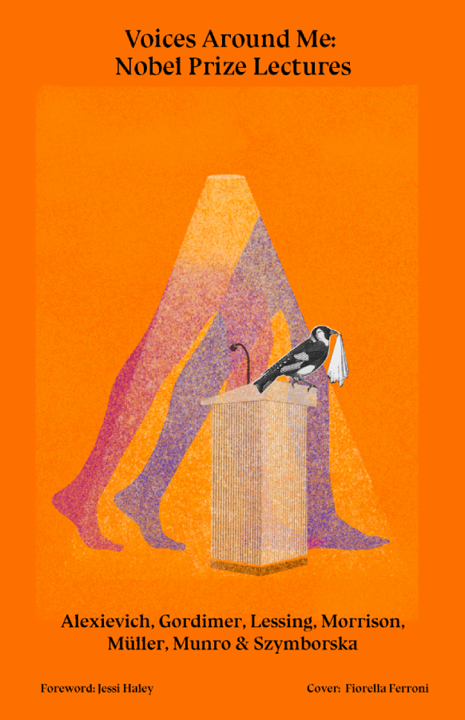

\    <h1>Voices Around Me: Nobel Lectures</h1>

    <h2>Svetlana Alexievich, Nadine Gordimer, Doris Lessing, Toni Morrison, Herta Müller, Alice Munro, Wisława Szymborska</h2>
  </section>
  <!-- Table of Content Starts Here-->
  <ul class="toc"><section id = "toc">
    <li><a href="#foreword">Foreword by Jessi Haley</a></li>
     <!-- If book has chapters use the following example to link to chapters. Check that the type of tag corresponds to the one used by Project Gutemberg. If the book has no chapters, erase the following lines until the next ul tag-->
      <li><a href="#chapter1">Nadine Gordimer, 1991</a></li>
      <li><a href="#chapter2">Toni Morrison, 1993</a></li>
      <li><a href="#chapter3">Wisława Szymborska, 1996</a></li>
      <li><a href="#chapter4">Doris Lessing, 2007</a></li><li>
        <a href="#chapter5">Herta Müller, 2009</a></li>
        <li><a href="#chapter6">Alice Munro, 2013</a></li>
        <li><a href="#chapter7">Svetlana Alexievich, 2015</a></li>
  </ul>
  </section>
  <section id="foreword">
    <h3> Foreword </h3>
    <p>
      In 2022, Annie Ernaux became the seventeenth woman to win the Nobel Prize in Literature. She is also the first French woman, the sixteenth French citizen, the ninety-sixth European, and the 119th person to win. In her acceptance lecture, she outlined how she viewed the context of her win: “I do not regard as an individual victory the Nobel prize that has been awarded me. It is neither from pride nor modesty that I see it, in some sense, as a collective victory.”</p>

<p>Ernaux’s claim of a collective ownership for a highly individualized award echoes ideas shared by many of the women laureates that came before her—as does her emphasis on the tension between the patriarchal system the Nobel stems from (and, to many, still represents) and the structural position of some winners, particularly women. When asked if she anticipated the prize, 2013 laureate Alice Munro replied: “Oh, no, no! I was a woman! . . . I just love the honor, I love it, but I just didn’t think that way.” Learning about her win from a group of reporters as she returned home from a hospital visit, eighty-seven-year-old Doris Lessing was flustered: “They told me a long time ago they didn’t like me and I would never get it. . . . They sent a special official to tell me so.” <a href="#footnote1">\[1]</a> Surrounded by snapping cameras, she promised: “I swear I’m going upstairs to find some suitable sentences, which I will be using from now on.”</p>

<p>Beyond a sense of breaking into a boys’ club and the communal weight that comes with this entry, there is little on the surface to connect the Nobel women writers. Writers who win the Nobel Prize must have “in the field of literature, produced the most outstanding work in an idealistic direction.” This is the criteria set in the will of Alfred Nobel, a Swede who perhaps changed the world most by inventing dynamite. Though his own professional domain was destruction, he wanted his namesake prize to recognize people whose work has “conferred the greatest benefit to humankind.”</p>

<p>This edict applies vague gravity and hefty responsibilities to the laureates. Women who have won the literature prize have been assigned roles like “the epicist of female experience” or the “Geiger counter of apartheid.”<a href="#footnote2">\[2]</a> They are understood to represent specific nations, ideologies, and generations. At the same time, they must represent all of us (particularly all women); they must, with their words, illuminate the universal via the specific.<a href="#footnote3">\[3]</a>  </p>

<p>Laureates are chosen by a committee whose membership draws from The Swedish Academy, a group of eighteen literary professionals (<i>De Aderton</i>, “The Eighteen”) with a lifetime tenure.<a href="#footnote4">\[4]</a>  The academy was installed by King Gustav III in 1786, so it predates the Nobel Foundation by 115 years. The committee selected the first woman Nobel laureate eight years into the existence of the award. This was five years before they ever elected a woman to their ranks (the same woman in both cases: Selma Lagerlöf, who borrowed from realism but returned to the romantic in her folkloric fiction). </p>

<p>Alfred Nobel chose the Swedish Academy as the arbiter of the literature prize, just as he chose groups to select laureates from the other categories (chemistry, peace, medicine, economics). His only instruction for the committees was that, in their deliberations, “no consideration be given to nationality, but that the prize be awarded to the worthiest person, whether or not they are Scandinavian.”</p>

<p>So, with minimal-yet-lofty guidance, a nineteenth-century armaments tycoon bequeathed a prize that still inspires fierce arguments, intense celebration, and online gambling across the globe. Of course, geography and international politics are inextricably linked to all Nobel Prizes, with literature proving no exception. Too European, too white, too male, too contrary to, or too swayed by illusory cultural tides—criticisms of the committee’s choices abound annually. Summaries of who the laureates are and where they come from arguably reach more people than the winners’ written works, making identity and nationality a major part of each award.<a href="#footnote5">\[5]</a> </p>

<p>Though Lägerlof won in 1909, nearly half of the total awards to women are concentrated in just the last eighteen years.<a href="#footnote6">\[6]</a>  Most of the women laureates are from Europe, as are most literature laureates in general. The first Latin American author ever to win was a woman (Chilean poet Gabriela Mistral, awarded 1945), and she remains the only Latin American woman awarded. American novelist Toni Morrison is the only Black woman recognized to date, and the body of winners remains overwhelmingly white. In terms of lived experience, the winners have faced famine, war, displacement, illicit romance, racism, motherhood, prestige, derision, and more.
    </p>
  <p>  What does it mean for a woman to win the Nobel Prize in Literature—for the life and work of the writer? For some, like Belarusian Svetlana Alexievich (inventor of “the documentary novel”) and Austrian poet and novelist Herta Müller, it means sudden visibility: newspaper coverage, reprints, new translations. For others (Lessing, Morrison and South African novelist Nadine Gordimer), it’s a capstone in a monumental career that people have been predicting for years. For all of them, it means roughly one hundred thousand dollars in prize money and at least a temporary surge in book sales. And it is perhaps a varied experience for the winner personally. Wisława Szymborska’s friends called her win “the Nobel tragedy” because the intensely private Polish poet was unable to write for years after the onslaught of attention. Meanwhile, Morrison gathered friends to celebrate with her in Stockholm. “I like the Nobel Prize,” she said. “Because they know how to give a party.” <a href="#footnote7">\[7]</a> Winning the prize in 2015 did not protect Alexievich from being forced into her second exile in 2020. Facing abduction and arrest, she fled—leaving behind manuscripts, her home, and a part of the world whose story she invented a new genre to tell.<a href="#footnote8">\[8]</a>  </p>

<p>No matter what the recognition means for these women personally, their names will always be paired with the phrase “Nobel Prize winner” whenever they appear in print. No matter what prospective readers understand about the Nobel Prize’s history, process, and statistics, this moniker will likely suggest to them something important about the writers’ work. And no matter where the writer is from, no matter what or who they write about, in accepting the prize they all accept a huge task: finding the “suitable sentences” to deliver a lecture (or, in Munro’s case, a conversation) that articulates the importance of literature and the meaning of their own life’s work.</p>

<p>Read together, the reflections of the Nobel women reveal a range of ideas about what literature can do and a sense of a practitioner’s responsibility to these ideas. While the lectures vary widely in content—from Lessing’s and Gordimer’s concrete political lessons to Szymborska’s larger abstract musings to fables personal (Müller) and universal (Morrison)—each contains observations that are at once totally complex and recognizably true.</p>

<p>With characteristic directness, “master of the contemporary short story” Munro asserts that she knew she could write about small-town Canadian life because: “I think any life can be interesting, any surroundings can be interesting.” </p>

<p>Morrison, whose novels explore so many facets of Black American life with language that is as precise as it is poetic, argues that “language can never live up to life once and for all. Nor should it...Its force, its felicity is in its reach toward the ineffable.”</p>

<p>Lessing, so often setting a prickly (sometimes cynical) tone in her novels of frustrated politics, colonialism, and imagined futures, is hopeful: “It is our stories that will recreate us, when we are torn, hurt, even destroyed. It is the storyteller, the dream-maker, the myth-maker, that is our phoenix, that represents us at our best, and at our most creative.”</p>

<p>Müller’s work paints visceral, impressionistic scenes of stifled lives under Nicolae Ceaușescu’s dictatorship in Romania. No stranger to having words withheld, she explains: “After all, the more words we are allowed to take, the freer we become.”</p>

<p>“In the language of poetry, where every word is weighed, nothing is usual or normal . . . not a single existence, not anyone’s existence in this world.” Only Szymborska, who once wrote “After every war / someone has to tidy up,” can be so gentle and so firm at the same time.</p>

<p>Gordimer, whose novels dissect the human wreckage wrought by institutionalized racism and cycles of violence, confirms that “writing is always and at once an exploration of self and of the world; of individual and collective being.”</p>

<p>Each writer’s Nobel lecture includes something that could be applied across the work of the other women who have won, something that collects the individual work under an umbrella of “benefit to humankind.” Each writer explains, in a way reflective of her style, time, place, and politics, how recognition of her work is part of a long, shared story. But if any of the lectures contains something akin to a slogan, it must be Alexievich’s (fitting for a writer whose work, at its core, is aimed at weaving disparate perspectives into an intricate whole). In accepting the prize, she reminds readers and writers alike: “I do not stand alone at this podium. . . . There are voices around me, hundreds of voices.”</p>

<p>Through our work, Cita Press honors the principles of decentralization, collective knowledge production, and equitable access to knowledge. The pieces brought together here reflect these values in ways that represent each writer’s unique commitments, experiences, and style. Our mission is to make the work of women from the past and present visible, and to illuminate the long and diverse history of feminist thought and art. The Nobel Prize gave a huge platform to the writers collected here, and it feels important to think about how this rarefied group of women frame their own legacies, and how they speak to each other from the same stage across the years. We present this book—free, online first, and with a cover by Fiorella Ferroni—with the open invitation to share in these women’s work and ideas. We hope you return to these pieces, together and apart, often or sometimes, but always with the understanding that there are voices around us, and that language gives us a chance to speak and also to listen. </p>

<p><i>Jessi Haley is editorial coordinator for Cita Press. Cita thanks the Nobel Foundation for the permission to publish these pieces.</i></p>

<p id="footnote1">\[1] See the full clip <a href="https://www.nytimes.com/video/books/100000002556650/doris-lessing-on-the-nobel-prize.html" target="_blank">"Doris Lessing on the Nobel Prize"</a> from <i>The New York Times</i> (November 17,2013). Reuters, Copyright <i>The New York Times, 2013</i>.</p>
<p id="footnote2">\[2] From the Nobel Committee, for Doris Lessing and Nadine Gordimer, respectively.
</p>
<p id="footnote3">\[3]  As the children in Toni Morrison’s Nobel Prize lecture demand: “Tell us what it is to be a woman so that we may know what it is to be a man. What moves at the margin. What it is to have no home in this place. To be set adrift from the one you knew. What it is to live at the edge of towns that cannot bear your company.”
</p>
<p id="footnote4">\[4]  As of 2022, the roster of Swedish Academy members joined the body between 1980 and 2020; the majority of the current Nobel Committee is made up of recently elected members.
</p>
<p id="footnote5">\[5] (Except for probably in the case of Bob Dylan!)</p>
<p id="footnote6">\[6] The full list of winners, countries, and years: Selma Lagerlof (1909, Sweden), Grazia Deledda (1926, Italy), Sigrid Undset (1928, Norway), Pearl Buck (1938, US), Gabriela Mistral (1945, Chile), Nelly Sachs (1966, Sweden), Nadine Gordimer (1991, South Africa), Toni Morrison (1993, US), Wisława Szymborska (1996, Poland), Elfriede Jelinek (2004, Austria), Doris Lessing (2007, England), Herta Müller (2009, Germany), Alice Munro (2013, Canada), Svetlana Alexievich (2015, Belarus), Olga Tokarczuk (2018, Poland), Louise Glück (2020, US), and Annie Ernaux (2022, France). 
</p>
<p id="footnote7">\[7] From <a href="https://www.pbs.org/wnet/americanmasters/when-toni-morrison-won-the-nobel-prize/14866/" target="_blank">“Toni Morrison: The Pieces I Am” (dir. Timothy Greenfield-Sanders, 2019).</a>  In the same clip, Fran Liebovitz said “I highly recommend you have a friend who wins the Nobel Prize.”
</p>
<p id="footnote8">\[8] José Vergara,<a href="https://lithub.com/on-the-dangers-of-greatness-a-conversation-with-svetlana-alexievich/" target="_blank">“On the Dangers of Greatness: A Conversation with Svetlana Alexievich.”</a> <i>Literary Hub</i>, June 3, 2022.</p>

  </section>
  <h3 id="book">
Voices Around Me: Nobel Lectures
  </h3>

 <!-- If book has chapters use the following example to link to chapters. Check that the type of tag corresponds to the one used by Project Gutemberg. Only replace "id="chapterX" in the ID already given by the chapter in Project Gutemberg -->

  <h2 id="chapter1"> NADINE GORDIMER, 1991 </h2>

  <p><i> Nobel Lecture, December 7, 1991</i></p>

<p><b>WRITING & BEING</b></p>

<p>In the beginning was the Word.</p>

<p>The Word was with God, signified God’s Word, the word that was Creation. But over the centuries of human culture the word has taken on other meanings, secular as well as religious. To have the word has come to be synonymous with ultimate authority, with prestige, with awesome, sometimes dangerous persuasion, to have Prime Time, a TV talk show, to have the gift of the gab as well as that of speaking in tongues. The word flies through space, it is bounced from satellites, now nearer than it has ever been to the heaven from which it was believed to have come. But its most significant transformation occurred for me and my kind long ago, when it was first scratched on a stone tablet or traced on papyrus, when it materialized from sound to spectacle, from being heard to being read as a series of signs, and then a script; and travelled through time from parchment to Gutenberg. For this is the genesis story of the writer. It is the story that wrote her or him into being.</p>

<p>It was, strangely, a double process, creating at the same time both the writer and the very purpose of the writer as a mutation in the agency of human culture. It was both ontogenesis as the origin and development of an individual being, and the adaptation, in the nature of that individual, specifically to the exploration of ontogenesis, the origin and development of the individual being. For we writers are evolved for that task. Like the prisoners incarcerated with the jaguar in Borges’ story <a href="#section1">\[1]</a>, ‘The God’s Script’, who was trying to read, in a ray of light which fell only once a day, the meaning of being from the marking on the creature’s pelt, we spend our lives attempting to interpret through the word the readings we take in the societies, the world of which we are part. It is in this sense, this inextricable, ineffable participation, that writing is always and at once an exploration of self and of the world; of individual and collective being.</p>

<p>Being here.</p>

<p>Humans, the only self-regarding animals, blessed or cursed with this torturing higher faculty, have always wanted to know why. And this is not just the great ontological question of why we are here at all, for which religions and philosophies have tried to answer conclusively for various peoples at various times, and science tentatively attempts dazzling bits of explanation we are perhaps going to die out in our millennia, like dinosaurs, without having developed the necessary comprehension to understand as a whole. Since humans became self-regarding they have sought, as well, explanations for the common phenomena of procreation, death, the cycle of seasons, the earth, sea, wind and stars, sun and moon, plenty and disaster. With myth, the writer’s ancestors, the oral story-tellers, began to feel out and formulate these mysteries, using the elements of daily life – observable reality – and the faculty of the imagination – the power of projection into the hidden – to make stories.</p>

<p>Roland Barthes <a href="#section2">\[2]</a> asks, ‘What is characteristic of myth?’ And answers: ‘To transform a meaning into form.’ Myths are stories that mediate in this way between the known and unknown. Claude Levi-Strauss <a href="#section3">\[3]</a> wittily de-mythologizes myth as a genre between a fairy tale and a detective story. Being here; we don’t know who-dun-it. But something satisfying, if not the answer, can be invented. Myth was the mystery plus the fantasy – gods, anthropomorphized animals and birds, chimera, phantasmagorical creatures – that posits out of the imagination some sort of explanation for the mystery. Humans and their fellow creatures were the materiality of the story, but as Nikos Kazantzakis <a href="#section4">\[4]</a> once wrote, ‘Art is the representation not of the body but of the forces which created the body.’</p>

<p>There are many proven explanations for natural phenomena now; and there are new questions of being arising out of some of the answers. For this reason, the genre of myth has never been entirely abandoned, although we are inclined to think of it as archaic. If it dwindled to the children’s bedtime tale in some societies, in parts of the world protected by forests or deserts from international megaculture it has continued, alive, to offer art as a system of mediation between the individual and being. And it has made a whirling comeback out of Space, an Icarus in the avatar of Batman and his kind, who never fall into the ocean of failure to deal with the gravity forces of life. These new myths, however, do not seek so much to enlighten and provide some sort of answers as to distract, to provide a fantasy escape route for people who no longer want to face even the hazard of answers to the terrors of their existence. (Perhaps it is the positive knowledge that humans now possess the means to destroy their whole planet, the fear that they have in this way themselves become the gods, dreadfully charged with their own continued existence, that has made comic-book and movie myth escapist.) The forces of being remain. They are what the writer, as distinct from the contemporary popular mythmaker, still engage today, as myth in its ancient form attempted to do. </p>

<p>How writers have approached this engagement and continue to experiment with it has been and is, perhaps more than ever, the study of literary scholars. The writer in relation to the nature of perceivable reality and what is beyond – imperceivable reality – is the basis for all these studies, no matter what resulting concepts are labelled, and no matter in what categorized microfiles writers are stowed away for the annals of literary historiography. Reality is constructed out of many elements and entities, seen and unseen, expressed, and left unexpressed for breathing-space in the mind. Yet from what is regarded as old-hat psychological analysis to modernism and post-modernism, structuralism and poststructuralism, all literary studies are aimed at the same end: to pin down to a consistency (and what is consistency if not the principle hidden within the riddle?); to make definitive through methodology the writer’s grasp at the forces of being. But life is aleatory in itself; being is constantly pulled and shaped this way and that by circumstances and different levels of consciousness. There is no pure state of being, and it follows that there is no pure text, ‘real’ text, totally incorporating the aleatory. It surely cannot be reached by any critical methodology, however interesting the attempt. To deconstruct a text is in a way a contradiction, since to deconstruct it is to make another construction out of the pieces, as Roland Barthes <a href="#section5">\[5]</a> does so fascinatingly, and admits to, in his linguistic and semantical dissection of Balzac’s story, ‘Sarrasine’. So the literary scholars end up being some kind of storyteller, too.</p>

<p>Perhaps there is no other way of reaching some understanding of being than through art? Writers themselves don’t analyze what they do; to analyze would be to look down while crossing a canyon on a tightrope. To say this is not to mystify the process of writing but to make an image out of the intense inner concentration the writer must have to cross the chasms of the aleatory and make them the word’s own, as an explorer plants a flag. Yeats’ inner ‘lonely impulse of delight’ in the pilot’s solitary flight, and his ‘terrible beauty’ born of mass uprising, both opposed and conjoined; E. M. Forster’s modest ‘only connect’; Joyce’s chosen, wily ‘silence, cunning and exile’; more contemporary, Gabriel García Márquez’s labyrinth in which power over others, in the person of Simon Bolivar, is led to the thrall of the only unassailable power, death – these are some examples of the writer’s endlessly varied ways of approaching the state of being through the word. Any writer of any worth at all hopes to play only a pocket-torch of light – and rarely, through genius, a sudden flambeau – into the bloody yet beautiful labyrinth of human experience, of being.</p>

<p>Anthony Burgess <a href="#section6">\[6]</a> once gave a summary definition of literature as ‘the aesthetic exploration of the world’. I would say that writing only begins there, for the exploration of much beyond, which nevertheless only aesthetic means can express.</p>

<p>How does the writer become one, having been given the word? I do not know if my own beginnings have any particular interest. No doubt they have much in common with those of others, have been described too often before as a result of this yearly assembly before which a writer stands. For myself, I have said that nothing factual that I write or say will be as truthful as my fiction. The life, the opinions, are not the work, for it is in the tension between standing apart and being involved that the imagination transforms both. Let me give some minimal account of myself. I am what I suppose would be called a natural writer. I did not make any decision to become one. I did not, at the beginning, expect to earn a living by being read. I wrote as a child out of the joy of apprehending life through my senses – the look and scent and feel of things; and soon out of the emotions that puzzled me or raged within me and which took form, found some enlightenment, solace and delight, shaped in the written word. There is a little Kafka <a href="#section7">\[7]</a> parable that goes like this; ‘I have three dogs: Hold-him, Seize-him, and Nevermore. Hold-him and Seize-him are ordinary little Schipperkes and nobody would notice them if they were alone. But there is Nevermore, too. Nevermore is a mongrel Great Dane and has an appearance that centuries of the most careful breeding could never have produced. Nevermore is a gypsy.’ In the small South African gold-mining town where I was growing up I was Nevermore the mongrel (although I could scarcely have been described as a Great Dane …) in whom the accepted characteristics of the townspeople could not be traced. I was the Gypsy, tinkering with words second-hand, mending my own efforts at writing by learning from what I read. For my school was the local library. Proust, Chekhov and Dostoevsky, to name only a few to whom I owe my existence as a writer, were my professors. In that period of my life, yes, I was evidence of the theory that books are made out of other books . . . But I did not remain so for long, nor do I believe any potential writer could.</p>

<p>With adolescence comes the first reaching out to otherness through the drive of sexuality. For most children, from then on the faculty of the imagination, manifest in play, is lost in the focus on day dreams of desire and love, but for those who are going to be artists of one kind or another the first life-crisis after that of birth does something else in addition: the imagination gains range and extends by the subjective flex of new and turbulent emotions. There are new perceptions. The writer begins to be able to enter into other lives. The process of standing apart and being involved has come. </p>

<p>Unknowingly, I had been addressing myself on the subject of being, whether, as in my first stories, there was a child’s contemplation of death and murder in the necessity to finish off, with a death blow, a dove mauled by a cat, or whether there was wondering dismay and early consciousness of racism that came of my walk to school, when on the way I passed storekeepers, themselves East European immigrants kept lowest in the ranks of the Anglo-Colonial social scale for whites in the mining town, roughly those whom colonial society ranked lowest of all, discounted as less than human – the black miners who were the stores’ customers. Only many years later was I to realize that if I had been a child in that category – black – I might not have become a writer at all, since the library that made this possible for me was not open to any black child. For my formal schooling was sketchy, at best.</p>

<p>To address oneself to others begins a writer’s next stage of development. To publish to anyone who would read what I wrote. That was my natural, innocent assumption of what publication meant, and it has not changed , that is what it means to me today, in spite of my awareness that most people refuse to believe that a writer does not have a particular audience in mind; and my other awareness: of the temptations, conscious and unconscious, which lure the writer into keeping a corner of the eye on who will take offense, who will approve what is on the page – a temptation that, like Eurydice’s straying glance, will lead the writer back into the Shades of a destroyed talent.</p>

<p>The alternative is not the malediction of the ivory tower, another destroyer of creativity. Borges once said he wrote for his friends and to pass the time. I think this was an irritated flippant response to the crass question – often an accusation – ‘For whom do you write?’, just as Sartre’s admonition that there are times when a writer should cease to write, and act upon being only in another way, was given in the frustration of an unresolved conflict between distress at injustice in the world and the knowledge that what he knew how to do best was write. Both Borges and Sartre, from their totally different extremes of denying literature a social purpose, were certainly perfectly aware that it has its implicit and unalterable social role in exploring the state of being, from which all other roles, personal among friends, public at the protest demonstration, derive. Borges was not writing for his friends, for he published and we all have received the bounty of his work. Sartre did not stop writing, although he stood at the barricades in 1968.</p>

<p>The question of for whom do we write nevertheless plagues the writer, a tin can attached to the tail of every work published. Principally it jangles the inference of tendentiousness as praise or denigration. In this context, Camus <a href="#section8">\[8]</a> dealt with the question best. He said that he liked individuals who take sides more than literatures that do. ‘One either serves the whole of man or does not serve him at all. And if man needs bread and justice, and if what has to be done must be done to serve this need, he also needs pure beauty which is the bread of his heart.’ So Camus called for ‘Courage in and talent in one’s work.’ And Márquez <a href="#section9">\[9]</a> redefined tender fiction thus: The best way a writer can serve a revolution is to write as well as he can.</p>

<p>I believe that these two statements might be the credo for all of us who write. They do not resolve the conflicts that have come, and will continue to come, to contemporary writers. But they state plainly an honest possibility of doing so, they turn the face of the writer squarely to her and his existence, the reason to be, as a writer, and the reason to be, as a responsible human, acting, like any other, within a social context. </p>

<p>Being here: in a particular time and place. That is the existential position with particular implications for literature. Czeslaw Milosz <a href="#section10">\[10]</a> once wrote the cry: ‘What is poetry which does not serve nations or people?’ and Brecht <a href="#section11">\[11]</a> wrote of a time when ‘to speak of trees is almost a crime’. Many of us have had such despairing thoughts while living and writing through such times, in such places, and Sartre’s solution makes no sense in a world where writers were – and still are – censored and forbidden to write, where, far from abandoning the word, lives were and are at risk in smuggling it, on scraps of paper, out of prisons. The state of being whose ontogenesis we explore has overwhelmingly included such experiences. Our approaches, in Nikos Kazantzakis’ <a href="#section12">\[12]</a> words, have to ‘make the decision which harmonizes with the fearsome rhythm of our time.’</p>

<p>Some of us have seen our books lie for years unread in our own countries, banned, and we have gone on writing. Many writers have been imprisoned. Looking at Africa alone – Soyinka, Ngugi wa Thiong’o, Jack Mapanje, in their countries, and in my own country, South Africa, Jeremy Cronin, Mongane Wally Serote, Breyten Breytenbach, Dennis Brutus, Jaki Seroke: all these went to prison for the courage shown in their lives, and have continued to take the right, as poets, to speak of trees. Many of the greats, from Thomas Mann to Chinua Achebe, cast out by political conflict and oppression in different countries, have endured the trauma of exile, from which some never recover as writers, and some do not survive at all. I think of the South Africans, Can Themba, Alex la Guma, Nat Nakasa, Todd Matshikiza. And some writers, over half a century from Joseph Roth to Milan Kundera, have had to publish new works first in the word that is not their own, a foreign language. </p>

<p>Then in 1988 the fearsome rhythm of our time quickened in an unprecedented frenzy to which the writer was summoned to submit the word. In the broad span of modern times since the Enlightenment writers have suffered opprobrium, bannings and even exile for other than political reasons. Flaubert dragged into court for indecency, over Madame Bovary, Strindberg arraigned for blasphemy, over Marrying, Lawrence’s Lady Chatterley’s Lover banned – there have been many examples of so-called offense against hypocritical bourgeois mores, just as there have been of treason against political dictatorships. But in a period when it would be unheard of for countries such as France, Sweden and Britain to bring such charges against freedom of expression, there has risen a force that takes its appalling authority from something far more widespread than social mores, and far more powerful than the power of any single political regime. The edict of a world religion has sentenced a writer to death.</p>

<p>For more than three years, now, wherever he is hidden, wherever he might go, Salman Rushdie has existed under the Muslim pronouncement upon him of the fatwa. There is no asylum for him anywhere. Every morning when this writer sits down to write, he does not know if he will live through the day; he does not know whether the page will ever be filled. Salman Rushdie happens to be a brilliant writer, and the novel for which he is being pilloried, <i>The Satanic Verses</i>, is an innovative exploration of one of the most intense experiences of being in our era, the individual personality in transition between two cultures brought together in a post-colonial world. All is re-examined through the refraction of the imagination; the meaning of sexual and filial love, the rituals of social acceptance, the meaning of a formative religious faith for individuals removed from its subjectivity by circumstance opposing different systems of belief, religious and secular, in a different context of living. His novel is a true mythology. But although he has done for the postcolonial consciousness in Europe what Gunter Grass did for the post-Nazi one with <i>The Tin Drum</i> and <i>Dog Years</i>, perhaps even has tried to approach what Beckett did for our existential anguish in <i>Waiting For Godot</i>, the level of his achievement should not matter. Even if he were a mediocre writer, his situation is the terrible concern of every fellow writer for, apart from his personal plight, what implications, what new threat against the carrier of the word does it bring? It should be the concern of individuals and above all, of governments and human rights organizations all over the world. With dictatorships apparently vanquished, this murderous new dictate invoking the power of international terrorism in the name of a great and respected religion should and can be dealt with only by democratic governments and the United Nations as an offense against humanity.</p>

<p>I return from the horrific singular threat to those that have been general for writers of this century now in its final, summing-up decade. In repressive regimes anywhere – whether in what was the Soviet bloc, Latin America, Africa, China – most imprisoned writers have been shut away for their activities as citizens striving for liberation against the oppression of the general society to which they belong. Others have been condemned by repressive regimes for serving society by writing as well as they can; for this aesthetic venture of ours becomes subversive when the shameful secrets of our times are explored deeply, with the artist’s rebellious integrity to the state of being manifest in life around her or him; then the writer’s themes and characters inevitably are formed by the pressures and distortions of that society as the life of the fisherman is determined by the power of the sea.</p>

<p>There is a paradox. In retaining this integrity, the writer sometimes must risk both the state’s indictment of treason, and the liberation forces’ complaint of lack of blind commitment. As a human being, no writer can stoop to the lie of Manichean ‘balance’. The devil always has lead in his shoes, when placed on his side of the scale. Yet, to paraphrase coarsely Márquez’s dictum given by him both as a writer and a fighter for justice, the writer must take the right to explore, warts and all, both the enemy and the beloved comrade in arms, since only a try for the truth makes sense of being, only a try for the truth edges towards justice just ahead of Yeats’s beast slouching to be born. In literature, from life,</p>
  <p style="margin-left: 50px;"> we page through each other’s faces</p>
    <p style="margin-left: 50px;">we read each looking eye</p>
   <p style="margin-left: 50px;">… It has taken lives to be able to do so.</p>

<p>These are the words of the South African poet and fighter for justice and peace in our country, Mongane Serote. <a href="#section13">\[13]</a></p>

<p>The writer is of service to humankind only insofar as the writer uses the word even against his or her own loyalties, trusts the state of being, as it is revealed, to hold somewhere in its complexity filaments of the cord of truth, able to be bound together, here and there, in art: trusts the state of being to yield somewhere fragmentary phrases of truth, which is the final word of words, never changed by our stumbling efforts to spell it out and write it down, never changed by lies, by semantic sophistry, by the dirtying of the word for the purposes of racism, sexism, prejudice, domination, the glorification of destruction, the curses and the praise-songs.</p>

<p id="section1">\[1] “The God’s Script” from <i>Labyrinths & Other Writings</i> by Jorge Luis Borges. Translator unknown. Edited by Donald H. Yates & James E. Kirby. Penguin Modern Classics, page 71.</p>
<p id="section2">\[2]<i> Mythologies</i> by Roland Barthes. Translated by Annette Lavers. Hill & Wang, page 131.</p>
<p id="section3">\[3]<i> Historie de Lynx</i> by Claude Lévi-Strauss.’… je les situais à mi-chemin entre le conte de fées et le roman policier’. Plon, page 13.</p>
<p id="section4">\[4]<i> Report to Greco</i> by Nikos Kazantzakis. Faber & Faber, page 150.</p>
<p id="section5">\[5] <i>S/Z</i> by Roland Barthes. Translated by Richard Miller. Jonathan Cape.</p>
<p id="section6">\[6] London <i>Observer</i> review. 19/4/81. Anthony Burgess.</p>
<p id="section7">\[7] The Third Octavo Notebook from <i>Wedding Preparations in the Country</i> by Franz Kafka. Definitive Edition. Secker & Warburg.</p>
<p id="section8">\[8] <i>Carnets</i> 1942-5 by Albert Camus.</p>
<p id="section9">\[9] Gabriel Gárcia Márquez. In an interview; my notes do not give the journal or date.</p>
<p id="section10">\[10] ‘Dedication’ from <i>Selected Poems</i> by Czeslaw Milosz. The Ecco Press.</p>
<p id="section11">\[11] “To Posterity’ from <i>Selected Poems</i> by Bertolt Brecht. Translated by H. R. Hays. Grove Press, page 173.</p>
<p id="section12">\[12]<i> Report to Greco</i> by Nikos Kazantzakis. Faber & Faber.</p>
<p id="section13">\[13]<i> A Tough Tale</i> by Mongane Wally Serote. Kliptown Books.</p>
<p>
<i>From </i>Nobel Lectures, Literature 1991-1995,<i> Editor Sture Allén, World Scientific Publishing Co., Singapore, 1997</i></p>

<p>Copyright © The Nobel Foundation 1991 </p>

  <a href="#toc">Back to the Start</a>

<h2 id="chapter2"> TONI MORRISON, 1993 </h2>
<p><i>Nobel Lecture December 7, 1993</i></p>

<p>“Once upon a time there was an old woman. Blind but wise.” Or was it an old man? A guru, perhaps. Or a griot soothing restless children. I have heard this story, or one exactly like it, in the lore of several cultures.</p>

<p>“Once upon a time there was an old woman. Blind. Wise.”</p>

<p>In the version I know the woman is the daughter of slaves, black, American, and lives alone in a small house outside of town. Her reputation for wisdom is without peer and without question. Among her people she is both the law and its transgression. The honor she is paid and the awe in which she is held reach beyond her neighborhood to places far away; to the city where the intelligence of rural prophets is the source of much amusement.</p>

<p>One day the woman is visited by some young people who seem to be bent on disproving her clairvoyance and showing her up for the fraud they believe she is. Their plan is simple: they enter her house and ask the one question the answer to which rides solely on her difference from them, a difference they regard as a profound disability: her blindness. They stand before her, and one of them says, “Old woman, I hold in my hand a bird. Tell me whether it is living or dead.”</p>

<p>She does not answer, and the question is repeated. “Is the bird I am holding living or dead?”</p>

<p>Still she doesn’t answer. She is blind and cannot see her visitors, let alone what is in their hands. She does not know their color, gender or homeland. She only knows their motive.</p>

<p>The old woman’s silence is so long, the young people have trouble holding their laughter.</p>

<p>Finally she speaks and her voice is soft but stern. “I don’t know”, she says. “I don’t know whether the bird you are holding is dead or alive, but what I do know is that it is in your hands. It is in your hands.”</p>

<p>Her answer can be taken to mean: if it is dead, you have either found it that way or you have killed it. If it is alive, you can still kill it. Whether it is to stay alive, it is your decision. Whatever the case, it is your responsibility.</p>

<p>For parading their power and her helplessness, the young visitors are reprimanded, told they are responsible not only for the act of mockery but also for the small bundle of life sacrificed to achieve its aims. The blind woman shifts attention away from assertions of power to the instrument through which that power is exercised.</p>

<p>Speculation on what (other than its own frail body) that bird-in-the-hand might signify has always been attractive to me, but especially so now thinking, as I have been, about the work I do that has brought me to this company. So I choose to read the bird as language and the woman as a practiced writer. She is worried about how the language she dreams in, given to her at birth, is handled, put into service, even withheld from her for certain nefarious purposes. Being a writer she thinks of language partly as a system, partly as a living thing over which one has control, but mostly as agency – as an act with consequences. So the question the children put to her: “Is it living or dead?” is not unreal because she thinks of language as susceptible to death, erasure; certainly imperiled and salvageable only by an effort of the will. She believes that if the bird in the hands of her visitors is dead the custodians are responsible for the corpse. For her a dead language is not only one no longer spoken or written, it is unyielding language content to admire its own paralysis. Like statist language, censored and censoring. Ruthless in its policing duties, it has no desire or purpose other than maintaining the free range of its own narcotic narcissism, its own exclusivity and dominance. However moribund, it is not without effect for it actively thwarts the intellect, stalls conscience, suppresses human potential. Unreceptive to interrogation, it cannot form or tolerate new ideas, shape other thoughts, tell another story, fill baffling silences. Official language smitheryed to sanction ignorance and preserve privilege is a suit of armor polished to shocking glitter, a husk from which the knight departed long ago. Yet there it is: dumb, predatory, sentimental. Exciting reverence in schoolchildren, providing shelter for despots, summoning false memories of stability, harmony among the public.</p>

<p>She is convinced that when language dies, out of carelessness, disuse, indifference and absence of esteem, or killed by fiat, not only she herself, but all users and makers are accountable for its demise. In her country children have bitten their tongues off and use bullets instead to iterate the voice of speechlessness, of disabled and disabling language, of language adults have abandoned altogether as a device for grappling with meaning, providing guidance, or expressing love. But she knows tongue-suicide is not only the choice of children. It is common among the infantile heads of state and power merchants whose evacuated language leaves them with no access to what is left of their human instincts for they speak only to those who obey, or in order to force obedience.</p>

<p>The systematic looting of language can be recognized by the tendency of its users to forgo its nuanced, complex, mid-wifery properties for menace and subjugation. Oppressive language does more than represent violence; it is violence; does more than represent the limits of knowledge; it limits knowledge. Whether it is obscuring state language or the faux-language of mindless media; whether it is the proud but calcified language of the academy or the commodity driven language of science; whether it is the malign language of law-without-ethics, or language designed for the estrangement of minorities, hiding its racist plunder in its literary cheek – it must be rejected, altered and exposed. It is the language that drinks blood, laps vulnerabilities, tucks its fascist boots under crinolines of respectability and patriotism as it moves relentlessly toward the bottom line and the bottomed-out mind. Sexist language, racist language, theistic language – all are typical of the policing languages of mastery, and cannot, do not permit new knowledge or encourage the mutual exchange of ideas.</p>

<p>The old woman is keenly aware that no intellectual mercenary, nor insatiable dictator, no paid-for politician or demagogue; no counterfeit journalist would be persuaded by her thoughts. There is and will be rousing language to keep citizens armed and arming; slaughtered and slaughtering in the malls, courthouses, post offices, playgrounds, bedrooms and boulevards; stirring, memorializing language to mask the pity and waste of needless death. There will be more diplomatic language to countenance rape, torture, assassination. There is and will be more seductive, mutant language designed to throttle women, to pack their throats like paté-producing geese with their own unsayable, transgressive words; there will be more of the language of surveillance disguised as research; of politics and history calculated to render the suffering of millions mute; language glamorized to thrill the dissatisfied and bereft into assaulting their neighbors; arrogant pseudo-empirical language crafted to lock creative people into cages of inferiority and hopelessness.</p>

<p>Underneath the eloquence, the glamor, the scholarly associations, however stirring or seductive, the heart of such language is languishing, or perhaps not beating at all – if the bird is already dead.</p>

<p>She has thought about what could have been the intellectual history of any discipline if it had not insisted upon, or been forced into, the waste of time and life that rationalizations for and representations of dominance required – lethal discourses of exclusion blocking access to cognition for both the excluder and the excluded.</p>

<p>The conventional wisdom of the Tower of Babel story is that the collapse was a misfortune. That it was the distraction, or the weight of many languages that precipitated the tower’s failed architecture. That one monolithic language would have expedited the building and heaven would have been reached. Whose heaven, she wonders? And what kind? Perhaps the achievement of Paradise was premature, a little hasty if no one could take the time to understand other languages, other views, other narratives period. Had they, the heaven they imagined might have been found at their feet. Complicated, demanding, yes, but a view of heaven as life; not heaven as post-life.</p>

<p>She would not want to leave her young visitors with the impression that language should be forced to stay alive merely to be. The vitality of language lies in its ability to limn the actual, imagined and possible lives of its speakers, readers, writers. Although its poise is sometimes in displacing experience it is not a substitute for it. It arcs toward the place where meaning may lie. When a President of the United States thought about the graveyard his country had become, and said, “The world will little note nor long remember what we say here. But it will never forget what they did here,” his simple words are exhilarating in their life-sustaining properties because they refused to encapsulate the reality of 600, 000 dead men in a cataclysmic race war. Refusing to monumentalize, disdaining the “final word”, the precise “summing up”, acknowledging their “poor power to add or detract”, his words signal deference to the uncapturability of the life it mourns. It is the deference that moves her, that recognition that language can never live up to life once and for all. Nor should it. Language can never “pin down” slavery, genocide, war. Nor should it yearn for the arrogance to be able to do so. Its force, its felicity is in its reach toward the ineffable.</p>

<p>Be it grand or slender, burrowing, blasting, or refusing to sanctify; whether it laughs out loud or is a cry without an alphabet, the choice word, the chosen silence, unmolested language surges toward knowledge, not its destruction. But who does not know of literature banned because it is interrogative; discredited because it is critical; erased because alternate? And how many are outraged by the thought of a self-ravaged tongue?</p>

<p>Word-work is sublime, she thinks, because it is generative; it makes meaning that secures our difference, our human difference – the way in which we are like no other life.</p>

<p>We die. That may be the meaning of life. But we do language. That may be the measure of our lives.</p>

<p>“Once upon a time, …” visitors ask an old woman a question. Who are they, these children? What did they make of that encounter? What did they hear in those final words: “The bird is in your hands”? A sentence that gestures towards possibility or one that drops a latch? Perhaps what the children heard was “It’s not my problem. I am old, female, black, blind. What wisdom I have now is in knowing I cannot help you. The future of language is yours.”</p>

<p>They stand there. Suppose nothing was in their hands? Suppose the visit was only a ruse, a trick to get to be spoken to, taken seriously as they have not been before? A chance to interrupt, to violate the adult world, its miasma of discourse about them, for them, but never to them? Urgent questions are at stake, including the one they have asked: “Is the bird we hold living or dead?” Perhaps the question meant: “Could someone tell us what is life? What is death?” No trick at all; no silliness. A straightforward question worthy of the attention of a wise one. An old one. And if the old and wise who have lived life and faced death cannot describe either, who can?</p>

<p>But she does not; she keeps her secret; her good opinion of herself; her gnomic pronouncements; her art without commitment. She keeps her distance, enforces it and retreats into the singularity of isolation, in sophisticated, privileged space.</p>

<p>Nothing, no word follows her declaration of transfer. That silence is deep, deeper than the meaning available in the words she has spoken. It shivers, this silence, and the children, annoyed, fill it with language invented on the spot.</p>

<p>“Is there no speech,” they ask her, “no words you can give us that helps us break through your dossier of failures? Through the education you have just given us that is no education at all because we are paying close attention to what you have done as well as to what you have said? To the barrier you have erected between generosity and wisdom?</p>

<p>“We have no bird in our hands, living or dead. We have only you and our important question. Is the nothing in our hands something you could not bear to contemplate, to even guess? Don’t you remember being young when language was magic without meaning? When what you could say, could not mean? When the invisible was what imagination strove to see? When questions and demands for answers burned so brightly you trembled with fury at not knowing?</p>

<p>“Do we have to begin consciousness with a battle heroines and heroes like you have already fought and lost leaving us with nothing in our hands except what you have imagined is there? Your answer is artful, but its artfulness embarrasses us and ought to embarrass you. Your answer is indecent in its self-congratulation. A made-for-television script that makes no sense if there is nothing in our hands.</p>

<p>“Why didn’t you reach out, touch us with your soft fingers, delay the sound bite, the lesson, until you knew who we were? Did you so despise our trick, our modus operandi you could not see that we were baffled about how to get your attention? We are young. Unripe. We have heard all our short lives that we have to be responsible. What could that possibly mean in the catastrophe this world has become; where, as a poet said, “nothing needs to be exposed since it is already barefaced.” Our inheritance is an affront. You want us to have your old, blank eyes and see only cruelty and mediocrity. Do you think we are stupid enough to perjure ourselves again and again with the fiction of nationhood? How dare you talk to us of duty when we stand waist deep in the toxin of your past?</p>

<p>“You trivialize us and trivialize the bird that is not in our hands. Is there no context for our lives? No song, no literature, no poem full of vitamins, no history connected to experience that you can pass along to help us start strong? You are an adult. The old one, the wise one. Stop thinking about saving your face. Think of our lives and tell us your particularized world. Make up a story. Narrative is radical, creating us at the very moment it is being created. We will not blame you if your reach exceeds your grasp; if love so ignites your words they go down in flames and nothing is left but their scald. Or if, with the reticence of a surgeon’s hands, your words suture only the places where blood might flow. We know you can never do it properly – once and for all. Passion is never enough; neither is skill. But try. For our sake and yours forget your name in the street; tell us what the world has been to you in the dark places and in the light. Don’t tell us what to believe, what to fear. Show us belief's wide skirt and the stitch that unravels fear’s caul. You, old woman, blessed with blindness, can speak the language that tells us what only language can: how to see without pictures. Language alone protects us from the scariness of things with no names. Language alone is meditation.</p>

<p>“Tell us what it is to be a woman so that we may know what it is to be a man. What moves at the margin. What it is to have no home in this place. To be set adrift from the one you knew. What it is to live at the edge of towns that cannot bear your company.</p>

<p>“Tell us about ships turned away from shorelines at Easter, placenta in a field. Tell us about a wagonload of slaves, how they sang so softly their breath was indistinguishable from the falling snow. How they knew from the hunch of the nearest shoulder that the next stop would be their last. How, with hands prayered in their sex, they thought of heat, then sun. Lifting their faces as though it was there for the taking. Turning as though there for the taking. They stop at an inn. The driver and his mate go in with the lamp leaving them humming in the dark. The horse’s void steams into the snow beneath its hooves and its hiss and melt are the envy of the freezing slaves.</p>

<p>“The inn door opens: a girl and a boy step away from its light. They climb into the wagon bed. The boy will have a gun in three years, but now he carries a lamp and a jug of warm cider. They pass it from mouth to mouth. The girl offers bread, pieces of meat and something more: a glance into the eyes of the one she serves. One helping for each man, two for each woman. And a look. They look back. The next stop will be their last. But not this one. This one is warmed.”</p>

<p>It’s quiet again when the children finish speaking, until the woman breaks into the silence.</p>

<p>“Finally”, she says, “I trust you now. I trust you with the bird that is not in your hands because you have truly caught it. Look. How lovely it is, this thing we have done – together.”</p>
<p>
<i>From</i> Nobel Lectures, Literature 1991-1995,<i> Editor Sture Allén, World Scientific Publishing Co., Singapore, 1997 </i><p>

  <p>Copyright © The Nobel Foundation 1993</p>
   <a href="#toc">Back to the Start</a>

```

```

  <p> <i>Nobel Lecture, December 7, 1996</i></p>

<p><b>The poet and the world</b></p>

<p>They say the first sentence in any speech is always the hardest. Well, that one’s behind me, anyway. But I have a feeling that the sentences to come – the third, the sixth, the tenth, and so on, up to the final line – will be just as hard, since I’m supposed to talk about poetry. I’ve said very little on the subject, next to nothing, in fact. And whenever I have said anything, I’ve always had the sneaking suspicion that I’m not very good at it. This is why my lecture will be rather short. All imperfection is easier to tolerate if served up in small doses.</p>

<p>Contemporary poets are skeptical and suspicious even, or perhaps especially, about themselves. They publicly confess to being poets only reluctantly, as if they were a little ashamed of it. But in our clamorous times it’s much easier to acknowledge your faults, at least if they’re attractively packaged, than to recognize your own merits, since these are hidden deeper and you never quite believe in them yourself … When filling in questionnaires or chatting with strangers, that is, when they can’t avoid revealing their profession, poets prefer to use the general term “writer” or replace “poet” with the name of whatever job they do in addition to writing. Bureaucrats and bus passengers respond with a touch of incredulity and alarm when they find out that they’re dealing with a poet. I suppose philosophers may meet with a similar reaction. Still, they’re in a better position, since as often as not they can embellish their calling with some kind of scholarly title. Professor of philosophy – now that sounds much more respectable.</p>

<p>But there are no professors of poetry. This would mean, after all, that poetry is an occupation requiring specialized study, regular examinations, theoretical articles with bibliographies and footnotes attached, and finally, ceremoniously conferred diplomas. And this would mean, in turn, that it’s not enough to cover pages with even the most exquisite poems in order to become a poet. The crucial element is some slip of paper bearing an official stamp. Let us recall that the pride of Russian poetry, the future Nobel Laureate Joseph Brodsky was once sentenced to internal exile precisely on such grounds. They called him “a parasite,” because he lacked official certification granting him the right to be a poet…</p>

<p>Several years ago, I had the honor and pleasure of meeting Brodsky in person. And I noticed that, of all the poets I’ve known, he was the only one who enjoyed calling himself a poet. He pronounced the word without inhibitions.</p>

<p>Just the opposite – he spoke it with defiant freedom. It seems to me that this must have been because he recalled the brutal humiliations he had experienced in his youth.</p>

<p>In more fortunate countries, where human dignity isn’t assaulted so readily, poets yearn, of course, to be published, read, and understood, but they do little, if anything, to set themselves above the common herd and the daily grind. And yet it wasn’t so long ago, in this century’s first decades, that poets strove to shock us with their extravagant dress and eccentric behavior. But all this was merely for the sake of public display. The moment always came when poets had to close the doors behind them, strip off their mantles, fripperies, and other poetic paraphernalia, and confront – silently, patiently awaiting their own selves – the still white sheet of paper. For this is finally what really counts.</p>

<p>It’s not accidental that film biographies of great scientists and artists are produced in droves. The more ambitious directors seek to reproduce convincingly the creative process that led to important scientific discoveries or the emergence of a masterpiece. And one can depict certain kinds of scientific labor with some success. Laboratories, sundry instruments, elaborate machinery brought to life: such scenes may hold the audience’s interest for a while. And those moments of uncertainty – will the experiment, conducted for the thousandth time with some tiny modification, finally yield the desired result? – can be quite dramatic. Films about painters can be spectacular, as they go about recreating every stage of a famous painting’s evolution, from the first penciled line to the final brush-stroke. Music swells in films about composers: the first bars of the melody that rings in the musician’s ears finally emerge as a mature work in symphonic form. Of course this is all quite naive and doesn’t explain the strange mental state popularly known as inspiration, but at least there’s something to look at and listen to.</p>

<p>But poets are the worst. Their work is hopelessly unphotogenic. Someone sits at a table or lies on a sofa while staring motionless at a wall or ceiling. Once in a while this person writes down seven lines only to cross out one of them fifteen minutes later, and then another hour passes, during which nothing happens … Who could stand to watch this kind of thing?</p>

<p>I’ve mentioned inspiration. Contemporary poets answer evasively when asked what it is, and if it actually exists. It’s not that they’ve never known the blessing of this inner impulse. It’s just not easy to explain something to someone else that you don’t understand yourself.</p>

<p>When I’m asked about this on occasion, I hedge the question too. But my answer is this: inspiration is not the exclusive privilege of poets or artists generally. There is, has been, and will always be a certain group of people whom inspiration visits. It’s made up of all those who’ve consciously chosen their calling and do their job with love and imagination. It may include doctors, teachers, gardeners – and I could list a hundred more professions. Their work becomes one continuous adventure as long as they manage to keep discovering new challenges in it. Difficulties and setbacks never quell their curiosity. A swarm of new questions emerges from every problem they solve. Whatever inspiration is, it’s born from a continuous “I don’t know.”</p>

<p>There aren’t many such people. Most of the earth’s inhabitants work to get by. They work because they have to. They didn’t pick this or that kind of job out of passion; the circumstances of their lives did the choosing for them. Loveless work, boring work, work valued only because others haven’t got even that much, however loveless and boring – this is one of the harshest human miseries. And there’s no sign that coming centuries will produce any changes for the better as far as this goes.</p>

<p>And so, though I may deny poets their monopoly on inspiration, I still place them in a select group of Fortune’s darlings.</p>

<p>At this point, though, certain doubts may arise in my audience. All sorts of torturers, dictators, fanatics, and demagogues struggling for power by way of a few loudly shouted slogans also enjoy their jobs, and they too perform their duties with inventive fervor. Well, yes, but they “know.” They know, and whatever they know is enough for them once and for all. They don’t want to find out about anything else, since that might diminish their arguments’ force. And any knowledge that doesn’t lead to new questions quickly dies out: it fails to maintain the temperature required for sustaining life. In the most extreme cases, cases well known from ancient and modern history, it even poses a lethal threat to society.</p>

<p>This is why I value that little phrase “I don’t know” so highly. It’s small, but it flies on mighty wings. It expands our lives to include the spaces within us as well as those outer expanses in which our tiny Earth hangs suspended. If Isaac Newton had never said to himself “I don’t know,” the apples in his little orchard might have dropped to the ground like hailstones and at best he would have stooped to pick them up and gobble them with gusto. Had my compatriot Marie Skłodowska-Curie never said to herself “I don’t know”, she probably would have wound up teaching chemistry at some private high school for young ladies from good families, and would have ended her days performing this otherwise perfectly respectable job. But she kept on saying “I don’t know,” and these words led her, not just once but twice, to Stockholm, where restless, questing spirits are occasionally rewarded with the Nobel Prize.</p>

<p>Poets, if they’re genuine, must also keep repeating “I don’t know.” Each poem marks an effort to answer this statement, but as soon as the final period hits the page, the poet begins to hesitate, starts to realize that this particular answer was pure makeshift that’s absolutely inadequate to boot. So the poets keep on trying, and sooner or later the consecutive results of their self-dissatisfaction are clipped together with a giant paperclip by literary historians and called their “oeuvre”…</p>

<p>I sometimes dream of situations that can’t possibly come true. I audaciously imagine, for example, that I get a chance to chat with the Ecclesiastes, the author of that moving lament on the vanity of all human endeavors. I would bow very deeply before him, because he is, after all, one of the greatest poets, for me at least. That done, I would grab his hand. “‘There’s nothing new under the sun’: that’s what you wrote, Ecclesiastes. But you yourself were born new under the sun. And the poem you created is also new under the sun, since no one wrote it down before you. And all your readers are also new under the sun, since those who lived before you couldn’t read your poem. And that cypress that you’re sitting under hasn’t been growing since the dawn of time. It came into being by way of another cypress similar to yours, but not exactly the same. And Ecclesiastes, I’d also like to ask you what new thing under the sun you’re planning to work on now? A further supplement to the thoughts you’ve already expressed? Or maybe you’re tempted to contradict some of them now? In your earlier work you mentioned joy – so what if it’s fleeting? So maybe your new-under-the-sun poem will be about joy? Have you taken notes yet, do you have drafts? I doubt you’ll say, ‘I’ve written everything down, I’ve got nothing left to add.’ There’s no poet in the world who can say this, least of all a great poet like yourself.”</p>

<p>The world – whatever we might think when terrified by its vastness and our own impotence, or embittered by its indifference to individual suffering, of people, animals, and perhaps even plants, for why are we so sure that plants feel no pain; whatever we might think of its expanses pierced by the rays of stars surrounded by planets we’ve just begun to discover, planets already dead? still dead? we just don’t know; whatever we might think of this measureless theater to which we’ve got reserved tickets, but tickets whose lifespan is laughably short, bounded as it is by two arbitrary dates; whatever else we might think of this world – it is astonishing.</p>

<p>But “astonishing” is an epithet concealing a logical trap. We’re astonished, after all, by things that deviate from some well-known and universally acknowledged norm, from an obviousness we’ve grown accustomed to. Now the point is, there is no such obvious world. Our astonishment exists per se and isn’t based on comparison with something else.</p>

<p>Granted, in daily speech, where we don’t stop to consider every word, we all use phrases like “the ordinary world,” “ordinary life,” “the ordinary course of events” … But in the language of poetry, where every word is weighed, nothing is usual or normal. Not a single stone and not a single cloud above it. Not a single day and not a single night after it. And above all, not a single existence, not anyone’s existence in this world.</p>

<p>It looks like poets will always have their work cut out for them.</p>

<p><i>Translated from Polish by Stanislaw Baranczak and Clare Cavanagh</i></p>

<p>Copyright © The Nobel Foundation 1996</p>
 <a href="#toc">Back to the Start</a>

 <h2 id="chapter4"> DORIS LESSING, 2007 </h2>

<p><i>December 7, 2007</i></p>

<p><b>On not winning the Nobel Prize</b></p>

<p>I am standing in a doorway looking through clouds of blowing dust to where I am told there is still uncut forest. Yesterday I drove through miles of stumps, and charred remains of fires where, in ’56, there was the most wonderful forest I have ever seen, all now destroyed. People have to eat. They have to get fuel for fires.</p>

<p>This is north-west Zimbabwe in the early eighties, and I am visiting a friend who was a teacher in a school in London. He is here “to help Africa,” as we put it. He is a gently idealistic soul and what he found in this school shocked him into a depression, from which it was hard to recover. This school is like every other built after Independence. It consists of four large brick rooms side by side, put straight into the dust, one two three four, with a half room at one end, which is the library. In these classrooms are blackboards, but my friend keeps the chalks in his pocket, as otherwise they would be stolen. There is no atlas or globe in the school, no textbooks, no exercise books, or biros. In the library there are no books of the kind the pupils would like to read, but only tomes from American universities, hard even to lift, rejects from white libraries, or novels with titles like <i>Weekend in Paris</i> and <i>Felicity Finds Love</i>.</p>

<p>There is a goat trying to find sustenance in some aged grass. The headmaster has embezzled the school funds and is suspended, arousing the question familiar to all of us but usually in more august contexts: How is it these people behave like this when they must know everyone is watching them?</p>

<p>My friend doesn’t have any money because everyone, pupils and teachers, borrow from him when he is paid and will probably never pay him back. The pupils range from six to twenty-six, because some who did not get schooling as children are here to make it up. Some pupils walk many miles every morning, rain or shine and across rivers. They cannot do homework because there is no electricity in the villages, and you can’t study easily by the light of a burning log. The girls have to fetch water and cook before they set off for school and when they get back.</p>

<p>As I sit with my friend in his room, people drop in shyly, and everyone begs for books. “Please send us books when you get back to London,” one man says. “They taught us to read but we have no books.” Everybody I met, everyone, begged for books.</p>

<p>I was there some days. The dust blew. The pumps had broken and the women were having to fetch water from the river. Another idealistic teacher from England was rather ill after seeing what this “school” was like.</p>

<p>On the last day they slaughtered the goat. They cut it into bits and cooked it in a great tin. This was the much anticipated end-of-term feast: boiled goat and porridge. I drove away while it was still going on, back through the charred remains and stumps of the forest.</p>

<p>I do not think many of the pupils of this school will get prizes.</p>

<p>The next day I am to give a talk at a school in North London, a very good school, whose name we all know. It is a school for boys, with beautiful buildings and gardens.</p>

<p>These children here have a visit from some well known person every week, and it is in the nature of things that these may be fathers, relatives, even mothers of the pupils. A visit from a celebrity is not unusual for them.</p>

<p>As I talk to them, the school in the blowing dust of north-west Zimbabwe is in my mind, and I look at the mildly expectant English faces in front of me and try to tell them about what I have seen in the last week. Classrooms without books, without textbooks, or an atlas, or even a map pinned to a wall. A school where the teachers beg to be sent books to tell them how to teach, they being only eighteen or nineteen themselves. I tell these English boys how everybody begs for books: “Please send us books.” I am sure that anyone who has ever given a speech will know that moment when the faces you are looking at are blank. Your listeners cannot hear what you are saying, there are no images in their minds to match what you are telling them – in this case the story of a school standing in dust clouds, where water is short, and where the end of term treat is a just-killed goat cooked in a great pot.</p>

<p>Is it really so impossible for these privileged students to imagine such bare poverty?</p>

<p>I do my best. They are polite.</p>

<p>I’m sure that some of them will one day win prizes.</p>

<p>Then, the talk is over. Afterwards I ask the teachers how the library is, and if the pupils read. In this privileged school, I hear what I always hear when I go to such schools and even universities.</p>

<p>“You know how it is,” one of the teacher’s says. “A lot of the boys have never read at all, and the library is only half used.”</p>

<p>Yes, indeed we do know how it is. All of us.</p>

<p>We are in a fragmenting culture, where our certainties of even a few decades ago are questioned and where it is common for young men and women, who have had years of education, to know nothing of the world, to have read nothing, knowing only some speciality or other, for instance, computers.</p>

<p>What has happened to us is an amazing invention — computers and the internet and TV. It is a revolution. This is not the first revolution the human race has dealt with. The printing revolution, which did not take place in a matter of a few decades, but took much longer, transformed our minds and ways of thinking. A foolhardy lot, we accepted it all, as we always do, never asked, What is going to happen to us now, with this invention of print? In the same way, we never thought to ask, How will our lives, our way of thinking, be changed by this internet, which has seduced a whole generation with its inanities so that even quite reasonable people will confess that once they are hooked, it is hard to cut free, and they may find a whole day has passed in blogging etc.</p>

<p>Very recently, anyone even mildly educated would respect learning, education, and our great store of literature. Of course, we all know that when this happy state was with us, people would pretend to read, would pretend respect for learning. But it is on record that working men and women longed for books, and this is evidenced by the founding of working men’s libraries and institutes, the colleges of the 18th and 19th centuries.</p>

<p>Reading, books, used to be part of a general education.</p>

<p>Older people, talking to young ones, must understand just how much of an education reading was, because the young ones know so much less. And if children cannot read, it is because they have not read.</p>

<p>We all know this sad story.</p>

<p>But we do not know the end of it.</p>

<p>We think of the old adage, “Reading maketh a full man” – and forgetting about jokes to do with over-eating – reading makes a woman and a man full of information, of history, of all kinds of knowledge.</p>

<p>But we in the West are not the only people in the world. Not long ago a friend who had been in Zimbabwe told me about a village where people had not eaten for three days, but they were still talking about books and how to get them, about education.</p>

<p>I belong to an organisation which started out with the intention of getting books into the villages. There was a group of people who in another connection had travelled Zimbabwe at its grass roots. They told me that the villages, unlike what is reported, are full of intelligent people, teachers retired, teachers on leave, children on holidays, old people. I myself paid for a little survey to discover what people in Zimbabwe want to read, and found the results were the same as those of a Swedish survey I had not known about. People want to read the same kinds of books that we in Europe want to read – novels of all kinds, science fiction, poetry, detective stories, plays, and do-it-yourself books, like how to open a bank account. All of Shakespeare too. A problem with finding books for villagers is that they don’t know what is available, so a set book, like the <i>Mayor of Casterbridge</i>, becomes popular simply because it just happens to be there. <i>Animal Farm</i>, for obvious reasons, is the most popular of all novels.</p>

<p>Our organisation was helped from the very start by Norway, and then by Sweden. Without this kind of support our supplies of books would have dried up. We got books from wherever we could. Remember, a good paperback from England costs a month’s wages in Zimbabwe: that was before Mugabe’s reign of terror. Now with inflation, it would cost several years’ wages. But having taken a box of books out to a village – and remember there is a terrible shortage of petrol – I can tell you that the box was greeted with tears. The library may be a plank on bricks under a tree. And within a week there will be literacy classes – people who can read teaching those who can’t, citizenship classes – and in one remote village, since there were no novels written in the language Tonga, a couple of lads sat down to write novels in Tonga. There are six or so main languages in Zimbabwe and there are novels in all of them: violent, incestuous, full of crime and murder.</p>

<p>It is said that a people gets the government it deserves, but I do not think it is true of Zimbabwe. And we must remember that this respect and hunger for books comes, not from Mugabe’s regime, but from the one before it, the whites. It is an astonishing phenomenon, this hunger for books, and it can be seen everywhere from Kenya down to the Cape of Good Hope.</p>

<p>This links improbably with a fact: I was brought up in what was virtually a mud hut, thatched. This kind of house has been built always, everywhere there are reeds or grass, suitable mud, poles for walls. Saxon England for example. The one I was brought up in had four rooms, one beside another, and it was full of books. Not only did my parents take books from England to Africa, but my mother ordered books by post from England for her children. Books arrived in great brown paper parcels, and they were the joy of my young life. A mud hut, but full of books.</p>

<p>Even today I get letters from people living in a village that might not have electricity or running water, just like our family in our elongated mud hut. “I shall be a writer too,” they say, “because I’ve the same kind of house you lived in.”</p>

<p>But here is the difficulty, no?</p>

<p>Writing, writers, do not come out of houses without books.</p>

<p>There is the gap. There is the difficulty.</p>

<p>I have been looking at the speeches by some of your recent prizewinners. Take the magnificent Pamuk. He said his father had 500 books. His talent did not come out of the air, he was connected with the great tradition.</p>

<p>Take V.S. Naipaul. He mentions that the Indian Vedas were close behind the memory of his family. His father encouraged him to write, and when he got to England he would visit the British Library. So he was close to the great tradition.</p>

<p>Let us take John Coetzee. He was not only close to the great tradition, he was the tradition: he taught literature in Cape Town. And how sorry I am that I was never in one of his classes, taught by that wonderfully brave, bold mind.</p>

<p>In order to write, in order to make literature, there must be a close connection with libraries, books, with the Tradition.</p>

<p>I have a friend from Zimbabwe, a Black writer. He taught himself to read from the labels on jam jars, the labels on preserved fruit cans. He was brought up in an area I have driven through, an area for rural blacks. The earth is grit and gravel, there are low sparse bushes. The huts are poor, nothing like the well cared-for huts of the better off. A school – but like one I have described. He found a discarded children’s encyclopaedia on a rubbish heap and taught himself from that.</p>

<p>On Independence in 1980 there was a group of good writers in Zimbabwe, truly a nest of singing birds. They were bred in old Southern Rhodesia, under the whites – the mission schools, the better schools. Writers are not made in Zimbabwe. Not easily, not under Mugabe.</p>

<p>All the writers travelled a difficult road to literacy, let alone to becoming writers. I would say learning to read from the printed labels on jam jars and discarded encyclopaedias was not uncommon. And we are talking about people hungering for standards of education beyond them, living in huts with many children – an overworked mother, a fight for food and clothing.</p>

<p>Yet despite these difficulties, writers came into being. And we should also remember that this was Zimbabwe, conquered less than a hundred years before. The grandparents of these people might have been storytellers working in the oral tradition. In one or two generations there was the transition from stories remembered and passed on, to print, to books. What an achievement.</p>

<p>Books, literally wrested from rubbish heaps and the detritus of the white man’s world. But a sheaf of paper is one thing, a published book quite another. I have had several accounts sent to me of the publishing scene in Africa. Even in more privileged places like North Africa, with its different tradition, to talk of a publishing scene is a dream of possibilities.</p>

<p>Here I am talking about books never written, writers that could not make it because the publishers are not there. Voices unheard. It is not possible to estimate this great waste of talent, of potential. But even before that stage of a book’s creation which demands a publisher, an advance, encouragement, there is something else lacking.</p>

<p>Writers are often asked, How do you write? With a word processor? an electric typewriter? a quill? longhand? But the essential question is, “Have you found a space, that empty space, which should surround you when you write?” Into that space, which is like a form of listening, of attention, will come the words, the words your characters will speak, ideas – inspiration.</p>

<p>If a writer cannot find this space, then poems and stories may be stillborn.</p>

<p>When writers talk to each other, what they discuss is always to do with this imaginative space, this other time. “Have you found it? Are you holding it fast?”</p>

<p>Let us now jump to an apparently very different scene. We are in London, one of the big cities. There is a new writer. We cynically enquire, Is she good-looking? If this is a man, charismatic? Handsome? We joke but it is not a joke.</p>

<p>This new find is acclaimed, possibly given a lot of money. The buzzing of paparazzi begins in their poor ears. They are feted, lauded, whisked about the world. Us old ones, who have seen it all, are sorry for this neophyte, who has no idea of what is really happening.</p>

<p>He, she, is flattered, pleased.</p>

<p>But ask in a year’s time what he or she is thinking – I’ve heard them: “This is the worst thing that could have happened to me,” they say.</p>

<p>Some much publicised new writers haven’t written again, or haven’t written what they wanted to, meant to.</p>

<p>And we, the old ones, want to whisper into those innocent ears. “Have you still got your space? Your soul, your own and necessary place where your own voices may speak to you, you alone, where you may dream. Oh, hold onto it, don’t let it go.”</p>

<p>My mind is full of splendid memories of Africa which I can revive and look at whenever I want. How about those sunsets, gold and purple and orange, spreading across the sky at evening. How about butterflies and moths and bees on the aromatic bushes of the Kalahari? Or, sitting on the pale grassy banks of the Zambesi, the water dark and glossy, with all the birds of Africa darting about. Yes, elephants, giraffes, lions and the rest, there were plenty of those, but how about the sky at night, still unpolluted, black and wonderful, full of restless stars.</p>

<p>There are other memories too. A young African man, eighteen perhaps, in tears, standing in what he hopes will be his “library.” A visiting American seeing that his library had no books, had sent a crate of them. The young man had taken each one out, reverently, and wrapped them in plastic. “But,” we say, “these books were sent to be read, surely?” “No,” he replies, “they will get dirty, and where will I get any more?”</p>

<p>This young man wants us to send him books from England to use as teaching guides.</p>

<p>“I only did four years in senior school,” he says, “but they never taught me to teach.”</p>

<p>I have seen a teacher in a school where there were no textbooks, not even a chalk for the blackboard. He taught his class of six to eighteen year olds by moving stones in the dust, chanting “Two times two is …” and so on. I have seen a girl, perhaps not more than twenty, also lacking textbooks, exercise books, biros, seen her teach the A B C by scratching the letters in the dirt with a stick, while the sun beat down and the dust swirled.</p>

<p>We are witnessing here that great hunger for education in Africa, anywhere in the Third World, or whatever we call parts of the world where parents long to get an education for their children which will take them out of poverty.</p>

<p>I would like you to imagine yourselves somewhere in Southern Africa, standing in an Indian store, in a poor area, in a time of bad drought. There is a line of people, mostly women, with every kind of container for water. This store gets a bowser of precious water every afternoon from the town, and here the people wait.</p>

<p>The Indian is standing with the heels of his hands pressed down on the counter, and he is watching a Black woman, who is bending over a wadge of paper that looks as if it has been torn from a book. She is reading <i>Anna Karenin.</i></p>

<p>She is reading slowly, mouthing the words. It looks a difficult book. This is a young woman with two little children clutching at her legs. She is pregnant. The Indian is distressed, because the young woman’s headscarf, which should be white, is yellow with dust. Dust lies between her breasts and on her arms. This man is distressed because of the lines of people, all thirsty. He doesn’t have enough water for them. He is angry because he knows there are people dying out there, beyond the dust clouds. His older brother had been here holding the fort, but he had said he needed a break, had gone into town, really rather ill, because of the drought.</p>

<p>This man is curious. He says to the young woman, “What are you reading?”</p>

<p>“It is about Russia,” says the girl.</p>

<p>“Do you know where Russia is?” He hardly knows himself.</p>

<p>The young woman looks straight at him, full of dignity, though her eyes are red from dust, “I was best in the class. My teacher said I was best.”</p>

<p>The young woman resumes her reading. She wants to get to the end of the paragraph.</p>

<p>The Indian looks at the two little children and reaches for some Fanta, but the mother says, “Fanta makes them thirstier.”</p>

<p>The Indian knows he shouldn’t do this but he reaches down to a great plastic container beside him, behind the counter, and pours out two mugs of water, which he hands to the children. He watches while the girl looks at her children drinking, her mouth moving. He gives her a mug of water. It hurts him to see her drinking it, so painfully thirsty is she.</p>

<p>Now she hands him her own plastic water container, which he fills. The young woman and the children watch him closely so that he doesn’t spill any.</p>

<p>She is bending again over the book. She reads slowly. The paragraph fascinates her and she reads it again.</p>

<p style="margin-left: 50px;"><i>“Varenka, with her white kerchief over her black hair, surrounded by the children and gaily and good-humouredly busy with them, and at the same visibly excited at the possibility of an offer of marriage from a man she cared for, looked very attractive. Koznyshev walked by her side and kept casting admiring glances at her. Looking at her, he recalled all the delightful things he had heard from her lips, all the good he knew about her, and became more and more conscious that the feeling he had for her was something rare, something he had felt but once before, long, long ago, in his early youth. The joy of being near her increased step by step, and at last reached such a point that, as he put a huge birch mushroom with a slender stalk and up-curling top into her basket, he looked into her eyes and, noting the flush of glad and frightened agitation that suffused her face, he was confused himself, and in silence gave her a smile that said too much.”</i></p>

<p>This lump of print is lying on the counter, together with some old copies of magazines, some pages of newspapers with pictures of girls in bikinis.</p>

<p>It is time for the woman to leave the haven of the Indian store, and set off back along the four miles to her village. Outside, the lines of waiting women clamour and complain. But still the Indian lingers. He knows what it will cost this girl – going back home, with the two clinging children. He would give her the piece of prose that so fascinates her, but he cannot really believe this splinter of a girl with her great belly can really understand it.</p>

<p>Why is perhaps a third of <i>Anna Karenin</i> here on this counter in a remote Indian store? It is like this.</p>

<p>A certain high official, from the United Nations as it happens, bought a copy of this novel in a bookshop before he set out on his journey to cross several oceans and seas. On the plane, settled in his business class seat, he tore the book into three parts. He looked around his fellow passengers as he did this, knowing he would see looks of shock, curiosity, but some of amusement. When he was settled, his seat belt tight, he said aloud to whomever could hear, “I always do this when I’ve a long trip. You don’t want to have to hold up some heavy great book.” The novel was a paperback, but, true, it is a long book. This man is well used to people listening when he spoke. “I always do this, travelling,” he confided. “Travelling at all these days, is hard enough.” And as soon as people were settling down, he opened his part of <i>Anna Karenin</i>, and read. When people looked his way, curiously or not, he confided in them. “No, it really is the only way to travel.” He knew the novel, liked it, and this original mode of reading did add spice to what was after all a well known book.</p>

<p>When he reached the end of a section of the book, he called the air hostess, and sent the chapters back to his secretary, travelling in the cheaper seats. This caused much interest, condemnation, certainly curiosity, every time a section of the great Russian novel arrived, mutilated but readable, in the back part of the plane. Altogether, this clever way of reading <i>Anna Karenin</i> makes an impression, and probably no one there would forget it.</p>

<p>Meanwhile, in the Indian store, the young woman is holding on to the counter, her little children clinging to her skirts. She wears jeans, since she is a modern woman, but over them she has put on the heavy woollen skirt, part of the traditional dress of her people: her children can easily cling onto its thick folds.</p>

<p>She sends a thankful look to the Indian, whom she knew liked her and was sorry for her, and she steps out into the blowing clouds.</p>

<p>The children are past crying, and their throats are full of dust.</p>

<p>This was hard, oh yes, it was hard, this stepping, one foot after another, through the dust that lay in soft deceiving mounds under her feet. Hard, but she was used to hardship, was she not? Her mind was on the story she had been reading. She was thinking, She is just like me, in her white headscarf, and she is looking after children, too. I could be her, that Russian girl. And the man there, he loves her and will ask her to marry him. She had not finished more than that one paragraph. Yes, she thinks, a man will come for me, and take me away from all this, take me and the children, yes, he will love me and look after me.</p>

<p>She steps on. The can of water is heavy on her shoulders. On she goes. The children can hear the water slopping about. Half way she stops, sets down the can.</p>

<p>Her children are whimpering and touching it. She thinks that she cannot open it, because dust would blow in. There is no way she can open the can until she gets home.</p>

<p>“Wait,” she tells her children, “wait.”</p>

<p>She has to pull herself together and go on.</p>

<p>She thinks, My teacher said there is a library, bigger than the supermarket, a big building and it is full of books. The young woman is smiling as she moves on, the dust blowing in her face. I am clever, she thinks. Teacher said I am clever. The cleverest in the school – she said I was. My children will be clever, like me. I will take them to the library, the place full of books, and they will go to school, and they will be teachers – my teacher told me I could be a teacher. My children will live far from here, earning money. They will live near the big library and enjoy a good life.</p>

<p>You may ask how that piece of the Russian novel ever ended up on that counter in the Indian store?</p>

<p>It would make a pretty story. Perhaps someone will tell it.</p>

<p>On goes that poor girl, held upright by thoughts of the water she will give her children once home, and drink a little of herself. On she goes, through the dreaded dusts of an African drought.</p>

<p>We are a jaded lot, we in our threatened world. We are good for irony and even cynicism. Some words and ideas we hardly use, so worn out have they become. But we may want to restore some words that have lost their potency.</p>

<p>We have a treasure-house of literature, going back to the Egyptians, the Greeks, the Romans. It is all there, this wealth of literature, to be discovered again and again by whoever is lucky enough to come upon it. A treasure. Suppose it did not exist. How impoverished, how empty we would be.</p>

<p>We own a legacy of languages, poems, histories, and it is not one that will ever be exhausted. It is there, always.</p>

<p>We have a bequest of stories, tales from the old storytellers, some of whose names we know, but some not. The storytellers go back and back, to a clearing in the forest where a great fire burns, and the old shamans dance and sing, for our heritage of stories began in fire, magic, the spirit world. And that is where it is held, today.</p>

<p>Ask any modern storyteller and they will say there is always a moment when they are touched with fire, with what we like to call inspiration, and this goes back and back to the beginning of our race, to the great winds that shaped us and our world.</p>

<p>The storyteller is deep inside every one of us. The story-maker is always with us. Let us suppose our world is ravaged by war, by the horrors that we all of us easily imagine. Let us suppose floods wash through our cities, the seas rise. But the storyteller will be there, for it is our imaginations which shape us, keep us, create us – for good and for ill. It is our stories that will recreate us, when we are torn, hurt, even destroyed. It is the storyteller, the dream-maker, the myth-maker, that is our phoenix, that represents us at our best, and at our most creative.</p>

<p>That poor girl trudging through the dust, dreaming of an education for her children, do we think that we are better than she is – we, stuffed full of food, our cupboards full of clothes, stifling in our superfluities?</p>

<p>I think it is that girl, and the women who were talking about books and an education when they had not eaten for three days, that may yet define us.</p>

<p>Copyright © The Nobel Foundation 2007</p>

<p><i>The Nobel Lecture has been changed according to the wish of the author.</i></p>

 <a href="#toc">Back to the Start</a>

<h2 id="chapter5"> HERTA MÜLLER, 2009 </h2>
 
 <p><i>December 7, 2009</i></p>

<p><b>Every word knows something of a vicious circle</b></p>

<p>DO YOU HAVE A HANDKERCHIEF was the question my mother asked me every morning, standing by the gate to our house, before I went out onto the street. I didn’t have a handkerchief. And because I didn’t, I would go back inside and get one. I never had a handkerchief because I would always wait for her question. The handkerchief was proof that my mother was looking after me in the morning. For the rest of the day I was on my own. The question DO YOU HAVE A HANDKERCHIEF was an indirect display of affection. Anything more direct would have been embarrassing and not something the farmers practiced. Love disguised itself as a question. That was the only way it could be spoken: matter-of-factly, in the tone of a command, or the deft maneuvers used for work. The brusqueness of the voice even emphasized the tenderness. Every morning I went to the gate once without a handkerchief and a second time with a handkerchief. Only then would I go out onto the street, as if having the handkerchief meant having my mother there, too.</p>

<p>Twenty years later I had been on my own in the city a long time and was working as a translator in a manufacturing plant. I would get up at five a.m.; work began at six-thirty. Every morning the loudspeaker blared the national anthem into the factory yard; at lunch it was the workers’ choruses. But the workers simply sat over their meals with empty tinplate eyes and hands smeared with oil. Their food was wrapped in newspaper. Before they ate their bit of fatback, they first scraped the newsprint off the rind. Two years went by in the same routine, each day like the next.</p>

<p>In the third year the routine came to an end. Three times in one week a visitor showed up at my office early in the morning: an enormous, thick-boned man with sparkling blue eyes—a colossus from the Securitate.</p>

<p>The first time he stood there, cursed me, and left.</p>

<p>The second time he took off his windbreaker, hung it on the key to the cabinet, and sat down. That morning I had brought some tulips from home and arranged them in a vase. The man looked at me and praised me for being such a keen judge of character. His voice was slippery. I felt uneasy. I contested his praise and assured him that I understood tulips, but not people. Then he said maliciously that he knew me better than I knew tulips. After that he draped his windbreaker over his arm and left.</p>

<p>The third time he sat down but I stayed standing, because he had set his briefcase on my chair. I didn’t dare move it to the floor. He called me stupid, said I was a shirker and a slut, as corrupted as a stray bitch. He shoved the tulips close to the edge of the desk, then put an empty sheet of paper and a pen in the middle of the desktop. He yelled at me: <i>Write</i>. Without sitting down, I wrote what he dictated—my name, date of birth and address. Next, that I would tell no one, no matter how close a friend or relative, that I… and then came the terrible word: <i>colaborez—I am collaborating</i>. At that point I stopped writing. I put down the pen and went to the window and looked out onto the dusty street, unpaved and full of potholes, and at all the humpbacked houses. On top of everything else this street was called Strada Gloriei—Glory Street. On Glory Street a cat was sitting in a bare mulberry tree. It was the factory cat with the torn ear. And above the cat the early morning sun was shining like a yellow drum. I said: <i>N-am caracterul—I don’t have the character for this</i>. I said it to the street outside. The word CHARACTER made the Securitate man hysterical. He tore up the sheet of paper and threw the pieces on the floor. Then he probably realized he would have to show his boss that he had tried to recruit me, because he bent over, picked up the scraps and tossed them into his briefcase. After that he gave a deep sigh and, defeated, hurled the vase with the tulips against the wall. As it shattered it made a grinding sound, as though the air had teeth. With his briefcase under his arm he said quietly: <i>You’ll be sorry, we’ll drown you in the river</i>. I said as if to myself: <i>If I sign that, I won’t be able to live with myself anymore, and I’ll have to do it on my own. So it’s better if you do it</i>. By then the office door was already open and he was gone. And outside on the Strada Gloriei the factory cat had jumped from the tree onto the roof of the building. One branch was bouncing like a trampoline.</p>

<p>The next day the tug of war began. They wanted me out of the factory. Every morning at 6:30 I had to report to the director. The head of the official labor union and the party secretary were also in his office. Just like my mother once asked: DO YOU HAVE A HANDKERCHIEF, the director now asked every morning: <i>Have you found another job? </i>Every morning I gave the same answer: <i>I’m not looking for one, I like it here in the factory, I’d like to stay here until I retire.</i></p>

<p>One morning I came to work and found my thick dictionaries lying on the floor of the hall outside my office. I opened the door; an engineer was sitting at my desk. He said: <i>People are supposed to knock before they enter a room. This is my place, you have no business here.</i> I couldn’t go home; any unexcused absence would have given them a pretext to fire me. I no longer had an office, so now I really had to make sure I came to work; under no circumstances could I fail to be there.</p>

<p>My friend, whom I told everything as we walked home down the pitiful Strada Gloriei, cleared a corner of her desk for me, at first. But one morning she stood outside her office and said:<i> I can’t let you in. Everyone is saying you’re an informer.</i> The harassment was passed down; the rumor was set into circulation among my colleagues. That was the worst. You can defend yourself against an attack, but there’s nothing you can do against libel. Every day I prepared myself for anything, including death. But I couldn’t cope with this perfidy. No preparation made it bearable. Libel stuffs you with filth; you suffocate because you can’t defend yourself. In the eyes of my colleagues I was exactly what I had refused to become. If I had spied on them they would have trusted me without the slightest hesitation. In essence they were punishing me because I had spared them.</p>

<p>Since now I really had to make sure I came to work, but no longer had an office, and since my friend could no longer let me into hers, I stood in the stairwell, unable to decide what to do. I climbed up and down the stairs a few times and suddenly I was again my mother’s child, because I HAD A HANDKERCHIEF. I placed it on one of the stairs between the second and third floors, carefully smoothed it out and sat down. I rested my thick dictionaries on my knee and translated the descriptions of hydraulic machines. I was a staircase wit and my office was a handkerchief. My friend joined me on the stairs at lunchtime. We ate together as we had in her office, and before that in mine. From the loudspeaker in the yard the workers’ choruses sang about the happiness of the people, as always. My friend ate her lunch and cried over me. I didn’t cry. I had to stay tough. For a long time. A few never-ending weeks, until I was dismissed.</p>

<p>During the time that I was a staircase wit, I looked up the word STAIR in the dictionary: the first step is the STARTING STEP or CURTAIL STEP that can also be a BULLNOSE. HAND is the direction a stair takes at the first riser. The edge of a tread that projects past the face of the riser is called the NOSING. I already knew a number of beautiful words having to do with lubricated hydraulic machine parts: DOVETAIL, GOOSENECK, ACORN NUTS and EYEBOLTS. Now I was equally amazed at the poetic names of the stair parts, the beauty of the technical language. NOSING and HAND—so the stair has a body. Whether working with wood or stone, cement or iron: why do humans insist on imposing their face on even the most unwieldy things in the world, why do they name dead matter after their own flesh, personifying it as parts of the body? Is this hidden tenderness necessary to make the harsh work bearable for the technicians? Does every job in every field follow the same principle as my mother’s question about the handkerchief?</p>

<p>When I was little we had a handkerchief drawer at home, which was always partitioned into two rows, with three stacks apiece:</p>

<p>On the left the men’s handkerchiefs for my father and grandfather.</p>

<p>On the right the women’s handkerchiefs for my mother and grandmother.</p>

<p>In the middle the children’s handkerchiefs for me.</p>

<p>The drawer was a family portrait in handkerchief format. The men’s handkerchiefs were the biggest, with dark stripes along the edges in brown, gray or Bordeaux. The women’s handkerchiefs were smaller, and their edges were light blue, red, or green. The children’s handkerchiefs were the smallest: borderless white squares painted with flowers or animals. All three handkerchief types were divided into those for everyday use, in the front row, and those reserved for Sunday, in the back. On Sundays your handkerchief had to match the color of your clothes, even if it wasn’t visible.</p>

<p>No other object in the house, including ourselves, was ever as important to us as the handkerchief. Its uses were universal: sniffles; nosebleeds; hurt hand, elbow or knee; crying, or biting into it to suppress the crying. A cold wet handkerchief on the forehead for headaches. Tied at the four corners it protected your head against sunburn or rain. If you had to remember something you made a knot to prompt your memory. For carrying heavy bags you wrapped it around your hand. When the train pulled out of the station you waved it to say good-bye. And because the word for tear in our Banat dialect sounds like the Romanian word for train, the squeaking of the railcars on the tracks always sounded to me like crying. In the village if someone died at home they immediately tied a handkerchief around his chin so that his mouth stayed closed when the rigor mortis set in. In the city if a person collapsed on the side of the road, some passerby would always take a handkerchief and cover his face, so that the handkerchief became the dead man’s first place of peace.</p>

<p>On hot summer days the parents would send their children to the cemetery late in the evening to water the flowers. We stayed together in groups of two or three, quickly watering one grave and then the next. Afterwards we would huddle together on the steps of the chapel and watch wisps of white mist rise from some of the graves. They would fly up a little ways and disappear in the darkness. For us they were the souls of the dead: animal figures, glasses, little bottles and cups, gloves and stockings. And here and there a white handkerchief bordered by the black night.</p>

<p>Later, when I was meeting with Oskar Pastior so I could write about his deportation to the Soviet labor camp, he told me that an elderly Russian mother had given him a handkerchief made of white batiste. <i>Maybe you will both be lucky</i>, said the Russian woman, <i>and you will come home soon and so will my son</i>. Her son was the same age as Oskar Pastior and as far away from home as he was, but in the opposite direction, she said, in a penal battalion. Oskar Pastior had knocked on her door, a half-starved beggar wanting to trade a lump of coal for a little bit of food. She let him in and gave him some hot soup. And when she saw his nose dripping into the bowl, she gave him the white batiste handkerchief that no one had ever used before. With its a-jour border, and stems and rosettes precisely stitched with silk thread, the handkerchief was a thing of beauty that embraced as well as wounded the beggar. It was a combination: consolation made of batiste, and a silk-stemmed measure of his decrepitude. For the woman, Oskar Pastior was also a combination: an unworldly beggar in her house and a lost child in the world. Both of these personae were delighted and overwhelmed by the gesture of a woman who was two persons for him as well: an unknown Russian woman and the worried mother with the question: DO YOU HAVE A HANDKERCHIEF.</p>

<p>Ever since I heard this story I have had a question of my own: is DO YOU HAVE A HANDKERCHIEF valid everywhere? Does it stretch halfway across the world in the snowy sheen between freezing and thawing? Does it pass between mountains and steppes to cross every border; can it reach all the way into a gigantic empire strewn with penal and labor camps? Is the question DO YOU HAVE A HANDKERCHIEF impossible to get rid of, even with a hammer and sickle, even with all the camps of Stalinist re-education?</p>

<p>Although I have spoken Romanian for decades, it was only while talking with Oskar Pastior that I realized that the Romanian word for handkerchief is <i>batistă</i>. Another example of how sensual the Romanian language is, relentlessly driving its words straight to the heart of things. The material makes no detour, but presents itself ready-made as a handkerchief, as a BATISTĂ. As if all handkerchiefs, whenever and wherever, were made of batiste.</p>

<p>Oskar Pastior kept that handkerchief in his trunk as a reliquary of a double mother with a double son. And after five years of life in the camps he brought it home. Because his white batiste handkerchief was hope and fear. Once you let go of hope and fear, you die.</p>

<p>After our conversation about the white handkerchief I spent half the night pasting up a word collage for Oskar Pastior on a white card:</p>

<i><p>Dots are dancing here says Bea</P>

<p>you’re coming into a long-stemmed glass of milk</p>
<p>linens in white gray-green zinc tub</p>
<p>nearly all materials</p>
<p>correspond upon delivery</p>
<p>look here</p>
<p>I am the trainride and</p>
<p>the cherry in the soapdish</p>
<p>never talk to strange men</p>
<p>or speak over the switchboard</p></i>

<p>When I went to see him later in the week to give him the collage, he said: <i>you have to paste on FOR OSKAR as well.</i> I said: <i>Whatever I give to you is yours</i>. He said: <i>You have to paste it on, because the card may not know that</i>. I took it back home and pasted on: For Oskar. And then I gave it to him the following week, as if I had left the gate first without a handkerchief and now was back the second time with a handkerchief.</p>

<p>Another story also ends with a handkerchief:</p>

<p>My grandparents had a son named Matz. In the 1930s he was sent to study business in Timişoara, so that he could take over the family grain trade and grocery store. The school had teachers from the German Reich, real Nazis. Matz may have been trained as a merchant on the side, but mainly he was taught to be a Nazi—brainwashed according to plan. After he finished, Matz was a passionate Nazi, a changed person. He barked out anti-Semitic slogans, and was as unreachable as an imbecile. My grandfather rebuked him several times: he owed his entire fortune to the credit advanced by Jewish business friends. And when that didn’t help, he boxed Matz on the ears several times. But the young man’s faculty of reason had been erased. He played the village ideologue, bullying his peers who were dodging the front. Matz had a desk job with the Romanian army. Nevertheless he felt an urge to move from theory to practice, so he volunteered for the SS and asked to be sent to the front. A few months later he came home to marry. Wiser for having seen the crimes at the front, he used a then-current magical formula to escape the war for a few days. The magical formula was called: wedding leave.</p>

<p>My grandmother kept two photos of her son Matz far back in a drawer: a wedding photo and a death photo. The wedding picture shows a bride in white, taller than he by a hand, thin and earnest—a plaster Madonna. On her head was a wreath made of wax that looked like snow-flocked leaves. Next to her was Matz in his Nazi uniform, a soldier instead of a husband, a brideguard instead of a bridegroom. No sooner had he returned to the front, the death photo came. It shows a poor soldier torn to shreds by a mine. The death photo is hand-sized: in the middle of a black field a little gray heap of human remains can be seen resting on a white cloth. Against the black, field the white cloth looks as small as a children’s handkerchief, a white square with a strange design painted in the middle. For my grandmother this photo was a combination, too: on the white handkerchief was a dead Nazi, in her memory was a living son. My grandmother kept this double picture inside her prayer book for all her years. She prayed every day, and her prayers almost certainly had double meanings as well. Acknowledging the break from beloved son to fanatic Nazi, they probably beseeched God to perform the balancing act of loving the son and forgiving the Nazi.</p>

<p>My grandfather had been a soldier in the First World War. He knew what he was talking about when he said, often and embittered, in reference to his son Matz: <i>When the flags start to flutter, common sense slides right into the trumpet.</i> This warning also applied to the following dictatorship, which I experienced. Every day you could see the common sense of the profiteers, both big and little, sliding right into the trumpet. The trumpet I decided not to blow.</p>

<p>As I child, however, I did have to learn to play the accordion—against my will. Because at home we had the red accordion that had belonged to the dead soldier Matz. The straps were much too long for me. To keep them from slipping off my shoulders, the accordion teacher tied them together on my back with a handkerchief.</p>

<p>Can we say that it is precisely the smallest objects—be they trumpets, accordions, or handkerchiefs—which connect the most disparate things in life? That the objects are in orbit and that their deviations reveal a pattern of repetition—a vicious circle, or what we call in German a devil’s circle. We can believe this, but not say it. Still, what can’t be said can be written. Because writing is a silent act, a labor from the head to the hand. The mouth is skipped over. I talked a great deal during the dictatorship, mostly because I decided not to blow the trumpet. Usually my talking led to excruciating consequences. But the writing began in silence, there on the stairs, where I had to come to terms with more than could be said. What was happening could no longer be expressed in speech. At most the external accompaniments, but not the totality of the events themselves. That I could only spell out in my head, voicelessly, within the vicious circle of the words during the act of writing. I reacted to the deathly fear with a thirst for life. A hunger for words. Nothing but the whirl of words could grasp my condition. It spelled out what the mouth could not pronounce. I chased after the events, caught up in the words and their devilish circling, until something emerged I had never known before. Parallel to the reality, the pantomime of words stepped into action, without respect for any real dimensions, shrinking what was most important and stretching the minor matters. As it rushes madly ahead, this vicious circle of words imposes a kind of cursed logic on what has been lived. Their pantomime is ruthless and restive, always craving more but instantly jaded. The subject of dictatorship is necessarily present, because nothing can ever again be a matter of course once we have been robbed of nearly all ability to take anything for granted. The subject is there implicitly, but the words are what take possession of me. They coax the subject anywhere they want. Nothing makes sense anymore and everything is true.</p>

<p>When I was a staircase wit, I was as lonely as I had been as a child tending the cows in the river valley. I ate leaves and flowers so I would belong to them, because they knew how to live life and I didn’t. I spoke to them by name: milk thistle was supposed to mean the prickly plant with milk in its stalk. But the plant didn’t listen to the name milk thistle. So I tried inventing names with neither milk nor thistle: THORNRIB, NEEDLENECK. These made-up names uncovered a gap between the plant and me, and the gap opened up into an abyss: the disgrace of talking to myself and not to the plant. But the disgrace was good for me. I looked after the cows and the sound of the words looked after me. I felt:</p>

<i><p>Every word in your face,</p>

<p>Knows something of the vicious circle</p>
<p>But doesn’t say it</p></i>

<p>The sound of the words knows that it has no choice but to beguile, because objects deceive with their materials, and feelings mislead with their gestures. The sound of the words, along with the truth this sound invents, resides at the interface, where the deceit of the materials and that of the gestures come together. In writing, it is not a matter of trusting, but rather of the honesty of the deceit.</p>

<p>Back then in the factory, when I was a staircase wit and the handkerchief was my office, I also looked up the beautiful word TREPPENZINS or ASCENDING INTEREST RATE, when the interest rate for a loan ascends as if climbing a stair. (In German this is called “Stair Interest.”) These ascending rates are costs for one person and income for another. In writing they become both, the deeper I delve into the text. The more that which is written takes from me, the more it shows what was missing from the experience that was lived. Only the words make this discovery, because they didn’t know it earlier. And where they catch the lived experience by surprise is where they reflect it best. In the end they become so compelling that the lived experience must cling to them in order not to fall apart.</p>

<p>It seems to me that the objects don’t know their material, the gestures don’t know their feelings, and the words don’t know the mouth that speaks them. But to be certain of our own existence, we need the objects, the gestures, and the words. After all, the more words we are allowed to take, the freer we become. If our mouth is banned, then we attempt to assert ourselves through gestures, even objects. They are more difficult to interpret, and take time before they arouse suspicion. They can help us turn humiliation into a type of dignity that takes time to arouse suspicion.</p>

<p>Early one morning, shortly before I emigrated from Romania, a village policeman came for my mother. She was already at the gate, when it occurred to her: DO YOU HAVE A HANDKERCHIEF. She didn’t. Even though the policeman was impatient, she went back inside to get a handkerchief. At the station the policeman flew into a rage. My mother’s Romanian was too limited to understand his screaming. So he left the office and bolted the door from the outside. My mother sat there locked up the whole day. The first hours she sat on his desk and cried. Then she paced up and down and began using the handkerchief that was wet with her tears to dust the furniture. After that she took the water bucket out of the corner and the towel off the hook on the wall and mopped the floor. I was horrified when she told me. How can you clean the office for him like that I asked. She said, without embarrassment: I was looking for some work to pass the time. And the office was so dirty. Good thing I took one of the large men’s handkerchiefs with me.</p>

<p>Only then did I understand that through this additional, but voluntary humiliation, she had created some dignity for herself in her detention. I tried to find the words for it in a collage:</p>

<i><p>I thought about the sturdy rose in my heart</p>

<p>about the useless soul like a sieve</p>
<p>but the keeper asked:</p>
<p>who will gain the upper hand</p>
<p>I said: saving the skin</p>
<p>he shouted: the skin is</p>
<p>nothing but a scrap of insulted batiste</p>
<p>with no common sense</p></i>

<p>I wish I could utter a sentence for all those whom dictatorships deprive of dignity every day, up to and including the present—a sentence, perhaps, containing the word handkerchief. Or else the question: DO YOU HAVE A HANDKERCHIEF?</p>

<p>Can it be that the question about the handkerchief was never about the handkerchief at all, but rather about the acute solitude of a human being?</p>


<p><i>Translated by Philip Boehm</i></p>

<p>Copyright © The Nobel Foundation 2009</p>

 <a href="#toc">Back to the Start</a>

<h2 id="chapter6"> ALICE MUNRO, 2013 </h2>

<p><i>The 2013 Nobel Lecture in Literature was replaced by a pre-recorded video conversation with the Laureate: “Alice Munro: In Her Own Words,” shown at the Swedish Academy on 7 December 2013.</i></p>

<p><b>Alice Munro: In Her Own Words</b></p>

<b><p>Conversation with Alice Munro</p>

<p>By Stefan Åsberg, SVT</p></b>

<p>I got interested in reading very early, because a story was read to me, by Hans Christian Andersen, which was <i>The Little Mermaid</i>, and I don’t know if you remember <i>The Little Mermaid</i>, but it’s dreadfully sad. The little mermaid falls in love with this prince, but she cannot marry him, because she is a mermaid. And it’s so sad I can’t tell you the details. But anyway, as soon as I had finished this story I got outside and walked around and around the house where we lived, at the brick house, and I made up a story with a happy ending, because I thought that was due to the little mermaid, and it sort of slipped my mind that it was only made up to be a different story for me, it wasn’t going to go all around the world, but I felt I had done my best, and from now on the little mermaid would marry the prince and live happily ever after, which was certainly her desert, because she had done awful things to win the prince’s power, his ease. She had had to change her limbs. She had had to get limbs that ordinary people have and walk, but every step she took, agonizing pain! This is what she was willing to go through, to get the prince. So I thought she deserved more than death on the water. And I didn’t worry about the fact that maybe the rest of the world wouldn’t know the new story, because I felt it had been published once I thought about it. So, there you are. That was an early start, on writing.</p>

<i><p>And tell us how you learned to tell a story, and write it?</p></i>

<p>I made stories up all the time, I had a long walk to school, and during that walk I would generally make up stories. As I got older the stories would be more and more about myself, as a heroine in some situation or other, and it didn’t bother me that the stories were not going to be published to the world immediately, and I don’t know if I even thought about other people knowing them or reading them. It was about the story itself, generally a very satisfying story from my point of view, with the general idea of the little mermaid’s bravery, that she was clever, that she was in general able to make a better world, because she would jump in there, and have magic powers and things like that.</p>

<i><p>Was it important that the story would be told from a woman’s perspective?</p></i>

<p>I never thought of it being important, but I never thought of myself as being anything but a woman, and there were many good stories about little girls and women. After you got maybe into your teens it was more about helping the man to achieve his needs and so on, but when I was a young girl I had no feeling of inferiority at all about being a woman. And this may have been because I lived in a part of Ontario where women did most of the reading, telling most of the stories, the men were outside doing important things, they didn’t go in for stories. So I felt quite at home.</p>

<p><i>How did that environment inspire you?</i></p>

<p>You know, I don’t think that I needed any inspiration, I thought that stories were so important in the world, and I wanted to make up some of these stories, I wanted to keep on doing this, and it didn’t have to do with other people, I didn’t need to tell anybody, and it wasn’t until much later that I realized that it would be interesting if one got them into a larger audience.</p>

<p><i>What is important to you when you tell a story?</i></p>

<p>Well, obviously, in those early days the important thing was the happy ending, I did not tolerate unhappy endings, for my heroines anyway. And later on I began to read things like <i>Wuthering Heights</i>, and very very unhappy endings would take place, so I changed my ideas completely and went in for the tragic, which I enjoyed.</p>

<p><i>What can be so interesting in describing small town Canadian life?</i></p>

<p>You just have to be there. I think any life can be interesting, any surroundings can be interesting, I don’t think I could have been so brave if I had been living in a town, competing with people on what can be called a generally higher cultural level. I didn’t have to cope with that. I was the only person I knew who wrote stories, though I didn’t tell them to anybody, and as far as I knew, at least for a while, I was the only person who could do this in the world.</p>

<p><i>Were you always that confident in your writing?</i></p>

<p>I was for a long time, but I became very unconfident when I grew up and met a few other people who were writing. Then I realized that the job was a bit harder than I had expected. But I never gave up at all, it was just something I did.</p>

<p><i>When you start a story, do you always have it plotted out?</i></p>

<p>I do, but then it often changes. I start with a plot, and I work at it, and then I see that it goes another way and things happen as I’m writing the story, but at least I have to start out with a fairly clear idea of what the story is about.</p>

<p><i>How consumed are you by the story when you start writing?</i></p>

<p>Oh, desperately. But you know, I always got lunch for my children, did I not? I was a housewife, so I learned to write in times off, and I don’t think I ever gave it up, though there were times when I was very discouraged, because I began to see that the stories I was writing were not very good, that I had a lot to learn and that it was a much, much harder job than I had expected. But I didn’t stop, I don’t think I have ever done that.</p>

<p><i>What part is hardest when you want to tell a story?</i></p>

<p>I think probably that part when you go over the story and realize how bad it is. You know, the first part, excitement, the second, pretty good, but then you pick it up one morning and you think “what nonsense”, and that is when you really have to get to work on it. And for me it always seemed the right thing to do, it was my fault if the story was bad, not the story’s fault.</p>

<p><i>But how do you turn it around if you are not satisfied?</i></p>

<p>Hard work. But I try to think of a better way to explain. You have characters that you haven’t given a chance, and you have to think about them or do something quite different with them. In my earlier days I was prone to a lot of flowery prose, and I gradually learned to take a lot of that out. So you just go on thinking about it and finding out more and more what the story was about, which you thought you understood in the beginning, but you actually had a lot more to learn.</p>

<p><i>How many stories have you thrown away?</i></p>

<p>Ha, when I was young I threw them all away. I have no idea, but I haven’t done that so often in recent years, I generally knew what I had to do to make them live. But there may still always be a mistake somewhere that I realize is a mistake and you just have to forget about it.</p>

<p><i>Do you ever regret throwing a story away?</i></p>

<p>I don’t think so, because by then I have gone through enough agony about it, knowing that it didn’t work from the beginning. But as I say that doesn’t happen very often.</p>

<p><i>Growing older, how does that change your writing?</i></p>

<p>Oh, well, in a very predictable way. You start out writing about beautiful young princesses and then you write about housewives and children and later on about old women, and this just goes on, without your necessarily trying to do anything to change that. Your vision changes.</p>

<p><i>Do you think you have been important to other female writers, being a housewife, being able to combine household work with writing?</i></p>

<p>I actually don’t know about that, I would hope that I have been. I think I went to other female writers when I was young, and that was a great encouragement to me, but whether I have been important to others I don’t know. I think women have a much, I wouldn’t say easier time, but it’s much more okay now for women to be doing something important, not just fooling around with a little game that she does while everybody else is out of the house, but to be really serious about writing, as a man would write.</p>

<p><i>What impact do you think that you have on someone reading your stories, women especially?</i></p>

<p>Oh, well, I want my stories to move people, I don’t care if they are men or women or children. I want my stories to be something about life that causes people to say, not, oh, isn’t that the truth, but to feel some kind of reward from the writing, and that doesn’t mean that it has to be a happy ending or anything, but just that everything the story tells moves the reader in such a way that you feel you are a different person when you finish.</p>

<p><i>Who do you think you are? What has that expression meant to you?</i></p>

<p>Well, I grew up in the countryside, I grew up with people who were generally Scotch-Irish, and it was a very common idea not to try too much, never to think you were smart. That was another image that was popular, “Ah, you think you are smart.” And to do anything like writing you’d have to think you were smart, for quite a while, but I was just a peculiar person.</p>

<p><i>Were you an early feminist?</i></p>

<p>I never knew about the word “feminism”, but of course I was a feminist, because I actually grew up in a part of Canada where women could write more easily than men. The big, important writers would be men, but knowing that a woman wrote stories was probably less to her discredit than if a man wrote stories. Because it was not a man’s occupation. Well, that was very much in my youth, it’s not that way at all now.</p>

<p><i>Would it have changed your writing if you had finished your university studies?</i></p>

<p>It might have indeed, it might have made me a lot more cautious and a lot more scared about being a writer, because the more I knew about what people had done, I was naturally rather daunted. I would perhaps have thought I couldn’t do it, but I don’t think it would have happened, really, maybe for a while, but then, I wanted to write so much that I would just have gone ahead and tried it anyway.
</p>

<p><i>Was the writing a gift, given to you?</i></p>

<p>I don’t think the people around me would have thought that, but I never thought about it as a gift, I just thought that it was something that I could do, if I just tried hard enough. So if it was a gift, it certainly wasn’t an easy gift, not after <i>The Little Mermaid</i>.</p>

<p><i>Did you ever hesitate, did you ever think that you were not good enough?</i></p>

<p>All the time, all the time! I threw out more stuff than I ever sent away or finished, and that went on all through my twenties something. But I was still learning to write the way I wanted to write. So, no, it wasn’t an easy thing.</p>

<p><i>What did your mother mean to you?</i></p>

<p>Oh, my feelings about my mother were very complicated, because she was sick, she had Parkinson’s disease, she needed a lot of help, and her speech was difficult, people couldn’t tell what she was saying, and yet she was a very gregarious person, who wanted very much to be part of a social life, and of course that wasn’t possible for her because of her speech problems. So I was embarrassed by her, I loved her but in a way perhaps didn’t want to be identified with her, I didn’t want to stand out and say the things she wanted me to say to people, it was difficult in the same way that any adolescent would think of a person or a parent who was maimed in some respect. You would want that time to be totally free of such things.</p>

<p><i>Did she inspire you in any way?</i></p>

<p>I think she probably did but not in ways I could notice or understand. I can’t remember when I wasn’t writing stories, I mean, I didn’t write them down, but I told them, not to her, to anybody. But the fact that she read, and my father read too … My mother, I think, would have been more agreeable to someone who wanted to be a writer. She would have thought that was an admirable thing to be, but the people around me didn’t know that I wanted to be a writer, cause I didn’t let them find out, it would have seemed to most people ridiculous. Because most people I knew didn’t read, they took to life in a very practical way and my whole idea of life had to be rather sheltered from people I knew.</p>

<p><i>Has it been hard to tell a true story from a woman’s perspective?</i></p>

<p>No, not at all, because that’s the way I think, being a woman and all, and it never bothered me. You know this is kind of a special thing with growing up as I did, if anybody read, it was the women, if anybody had the education it was often the woman; it would have been a school teacher or something like that, and far from being closed to women, the world of reading and writing was widely more open to women than it was to men, men being farmers or doing different kinds of work.</p>

<p><i>And you were brought up in a working class home?</i></p>

<p>Yes.</p>

<p><i>And that’s where your stories start as well?</i></p>

<p>Yes. I didn’t realize it was a working class home, I just looked at where I was and wrote about it.</p>

<p><i>And did you like the fact always to write at specific times, looking at a schedule, taking care of the kids, cooking dinner?</i></p>

<p>Well, I wrote whenever I could, and my first husband was very helpful, to him writing was an admirable thing to do. He didn’t think of it as something that a woman couldn’t do, as many of the men that I met later did, he took it as something that he wanted me to do and never wavered from that.</p>

<p><b>In the Bookstore</b></p>

<p>It was great fun in the first place, because we moved in here, determined to open a bookstore, and everybody thought we were crazy and would starve to death, but we didn’t. We worked very hard.</p>

<p><i>How important was the bookstore in the beginning for the two of you, when it all started?</i></p>

<p>It was our livelihood. It was all we had. We didn’t have any other source of income. The first day when we opened we made 175 dollars. – Which you thought was a lot. Well, it was, cause it took us a long time to get back to that again.</p>

<p>I used to sit behind the desk and find the books for people and handle all the things you do in a bookstore, generally just by myself, and people came in and talked about books a lot, it was very much a place for people to get together rather than immediately buy things, and this was especially true at night, when I’d be sitting here by myself, and I had these people come in every night, talking to me about something, and it was great, it was a lot of fun. Up until this point I had been a housewife, I was at home all the time, I was a writer as well, but this was a wonderful chance to get into the world. I don’t think we made much money, possibly I talked to people a little too much, you know, instead of getting them to the books, but it was a fantastic time in my life.</p>

<p>\[Visitor in the bookstore]:<i> Your books remind me of home. – Yes, I live right south of Amsterdam. Thank you so much, goodbye.</p></i>

<p>Think of that! Well, I love it when someone just comes up to you like that, when it’s not only a matter of getting autographs, but of telling you why.</p>

<p><b>Conversation (cont.)</b></p>

<p><i>Do you want young women to be inspired by your books and feel inspired to write?</i></p>

<p>I don’t care what they feel as long as they enjoy reading the book. I want people to find not so much inspiration as great enjoyment. That’s what I want; I want people to enjoy my books, to think of them as related to their own lives in ways. But that isn’t the major thing. I am trying to say that I am not, I guess I am not a political person.</p>

<p><i>Are you a cultural person?</p></i>

<p>Probably. I am not quite sure what that means, but I think I am.</p>

<p><i>You seem to have a very simple view on things?</i></p>

<p>Do I? Well, yes.</p>

<p><i>Well, I read somewhere that you want things to be explained in an easy way.</i></p>

<p>Yes, I do. But I never think that I want to explain things more easily, that’s just the way I write. I think I write naturally in an easy way, without thinking that this was to be made more easy.</p>

<p><i>Have you ever run into periods when you haven’t been able to write?</i></p>

<p>Yes, I have. Well, I gave up writing, when was it, maybe a year ago, but that was a decision, that was not wanting to write and not being able to, a decision that I wanted to behave like the rest of the world. Because when you are writing you are doing something that other people don’t know you are doing, and you can’t really talk about it, you are always finding your way in this secret world, and then you are doing something else in the normal world. And I am sort of getting tired of that, I have done it all my life, absolutely all my life. When I got in company with writers who were in a way more academic, then I became a little flustered, because I knew I couldn’t write that way, I didn’t have that gift.</p>

<p><i>I guess it’s a different way of telling a story?</i></p>

<p>Yes, and I never worked on it in a, what shall I say, conscious way, well, of course I was conscious, I worked in a way that comforted and pleased myself more than in a way that followed some kind of idea.</p>

<p><i>Did you ever see yourself win the Nobel Prize?</i></p>

<p>Oh, no, no! I was a woman! But there are women who have won it, I know. I just love the honour, I love it, but I just didn’t think that way, because most writers probably underestimate their work, especially after it’s done. You don’t go around and tell your friends that I will probably win the Nobel Prize. That is not a common way of greeting one!</p>

<p><i>Do you ever go back these days and read any of your old books?</i></p>

<p>No! No! I am afraid to! No, but then I would probably get a terrific urge to change just a little bit here, a little bit there, and I have even done that in certain copies of my books that I would take out of the cupboard, but then I realize that it doesn’t matter if I change them, because it’s not changed out there.</p>

<p><i>Is there anything you want to say to the people in Stockholm?</i></p>

<p>Oh, I want to say that I am so grateful for this great honour, that nothing, nothing in the world could make me so happy as this! Thank you!</p>

<p><i>\[During the Nobel programme on December 7 an excerpt from the short story ‘Carried Away’ was read by the Swedish actor Pernilla August.]</i></p>

<p>Interviewer: Stefan Åsberg.
Translation: Rose-Marie Nielsen.
Production: Swedish Educational Broadcasting Company and Swedish Television.
Recorded November 12 and 13, 2013, in Canada.
© Swedish Academy, Swedish Educational Broadcasting Company and Swedish Television. </p><p>
 <a href="#toc">Back to the Start</a>

  <h2 id="chapter7"> SVETLANA ALEXIEVICH, 2015 </h2>

<p><b>On the Battle Lost</b></p>

<p><i>7 December, 2015</i></p>

<p>I do not stand alone at this podium … There are voices around me, hundreds of voices. They have always been with me, since childhood. I grew up in the countryside. As children, we loved to play outdoors, but come evening, the voices of tired village women who gathered on benches near their cottages drew us like magnets. None of them had husbands, fathers or brothers. I don’t remember men in our village after World War II: during the war, one out of four Belarusians perished, either fighting at the front or with the partisans. After the war, we children lived in a world of women. What I remember most, is that women talked about love, not death. They would tell stories about saying goodbye to the men they loved the day before they went to war, they would talk about waiting for them, and how they were still waiting. Years had passed, but they continued to wait: “I don’t care if he lost his arms and legs, I’ll carry him.” No arms … no legs … I think I’ve known what love is since childhood …</p>

<p>Here are a few sad melodies from the choir that I hear…</p>

<p>First voice:</p>

<p>“Why do you want to know all this? It’s so sad. I met my husband during the war. I was in a tank crew that made it all the way to Berlin. I remember, we were standing near the Reichstag – he wasn’t my husband yet – and he says to me: “Let’s get married. I love you.” I was so upset – we’d been living in filth, dirt, and blood the whole war, heard nothing but obscenities. I answered: “First make a woman of me: give me flowers, whisper sweet nothings. When I’m demobilized, I’ll make myself a dress.” I was so upset I wanted to hit him. He felt all of it. One of his cheeks had been badly burned, it was scarred over, and I saw tears running down the scars. “Alright, I’ll marry you,” I said. Just like that … I couldn’t believe I said it … All around us there was nothing but ashes and smashed bricks, in short – war.”</p>

<p>Second voice:</p>

<p>“We lived near the Chernobyl nuclear plant. I was working at a bakery, making pasties. My husband was a fireman. We had just gotten married, and we held hands even when we went to the store. The day the reactor exploded, my husband was on duty at the firе station. They responded to the call in their shirtsleeves, in regular clothes – there was an explosion at the nuclear power station, but they weren’t given any special clothing. That’s just the way we lived … You know … They worked all night putting out the fire, and received doses of radiation incompatible with life. The next morning they were flown straight to Moscow. Severe radiation sickness … you don’t live for more than a few weeks … My husband was strong, an athlete, and he was the last to die. When I got to Moscow, they told me that he was in a special isolation chamber and no one was allowed in. “But I love him,” I begged. “Soldiers are taking care of them. Where do you think you’re going?” “I love him.” They argued with me: “This isn’t the man you love anymore, he’s an object requiring decontamination. You get it?” I kept telling myself the same thing over and over: I love, I love … At night, I would climb up the fire escape to see him … Or I’d ask the night janitors … I paid them money so they’d let me in … I didn’t abandon him, I was with him until the end … A few months after his death, I gave birth to a little girl, but she lived only a few days. She … We were so excited about her, and I killed her … She saved me, she absorbed all the radiation herself. She was so little … teeny-tiny … But I loved them both. Can you really kill with love? Why are love and death so close? They always come together. Who can explain it? At the grave I go down on my knees …”</p>

<p>Third Voice:</p>

<p>“The first time I killed a German … I was ten years old, and the partisans were already taking me on missions. This German was lying on the ground, wounded … I was told to take his pistol. I ran over, and he clutched the pistol with two hands and was aiming it at my face. But he didn’t manage to fire first, I did …</p>

<p>It didn’t scare me to kill someone … And I never thought about him during the war. A lot of people were killed, we lived among the dead. I was surprised when I suddenly had a dream about that German many years later. It came out of the blue … I kept dreaming the same thing over and over … I would be flying, and he wouldn’t let me go. Lifting off … flying, flying … He catches up, and I fall down with him. I fall into some sort of pit. Or, I want to get up … stand up … But he won’t let me … Because of him, I can’t fly away …</p>

<p>The same dream … It haunted me for decades …</p>

<p>I couldn’t tell my son about that dream. He was young – I couldn’t. I read fairy tales to him. My son is grown now – but I still can’t …”</p>

<p>Flaubert called himself a human pen; I would say that I am a human ear. When I walk down the street and catch words, phrases, and exclamations, I always think – how many novels disappear without a trace! Disappear into darkness. We haven’t been able to capture the conversational side of human life for literature. We don’t appreciate it, we aren’t surprised or delighted by it. But it fascinates me, and has made me its captive. I love how humans talk … I love the lone human voice. It is my greatest love and passion.</p>

<p>The road to this podium has been long – almost forty years, going from person to person, from voice to voice. I can’t say that I have always been up to following this path. Many times I have been shocked and frightened by human beings. I have experienced delight and revulsion. I have sometimes wanted to forget what I heard, to return to a time when I lived in ignorance. More than once, however, I have seen the sublime in people, and wanted to cry.</p>

<p>I lived in a country where dying was taught to us from childhood. We were taught death. We were told that human beings exist in order to give everything they have, to burn out, to sacrifice themselves. We were taught to love people with weapons. Had I grown up in a different country, I couldn’t have traveled this path. Evil is cruel, you have to be inoculated against it. We grew up among executioners and victims. Even if our parents lived in fear and didn’t tell us everything – and more often than not they told us nothing – the very air of our life was poisoned. Evil kept a watchful eye on us.</p>

<p>I have written five books, but I feel that they are all one book. A book about the history of a utopia …</p>

<p>Varlam Shalamov once wrote: “I was a participant in the colossal battle, a battle that was lost, for the genuine renewal of humanity.” I reconstruct the history of that battle, its victories and its defeats. The history of how people wanted to build the Heavenly Kingdom on earth. Paradise! The City of the Sun! In the end, all that remained was a sea of blood, millions of ruined human lives. There was a time, however, when no political idea of the 20th century was comparable to communism (or the October Revolution as its symbol), a time when nothing attracted Western intellectuals and people all around the world more powerfully or emotionally. Raymond Aron called the Russian Revolution the “opium of intellectuals.” But the idea of communism is at least two thousand years old. We can find it in Plato’s teachings about an ideal, correct state; in Aristophanes’ dreams about a time when “everything will belong to everyone.” … In Thomas More and Tommaso Campanella … Later in Saint-Simon, Fourier and Robert Owen. There is something in the Russian spirit that compels it to try to turn these dreams into reality.</p>

<p>Twenty years ago, we bid farewell to the “Red Empire” of the Soviets with curses and tears. We can now look at that past more calmly, as an historical experiment. This is important, because arguments about socialism have not died down. A new generation has grown up with a different picture of the world, but many young people are reading Marx and Lenin again. In Russian towns there are new museums dedicated to Stalin, and new monuments have been erected to him.</p>

<p>The “Red Empire” is gone, but the “Red Man,” <i>homo sovieticus</i>, remains. He endures.</p>

<p>My father died recently. He believed in communism to the end. He kept his party membership card. I can’t bring myself to use the word ‘sovok,’ that derogatory epithet for the Soviet mentality, because then I would have to apply it my father and others close to me, my friends. They all come from the same place – socialism. There are many idealists among them. Romantics. Today they are sometimes called slavery romantics. Slaves of utopia. I believe that all of them could have lived different lives, but they lived Soviet lives. Why? I searched for the answer to that question for a long time – I traveled all over the vast country once called the USSR, and recorded thousands of tapes. It was socialism, and it was simply our life. I have collected the history of “domestic,” “indoor” socialism, bit by bit. The history of how it played out in the human soul. I am drawn to that small space called a human being … a single individual. In reality, that is where everything happens.</p>

<p>Right after the war, Theodor Adorno wrote, in shock: “Writing poetry after Auschwitz is barbaric.” My teacher, Ales Adamovich, whose name I mention today with gratitude, felt that writing prose about the nightmares of the 20th century was sacrilege. Nothing may be invented. You must give the truth as it is. A “super-literature” is required. The witness must speak. Nietzsche’s words come to mind – no artist can live up to reality. He can’t lift it.</p>

<p>It always troubled me that the truth doesn’t fit into one heart, into one mind, that truth is somehow splintered. There’s a lot of it, it is varied, and it is strewn about the world. Dostoevsky thought that humanity knows much, much more about itself than it has recorded in literature. So what is it that I do? I collect the everyday life of feelings, thoughts, and words. I collect the life of my time. I’m interested in the history of the soul. The everyday life of the soul, the things that the big picture of history usually omits, or disdains. I work with missing history. I am often told, even now, that what I write isn’t literature, it’s a document. What is literature today? Who can answer that question? We live faster than ever before. Content ruptures form. Breaks and changes it. Everything overflows its banks: music, painting – even words in documents escape the boundaries of the document. There are no borders between fact and fabrication, one flows into the other. Witnessеs are not impartial. In telling a story, humans create, they wrestle time like a sculptor does marble. They are actors and creators.</p>

<p>I’m interested in little people. The little, great people, is how I would put it, because suffering expands people. In my books these people tell their own, little histories, and big history is told along the way. We haven’t had time to comprehend what already has and is still happening to us, we just need to say it. To begin with, we must at least articulate what happened. We are afraid of doing that, we’re not up to coping with our past. In Dostoevsky’s <i>Demons</i>, Shatov says to Stavrogin at the beginning of their conversation: “We are two creatures who have met in boundless infinity … for the last time in the world. So drop that tone and speak like a human being. At least once, speak with a human voice.”</p>

<p>That is more or less how my conversations with my protagonists begin. People speak from their own time, of course, they can’t speak out of a void. But it is difficult to reach the human soul, the path is littered with television and newspapers, and the superstitions of the century, its biases, its deceptions.</p>

<p>I would like to read a few pages from my diaries to show how time moved … how the idea died … How I followed in its path …</p>

<p><b>1980–1985</b></p>

<p>I’m writing a book about the war … Why about the war? Because we are people of war – we have always been at war or been preparing for war. If one looks closely, we all think in terms of war. At home, on the street. That’s why human life is so cheap in this country. Everything is wartime.</p>

<p>I began with doubts. Another book about World War II … What for?</p>

<p>On one trip I met a woman who had been a medic during the war. She told me a story: as they crossed Lake Ladoga during the winter, the enemy noticed some movement and began to shoot at them. Horses and people fell under the ice. It all happened at night. She grabbed someone she thought was injured and began to drag him toward the shore. “I pulled him, he was wet and naked, I thought his clothes had been torn off,” she told me. Once on shore, she discovered that she had been dragging an enormous wounded sturgeon. And she let loose a terrible string of obscenities: people are suffering, but animals, birds, fish – what did they do? On another trip I heard the story of a medic from a cavalry squadron. During a battle she pulled a wounded soldier into a shell crater, and only then noticed that he was a German. His leg was broken and he was bleeding. He was the enemy! What to do? Her own guys were dying up above! But she bandaged the German and crawled out again. She dragged in a Russian soldier who had lost consciousness. When he came to, he wanted to kill the German, and when the German came to, he grabbed a machine gun and wanted to kill the Russian. “I’d slap one of them, and then the other. Our legs were all covered in blood,” she remembered. “The blood was all mixed together.”</p>

<p>This was a war I had never heard about. A woman’s war. It wasn’t about heroes. It wasn’t about one group of people heroically killing another group of people. I remember a frequent female lament: “After the battle, you’d walk through the field. They lay on their backs … All young, so handsome. They lay there, staring at the sky. You felt sorry for all of them, on both sides.” It was this attitude, “all of them, on both sides,” that gave me the idea of what my book would be about: war is nothing more than killing. That’s how it registered in women’s memories. This person had just been smiling, smoking – and now he’s gone. Disappearance was what women talked about most, how quickly everything can turn into nothing during war. Both the human being, and human time. Yes, they had volunteered for the front at 17 or 18, but they didn’t want to kill. And yet – they were ready to die. To die for the Motherland. And to die for Stalin – you can’t erase those words from history.</p>

<p>The book wasn’t published for two years, not before perestroika and Gorbachev. “After reading your book no one will fight,” the censor lectured me. “Your war is terrifying. Why don’t you have any heroes?” I wasn’t looking for heroes. I was writing history through the stories of its unnoticed witnesses and participants. They had never been asked anything. What do people think? We don’t really know what people think about great ideas. Right after a war, a person will tell the story of one war, a few decades later, it’s a different war, of course. Something will change in him, because he has folded his whole life into his memories. His entire self. How he lived during those years, what he read, saw, whom he met. What he believes in. Finally, whether is he happy or not. Documents are living creatures – they change as we change.</p>

<p>I’m absolutely convinced that there will never again be young women like the war-time girls of 1941. This was the high point of the “Red” idea, higher even than the Revolution and Lenin. Their Victory still eclipses the GULAG. I dearly love these women. But you couldn’t talk to them about Stalin, or about the fact that after the war, whole trainloads of the boldest and most outspoken victors were sent straight to Siberia. The rest returned home and kept quiet. Once I heard: “The only time we were free was during the war. At the front.” Suffering is our capital, our natural resource. Not oil or gas – but suffering. It is the only thing we are able to produce consistently. I’m always looking for the answer: why doesn’t our suffering convert into freedom? Is it truly all in vain? Chaadayev was right: Russia is a country without memory, it’s a space of total amnesia, a virgin consciousness for criticism and reflection.</p>

<p>But great books are piled up beneath our feet.</p>

<p><b>1989</b></p>

<p>I’m in Kabul. I don’t want to write about war anymore. But here I am in a real war. The newspaper <i>Pravda</i> says: “We are helping the fraternal Afghan people build socialism.” People of war and objects of war are everywhere. Wartime.</p>

<p>They wouldn’t take me into battle yesterday: “Stay in the hotel, young lady. We’ll have to answer for you later.” I’m sitting in the hotel, thinking: there is something immoral in scrutinizing other people’s courage and the risks they take. I’ve been here for two weeks and I can’t shake the feeling that war is a product of masculine nature, which is unfathomable to me. But the everyday accessories of war are grand. I discovered for myself that weapons are beautiful: machine guns, mines, tanks. Man has put a lot of thought into how best to kill other men. The eternal dispute between truth and beauty. They showed me a new Italian mine, and my “feminine” reaction was: “It’s beautiful. Why is it beautiful?” They explained to me precisely, in military terms: if someone drives over or steps on this mine just so … at a certain angle … there would be nothing left but half a bucket of flesh. People talk about abnormal things here as though they’re normal, taken for granted. Well, you know, it’s war … No one is driven insane by these pictures – for instance, there’s a man lying on the ground who was killed not by the elements, not by fate, but by another man.</p>

<p>I watched the loading of a “black tulip” (the airplane that carries casualties back home in zinc coffins). The dead are often dressed in old military uniforms from the ‘40s, with jodhpurs; sometimes there aren’t even enough of those to go around. The soldiers were chatting: “They just delivered some new ones to the fridges. It smells like boar gone bad.” I am going to write about this. I’m afraid that no one at home will believe me. Our newspapers just write about friendship alleys planted by Soviet soldiers.</p>

<p>I talk to the guys. Many have come voluntarily. They asked to come here. I note that most are from educated families, the intelligentsia – teachers, doctors, librarians – in a word, bookish people. They sincerely dreamed of helping the Afghan people build socialism. Now they laugh at themselves. I was shown a place at the airport where hundreds of zinc coffins sparkle mysteriously in the sun. The officer accompanying me couldn’t help himself: “Who knows … my coffin might be over there … They’ll stick me in it … What am I fighting for here?” His own words scared him and he immediately said: “Don’t write that down.”</p>

<p>At night I dream of the dead, they all have looks of surprise on their faces: what, you mean I was killed? Have I really been killed?”</p>

<p>I drove to a hospital for Afghan civilians with a group of nurses – we brought presents for the children. Toys, candy, cookies. I had about five teddy bears. We arrived at the hospital, a long barracks. No one has more than a blanket for bedding. A young Afghan woman approached me, holding a child in her arms. She wanted to say something – over the last ten years almost everyone here has learned to speak a little Russian – and I handed the child a toy, which he took with his teeth. “Why his teeth?” I asked in surprise. She pulled the blanket off his tiny body – the little boy was missing both arms. “It was when your Russians bombed.” Someone held me up as I began to fall.</p>

<p>I saw our “Grad” rockets turn villages into plowed fields. I visited an Afghan cemetery, which was about the length of one of their villages. Somewhere in the middle of the cemetery an old Afghan woman was shouting. I remembered the howl of a mother in a village near Minsk when they carried a zinc coffin into the house. The cry wasn’t human or animal … It resembled what I heard at the Kabul cemetery …</p>

<p>I have to admit that I didn’t become free all at once. I was sincere with my subjects, and they trusted me. Each of us has his or her own path to freedom. Before Afghanistan, I believed in socialism with a human face. I came back from Afghanistan free of all illusions. “Forgive me father,” I said when I saw him. “You raised me to believe in communist ideals, but seeing those young men, recent Soviet schoolboys like the ones you and Mama taught (my parents were village school teachers), kill people they don’t know, on foreign territory, was enough to turn all your words to ash. We are murderers, Papa, do you understand!?” My father cried.</p>

<p>Many people returned free from Afghanistan. But there are other examples, too. There was a young fellow in Afghanistan who shouted to me: “You’re a woman, what do you understand about war? You think that people die a pretty death in war, like they do in books and movies? Yesterday my friend was killed, he took a bullet in the head, and kept running another ten meters, trying to catch his own brains …” Seven years later, the same fellow is a successful businessman, who likes to tell stories about Afghanistan. He called me: “What are your books for? They’re too scary.” He was a different person, no longer the young man I’d met amid death, who didn’t want to die at age twenty …</p>

<p>I ask myself what kind of book I want to write about war. I’d like to write a book about a person who doesn’t shoot, who can’t fire on another human being, who suffers at the very idea of war. Where is he? I haven’t met him.</p>

<p><b>1990–1997</b></p>

<p>Russian literature is interesting in that it is the only literature to tell the story of an experiment carried out on a huge country. I am often asked: why do you always write about tragedy? Because that’s how we live. We live in different countries now, but “Red” people are everywhere. They come out of that same life, and have the same memories.</p>

<p>I resisted writing about Chernobyl for a long time. I didn’t know how to write about it, what instrument to use, how to approach the subject. The world had almost never heard anything about my little country, tucked away in a corner of Europe, but now its name was on everyone’s tongue. We, Belarusians, had become the people of Chernobyl. The first to encounter the unknown. It was clear now: besides communist, ethnic, and new religious challenges, there are more global, savage challenges in store for us, though for the moment they are invisible. Something opened a little bit after Chernobyl …</p>

<p>I remember an old taxi driver swearing in despair when a pigeon hit the windshield: “Every day, two or three birds smash into the car. But the newspapers say the situation is under control.”</p>

<p>The leaves in city parks were raked up, taken out of town, and buried. The ground was cut out of contaminated areas and buried, too – earth was buried in the earth. Firewood was buried, and grass. Everyone looked a little crazy. An old beekeeper told me: “I went out into the garden that morning, and something was missing, a familiar sound. There weren’t any bees. I couldn’t hear a single bee. Not a one! What? What’s going on? They didn’t fly out on the second day either, or on the third … Then we were told that there was an accident at the nuclear station – and it isn’t far away. But we didn’t know anything about it for a long time. The bees knew, but we didn’t.” All the information about Chernobyl in the newspapers was in military language: explosion, heroes, soldiers, evacuation … The KGB worked right at the station. They were looking for spies and saboteurs. Rumors circulated that the accident was planned by western intelligence services in order to undermine the socialist camp. Military equipment was on its way to Chernobyl, soldiers were coming. As usual, the system worked like it was war time, but in this new world, a soldier with a shiny new machine gun was a tragic figure. The only thing he could do was absorb large doses of radiation and die when he returned home.</p>

<p>Before my eyes pre-Chernobyl people turned into the people of Chernobyl.</p>

<p>You couldn’t see the radiation, or touch it, or smell it … The world around was both familiar and unfamiliar. When I traveled to the zone, I was told right away: don’t pick the flowers, don’t sit on the grass, don’t drink water from a well … Death hid everywhere, but now it was a different sort of death. Wearing a new mask. In an unfamiliar guise. Old people who had lived through the war were being evacuated again. They looked at the sky: “The sun is shining … There’s no smoke, no gas. No one’s shooting. How can this be war? But we have to become refugees.”</p>

<p>In the mornings everyone would grab the papers, greedy for news, and then put them down in disappointment. No spies had been found. No one wrote about enemies of the people. A world without spies and enemies of the people was also unfamiliar. This was the beginning of something new. Following on the heels of Afghanistan, Chernobyl made us free people.</p>

<p>For me the world parted: inside the zone I didn’t feel Belarusian, or Russian, or Ukrainian, but a representative of a biological species that could be destroyed. Two catastrophes coincided: in the social sphere, the socialist Atlantis was sinking; and on the cosmic – there was Chernobyl. The collapse of the empire upset everyone. People were worried about everyday life. How and with what to buy things? How to survive? What to believe in? What banners to follow this time? Or do we need to learn to live without any great idea? The latter was unfamiliar, too, since no one had ever lived that way. Hundreds of questions faced the “Red” man, but he was on his own. He had never been so alone as in those first days of freedom. I was surrounded by people in shock. I listened to them …</p>

<p>I close my diary …</p>

<p>What happened to us when the empire collapsed? Previously, the world had been divided: there were executioners and victims – that was the GULAG; brothers and sisters – that was the war; the electorate – was part of technology and the contemporary world. Our world had also been divided into those who were imprisoned and those who imprisoned them; today there’s a division between Slavophiles and Westernizers, “fascist-traitors” and patriots. And between those who can buy things and those who can’t. The latter, I would say, was the cruelest of the ordeals to follow socialism, because not so long ago everyone had been equal. The “Red” man wasn’t able to enter the kingdom of freedom he had dreamed of around his kitchen table. Russia was divvied up without him, and he was left with nothing. Humiliated and robbed. Aggressive and dangerous.</p>

<p>Here are some of the comments I heard as I traveled around Russia …</p>

<p>“Modernization will only happen here with <i>sharashkas</i>, those prison camps for scientists, and firing squads.”</p>

<p>“Russians don’t really want to be rich, they’re even afraid of it. What does a Russian want? Just one thing: for no one else to get rich. No richer than he is.”</p>

<p>“There aren’t any honest people here, but there are saintly ones.”</p>

<p>“We’ll never see a generation that hasn’t been flogged; Russians don’t understand freedom, they need the Cossack and the lash.”</p>

<p>“The two most important words in Russian are ‘war’ and ‘prison.’ You steal something, have some fun, they lock you up … you get out, and then end up back in jail …”</p>

<p>“Russian life needs to be vicious and despicable. Then the soul is uplifted, it realizes that it doesn’t belong to this world … The filthier and bloodier things are, the more room there is for the soul …”</p>

<p>“No one has the energy for a new revolution, or the craziness. No spirit. Russians need the kind of idea that will send shivers down your spine …”</p>

<p>“So our life just dangles between bedlam and the barracks. Communism didn’t die, the corpse is still alive.”</p>

<p>I will take the liberty of saying that we missed the chance we had in the 1990s. The question was posed: what kind of country should we have? A strong country, or a worthy one where people can live decently? We chose the former – a strong country. Once again we are living in an era of power. Russians are fighting Ukrainians. Their brothers. My father is Belarusian, my mother, Ukrainian. That’s the way it is for many people. Russian planes are bombing Syria …</p>

<p>A time full of hope has been replaced by a time of fear. The era has turned around and headed back in time. The time we live in now is second-hand …</p>

<p>Sometimes I am not sure that I’ve finished writing the history of the “Red” man …</p>

<p>I have three homes: my Belarusian land, the homeland of my father, where I have lived my whole life; Ukraine, the homeland of my mother, where I was born; and Russia’s great culture, without which I cannot imagine myself. All are very dear to me. But in this day and age it is difficult to talk about love.</p>

<p><i>Translation: Jamey Gambrell</i></p>

<p>Copyright © The Nobel Foundation 2015</p>

<p style="color:blue"><i>Thank you to the Nobel Foundation for providing Cita Press with permission to reprint the pieces contained in this book. For more Nobel Prize facts and lectures, visit their <a href="https://www.nobelprize.org/prizes/literature/" target="_blank">website</a></i></p>
 

  </p>
  <a href="#toc">Back to the Start</a>

</div>